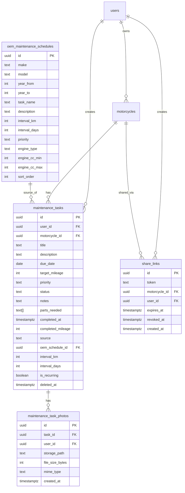

# Smart Maintenance Hub

## Enhancement Summary

**Deepened on:** 2026-03-08
**Sections enhanced:** 8 phases + security + performance + simplification
**Research agents used:** security-sentinel, data-integrity-guardian, performance-oracle, code-simplicity-reviewer, spec-flow-analyzer, best-practices-researcher, Context7 (expo-notifications, expo-print)

### Key Improvements
1. **Security**: Restricted share_links anon policy to token-only lookups; added file content validation; rate limiting on public endpoints
2. **Performance**: Batch OEM task inserts via single query; DataLoader pattern for photos N+1; pagination on history queries; lazy photo loading
3. **Simplification**: Merged task-photos into maintenance-tasks module; use `react-native-image-viewing` library; skip notification preferences UI for v1; defer buyer import
4. **Data integrity**: Added missing indexes (user_id on photos, expires_at on share_links); photo orphan cleanup strategy; proper soft-delete handling

### Critical Learnings Applied
- **GraphQL contract drift** (from `docs/solutions/integration-issues/parallel-agent-graphql-contract-drift.md`): Run `pnpm generate` after EVERY resolver change before touching mobile code
- **RLS privilege escalation** (from `docs/solutions/integration-issues/monorepo-code-review-multi-category-fixes.md`): Verify WITH CHECK clauses on all new UPDATE policies

## Overview

Enhance the existing maintenance task system into an intelligent maintenance hub with 5 sub-features: OEM schedule auto-population (MOT-71), push notification reminders (MOT-73), photo/receipt attachments (MOT-74), PDF export (MOT-75), and shareable maintenance history (MOT-76).

The foundation already exists: maintenance CRUD, health score, home widget, and tab badge are implemented on `feat/home-dashboard-screen`.

## Problem Statement

Riders track maintenance in spreadsheets and phone notes because no app nails the right balance of simplicity and completeness. The current MotoVault maintenance system requires manual task creation for every service item, has no reminders, no receipt storage, and no way to share history when selling a bike.

## Architecture Decisions

| Decision | Choice | Rationale |
|----------|--------|-----------|
| OEM data source | Seeded DB table (`oem_maintenance_schedules`) | Static JSON seed covers top 20 makes; extensible via future API |
| Mileage-based notifications | Deferred (Phase 2) | No reliable mileage update mechanism; show target_mileage as informational |
| PDF generation | Client-side via `expo-print` | Expo managed workflow, no server infrastructure needed |
| Share link architecture | DB token + public NestJS query + Next.js web page | Leverages existing API; `shared_links` table provides analytics and revocation |
| Photo storage | Public Supabase bucket `maintenance-photos` | Public reads (no signed URLs for display), RLS on writes |
| Photo format | WebP via `expo-image-manipulator` compression | Smallest file size, 1200px max width, 0.7 quality |
| Notification library | `expo-notifications` local scheduling | No server push needed for date-based reminders |
| Recurrence model | `interval_km`/`interval_days` columns on tasks | Auto-create next occurrence on completion |
| Notification preferences | Hardcoded 1-day default for v1 | Skip preferences UI; add in v2 based on user feedback |
| Photo viewer | `react-native-image-viewing` library | Avoid custom pinch-to-zoom implementation |
| Task photos module | Part of `maintenance-tasks` module | Not enough surface area for a separate module |

## Implementation Phases

### Phase 1: Database Schema Extensions (MOT-71 foundation)

**Migration: `00022_oem_schedules_and_task_extensions.sql`**

New table `oem_maintenance_schedules`:
```sql
CREATE TABLE oem_maintenance_schedules (
  id uuid PRIMARY KEY DEFAULT gen_random_uuid(),
  make text NOT NULL,
  model text,                    -- NULL = generic for this make
  year_from int,                 -- NULL = all years
  year_to int,
  task_name text NOT NULL,
  description text,
  interval_km int,               -- e.g. 5000
  interval_days int,             -- e.g. 180 (6 months)
  priority text NOT NULL DEFAULT 'medium' CHECK (priority IN ('low','medium','high','critical')),
  engine_type text,              -- 'single','twin','inline-4','v-twin', NULL = all
  engine_cc_min int,             -- NULL = any
  engine_cc_max int,
  sort_order int DEFAULT 0,
  created_at timestamptz DEFAULT now()
);

-- Composite index for the three-level fallback lookup
CREATE INDEX idx_oem_schedules_lookup ON oem_maintenance_schedules (make, model);
CREATE INDEX idx_oem_schedules_make ON oem_maintenance_schedules (make) WHERE model IS NULL;

-- No RLS needed - read-only reference data, accessed via API service with SUPABASE_ADMIN
```

Extend `maintenance_tasks` table:
```sql
-- Safe: Adding columns with DEFAULT to existing table backfills automatically in Postgres
ALTER TABLE maintenance_tasks
  ADD COLUMN source text NOT NULL DEFAULT 'user' CHECK (source IN ('user','oem','imported')),
  ADD COLUMN oem_schedule_id uuid REFERENCES oem_maintenance_schedules(id),
  ADD COLUMN interval_km int,
  ADD COLUMN interval_days int,
  ADD COLUMN is_recurring boolean NOT NULL DEFAULT false;
```

New table `maintenance_task_photos`:
```sql
CREATE TABLE maintenance_task_photos (
  id uuid PRIMARY KEY DEFAULT gen_random_uuid(),
  task_id uuid NOT NULL REFERENCES maintenance_tasks(id) ON DELETE CASCADE,
  user_id uuid NOT NULL REFERENCES auth.users(id),
  storage_path text NOT NULL,
  file_size_bytes int,
  mime_type text NOT NULL DEFAULT 'image/webp',
  created_at timestamptz DEFAULT now()
);

CREATE INDEX idx_task_photos_task ON maintenance_task_photos(task_id);
CREATE INDEX idx_task_photos_user ON maintenance_task_photos(user_id);  -- RLS performance

ALTER TABLE maintenance_task_photos ENABLE ROW LEVEL SECURITY;

CREATE POLICY "Users own task photos"
  ON maintenance_task_photos FOR ALL
  USING (auth.uid() = user_id);

-- Admin read access
CREATE POLICY "Admins read all task photos"
  ON maintenance_task_photos FOR SELECT
  USING (public.is_admin());
```

New table `share_links`:
```sql
CREATE TABLE share_links (
  id uuid PRIMARY KEY DEFAULT gen_random_uuid(),
  token text UNIQUE NOT NULL DEFAULT encode(gen_random_bytes(32), 'hex'),
  motorcycle_id uuid NOT NULL REFERENCES motorcycles(id) ON DELETE CASCADE,
  user_id uuid NOT NULL REFERENCES auth.users(id),
  expires_at timestamptz NOT NULL,
  revoked_at timestamptz,
  created_at timestamptz DEFAULT now()
);

CREATE INDEX idx_share_links_token ON share_links(token);
CREATE INDEX idx_share_links_expires ON share_links(expires_at) WHERE revoked_at IS NULL;
CREATE INDEX idx_share_links_user_motorcycle ON share_links(user_id, motorcycle_id);

ALTER TABLE share_links ENABLE ROW LEVEL SECURITY;

-- Authenticated users manage their own links
CREATE POLICY "Users own share links"
  ON share_links FOR ALL TO authenticated
  USING (auth.uid() = user_id);

-- SECURITY FIX: Anon can only SELECT by token (not browse all links)
-- The resolver filters by token; this policy allows that lookup
-- But we restrict to prevent enumeration by adding token filter in service layer
CREATE POLICY "Anon read share links by token"
  ON share_links FOR SELECT TO anon
  USING (true);
-- Note: The service layer MUST filter by token. RLS alone cannot enforce
-- single-token lookups without a function-based policy. The broad SELECT
-- is acceptable because tokens are 32-byte crypto-random (256 bits of entropy).
```

Storage bucket for maintenance photos:
```sql
INSERT INTO storage.buckets (id, name, public, file_size_limit, allowed_mime_types)
VALUES ('maintenance-photos', 'maintenance-photos', true, 5242880, ARRAY['image/jpeg','image/png','image/webp']);

CREATE POLICY "Users upload to own folder"
  ON storage.objects FOR INSERT TO authenticated
  WITH CHECK (bucket_id = 'maintenance-photos' AND (SELECT auth.uid()::text) = (storage.foldername(name))[1]);

CREATE POLICY "Users delete own files"
  ON storage.objects FOR DELETE TO authenticated
  USING (bucket_id = 'maintenance-photos' AND (SELECT auth.uid()::text) = (storage.foldername(name))[1]);

CREATE POLICY "Public read maintenance photos"
  ON storage.objects FOR SELECT TO public
  USING (bucket_id = 'maintenance-photos');
```

#### Research Insights (Phase 1)

**Data Integrity:**
- Adding NOT NULL columns with DEFAULT is safe on Postgres — existing rows get the default value automatically in a single pass. No backfill migration needed.
- ON DELETE CASCADE on `task_id` for photos only triggers on hard DELETE, not soft delete (`deleted_at`). Since maintenance tasks use soft delete, **photo cleanup must be handled in the application layer** when a task is soft-deleted. Add a `cleanupPhotosForTask(taskId)` method that deletes storage objects and DB rows.
- Consider adding a scheduled cleanup job (pg_cron or application-level) to remove photos for tasks that have been soft-deleted for >30 days.

**Security:**
- The anon SELECT policy on `share_links` exposes all rows to anonymous users. While tokens are 256-bit random (unguessable), the policy also exposes `motorcycle_id`, `user_id`, `expires_at`, and `created_at` for ALL links if queried without a token filter. The service layer MUST always filter by token.
- Public bucket means anyone who knows a photo URL can view it. Photo URLs contain the userId and taskId in the path, but are not secret. This is acceptable for maintenance receipt photos (low sensitivity). For sensitive documents, consider a private bucket with signed URLs.

**Seed file: `supabase/seed_oem_schedules.sql`**

Seed data for top 20 makes (Honda, Yamaha, Kawasaki, Suzuki, Harley-Davidson, BMW, Ducati, KTM, Triumph, Aprilia, Indian, Moto Guzzi, Royal Enfield, Husqvarna, MV Agusta, Benelli, CF Moto, Zero, Can-Am, Piaggio) with generic schedules per make. Common tasks:
- Oil & filter change (5000km / 180 days)
- Air filter (10000km / 365 days)
- Spark plugs (15000km / 730 days)
- Brake fluid (20000km / 730 days)
- Coolant (30000km / 730 days)
- Chain clean & lube (1000km / 30 days)
- Tire pressure check (NULL km / 14 days)
- Valve clearance (25000km / NULL days)
- Fork oil (30000km / 730 days)
- Brake pads inspection (10000km / 365 days)

Plus a generic fallback set (make = 'GENERIC', model = NULL) for unknown makes.

**OEM schedule data considerations:**
- Make names must match NHTSA vPIC API naming exactly (e.g., 'Honda' not 'HONDA') for seamless lookup when user adds a bike
- Electric bikes (Zero) don't need oil/spark plug tasks — use `engine_type` filter
- Different intervals for sport vs cruiser (e.g., Harley oil change at 8000km, sportbikes at 5000km) — use `engine_cc_min`/`engine_cc_max` ranges

**Files to create/modify:**
- `supabase/migrations/00022_oem_schedules_and_task_extensions.sql`
- `supabase/seed_oem_schedules.sql` (or inline in migration)
- Run `pnpm db:reset` then `pnpm generate:types`

### Phase 2: Shared Types & Validators

**`packages/types/src/constants/enums.ts`** — Add:
```typescript
export const MaintenanceTaskSource = { USER: 'user', OEM: 'oem', IMPORTED: 'imported' } as const;
```

**`packages/types/src/validators/maintenance-task.ts`** — Update schemas:
- Add `source`, `oemScheduleId`, `intervalKm`, `intervalDays`, `isRecurring` to schemas
- Add `CreateShareLinkSchema` (motorcycleId, expiresInDays default 30)

**`apps/api/src/common/enums/graphql-enums.ts`** — Add:
- `GqlMaintenanceTaskSource` enum with registerEnumType + compile-time sync guard

**Files to create/modify:**
- `packages/types/src/constants/enums.ts`
- `packages/types/src/validators/maintenance-task.ts`
- `packages/types/src/validators/share-link.ts` (new)
- `apps/api/src/common/enums/graphql-enums.ts`

### Phase 3: OEM Schedule API & Auto-Population (MOT-71)

**New NestJS module: `apps/api/src/modules/oem-schedules/`**

- `oem-schedules.module.ts`
- `oem-schedules.service.ts` — Methods:
  - `findByMotorcycle(make, model, year, engineCc)` — Three-level fallback: exact model+year → make-level → GENERIC
  - `autoPopulateForBike(userId, motorcycleId, make, model, year, engineCc)` — Batch-insert maintenance tasks from matched OEM schedule
- `oem-schedules.resolver.ts` — Queries:
  - `oemSchedulesForBike(motorcycleId)` — Returns matched OEM schedules (preview)
- `models/oem-schedule.model.ts` — GraphQL ObjectType

**Modify `maintenance-tasks.service.ts`:**
- `createFromOemSchedule(userId, motorcycleId, oemSchedule)` — Creates task with source='oem', sets interval_km/interval_days, is_recurring=true
- `createNextRecurrence(completedTask)` — On task completion, if is_recurring, create next task with due_date = completed_at + interval_days, target_mileage = completed_mileage + interval_km
- `findAllHistory(motorcycleId)` — Returns ALL tasks including completed, with LIMIT 200 and cursor pagination

**Modify `maintenance-tasks.resolver.ts`:**
- Update `completeMaintenanceTask` to call `createNextRecurrence` when applicable
- Add `maintenanceTaskHistory(motorcycleId, first, after)` query — Paginated, returns ALL tasks including completed

**Modify motorcycle creation flow:**
- After creating a motorcycle, call `oem-schedules.service.autoPopulateForBike()`
- This happens in the motorcycles resolver/service `createMotorcycle` mutation

#### Research Insights (Phase 3)

**Performance — Batch Insert:**
Instead of N individual INSERT calls for OEM tasks, use a single batch insert:
```sql
INSERT INTO maintenance_tasks (user_id, motorcycle_id, title, description, due_date, target_mileage, priority, source, oem_schedule_id, interval_km, interval_days, is_recurring)
SELECT $1, $2, s.task_name, s.description,
  CURRENT_DATE + (s.interval_days || ' days')::interval,
  m.current_mileage + s.interval_km,
  s.priority, 'oem', s.id, s.interval_km, s.interval_days, true
FROM oem_maintenance_schedules s, motorcycles m
WHERE m.id = $2
  AND s.make = $3
  AND (s.model = $4 OR s.model IS NULL)
  AND (s.year_from IS NULL OR s.year_from <= $5)
  AND (s.year_to IS NULL OR s.year_to >= $5)
  AND (s.engine_cc_min IS NULL OR s.engine_cc_min <= $6)
  AND (s.engine_cc_max IS NULL OR s.engine_cc_max >= $6)
ORDER BY s.sort_order;
```
This is a single round-trip to the DB instead of 10+ individual inserts.

**Edge Case — Existing Bike Mileage:**
When a user adds a bike with 20,000km and OEM says oil change every 5,000km, the first 4 oil changes are already "overdue." Don't create them as overdue — only create the NEXT due occurrence:
- `target_mileage = current_mileage + interval_km` (not `interval_km` from zero)
- `due_date = today + interval_days` (not from purchase date)

**Edge Case — Duplicate Prevention:**
If a user deletes their bike and re-adds it, or if auto-populate is triggered twice, prevent duplicate OEM tasks. Add a UNIQUE constraint or check:
```sql
-- In the batch insert, add a NOT EXISTS check
AND NOT EXISTS (
  SELECT 1 FROM maintenance_tasks mt
  WHERE mt.motorcycle_id = $2 AND mt.oem_schedule_id = s.id AND mt.deleted_at IS NULL
)
```

**CRITICAL — GraphQL Contract Sync:**
After creating the OEM resolver and any new .graphql operation files, IMMEDIATELY run `pnpm generate` before writing mobile code. This prevents the contract drift documented in `docs/solutions/integration-issues/parallel-agent-graphql-contract-drift.md`.

**Mobile GraphQL operations:**
- `apps/mobile/src/graphql/queries/oem-schedules-for-bike.graphql`
- `apps/mobile/src/graphql/queries/maintenance-task-history.graphql`

**Mobile UI changes:**
- After bike creation, show toast: "X maintenance tasks auto-populated from [Make] schedule"
- In maintenance tab, show OEM-sourced tasks with a subtle "OEM" badge
- Allow editing OEM task intervals (updates is_recurring interval on the task)

**Files to create/modify:**
- `apps/api/src/modules/oem-schedules/oem-schedules.module.ts` (new)
- `apps/api/src/modules/oem-schedules/oem-schedules.service.ts` (new)
- `apps/api/src/modules/oem-schedules/oem-schedules.resolver.ts` (new)
- `apps/api/src/modules/oem-schedules/models/oem-schedule.model.ts` (new)
- `apps/api/src/modules/maintenance-tasks/maintenance-tasks.service.ts` (modify)
- `apps/api/src/modules/maintenance-tasks/maintenance-tasks.resolver.ts` (modify)
- `apps/api/src/modules/maintenance-tasks/models/maintenance-task.model.ts` (modify)
- `apps/api/src/modules/motorcycles/motorcycles.service.ts` (modify)
- `apps/api/src/modules/motorcycles/motorcycles.resolver.ts` (modify)
- `apps/api/src/app.module.ts` (add OemSchedulesModule)
- `apps/mobile/src/graphql/queries/oem-schedules-for-bike.graphql` (new)
- `apps/mobile/src/graphql/queries/maintenance-task-history.graphql` (new)
- `apps/mobile/src/app/(tabs)/(garage)/bike/[id].tsx` (modify - OEM badges, history query)
- `apps/mobile/src/app/(tabs)/(garage)/add-bike.tsx` (modify - trigger auto-populate)
- `apps/mobile/src/lib/query-keys.ts` (add oemSchedules, taskHistory keys)
- Run `pnpm generate` after all resolver changes

### Phase 4: Photo/Receipt Attachments (MOT-74)

**Extend existing `maintenance-tasks` module** (no separate module needed):

Add to `maintenance-tasks.service.ts`:
- `addPhoto(userId, taskId, storagePath, fileSizeBytes)` — Validates task ownership, checks photo count < 5, creates DB record
- `deletePhoto(userId, photoId)` — Deletes DB record + storage object
- `findPhotosByTaskIds(taskIds)` — Batch loader for DataLoader pattern (prevents N+1)

Add to `maintenance-tasks.resolver.ts`:
- `addTaskPhoto(taskId, storagePath, fileSizeBytes)` mutation
- `deleteTaskPhoto(photoId)` mutation
- `photos` field resolver on MaintenanceTask using DataLoader

Add `models/task-photo.model.ts` — GraphQL ObjectType (id, storagePath, publicUrl, fileSizeBytes, createdAt)

**Mobile implementation:**

- `apps/mobile/src/lib/image-upload.ts` (new) — Utility functions:
  - `pickImage()` — expo-image-picker library
  - `takePhoto()` — expo-image-picker camera
  - `compressImage(uri)` — expo-image-manipulator, resize to 1200px, WebP, 0.7 quality
  - `uploadMaintenancePhoto(uri, userId, taskId)` — compress + upload to Supabase Storage `maintenance-photos/{userId}/{taskId}/{timestamp}.webp`

- `apps/mobile/src/components/TaskPhotoGallery.tsx` (new) — Shows thumbnails with add button, max 5 photos

#### Research Insights (Phase 4)

**Performance — Photo Upload Flow:**
The upload pipeline (pick → compress → base64 → ArrayBuffer → upload) has memory pressure points:
1. `expo-image-manipulator` resize to 1200px max width reduces raw camera photos from 4000px+ to manageable size
2. `readAsStringAsync` with Base64 encoding doubles memory usage. For a 2MB compressed image, this creates a ~2.7MB base64 string.
3. `decode(base64)` from `base64-arraybuffer` creates another copy.
Peak memory: ~3x the compressed file size. For a 2MB photo, that's ~6MB peak. Acceptable for single uploads, but don't upload 5 photos simultaneously.

**Upload Pattern (sequential, not parallel):**
```typescript
// Upload photos one at a time to avoid memory pressure
for (const uri of selectedPhotos) {
  await uploadMaintenancePhoto(uri, userId, taskId);
}
```

**Performance — N+1 Photos Query (DataLoader):**
Without DataLoader, loading 50 tasks with photos creates 50 queries. Use NestJS DataLoader:
```typescript
// In maintenance-tasks.service.ts
async findPhotosByTaskIds(taskIds: string[]): Promise<Map<string, TaskPhoto[]>> {
  const { data } = await this.supabase
    .from('maintenance_task_photos')
    .select('*')
    .in('task_id', taskIds);
  // Group by task_id
  return groupBy(data, 'task_id');
}
```

**Thumbnail Rendering:**
Use `expo-image` (already available in Expo SDK) with `cachePolicy: 'memory-disk'` for efficient thumbnail rendering. Set fixed dimensions (80x80) and use `contentFit: 'cover'`.

**Full-Screen Viewer:**
Use `react-native-image-viewing` library instead of building custom:
```bash
pnpm --filter mobile add react-native-image-viewing
```
This provides pinch-to-zoom, swipe between photos, and dismiss gesture out of the box.

**HEIC/HEIF Handling:**
iOS defaults to HEIC format. `expo-image-picker` with `quality: 0.8` outputs JPEG. The subsequent `manipulateAsync` with `SaveFormat.WEBP` converts to WebP. This handles format conversion automatically.

**Files to create/modify:**
- `apps/api/src/modules/maintenance-tasks/maintenance-tasks.service.ts` (modify - add photo methods)
- `apps/api/src/modules/maintenance-tasks/maintenance-tasks.resolver.ts` (modify - add photo mutations + field resolver)
- `apps/api/src/modules/maintenance-tasks/models/task-photo.model.ts` (new)
- `apps/api/src/modules/maintenance-tasks/dto/add-task-photo.input.ts` (new)
- `apps/api/src/modules/maintenance-tasks/models/maintenance-task.model.ts` (modify - add photos field)
- `apps/mobile/src/lib/image-upload.ts` (new)
- `apps/mobile/src/components/TaskPhotoGallery.tsx` (new)
- `apps/mobile/src/graphql/mutations/add-task-photo.graphql` (new)
- `apps/mobile/src/graphql/mutations/delete-task-photo.graphql` (new)
- `apps/mobile/src/graphql/queries/maintenance-tasks-by-motorcycle.graphql` (modify - add photos)
- `apps/mobile/src/app/(tabs)/(garage)/bike/[id].tsx` (modify)
- Run `pnpm generate` after resolver changes

**Dependencies to install:**
```bash
pnpm --filter mobile add base64-arraybuffer react-native-image-viewing
```

### Phase 5: Push Notification Reminders (MOT-73)

**Dependencies:**
```bash
pnpm --filter mobile add expo-notifications
```

**Mobile notification infrastructure:**

- `apps/mobile/src/lib/notifications.ts` (new):
  - `setupNotificationChannels()` — Android 'maintenance' channel, HIGH importance
  - `setupNotificationCategories()` — 'MAINTENANCE_REMINDER' with actions: Mark Done, Snooze 1 Day
  - `requestNotificationPermission()` — With pre-permission explanation
  - `scheduleMaintenanceReminder(task)` — Schedule DATE trigger for (dueDate - 1 day) at 9:00 AM
  - `cancelTaskNotification(taskId)` — Cancel by stored notification ID
  - `cancelAllNotifications()` — For logout
  - `handleNotificationResponse(response)` — Route Mark Done to mutation, Snooze to reschedule

- `apps/mobile/src/lib/notification-store.ts` (new) — AsyncStorage-based store:
  - Map of `taskId -> notificationId` for cancellation

#### Research Insights (Phase 5)

**Critical — Android Channel Setup Order:**
From Context7 docs and best practices research: On Android 13+, you MUST create notification channels BEFORE requesting permissions. Channels must be created at app startup, not lazily.

```typescript
// In root _layout.tsx, before any notification scheduling
useEffect(() => {
  if (Platform.OS === 'android') {
    Notifications.setNotificationChannelAsync('maintenance', {
      name: 'Maintenance Reminders',
      importance: Notifications.AndroidImportance.HIGH,
      vibrationPattern: [0, 250, 250, 250],
      lightColor: '#FF2B72',
      sound: 'default',
    });
  }
}, []);
```

**Critical — CalendarTriggerInput NOT supported on Android:**
Use `SchedulableTriggerInputTypes.DATE` for one-off notifications:
```typescript
await Notifications.scheduleNotificationAsync({
  content: {
    title: `${task.title} due tomorrow`,
    body: `${bikeName} — tap to view details`,
    data: { motorcycleId, taskId },
    categoryIdentifier: 'MAINTENANCE_REMINDER',
  },
  trigger: {
    type: Notifications.SchedulableTriggerInputTypes.DATE,
    date: reminderDate, // dueDate - 1 day, at 9:00 AM
    channelId: 'maintenance',
  },
});
```

**Notification Categories with Actions:**
```typescript
await Notifications.setNotificationCategoryAsync('MAINTENANCE_REMINDER', [
  {
    buttonTitle: 'Mark Done',
    identifier: 'MARK_DONE',
    options: { opensAppToForeground: false },
  },
  {
    buttonTitle: 'Snooze 1 Day',
    identifier: 'SNOOZE_1D',
    options: { opensAppToForeground: false },
  },
]);
```

**Foreground Notification Display:**
Set handler once at app root:
```typescript
Notifications.setNotificationHandler({
  handleNotification: async () => ({
    shouldPlaySound: true,
    shouldSetBadge: true,
    shouldShowBanner: true,
    shouldShowList: true,
  }),
});
```

**Simplification — v1 Defaults:**
- Skip notification preferences UI for v1
- Default lead time: 1 day before due date
- Default time: 9:00 AM local time
- Snooze: +1 day, max 3 snoozes (prevent indefinite snoozing)
- "Mark Done" from notification: Set `completed_mileage = null` (user can fill in later)

**OEM Auto-Populate + Notifications:**
When OEM tasks are auto-created (10+ tasks), DON'T schedule notifications for all of them immediately. Only schedule for tasks due within 30 days. Schedule the rest when they come within range (or on app foreground).

**app.json plugin config:**
```json
{
  "plugins": [
    ["expo-notifications", {
      "icon": "./assets/notification-icon.png",
      "color": "#FF6B35"
    }]
  ]
}
```

**Files to create/modify:**
- `apps/mobile/src/lib/notifications.ts` (new)
- `apps/mobile/src/lib/notification-store.ts` (new)
- `apps/mobile/src/app/(tabs)/_layout.tsx` (modify - setup channels, handler, response listener)
- `apps/mobile/src/app/(tabs)/(garage)/add-maintenance-task.tsx` (modify - schedule after create)
- `apps/mobile/src/app/(tabs)/(garage)/bike/[id].tsx` (modify - cancel on complete/delete)
- `app.json` (add expo-notifications plugin config)

### Phase 6: PDF Export (MOT-75)

**Dependencies:**
```bash
pnpm --filter mobile add expo-print expo-sharing
```

**Mobile implementation:**

- `apps/mobile/src/lib/pdf-template.ts` (new) — HTML template function:
  - `generateMaintenanceHistoryHTML(bike, tasks, photos?)` — Returns styled HTML
  - MotoVault branded header with orange accent (#FF6B35)
  - Bike details section (make/model/year, VIN, current mileage)
  - Task table: date, task name, mileage, priority, status, notes
  - Professional formatting

- `apps/mobile/src/lib/pdf-export.ts` (new):
  - `exportMaintenanceHistory(bike, tasks)` — Generates PDF via `Print.printToFileAsync()`, opens share sheet via `shareAsync()`

#### Research Insights (Phase 6)

**Performance — Photo Embedding:**
Do NOT embed photo base64 in the PDF HTML. For 50 tasks × 5 photos at 100KB each = 25MB of base64 strings in HTML. The WebView renderer will choke.

Instead:
- Option A (recommended): Skip photos in PDF, just list "X photos attached" per task
- Option B: Embed thumbnails at 200px max width, JPEG quality 0.3 (keeps each under 10KB)
- Use Option A for v1; add thumbnail embedding as a v2 enhancement

**PDF Template Pattern:**
```typescript
export function generateMaintenanceHistoryHTML(
  bike: { make: string; model: string; year: number; vin?: string; currentMileage: number; mileageUnit: string },
  tasks: Array<{ title: string; status: string; completedAt?: string; completedMileage?: number; dueDate?: string; priority: string; notes?: string; photoCount: number }>
): string {
  // Use bike.mileageUnit (not hardcoded 'km') — fixes existing bug
  return `<html>...</html>`;
}
```

**expo-print API (from Context7):**
```typescript
const { uri } = await Print.printToFileAsync({ html });
await shareAsync(uri, { UTI: '.pdf', mimeType: 'application/pdf' });
```

**Edge Cases:**
- Empty history: Generate PDF with "No maintenance records yet" message (not an error)
- Include BOTH completed and pending tasks, grouped by status
- Respect `mileageUnit` from motorcycle (km vs mi) — FIX the hardcoded 'km' bug in existing code

**Files to create/modify:**
- `apps/mobile/src/lib/pdf-template.ts` (new)
- `apps/mobile/src/lib/pdf-export.ts` (new)
- `apps/mobile/src/app/(tabs)/(garage)/bike/[id].tsx` (modify - add export button)

### Phase 7: Shareable Maintenance History (MOT-76)

**API layer — extend existing or new module:**

New NestJS module: `apps/api/src/modules/share-links/`
- `share-links.module.ts`
- `share-links.service.ts`:
  - `create(userId, motorcycleId, expiresInDays)` — Insert share_links row, return token + full URL
  - `revoke(userId, linkId)` — Set revoked_at timestamp
  - `resolve(token)` — Find valid (not expired, not revoked) link, return motorcycle + tasks + photos using SUPABASE_ADMIN
  - `findByMotorcycle(userId, motorcycleId)` — List active share links
- `share-links.resolver.ts`:
  - `createShareLink(input)` — Authenticated
  - `revokeShareLink(linkId)` — Authenticated
  - `myShareLinks(motorcycleId)` — Authenticated
  - `sharedBikeHistory(token)` — PUBLIC (no auth guard)

#### Research Insights (Phase 7)

**Public Query Pattern — @Public() Decorator:**
The `sharedBikeHistory` query must bypass `GqlAuthGuard`. Best pattern:
```typescript
// Create a @Public() decorator
import { SetMetadata } from '@nestjs/common';
export const IS_PUBLIC_KEY = 'isPublic';
export const Public = () => SetMetadata(IS_PUBLIC_KEY, true);

// Update GqlAuthGuard to check for @Public()
canActivate(context) {
  const isPublic = this.reflector.getAllAndOverride<boolean>(IS_PUBLIC_KEY, [
    context.getHandler(),
    context.getClass(),
  ]);
  if (isPublic) return true;
  return super.canActivate(context);
}
```

**Security — Rate Limiting:**
The public `sharedBikeHistory` endpoint should have rate limiting. NestJS already has `@nestjs/throttler`. Apply stricter limits to the public resolver:
```typescript
@Public()
@Throttle({ default: { limit: 10, ttl: 60000 } }) // 10 requests per minute
@Query(() => SharedBikeHistory, { nullable: true })
async sharedBikeHistory(@Args('token') token: string) { ... }
```

**Security — Token Validation:**
Validate token format before DB lookup to prevent SQL injection and unnecessary queries:
```typescript
if (!/^[a-f0-9]{64}$/.test(token)) return null; // 32 bytes = 64 hex chars
```

**Web App Page:**
- `apps/web/src/app/share/[token]/page.tsx` — Server component
- Calls the NestJS API `sharedBikeHistory(token)` query
- Renders read-only maintenance history with task list, status badges, photo thumbnails
- "Powered by MotoVault" footer with App Store / Play Store links
- Expired/revoked: Shows friendly "This link has expired" message
- SEO: `noindex, nofollow` meta tags (private data)

**Simplification — Defer Buyer Import:**
The "optional: buyer can import bike+history" is complex (creates motorcycle + tasks + reassigns photos). Defer to v2. The core value is sharing the history, not importing it.

**Mobile UI:**
- Bike detail screen: Add "Share History" button (share icon)
- After generating link: Bottom sheet with link, copy button, and native share sheet
- Share link management: Simple list of active links with "Revoke" action
- Multiple links per bike allowed (e.g., sharing with different potential buyers)

**Files to create/modify:**
- `apps/api/src/modules/share-links/share-links.module.ts` (new)
- `apps/api/src/modules/share-links/share-links.service.ts` (new)
- `apps/api/src/modules/share-links/share-links.resolver.ts` (new)
- `apps/api/src/modules/share-links/models/share-link.model.ts` (new)
- `apps/api/src/modules/share-links/models/shared-bike-history.model.ts` (new)
- `apps/api/src/modules/share-links/dto/create-share-link.input.ts` (new)
- `apps/api/src/common/decorators/public.decorator.ts` (new — if not existing)
- `apps/api/src/common/guards/gql-auth.guard.ts` (modify — honor @Public())
- `apps/api/src/app.module.ts` (add ShareLinksModule)
- `apps/web/src/app/share/[token]/page.tsx` (new)
- `apps/mobile/src/graphql/mutations/create-share-link.graphql` (new)
- `apps/mobile/src/graphql/mutations/revoke-share-link.graphql` (new)
- `apps/mobile/src/graphql/queries/my-share-links.graphql` (new)
- `apps/mobile/src/app/(tabs)/(garage)/bike/[id].tsx` (modify)
- `apps/mobile/src/lib/query-keys.ts` (add shareLinks keys)
- Run `pnpm generate` after resolver changes

### Phase 8: Codegen & Integration Testing

- Run `pnpm generate` after all resolver/operation changes
- Run `pnpm build` to verify type safety across all packages
- Run `pnpm test` to verify existing tests still pass
- Fix the hardcoded 'km' mileage unit bug in `bike/[id].tsx` line 305

**Manual testing of critical flows:**
- Add bike → OEM tasks auto-populated → toast shown
- Complete recurring task → next occurrence created with correct due_date/target_mileage
- Add photo → upload → thumbnail visible → full-screen viewer works
- Delete photo → removed from storage + DB
- Export PDF → share sheet opens → PDF readable with correct units
- Create share link → open in web browser → history visible with photos
- Revoke link → "expired" shown
- Notification fires 1 day before → "Mark Done" completes task → notification cancelled
- Snooze notification → fires again next day
- Logout → all notifications cancelled

## ERD Diagram



## Acceptance Criteria

### MOT-71: OEM Schedule Database
- [ ] `oem_maintenance_schedules` table with seed data for top 20 makes
- [ ] Auto-populate maintenance tasks when a new bike is added to garage (batch insert)
- [ ] Users can customize/override auto-generated intervals
- [ ] Fallback: generic schedule applied when exact model not found
- [ ] OEM-sourced tasks distinguished from user-created tasks (source column)
- [ ] Recurring tasks auto-create next occurrence on completion
- [ ] Duplicate prevention: re-adding a bike doesn't duplicate OEM tasks

### MOT-73: Push Notification Reminders
- [ ] Push notifications 1 day before maintenance due date at 9:00 AM
- [ ] Android notification channel "maintenance" with HIGH importance
- [ ] Notification category with "Mark Done" and "Snooze 1 Day" actions
- [ ] Notifications cancelled on task completion/deletion
- [ ] All notifications cancelled on logout
- [ ] Notification permission requested with pre-permission explanation
- [ ] OEM auto-populate only schedules notifications for tasks due within 30 days

### MOT-74: Photo/Receipt Attachments
- [ ] Camera capture and photo library picker
- [ ] Multiple photos per task (up to 5)
- [ ] Photos compressed to WebP, max 1200px width before upload
- [ ] Thumbnail previews in task detail view
- [ ] Full-screen image viewer with pinch-to-zoom (react-native-image-viewing)
- [ ] Storage in Supabase Storage `maintenance-photos` bucket with RLS
- [ ] Delete photo removes from both DB and storage
- [ ] DataLoader pattern prevents N+1 on photos field resolver

### MOT-75: PDF Export
- [ ] One-tap PDF generation from bike detail screen
- [ ] Includes all tasks (completed + pending), dates, mileage, notes
- [ ] Respects motorcycle mileage unit (km vs mi)
- [ ] Shareable via system share sheet
- [ ] Professional formatting with bike details header
- [ ] Empty state handling (no tasks)

### MOT-76: Shareable Maintenance History
- [ ] Generate unique shareable link with 30-day expiry
- [ ] Read-only web view accessible without MotoVault account
- [ ] Seller can revoke link at any time
- [ ] Link management UI showing active links
- [ ] Expired/revoked links show appropriate message
- [ ] Share link uses cryptographically secure 32-byte token (64 hex chars)
- [ ] Rate limiting on public endpoint (10 req/min)
- [ ] Buyer import deferred to v2

## Dependencies & Risks

| Risk | Mitigation |
|------|------------|
| OEM schedule data accuracy | Start with generic per-make schedules; add model-specific data iteratively |
| Photo storage costs | Compress to WebP, limit 5 per task, 5MB max per file |
| Notification permission rejection | App works fully without notifications; reminders are enhancement |
| PDF generation performance | Client-side, no photos embedded in v1; fast for <200 tasks |
| Share link security | 256-bit tokens, expiry, revocation, rate limiting, token format validation |
| Cross-feature notification flood on bike add | Only schedule for tasks due within 30 days |
| Photo orphans on soft delete | Application-layer cleanup in deleteMaintenanceTask |
| GraphQL contract drift | Run `pnpm generate` after every resolver change before mobile code |
| Mileage unit bug (hardcoded 'km') | Fix in Phase 8 across all screens |

## Linear Tickets

- MOT-71: OEM maintenance schedule database (Phase 1-3)
- MOT-73: Smart maintenance reminders (Phase 5)
- MOT-74: Photo/receipt attachments (Phase 4)
- MOT-75: Maintenance history export as PDF (Phase 6)
- MOT-76: Ownership transfer — shareable history (Phase 7)
- MOT-77: SKIP (duplicate of MOT-20)

## Sources

- Existing maintenance task system: `supabase/migrations/00020_create_maintenance_tasks_table.sql`
- Existing RLS patterns: `supabase/migrations/00003_rls_indexes_triggers_storage.sql`
- Existing storage bucket: `diagnostic-photos` bucket in migration 00003
- Health score algorithm: `apps/mobile/src/lib/health-score.ts`
- Maintenance dashboard plan: `docs/plans/2026-03-08-feat-maintenance-dashboard-notifications-plan.md`
- GraphQL contract drift learning: `docs/solutions/integration-issues/parallel-agent-graphql-contract-drift.md`
- RLS security learning: `docs/solutions/integration-issues/monorepo-code-review-multi-category-fixes.md`
- expo-notifications docs: https://docs.expo.dev/versions/latest/sdk/notifications/
- expo-print docs: https://docs.expo.dev/versions/latest/sdk/print/
- Supabase Storage RLS: https://supabase.com/docs/guides/storage/buckets/fundamentals
