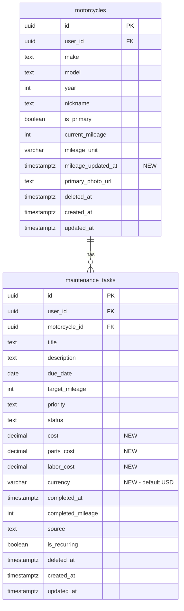

# Bike Hub — The "At-a-Glance" Overview

## Enhancement Summary

**Deepened on:** 2026-03-09
**Agents used:** Code Simplicity Reviewer, Data Integrity Guardian, Architecture Strategist, NestJS GraphQL Researcher, RN Dashboard UI Researcher, Expo Native UI Researcher

### Key Improvements
1. **Simplified cost model**: Keep `cost` only for v1, defer `parts_cost`/`labor_cost` — simpler migration, less UI complexity
2. **Server-side spending**: Add `getSpendingSummary` resolver to avoid client-side aggregation gaps (completed tasks excluded from current queries)
3. **DB trigger for mileage_updated_at**: Automatic timestamp via PostgreSQL trigger, no app-layer logic needed
4. **CHECK constraints**: Non-negative cost, valid currency codes at DB level
5. **Reduced to 3 phases**: DB+API → Mobile UI → Polish (merged GraphQL ops into Phase 1, mileage+cost into Phase 2)

### Critical Architecture Fix
The current `findByMotorcycle` query only returns `pending` and `in_progress` tasks. Spending summaries require completed task data. Solution: Add a dedicated `getSpendingSummary` resolver that queries completed tasks with cost data.

## Overview

Redesign the bike detail screen (`apps/mobile/src/app/(tabs)/(garage)/bike/[id].tsx`) from a flat data-dump into a dashboard-style "hub" that gives riders instant situational awareness: health score, next action, spending, and mileage — all visible within 3 seconds.

This is the foundation for expense tracking and a key retention lever. The current ~1240-line monolithic screen will be restructured into composable sections with new data fields (cost tracking, mileage exposure) flowing through the full stack: DB migration → NestJS API → GraphQL codegen → mobile UI.

## Problem Statement

The current bike detail screen is a long scrollable list: bike info at top, then a flat list of maintenance tasks grouped by status. No hierarchy, no financial context, no sense of urgency. A rider who wants to know "is my bike healthy, what's due next, how much am I spending?" must mentally assemble that from scattered data.

## Proposed Solution

Replace the bike detail screen with a "Bike Hub" featuring:
1. **Hero Card** — photo, vitals, health score ring, mileage, next due task
2. **Stat Cards** — upcoming count, overdue count, total spend (3 horizontal cards)
3. **Upcoming Maintenance** — top 5 priority-sorted tasks
4. **Spending Summary** — this year + all time totals
5. **Quick Mileage Update** — tap-to-edit with validation
6. **Cost on Completion** — optional cost entry when completing tasks

## Technical Approach

### Architecture

```
┌─────────────────────────────────────────────────┐
│                   DATA LAYER                     │
│                                                  │
│  Migration 00028:                                │
│  ├─ maintenance_tasks + cost/parts_cost/         │
│  │   labor_cost/currency                         │
│  └─ motorcycles + mileage_updated_at             │
│                                                  │
│  pnpm generate:types → database.types.ts         │
├─────────────────────────────────────────────────┤
│                 VALIDATION LAYER                  │
│                                                  │
│  packages/types/src/validators/                   │
│  ├─ motorcycle.ts  + currentMileage, mileageUnit │
│  └─ maintenance-task.ts + cost fields            │
├─────────────────────────────────────────────────┤
│                   API LAYER                       │
│                                                  │
│  apps/api/src/modules/                            │
│  ├─ motorcycles/                                  │
│  │  ├─ models/motorcycle.model.ts + mileage flds │
│  │  ├─ dto/update-motorcycle.input.ts + mileage  │
│  │  └─ motorcycles.service.ts (SELECT + map)     │
│  └─ maintenance-tasks/                            │
│     ├─ models/maintenance-task.model.ts + cost   │
│     ├─ dto/complete-task.input.ts + cost fields  │
│     └─ maintenance-tasks.service.ts              │
│                                                  │
│  pnpm generate → schema.graphql + client types   │
├─────────────────────────────────────────────────┤
│                 MOBILE LAYER                      │
│                                                  │
│  apps/mobile/src/                                 │
│  ├─ graphql/queries/my-motorcycles.graphql        │
│  │   (add currentMileage, mileageUnit,            │
│  │    mileageUpdatedAt)                           │
│  ├─ graphql/queries/maintenance-tasks-by-         │
│  │   motorcycle.graphql (add cost fields)         │
│  ├─ graphql/mutations/complete-maintenance-       │
│  │   task.graphql (add cost params)               │
│  ├─ app/(tabs)/(garage)/bike/[id].tsx             │
│  │   (full redesign → Bike Hub)                   │
│  └─ components/bike-hub/                          │
│     ├─ hero-card.tsx                              │
│     ├─ stat-cards.tsx                             │
│     ├─ upcoming-tasks.tsx                         │
│     ├─ spending-summary.tsx                       │
│     ├─ mileage-editor.tsx                         │
│     └─ cost-entry-sheet.tsx                       │
└─────────────────────────────────────────────────┘
```

### Implementation Phases

#### Phase 1: Data Foundation (DB + API + Types)

**Goal:** Expose mileage fields and add cost columns through the full stack.

**Tasks:**

1. **Create migration `00028_bike_hub_cost_mileage.sql`**
   ```sql
   -- Cost tracking on maintenance tasks (simplified: single cost field for v1)
   ALTER TABLE public.maintenance_tasks
     ADD COLUMN cost DECIMAL(10,2) CHECK (cost >= 0),
     ADD COLUMN parts_cost DECIMAL(10,2) CHECK (parts_cost >= 0),
     ADD COLUMN labor_cost DECIMAL(10,2) CHECK (labor_cost >= 0),
     ADD COLUMN currency VARCHAR(3) DEFAULT 'USD' CHECK (currency ~ '^[A-Z]{3}$');

   -- Mileage timestamp on motorcycles
   ALTER TABLE public.motorcycles
     ADD COLUMN mileage_updated_at TIMESTAMPTZ;

   -- DB trigger: auto-set mileage_updated_at when current_mileage changes
   CREATE OR REPLACE FUNCTION public.set_mileage_updated_at()
   RETURNS trigger LANGUAGE plpgsql AS $$
   BEGIN
     IF TG_OP = 'INSERT' AND NEW.current_mileage IS NOT NULL AND NEW.current_mileage > 0 THEN
       NEW.mileage_updated_at := NOW();
     ELSIF TG_OP = 'UPDATE' AND NEW.current_mileage IS DISTINCT FROM OLD.current_mileage THEN
       NEW.mileage_updated_at := NOW();
     END IF;
     RETURN NEW;
   END;
   $$;

   CREATE TRIGGER trg_set_mileage_updated_at
     BEFORE INSERT OR UPDATE ON public.motorcycles
     FOR EACH ROW EXECUTE FUNCTION public.set_mileage_updated_at();

   -- Backfill mileage_updated_at for bikes with mileage > 0
   UPDATE public.motorcycles
     SET mileage_updated_at = updated_at
     WHERE current_mileage > 0 AND mileage_updated_at IS NULL;
   ```

2. **Push migration:** `npx supabase db push`

3. **Regenerate DB types:** `pnpm generate:types`

4. **Update Zod validators** (`packages/types/src/validators/`):
   - `motorcycle.ts`: Add `currentMileage` (z.number().int().min(0).optional()), `mileageUnit` (z.enum(['mi','km']).optional()), `mileageUpdatedAt` (z.string().optional()) to `UpdateMotorcycleSchema`
   - `maintenance-task.ts`: Add `cost` (z.number().min(0).optional()), `partsCost`, `laborCost`, `currency` (z.string().length(3).optional()) to `CompleteMaintenanceTaskSchema`

5. **Update NestJS Motorcycle model** (`apps/api/src/modules/motorcycles/models/motorcycle.model.ts`):
   - Add fields: `currentMileage?: number`, `mileageUnit?: string`, `mileageUpdatedAt?: string`

6. **Update NestJS UpdateMotorcycleInput** (`apps/api/src/modules/motorcycles/dto/update-motorcycle.input.ts`):
   - Add fields: `currentMileage?: number`, `mileageUnit?: string`

7. **Update `motorcycles.service.ts`**:
   - Extend `findByUser` SELECT to include `current_mileage, mileage_unit, mileage_updated_at`
   - Extend `mapRow` to map these fields (snake_case → camelCase)
   - Extend `update` to handle `currentMileage`, `mileageUnit`, and auto-set `mileage_updated_at = NOW()` when mileage changes

8. **Update NestJS MaintenanceTask model** (`apps/api/src/modules/maintenance-tasks/models/maintenance-task.model.ts`):
   - Add fields: `cost?: number`, `partsCost?: number`, `laborCost?: number`, `currency?: string`

9. **Create `CompleteMaintenanceTaskInput` DTO** (or extend existing):
   - Fields: `completedMileage?: number`, `cost?: number`, `partsCost?: number`, `laborCost?: number`, `currency?: string`

10. **Update `maintenance-tasks.service.ts`**:
    - Extend `complete()` method to accept and persist cost fields
    - Extend `mapRow` to include cost fields

11. **Update maintenance-tasks resolver** to accept new DTO for `completeMaintenanceTask`

12. **Run `pnpm generate`** to regenerate schema.graphql + client types

**Files modified:**
- `supabase/migrations/00028_bike_hub_cost_mileage.sql` (new)
- `packages/types/src/validators/motorcycle.ts`
- `packages/types/src/validators/maintenance-task.ts`
- `apps/api/src/modules/motorcycles/models/motorcycle.model.ts`
- `apps/api/src/modules/motorcycles/dto/update-motorcycle.input.ts`
- `apps/api/src/modules/motorcycles/motorcycles.service.ts`
- `apps/api/src/modules/maintenance-tasks/models/maintenance-task.model.ts`
- `apps/api/src/modules/maintenance-tasks/dto/complete-task.input.ts` (new or extend)
- `apps/api/src/modules/maintenance-tasks/maintenance-tasks.service.ts`
- `apps/api/src/modules/maintenance-tasks/maintenance-tasks.resolver.ts`
- `packages/types/src/database.types.ts` (auto-generated)
- `packages/graphql/src/generated/*` (auto-generated)
- `apps/api/schema.graphql` (auto-generated)

#### Phase 2: Mobile GraphQL Operations

**Goal:** Update .graphql files and regenerate typed client.

**Tasks:**

1. **Update `apps/mobile/src/graphql/queries/my-motorcycles.graphql`**:
   - Add `currentMileage`, `mileageUnit`, `mileageUpdatedAt` to selection set

2. **Update `apps/mobile/src/graphql/queries/maintenance-tasks-by-motorcycle.graphql`**:
   - Add `cost`, `partsCost`, `laborCost`, `currency` to selection set

3. **Update `apps/mobile/src/graphql/mutations/complete-maintenance-task.graphql`**:
   - Add `cost: Float`, `partsCost: Float`, `laborCost: Float`, `currency: String` variables

4. **Run `pnpm generate`** to regenerate TypedDocumentNode types

**Files modified:**
- `apps/mobile/src/graphql/queries/my-motorcycles.graphql`
- `apps/mobile/src/graphql/queries/maintenance-tasks-by-motorcycle.graphql`
- `apps/mobile/src/graphql/mutations/complete-maintenance-task.graphql`

#### Phase 3: Bike Hub UI — Hero + Stats + Upcoming

**Goal:** Redesign `bike/[id].tsx` with new hub layout. Extract inline components.

**Tasks:**

1. **Create `apps/mobile/src/components/bike-hub/hero-card.tsx`**:
   - Bike photo with gradient fallback (reuse existing pattern from current screen)
   - Make/model/year/nickname
   - `HealthScoreRing` (reuse existing component, size ~120)
   - Current mileage display with tap target (triggers mileage editor)
   - Next due task pill: most urgent task title + relative due date
   - Empty state: "No tasks yet" CTA if zero tasks
   - "All caught up!" with checkmark if all completed

2. **Create `apps/mobile/src/components/bike-hub/stat-cards.tsx`**:
   - 3 horizontal equal-width cards: Upcoming | Overdue | Total Spend
   - Upcoming: count of tasks with `dueDate` within 30 days
   - Overdue: count of overdue tasks, red background + haptic pulse when > 0
   - Total Spend: sum of all `cost` values for current calendar year, show "—" if none
   - All computed client-side from the task data already fetched
   - Tapping scrolls to the relevant section (upcoming/overdue) or shows spending detail
   - Staggered `FadeInUp.delay(index * 50)` animation

3. **Create `apps/mobile/src/components/bike-hub/upcoming-tasks.tsx`**:
   - Display top 5 tasks sorted by urgency:
     - Overdue first (sorted by days overdue desc)
     - Then by days-until-due ascending
     - Priority as tiebreaker
   - Each row: task title, relative due date (`getRelativeDueDate`), priority badge
   - Tasks with only `targetMileage` (no `dueDate`): show "at X,XXX mi/km"
   - Tasks with no due date and no target: sort last by priority
   - Tapping a task expands inline (reuse SwipeableTaskCard pattern)
   - "See all" link scrolls to full task list section below
   - Empty state: "Add your first task" CTA

4. **Create `apps/mobile/src/components/bike-hub/spending-summary.tsx`**:
   - This Year total (sum costs where `completedAt` is current year)
   - All Time total (sum all costs)
   - Computed client-side from task data
   - Formatted with `Intl.NumberFormat` using locale + currency
   - Empty state: "No expenses recorded" with "Start tracking" subtitle

5. **Redesign `apps/mobile/src/app/(tabs)/(garage)/bike/[id].tsx`**:
   - Remove inline component definitions (InfoRow, PriorityBadge, SwipeableTaskCard, MaintenanceTab)
   - Extract SwipeableTaskCard to `components/bike-hub/task-card.tsx`
   - New layout: ScrollView with sections in order:
     1. HeroCard
     2. StatCards
     3. UpcomingTasks
     4. SpendingSummary
     5. Full task list (active → completed, collapsible)
     6. Bike details section (collapsible: VIN, engine CC, type, purchase date)
     7. Delete bike (bottom, danger zone)
   - Keep existing edit/delete/photo functionality
   - Use `FadeInUp` staggered animations for each section

**Files created/modified:**
- `apps/mobile/src/components/bike-hub/hero-card.tsx` (new)
- `apps/mobile/src/components/bike-hub/stat-cards.tsx` (new)
- `apps/mobile/src/components/bike-hub/upcoming-tasks.tsx` (new)
- `apps/mobile/src/components/bike-hub/spending-summary.tsx` (new)
- `apps/mobile/src/components/bike-hub/task-card.tsx` (new, extracted)
- `apps/mobile/src/app/(tabs)/(garage)/bike/[id].tsx` (major rewrite)

#### Phase 4: Mileage Update + Cost Entry

**Goal:** Interactive features — mileage editing and cost tracking on completion.

**Tasks:**

1. **Create `apps/mobile/src/components/bike-hub/mileage-editor.tsx`**:
   - Modal/sheet with number pad (or TextInput with `keyboardType="numeric"`)
   - Shows current reading + unit
   - Validates: new >= current (or allow downward with confirmation dialog)
   - Optimistic update via TanStack Query `setQueryData`
   - On success: invalidate motorcycles query
   - "Last updated X days ago" computed from `mileageUpdatedAt`
   - Use `presentation: 'formSheet'` or inline bottom sheet

2. **Create `apps/mobile/src/components/bike-hub/cost-entry-sheet.tsx`**:
   - Presented as formSheet when completing a task
   - Fields: Total Cost (TextInput, numeric, optional)
   - Toggle: "Break down costs" → shows Parts Cost + Labor Cost
   - Auto-calculate: if breakdown on, total = parts + labor
   - Currency: default from user locale, stored per-task
   - "Skip" button to complete without cost
   - "Save" dispatches `completeMaintenanceTask` mutation with cost fields
   - On success: invalidate task queries

3. **Update task completion flow in bike hub**:
   - Current: tap "Done" → immediate mutation
   - New: tap "Done" → open cost-entry-sheet → user enters cost or skips → mutation fires
   - Task completion + cost is a single atomic mutation (extended `completeMaintenanceTask`)

**Files created/modified:**
- `apps/mobile/src/components/bike-hub/mileage-editor.tsx` (new)
- `apps/mobile/src/components/bike-hub/cost-entry-sheet.tsx` (new)
- `apps/mobile/src/app/(tabs)/(garage)/bike/[id].tsx` (update completion flow)

#### Phase 5: i18n + Polish + Edge Cases

**Goal:** Translation keys, dark mode verification, empty states, accessibility.

**Tasks:**

1. **Add i18n keys** to `apps/mobile/src/i18n/locales/{en,es,de}.json`:
   - `bikeHub.upcoming`, `bikeHub.overdue`, `bikeHub.totalSpend`
   - `bikeHub.thisYear`, `bikeHub.allTime`, `bikeHub.noExpenses`
   - `bikeHub.startTracking`, `bikeHub.seeAll`, `bikeHub.allCaughtUp`
   - `bikeHub.noTasks`, `bikeHub.addFirstTask`
   - `bikeHub.lastUpdated`, `bikeHub.updateMileage`
   - `bikeHub.cost`, `bikeHub.partsCost`, `bikeHub.laborCost`
   - `bikeHub.skipCost`, `bikeHub.saveCost`, `bikeHub.breakdownToggle`
   - `bikeHub.nextDue`, `bikeHub.atMileage`

2. **Fix hardcoded English in `getRelativeDueDate`**: Pass `t` function or return i18n keys instead of raw strings

3. **Accessibility**:
   - HealthScoreRing: `accessibilityLabel={t('bikeHub.healthScore', { score, grade })}`
   - Stat cards: minimum 44pt tap targets, `accessibilityRole="button"`
   - Overdue indicator: icon + text, not color-only
   - Mileage editor: focus management on open/close

4. **Dark mode**: Verify all new components with `isDark` conditional styling

5. **Empty states**: Verify each section handles zero-data gracefully

6. **Error states**: Toast on mutation failure, retry option on query failure

**Files modified:**
- `apps/mobile/src/i18n/locales/en.json`
- `apps/mobile/src/i18n/locales/es.json`
- `apps/mobile/src/i18n/locales/de.json`
- `apps/mobile/src/lib/health-score.ts` (i18n fix)
- All bike-hub components (a11y + dark mode polish)

## System-Wide Impact

### Interaction Graph

- `updateMotorcycle(mileage)` → triggers `set_updated_at` trigger → updates `updated_at`
- `completeMaintenanceTask(cost)` → stores cost → if `isRecurring`, calls `createNextRecurrence` (admin client) → next task created WITHOUT cost carry-over
- Mileage update → invalidates `queryKeys.motorcycles.all` → all screens re-render with new mileage
- Task completion → invalidates `queryKeys.maintenanceTasks.byMotorcycle(id)` + `queryKeys.maintenanceTasks.allUser` → home screen maintenance alerts update

### Error Propagation

- Mileage update failure: optimistic update rolled back via `onError` → previous value restored → error toast
- Cost entry failure: sheet stays open with error message, user can retry
- All mutations use `InternalServerErrorException` or `BadRequestException` → GraphQL error extensions → client displays `error.message`

### State Lifecycle Risks

- **Soft delete + spending**: Soft-deleted tasks should be excluded from spending totals. Service queries already filter `deleted_at IS NULL`.
- **Recurring task cost**: When a recurring task is completed with cost and the next recurrence is created, the new task has NO cost pre-filled. This is correct — each occurrence has its own cost.
- **Mileage validation race**: Two devices updating mileage simultaneously could result in the second update being rejected if the first already set a higher value. Acceptable for v1.

### API Surface Parity

- `Motorcycle` model gains 3 new fields → `my-motorcycles.graphql` must be updated
- `MaintenanceTask` model gains 4 new fields → all task queries must be updated
- `completeMaintenanceTask` mutation gains 4 new optional params → mutation .graphql must be updated
- `updateMotorcycle` mutation gains 2 new optional params → mutation .graphql must be updated

### Integration Test Scenarios

1. Complete task with cost → verify cost persists → verify spending summary reflects new total
2. Update mileage → verify `mileageUpdatedAt` updates → verify "last updated" displays correctly
3. Complete recurring task with cost → verify next recurrence has no cost → verify spending only counts original
4. Soft-delete task with cost → verify spending total decreases
5. Update mileage to same value → verify `mileageUpdatedAt` still updates (user confirmed their reading)

## Acceptance Criteria

### Functional Requirements

- [ ] Hero card shows bike photo/fallback, health score ring, mileage, next due task
- [ ] 3 stat cards show upcoming count, overdue count (red when > 0), total spend
- [ ] Upcoming section shows top 5 tasks sorted by urgency
- [ ] Cost entry sheet appears on task completion (optional, skippable)
- [ ] Spending summary shows this-year and all-time totals
- [ ] Mileage tap-to-edit with validation (>= current, or allow downward with confirmation)
- [ ] "Last updated X days ago" subtitle on mileage
- [ ] Empty states for each section (no tasks, no costs, no mileage)
- [ ] All new strings translated to en, es, de

### Non-Functional Requirements

- [ ] Hub screen loads in < 1s (p95) — no new API calls beyond existing queries
- [ ] Spending computed client-side in < 5ms for 100 tasks
- [ ] All tap targets >= 44pt
- [ ] Overdue indicator uses icon + text, not color-only
- [ ] Dark mode works for all new components

### Quality Gates

- [ ] `pnpm generate` produces no diff after all changes
- [ ] `pnpm lint` passes
- [ ] All 3 locales verified (en, es, de)
- [ ] Light + dark mode verified

## Success Metrics

| Metric | Target | How to Measure |
|--------|--------|----------------|
| Hub screen load time | < 1s (p95) | Performance monitoring |
| Cost entry adoption | 25% of completed tasks | `cost IS NOT NULL` on completed tasks |
| Mileage update usage | 30% of active users within 7 days | Event tracking |
| Task completion rate | +20% vs. baseline | Compare 30-day rates pre/post |

## Dependencies & Prerequisites

- Migration 00028 must be pushed to production before API changes deploy
- `pnpm generate` must run after each API change before mobile code
- No new npm dependencies required (existing: reanimated, expo-haptics, lucide, TanStack Query)

## Risk Analysis & Mitigation

| Risk | Likelihood | Impact | Mitigation |
|------|-----------|--------|------------|
| PostgREST RLS issue with cost UPDATE | Medium | High | Use existing RPC pattern (like soft delete) if direct UPDATE fails |
| Currency aggregation across locales | Low | Medium | v1: single currency per task, no cross-currency aggregation |
| Large task count hurts client-side computation | Low | Medium | Tasks capped at ~100 per bike; revisit with server aggregation if needed |
| GraphQL contract drift during parallel development | Medium | High | Run `pnpm generate` after EVERY resolver change, commit types before mobile code |

## Open Questions (Decisions Made)

| # | Question | Decision |
|---|----------|----------|
| 1 | Currency per-bike or per-task? | **Per-task** (VARCHAR on maintenance_tasks). v1 displays in user's locale currency; mixed-currency aggregation deferred to P2 |
| 2 | Track vendor/shop name? | **Deferred to P2** — not adding the field now |
| 3 | Overdue threshold — grace period? | **Strictly past due date**, no grace period |
| 4 | Mileage recalc on update? | **Client-side** — compare currentMileage vs targetMileage when rendering upcoming tasks |
| 5 | Offline cost entry? | **Online-only for v1** — TanStack Query handles retry on reconnect |
| 6 | Standalone expenses (fuel, gear)? | **Deferred** — v1 only tracks costs attached to maintenance tasks |
| 7 | Allow mileage correction downward? | **Yes** with confirmation dialog warning |

## ERD: Data Model Changes



## Sources & References

### Internal References

- Current bike detail screen: `apps/mobile/src/app/(tabs)/(garage)/bike/[id].tsx`
- Health score logic: `apps/mobile/src/lib/health-score.ts`
- HealthScoreRing component: `apps/mobile/src/components/HealthScoreRing.tsx`
- Motorcycle model: `apps/api/src/modules/motorcycles/models/motorcycle.model.ts`
- MaintenanceTask model: `apps/api/src/modules/maintenance-tasks/models/maintenance-task.model.ts`
- Motorcycle service: `apps/api/src/modules/motorcycles/motorcycles.service.ts`
- Maintenance service: `apps/api/src/modules/maintenance-tasks/maintenance-tasks.service.ts`
- Query keys: `apps/mobile/src/lib/query-keys.ts`
- Design system palette: `packages/design-system/src/palette.ts`

### Existing Plans

- Maintenance Dashboard Plan: `docs/plans/2026-03-08-feat-maintenance-dashboard-notifications-plan.md`
- Home Dashboard Plan: `docs/plans/2026-03-08-feat-home-dashboard-screen-plan.md`
- Smart Maintenance Hub Plan: `docs/plans/2026-03-08-feat-smart-maintenance-hub-plan.md`

### Documented Learnings

- GraphQL contract drift prevention: `docs/solutions/integration-issues/parallel-agent-graphql-contract-drift.md`
- RLS soft delete patterns: `docs/solutions/integration-issues/monorepo-code-review-multi-category-fixes.md`
- Color system (palette not colors): `docs/solutions/ui-bugs/tab-screen-implementation-color-centralization.md`
- Icon migration patterns: `docs/solutions/ui-bugs/sf-symbols-to-lucide-migration-oklch-runtime-bug.md`
