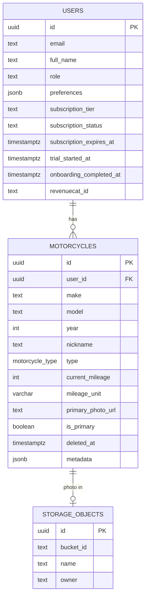

# Onboarding Redesign, Paywall & Monetization

## Enhancement Summary

**Deepened on:** 2026-03-09
**Sections enhanced:** 8
**Review agents used:** Security Sentinel, Architecture Strategist, Performance Oracle, Data Migration Expert, Data Integrity Guardian, TypeScript Reviewer, Frontend Races Reviewer, Pattern Recognition Specialist, Code Simplicity Reviewer

### Critical Fixes (Must Address)

1. **CRITICAL — RLS bypass**: Existing permissive policy "Users update own data" (migration 00003) has no `WITH CHECK`. Due to PostgreSQL OR semantics, it will bypass the new subscription-protection policy. **Fix**: DROP existing policy, create a single unified policy protecting subscription + role + email columns.
2. **CRITICAL — Race condition on paywall**: "Continue Free" button is NOT disabled during purchase processing. User can tap it mid-transaction, causing double navigation and potential orphaned purchase. **Fix**: Disable all CTAs when `isPurchasing` is true.
3. **CRITICAL — Migration number conflict**: Migration `00022` is already taken by OEM maintenance schedules. **Fix**: Use `00023`.
4. **Privilege escalation**: New RLS policy must also protect `role` and `email` columns (not just subscription fields).
5. **Backfill overwrites**: `SET onboarding_completed_at = NOW()` overwrites real timestamps from migration 00021. **Fix**: Use `WHERE onboarding_completed_at IS NULL`.
6. **Subscription default mismatch**: Existing Pro subscribers get `subscription_status = 'free'` from column default. **Fix**: Backfill `SET subscription_status = 'active' WHERE subscription_tier = 'pro'`.

### Architecture Improvements

- Extract `useOnboardingNavigation()` hook for consistent forward/back routing + analytics tracking
- Use `router.replace()` instead of `router.push()` for linear screens to prevent deep stack accumulation
- Place webhook controller in `apps/api/src/webhooks/` (not inside modules/) per NestJS convention for external integrations
- Server-side feature gating via GraphQL middleware — never trust client-side `isPro` from AsyncStorage

### Performance Optimizations

- Replace `import * as LucideIcons` (insights.tsx:5) with named imports — current import pulls entire icon library
- Prefetch RevenueCat offerings on Screen 14 (smart-maintenance) so paywall loads instantly
- Add 15s `AbortController` timeout on AI insights mutation
- Use `router.replace()` to keep navigation stack shallow (17 screens = memory pressure on low-end devices)

### TypeScript & Pattern Fixes

- Use UPPER_CASE keys in new `as const` enum objects (match existing `EXPERIENCE_LEVEL` pattern)
- Fix inline `gql` template in `personalizing.tsx:48` — use TypedDocumentNode from `@motovault/graphql`
- Use enum constants (e.g., `MOTORCYCLE_TYPE.CRUISER`) instead of string literals in screen files
- Type catch blocks as `error: unknown` (not `any`) per project TypeScript strictness

### Simplification Opportunities

- Consider merging bike-type into bike-model screen (auto-detected + confirm) to reduce to 16 screens
- Defer photo upload to post-onboarding (reduces onboarding complexity, still achieves IKEA effect via camera prompt)
- Skip `OnboardingContainer` wrapper — inline SafeAreaView + padding directly (avoids abstraction for 17 one-off screens)
- Split into 2 PRs: PR1 = Screens 1-14 (no backend changes), PR2 = Screens 15-17 + RevenueCat + webhook + migrations

## Overview

Redesign the MotoVault onboarding from a 7-step overloaded flow into a 17-screen one-question-per-screen experience across 5 sections. Fix broken card layouts, add mi/km mileage toggle, motorcycle photo upload, smart maintenance opt-in, repair spending self-reflection, and a RevenueCat-powered soft paywall with dynamic pricing. Target: >90% completion, 6-10% free-to-paid conversion.

## Problem Statement

The current onboarding has three critical issues:

1. **Overloaded screens**: `select-bike.tsx` crams 6 inputs (year, make, model, nickname, type grid, mileage slider) onto one scrollable page. `riding-habits.tsx` combines 3 questions (frequency, goals, maintenance style). This violates one-question-per-screen best practices.

2. **Broken card layouts**: `OptionCard` in 2-column grid (`width: '47%'` at `select-bike.tsx:591`, `width: '48%'` at `riding-habits.tsx:166`) leaves only ~23px for text after icon (52px) + padding (40px) + checkmark (44px). Multi-word labels like "Dual Sport" wrap vertically and are unreadable.

3. **Mileage hardcoded to miles**: Slider range 0-50,000 mi with no unit choice. DB has `mileage_unit` column but onboarding never sets it. Metric users enter corrupted data, breaking maintenance predictions.

Additional: no photo upload (reduces emotional investment), no maintenance opt-in, no self-reflection questions, skip button too prominent, paywall shows hardcoded prices instead of RevenueCat dynamic pricing, missing Terms of Service/Privacy Policy links (App Store rejection risk).

## Proposed Solution

Replace 7 overloaded screens with 17 focused screens across 5 sections, each collecting exactly ONE piece of information. All selection cards become full-width horizontal layout (no 2-col grid). Add mi/km toggle with locale detection, photo upload via `expo-image-picker`, smart maintenance toggles, repair spending question, and dynamic RevenueCat paywall with legal compliance links.

## Technical Approach

### Architecture

**Routing**: Expo Router file-based routing in `apps/mobile/src/app/(onboarding)/`. Each screen is a separate file. Navigation via `router.push()` with `gestureEnabled: true` for back-swipe on non-critical screens.

**State**: Expand existing Zustand store (`stores/onboarding.store.ts`) with new fields. Initialize each screen's `useState` from the store on mount so back navigation preserves selections.

**Data persistence**: All data stored locally in Zustand (AsyncStorage-persisted) during onboarding, then submitted atomically via `CompleteOnboarding` mutation on the personalizing screen. Photo uploaded to Supabase Storage during personalizing step.

**RevenueCat**: Keep existing lazy-import pattern for Expo Go compatibility. Add `Purchases.logIn(supabaseUserId)` after auth. Fetch dynamic prices from offerings instead of hardcoding. Add comprehensive error handling per error code.

**Webhook**: New NestJS controller `webhooks/revenuecat.controller.ts` receives RevenueCat events, fetches latest subscriber info, updates `users` table subscription fields.

### File Structure

```
apps/mobile/src/app/(onboarding)/
├── _layout.tsx                    # Stack navigator, progress bar
├── config.ts                      # ONBOARDING_STEPS array, step metadata
├── index.tsx                      # Screen 1: Welcome
├── experience.tsx                 # Screen 2: Rider Experience
├── bike-year.tsx                  # Screen 3: Bike Year
├── bike-make.tsx                  # Screen 4: Bike Make (NHTSA search)
├── bike-model.tsx                 # Screen 5: Bike Model
├── bike-type.tsx                  # Screen 6: Motorcycle Type
├── bike-mileage.tsx               # Screen 7: Mileage + mi/km toggle
├── bike-photo.tsx                 # Screen 8: Nickname + Photo
├── riding-frequency.tsx           # Screen 9: Riding Frequency
├── riding-goals.tsx               # Screen 10: Riding Goals (multi-select)
├── maintenance-style.tsx          # Screen 11: Maintenance Style
├── repair-spending.tsx            # Screen 12: Repair Spending
├── learning-preferences.tsx       # Screen 13: Learning Preferences
├── smart-maintenance.tsx          # Screen 14: Smart Maintenance Setup
├── insights.tsx                   # Screen 15: AI Insight Reveal
├── paywall.tsx                    # Screen 16: Soft Paywall
└── personalizing.tsx              # Screen 17: Dashboard Landing / Persist
```

```
apps/mobile/src/components/
├── onboarding/
│   ├── OnboardingCard.tsx         # Full-width horizontal card (replaces OptionCard in 2-col)
│   ├── OnboardingProgress.tsx     # Continuous progress bar with endowed progress
│   ├── OnboardingContainer.tsx    # Shared screen wrapper (SafeArea, padding, animations)
│   └── MileageSlider.tsx          # Slider with mi/km toggle + haptics
```

```
apps/api/src/webhooks/
└── revenuecat.controller.ts       # RevenueCat webhook handler
```

### Implementation Phases

#### Phase 1: Foundation — Onboarding Screens A-D (Screens 1-14)

**Scope**: All 14 data-collection screens, new components, store expansion, back-navigation fix.

**Tasks**:

- [ ] **1.1 Expand onboarding store** — `stores/onboarding.store.ts`
  - Add fields: `annualRepairSpend`, `maintenanceReminders`, `reminderChannel`, `seasonalTips`, `recallAlerts`, `weeklySummary`, `lastServiceDate`, `mileageUnit`, `bikePhotoUri` (local URI before upload)
  - Add actions: `setAnnualRepairSpend()`, `setMaintenanceReminders()`, `setReminderChannel()`, etc.
  - Add `currentScreen: string` (route name, not step number) for resume behavior
  - Ensure `partialize` includes all new fields for AsyncStorage persistence

- [ ] **1.2 Create shared onboarding components**
  - `OnboardingCard.tsx`: Full-width horizontal card — `[Icon 44px] [gap 12] [Label flex:1] [Checkmark 28px]`. Single-line text guaranteed. Props: `icon`, `label`, `subtitle?`, `selected`, `onPress`, `multiSelect?`
  - `OnboardingContainer.tsx`: `SafeAreaView` + padding + `FadeIn` animation wrapper. Props: `title`, `subtitle?`, `children`, `onContinue?`, `continueEnabled?`, `showSkip?`, `onSkip?`
  - `OnboardingProgress.tsx`: Continuous animated fill bar. Endowed progress starts at 10%. Formula: `progress = 0.10 + (0.90 * screenIndex / totalScreens)`. Use `react-native-reanimated` `withTiming` for smooth transitions.
  - `MileageSlider.tsx`: `@react-native-community/slider` + `[mi] [km]` segmented control. Default from `getLocales()[0].measurementSystem`. Mi range: 0-80,000 step 1,000. Km range: 0-130,000 step 1,500. Haptic feedback every 5K. "Not sure?" link sets null.

- [ ] **1.3 Update onboarding config** — `config.ts`
  - Replace `ONBOARDING_STEPS` array with 17 entries
  - Each entry: `{ route, title, section, required, canSkip }`
  - Export `TOTAL_SCREENS = 17` for progress calculation

- [ ] **1.4 Update onboarding layout** — `_layout.tsx`
  - Replace step-dot `ProgressBar` with continuous `OnboardingProgress`
  - Pass current screen index to progress component via route name lookup
  - Keep `animation: 'slide_from_right'`, `gestureEnabled: true` on data screens
  - Lock gesture on welcome, insights, paywall, personalizing

- [ ] **1.5 Build Screen 1: Welcome** — `index.tsx`
  - Full-screen hero with "Your motorcycle just got smarter" headline
  - Subtext: "AI-powered learning, diagnostics & maintenance — personalized to your ride."
  - Single CTA button: "Let's get started" → routes to `/experience`
  - No data collection (emotional priming only)
  - Progress bar visible at 10%

- [ ] **1.6 Build Screen 2: Rider Experience** — `experience.tsx`
  - "What kind of rider are you?"
  - 3 `OnboardingCard`s (Beginner / Intermediate / Advanced) with icon + description
  - Auto-advance on tap (no Continue button)
  - Initialize from `useOnboardingStore.experienceLevel` on mount
  - Store via `setExperienceLevel()`, route to `/bike-year`

- [ ] **1.7 Build Screen 3: Bike Year** — `bike-year.tsx`
  - "What year is your motorcycle?"
  - Scrollable year picker or large numeric input (current year + 1 down to 1970)
  - Default: current year - 3
  - "Skip bike setup" as small muted text at bottom → routes to `/riding-frequency`
  - Initialize from `useOnboardingStore.bikeData?.year`
  - Store via `setBikeData({ ...bikeData, year })`, route to `/bike-make`

- [ ] **1.8 Build Screen 4: Bike Make** — `bike-make.tsx`
  - "Who makes your motorcycle?"
  - Search input + filtered dropdown using existing `MotorcycleMakesDocument` query
  - Show popular makes first: Honda, Yamaha, Kawasaki, Harley-Davidson, Suzuki, BMW, Ducati, KTM
  - Full-width list items (no grid)
  - **Error handling**: Retry button on NHTSA API failure (TanStack Query `retry: 2`)
  - No skip button (committed after entering year)
  - Initialize from store, route to `/bike-model`

- [ ] **1.9 Build Screen 5: Bike Model** — `bike-model.tsx`
  - "What's your model?"
  - Conditional on make + year via `MotorcycleModelsDocument` query
  - Full-width list items, scrollable
  - **If no results**: free-text input with "We'll add your model to our database"
  - **Error handling**: Render error state with retry (currently missing in `select-bike.tsx`)
  - Initialize from store, route to `/bike-type`

- [ ] **1.10 Build Screen 6: Motorcycle Type** — `bike-type.tsx`
  - "What type of motorcycle is it?"
  - 8 `OnboardingCard`s (full-width, stacked): Cruiser, Sportbike, Standard, Touring, Dual Sport, Dirt Bike, Scooter, Other
  - Auto-detected from model via `detectTypeFromModel()` — pre-select with "We guessed this based on your model" subtitle
  - Auto-advance on tap (single-select)
  - Initialize from store, route to `/bike-mileage`

- [ ] **1.11 Build Screen 7: Mileage** — `bike-mileage.tsx`
  - "How many miles (or km) is on your bike?"
  - Use `MileageSlider` component with mi/km toggle
  - Default unit from `getLocales()[0].measurementSystem` (US → mi, others → km)
  - Store both `currentMileage` (number) and `mileageUnit` ('mi' | 'km')
  - "Not sure?" link sets mileage to null
  - Continue button, route to `/bike-photo`

- [ ] **1.12 Build Screen 8: Nickname & Photo** — `bike-photo.tsx`
  - "Give your bike a name" — optional nickname `TextInput`
  - "Add a photo of your ride" — camera/library picker via `expo-image-picker`
  - After photo: animate into card with nickname + year + make/model overlay
  - "Looks great!" / "Retake" buttons for photo
  - Compress photo to 600px wide via `expo-image-manipulator` (store local URI, upload in personalizing)
  - "I'll add these later" skip at bottom (both optional)
  - Initialize from store, route to `/riding-frequency`

- [ ] **1.13 Build Screen 9: Riding Frequency** — `riding-frequency.tsx`
  - "How often do you ride?"
  - 4 `OnboardingCard`s with icon + title + subtitle
  - Auto-advance on tap (single-select)
  - Initialize from store, route to `/riding-goals`

- [ ] **1.14 Build Screen 10: Riding Goals** — `riding-goals.tsx`
  - "What would you like to achieve?" (multi-select)
  - 8 `OnboardingCard`s (full-width, stacked) with checkmarks
  - Min 1 selection required (Continue button disabled until 1+ selected)
  - Continue button, route to `/maintenance-style`

- [ ] **1.15 Build Screen 11: Maintenance Style** — `maintenance-style.tsx`
  - "Do you work on your own bike?"
  - 3 `OnboardingCard`s with subtitles: "Yes — I handle most...", "Sometimes — Oil changes...", "No — I use a mechanic..."
  - Auto-advance on tap (single-select)
  - Initialize from store, route to `/repair-spending`

- [ ] **1.16 Build Screen 12: Repair Spending** — `repair-spending.tsx` (NEW)
  - "How much did you spend on motorcycle maintenance or repairs last year?"
  - 5 `OnboardingCard`s: Under $200, $200-500, $500-1,000, $1,000+, I'm not sure
  - Auto-advance on tap (single-select)
  - Store as `annualRepairSpend` enum value
  - Route to `/learning-preferences`

- [ ] **1.17 Build Screen 13: Learning Preferences** — `learning-preferences.tsx`
  - "How do you like to learn?" (multi-select)
  - 4 `OnboardingCard`s: Quick Tips, Deep Dives, Video Walkthroughs, Hands-On Quizzes
  - Min 1 selection required
  - Continue button, route to `/smart-maintenance`

- [ ] **1.18 Build Screen 14: Smart Maintenance Setup** — `smart-maintenance.tsx` (NEW)
  - "Set up smart care for your [nickname or Make Model]"
  - 4 toggles (Switch components): Maintenance reminders (ON), Seasonal tips (ON), Recall alerts (ON), Weekly summary (OFF)
  - "When did you last service your motorcycle?" — 5 options (under 1mo, 1-3mo, 3-6mo, 6mo+, Not sure)
  - Conditional: if maintenance reminders ON, show "How would you like reminders?" — Push / Email / Both
  - Continue button, route to `/insights`

- [ ] **1.19 Add new enum values** — `packages/types/src/constants/enums.ts`
  - Add `ANNUAL_REPAIR_SPEND` as const: `under_200`, `200_500`, `500_1000`, `1000_plus`, `unsure`
  - Add `LAST_SERVICE_DATE` as const: `under_1mo`, `1_3mo`, `3_6mo`, `6mo_plus`, `unsure`
  - Add `REMINDER_CHANNEL` as const: `push`, `email`, `both`
  - Add `MILEAGE_UNIT` as const: `mi`, `km`

- [ ] **1.20 Add Zod validators** — `packages/types/src/validators/`
  - Update `onboarding-input.ts` to include new fields: `annualRepairSpend`, `maintenanceReminders`, `reminderChannel`, `seasonalTips`, `recallAlerts`, `weeklySummary`, `lastServiceDate`, `mileageUnit`
  - Update `user-preferences.ts` to match

- [ ] **1.21 Fix back-navigation state initialization**
  - Each screen initializes `useState` from `useOnboardingStore` on mount
  - Example: `const [selectedFrequency, setSelectedFrequency] = useState(store.ridingFrequency)`
  - Ensures back-swipe preserves user selections

- [ ] **1.22 Delete old consolidated screens**
  - Remove `select-bike.tsx`, `riding-habits.tsx` (replaced by individual screens)
  - Keep `insights.tsx`, `paywall.tsx`, `personalizing.tsx` (modified in Phase 2)

**Success criteria**: All 14 data-collection screens render correctly. Full-width cards have no text wrapping on any device. Back navigation preserves selections. Mileage toggle defaults correctly per locale. Photo picker works for camera + library.

#### Phase 2: Value Reveal & Monetization (Screens 15-17)

**Scope**: AI Insights revision, RevenueCat dynamic paywall, feature gating, webhook, DB migration.

**Tasks**:

- [ ] **2.1 Supabase migration** — `supabase/migrations/00023_onboarding_redesign_preferences.sql`
  - **CRITICAL**: Do NOT `ADD COLUMN` for `subscription_tier`, `trial_started_at`, `onboarding_completed_at`, `current_mileage`, `mileage_unit`, `primary_photo_url` — these already exist (migrations 00005, 00021).
  - **CRITICAL**: Migration number 00022 is already taken by OEM maintenance schedules. Use **00023**.
  - Add new columns to `users` table:
    ```sql
    ALTER TABLE public.users
      ADD COLUMN IF NOT EXISTS subscription_status TEXT DEFAULT 'free'
        CHECK (subscription_status IN ('free', 'trialing', 'active', 'past_due', 'cancelled', 'expired')),
      ADD COLUMN IF NOT EXISTS subscription_expires_at TIMESTAMPTZ,
      ADD COLUMN IF NOT EXISTS revenuecat_id TEXT;
    ```
  - **RLS fix (CRITICAL)**: DROP existing permissive "Users update own data" policy (migration 00003) and create a single unified policy that protects subscription, role, and email columns:
    ```sql
    -- Drop existing permissive policy that lacks WITH CHECK (allows bypass via OR semantics)
    DROP POLICY IF EXISTS "Users update own data" ON public.users;

    -- Single unified policy: users can update own row but NOT subscription/role/email fields
    CREATE POLICY "Users update own profile"
      ON public.users FOR UPDATE TO authenticated
      USING (auth.uid() = id)
      WITH CHECK (
        -- Protect subscription fields (only webhook/RPC can modify)
        subscription_status IS NOT DISTINCT FROM (SELECT subscription_status FROM public.users WHERE id = auth.uid())
        AND subscription_tier IS NOT DISTINCT FROM (SELECT subscription_tier FROM public.users WHERE id = auth.uid())
        AND subscription_expires_at IS NOT DISTINCT FROM (SELECT subscription_expires_at FROM public.users WHERE id = auth.uid())
        AND revenuecat_id IS NOT DISTINCT FROM (SELECT revenuecat_id FROM public.users WHERE id = auth.uid())
        -- Protect role and email (prevent privilege escalation)
        AND role IS NOT DISTINCT FROM (SELECT role FROM public.users WHERE id = auth.uid())
        AND email IS NOT DISTINCT FROM (SELECT email FROM public.users WHERE id = auth.uid())
      );
    ```
  - Create `bike-photos` storage bucket (**private** with signed URLs for security):
    ```sql
    INSERT INTO storage.buckets (id, name, public) VALUES ('bike-photos', 'bike-photos', false);

    CREATE POLICY "Users upload own bike photos"
      ON storage.objects FOR INSERT TO authenticated
      WITH CHECK (bucket_id = 'bike-photos' AND (storage.foldername(name))[1] = auth.uid()::text);

    CREATE POLICY "Users view own bike photos"
      ON storage.objects FOR SELECT TO authenticated
      USING (bucket_id = 'bike-photos' AND (storage.foldername(name))[1] = auth.uid()::text);

    CREATE POLICY "Users delete own bike photos"
      ON storage.objects FOR DELETE TO authenticated
      USING (bucket_id = 'bike-photos' AND (storage.foldername(name))[1] = auth.uid()::text);
    ```
  - Update `complete_onboarding` RPC to accept new preference fields + photo URL + `mileage_unit` parameter
  - **Backfill** (safe — won't overwrite existing timestamps):
    ```sql
    -- Set onboarding_completed_at only for users who don't already have it
    UPDATE public.users SET onboarding_completed_at = NOW()
      WHERE onboarding_completed_at IS NULL
      AND id IN (SELECT DISTINCT user_id FROM public.motorcycles);

    -- Fix subscription_status for existing Pro subscribers (avoid 'free' default)
    UPDATE public.users SET subscription_status = 'active'
      WHERE subscription_tier = 'pro' AND (subscription_status IS NULL OR subscription_status = 'free');
    ```

- [ ] **2.2 Update NestJS models** — `apps/api/`
  - Add `SubscriptionStatus` GraphQL enum in `graphql-enums.ts`
  - Update `UserModel` with `subscriptionStatus`, `subscriptionTier`, `subscriptionExpiresAt`, `trialEndsAt`
  - Update `CompleteOnboardingInput` to accept new fields
  - Update `complete_onboarding` resolver to pass new fields to RPC

- [ ] **2.3 Revise Screen 15: AI Insights** — `insights.tsx`
  - Show bike photo at top if uploaded (read from store's `bikePhotoUri`)
  - Add 15-second timeout via `AbortController` — show skip option on timeout
  - Social proof: "Join [N]+ riders who use MotoVault for their [bike type]"
  - If maintenance reminders ON: "Your first maintenance reminder is set"
  - Disable Continue button during loading (currently enabled during error — fix this)
  - Fallback content if AI fails: static insights based on bike type + experience level

- [ ] **2.4 Revise Screen 16: Soft Paywall** — `paywall.tsx`
  - **Dynamic pricing**: Fetch from `Purchases.getOfferings()` — use `product.priceString` for display
  - **Dynamic trial info**: Read trial days from `product.introPrice.periodNumberOfUnits`
  - **Blurred dashboard preview**: Background image of dashboard with `BlurView` overlay
  - **Dynamic value props** adapted to survey answers:
    - If `maintenanceReminders`: "Smart alerts for your [Make Model]"
    - If `annualRepairSpend` is `1000_plus`: "Save on repairs with predictive maintenance"
    - Default: "AI diagnostics to keep rides safe"
  - **Legal compliance**: Add Terms of Service + Privacy Policy links (required for App Store)
  - **"Continue with Free"** at bottom (muted text) — **MUST be disabled when `isPurchasing` is true** (prevents race condition with double navigation)
  - **Comprehensive error handling** per RevenueCat error code:
    - `NETWORK_ERROR`: "Check your connection and try again"
    - `PRODUCT_ALREADY_PURCHASED_ERROR`: Auto-restore
    - `PURCHASE_NOT_ALLOWED_ERROR`: "Purchases are restricted on this device"
    - `RECEIPT_ALREADY_IN_USE_ERROR`: "This subscription is linked to another account"
  - **Loading states**: Separate loading for offerings fetch vs purchase processing
  - Add `Purchases.logIn(supabaseUserId)` before purchase for webhook user mapping

- [ ] **2.5 Revise Screen 17: Personalizing** — `personalizing.tsx`
  - Upload bike photo to Supabase Storage `bike-photos` bucket during this step
  - Use `CompleteOnboardingDocument` from `@motovault/graphql` (fix inline gql on line 48)
  - Pass all new fields to `CompleteOnboarding` mutation
  - On mutation failure: show retry button (don't silently proceed to dashboard)
  - Store `onboardingCompleted` in auth store `partialize` to prevent flash-of-onboarding on cold start
  - Navigate to `/(tabs)/(home)` on success

- [ ] **2.6 RevenueCat webhook** — `apps/api/src/webhooks/revenuecat.controller.ts`
  - `POST /webhooks/revenuecat` endpoint
  - Verify `Authorization` header against `REVENUECAT_WEBHOOK_SECRET` env var
  - Fetch latest subscriber info from RevenueCat REST API (fetch-after-webhook pattern)
  - Update `users` table: `subscription_status`, `subscription_tier`, `subscription_expires_at`
  - Handle event types: `INITIAL_PURCHASE`, `RENEWAL`, `CANCELLATION`, `EXPIRATION`, `BILLING_ISSUE`
  - Return 200 immediately (RevenueCat retries on non-200)
  - Add `.env.example` entries: `REVENUECAT_WEBHOOK_SECRET`, `REVENUECAT_API_KEY`

- [ ] **2.7 Feature gating** — `apps/mobile/src/lib/subscription.ts` + stores
  - Free tier limits: 1 bike, 3 articles/week, basic diagnostics, no maintenance reminders
  - Add `checkFeatureAccess(feature: string): boolean` helper
  - Premium features show lock icon + "Upgrade" badge on dashboard/garage
  - Tapping locked feature shows paywall sheet (`presentation: 'formSheet'`)

- [ ] **2.8 Subscription store enhancement** — `stores/subscription.store.ts`
  - Add `subscriptionStatus`, `subscriptionTier`, `expiresAt`
  - Sync from `MeDocument` response on app launch
  - Listen to RevenueCat customer info updates via existing listener

- [ ] **2.9 Update GraphQL operations**
  - Update `complete-onboarding.graphql` with new input fields
  - Run `pnpm generate` to regenerate types
  - Verify no contract drift (check field names match resolvers exactly)

**Success criteria**: Dynamic prices from RevenueCat display correctly. Purchase flow handles all error codes. Webhook syncs subscription status to DB. Feature gating enforces free tier limits. Bike photo uploads successfully during personalizing. Back-navigation works across all 17 screens.

#### Phase 3: Polish & Analytics

**Scope**: Animated transitions, per-screen analytics, accessibility, color system alignment.

**Tasks**:

- [ ] **3.1 Screen transition animations**
  - `FadeInUp` on each screen's content with reanimated v4
  - Stagger card list items: `FadeInUp.delay(index * 50)`
  - All transitions under 300ms
  - Smooth continuous progress bar animation between screens

- [ ] **3.2 Per-screen analytics** (PostHog or Mixpanel)
  - Track: screen viewed, screen completed, screen skipped, time on screen
  - Track: drop-off point, back navigation, bike skip rate
  - Track: photo upload rate, maintenance reminders opt-in rate
  - Track: paywall shown, trial started, purchase completed, "continue free" tapped
  - Funnel: Screen 1 → Screen 17 with per-step conversion

- [ ] **3.3 Accessibility**
  - Add `accessibilityLabel` to all `OnboardingCard` components
  - Add `accessibilityRole="button"` on interactive cards
  - Add "Step X of 17" screen reader announcement on each screen
  - Ensure minimum 44pt touch targets on all buttons

- [ ] **3.4 Color system alignment**
  - Replace hardcoded Tailwind colors (`#0F172A`, `#818CF8`) with `palette.*` hex values from design system
  - Use `palette.neutral950` for dark backgrounds, `palette.primary500` for accents
  - Respect system dark/light mode preference (currently hardcoded dark)

- [ ] **3.5 Android improvements**
  - Add haptic feedback on Android via `expo-haptics` (remove iOS-only guard)
  - Ensure back button behavior on Android matches iOS swipe-back
  - Test all 17 screens on Android emulator

- [ ] **3.6 Resume behavior**
  - On app restart during onboarding, read `currentScreen` from store
  - Route to last incomplete screen in `_layout.tsx` on mount
  - Each screen initializes from store (already done in Phase 1)

## System-Wide Impact

### Interaction Graph

1. User taps through 17 onboarding screens → Zustand store accumulates data → `personalizing.tsx` fires `CompleteOnboarding` mutation → NestJS resolver calls `complete_onboarding` RPC (SECURITY DEFINER) → atomically updates `users.preferences` JSONB + creates `motorcycles` row + uploads photo
2. User purchases on paywall → RevenueCat SDK processes → Apple/Google confirms → RevenueCat fires webhook → NestJS `revenuecat.controller.ts` → fetches subscriber info → updates `users.subscription_*` columns
3. Customer info listener in `subscription.ts` → updates `subscriptionStore` → UI re-renders locked/unlocked features

### Error Propagation

- NHTSA API failure: TanStack Query retries 2x → shows error UI with manual retry button → user can skip bike entirely from Screen 3
- AI insights timeout: 15s AbortController → shows fallback static insights + skip option → non-blocking
- RevenueCat purchase failure: error code switch → user-friendly message per code → stays on paywall
- CompleteOnboarding mutation failure: retry button shown → if still fails, show "sync later" banner on dashboard → store preserves data for next attempt
- Photo upload failure: non-blocking — show "photo will sync later" message — dashboard shows placeholder

### State Lifecycle Risks

- **Partial onboarding**: If app kills between Zustand write and mutation, store has data but server doesn't. Mitigated by: persist all store fields, retry on next launch.
- **Subscription desync**: If webhook fails, local RevenueCat listener still updates app state. Server state eventually catches up via webhook retry (5 attempts). `MeDocument` query on app launch also syncs.
- **Photo orphaning**: If photo uploads to Storage but mutation fails, orphaned file in bucket. Mitigated by: upload in same try-catch as mutation, clean up on failure.

### API Surface Parity

- `CompleteOnboardingInput` GraphQL input type must add new fields (annualRepairSpend, maintenanceReminders, etc.)
- `UserPreferencesSchema` Zod validator must match GraphQL input
- `complete_onboarding` RPC SQL function must accept and store new preference fields
- `MeDocument` query already returns `preferences` JSONB — no change needed

### Integration Test Scenarios

1. Full onboarding flow with bike → purchase annual trial → verify `users.subscription_status = 'trialing'` in DB
2. Onboarding with bike skip → verify no `motorcycles` row created → dashboard shows "add bike" card
3. RevenueCat webhook `EXPIRATION` → verify `subscription_status = 'expired'` → app shows locked features
4. Kill app on Screen 8 → relaunch → verify resume at Screen 8 with previous selections intact
5. Purchase with slow network → verify loading states → verify no double-charge on retry

## Acceptance Criteria

### Functional Requirements

- [ ] 17 onboarding screens render correctly, one question per screen
- [ ] All selection cards are full-width horizontal (no 2-column grid) — no text wrapping on any device size
- [ ] Mileage screen: mi/km toggle defaults from device locale, slider range adapts
- [ ] Photo upload works from camera and library, compresses to <500KB
- [ ] Back navigation preserves all previous selections
- [ ] Skip bike setup on Screen 3 jumps to Screen 9
- [ ] Screens 4-8 do NOT show skip (committed after year entry)
- [ ] Multi-select screens (10, 13) require minimum 1 selection
- [ ] Smart maintenance toggles default ON (except weekly summary)
- [ ] Conditional reminder channel shown only when maintenance reminders ON
- [ ] AI insights screen has 15s timeout with skip/fallback
- [ ] Paywall shows dynamic prices from RevenueCat (not hardcoded)
- [ ] Paywall includes Terms of Service and Privacy Policy links
- [ ] "Continue with Free" option works and routes to dashboard
- [ ] Purchase flow handles all RevenueCat error codes with user-friendly messages
- [ ] Restore purchases works correctly
- [ ] Feature gating: free tier limited to 1 bike, 3 articles/week
- [ ] Premium features show lock icon on dashboard for free users
- [ ] RevenueCat webhook updates subscription status in DB
- [ ] RLS prevents client-side modification of subscription columns

### Non-Functional Requirements

- [ ] Each screen transition completes in <300ms
- [ ] AI insights load within 15 seconds or show fallback
- [ ] Photo compression completes in <2 seconds
- [ ] Onboarding store persists across app kills (resume behavior)
- [ ] No oklch colors used in any mobile screen (hex from palette.ts only)
- [ ] All interactive elements have `accessibilityLabel`

### Quality Gates

- [ ] All screens tested on iPhone SE (smallest) and iPad (largest)
- [ ] Android back button works correctly on all screens
- [ ] `pnpm generate` runs cleanly after all GraphQL changes
- [ ] `pnpm lint` passes on all modified files
- [ ] Existing tests pass after migration changes

## Success Metrics

| Metric | Target | Measurement |
|--------|--------|-------------|
| Onboarding completion | >90% | Screen 1 → Screen 17 funnel (analytics) |
| Per-screen drop-off | <2% | Per-screen analytics events |
| Photo upload rate | >50% | Screen 8 photo_uploaded / screen_viewed |
| Maintenance reminders opt-in | >70% | Screen 14 reminders_on / screen_viewed |
| Bike skip rate | <15% | Screen 3 skip / screen_viewed |
| Trial start rate | >25% | Screen 16 trial_started / screen_viewed |
| Free-to-paid (60 days) | >6% | RevenueCat dashboard |

## Dependencies & Prerequisites

| Dependency | Status | Notes |
|------------|--------|-------|
| RevenueCat account + products configured | Existing | Annual + monthly products exist |
| Apple/Google IAP products | Existing | Already configured in stores |
| Supabase Storage | Existing | Need to create `bike-photos` bucket |
| NHTSA API | Existing | Already proxied via GraphQL |
| `react-native-purchases` | Installed (^9.11.2) | Already in package.json |
| `expo-image-picker` | Installed (~17.0.0) | Already configured with permissions |
| `expo-image-manipulator` | Installed (^55.0.9) | For photo compression |
| `expo-localization` | Installed | For mileage unit detection |
| Expo dev build | Required | RevenueCat won't work in Expo Go |

## Risk Analysis & Mitigation

| Risk | Likelihood | Impact | Mitigation |
|------|-----------|--------|------------|
| Migration trap: ADD COLUMN on existing columns | High | Build fails | Use `ADD COLUMN IF NOT EXISTS` |
| RLS bypass on subscription fields | High | Security vulnerability | RLS WITH CHECK policy prevents client writes |
| App Store rejection (missing legal links) | High | Launch delay | Add ToS + Privacy Policy links to paywall |
| Hardcoded prices differ from store prices | Medium | Policy violation | Fetch dynamic prices from RevenueCat offerings |
| Onboarding too long (17 screens) | Medium | Higher drop-off | Each screen trivially easy; monitor analytics closely |
| Photo upload fails in low connectivity | Medium | Missing bike photos | Non-blocking; retry on next launch |
| RevenueCat webhook delivery failure | Low | Subscription desync | RevenueCat retries 5x; client listener as backup |
| NHTSA API deprecated/changed | Low | Bike entry broken | Already proxied through NestJS; can swap data source |

## Data Model — ERD



### Preferences JSONB Schema

```typescript
interface UserPreferences {
  // Existing
  experienceLevel: 'beginner' | 'intermediate' | 'advanced';
  ridingGoals: string[];
  ridingFrequency: 'daily' | 'weekly' | 'monthly' | 'seasonal';
  maintenanceStyle: 'diy' | 'sometimes' | 'mechanic';
  learningFormats: string[];
  onboardingCompleted: boolean;
  locale: string;

  // New (Phase 1)
  annualRepairSpend: 'under_200' | '200_500' | '500_1000' | '1000_plus' | 'unsure';
  mileageUnit: 'mi' | 'km';

  // New (Phase 2)
  maintenanceReminders: boolean;
  reminderChannel: 'push' | 'email' | 'both';
  seasonalTips: boolean;
  recallAlerts: boolean;
  weeklySummary: boolean;
  lastServiceDate: 'under_1mo' | '1_3mo' | '3_6mo' | '6mo_plus' | 'unsure';
}
```

## Sources & References

### Internal References

- Existing onboarding: `apps/mobile/src/app/(onboarding)/` (7 screens)
- Onboarding store: `apps/mobile/src/stores/onboarding.store.ts`
- OptionCard (broken 2-col): `apps/mobile/src/components/option-card.tsx`
- Subscription lib: `apps/mobile/src/lib/subscription.ts`
- Current paywall: `apps/mobile/src/app/(onboarding)/paywall.tsx`
- DB migrations: `supabase/migrations/00002`, `00005`, `00021`
- Design palette: `packages/design-system/src/palette.ts`
- Prior plan: `docs/plans/2026-03-08-feat-onboarding-revamp-paywall-plan.md`
- Migration trap: `docs/solutions/` — motorcycles.type and current_mileage already exist
- oklch bug: `docs/solutions/ui-bugs/sf-symbols-to-lucide-migration-oklch-runtime-bug.md`
- GraphQL drift: `docs/solutions/integration-issues/parallel-agent-graphql-contract-drift.md`

### External References

- RevenueCat Expo Installation: https://www.revenuecat.com/docs/getting-started/installation/expo
- RevenueCat Webhooks: https://www.revenuecat.com/docs/integrations/webhooks
- RevenueCat Webhook Events: https://www.revenuecat.com/docs/integrations/webhooks/event-types-and-fields
- Expo ImagePicker: https://docs.expo.dev/versions/latest/sdk/imagepicker/
- Expo ImageManipulator: https://docs.expo.dev/versions/latest/sdk/imagemanipulator/
- Expo Localization: https://docs.expo.dev/versions/latest/sdk/localization/
- Supabase Storage: https://supabase.com/docs/guides/storage/buckets/fundamentals
