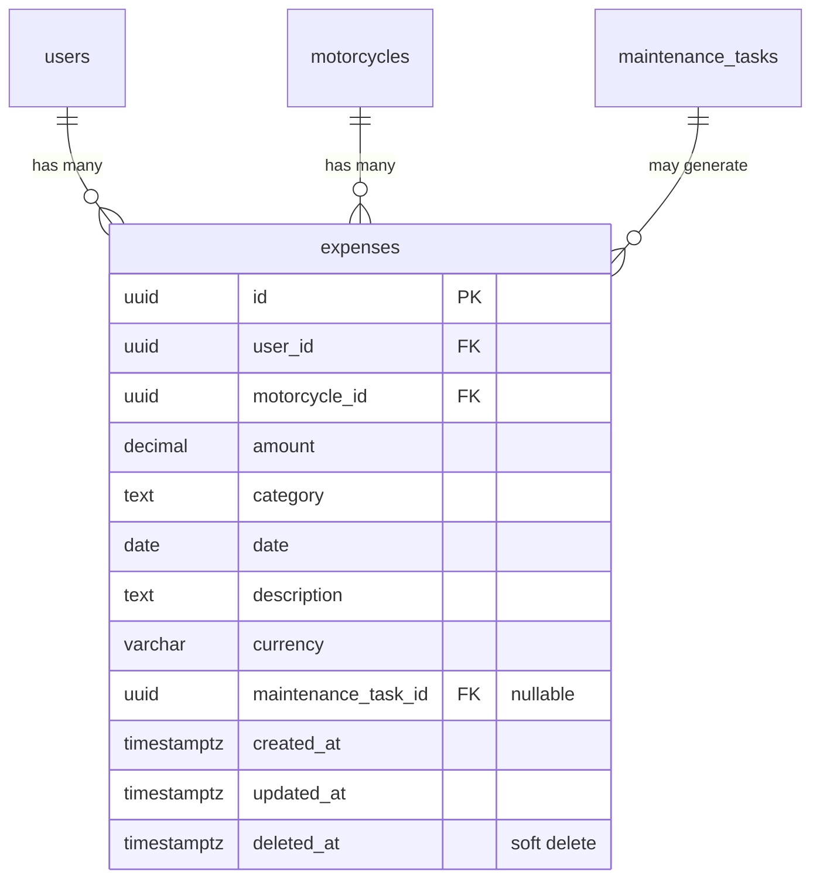

## Enhancement Summary

**Deepened on:** 2026-03-13
**Research agents used:** Data Integrity Guardian, Security Sentinel, Code Simplicity Reviewer, Architecture Strategist, RN Accessibility Research, Supabase RLS Research, TanStack Query v5 Research

### Key Improvements
1. **Simplified scope**: Dropped `updateExpense` and separate `expenseSummary` resolver for v1 — fold summary into `expensesByMotorcycle` response
2. **Security hardened**: DELETE RLS policy guards `deleted_at IS NULL`, auto-expense uses SUPABASE_USER (not admin), unique partial index prevents duplicate expenses from race conditions
3. **Backfill completeness**: Migration now includes `parts_cost` + `labor_cost` from maintenance tasks, not just `cost`
4. **Deploy order**: migration → code deploy → backfill → mobile release (backfill is separate migration for safe rollback)
5. **Phase 0 simplified**: Extract only `SwipeableTaskCard` (the large component); keep `PriorityBadge` and `InfoRow` inline until reused elsewhere

### Critical Warnings
- Auto-expense on task completion MUST use the authenticated user's Supabase client (SUPABASE_USER), not adminClient — preserves RLS audit trail
- DELETE policy must include `deleted_at IS NULL` to prevent re-deleting soft-deleted records
- Add `UNIQUE` partial index on `(maintenance_task_id) WHERE maintenance_task_id IS NOT NULL` to prevent duplicate auto-expenses from retry/race conditions
- Drop `currency` column for v1 (all USD) — avoids premature complexity

# Motorcycle Details Page Redesign & Feature Expansion

## Overview

Redesign the motorcycle details page (`bike/[id].tsx`) — the most-visited screen in MotoVault — to add expense tracking, consolidate edit flows, fix dead-end interactions, and improve accessibility. The current 1342-line page suffers from broken interactions, fragmented edit paths, no standalone expense tracking, and zero accessibility annotations.

## Problem Statement

1. **No expense tracking**: Spending is derived only from `maintenance_tasks.cost`. Users cannot log fuel, gear, parts purchases, or view ownership cost breakdown.
2. **Fragmented edit flow**: Two entry points (pencil icon + More menu) lead to a cramped formSheet with limited fields.
3. **Dead-end interactions**: "See all tasks" is a no-op. Tapping UpcomingTasks cards sets `expandedId` but expansion renders off-screen in the full task list.
4. **Unclear task layout**: Redundant task sections (StatCards + UpcomingTasks + full task list) create a long, confusing page.

## Architecture Decision: Expense vs Task Cost

**Decision**: Completing a task with cost auto-creates an expense record. Spending totals come exclusively from the `expenses` table. Existing `maintenance_tasks.cost` data is backfilled into expenses via migration. This prevents double-counting and provides a single source of truth.

## Proposed Solution

### New Page Layout (top to bottom)
1. **Hero**: Photo, bike name, year/make/model
2. **Quick Stats**: Mileage + health score (inline, compact)
3. **Quick Actions**: Add Task, Add Expense, Edit, More
4. **Maintenance Section**: Tabbed (Active | History) with overdue badge
5. **Expenses Section**: Spending summary + category breakdown + expense list
6. **Details Section**: Collapsible bike specs (moved to bottom)

## Technical Approach

### Phase 0: Component Extraction (Pre-requisite)

Extract the large `SwipeableTaskCard` from the 1342-line `bike/[id].tsx` to make subsequent phases safer. Keep `PriorityBadge` and `InfoRow` inline until they're reused elsewhere (YAGNI).

#### Tasks

- [ ] Extract `SwipeableTaskCard` (lines 134-430, ~300 lines) → `apps/mobile/src/components/bike-hub/swipeable-task-card.tsx`
- [ ] Move `PriorityBadge` (lines 104-132) into `swipeable-task-card.tsx` as a local component (only used there)
- [ ] Update imports in `bike/[id].tsx`
- [ ] Verify no regressions with existing task expand/collapse behavior

### Phase 1: Fix Dead-End Interactions

#### 1A. Task Tap-to-Expand in UpcomingTasks

**Current state**: `UpcomingTasks` component (`apps/mobile/src/components/bike-hub/upcoming-tasks.tsx`) renders compact non-expandable cards. `onTaskPress` sets `expandedId` in parent, but expansion renders in the full task list section below.

**Change**: Make `UpcomingTasks` cards expandable inline using the extracted `SwipeableTaskCard` component.

- [ ] Replace compact task cards in `upcoming-tasks.tsx` with `SwipeableTaskCard`
- [ ] Add `expandedId` state local to `UpcomingTasks` (not shared with full task list)
- [ ] Only one task expanded at a time (tapping another collapses current)
- [ ] Expanded view shows: description, notes, parts needed, photo gallery, Mark Done + Delete buttons
- [ ] ChevronRight rotates to ChevronDown when expanded
- [ ] Smooth `LayoutAnimation` (max 300ms)
- [ ] Haptic feedback on expand (iOS)

#### 1B. "See All Tasks" Navigation

**Change**: Create a dedicated full-screen task list route.

- [ ] Create new route: `apps/mobile/src/app/(tabs)/(garage)/bike/[id]/tasks.tsx`
- [ ] Register in garage `_layout.tsx` as standard card presentation
- [ ] Filter tabs: All, Overdue, Upcoming, Completed (horizontal pill selector)
- [ ] Sort by urgency (overdue first → by date → by priority)
- [ ] Pull-to-refresh via `RefreshControl`
- [ ] Empty states per tab: distinct messages
- [ ] Wire `onSeeAllPress` in `upcoming-tasks.tsx` to navigate to this route
- [ ] Pass `motorcycleId` as param

#### 1C. Consolidated Task Section

**Change**: Replace StatCards + UpcomingTasks + full task list with a single Maintenance section.

- [ ] Create `apps/mobile/src/components/bike-hub/maintenance-section.tsx`
- [ ] Section header with "Maintenance" title + overdue count badge (red dot)
- [ ] Two tabs: **Active** (overdue first, then by due date) and **History** (completed, reverse chronological)
- [ ] Active tab shows max 5 tasks with "See all (N)" link if more exist
- [ ] History tab shows max 5 recent completions with "See all" link
- [ ] Tab switching is instant (no refetch, data pre-loaded from parent query)
- [ ] Remove `StatCards` component from page (stats embedded in Quick Stats row)
- [ ] Remove standalone `UpcomingTasks` and full task list sections

### Phase 2: Edit Motorcycle Redesign

#### 2A. Single Entry Point

- [ ] Remove pencil icon (`Edit3`) from hero section overlay (lines 897-924)
- [ ] Remove "Edit Motorcycle" option from More ActionSheet (line 712-719)
- [ ] Add "Edit" button to Quick Actions bar alongside Add Task, Add Expense, More
- [ ] Quick Actions bar: 4 buttons in a row with icons + labels

#### 2B. Full-Page Edit Screen

**Change**: Replace `edit-bike.tsx` formSheet with full-page card navigation.

- [ ] Rewrite `apps/mobile/src/app/(tabs)/(garage)/edit-bike.tsx` as full-page screen
- [ ] Update `_layout.tsx`: change presentation from `formSheet` to `card` (or create new route)
- [ ] Sections with headers:

**Photo Section**
- [ ] Large tappable photo area (fills width, 200pt height)
- [ ] Tap opens camera/gallery picker (existing pattern from add-bike)
- [ ] Shows current photo or gradient placeholder with camera icon

**Identity Section**
- [ ] Nickname (TextInput)
- [ ] Year (numeric, validated 1900-2030)
- [ ] Make (autocomplete from NHTSA vPIC API — existing `motorcycleMakes` query)
- [ ] Model (autocomplete from NHTSA vPIC API — existing `motorcycleModels` query)

**Odometer Section**
- [ ] Current mileage (numeric input, replaces `Alert.prompt` in `MileageDisplay`)
- [ ] Mileage unit toggle: mi / km (segmented control)

**Settings Section**
- [ ] Primary bike toggle with explanation text
- [ ] "When set as primary, this bike appears first in your garage"

**Danger Zone Section**
- [ ] Delete motorcycle button (red, at bottom)
- [ ] Confirmation requires typing bike name (not just a simple alert)
- [ ] Explain: "This will permanently delete all maintenance tasks, expenses, and photos"

**Form Behavior**
- [ ] Save button in header; disabled until changes detected
- [ ] Track dirty state by comparing current form values to initial values
- [ ] Unsaved changes trigger "Discard changes?" on back navigation (use `beforeRemove` event)
- [ ] Haptic feedback on successful save (iOS)
- [ ] Invalidate motorcycle + tasks + expenses queries on save

### Phase 3: Expense Tracking

#### 3A. Database & Backend

**Migration**: `supabase/migrations/00036_create_expenses_table.sql`

```sql
CREATE TABLE public.expenses (
  id UUID PRIMARY KEY DEFAULT gen_random_uuid(),
  user_id UUID NOT NULL REFERENCES public.users(id) ON DELETE CASCADE,
  motorcycle_id UUID NOT NULL REFERENCES public.motorcycles(id) ON DELETE CASCADE,
  amount DECIMAL(10,2) NOT NULL CHECK (amount > 0 AND amount <= 99999.99),
  category TEXT NOT NULL CHECK (category IN ('fuel', 'maintenance', 'parts', 'gear')),
  date DATE NOT NULL,
  description TEXT CHECK (char_length(description) <= 200),
  maintenance_task_id UUID REFERENCES public.maintenance_tasks(id) ON DELETE SET NULL,
  created_at TIMESTAMPTZ NOT NULL DEFAULT NOW(),
  updated_at TIMESTAMPTZ NOT NULL DEFAULT NOW(),
  deleted_at TIMESTAMPTZ
);

ALTER TABLE public.expenses ENABLE ROW LEVEL SECURITY;

-- RLS: users CRUD own expenses
CREATE POLICY "Users read own expenses" ON public.expenses
  FOR SELECT TO authenticated
  USING (auth.uid() = user_id AND deleted_at IS NULL);

CREATE POLICY "Users insert own expenses" ON public.expenses
  FOR INSERT TO authenticated
  WITH CHECK (auth.uid() = user_id);

CREATE POLICY "Users update own expenses" ON public.expenses
  FOR UPDATE TO authenticated
  USING (auth.uid() = user_id AND deleted_at IS NULL)
  WITH CHECK (auth.uid() = user_id);

-- DELETE policy: guard deleted_at IS NULL to prevent re-deleting soft-deleted records
CREATE POLICY "Users delete own expenses" ON public.expenses
  FOR DELETE TO authenticated
  USING (auth.uid() = user_id AND deleted_at IS NULL);

CREATE POLICY "Admins read all expenses" ON public.expenses
  FOR SELECT USING (public.is_admin());

CREATE INDEX idx_expenses_user_id ON public.expenses (user_id);
CREATE INDEX idx_expenses_motorcycle_id ON public.expenses (motorcycle_id);
CREATE INDEX idx_expenses_date ON public.expenses (date);
CREATE INDEX idx_expenses_category ON public.expenses (category);

-- Prevent duplicate auto-expenses from task completion race conditions
CREATE UNIQUE INDEX idx_expenses_maintenance_task_id_unique
  ON public.expenses (maintenance_task_id)
  WHERE maintenance_task_id IS NOT NULL AND deleted_at IS NULL;

CREATE TRIGGER set_expenses_updated_at
  BEFORE UPDATE ON public.expenses
  FOR EACH ROW EXECUTE FUNCTION public.update_updated_at();
```

**Migration**: `supabase/migrations/00037_backfill_maintenance_task_costs_to_expenses.sql`

```sql
-- Backfill existing maintenance_tasks with cost/parts_cost/labor_cost into expenses table
-- Uses COALESCE(cost, 0) + COALESCE(parts_cost, 0) + COALESCE(labor_cost, 0) to capture all cost components
INSERT INTO public.expenses (user_id, motorcycle_id, amount, category, date, description, maintenance_task_id)
SELECT
  mt.user_id,
  mt.motorcycle_id,
  COALESCE(mt.cost, 0) + COALESCE(mt.parts_cost, 0) + COALESCE(mt.labor_cost, 0),
  'maintenance',
  COALESCE(mt.completed_at::date, mt.created_at::date),
  'From: ' || mt.title,
  mt.id
FROM public.maintenance_tasks mt
WHERE mt.deleted_at IS NULL
  AND (COALESCE(mt.cost, 0) + COALESCE(mt.parts_cost, 0) + COALESCE(mt.labor_cost, 0)) > 0
ON CONFLICT DO NOTHING;  -- idempotent: skip if maintenance_task_id already has an expense
```

**NestJS Module**: `apps/api/src/modules/expenses/`

- [ ] `expenses.module.ts` — register in `AppModule`
- [ ] `expenses.service.ts` — CRUD with SUPABASE_USER client (RLS enforced)
- [ ] `expenses.resolver.ts` — GraphQL resolvers with GqlAuthGuard
- [ ] `dto/log-expense.input.ts` — @InputType matching LogExpenseSchema
- [ ] `models/expense.model.ts` — @ObjectType with fields: id, motorcycleId, amount, category, date, description, maintenanceTaskId, createdAt
- [ ] `models/expense-summary.model.ts` — @ObjectType: totalSpend, categories[{name, total, count}] — returned as part of `expensesByMotorcycle` response

**Resolvers (v1 — intentionally minimal):**
- `expensesByMotorcycle(motorcycleId, year?)` → expense list + inline summary (totalSpend, category breakdown). No separate `expenseSummary` query — fold it in.
- `logExpense(input)` → create expense
- `deleteExpense(id)` → soft delete (set `deleted_at`)
- **No `updateExpense` for v1** — users delete and re-create if needed. Avoids partial update complexity.

**Auto-create expense on task completion:**
- [ ] In `maintenance-tasks.service.ts` `complete()` method: after successful task update, if `cost > 0`, insert a corresponding expense record with `maintenance_task_id` FK
- [ ] **Use SUPABASE_USER** (not adminClient) for this insert — preserves RLS audit trail and ensures the expense is owned by the authenticated user
- [ ] Handle unique constraint violation (duplicate `maintenance_task_id`) gracefully — log and skip, don't fail task completion

**Export validators:**
- [ ] Add `export * from './expense'` to `packages/types/src/validators/index.ts`
- [ ] Verify export from `packages/types/src/index.ts`

**Query keys:**
- [ ] Add to `apps/mobile/src/lib/query-keys.ts`:
  ```ts
  expenses: {
    byMotorcycle: (motorcycleId: string) => ['expenses', 'byMotorcycle', motorcycleId],
    summary: (motorcycleId: string) => ['expenses', 'summary', motorcycleId],
  }
  ```

#### 3B. Add Expense Form (Mobile)

- [ ] Create route: `apps/mobile/src/app/(tabs)/(garage)/add-expense.tsx`
- [ ] Presentation: `formSheet` with detents `[0.7, 0.9]`
- [ ] Register in garage `_layout.tsx`

**Form fields:**
- [ ] Amount: numeric input with currency prefix ($), max 99999.99, auto-format with 2 decimals
- [ ] Category: pill selector (fuel / maintenance / parts / gear), default to last-used (store in Zustand)
- [ ] Date: date picker, defaults to today, max = today (no future dates)
- [ ] Description: optional TextInput, max 200 chars, character counter

**Behavior:**
- [ ] Save button shows loading spinner during mutation
- [ ] Disable save until amount > 0
- [ ] On success: haptic feedback (iOS), dismiss sheet, invalidate expense queries
- [ ] On error: show alert with retry option

#### 3C. Expenses Section on Bike Details

- [ ] Create `apps/mobile/src/components/bike-hub/expenses-section.tsx`
- [ ] Section header: "Expenses" + total spend (bold) + year filter (pill: "2026" / "All Time")
- [ ] Category breakdown: horizontal bar segments showing fuel/maintenance/parts/gear proportions
- [ ] Expense list: grouped by category, each entry shows amount + date + description
- [ ] Swipe-to-delete with red background + trash icon + confirmation alert
- [ ] "Add Expense" quick action navigates to add-expense form-sheet
- [ ] Empty state: "No expenses yet — tap + to log your first"
- [ ] Max 5 expenses shown per category with "See all" if more

#### 3D. Update SpendingSummary

- [ ] Replace current `spending-summary.tsx` with data from `expenseSummary` query (not task costs)
- [ ] Remove client-side spending calculation from `bike/[id].tsx` (lines 547-552)
- [ ] Show YTD and All-Time totals from the expense summary resolver

#### 3E. GraphQL Operations

- [ ] Verify existing `log-expense.graphql`, `delete-expense.graphql`, `expenses-by-motorcycle.graphql` match the backend schema
- [ ] Run `pnpm generate` to regenerate types after backend changes

#### 3F. TanStack Query Patterns (Research Insights)

- Use `useMutation` with `onMutate` for optimistic expense creation (append to cache immediately, rollback on error)
- Set `staleTime: 5 * 60 * 1000` for expense queries (expenses don't change frequently from other sources)
- Use `queryClient.invalidateQueries({ queryKey: queryKeys.expenses.byMotorcycle(motorcycleId) })` after mutations
- For delete: optimistic removal from cache via `onMutate` filter, restore on error via `onError` context

### Phase 4: Accessibility

#### 4A. Touch Targets (44x44pt minimum)

- [ ] Audit all `Pressable` / `TouchableOpacity` elements on bike detail page
- [ ] Camera icon overlay: increase from 36x36 to 44x44
- [ ] Priority badges: ensure min height 44pt with padding
- [ ] Chevron indicators: wrap in 44x44 hit area
- [ ] All Quick Action buttons: min 44pt height
- [ ] Tab selectors in Maintenance/Expenses sections: min 44pt height

#### 4B. Screen Reader Support

- [ ] Add `accessibilityLabel` to all `Pressable` elements
- [ ] Add `accessibilityRole="button"` to all interactive elements
- [ ] Priority badges: `accessibilityLabel="High priority"` etc.
- [ ] Health score ring: announce value "Health score: 85 out of 100"
- [ ] Empty states: `accessibilityLabel` describing state and action
- [ ] Tab selectors: `accessibilityRole="tab"`, `accessibilityState={{ selected }}`
- [ ] Expense amounts: announce full value "Twenty-five dollars for fuel on March 13"

#### 4C. Color Contrast

- [ ] Audit priority badge text/background combinations against 4.5:1 ratio
- [ ] Verify overdue red text contrast in both light and dark mode
- [ ] Check expense category colors meet contrast requirements
- [ ] Use a tool like `axe` or manual inspection with contrast checker

#### 4D. Reduce Motion

- [ ] Use `useReducedMotion()` from `react-native-reanimated` (preferred over AccessibilityInfo — hook-based, auto-updates)
- [ ] When enabled: replace `FadeInUp` with `FadeIn` (no translation)
- [ ] Remove stagger delays (`delay(index * 50)` → no delay)
- [ ] Keep transitions under 150ms or use instant
- [ ] Wrap animation config in a helper: `const entering = reduceMotion ? FadeIn.duration(100) : FadeInUp.delay(index * 50).duration(250)`

#### 4E. Accessibility Research Insights

- Use `accessibilityActions` on swipeable cards for VoiceOver custom actions (delete, mark done) as alternative to swipe gestures
- Group related info with `accessible={true}` on container + combined `accessibilityLabel` (e.g., "Oil change, due March 15, high priority")
- Test with Xcode Accessibility Inspector for contrast + VoiceOver
- Expense amounts: use `accessibilityLabel` with spelled-out currency ("25 dollars" not "$25")

## System-Wide Impact

### Interaction Graph
- Completing a task → creates expense (new) → invalidates expense queries + spending summary
- Deleting a motorcycle → CASCADE deletes expenses + tasks + photos
- Logging expense → invalidates expense queries + spending summary on bike detail
- Editing motorcycle → invalidates motorcycle query → refreshes bike detail hero/stats

### Error Propagation
- Expense mutations fail → GraphQL error → `onError` callback → Alert to user
- Task completion with expense auto-create → if expense insert fails, task completion still succeeds (expense creation is best-effort, logged but not blocking)
- Photo upload failures → Alert shown, no retry queue (existing behavior, not changing)

### State Lifecycle Risks
- **Partial task completion**: If task is marked complete but expense auto-create fails, the expense is missing. Mitigation: log the failure and allow manual expense creation.
- **Stale edit form**: Edit screen loads from cache. If another device updates the bike, user overwrites with stale data. Mitigation: refetch on mount with `staleTime: 0`.

### API Surface Parity
- New GraphQL resolvers: `logExpense`, `deleteExpense`, `expensesByMotorcycle` (includes summary)
- Modified resolver: `completeMaintenanceTask` (now auto-creates expense)
- Deprecated: `spendingSummary` — spending now comes from expenses

### Deploy Order (Architecture Insight)
1. Push migration 00036 (create table + RLS + indexes)
2. Deploy API code (expenses module + task completion auto-expense)
3. Push migration 00037 (backfill — separate for safe rollback)
4. Release mobile update (new UI consuming expense data)

## Acceptance Criteria

### Functional
- [ ] Every tappable element on the bike detail page produces a visible response
- [ ] "See all tasks" navigates to full task list with filter tabs
- [ ] Task cards in UpcomingTasks expand inline with full details
- [ ] Single "Edit" button replaces dual edit entry points
- [ ] Edit screen is full-page card with all fields (photo, identity, odometer, settings, danger zone)
- [ ] Unsaved changes trigger confirmation on back navigation
- [ ] Users can log, view, and delete expenses
- [ ] Spending totals reflect expense data (not task costs directly)
- [ ] Completing a task with cost auto-creates an expense
- [ ] Historical task costs are backfilled into expenses table

### Non-Functional
- [ ] All touch targets ≥ 44x44pt
- [ ] All interactive elements have accessibility labels
- [ ] Priority badge contrast ≥ 4.5:1 ratio
- [ ] Animations respect reduce motion setting
- [ ] Expenses table has proper RLS policies (both USING and WITH CHECK)
- [ ] Page loads within 500ms (no new waterfalls)

## ERD: Expenses Table



## Dependencies & Risks

| Risk | Impact | Mitigation |
|------|--------|------------|
| Double-counting task costs + expenses | High | Single source: expenses table with backfill migration |
| Expense validator not exported | Build failure | Export from validators/index.ts before building module |
| Android `Alert.prompt` in MileageDisplay | No mileage update on Android | Replaced by edit screen odometer section |
| 1342-line file refactor risk | Regressions | Phase 0 extraction + existing test coverage |
| Race condition on task completion | Duplicate expense created | Unique partial index on maintenance_task_id prevents duplicates |

## File Manifest

### New Files
| File | Purpose |
|------|---------|
| `supabase/migrations/00036_create_expenses_table.sql` | Expenses table + RLS + indexes |
| `supabase/migrations/00037_backfill_maintenance_task_costs_to_expenses.sql` | Backfill task costs |
| `apps/api/src/modules/expenses/expenses.module.ts` | NestJS expense module |
| `apps/api/src/modules/expenses/expenses.service.ts` | Expense CRUD service |
| `apps/api/src/modules/expenses/expenses.resolver.ts` | GraphQL resolvers |
| `apps/api/src/modules/expenses/dto/log-expense.input.ts` | Log expense input DTO |
| `apps/api/src/modules/expenses/models/expense.model.ts` | Expense GraphQL model |
| `apps/api/src/modules/expenses/models/expense-summary.model.ts` | Summary model |
| `apps/mobile/src/app/(tabs)/(garage)/add-expense.tsx` | Add expense form-sheet |
| `apps/mobile/src/app/(tabs)/(garage)/bike/[id]/tasks.tsx` | Full task list page |
| `apps/mobile/src/components/bike-hub/swipeable-task-card.tsx` | Extracted task card |
| `apps/mobile/src/components/bike-hub/maintenance-section.tsx` | Consolidated task section |
| `apps/mobile/src/components/bike-hub/expenses-section.tsx` | Expense history + summary |
| `apps/mobile/src/graphql/queries/expense-summary.graphql` | Expense summary query |

### Modified Files
| File | Changes |
|------|---------|
| `apps/mobile/src/app/(tabs)/(garage)/bike/[id].tsx` | Major refactor: new layout, remove inline components, add sections |
| `apps/mobile/src/app/(tabs)/(garage)/edit-bike.tsx` | Rewrite as full-page card with all sections |
| `apps/mobile/src/app/(tabs)/(garage)/_layout.tsx` | Add new routes, change edit-bike presentation |
| `apps/mobile/src/components/bike-hub/upcoming-tasks.tsx` | Use SwipeableTaskCard, add expand support |
| `apps/mobile/src/components/bike-hub/spending-summary.tsx` | Use expense summary data instead of task costs |
| `apps/mobile/src/lib/query-keys.ts` | Add expense query keys |
| `apps/api/src/modules/maintenance-tasks/maintenance-tasks.service.ts` | Auto-create expense on task completion |
| `apps/api/src/app.module.ts` | Register ExpensesModule |
| `packages/types/src/validators/index.ts` | Export expense validators |
| `packages/types/src/index.ts` | Export expense validators |

## Sources & References

### Internal References
- Bike detail page: `apps/mobile/src/app/(tabs)/(garage)/bike/[id].tsx`
- Maintenance tasks service: `apps/api/src/modules/maintenance-tasks/maintenance-tasks.service.ts`
- Expense validators: `packages/types/src/validators/expense.ts`
- Design system palette: `packages/design-system/src/palette.ts`
- Query keys: `apps/mobile/src/lib/query-keys.ts`
- Cost migration: `supabase/migrations/00028_bike_hub_cost_mileage.sql`

### Institutional Learnings
- RLS policies must include both USING and WITH CHECK (`docs/solutions/integration-issues/monorepo-code-review-multi-category-fixes.md`)
- Use `palette.*` for native colors, never raw hex or oklch (`docs/solutions/ui-bugs/tab-screen-implementation-color-centralization.md`)
- Use `lucide-react-native` for icons, never expo-symbols (`docs/solutions/ui-bugs/sf-symbols-to-lucide-migration-oklch-runtime-bug.md`)
