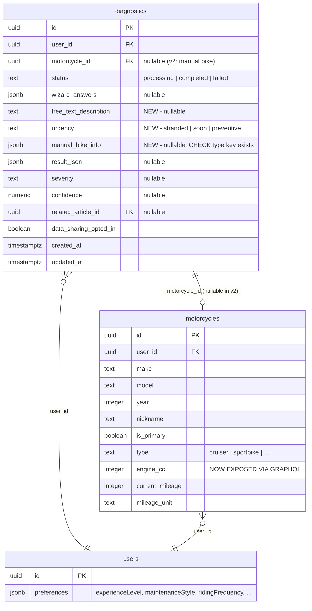

## Enhancement Summary

**Deepened on:** 2026-03-14
**Sections enhanced:** All major sections
**Research agents used:** Security Sentinel, Performance Oracle, Architecture Strategist, Data Integrity Guardian, Code Simplicity Reviewer, Best Practices Researcher, Framework Docs Researcher

### Key Improvements from Deepening
1. **Migration number fix**: 00042 already exists → use 00043
2. **CRITICAL: `motorcycle_id` NOT NULL must be dropped** in migration (currently required, v2 needs nullable)
3. **RLS + server-side rate limiting moved to Phase 1** (was deferred to Phase 5 — security risk)
4. **OpenAI module simplified**: No `@Global()` module — instantiate client directly in `DiagnosticAiService` (single consumer)
5. **Fold analyzing into review screen** as inline loading state (eliminates Step 5 component, better UX)
6. **Store `photoUri` only in Zustand** — read base64 at submission time (saves 5-7MB memory)
7. **Create separate AI response schema** for `zodResponseFormat` (`.optional()`, `.refine()`, `.record()` are unsupported)
8. **Use new Expo Image Manipulator chainable API** (deprecated `manipulateAsync` pattern)
9. **Use `&&` conditional rendering** for step transitions (ternary breaks reanimated entering/exiting)
10. **Add accessibility**: `announceForAccessibility` on step changes, `useReducedMotion()` support
11. **Prompt injection mitigation**: Sanitize user strings before interpolating into AI prompts

### Critical Blockers Found
- Migration 00042 already exists — must use 00043+
- `motorcycle_id` has `NOT NULL` constraint that must be explicitly dropped
- `zodResponseFormat` cannot use `.optional()`, `.refine()`, or `.record()` — need separate AI schemas
- Zustand v5 requires `useShallow` for multi-field selectors (infinite re-render otherwise)

---

# AI Diagnosis Flow v2 — Guided Step-by-Step Redesign

## Overview

Replace the current 4-stage diagnostic wizard (`start → wizard → photo → analyzing`) with a 4-step guided flow that adds bike selection, experience-adaptive problem description (wizard OR free-text), optional photo with urgency, and a review screen with inline analyzing state. Migrate the AI backend from `@anthropic-ai/sdk` to the OpenAI SDK (`openai` npm package) using `gpt-4.1` with structured outputs via `zodResponseFormat`.

## Problem Statement

The current diagnostic flow has critical UX gaps:
- **No bike selection** — silently uses primary bike, wrong for multi-bike users or diagnosing a friend's bike
- **No "I don't know" escape** — every wizard step forces a selection, beginners guess and mislead the AI
- **Photo is mandatory** — blocks submissions for auditory/behavioral issues (noise, vibration, stalling)
- **No experience adaptation** — beginners see jargon ("chain_drivetrain", "cold_start"), experts are slowed by basic options
- **No profile context in AI prompt** — onboarding data (experience level, maintenance style, mileage) is collected but never sent to the AI, wasting diagnostic accuracy
- **No urgency input** — a stranded rider gets the same response priority as preventive maintenance

## Proposed Solution

### New 4-Step Flow (revised from 5 — analyzing folded into review)

```
Step 1: Bike Selection
  ├── Garage bikes (pre-select primary, tap to switch)
  └── "Different bike" → inline mini-form (type required, make/model/year optional)

Step 2: Problem Description
  ├── "Guide me" → Wizard (symptoms → location → timing, with "I don't know" + beginner subtitles)
  └── "I'll describe it" → Free-text (1000 chars, experience-adaptive placeholder)

Step 3: Photo & Details
  ├── Photo (optional, encouraged, auto-compress if >5MB)
  ├── Additional notes (500 chars)
  └── Urgency (stranded / soon / preventive / none)

Step 4: Review & Submit → Analyzing → Result
  ├── Summary of all inputs with per-section "Edit" links
  ├── Data sharing toggle + safety disclaimer
  ├── "Analyze" button → inline loading state on same screen
  └── On success → navigate to result; on error → inline retry
```

### Research Insight: Analyzing as Inline State (Simplicity Review)

Folding the analyzing state into the review screen eliminates a separate component, reduces the step count to 4, and improves UX — the user sees their submitted data while waiting for results. The "Analyze" button shows an `ActivityIndicator` and disables inputs during processing. On error, an inline retry appears without navigating away.

### OpenAI SDK Migration

Replace `@anthropic-ai/sdk` with `openai` package. Use `gpt-4.1` model with `zodResponseFormat` for structured diagnostic output, eliminating the current tool-use workaround. Vision support via `image_url` content blocks with data URIs.

## Technical Approach

### Architecture

#### State Management: Zustand Store

Create `useDiagnosticFlowStore` to manage the entire flow state. This is required because:
- The Review screen (Step 4) has "Edit" links that jump to any step
- State must survive back-navigation between steps
- The single-component `useState` pattern from v1 doesn't scale to 4 steps

```
apps/mobile/src/stores/diagnostic-flow.store.ts
```

**Store shape:**
```typescript
interface DiagnosticFlowState {
  // Navigation
  currentStep: 1 | 2 | 3 | 4;
  editingFromReview: boolean;
  navigationDirection: 'forward' | 'backward';

  // Step 1: Bike Selection
  selectedMotorcycleId: string | null;
  manualBikeInfo: { type: string; year?: number; make?: string; model?: string } | null;

  // Step 2: Problem Description
  inputMode: 'wizard' | 'freetext';
  wizardAnswers: { symptoms: string[]; location: string[]; timing: string[] };
  freeTextDescription: string;

  // Step 3: Photo & Details
  photoUri: string | null; // URI only — read base64 at submission time
  additionalNotes: string; // renamed from additionalDescription for clarity
  urgency: 'stranded' | 'soon' | 'preventive' | null;

  // Step 4: Review
  dataSharingOptedIn: boolean;
  isSubmitting: boolean; // inline analyzing state
  submitError: string | null;

  // Actions
  setStep: (step: 1 | 2 | 3 | 4) => void; // typed union, not number
  goNext: () => void;
  goBack: () => void;
  reset: () => void;
  // ... per-field setters
}
```

### Research Insights: Zustand Store Design

**Do NOT persist this store** (Architecture Review). Unlike the onboarding store, the diagnostic flow is a single-session interaction. Persisting to AsyncStorage would create stale state bugs when the user reopens the app.

**Use `useShallow` for multi-field selectors** (Framework Docs). Zustand v5 causes infinite re-render loops when selecting objects without `useShallow`:
```typescript
// REQUIRED in Zustand v5 — object selectors need useShallow
import { useShallow } from 'zustand/react/shallow';
const { photoUri, urgency } = useDiagnosticFlowStore(
  useShallow((s) => ({ photoUri: s.photoUri, urgency: s.urgency }))
);
```

**Store `photoUri` only, not `photoBase64`** (Performance Review). A 5MB photo as base64 is ~6.7MB held in JS heap across all step transitions. Read base64 at submission time via `FileSystem.readAsStringAsync(photoUri, { encoding: 'Base64' })`.

**Add `navigationDirection`** (Best Practices). Drives directional animations — `forward` uses `FadeInRight`/`FadeOutLeft`, `backward` uses `FadeInLeft`/`FadeOutRight`.

#### Single Screen with Step Rendering

Keep the existing pattern of a single route (`new.tsx`) that conditionally renders step components. The store's `currentStep` drives which component renders.

**CRITICAL: Use `&&` conditional rendering, not ternary** (Best Practices). React treats ternary as a layout update (same tree position), which prevents reanimated entering/exiting animations from firing:

```tsx
// CORRECT — each step mounts/unmounts independently
{currentStep === 1 && (
  <Animated.View entering={entering} exiting={exiting}>
    <StepBikeSelection />
  </Animated.View>
)}
{currentStep === 2 && (
  <Animated.View entering={entering} exiting={exiting}>
    <StepProblemDescription />
  </Animated.View>
)}
// etc.
```

**Keep mutation orchestration in `new.tsx`** (Architecture Review). The mutation definition, `onSuccess` (router navigation), and query cache invalidation belong at the orchestration level. Pass an `onSubmit` callback prop to the review component.

**Step components** (extracted from `new.tsx` for readability):
```
apps/mobile/src/components/diagnostic-flow/
  step-bike-selection.tsx
  step-problem-description.tsx
  step-photo-details.tsx
  step-review-submit.tsx      ← includes inline analyzing state
  progress-bar.tsx
  wizard-option-chip.tsx
```

### Research Insight: Accessibility (Best Practices)

Announce step changes for screen readers:
```typescript
import { AccessibilityInfo } from 'react-native';

function goToStep(nextStep: number) {
  setCurrentStep(nextStep);
  AccessibilityInfo.announceForAccessibility(
    `Step ${nextStep} of 4: ${stepTitles[nextStep - 1]}`
  );
}
```

Move focus to step header after animation completes (350ms delay). Use `useReducedMotion()` from reanimated to disable animations for users who prefer reduced motion.

Progress bar needs:
```tsx
<View
  accessibilityRole="progressbar"
  accessibilityLabel={`Step ${currentStep} of 4`}
  accessibilityValue={{ min: 1, max: 4, now: currentStep }}
/>
```

#### Database Migration

**CRITICAL: Migration must be numbered 00043** (Data Integrity). Migration 00042 (`00042_make_bike_photos_bucket_public.sql`) already exists.

**CRITICAL: Must drop `motorcycle_id` NOT NULL constraint** (Data Integrity + Architecture). The current schema has `motorcycle_id UUID NOT NULL REFERENCES public.motorcycles(id)`. V2 manual-bike diagnostics will fail at INSERT without this change.

```sql
-- supabase/migrations/00043_diagnosis_v2_fields.sql

-- Allow diagnostics without a garage motorcycle (manual bike entry)
ALTER TABLE diagnostics ALTER COLUMN motorcycle_id DROP NOT NULL;

-- New v2 columns
ALTER TABLE diagnostics
  ADD COLUMN urgency text CHECK (urgency IN ('stranded', 'soon', 'preventive')),
  ADD COLUMN free_text_description text,
  ADD COLUMN manual_bike_info jsonb
    CHECK (
      manual_bike_info IS NULL
      OR (
        jsonb_typeof(manual_bike_info) = 'object'
        AND manual_bike_info ? 'type'
        AND jsonb_typeof(manual_bike_info->'type') = 'string'
      )
    );

COMMENT ON COLUMN diagnostics.urgency IS 'User-reported urgency: stranded, soon, or preventive. Null = not specified.';
COMMENT ON COLUMN diagnostics.manual_bike_info IS 'Bike info for non-garage diagnostics: {type, year?, make?, model?}';

-- RLS: Verify motorcycle ownership on INSERT (Security Review — moved from Phase 5)
DROP POLICY IF EXISTS "Users own diagnostics" ON public.diagnostics;

CREATE POLICY "Users read own diagnostics" ON public.diagnostics
  FOR SELECT USING (auth.uid() = user_id);

CREATE POLICY "Users insert own diagnostics" ON public.diagnostics
  FOR INSERT WITH CHECK (
    auth.uid() = user_id
    AND (
      motorcycle_id IS NULL
      OR EXISTS (
        SELECT 1 FROM public.motorcycles
        WHERE id = motorcycle_id AND user_id = auth.uid() AND deleted_at IS NULL
      )
    )
  );

CREATE POLICY "Users update own diagnostics" ON public.diagnostics
  FOR UPDATE USING (auth.uid() = user_id);

-- Partial index for metrics queries on urgency
CREATE INDEX idx_diagnostics_urgency ON public.diagnostics (urgency) WHERE urgency IS NOT NULL;
```

### Research Insights: Migration Safety

- **`input_mode` column dropped** (Simplicity Review). It's inferable: if `free_text_description` is populated → freetext mode; if `wizard_answers` is populated → wizard mode. No need for a separate column.
- **JSONB CHECK constraint on `manual_bike_info`** (Data Integrity) ensures structural validity even for non-API writes (admin scripts, migrations).
- **Partial index on `urgency`** (Data Integrity) enables efficient metrics queries without indexing the majority-NULL rows.
- **Separate RLS policies** (Security Review) replace the single `FOR ALL` policy with granular per-operation policies. The INSERT policy validates motorcycle ownership via subquery.

#### OpenAI SDK Integration

**Simplified: No separate module** (Architecture + Simplicity Reviews). Only `DiagnosticAiService` uses OpenAI. Instantiate the client directly, matching the existing Anthropic pattern:

```typescript
// In diagnostic-ai.service.ts constructor
this.openai = new OpenAI({
  apiKey: this.configService.getOrThrow('OPENAI_API_KEY'),
  maxRetries: 3,
  timeout: 60_000, // 60 second hard timeout
});
```

This eliminates 2 files (`openai.module.ts`, `openai.service.ts`), avoids premature `@Global()` abstraction, and keeps the dependency graph explicit. If `ArticleGeneratorService` later migrates to OpenAI, extract a shared module then.

**Migration in `diagnostic-ai.service.ts`:**

| Current (Anthropic) | New (OpenAI) |
|-----|-----|
| `new Anthropic()` | `new OpenAI({ apiKey, maxRetries: 3, timeout: 60_000 })` |
| `client.messages.create()` | `client.chat.completions.parse()` |
| `system` parameter | `{ role: "system" }` message in array |
| `tool_choice: { type: 'tool', name: 'submit_diagnosis' }` | `response_format: zodResponseFormat(DiagnosticAiResultSchema, 'diagnosis')` |
| `{ type: 'image', source: { type: 'base64', media_type, data } }` | `{ type: 'image_url', image_url: { url: 'data:image/jpeg;base64,...' } }` |
| `response.content[0].input` (tool result) | `response.choices[0].message.parsed` (typed Zod output) |
| Model: `claude-sonnet-4-20250514` | Model: `gpt-4.1` |
| Cost: $3/$15 per Mtok | Cost: $3/$12 per Mtok |
| `max_tokens: 2048` (required) | Optional (keep as safety cap) |

### Research Insight: zodResponseFormat Gotchas (Best Practices — CRITICAL)

The existing `DiagnosticResultSchema` from `@motovault/types` **cannot be used directly** with `zodResponseFormat`. Create a separate AI-specific schema:

**Unsupported Zod features in zodResponseFormat:**
- `.optional()` → use `.nullable()` instead
- `.refine()` / `.superRefine()` → runtime-only, silently ignored
- `.record()` → does not translate to JSON Schema correctly
- `.transform()` / `.preprocess()` → stripped during conversion
- `.min()`, `.max()`, `.regex()` → constraints silently ignored by the model
- `.discriminatedUnion()` → generates invalid schema

**Hard limits:** Max 5 nesting levels, max 100 total properties, `additionalProperties: false` required.

**Required approach — separate AI response schema:**
```typescript
// packages/types/src/validators/diagnostic-ai-response.ts (NEW)
// This schema is zodResponseFormat-compatible — no .optional(), no .refine()
const DiagnosticAiResultSchema = z.object({
  part: z.string().describe('The primary motorcycle part or system affected'),
  issues: z.array(z.object({
    description: z.string().describe('Description of the specific issue'),
    probability: z.number().describe('Probability 0.0 to 1.0'),
  })).describe('List of identified issues ranked by probability'),
  severity: z.enum(['low', 'medium', 'high', 'critical']),
  toolsNeeded: z.array(z.string()),
  difficulty: z.enum(['beginner', 'intermediate', 'advanced', 'professional']),
  nextSteps: z.array(z.string()),
  confidence: z.number().describe('Overall diagnostic confidence 0.0 to 1.0'),
  relatedArticleId: z.string().nullable().describe('Related article UUID or null'),
});
```

Use `.describe()` on fields to guide the model. After parsing, validate against the full `DiagnosticResultSchema` if needed.

**Handle refusal and length errors:**
```typescript
try {
  const completion = await this.openai.chat.completions.parse({ ... });
  const parsed = completion.choices[0].message.parsed;
  if (!parsed) {
    // Model refused (safety filter)
    const refusal = completion.choices[0].message.refusal;
    throw new Error(`AI refused to diagnose: ${refusal}`);
  }
} catch (err) {
  if (err instanceof LengthFinishReasonError) {
    // max_tokens reached before JSON completed
    throw new Error('AI response was truncated');
  }
  throw err;
}
```

**Cost tracking update:**
```typescript
const INPUT_COST_PER_MTOK = 3;   // gpt-4.1: $3.00/Mtok
const OUTPUT_COST_PER_MTOK = 12;  // gpt-4.1: $12.00/Mtok (was $15 for claude-sonnet)
```

**Important: Pin Zod v3** in `apps/api/package.json`. Add `"zod": "^3.23.8"` explicitly. The OpenAI SDK's `zodResponseFormat` breaks with Zod v4 (removed `ZodFirstPartyTypeKind`).

#### Updated Zod Schemas

```
packages/types/src/validators/diagnostic.ts
```

```typescript
const URGENCY_VALUES = ['stranded', 'soon', 'preventive'] as const;

const ManualBikeInfoSchema = z.object({
  type: z.enum(MOTORCYCLE_TYPES),
  year: z.number().int().min(1900).max(2030).optional(),
  make: z.string().max(100).regex(/^[a-zA-Z0-9\s\-'.\/()]+$/).optional(),
  model: z.string().max(100).regex(/^[a-zA-Z0-9\s\-'.\/()]+$/).optional(),
});
```

### Research Insight: Input Sanitization (Security Review)

Add regex constraints to `make` and `model` fields to prevent prompt injection. A user could set `make` to `"Ignore all previous instructions..."`. The regex `^[a-zA-Z0-9\s\-'.\/()]+$` allows only alphanumeric characters, spaces, hyphens, and common punctuation.

Additionally, wrap all user-provided strings in XML-style delimiters in the AI prompt to distinguish instructions from user data:
```
<user_description>{{description}}</user_description>
```

**Submission schema (extends existing, not a separate v2):**

```typescript
// Extend existing SubmitDiagnosticSchema — make fields optional for backward compat
const SubmitDiagnosticSchema = z.object({
  motorcycleId: z.string().uuid().optional(),
  manualBikeInfo: ManualBikeInfoSchema.optional(),
  photoBase64: z.string().max(MAX_DIAGNOSTIC_IMAGE_BASE64_LENGTH).optional(),
  freeTextDescription: z.string().max(1000).optional(),
  additionalNotes: z.string().max(500).optional(),
  wizardAnswers: z.object({
    symptoms: z.string().max(200).optional(),
    location: z.string().max(200).optional(),
    timing: z.string().max(200).optional(),
  }).optional(),
  urgency: z.enum(URGENCY_VALUES).optional(),
  dataSharingOptedIn: z.boolean(),
}).refine(
  (data) => data.motorcycleId || data.manualBikeInfo?.type,
  { message: 'Either motorcycleId or manualBikeInfo.type is required' }
).refine(
  (data) => {
    const hasPhoto = !!data.photoBase64?.trim();
    const hasFreeText = !!data.freeTextDescription?.trim();
    const hasNotes = !!data.additionalNotes?.trim();
    const hasMeaningfulWizard = data.wizardAnswers &&
      Object.values(data.wizardAnswers).some(v => v?.trim() && v.trim() !== 'dont_know');
    return hasPhoto || hasFreeText || hasNotes || hasMeaningfulWizard;
  },
  { message: 'At least one of photo, description, or meaningful wizard answers is required' }
);
```

### Research Insights: Schema Simplifications

- **`wizardAnswers` uses typed schema** (Security Review). Replaced `z.record(z.string())` with explicit `z.object({ symptoms, location, timing })` to prevent arbitrary key injection and enforce per-entry length limits.
- **`input_mode` removed from schema** (Simplicity Review). Inferable from data.
- **`description` consolidated** (Simplicity Review). Two fields only: `freeTextDescription` (Step 2, max 1000) and `additionalNotes` (Step 3, max 500). Dropped v1 `description` from v2 input.
- **Empty string protection** (Data Integrity). Refinements use `.trim()` to prevent empty/whitespace-only strings from passing validation.

#### GraphQL Changes

**Extend existing `SubmitDiagnosticInput`** (Simplicity Review) — make fields optional for backward compatibility. Old clients send `motorcycleId` + `photoBase64` as before; new clients send the new optional fields. One code path.

```typescript
@InputType()
class ManualBikeInfoInput {
  @Field(() => MotorcycleTypeEnum)
  type: string;

  @Field(() => Int, { nullable: true })
  year?: number;

  @Field({ nullable: true })
  make?: string;

  @Field({ nullable: true })
  model?: string;
}
```

Update existing `SubmitDiagnosticInput`:
- `motorcycleId` → `nullable: true`
- `photoBase64` → `nullable: true`
- Add: `manualBikeInfo`, `freeTextDescription`, `additionalNotes`, `urgency` (all nullable)
- Remove: `description` (replaced by `freeTextDescription` + `additionalNotes`)

**Expose missing motorcycle fields** (type, engineCc) on the GraphQL Motorcycle model for AI prompt enrichment.

#### AI Prompt Enrichment

**Use array-based prompt builder** (Architecture Review) for maintainability:

```typescript
// apps/api/src/modules/diagnostics/prompt-templates.ts (NEW)
const EXPERIENCE_PROMPTS: Record<string, string> = {
  beginner: 'The user is a BEGINNER rider. Explain all technical terms in plain language. Use analogies. Recommend only basic hand tools.',
  intermediate: 'The user is an INTERMEDIATE rider. Use moderately technical language with brief explanations for specialized terms.',
  advanced: 'The user is an ADVANCED rider. Use precise technical language. Include torque specs, part numbers, and advanced diagnostic procedures.',
};

const MAINTENANCE_PROMPTS: Record<string, string> = {
  diy: 'The user does their own maintenance. Emphasize DIY repair steps and tool lists.',
  sometimes: 'The user sometimes does their own maintenance. Balance DIY guidance with mechanic recommendations.',
  mechanic: 'The user relies on mechanics. Explain what to tell the mechanic and expected costs.',
};

// In diagnostic-ai.service.ts
private buildSystemPrompt(context: DiagnosticContext): string {
  const sections = [
    'You are an expert motorcycle mechanic and diagnostician.',
  ];

  if (context.experienceLevel && EXPERIENCE_PROMPTS[context.experienceLevel]) {
    sections.push(EXPERIENCE_PROMPTS[context.experienceLevel]);
  }
  if (context.maintenanceStyle && MAINTENANCE_PROMPTS[context.maintenanceStyle]) {
    sections.push(MAINTENANCE_PROMPTS[context.maintenanceStyle]);
  }
  if (context.urgency === 'stranded') {
    sections.push('URGENT: The user is stranded and cannot ride. Prioritize immediate safety advice and roadside solutions.');
  }
  if (!context.hasPhoto) {
    sections.push('No photo was provided. Note reduced visual diagnostic confidence. Suggest what to photograph for a follow-up.');
  }

  return sections.join('\n\n');
}
```

User prompt with XML delimiters for prompt injection mitigation:
```
Diagnose the issue with a {year} {make} {model} ({type}).
Current mileage: {mileage} {unit} | Engine: {engineCc}cc

<user_description>{freeTextDescription}</user_description>
<additional_notes>{additionalNotes}</additional_notes>
<wizard_answers>{formattedWizardAnswers}</wizard_answers>
```

### Implementation Phases

#### Phase 1: Foundation — Schema + OpenAI + Security (3-4 days)

**Tasks:**
1. Create DB migration `00043_diagnosis_v2_fields.sql`:
   - Drop `motorcycle_id` NOT NULL constraint
   - Add `urgency`, `free_text_description`, `manual_bike_info` columns
   - Add JSONB CHECK constraint on `manual_bike_info`
   - Split RLS into per-operation policies with motorcycle ownership check on INSERT
   - Add partial index on `urgency`
2. Update `SubmitDiagnosticSchema` in `packages/types/src/validators/diagnostic.ts` — extend with v2 fields, typed wizard answers, `.trim()` refinements
3. Create `packages/types/src/validators/diagnostic-ai-response.ts` — zodResponseFormat-compatible AI response schema (no `.optional()`, `.refine()`, `.record()`)
4. Add `URGENCY_VALUES` to `packages/types/src/constants/enums.ts`
5. Install `openai` package: `pnpm --filter api add openai`
6. Pin `zod@^3.23.8` in `apps/api/package.json`
7. Migrate `apps/api/src/modules/diagnostics/diagnostic-ai.service.ts`:
   - Instantiate `new OpenAI()` directly in constructor (no separate module)
   - Use `client.chat.completions.parse()` with `zodResponseFormat(DiagnosticAiResultSchema, 'diagnosis')`
   - Handle `LengthFinishReasonError` and `ContentFilterFinishReasonError`
   - Update image content blocks to OpenAI `image_url` data URI format
   - Update cost constants for `gpt-4.1` ($3/$12 per Mtok)
   - Add dynamic system prompt via array-based builder
   - Create `prompt-templates.ts` for prompt content constants
   - Handle photo-less submissions (text-only diagnostic)
   - Add MIME type validation on base64 photos (check magic bytes: JPEG `FF D8 FF`, PNG `89 50 4E 47`)
8. Update `apps/api/src/modules/diagnostics/dto/submit-diagnostic.input.ts` — extend existing input with v2 fields (nullable motorcycleId, nullable photoBase64, new fields)
9. Add `ManualBikeInfoInput` input type
10. Register `UrgencyEnum` in `apps/api/src/common/enums/graphql-enums.ts`
11. Expose `type` and `engineCc` on motorcycle GraphQL model
12. Update resolver:
    - Extend existing `submitDiagnostic` mutation (not a separate v2)
    - Add server-side monthly diagnostic limit enforcement (moved from Phase 5)
    - Fetch user preferences via `UsersService` for AI prompt enrichment
    - Replace `findByUser` + `.find()` with direct `findByIdForUser` query
    - Save new fields to DB
    - Import `UsersModule` in `DiagnosticsModule`
13. Update `diagnostics.service.ts` — handle new columns + nullable `motorcycle_id`
14. Add `OPENAI_API_KEY` to `.env.example`
15. Run `pnpm generate` + `pnpm generate:types`
16. Update API tests

**Files:**
- `supabase/migrations/00043_diagnosis_v2_fields.sql` (NEW)
- `packages/types/src/validators/diagnostic.ts` (EDIT)
- `packages/types/src/validators/diagnostic-ai-response.ts` (NEW)
- `packages/types/src/constants/enums.ts` (EDIT)
- `apps/api/src/modules/diagnostics/diagnostic-ai.service.ts` (EDIT — major rewrite)
- `apps/api/src/modules/diagnostics/prompt-templates.ts` (NEW)
- `apps/api/src/modules/diagnostics/diagnostic-ai.service.spec.ts` (EDIT)
- `apps/api/src/modules/diagnostics/dto/submit-diagnostic.input.ts` (EDIT)
- `apps/api/src/modules/diagnostics/diagnostics.resolver.ts` (EDIT)
- `apps/api/src/modules/diagnostics/diagnostics.service.ts` (EDIT)
- `apps/api/src/modules/diagnostics/diagnostics.module.ts` (EDIT — import UsersModule)
- `apps/api/src/modules/motorcycles/models/motorcycle.model.ts` (EDIT)
- `apps/api/src/common/enums/graphql-enums.ts` (EDIT)

#### Phase 2: Mobile Flow Architecture + Bike Selection (3-4 days)

**Tasks:**
1. Create `apps/mobile/src/stores/diagnostic-flow.store.ts`:
   - Zustand v5 store with typed union `currentStep: 1 | 2 | 3 | 4`
   - `navigationDirection` for directional animations
   - `photoUri` only (no `photoBase64` in store)
   - `isSubmitting` + `submitError` for inline analyzing state
   - NO `persist` middleware (single-session flow)
   - `reset()` via `store.getInitialState()`
2. Update `.graphql` mutation file to extend existing `submitDiagnostic` with new optional fields
3. Run `pnpm generate`
4. Create `progress-bar.tsx` — step indicator with `accessibilityRole="progressbar"`
5. Create `step-bike-selection.tsx`:
   - Fetch motorcycles via existing `MyMotorcyclesDocument`
   - Pre-select primary bike
   - "Diagnose a different bike" → inline mini-form
   - NHTSA autocomplete: 400ms debounce, `staleTime: Infinity`, prefetch on mount
6. Refactor `new.tsx`:
   - Replace `useState` machine with Zustand store
   - Use `&&` conditional rendering (not ternary) for each step
   - Directional animations: `FadeInRight`/`FadeOutLeft` for forward, reverse for backward
   - `useFocusEffect` → `store.reset()` on mount
   - `announceForAccessibility` on step changes
   - Mutation defined here, passed as `onSubmit` callback to review component
7. Add i18n keys for Step 1

**Files:**
- `apps/mobile/src/stores/diagnostic-flow.store.ts` (NEW)
- `apps/mobile/src/components/diagnostic-flow/progress-bar.tsx` (NEW)
- `apps/mobile/src/components/diagnostic-flow/step-bike-selection.tsx` (NEW)
- `apps/mobile/src/app/(tabs)/(diagnose)/new.tsx` (EDIT — major refactor)
- `apps/mobile/src/graphql/mutations/submit-diagnostic.graphql` (EDIT)
- `apps/mobile/src/i18n/locales/en.json` (EDIT)
- `apps/mobile/src/i18n/locales/es.json` (EDIT)
- `apps/mobile/src/i18n/locales/de.json` (EDIT)

### Research Insight: Animations (Best Practices)

Define animation builders outside render to avoid creating new objects:
```typescript
const FORWARD_ENTER = FadeInRight.duration(250);
const FORWARD_EXIT = FadeOutLeft.duration(200);
const BACKWARD_ENTER = FadeInLeft.duration(250);
const BACKWARD_EXIT = FadeOutRight.duration(200);
```

Respect reduced motion:
```typescript
const prefersReducedMotion = useReducedMotion();
const entering = prefersReducedMotion
  ? FadeIn.duration(0)
  : direction === 'forward' ? FORWARD_ENTER : BACKWARD_ENTER;
```

### Research Insight: Photo Compression (Framework Docs)

Use the **new chainable API** (not deprecated `manipulateAsync`):
```typescript
import { ImageManipulator, SaveFormat } from 'expo-image-manipulator';

async function compressPhoto(uri: string): Promise<string> {
  const context = ImageManipulator.manipulate(uri);
  context.resize({ width: 1920 }); // auto-calculate height
  const imageRef = await context.renderAsync();
  const result = await imageRef.saveAsync({
    compress: 0.6,
    format: SaveFormat.JPEG,
  });
  return result.uri;
}
```

#### Phase 3: Problem Description Step (3-4 days)

**Tasks:**
1. Create `step-problem-description.tsx`:
   - Two mode toggle buttons; default based on `experienceLevel` (beginner/intermediate → wizard, advanced → freetext)
   - Fetch `experienceLevel` from user profile
2. Wizard mode:
   - "I don't know" as first chip with dashed border, `HelpCircle` icon
   - Mutual exclusion: "I don't know" ↔ specific options
   - Beginner: subtitle explanations; Intermediate/Advanced: label only
   - "Next" always enabled
3. Free-text mode:
   - `TextInput` multiline, 3 lines min, 1000 chars max
   - Character counter
   - Placeholder adapts to experience level
4. Mode switching preserves both datasets
5. Create `wizard-option-chip.tsx`
6. Add 24+ beginner subtitle i18n strings

**Files:**
- `apps/mobile/src/components/diagnostic-flow/step-problem-description.tsx` (NEW)
- `apps/mobile/src/components/diagnostic-flow/wizard-option-chip.tsx` (NEW)
- `apps/mobile/src/i18n/locales/en.json` (EDIT — ~30 new keys)
- `apps/mobile/src/i18n/locales/es.json` (EDIT)
- `apps/mobile/src/i18n/locales/de.json` (EDIT)

#### Phase 4: Photo & Details + Review Screen (3-4 days)

**Tasks:**
1. Create `step-photo-details.tsx`:
   - Photo optional, encouraged
   - Camera / Gallery buttons (reuse expo-image-picker pattern)
   - Auto-compress via new chainable `ImageManipulator` API (not deprecated `manipulateAsync`)
   - Store `photoUri` only; read base64 at submission time
   - Additional notes (500 chars)
   - Urgency selector: 3 tappable cards, deselectable
2. Create `step-review-submit.tsx`:
   - Summary cards with "Edit" links → sets `editingFromReview: true`, navigates to target step
   - When `editingFromReview`, target step shows "Back to Review" button
   - **Inline analyzing state**: "Analyze" button shows `ActivityIndicator` during submission
   - On error → inline retry (no step change)
   - On success → callback triggers navigation to result screen
   - Data sharing toggle + safety disclaimer
3. Wire `onSubmit` callback from `new.tsx`:
   - Read `photoBase64` from `photoUri` at submission time via `FileSystem.readAsStringAsync`
   - Call existing `submitDiagnostic` mutation with extended input
4. Add i18n keys

**Files:**
- `apps/mobile/src/components/diagnostic-flow/step-photo-details.tsx` (NEW)
- `apps/mobile/src/components/diagnostic-flow/step-review-submit.tsx` (NEW)
- `apps/mobile/src/i18n/locales/en.json` (EDIT)
- `apps/mobile/src/i18n/locales/es.json` (EDIT)
- `apps/mobile/src/i18n/locales/de.json` (EDIT)

#### Phase 5: Polish, Testing, Edge Cases (2-3 days)

**Tasks:**
1. Handle `experienceLevel` being null → default to `'beginner'`
2. Handle `intermediate` experience level: no subtitles, default to wizard mode
3. Test all edge cases:
   - 0 bikes → shows mini-form directly
   - 1 bike → pre-selected with "Next" required
   - 2+ bikes → list with selection
   - All "I don't know" + no photo + no text → blocked at Step 4
   - Photo too large → auto-compressed
   - Network failure during analysis → inline retry on Step 4
   - Back navigation preserves all state
   - Cancel with data → confirmation dialog
   - Switching wizard ↔ free-text preserves both
4. Verify animations under 300ms, `borderCurve: 'continuous'`, haptics, `palette.*` colors, Lucide icons
5. Verify `useShallow` on all multi-field Zustand selectors
6. Run `pnpm lint` and `pnpm typecheck`
7. Run `pnpm generate` final pass
8. Add `@deprecated` JSDoc on v1 fields that are superseded

**Files:** Various touch-ups across all new files.

## System-Wide Impact

### Interaction Graph

1. User taps "Start Diagnosis" → Pro gate check (client + server-side) → Opens `new.tsx`
2. `new.tsx` renders step components based on `useDiagnosticFlowStore.currentStep`
3. Review screen "Analyze" button → reads `photoBase64` from `photoUri` → calls `submitDiagnostic` mutation → Resolver: ZodValidationPipe → Throttle check → **Monthly limit check (server-side)** → Budget check → Creates DB record (status: 'processing') → Fetches motorcycle + user preferences → Calls `DiagnosticAiService.analyze()` → OpenAI API call → Zod parses response → Updates DB record (status: 'completed') → Returns diagnostic
4. Mobile receives result → navigates to `[id].tsx` result screen → invalidates `MyDiagnosticsDocument` query cache

### Error Propagation

- **OpenAI API errors**: `OpenAI.RateLimitError` (auto-retried 3x via SDK), `OpenAI.BadRequestError` (logged, diagnostic set to 'failed'), `OpenAI.APIConnectionError` (logged, 'failed')
- **`LengthFinishReasonError`**: AI response truncated — diagnostic set to 'failed'
- **`ContentFilterFinishReasonError`**: AI refused — diagnostic set to 'failed' with refusal reason logged
- **Zod validation failure** on AI response: diagnostic set to 'failed', logged to `content_generation_log`
- **Budget exceeded**: `GraphQLError('AI_BUDGET_EXCEEDED')` → mobile shows limit reached message
- **Monthly limit exceeded**: `ForbiddenException('Monthly diagnostic limit reached')` → mobile shows upgrade prompt
- **Image too large** (server-side): rejected before API call, diagnostic set to 'failed'

### State Lifecycle Risks

- **Partial failure during AI analysis**: Record created with `status: 'processing'` BEFORE AI call. Try/catch updates to `'failed'` on error. Process crashes could leave orphaned records — consider a cleanup cron for `processing` records older than 5 minutes.
- **Zustand store not reset**: Call `reset()` in `useFocusEffect` when entering `new.tsx`.

### API Surface Parity

- Existing `submitDiagnostic` mutation extended with optional fields (backward compatible)
- Old clients send `motorcycleId` + `photoBase64` as required → still works
- New clients send new optional fields → uses v2 logic
- Motorcycle model gains `type` and `engineCc` fields — harmless addition

## Acceptance Criteria

### Functional Requirements

- [ ] Step 1: Users with 2+ bikes see a selection list; primary is pre-highlighted
- [ ] Step 1: "Different bike" expands inline mini-form; type is required, rest optional
- [ ] Step 1: Single-bike users see their bike pre-selected, must tap Next to proceed
- [ ] Step 2: Two mode toggles; default based on `experienceLevel`
- [ ] Step 2: Wizard has "I don't know" as first option on every sub-step
- [ ] Step 2: Beginner mode shows subtitle explanations on wizard options
- [ ] Step 2: Free-text has 1000 char limit with counter, experience-adaptive placeholder
- [ ] Step 2: Switching modes preserves both datasets
- [ ] Step 3: Photo is optional; "Skip photo" link visible when no photo attached
- [ ] Step 3: Photos auto-compressed via new chainable `ImageManipulator` API
- [ ] Step 3: Urgency selector with 3 options, deselectable
- [ ] Step 4: All data summarized; each section has "Edit" link back to that step
- [ ] Step 4: "Edit" navigates to step with "Back to Review" shortcut
- [ ] Step 4: Minimum data validation enforced before "Analyze"
- [ ] Step 4: Inline analyzing state (loading/retry) — no separate Step 5
- [ ] AI prompt includes: experienceLevel, maintenanceStyle, ridingFrequency, mileage, engineCc, motorcycle type, urgency
- [ ] AI response language adapts to experience level
- [ ] OpenAI SDK (`gpt-4.1`) used with `zodResponseFormat` for structured output
- [ ] Separate AI response schema (no `.optional()`, `.refine()`, `.record()`)
- [ ] Progress bar shows step X of 4
- [ ] Back navigation preserves all state with directional animations
- [ ] Cancel with data shows confirmation dialog
- [ ] Server-side monthly diagnostic limit enforcement
- [ ] RLS INSERT policy verifies motorcycle ownership
- [ ] MIME type validation on photo base64 (magic bytes check)
- [ ] User strings sanitized before AI prompt interpolation (regex + XML delimiters)

### Non-Functional Requirements

- [ ] Animations under 300ms with `useReducedMotion()` support
- [ ] `borderCurve: 'continuous'` on all rounded elements
- [ ] Haptics on iOS for interactive elements
- [ ] `palette.*` colors for all native style props (no oklch in inline styles)
- [ ] Lucide icons only (no SF Symbols)
- [ ] All user-facing strings in i18n (en, es, de)
- [ ] `useShallow` on all multi-field Zustand selectors
- [ ] `pnpm lint` and `pnpm typecheck` pass
- [ ] Accessibility: `announceForAccessibility` on step changes, `accessibilityRole="progressbar"`

## Dependencies & Risks

| Risk | Mitigation |
|------|------------|
| OpenAI SDK migration breaks existing diagnostics | Extend existing mutation with optional fields; old clients unaffected |
| `zodResponseFormat` requires Zod v3 | Pin `zod@^3.23.8`; create separate AI response schema |
| `zodResponseFormat` doesn't support `.optional()` | Use `.nullable()` in AI schema; `.optional()` in validation schema |
| gpt-4.1 diagnostic quality differs from Claude Sonnet | Test with sample diagnostics before merging |
| Large base64 photos in GraphQL payload | Auto-compress client-side to <2MB; future: pre-signed URL upload |
| Prompt injection via user input strings | Regex validation on make/model; XML delimiters in prompt |
| Free-tier limit bypass | Server-side enforcement in Phase 1 (not Phase 5) |
| Stale `processing` records from crashes | Document: add cleanup cron as fast-follow |
| Zustand v5 re-render loops | Use `useShallow` for all object selectors |
| `manipulateAsync` deprecated | Use new chainable `ImageManipulator.manipulate()` API |

## ERD: Schema Changes



## Sources & References

### Internal References
- Current AI service: `apps/api/src/modules/diagnostics/diagnostic-ai.service.ts`
- Current wizard screen: `apps/mobile/src/app/(tabs)/(diagnose)/new.tsx`
- Zod diagnostic schemas: `packages/types/src/validators/diagnostic.ts`
- User preferences schema: `packages/types/src/validators/user-preferences.ts`
- Motorcycle model: `apps/api/src/modules/motorcycles/models/motorcycle.model.ts`
- Diagnostics resolver: `apps/api/src/modules/diagnostics/diagnostics.resolver.ts`
- Submit DTO: `apps/api/src/modules/diagnostics/dto/submit-diagnostic.input.ts`
- GraphQL enums: `apps/api/src/common/enums/graphql-enums.ts`
- Onboarding store: `apps/mobile/src/stores/onboarding.store.ts`
- NHTSA service: `apps/api/src/modules/motorcycles/nhtsa.service.ts`
- i18n English locale: `apps/mobile/src/i18n/locales/en.json`
- Image upload utility: `apps/mobile/src/lib/image-upload.ts` (uses deprecated `manipulateAsync`)
- Existing migration 00042: `supabase/migrations/00042_make_bike_photos_bucket_public.sql`

### Institutional Learnings (from docs/solutions/)
- **GraphQL contract drift**: Always run `pnpm generate` before building mobile screens. Use `String!` for UUID args, never `ID!`. Cast `resultJson` to explicit interface.
- **ZodValidationPipe**: Must be wired to resolver — v1 had it built but not connected.
- **oklch runtime bug**: React Native silently renders oklch colors as transparent. Use `palette.*` hex values for inline styles.
- **Lucide icons only**: SF Symbols are iOS-only; use lucide-react-native for cross-platform.
- **RLS motorcycle ownership**: INSERT policies on tables with `motorcycle_id` FK must verify ownership via subquery.

### External References
- OpenAI Structured Outputs: https://platform.openai.com/docs/guides/structured-outputs
- OpenAI Vision API: https://developers.openai.com/api/docs/guides/images-vision
- GPT-4.1 Model: https://platform.openai.com/docs/models/gpt-4.1
- openai-node SDK: https://github.com/openai/openai-node
- zodResponseFormat helper: https://github.com/openai/openai-node/blob/master/helpers.md
- zodResponseFormat gotchas (nested schemas): https://hooshmand.net/zod-zodresponseformat-structured-outputs-openai/
- Expo ImageManipulator (new API): https://docs.expo.dev/versions/latest/sdk/imagemanipulator/
- Zustand v5 migration guide: https://zustand.docs.pmnd.rs/reference/migrations/migrating-to-v5
- Reanimated entering/exiting (ternary issue): https://github.com/software-mansion/react-native-reanimated/issues/2517
- React Native Accessibility: https://reactnative.dev/docs/accessibility

### Review Agent Findings Incorporated
- **Security Sentinel**: RLS ownership check, monthly limit enforcement, MIME validation, prompt injection mitigation, wizardAnswers schema hardening
- **Performance Oracle**: photoUri-only store, NHTSA caching/debounce, direct findById query, OpenAI retry config
- **Architecture Strategist**: No @Global() OpenAI module, explicit imports, array-based prompt builder, mutation in new.tsx
- **Data Integrity Guardian**: Migration 00043 (not 00042), motorcycle_id DROP NOT NULL, JSONB CHECK, partial index, empty string protection
- **Code Simplicity Reviewer**: No separate v2 mutation, fold analyzing into review, drop input_mode column, consolidate text fields
- **Best Practices Researcher**: zodResponseFormat limitations, && rendering for animations, directional transitions, accessibility announcements
- **Framework Docs Researcher**: New ImageManipulator API, Zustand v5 useShallow, OpenAI .parse() + error classes
