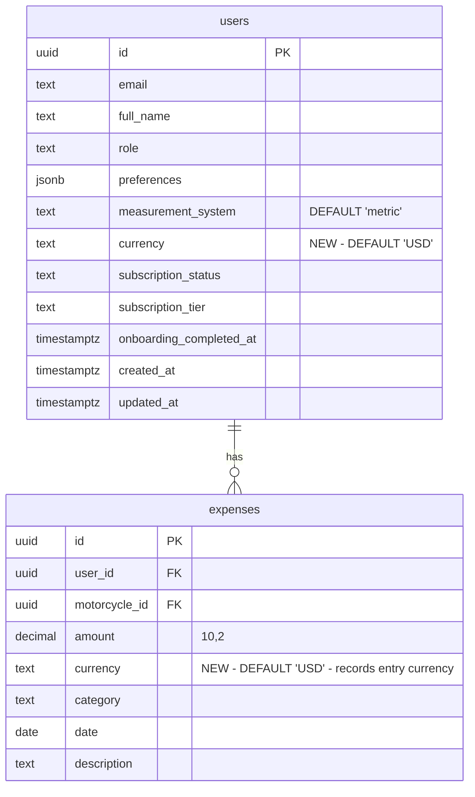

# feat: Add User Currency Preference

## Enhancement Summary

**Deepened on:** 2026-03-24
**Research agents used:** 10 (Best Practices, Framework Docs, TypeScript Reviewer, Architecture Strategist, Security Sentinel, Performance Oracle, Data Integrity Guardian, Pattern Recognition, Code Simplicity, Learnings Researcher)

### Key Improvements from Research
1. **Per-expense currency column** — store currency on each expense to preserve data integrity when user changes preference
2. **`formatToParts()` broken on iOS Hermes** — `getCurrencySymbol` must use a static map, not `formatToParts`
3. **Fix `measurementSystem` sync** in the same PR — near-zero incremental cost, eliminates architectural inconsistency
4. **Type safety** — all utility functions must accept `Currency` type, not `string`
5. **Zod convention** — use `z.enum()` with `Object.values()`, not `z.nativeEnum()` (codebase pattern)
6. **`useHydrateUserPreferences` hook** — centralized sync from `me` query to Zustand store
7. **Defense-in-depth** — validate currency in Zod, RPC function body, AND DB CHECK constraint

### New Considerations Discovered
- Hermes `formatToParts()` not implemented on iOS — blocks original `getCurrencySymbol` approach
- PostgreSQL function overloading: must DROP old `complete_onboarding` before CREATE new one
- Onboarding store version bump (v2 → v3) required for migration logic
- Currency change should NOT trigger expense refetch — use `useMemo` for instant re-format

---

## Overview

Add a user-configurable currency preference that controls how all monetary values (expenses, repair costs, dashboard totals) display throughout the app. Users select their currency during onboarding and can change it anytime in profile settings. This is a **display symbol preference** — no currency conversion. Amounts are entered and stored in the user's chosen currency.

## Problem Statement / Motivation

All expense and cost values are currently hardcoded to USD (`$` symbol, `Intl.NumberFormat('en-US', { currency: 'USD' })`). Non-US users see dollar signs on their locally-entered amounts, which is confusing and incorrect. Currency is a fundamental user preference alongside measurement system (metric/imperial).

## Proposed Solution

Follow the existing `measurement_system` column pattern: add a `currency TEXT DEFAULT 'USD'` column to the `users` table, expose it via GraphQL, collect it during onboarding, and allow changes in profile settings. Update all currency formatting to use the user's preference.

**Key architectural decisions**:
- Currency will be **server-synced** — persisted to DB via `updateUser` mutation and hydrated from `me` query on app startup
- **Fix `measurementSystem` sync in the same PR** — the infrastructure is identical, the cost is near-zero, and it eliminates the existing local-only inconsistency (see brainstorm: `docs/brainstorms/2026-03-24-currency-preference-brainstorm.md`)
- **Store currency per expense** — each expense records the currency it was entered in, preserving data integrity when the user changes preference

## Supported Currencies (~15)

| Code | Symbol | Name | Zero-decimal? |
|------|--------|------|---------------|
| USD | $ | US Dollar | No |
| EUR | € | Euro | No |
| GBP | £ | British Pound | No |
| JPY | ¥ | Japanese Yen | **Yes** |
| CAD | C$ | Canadian Dollar | No |
| AUD | A$ | Australian Dollar | No |
| CHF | CHF | Swiss Franc | No |
| INR | ₹ | Indian Rupee | No |
| BRL | R$ | Brazilian Real | No |
| MXN | MX$ | Mexican Peso | No |
| SEK | kr | Swedish Krona | No |
| NOK | kr | Norwegian Krone | No |
| DKK | kr | Danish Krone | No |
| PLN | zł | Polish Zloty | No |
| TRY | ₺ | Turkish Lira | No |

## Technical Approach

### Phase 1: Database + API Layer

#### 1.1 Migration — Add `currency` columns

Create a single migration file (column + RPC in one file for transactional safety):

**Users table:**
```sql
-- Named constraint for future extensibility (easy to DROP + recreate when adding currencies)
ALTER TABLE public.users
  ADD COLUMN IF NOT EXISTS currency TEXT NOT NULL DEFAULT 'USD';

ALTER TABLE public.users
  ADD CONSTRAINT chk_users_currency
  CHECK (currency IN ('USD','EUR','GBP','JPY','CAD','AUD','CHF','INR','BRL','MXN','SEK','NOK','DKK','PLN','TRY'));
```

**Expenses table** (preserves per-record currency truth):
```sql
ALTER TABLE public.expenses
  ADD COLUMN IF NOT EXISTS currency TEXT NOT NULL DEFAULT 'USD';

ALTER TABLE public.expenses
  ADD CONSTRAINT chk_expenses_currency
  CHECK (currency IN ('USD','EUR','GBP','JPY','CAD','AUD','CHF','INR','BRL','MXN','SEK','NOK','DKK','PLN','TRY'));
```

### Research Insights (Migration)

- **Safe on PostgreSQL 11+**: `ADD COLUMN ... DEFAULT` does not rewrite the table. The default is stored in the catalog and lazily applied. Supabase runs PG 15+.
- **Named constraints**: Unlike `measurement_system`'s inline CHECK, use named constraints (`chk_users_currency`) so they can be easily dropped and recreated when adding new currencies.
- **Existing expenses get `'USD'`**: Correct, since the app was USD-only until now.

#### 1.2 Update `complete_onboarding` RPC

**Critical: Must DROP the old function overload first** — PostgreSQL treats functions with different parameter lists as separate overloads. `CREATE OR REPLACE` with a new parameter creates a *new* function, leaving the old one in place.

```sql
-- Drop the old overload (pattern from migration 00040)
DROP FUNCTION IF EXISTS public.complete_onboarding(
  UUID, JSONB, TEXT, TEXT, INTEGER, motorcycle_type, INTEGER, TEXT, TEXT,
  TEXT, BOOLEAN, TEXT, BOOLEAN, BOOLEAN, BOOLEAN, TEXT, TEXT
);

-- Create new version with p_currency parameter
CREATE OR REPLACE FUNCTION public.complete_onboarding(
  -- ... all existing parameters ...
  p_mileage_unit TEXT DEFAULT NULL,
  p_currency TEXT DEFAULT NULL  -- NEW: added last
) RETURNS JSONB
LANGUAGE plpgsql
SECURITY DEFINER
SET search_path = public
AS $$
BEGIN
  -- Defense-in-depth: validate currency before UPDATE
  IF p_currency IS NOT NULL AND p_currency NOT IN (
    'USD','EUR','GBP','JPY','CAD','AUD','CHF','INR','BRL','MXN','SEK','NOK','DKK','PLN','TRY'
  ) THEN
    RAISE EXCEPTION 'Invalid currency: %', p_currency;
  END IF;

  -- ... existing function body ...
  UPDATE public.users
  SET preferences = COALESCE(preferences, '{}'::jsonb) || p_preferences || v_extra_prefs,
      onboarding_completed_at = NOW(),
      currency = COALESCE(p_currency, currency)  -- NEW
  WHERE id = p_user_id;
  -- ... rest of function ...
END;
$$;
```

#### 1.3 Run type generation

```bash
npx supabase db push
pnpm generate:types  # updates packages/types/src/database.types.ts
```

#### 1.4 Add `Currency` enum to `packages/types`

File: `packages/types/src/constants/enums.ts`

```typescript
export const Currency = {
  USD: 'USD',
  EUR: 'EUR',
  GBP: 'GBP',
  JPY: 'JPY',
  CAD: 'CAD',
  AUD: 'AUD',
  CHF: 'CHF',
  INR: 'INR',
  BRL: 'BRL',
  MXN: 'MXN',
  SEK: 'SEK',
  NOK: 'NOK',
  DKK: 'DKK',
  PLN: 'PLN',
  TRY: 'TRY',
} as const;
export type Currency = (typeof Currency)[keyof typeof Currency];
```

**Currency symbol map** (needed because `formatToParts()` is broken on iOS Hermes):

```typescript
export const CURRENCY_SYMBOLS: Record<Currency, string> = {
  USD: '$', EUR: '€', GBP: '£', JPY: '¥', CAD: 'C$', AUD: 'A$',
  CHF: 'CHF', INR: '₹', BRL: 'R$', MXN: 'MX$', SEK: 'kr',
  NOK: 'kr', DKK: 'kr', PLN: 'zł', TRY: '₺',
};
```

**Display metadata** for the picker UI — place in `apps/mobile/src/lib/currencies.ts` (not in `packages/types`, which should stay dependency-light):

```typescript
import { Currency, CURRENCY_SYMBOLS } from '@motovault/types';

export const CURRENCY_LIST = Object.values(Currency).map((code) => ({
  code,
  symbol: CURRENCY_SYMBOLS[code],
  // Derive name from Intl.DisplayNames if available, fallback to static map
  name: new Intl.DisplayNames(['en'], { type: 'currency' }).of(code) ?? code,
}));
```

### Research Insights (Enum)
- **`CURRENCY_SYMBOLS` is a static map, not `formatToParts()`**: Hermes on iOS does not implement `formatToParts()` — it returns `undefined`. A static symbol map is the only reliable cross-platform approach.
- **Display metadata in mobile app, not packages/types**: The types package is for shared validation types. Display metadata (names, flags) belongs in the app layer.

#### 1.5 Update Zod schemas (HARD PREREQUISITE — blocking)

The `ZodValidationPipe` on the resolver strips unrecognized keys. If currency is not in the Zod schema, it will be silently dropped.

File: `packages/types/src/validators/user.ts`
```typescript
const currencyValues = Object.values(Currency) as [string, ...string[]];
const measurementValues = Object.values(MeasurementSystem) as [string, ...string[]];

export const UpdateUserSchema = z.object({
  fullName: z.string().min(1).max(200).optional(),
  preferences: UserPreferencesSchema.optional(),
  currency: z.enum(currencyValues).optional(),           // NEW
  measurementSystem: z.enum(measurementValues).optional(), // FIX: was missing
});
```

File: `packages/types/src/validators/onboarding-input.ts`
```typescript
const currencyValues = Object.values(Currency) as [string, ...string[]];
// Add to schema:
currency: z.enum(currencyValues).optional(),
```

### Research Insights (Validation)
- **Use `z.enum()`, NOT `z.nativeEnum()`**: Every enum in the codebase uses `z.enum()` with `Object.values()` as `[string, ...string[]]`. `z.nativeEnum()` is for TypeScript `enum` (which this project forbids).
- **Three sources of truth must match**: The CHECK constraint, Zod schema, and `Currency` constant must all reference the same 15 codes. Any mismatch is a silent bug.

#### 1.6 Update NestJS API

File: `apps/api/src/modules/users/models/user.model.ts`
```typescript
@Field()  // Non-nullable: DB guarantees a value via NOT NULL DEFAULT
currency: string;
```

File: `apps/api/src/modules/users/users.service.ts`
- `mapRow()`: add `currency: row.currency`  (no `?? undefined` — column is NOT NULL)
- `update()`: add `if (input.currency !== undefined) payload.currency = input.currency`
- `completeOnboarding()`: pass `p_currency` to RPC call
- **Sanitize DB errors**: Catch CHECK constraint violations before they leak to client:
  ```typescript
  if (error?.code === '23514') throw new BadRequestException('Invalid currency value');
  ```

File: `apps/api/src/modules/users/dto/update-user.input.ts`
```typescript
@Field(() => String, { nullable: true })
currency?: string;
```

File: `apps/api/src/modules/users/dto/complete-onboarding.input.ts`
```typescript
@Field(() => String, { nullable: true })
currency?: string;
```

#### 1.7 Update expense model + service

File: `apps/api/src/modules/expenses/models/expense.model.ts`
```typescript
@Field()
currency: string;
```

File: `apps/api/src/modules/expenses/expenses.service.ts`
- `mapRow()`: add `currency: row.currency`
- `create()`: pass the user's currency when inserting new expenses

File: `packages/types/src/validators/expense.ts`
```typescript
// Add to LogExpenseSchema:
currency: z.enum(currencyValues).optional(), // defaults to user's preference
```

#### 1.8 Update GraphQL operations + regenerate

- `apps/mobile/src/graphql/queries/me.graphql` — add `currency` to selection set
- `apps/mobile/src/graphql/mutations/update-user.graphql` — add `currency` AND `measurementSystem` to response selection set
- Run `pnpm generate` to regenerate `@motovault/graphql` types
- **Verify**: all GraphQL imports come from `@motovault/graphql`, no manual `*Document` names

### Phase 2: Mobile — Currency Formatting

#### 2.1 Update `formatCurrency` utility

File: `apps/mobile/src/lib/expense-constants.ts`

```typescript
import type { Currency } from '@motovault/types';

const formatterCache = new Map<string, Intl.NumberFormat>();

export function formatCurrency(amount: number, currency: Currency = 'USD'): string {
  let formatter = formatterCache.get(currency);
  if (!formatter) {
    formatter = new Intl.NumberFormat('en-US', {
      style: 'currency',
      currency,
    });
    formatterCache.set(currency, formatter);
  }
  return formatter.format(amount);
}
```

### Research Insights (Formatting)

- **Type parameter as `Currency`, not `string`**: The whole point of having a Currency type is compile-time safety. Passing `string` defeats it.
- **`Intl.NumberFormat` handles zero-decimal automatically**: JPY gets 0 fraction digits, USD gets 2. No manual `maximumFractionDigits` check needed — the `currency` option tells the formatter.
- **Map cache is correct**: Constructing `Intl.NumberFormat` is expensive (~0.5-1ms). Reusing a cached instance is 28-724x faster per benchmarks. With max 15 currencies, memory is ~15KB.
- **`'en-US'` locale is hardcoded**: Acceptable for English-only app. Document this assumption with a comment for future devs.
- **No polyfill needed**: Your codebase already uses `Intl.NumberFormat` with `style: 'currency'` in three places without issues (expense-constants.ts, mileage-slider.tsx, upgrade.tsx).

#### 2.2 Add `getCurrencySymbol` utility

**`formatToParts()` is broken on iOS Hermes** — returns `undefined`. Use the static symbol map instead:

```typescript
import { CURRENCY_SYMBOLS, type Currency } from '@motovault/types';

const symbolCache = new Map<Currency, string>();

export function getCurrencySymbol(currency: Currency): string {
  let symbol = symbolCache.get(currency);
  if (!symbol) {
    symbol = CURRENCY_SYMBOLS[currency] ?? currency;
    symbolCache.set(currency, symbol);
  }
  return symbol;
}
```

#### 2.3 Add `useFormatCurrency` hook

Keep `formatCurrency` as a pure function. Use a hook for reactivity:

```typescript
// hooks/useFormatCurrency.ts
export function useFormatCurrency() {
  const currency = useAuthStore(s => s.currency);
  return useCallback((amount: number) => formatCurrency(amount, currency), [currency]);
}
```

This ensures only components that import the hook re-render on currency change. Components not subscribed to `currency` are unaffected.

### Research Insights (Reactivity)
- **Currency change should NOT trigger expense refetch**: Changing currency is a display-only change (like switching time period). Use `useMemo` to reformat amounts instantly with no spinner or network request.
- **No visible flash**: When currency changes on the profile screen, expense screens are unmounted (Expo Router stack). They mount fresh with the new currency on next navigation.

#### 2.4 Remove duplicate `formatCurrency` in widget

File: `apps/mobile/src/components/home/expense-summary-widget.tsx` (line 32-34)
Replace inline `$${value.toLocaleString(...)}` with the shared `formatCurrency()`. This duplicate would silently ignore the currency preference.

#### 2.5 Update `formatCurrencyInput` for zero-decimal currencies

File: `apps/mobile/src/app/(tabs)/(garage)/add-expense.tsx` and `apps/mobile/src/app/(modals)/add-ride-expense.tsx`

```typescript
const ZERO_DECIMAL_CURRENCIES = new Set<Currency>(['JPY']);

export function formatCurrencyInput(value: string, currency: Currency): string {
  if (ZERO_DECIMAL_CURRENCIES.has(currency)) {
    return value.replace(/[^0-9]/g, ''); // digits only, no decimal
  }
  // Existing 2-decimal logic
  const digits = value.replace(/[^0-9.]/g, '');
  const parts = digits.split('.');
  if (parts.length > 2) return `${parts[0]}.${parts.slice(1).join('')}`;
  if (parts[1] && parts[1].length > 2) return `${parts[0]}.${parts[1].slice(0, 2)}`;
  return digits;
}
```

Also set keyboard type conditionally:
```typescript
keyboardType={ZERO_DECIMAL_CURRENCIES.has(currency) ? 'number-pad' : 'decimal-pad'}
```

### Phase 3: Mobile — Onboarding Flow

#### 3.1 Add `currency` to onboarding store

File: `apps/mobile/src/stores/onboarding.store.ts`

```typescript
// Add to OnboardingState:
currency: Currency | null;
setCurrency: (currency: Currency) => void;
```

**Bump store version from 2 to 3** and add migration logic so users who started onboarding before this update don't get undefined state:

```typescript
version: 3,
migrate: (persistedState: unknown, version: number) => {
  const state = persistedState as OnboardingState;
  if (version < 3) {
    state.currency = null; // v2 → v3: add currency field
  }
  return state;
},
```

#### 3.2 Create currency picker onboarding screen

File: `apps/mobile/src/app/(onboarding)/currency.tsx`

- Scrollable list of `CURRENCY_LIST` items showing: currency symbol + code + name
- Auto-detect default from device locale with robust fallback:

```typescript
import { getLocales } from 'expo-localization';

function detectCurrency(): Currency {
  try {
    const code = getLocales()[0]?.currencyCode;
    if (code && code in Currency) return code as Currency;
  } catch {}
  return 'USD'; // fallback
}
```

### Research Insights (Locale Detection)
- **`getLocales()[0]?.currencyCode` returns `null` on iOS Simulator** — always provide USD fallback
- **On Android, `currencyCode` is locale-specific**; on iOS it comes from Region settings
- **Matches `detectMeasurementSystem()` pattern** in `auth.store.ts`

#### 3.3 Insert screen into onboarding flow

File: `apps/mobile/src/app/(onboarding)/_layout.tsx`

Insert `currency` screen in **Section C** (before `riding-frequency`). This ensures ALL users see it, including the skip-bike path.

Screen order:
```
... -> bike-photo -> currency -> riding-frequency -> ...
```

**Update ALL paths that lead to `riding-frequency`**:
- `bike-photo.tsx`: next screen → `currency` (instead of `riding-frequency`)
- `bike-year.tsx` skip handler: route to `currency` (instead of `riding-frequency`)
- Increment `TOTAL_SCREENS` in `_config.ts` and update all subsequent `screenIndex` values

#### 3.4 Pass currency in `completeOnboarding` mutation

File: `apps/mobile/src/app/(onboarding)/personalizing.tsx`

Add `currency` from onboarding store to the `CompleteOnboardingInput` object. Follow the strict codegen pipeline:
1. Update `.graphql` operation file + NestJS resolver together
2. Run `pnpm generate` and commit generated output
3. Then build screens against committed types

### Phase 4: Mobile — Preference Sync (Currency + MeasurementSystem)

#### 4.1 Create `useHydrateUserPreferences` hook

Centralize preference sync from `me` query to Zustand store:

```typescript
// hooks/useHydrateUserPreferences.ts
export function useHydrateUserPreferences(user: MeQuery['me'] | undefined) {
  const setCurrency = useAuthStore(s => s.setCurrency);
  const setMeasurementSystem = useAuthStore(s => s.setMeasurementSystem);

  useEffect(() => {
    if (!user) return;
    if (user.currency) setCurrency(user.currency as Currency);
    if (user.measurementSystem) setMeasurementSystem(user.measurementSystem as MeasurementSystem);
  }, [user?.currency, user?.measurementSystem]);
}
```

Call from `NavigationGate` in `_layout.tsx` alongside the existing `onboardingCompleted` sync.

#### 4.2 Add `currency` to auth store

File: `apps/mobile/src/stores/auth.store.ts`

```typescript
currency: Currency;
setCurrency: (currency: Currency) => void;
```

Default: `'USD'` (overridden by `useHydrateUserPreferences` from `me` query on login).

Add to `partialize` for AsyncStorage persistence (offline fallback).

#### 4.3 Update profile settings to sync both preferences

File: `apps/mobile/src/app/(tabs)/(profile)/index.tsx`

**Currency picker**: Add a "Currency" section below "Units". Use a bottom-sheet picker (15 options don't fit a segmented control). Show current selection as a tappable row.

**Server sync on change** (for both currency AND measurementSystem — fixing the existing local-only gap):

```typescript
const updatePreferenceMutation = useMutation({
  mutationFn: (input: { currency?: string; measurementSystem?: string }) =>
    gqlFetcher(UpdateUserDocument, { input }),
  onSuccess: () => {
    queryClient.invalidateQueries({ queryKey: queryKeys.user.me });
    hapticSuccess();
  },
});

// On currency change:
setCurrency(newCurrency);
updatePreferenceMutation.mutate({ currency: newCurrency });

// On measurement system change (FIX existing gap):
setMeasurementSystem(newSystem);
updatePreferenceMutation.mutate({ measurementSystem: newSystem });
```

This follows the existing `settings.tsx` mutation pattern exactly.

### Phase 5: Update All Expense Display Surfaces

All these files use `formatCurrency()` — update to pass the user's currency:

| File | What to change |
|------|---------------|
| `apps/mobile/src/lib/expense-constants.ts` | Update signature (Phase 2) |
| `apps/mobile/src/app/(tabs)/(garage)/add-expense.tsx` | Replace hardcoded `$` with `getCurrencySymbol(currency)`, pass `currency` to new expense |
| `apps/mobile/src/app/(modals)/add-ride-expense.tsx` | Same as above |
| `apps/mobile/src/app/(tabs)/(garage)/expense-dashboard.tsx` | Pass `currency` to `formatCurrency()` calls |
| `apps/mobile/src/components/home/expense-summary-widget.tsx` | Replace inline formatter with shared `formatCurrency(amount, currency)` |
| `apps/mobile/src/components/garage/expenses-section.tsx` | Pass `currency` to `formatCurrency()` |
| `apps/mobile/src/components/garage/summary-cards.tsx` | Pass `currency` to `formatCurrency()` |
| `apps/mobile/src/components/garage/category-donut.tsx` | Pass `currency` to `formatCurrency()` |
| `apps/mobile/src/components/shared/swipeable-expense.tsx` | Pass `currency` to `formatCurrency()` |

**Pattern**: use the `useFormatCurrency()` hook or read `currency` from `useAuthStore(s => s.currency)`.

**Important**: When displaying historical expenses that have their own `currency` column, use the expense's currency (not the user's current preference) for accurate display.

### Phase 6: Run Full Pipeline

```bash
pnpm generate      # regenerate all types
pnpm lint:fix      # format
pnpm build         # verify
```

Integration checklist (from learnings):
- [ ] `pnpm generate` — no codegen errors
- [ ] `pnpm typecheck` — no type errors
- [ ] All GraphQL imports from `@motovault/graphql`
- [ ] `.graphql` variable types match resolver args
- [ ] `data?.fieldName` matches generated types exactly

## System-Wide Impact

- **Interaction graph**: Profile currency change → `setCurrency()` (Zustand, instant) → `updateUser` mutation → DB update → `invalidateQueries(['user', 'me'])` → all expense components using `useFormatCurrency()` re-render with new currency
- **Error propagation**: If `updateUser` fails, local store retains the new value (optimistic). On next `me` query refetch, server value wins. Consider adding rollback via `onError` if strict consistency is needed.
- **State lifecycle risks**: During onboarding, if `completeOnboarding` fails 3x and user skips, currency won't be persisted. Auth store default (USD or auto-detected) is used until user sets it in profile.
- **API surface parity**: Only mobile app displays expenses. Web cost calculator is a public marketing page — intentionally out of scope.
- **No network request on currency change for expenses**: Currency change is display-only. Use `useMemo` to reformat amounts instantly. Never refetch expense data just because currency changed.

## ERD Changes



## Acceptance Criteria

### Functional Requirements
- [ ] New `currency` column on `users` table with named CHECK constraint for 15 currencies
- [ ] New `currency` column on `expenses` table (per-record currency truth)
- [ ] Default is `USD` for existing and new users/expenses
- [ ] `complete_onboarding` RPC accepts and persists `p_currency` (old overload dropped)
- [ ] Currency picker screen appears in onboarding for ALL users (including skip-bike path)
- [ ] Currency picker auto-detects default from `getLocales()[0]?.currencyCode` with USD fallback
- [ ] Currency is changeable in profile settings via bottom-sheet picker
- [ ] Profile currency change syncs to server via `updateUser` mutation
- [ ] `measurementSystem` change also syncs to server (fix existing gap)
- [ ] Currency hydrates from `me` query on app startup via `useHydrateUserPreferences` hook

### Technical Requirements
- [ ] `formatCurrency()` accepts `Currency` type parameter (not `string`), uses cached `Intl.NumberFormat`
- [ ] `getCurrencySymbol()` uses static `CURRENCY_SYMBOLS` map (not `formatToParts` — broken on iOS Hermes)
- [ ] All expense surfaces display correct currency symbol (no hardcoded `$`)
- [ ] `add-ride-expense.tsx` updated alongside `add-expense.tsx`
- [ ] JPY input: no decimal point, `number-pad` keyboard
- [ ] Duplicate `formatCurrency` in `expense-summary-widget.tsx` replaced with shared utility
- [ ] Zod schemas updated with `z.enum()` pattern (not `z.nativeEnum`)
- [ ] Onboarding store version bumped to v3 with migration logic
- [ ] DB error messages sanitized (CHECK violations don't leak to client)
- [ ] Full type pipeline passes: `pnpm generate && pnpm lint && pnpm build`

## Dependencies & Risks

| Risk | Severity | Mitigation |
|------|----------|-----------|
| `formatToParts()` broken on iOS Hermes | High | Use static `CURRENCY_SYMBOLS` map instead |
| `ZodValidationPipe` strips `currency` if not in schema | High | Zod schema update is a hard prerequisite — implement first |
| PG function overloading: old `complete_onboarding` persists | High | DROP old overload before CREATE new one (pattern from migration 00040) |
| Historical expenses display wrong currency after preference change | High | Per-expense `currency` column preserves truth |
| `getLocales()[0]?.currencyCode` null on iOS Simulator | Medium | Always fallback to USD |
| Onboarding store state migration | Medium | Bump version to 3, add migration for `currency: null` |
| `Intl.NumberFormat` on Hermes Android | Low | Already working in 3 places in codebase — verified |
| `DollarSign` icon semantically wrong for non-USD | Low | Leave for v1, follow-up polish |

## Out of Scope

- Currency conversion (live rates, historical rates)
- Per-motorcycle currency
- Web app cost calculator (public page, no user context)
- AI-generated cost estimates (follow-up: pass currency to Claude prompts)
- Decimal separator locale matching in input keyboard (follow-up UX polish)
- Replacing `DollarSign` lucide icon with generic currency icon

## Sources & References

### Origin

- **Brainstorm document:** [docs/brainstorms/2026-03-24-currency-preference-brainstorm.md](docs/brainstorms/2026-03-24-currency-preference-brainstorm.md) — Key decisions: display-only (no conversion), ~15 popular currencies, DB column on users table, per-user scope, USD default.

### Internal References

- Migration pattern: `supabase/migrations/00049_add_measurement_system.sql`
- RPC function: `supabase/migrations/00041_self_healing_complete_onboarding.sql`
- RPC overload drop pattern: `supabase/migrations/00040_drop_old_complete_onboarding_overload.sql`
- User service mapping: `apps/api/src/modules/users/users.service.ts:24-36`
- Auth store pattern: `apps/mobile/src/stores/auth.store.ts:28,45`
- Currency formatter: `apps/mobile/src/lib/expense-constants.ts:17-25`
- Duplicate formatter: `apps/mobile/src/components/home/expense-summary-widget.tsx:32-34`
- Onboarding layout: `apps/mobile/src/app/(onboarding)/_layout.tsx:13-38`
- Bike-year skip path: `apps/mobile/src/app/(onboarding)/bike-year.tsx:59`
- Profile units section: `apps/mobile/src/app/(tabs)/(profile)/index.tsx:964-1028`
- Expense input hardcoded `$`: `apps/mobile/src/app/(tabs)/(garage)/add-expense.tsx:131`
- Ride expense hardcoded `$`: `apps/mobile/src/app/(modals)/add-ride-expense.tsx:131`
- Existing mutation pattern: `apps/mobile/src/app/(tabs)/(profile)/settings.tsx:185-192`
- Existing Intl usage with dynamic currency: `apps/mobile/src/app/(tabs)/(profile)/upgrade.tsx:209`

### Institutional Learnings

- `docs/solutions/architecture/measurement-system-and-ride-feature-design.md` — Follow same enum + Zustand + centralized formatter pattern. No local format functions in screen files.
- `docs/solutions/integration-issues/expense-dashboard-server-aggregation-charting.md` — Formatting at display layer only, not in aggregation. Hooks before early returns in `React.memo` components.
- `docs/solutions/integration-issues/parallel-agent-graphql-contract-drift.md` — Strict codegen pipeline: write resolver + .graphql together, run `pnpm generate`, commit, then build screens.
- `docs/solutions/security-issues/expense-rls-idor-motorcycle-ownership.md` — RLS pattern for user-scoped data with FK ownership checks.

### External References

- [Hermes `formatToParts` not implemented on iOS](https://github.com/facebook/hermes/issues/1188)
- [Hermes `maximumFractionDigits: 0` crash](https://github.com/facebook/hermes/issues/1236)
- [expo-localization `currencyCode` null issue](https://github.com/expo/expo/issues/21041)
- [Intl.NumberFormat performance (28-724x benchmark)](https://blog.david-reess.de/posts/hBEx9w-on-number-formatting-and-performance)
- [FormatJS polyfill startup penalty](https://github.com/formatjs/formatjs/issues/4276)
