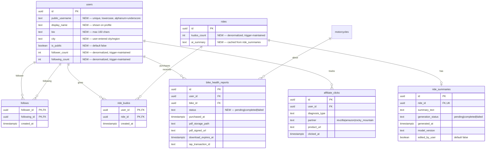

# feat: Community Layer — NOW Tier

## Enhancement Summary

**Deepened on:** 2026-04-07
**Agents used:** architecture-strategist, security-sentinel, performance-oracle, data-integrity-guardian, kieran-typescript-reviewer, julik-frontend-races-reviewer, pattern-recognition-specialist, framework-docs-researcher

### Critical Findings (Must Fix Before Implementation)

1. **CRITICAL SECURITY — Users table exposes ALL columns via RLS to anon**: The `profiles_public_read` RLS policy grants full-row SELECT. Email, role, preferences all leak. **Fix**: Create a `public_profiles` view exposing only safe columns, or enforce column whitelist in every public service method.
2. **CRITICAL FRONTEND — Kudos double-tap toggle reversal**: `isPending` guard alone allows rapid re-tap after mutation settles, causing unkudo. **Fix**: Add `guardRef` + 300ms cooldown on all toggle mutations (kudos, follow).
3. **HIGH SECURITY — Counter columns writable by user**: Users can `UPDATE users SET follower_count = 999999` via RLS. **Fix**: Extend WITH CHECK to lock `follower_count` and `following_count`, or use a BEFORE UPDATE trigger.
4. **HIGH SECURITY — ride_summaries has no RLS policy**: Table defaults to deny-all or open, neither is correct. **Fix**: Add owner-read + public-read policies.
5. **HIGH SECURITY — Health Report callable without purchase verification**: `GenerateBikeHealthReport` mutation has no check for a valid RevenueCat transaction. **Fix**: Verify `iap_transaction_id` before generation. Consider webhook-triggered-only generation.
6. **HIGH SECURITY — IDOR on bike_id in health reports**: ADMIN client bypasses RLS. No ownership check on `bike_id`. **Fix**: Service-layer validation `WHERE bike_id = $bikeId AND user_id = $userId`.
7. **HIGH ARCHITECTURE — Existing rides SELECT RLS must be replaced**: New `rides_public_read` policy must `DROP POLICY IF EXISTS` the old owner-only policy first. PostgreSQL OR-combines multiple SELECT policies.
8. **HIGH PERFORMANCE — Missing indexes**: `idx_ride_kudos_ride_user`, `idx_ride_summaries_ride_id`, `idx_health_reports_user_bike`, `idx_users_public_username` all needed from day one.

### Key Improvements From Research

- All `SECURITY DEFINER` triggers must include `SET search_path = ''` (migration 00007 pattern)
- Add `generation_status` column to `ride_summaries` (`pending | completed | failed`)
- Add `status` column to `bike_health_reports` (`pending | completed | failed`) — already mentioned in risks but missing from ERD
- Extract `ride-summaries` into its own NestJS module (not inside rides module)
- Feed service must return fully hydrated objects from single query — no `@ResolveField()` on feed items
- Create `PublicRiderProfile` as a separate GraphQL type from authenticated `User`
- PDF generation should use worker thread to avoid blocking NestJS event loop
- All new validators/constants need barrel export updates in `index.ts`
- Add `AffiliatePartner` and `HealthReportStatus` to `packages/types/src/constants/enums.ts`
- Scalability wall: fan-out-on-read breaks at ~10K MAU (document migration path to fan-out-on-write)

### Resolved Blocking Questions

- **anonClient provider**: Does not exist in codebase. Options: (a) create `SUPABASE_ANON` provider, or (b) use `SUPABASE_USER` with public-read RLS policies (how share-links works today). Decision: use approach (b) with explicit column whitelisting in the service layer.
- **Feed tab placement**: Use segment control within Home tab (not new tab). Avoids iOS 5-tab limit.
- **RevenueCat consumable**: Use `NON_RENEWING_PURCHASE` event type. Product configured as consumable in App Store Connect, managed product in Google Play.

## Overview

Build MotoVault's first social and monetization layer across 8 features in 3 phases. Starting baseline: 88 MAU. Goals: first revenue signals within 2 weeks (affiliate clicks, Health Report purchases), 3x/week retention via ride feed, viral acquisition via shareable ride cards, and 30%+ follow adoption within 30 days of social launch.

**This is the first major feature tier** — all architectural decisions must account for the NEXT tier (Route Discovery, Group Rides) that follows after NOW tier success metrics are validated.

## Problem Statement / Motivation

MotoVault currently has no social features, no non-subscription revenue, and no viral acquisition mechanism. Users complete diagnostics, log rides, and track maintenance in isolation. There is no reason to return to the app between maintenance events. The 88 MAU baseline reflects this — users engage only when they have a specific task.

The Community Layer solves three problems simultaneously:
1. **Revenue**: Affiliate links + Health Report purchases generate income without requiring subscription commitment
2. **Retention**: A ride feed with kudos creates a daily-check-in habit loop
3. **Growth**: Shareable ride cards with OG images pull new users from Instagram/Twitter/X

## Proposed Solution

8 features across 4 implementation phases (reordered from the PRD for dependency correctness):

| Phase | Features | Duration | Value |
|-------|----------|----------|-------|
| **1: Monetization** | F1 Affiliate Links, F2 Health Report | Week 1-2 | Direct revenue, no social dependency |
| **2: Social Foundation** | F3 Public Profile, F5 AI Ride Summary | Week 3-4 | Profile + content infrastructure |
| **3: Social Graph** | F4 Follow/Unfollow, F6 Shareable Ride Card | Week 5-6 | Connections + viral sharing |
| **4: Social Feed** | F7 Ride Feed, F8 Kudos | Week 7-8 | Retention loop + engagement |

### Dependency Graph

```
F1 (Affiliates) ──── standalone (existing diagnostics)
F2 (Health Report) ── standalone (existing data)

F3 (Profile) ──> F4 (Follow) ──> F7 (Feed)
                                    │
F5 (AI Summary) ──> F6 (Ride Card) ─┘──> F8 (Kudos)
```

## Technical Approach

### Architecture

#### New Database Tables (6 tables, 3 migrations)



#### New Columns on Existing Tables

**`users` table:**
- `public_username TEXT UNIQUE` — lowercase, `^[a-z0-9_]{3,20}$`, `CHECK` constraint
- `display_name TEXT` — max 50 chars
- `bio TEXT` — max 160 chars
- `city TEXT` — max 100 chars, user-entered
- `is_public BOOLEAN DEFAULT false`
- `follower_count INT DEFAULT 0`
- `following_count INT DEFAULT 0`

**`rides` table:**
- `kudos_count INT DEFAULT 0`
- `ai_summary TEXT` — denormalized from `ride_summaries` for fast feed reads

#### RLS Strategy — Public Content Paradigm

This is a **paradigm shift** from the current `user_id = auth.uid()` pattern. Documented institutional learnings mandate:
- All INSERT/UPDATE policies must have `WITH CHECK` (not just `USING`) — [lesson from monorepo code review]
- Ownership verification for referenced foreign keys — [lesson from expense RLS IDOR]
- Public read endpoints must use `anonClient` not `adminClient` — [lesson from Supabase admin bypass]
- Wrap `auth.uid()` in subselect for RLS performance: `(select auth.uid())`

```sql
-- ⚠️ CRITICAL: Create public_profiles VIEW instead of exposing full users row
-- This prevents email, role, preferences from leaking to anonymous users
CREATE VIEW public_profiles AS
SELECT id, public_username, display_name, bio, city, avatar_url,
       follower_count, following_count, is_public
FROM users WHERE is_public = true;
GRANT SELECT ON public_profiles TO anon, authenticated;

-- profiles: owner can read own full row; public reads use the view above
-- Do NOT add a permissive SELECT for anon on the users table directly
CREATE POLICY "users_self_read" ON users FOR SELECT
  TO authenticated USING (id = (select auth.uid()));

-- ⚠️ HIGH: Lock counter columns from user manipulation
-- Extend existing UPDATE WITH CHECK from migration 00011:
CREATE POLICY "users_self_update" ON users FOR UPDATE
  TO authenticated
  USING (id = (select auth.uid()))
  WITH CHECK (
    id = (select auth.uid())
    AND role = (SELECT role FROM public.users WHERE id = (select auth.uid()))
    AND email = (SELECT email FROM public.users WHERE id = (select auth.uid()))
    AND follower_count = (SELECT follower_count FROM public.users WHERE id = (select auth.uid()))
    AND following_count = (SELECT following_count FROM public.users WHERE id = (select auth.uid()))
  );

-- follows: anyone authed can see follow relationships
CREATE POLICY "follows_select" ON follows FOR SELECT
  TO authenticated USING (true);
CREATE POLICY "follows_insert" ON follows FOR INSERT
  TO authenticated WITH CHECK (
    follower_id = (select auth.uid())
    AND follower_id != following_id
    AND EXISTS (SELECT 1 FROM users WHERE id = following_id AND is_public = true)
  );
CREATE POLICY "follows_delete" ON follows FOR DELETE
  TO authenticated USING (follower_id = (select auth.uid()));
-- Explicit deny UPDATE to prevent forging follow relationships
CREATE POLICY "follows_no_update" ON follows FOR UPDATE USING (false);

-- ⚠️ HIGH: DROP existing rides SELECT policy before creating new one
-- PostgreSQL OR-combines multiple SELECT policies — old + new = unintended access
DROP POLICY IF EXISTS "rides_select_owner" ON rides;
CREATE POLICY "rides_public_read" ON rides FOR SELECT
  USING (
    user_id = (select auth.uid())
    OR (is_public = true AND deleted_at IS NULL)
  );
-- NOTE: Public ride queries must use column whitelist in service layer.
-- NEVER expose route_polyline, exact start/end coordinates publicly.
-- Only expose: id, name, distance_m, elevation_gain, elevation_loss,
-- started_at, ended_at, ai_summary, kudos_count, route_thumbnail_uri,
-- motorcycle_id (for bike name), user_id (for rider info)

-- ride_kudos: any authed user can kudos public rides
CREATE POLICY "kudos_insert" ON ride_kudos FOR INSERT
  TO authenticated WITH CHECK (
    user_id = (select auth.uid())
    AND EXISTS (SELECT 1 FROM rides WHERE id = ride_id AND is_public = true AND deleted_at IS NULL)
  );
CREATE POLICY "kudos_select" ON ride_kudos FOR SELECT
  TO authenticated USING (true);
CREATE POLICY "kudos_delete" ON ride_kudos FOR DELETE
  TO authenticated USING (user_id = (select auth.uid()));
CREATE POLICY "kudos_no_update" ON ride_kudos FOR UPDATE USING (false);

-- ⚠️ HIGH: ride_summaries needs RLS policies
ALTER TABLE ride_summaries ENABLE ROW LEVEL SECURITY;
CREATE POLICY "summaries_owner_read" ON ride_summaries FOR SELECT
  TO authenticated
  USING (ride_id IN (SELECT id FROM rides WHERE user_id = (select auth.uid())));
CREATE POLICY "summaries_public_read" ON ride_summaries FOR SELECT
  TO authenticated
  USING (ride_id IN (SELECT id FROM rides WHERE is_public = true AND deleted_at IS NULL));
-- No INSERT/UPDATE/DELETE for authenticated — service role only writes

-- ⚠️ MEDIUM: bike_health_reports — add bike ownership check (IDOR prevention)
CREATE POLICY "health_reports_select" ON bike_health_reports
  FOR SELECT TO authenticated
  USING (user_id = (select auth.uid()));
CREATE POLICY "health_reports_insert" ON bike_health_reports
  FOR INSERT TO authenticated
  WITH CHECK (
    user_id = (select auth.uid())
    AND bike_id IN (SELECT id FROM motorcycles WHERE user_id = (select auth.uid()) AND deleted_at IS NULL)
  );
-- No UPDATE/DELETE — reports are immutable once generated

-- affiliate_clicks: insert by authed, read by service role only
CREATE POLICY "clicks_insert" ON affiliate_clicks FOR INSERT
  TO authenticated WITH CHECK (user_id = (select auth.uid()));
CREATE POLICY "clicks_no_update" ON affiliate_clicks FOR UPDATE USING (false);
CREATE POLICY "clicks_no_delete" ON affiliate_clicks FOR DELETE USING (false);
```

#### Trigger-Based Counter Denormalization

Follow counts and kudos counts maintained atomically via PostgreSQL triggers:

```sql
-- Follow counter trigger
CREATE OR REPLACE FUNCTION update_follow_counts()
RETURNS TRIGGER AS $$
BEGIN
  IF TG_OP = 'INSERT' THEN
    UPDATE users SET following_count = following_count + 1 WHERE id = NEW.follower_id;
    UPDATE users SET follower_count = follower_count + 1 WHERE id = NEW.following_id;
  ELSIF TG_OP = 'DELETE' THEN
    UPDATE users SET following_count = following_count - 1 WHERE id = OLD.follower_id;
    UPDATE users SET follower_count = follower_count - 1 WHERE id = OLD.following_id;
  END IF;
  RETURN NULL;
END;
$$ LANGUAGE plpgsql SECURITY DEFINER SET search_path = '';

-- Kudos counter trigger (same pattern)
CREATE OR REPLACE FUNCTION update_kudos_count()
RETURNS TRIGGER AS $$
BEGIN
  IF TG_OP = 'INSERT' THEN
    UPDATE public.rides SET kudos_count = kudos_count + 1 WHERE id = NEW.ride_id;
  ELSIF TG_OP = 'DELETE' THEN
    UPDATE public.rides SET kudos_count = kudos_count - 1 WHERE id = OLD.ride_id;
  END IF;
  RETURN NULL;
END;
$$ LANGUAGE plpgsql SECURITY DEFINER SET search_path = '';
```

#### Feed Architecture: Pull-Based (Fan-Out-on-Read)

At 88 MAU (targeting 500), fan-out-on-read is the correct choice:

```sql
SELECT r.*, u.display_name, u.avatar_url, u.public_username,
       m.make, m.model, m.year, m.nickname,
       EXISTS(SELECT 1 FROM ride_kudos rk WHERE rk.ride_id = r.id AND rk.user_id = $1) AS has_kudos
FROM rides r
JOIN follows f ON f.following_id = r.user_id
JOIN users u ON u.id = r.user_id
LEFT JOIN motorcycles m ON m.id = r.motorcycle_id
WHERE f.follower_id = $1
  AND r.is_public = true
  AND r.deleted_at IS NULL
  AND r.started_at < $cursor
ORDER BY r.started_at DESC
LIMIT 21;  -- fetch 1 extra for hasNextPage
```

**Critical indexes:**
```sql
-- Feed query: rides by user, ordered by time, with motorcycle_id for join avoidance
CREATE INDEX idx_rides_public_feed ON rides (user_id, started_at DESC)
  INCLUDE (motorcycle_id)
  WHERE is_public = true AND deleted_at IS NULL;

-- Follow lookups
CREATE INDEX idx_follows_follower ON follows (follower_id);
CREATE INDEX idx_follows_following ON follows (following_id);

-- Kudos existence check in feed (PK is user_id, ride_id but feed checks ride_id first)
CREATE INDEX idx_ride_kudos_ride_user ON ride_kudos (ride_id, user_id);

-- Ride summary 1:1 lookup
CREATE UNIQUE INDEX idx_ride_summaries_ride_id ON ride_summaries (ride_id);

-- Username lookup (web SSR profile pages)
-- Note: UNIQUE constraint on public_username creates this implicitly if using ALTER TABLE
CREATE UNIQUE INDEX idx_users_public_username ON users (public_username)
  WHERE public_username IS NOT NULL;

-- Health reports by user+bike (for "My Reports" list)
CREATE INDEX idx_health_reports_user_bike
  ON bike_health_reports (user_id, bike_id, purchased_at DESC);

-- Affiliate analytics (admin dashboard)
CREATE INDEX idx_affiliate_clicks_partner_date
  ON affiliate_clicks (partner, clicked_at DESC);
```

**Scalability thresholds:**

| Component | Safe Until | Breaks At | Migration Path |
|-----------|-----------|-----------|----------------|
| Fan-out-on-read feed | ~5K MAU | ~10K MAU (p95 > 200ms) | Fan-out-on-write `feed_entries` table |
| Counter triggers | ~10K MAU | ~50K MAU (row lock contention) | Async batched counter updates |
| On-the-fly profile stats | ~100K MAU | ~500K MAU | Trigger-maintained columns on `users` |
| PDF generation in-process | ~50 concurrent | ~100 concurrent | Worker thread / BullMQ queue |
| AI summary fire-and-forget | ~10K MAU | ~50K MAU (lost summaries) | Job queue with retry (pg-boss/BullMQ) |

### Implementation Phases

#### Phase 1: Monetization (Week 1-2)

**Feature 1: Parts & Gear Affiliate Links**

Scope: Inject contextual product links into existing diagnosis results screen. Track clicks server-side.

Files to create/modify:
- `supabase/migrations/00055_affiliate_clicks.sql` — new `affiliate_clicks` table
- `apps/api/src/modules/affiliates/affiliates.module.ts` — new module
- `apps/api/src/modules/affiliates/affiliates.service.ts` — link matching + click tracking
- `apps/api/src/modules/affiliates/affiliates.resolver.ts` — `TrackAffiliateClick` mutation
- `apps/api/src/modules/affiliates/models/affiliate-product.model.ts` — GraphQL type
- `apps/api/src/modules/affiliates/dto/track-click.input.ts` — input DTO
- `packages/types/src/validators/affiliate.ts` — Zod schemas
- `apps/mobile/src/graphql/mutations/track-affiliate-click.graphql`
- `apps/mobile/src/components/diagnosis/AffiliateProductCard.tsx` — product card with FTC disclosure
- Modify `apps/mobile/src/app/(tabs)/(diagnose)/` results screen to include affiliate section

Implementation decisions:
- **Structured AI output**: Modify the diagnostic AI prompt to return `part_references[]` with category tags (e.g., `chain`, `brake_pads`, `air_filter`) alongside findings. Store in `result_json`.
- **Product matching**: Server-side matching of part category tags to affiliate URLs. Start with a static config file (`affiliate-products.json`) mapping categories to URLs by make/model. Graduate to a DB table later.
- **FTC compliance**: Every `AffiliateProductCard` renders disclosure text "Affiliate link — we may earn a commission" directly on the card. Non-negotiable.
- **Region handling**: Check user's locale. If affiliate program doesn't cover their region, suppress the affiliate section entirely (don't show broken links).
- **Pro users**: Show affiliate links to all users (free and pro). This is passive revenue, not an ad burden.
- **Click deduplication**: Add unique constraint `(user_id, product_url, DATE(clicked_at))` to prevent click inflation that could get affiliate accounts banned.
- **Server-side URL construction**: Affiliate URLs must be constructed server-side with the MotoVault affiliate tag. Never send the affiliate tag to the client (prevents users replacing it with their own).
- **Validated context**: Zod schema must validate `partner` against `AffiliatePartner` enum. Validate `diagnosis_type` corresponds to an actual diagnosis the user has completed.
- **Throttling**: Add `@Throttle({ default: THROTTLE_PRESETS.STANDARD })` on `TrackAffiliateClick` to prevent abuse.

**Feature 2: Bike Health Report (One-Time Purchase)**

Scope: Generate PDF report of bike history, sell via Apple IAP / Google Play Billing through RevenueCat.

Files to create/modify:
- `supabase/migrations/00056_bike_health_reports.sql` — new table + storage bucket
- `apps/api/src/modules/health-reports/health-reports.module.ts` — new module
- `apps/api/src/modules/health-reports/health-reports.service.ts` — report generation + PDF creation
- `apps/api/src/modules/health-reports/health-reports.resolver.ts` — `GenerateBikeHealthReport`, `GetMyHealthReports`
- `apps/api/src/modules/health-reports/pdf/report-template.tsx` — `@react-pdf/renderer` template
- `apps/api/src/modules/health-reports/models/health-report.model.ts`
- `packages/types/src/validators/health-report.ts` — Zod schemas
- `apps/mobile/src/graphql/mutations/generate-health-report.graphql`
- `apps/mobile/src/graphql/queries/my-health-reports.graphql`
- `apps/mobile/src/app/(tabs)/(garage)/health-report.tsx` — purchase + download screen
- `apps/mobile/src/components/garage/HealthReportCard.tsx`

Implementation decisions:
- **Payment**: RevenueCat consumable IAP product (`NON_RENEWING_PURCHASE` event type). Each report generation is a separate purchase. RevenueCat already handles both Apple IAP and Google Play. Configure as "Consumable" in App Store Connect, "Managed product" in Google Play Console. Do NOT mark as non-consumable in RevenueCat dashboard (allows repurchase).
- **PDF generation**: `@react-pdf/renderer` (React component syntax, no headless Chrome). Renders maintenance tasks, expense totals by category, AI diagnosis history, mileage timeline, and an AI condition summary (GPT-4.1-mini, ~$0.003/report).
- **Storage**: Supabase Storage bucket `reports/{user_id}/{bike_id}/{timestamp}.pdf`. Signed URL with 24-hour expiry for downloads. Re-download generates a new signed URL (not a new report).
- **Minimum data threshold**: Disable purchase button if bike has < 3 maintenance records AND < 3 expenses. Show tooltip: "Add more maintenance history to generate a meaningful report."
- **Delivery flow**: Purchase confirmed via RevenueCat webhook (`NON_RENEWING_PURCHASE`) -> NestJS generates PDF async -> stores in Supabase Storage -> returns signed URL to client -> mobile opens via `expo-sharing`.
- **Purchase verification (SECURITY)**: The `GenerateBikeHealthReport` resolver MUST verify a valid, unconsumed RevenueCat transaction exists for this user before generation. Check `iap_transaction_id` against the webhook-stored record. Consider making generation webhook-triggered-only (not client-callable).
- **Bike ownership check (SECURITY)**: Service layer must validate `WHERE bike_id = $bikeId AND user_id = $userId` before using SUPABASE_ADMIN. The admin client bypasses RLS — defense-in-depth is mandatory.
- **Dual-client pattern**: `health-reports.service.ts` injects BOTH `SUPABASE_USER` (ownership verification) and `SUPABASE_ADMIN` (PDF storage + report record creation), following the share-links service pattern.
- **Worker thread**: PDF generation via `@react-pdf/renderer` blocks the event loop for 2-5s. Use Node.js `worker_threads` or BullMQ worker from the start to prevent API stalling during generation.
- **RevenueCat webhook extension**: The existing `revenuecat.service.ts` `processEvent` must be extended to route `NON_RENEWING_PURCHASE` events to health report generation. This is a gap in the current webhook handler.
- **Client state machine**: After RevenueCat purchase succeeds, navigate to "Report Generating" screen that polls `GetMyHealthReports` every 3 seconds looking for `status: 'completed'`. This survives app backgrounding (truth lives on server, not in ephemeral mutation state).

#### Phase 2: Social Foundation (Week 3-4)

**Feature 3: Public Rider Profile**

Scope: Add profile fields to users, public profile pages on web, profile editing in mobile.

Files to create/modify:
- `supabase/migrations/00057_public_profiles.sql` — add columns to `users`, new RLS policies
- `apps/api/src/modules/users/models/user.model.ts` — expose new fields
- `apps/api/src/modules/users/dto/update-profile.input.ts` — profile edit DTO
- `apps/api/src/modules/users/users.resolver.ts` — `UpdateMyProfile`, `GetRiderProfile(username)`
- `apps/api/src/modules/users/users.service.ts` — username validation, profile queries
- `packages/types/src/validators/profile.ts` — username regex, bio length, Zod schemas
- `packages/types/src/constants/profile.ts` — reserved usernames, validation constants
- `apps/mobile/src/graphql/queries/get-rider-profile.graphql`
- `apps/mobile/src/graphql/mutations/update-my-profile.graphql`
- `apps/mobile/src/app/(tabs)/(profile)/edit-profile.tsx` — profile editing screen
- `apps/mobile/src/app/(tabs)/(profile)/rider/[username].tsx` — other rider's profile view
- `apps/mobile/src/components/profile/ProfileHeader.tsx`
- `apps/mobile/src/components/profile/ProfileStats.tsx`
- `apps/web/src/app/rider/[username]/page.tsx` — public web profile (SSR)
- `apps/web/src/app/rider/[username]/opengraph-image.tsx` — OG image for profiles

Implementation decisions:
- **Username format**: `^[a-z0-9_]{3,20}$`, case-insensitive (stored lowercase), CHECK constraint in DB + Zod validation. Reserved list: `admin, support, motovault, help, api, www, app, system, rider, ride, feed, profile, settings, login, signup, register, password, reset, verify, webhook, graphql, health, report, affiliate, static, assets, _next, robots, sitemap, favicon`. Add Levenshtein distance check against "motovault", "admin", "support" to catch near-miss impersonation (e.g., `motovau1t`, `adm1n`).
- **Privacy**: Only `display_name`, `city`, `bio`, `avatar_url`, `follower_count`, `following_count`, bike makes/models, and aggregate ride stats are public. Email is NEVER public. `full_name` is only shown if user sets it as `display_name`.
- **Profile activation flow**: Settings screen toggle "Make profile public". When toggled on, prompt for username (required) and optional display_name/bio/city. Can be toggled off anytime.
- **Username changes**: Allowed but limited to once per 30 days. Old username held for 30 days before release (prevents impersonation of former identities). Document this in UI.
- **Public profile GraphQL type**: Create `PublicRiderProfile` as a SEPARATE `@ObjectType()` from authenticated `User`. This prevents accidental field leakage (email, role, preferences) if a resolver is misconfigured. The public type exposes only: `id`, `publicUsername`, `displayName`, `bio`, `city`, `avatarUrl`, `followerCount`, `followingCount`, bikes (make/model/year), aggregate ride stats.
- **Bike visibility**: All bikes on a public profile are visible. Per-bike visibility control is NEXT tier complexity — skip for now.
- **Stats aggregation**: Compute on-the-fly from `rides` table for now (fine at 88 MAU). Add materialized view when performance requires it.
- **Profanity filter**: Server-side validation using a curated blocklist. Start with English + user's supported locales. Use `bad-words` npm package or maintain a simple list.

**Feature 5: AI Ride Summary**

Scope: Auto-generate 2-3 sentence summaries after ride completion. Store for use in ride cards and feed.

Files to create/modify:
- `supabase/migrations/00058_ride_summaries.sql` — new `ride_summaries` table + `ai_summary` column on `rides`
- `apps/api/src/modules/rides/ride-summary.service.ts` — summary generation logic
- `apps/api/src/modules/rides/rides.service.ts` — trigger generation after ride completion
- `apps/api/src/modules/rides/rides.resolver.ts` — `RegenerateRideSummary` mutation
- `apps/api/src/modules/rides/models/ride.model.ts` — expose `aiSummary` field
- `packages/types/src/validators/ride-summary.ts` — Zod schema for AI output
- `apps/mobile/src/graphql/mutations/regenerate-ride-summary.graphql`
- `apps/mobile/src/components/rides/RideSummaryCard.tsx`

Implementation decisions:
- **Model**: GPT-4.1-nano (~$0.0005/summary). At 88 MAU, 5 rides/user/month = 440 summaries = $0.22/month. Even at 10K MAU = $22/month. No cost concern.
- **Module extraction**: Extract to `apps/api/src/modules/ride-summaries/` as its own module (not inside rides). It calls an external LLM, writes to its own table, and has its own mutation. The rides module imports `RideSummariesModule` and calls the service from `endRide`.
- **Trigger**: Asynchronous via NestJS `EventEmitter2`. When `endRide` completes, emit `ride.completed` event. `RideSummariesService` listens and generates the summary. This is the first async AI pattern in the codebase — document it as precedent. Insert a `ride_summaries` row with `generation_status: 'pending'` immediately, update to `completed` or `failed` after generation.
- **Input preprocessing**: Do NOT send raw GPS to the LLM. Pre-process into structured data: total distance, duration, avg/max speed, elevation, start/end city (reverse geocode from first/last waypoint), route character (twisties/highway/urban from polyline analysis), weather from `weather_snapshot`.
- **Minimum threshold**: Skip generation if distance < 1km OR duration < 5 minutes. Leave `ai_summary` null.
- **User editing**: Users can edit the summary. Set `edited_by_user = true` on the `ride_summaries` row. Original AI text preserved in `ride_summaries.summary_text`; user edit stored as `rides.ai_summary`. Both tables must be written in the same transaction.
- **Location privacy (SECURITY)**: AI summary prompt MUST use coarse location only (city level, never neighborhood or street). Example: "from Prague" not "from Vinohrady, Prague." When a user toggles a ride to public, show a preview of the summary with a warning: "This summary will be visible to everyone."
- **Prompt injection prevention**: Sanitize all user-controlled inputs (bike name, ride name) before including in AI prompts. Strip special characters that could manipulate AI output.
- **Client stale cache fix**: For ride detail queries where `aiSummary` is null, use `refetchInterval: (query) => query.state.data?.ride?.aiSummary === null ? 5000 : false` to poll every 5s until summary arrives. Stops polling once populated.
- **Pro gate**: Available to all users. This content makes rides shareable and drives viral growth — gating it hurts the network effect.
- **Prompt**: Include the user's preferred language (from i18n locale) so summaries are generated in the user's language.

#### Phase 3: Social Graph (Week 5-6)

**Feature 4: Follow/Unfollow**

Scope: Unidirectional follow system. Public profiles only (no follow requests for private profiles).

Files to create/modify:
- `supabase/migrations/00059_follows.sql` — new `follows` table, counter triggers, indexes
- `apps/api/src/modules/follows/follows.module.ts` — new module
- `apps/api/src/modules/follows/follows.service.ts` — follow/unfollow + follower lists
- `apps/api/src/modules/follows/follows.resolver.ts` — `FollowRider`, `UnfollowRider`, `GetFollowers`, `GetFollowing`
- `apps/api/src/modules/follows/models/follow.model.ts`
- `apps/api/src/modules/follows/dto/follow.input.ts`
- `packages/types/src/validators/follow.ts`
- `apps/mobile/src/graphql/mutations/follow-rider.graphql`
- `apps/mobile/src/graphql/mutations/unfollow-rider.graphql`
- `apps/mobile/src/graphql/queries/get-followers.graphql`
- `apps/mobile/src/graphql/queries/get-following.graphql`
- `apps/mobile/src/components/profile/FollowButton.tsx`
- `apps/mobile/src/app/(tabs)/(profile)/rider/followers.tsx` — follower/following list

Implementation decisions:
- **Private profiles**: Cannot be followed. The follow button is simply not shown. No follow-request mechanism in NOW tier — too complex for 88 MAU. Revisit if users request it.
- **Self-follow prevention**: `CHECK (follower_id != following_id)` constraint in DB.
- **Rate limiting**: `@Throttle({ default: THROTTLE_PRESETS.FOLLOW })` on BOTH `FollowRider` AND `UnfollowRider` mutations. 50 per hour max each. Without rate limiting on unfollow, bots can cycle follow/unfollow thousands of times, triggering counter triggers and creating DB load.
- **Client race condition fix (CRITICAL)**: The `FollowButton` must use a `guardRef` + 500ms cooldown + server-truth-based toggle direction. Base the toggle on `serverFollowing` (last confirmed state), not `optimisticFollowing`. This prevents rapid double-tap from sending follow then immediately unfollow.
- **Block mechanism**: Defer to NEXT tier. At 88 MAU, handle reports manually. Add a simple `Report User` button that creates a support ticket (email to admin).
- **Counter denormalization**: PostgreSQL trigger (see architecture section). No application-level counter management.
- **Follower list visibility**: Public. Anyone can see who follows whom (like Twitter/Strava).
- **Notifications**: Phase 3 will not include push notifications. "New follower" will appear as an in-app indicator only (badge on profile tab). Full notification infrastructure is built alongside Phase 4.

**Feature 6: Shareable Ride Card**

Scope: Public URLs for rides with OG images for social media sharing.

Files to create/modify:
- `apps/web/src/app/ride/[id]/page.tsx` — public ride page (SSR)
- `apps/web/src/app/ride/[id]/opengraph-image.tsx` — dynamic OG image via `next/og` (Satori)
- `apps/api/src/modules/rides/rides.resolver.ts` — `GetPublicRide(rideId)` query (`@Public()`)
- `apps/api/src/modules/rides/rides.service.ts` — public ride fetch with anonymous client
- `apps/mobile/src/components/rides/ShareRideButton.tsx` — share action
- `apps/mobile/src/lib/deep-linking.ts` — universal link handling
- `apps/web/public/.well-known/apple-app-site-association` — iOS Universal Links
- `apps/web/public/.well-known/assetlinks.json` — Android App Links
- `app.json` — add `intentFilters` and `associatedDomains`

Implementation decisions:
- **OG image generation**: `next/og` (Satori) in Next.js 16. Generates 1200x630px PNG at the edge in ~50ms. Content: map thumbnail (static image from `route_thumbnail_uri` if available, placeholder gradient if not), distance, duration, elevation, bike name, AI summary, MotoVault branding. Font: Plus Jakarta Sans (project font).
- **Map on OG image**: Use the pre-rendered `route_thumbnail_uri` from the rides table (already generated during ride tracking). No Mapbox Static API call needed per card view.
- **No-GPS fallback**: For manually logged rides without `route_polyline`, show a stats-only card with a branded gradient background instead of a map.
- **Deep linking**: iOS Universal Links + Android App Links. Expo Router handles routing natively. Web page serves as fallback with "Open in App" / "Get MotoVault" CTA for users without the app installed.
- **Card permanence**: Ride cards are permanent as long as `is_public = true`. If user makes a ride private, the web page returns 404. No expiration.
- **Caching**: OG images cached with `Cache-Control: public, s-maxage=86400, stale-while-revalidate=3600`. On-demand revalidation via Vercel's `revalidatePath()` API when ride is updated (summary edit, privacy change). Fire-and-forget from NestJS — do not block the mutation response. When ride is made private, OG image route returns `notFound()` so Vercel does not serve stale cached version.
- **Image size budget**: Target under 300KB. Fetch `route_thumbnail_uri` as URL reference, do not embed as base64. Satori supports `` for external images.
- **Share flow (RACE CONDITION FIX)**: Use `mutateAsync` (not `mutate` with callbacks) for the make-public mutation so control flow is sequential. Share sheet only opens on success. Guard with `shareGuardRef` to prevent double-tap from firing two `makePublic` mutations.
- **Deep linking config**: Add `associatedDomains: ['applinks:motovault.app']` to iOS config in `app.config.ts`. Add `intentFilters` with `autoVerify: true` for Android. Scope AASA paths strictly to `/ride/*` and `/rider/*` only — never use wildcards. Requires new dev build (does not work in Expo Go).

#### Phase 4: Social Feed (Week 7-8)

**Feature 7: Ride Feed**

Scope: Chronological feed of followed riders' public rides.

Files to create/modify:
- `apps/api/src/modules/feed/feed.module.ts` — new module
- `apps/api/src/modules/feed/feed.service.ts` — feed query (fan-out-on-read)
- `apps/api/src/modules/feed/feed.resolver.ts` — `GetRideFeed(first, after)` with cursor pagination
- `apps/api/src/modules/feed/models/feed-ride.model.ts` — GraphQL type (ride + rider info + kudos state)
- `apps/mobile/src/graphql/queries/ride-feed.graphql`
- `apps/mobile/src/app/(tabs)/(home)/feed.tsx` — feed screen
- `apps/mobile/src/components/feed/FeedRideCard.tsx` — ride card in feed context
- `apps/mobile/src/components/feed/EmptyFeedState.tsx`

Implementation decisions:
- **Tab placement**: Replace the current Home tab content with a segment control ("My Activity" / "Feed") within `index.tsx` that conditionally renders content. This avoids adding a 6th tab (iOS max 5 recommended) and avoids fighting Expo Router's file-based routing (no nested tab navigator needed). The Home tab icon changes to represent the feed/activity concept.
- **Architecture**: Fan-out-on-read (see architecture section). Query at read time, no feed materialization. Correct for sub-10K MAU. **Critical**: Feed service must return fully hydrated `FeedRide` objects from a single query. Do NOT use `@ResolveField()` for rider info or motorcycle info on feed items — that creates 21 x 2 = 42 extra queries per page (N+1). Use Supabase query builder with embedded selects (`.select('*, users!inner(...), motorcycles(...)')`), not raw SQL.
- **Profile stats NOT in feed cards**: Feed cards show only ride-level data (distance, duration, bike name, summary, kudos). Do NOT include aggregate profile stats (total rides, total distance) per rider — that triggers N+1 aggregation queries.
- **Pagination**: Cursor-based using `started_at` timestamp (not UUID). Matches existing ride pagination pattern. Use `useInfiniteQuery` with `maxPages: 5` for memory optimization.
- **Empty state**: If user follows nobody: show "Find riders to follow" CTA + suggested profiles (most active public profiles). If user follows people but no rides exist: show "Your feed will fill up as riders share their adventures."
- **Refresh**: Pull-to-refresh via `RefreshControl`. No real-time/WebSocket — poll on screen focus via TanStack Query's `refetchOnWindowFocus`.
- **Refresh + pagination race fix**: Guard `fetchNextPage` during refresh: `if (hasNextPage && !isFetchingNextPage && !isRefetching) fetchNextPage()`. Without `!isRefetching`, a pull-to-refresh concurrent with fetchNextPage creates stale-page-append (pages 1-2 fresh, page 3 from old fetch). Also fix this in existing `rides.tsx` line 136.
- **Performance**: Critical index `idx_rides_public_feed` (see architecture section). At 88 MAU, performance is not a concern. Monitor query time and add materialized feed if p95 exceeds 200ms.

**Feature 8: Kudos**

Scope: Single-tap positive reaction on ride cards.

Files to create/modify:
- `supabase/migrations/00060_kudos.sql` — new `ride_kudos` table, counter trigger, index
- `apps/api/src/modules/kudos/kudos.module.ts` — new module
- `apps/api/src/modules/kudos/kudos.service.ts` — toggle kudos (insert or delete)
- `apps/api/src/modules/kudos/kudos.resolver.ts` — `ToggleKudos(rideId)` mutation
- `apps/api/src/modules/kudos/models/kudos.model.ts`
- `packages/types/src/validators/kudos.ts`
- `apps/mobile/src/graphql/mutations/toggle-kudos.graphql`
- `apps/mobile/src/components/feed/KudosButton.tsx`

Implementation decisions:
- **Toggle pattern**: Single `ToggleKudos` mutation. Server checks: if kudos exists, delete it (unkudo); if not, insert (kudo). Uses `ON CONFLICT DO NOTHING` for race condition safety.
- **Self-kudos**: Allowed. Not worth the complexity to prevent, and platforms like Strava allow it.
- **Optimistic updates**: TanStack Query optimistic mutation on the feed query cache. Toggle `hasKudos` boolean and increment/decrement `kudosCount` immediately. Rollback on error.
- **Haptics**: `expo-haptics` medium impact on tap + scale animation (0.85 -> 1.0 over 80ms) on the kudos icon. 80ms max — 200ms is excessive for micro-interactions that users repeat dozens of times per session. Pure `useDerivedValue` for animation (no side effects — lesson from ride-hud reanimated patterns).
- **Quadruple protection (CRITICAL — fixes double-tap race)**: (1) Client `guardRef` with 300ms cooldown after mutation settles (NOT just `isPending` — `isPending` goes false before cooldown), (2) `cancelQueries` on feed query key in `onMutate` to prevent in-flight refetch from overwriting optimistic update, (3) Server toggle logic (`ON CONFLICT DO NOTHING` for insert, or check-then-act), (4) DB composite PK `(user_id, ride_id)` rejects duplicates.
- **Throttling**: Add `@Throttle({ default: THROTTLE_PRESETS.KUDOS })` to prevent rapid automated kudos.
- **Kudos list**: Show "N kudos" count only. Tapping the count shows a modal with the list of users who gave kudos. Defer kudos notifications to post-Phase 4 (build alongside notification infrastructure).
- **Counter denormalization**: PostgreSQL trigger on `ride_kudos` maintains `rides.kudos_count` (see architecture section).

## System-Wide Impact

### Interaction Graph

- Ride completion -> triggers AI ride summary generation (async, fire-and-forget via `ride-summary.service.ts`)
- Follow/unfollow -> PostgreSQL trigger updates `users.follower_count` / `following_count`
- Kudos toggle -> PostgreSQL trigger updates `rides.kudos_count`
- Health Report purchase -> RevenueCat webhook -> NestJS generates PDF -> Supabase Storage upload
- Affiliate click -> server-side tracking before redirect -> client opens external browser
- Profile toggle to private -> existing public ride cards return 404, followed-by relationships persist but rides hidden from feed

### Error Propagation

- AI summary generation failure: ride saves normally, `ai_summary` remains null, UI shows "Summary unavailable". No retry queue in Phase 2 — user can manually trigger via `RegenerateRideSummary`.
- PDF generation failure: return error to client, do not charge (RevenueCat: only mark as "delivered" after successful generation). User can retry.
- Follow counter drift: unlikely with trigger-based approach, but add a monthly reconciliation RPC as defense-in-depth.
- Kudos counter drift: same approach as follow counters.

### State Lifecycle Risks

- **Partial ride completion + summary**: If `endRide` succeeds but summary generation fails, ride exists without summary. This is acceptable — summary is optional enhancement.
- **Health report purchase without PDF**: RevenueCat charges first, then we generate. If generation fails, user paid but has no PDF. Mitigation: RevenueCat `BILLING_ISSUE` + manual support resolution. Add a `status` column to `bike_health_reports` (pending/completed/failed).
- **Follow + user deletion**: `ON DELETE CASCADE` on `follows.follower_id` and `follows.following_id` handles cleanup. Counter triggers fire on cascade deletes.

### API Surface Parity

New GraphQL operations (all need `.graphql` files in mobile + web, codegen after):

| Operation | Auth | Client |
|-----------|------|--------|
| `TrackAffiliateClick(input)` | `@UseGuards(GqlAuthGuard)` | SUPABASE_USER |
| `GenerateBikeHealthReport(bikeId)` | `@UseGuards(GqlAuthGuard)` | SUPABASE_ADMIN (PDF gen) |
| `GetMyHealthReports` | `@UseGuards(GqlAuthGuard)` | SUPABASE_USER |
| `GetRiderProfile(username)` | `@Public()` + `@Throttle(STANDARD)` | SUPABASE_USER (with public-read RLS + column whitelist) |
| `UpdateMyProfile(input)` | `@UseGuards(GqlAuthGuard)` | SUPABASE_USER |
| `FollowRider(targetUserId)` | `@UseGuards(GqlAuthGuard)` | SUPABASE_USER |
| `UnfollowRider(targetUserId)` | `@UseGuards(GqlAuthGuard)` | SUPABASE_USER |
| `GetFollowers(userId, first, after)` | `@UseGuards(GqlAuthGuard)` | SUPABASE_USER |
| `GetFollowing(userId, first, after)` | `@UseGuards(GqlAuthGuard)` | SUPABASE_USER |
| `GetRideFeed(first, after)` | `@UseGuards(GqlAuthGuard)` | SUPABASE_USER |
| `GetPublicRide(rideId)` | `@Public()` + `@Throttle(STANDARD)` | SUPABASE_USER (with public-read RLS + column whitelist — NEVER expose route_polyline) |
| `ToggleKudos(rideId)` | `@UseGuards(GqlAuthGuard)` + `@Throttle(KUDOS)` | SUPABASE_USER |
| `RegenerateRideSummary(rideId)` | `@UseGuards(GqlAuthGuard)` + `@Throttle(RIDE_SUMMARY)` | SUPABASE_USER for ownership check, SUPABASE_ADMIN for AI generation + write |

### Integration Test Scenarios

1. **Follow + Feed + Privacy toggle**: User A follows User B. User B logs a public ride. User A sees it in feed. User B makes profile private. User A's feed no longer shows User B's rides.
2. **Kudos + Counter + Unfollow**: User A kudos User B's ride. Counter increments. User A unfollows User B. Kudos persists (doesn't disappear). Counter stays correct.
3. **Health Report + Soft Delete**: User purchases report for Bike X. User soft-deletes Bike X. Report PDF is still accessible via signed URL. Report list shows "(deleted bike)" label.
4. **AI Summary + Manual Ride**: User manually logs a ride with distance but no GPS data. Summary generation runs with available data only (no location references). Summary reads: "You logged a 45km ride on your Kawasaki Z900."
5. **Shareable Card + OG Image + Account Deletion**: User shares ride card. Card gets indexed by Google. User deletes account. Web page returns 404. OG image returns 404. Google eventually deindexes.

## Acceptance Criteria

### Functional Requirements

#### Phase 1
- [ ] Diagnosis results show contextual affiliate links with FTC disclosure text
- [ ] Affiliate clicks tracked server-side with user_id, partner, and context
- [ ] Affiliate links suppressed for unsupported regions
- [ ] Health Report PDF generates with maintenance log, expense totals, diagnosis history, mileage, AI summary
- [ ] Health Report purchase via RevenueCat IAP ($5-9 consumable)
- [ ] Health Report PDF stored in Supabase Storage with signed URL download
- [ ] Minimum data threshold prevents purchase for bikes with < 3 maintenance records AND < 3 expenses
- [ ] Health Report re-download works without re-purchase

#### Phase 2
- [ ] Users can set public_username (unique, lowercase, 3-20 chars, alphanum + underscore)
- [ ] Users can toggle is_public on/off
- [ ] Public profile shows display_name, city, bio, bikes, ride stats, recent public rides
- [ ] Profile accessible at motovault.app/rider/{username} with OG meta tags
- [ ] Private profiles return 404 on web
- [ ] AI ride summaries generate automatically after ride completion (distance >= 1km, duration >= 5min)
- [ ] Summaries generated in user's preferred language
- [ ] Users can edit AI summary (original preserved)
- [ ] Summary generation failures handled gracefully (ride saves, summary shows as unavailable)

#### Phase 3
- [ ] Follow/unfollow public profiles with single tap
- [ ] Cannot follow private profiles or self
- [ ] Follower/following counts update atomically via trigger
- [ ] Follow rate limited to 50/hour
- [ ] Follower/following lists with cursor pagination
- [ ] Ride cards shareable via public URL with OG image (1200x630)
- [ ] OG image shows map thumbnail, distance, duration, bike name, AI summary
- [ ] Deep linking opens ride in app (iOS Universal Links + Android App Links)
- [ ] Web fallback page with "Get MotoVault" CTA for non-app users
- [ ] Making ride private returns 404 for public URL

#### Phase 4
- [ ] Feed shows public rides from followed riders, chronological order
- [ ] Feed uses cursor pagination (timestamp-based, not offset)
- [ ] Empty feed shows suggested riders to follow
- [ ] Pull-to-refresh + refetch on screen focus
- [ ] Kudos toggle with optimistic UI update
- [ ] Kudos count visible on ride cards
- [ ] Haptic feedback on kudos tap (iOS)
- [ ] Kudos list viewable (modal showing users who gave kudos)

### Non-Functional Requirements

- [ ] Feed query p95 < 200ms at current scale
- [ ] OG image generation < 100ms (Satori edge rendering)
- [ ] AI summary generation < 5s per ride
- [ ] PDF generation < 15s per report
- [ ] All new tables have RLS enabled with proper USING + WITH CHECK policies
- [ ] All public endpoints use anonClient, never SUPABASE_ADMIN
- [ ] Username validation includes reserved word check + basic profanity filter
- [ ] All new strings added to all 13 locale files

### Quality Gates

- [ ] `pnpm generate` runs successfully after all resolver changes
- [ ] `pnpm lint` passes
- [ ] New RLS policies tested with both authenticated and anonymous roles
- [ ] Counter denormalization triggers tested for INSERT, DELETE, and CASCADE scenarios
- [ ] Optimistic update rollback tested for kudos on network failure

## Success Metrics

Measured at 30 and 90 days post-launch per phase:

| Metric | 30-Day Target | 90-Day Target |
|--------|---------------|---------------|
| Affiliate link CTR | >= 5% of diagnosis completions | >= 8% |
| Health Report purchases | >= 10 reports sold | >= 50 reports sold |
| Public profile adoption | >= 20% of MAU | >= 40% of MAU |
| Follow adoption | >= 30% of MAU following >= 1 rider | >= 50% |
| AI summary generation rate | >= 90% of eligible rides | >= 95% |
| Ride card shares | >= 10% of public rides shared | >= 20% |
| Feed DAU / MAU ratio | >= 30% | >= 40% |
| Kudos per feed session | >= 2 kudos given per session | >= 3 |

## Dependencies & Prerequisites

### Blocking

1. **RevenueCat consumable IAP product**: Must be configured in RevenueCat dashboard + App Store Connect + Google Play Console before Phase 1 Health Report launch
2. **Affiliate partner accounts**: Apply for RevZilla (CJ Affiliate) and Amazon Associates. Approval takes 1-7 days. Need tracking URLs before Phase 1.
3. **Deep linking setup**: `apple-app-site-association` must be served from `motovault.app` domain before Phase 3 shareable cards launch
4. **Font file for OG images**: Plus Jakarta Sans `.ttf` file (not `.woff2`) needed for Satori/next-og rendering

### Non-Blocking

- Push notification infrastructure: not required for NOW tier. In-app indicators only.
- Block/report system: manual support resolution at 88 MAU. Build proper system at 500+ MAU.
- Username dispute resolution: handle manually via support.

## Risk Analysis & Mitigation

| Risk | Likelihood | Impact | Mitigation |
|------|-----------|--------|------------|
| **Users table exposes email/role via RLS** | High if not fixed | Critical | Create `public_profiles` view; never grant anon SELECT on users table directly |
| **Health Report callable without purchase** | High if mutation is client-callable | Critical | Verify RevenueCat transaction before generation, or make webhook-triggered-only |
| **Kudos/follow double-tap race condition** | Certain without guard | High | guardRef + cooldown on all toggle components |
| **AI summaries reveal home location** | Medium | High | Coarse location only in prompts; preview warning on public toggle |
| Apple rejects external payment for Health Report | High if using Stripe | Critical | Use RevenueCat IAP — fully compliant |
| RLS paradigm shift exposes private data | Medium | Critical | Test every policy with anon + authenticated roles. Column whitelists in service layer. |
| Tab bar overflow (6 tabs) | Certain if adding Feed tab | High | Segment control within Home tab (resolved) |
| Counter columns writable by user | High if not fixed | High | WITH CHECK locks on follower_count/following_count |
| Feed N+1 from @ResolveField | Medium | High | Return fully hydrated objects from single query |
| PDF generation blocks event loop | Medium | Medium | Worker thread from the start |
| AI cost scaling | Low at current MAU | Medium | GPT-4.1-nano ($0.22/month at 88 MAU). Budget capped by ai_budget module. |
| Affiliate click inflation | Medium | Medium | Unique constraint (user_id, product_url, DATE(clicked_at)) |
| OG image quality on social platforms | Medium | Medium | Test with Twitter Card Validator + Facebook Sharing Debugger |
| Username squatting/impersonation | Low at 88 MAU | Low | Expanded reserved list + Levenshtein check + 30-day hold on released names |
| Counter drift from concurrent operations | Very Low | Low | Triggers are atomic. Monthly reconciliation RPC as backup. |

## Pattern Conventions (From Review Agents)

### Resolver Guard Convention
- **Fully-authenticated modules** (affiliates, follows, feed, kudos, health-reports): Use class-level `@UseGuards(GqlAuthGuard)` (rides resolver pattern)
- **Mixed modules** (users with both `UpdateMyProfile` and `GetRiderProfile`): Use method-level guards (articles/share-links pattern)
- **Reference pattern**: Use articles service for `@Public()` endpoints (NOT share-links — it uses `SUPABASE_ADMIN` which is the documented anti-pattern)

### Guard Audit Tests
Every new resolver MUST have a `.spec.ts` that verifies guards are correctly applied. Create: `affiliates.resolver.spec.ts`, `follows.resolver.spec.ts`, `feed.resolver.spec.ts`, `kudos.resolver.spec.ts`, `health-reports.resolver.spec.ts`, `ride-summaries.resolver.spec.ts`. This is an established testing convention in the codebase.

### mapRow Type Safety
All new services must type `mapRow` parameters as `Tables<'table_name'>` from `@motovault/types/database` (articles service pattern), not `Record<string, unknown>` (rides service pattern). This gives compile-time safety.

### Barrel Exports
Update these files after creating new validators/constants:
- `packages/types/src/validators/index.ts` — add exports for: `affiliate.ts`, `health-report.ts`, `profile.ts`, `ride-summary.ts`, `follow.ts`, `kudos.ts`
- `packages/types/src/constants/index.ts` — add export for `profile.ts`

### New Constants Required
Add to `packages/types/src/constants/enums.ts`:
```typescript
export const AffiliatePartner = { REVZILLA: 'revzilla', AMAZON: 'amazon', ROCKY_MOUNTAIN: 'rocky_mountain' } as const;
export type AffiliatePartner = (typeof AffiliatePartner)[keyof typeof AffiliatePartner];

export const HealthReportStatus = { PENDING: 'pending', COMPLETED: 'completed', FAILED: 'failed' } as const;
export type HealthReportStatus = (typeof HealthReportStatus)[keyof typeof HealthReportStatus];

export const SummaryGenerationStatus = { PENDING: 'pending', COMPLETED: 'completed', FAILED: 'failed' } as const;
export type SummaryGenerationStatus = (typeof SummaryGenerationStatus)[keyof typeof SummaryGenerationStatus];
```

### New Throttle Presets Required
Add to throttle presets:
- `THROTTLE_PRESETS.FOLLOW` — 50/hour
- `THROTTLE_PRESETS.KUDOS` — 200/hour
- `THROTTLE_PRESETS.HEALTH_REPORT` — 10/hour (expensive PDF + AI generation)
- `THROTTLE_PRESETS.RIDE_SUMMARY` — 20/hour (AI API call)

### TanStack Query Key Discipline
Never reuse query keys between `useQuery` and `useInfiniteQuery` (documented lesson from measurement-system fix — causes cache corruption with `Cannot read property 'length' of undefined`). Feed uses `useInfiniteQuery` with its own key namespace.

## Codegen Discipline

After every resolver or `.graphql` file change, run:

```bash
pnpm generate
```

This is the synchronization checkpoint. Contract drift between API and mobile is the #1 integration failure mode in this codebase (documented institutional learning).

## Migration Sequence

```
00055_affiliate_clicks.sql          — Phase 1
00056_bike_health_reports.sql       — Phase 1
00057_public_profiles.sql           — Phase 2 (users table alterations + RLS)
00058_ride_summaries.sql            — Phase 2
00059_follows.sql                   — Phase 3 (follows table + counter triggers)
00060_kudos.sql                     — Phase 4 (ride_kudos table + counter trigger)
```

Each migration is independently deployable. Push to production before building the corresponding feature code: `npx supabase db push`.

## Sources & References

### Internal References

- Existing ride model: `apps/api/src/modules/rides/models/ride.model.ts`
- Existing ride service (pagination pattern): `apps/api/src/modules/rides/rides.service.ts`
- Share link pattern: `apps/api/src/modules/share-links/share-links.service.ts`
- AI diagnostic pattern: `apps/api/src/modules/diagnostics/diagnostic-ai.service.ts`
- RevenueCat webhook: `apps/api/src/modules/webhooks/revenuecat.controller.ts`
- AI budget system: `apps/api/src/modules/ai-budget/`
- Design tokens: `packages/design-system/src/palette.ts`
- Query keys: `apps/mobile/src/lib/query-keys.ts`
- Free tier limits: `packages/types/src/constants/limits.ts`

### Institutional Learnings Applied

- Expense INSERT RLS IDOR: verify ownership of referenced resources in WITH CHECK
- Supabase admin client bypass: use anonClient for all public queries
- Cursor pagination: use timestamps not UUIDs
- RLS UPDATE needs WITH CHECK to prevent role escalation
- Run `pnpm generate` after every resolver/.graphql change

### External References

- FTC affiliate disclosure requirements (2026): penalties up to $51,744/violation
- RevenueCat consumable IAP documentation
- `@react-pdf/renderer` for Node.js PDF generation
- `next/og` (Satori) for edge OG image generation
- Supabase RLS performance: wrap `auth.uid()` in subselect
