# Routes Discovery Phase 1 MVP

## Overview

Build the public-facing routes discovery feature for MotoVault — enabling motorcycle riders to search, browse, and explore curated motorcycle routes via SEO-optimized web pages. Phase 1 delivers 25 tickets across 6 waves, covering data model extensions, full-text search, SSR detail pages, explore/region pages, freemium gating infrastructure, analytics, and comprehensive testing.

**Monetization model:** Freemium with Free/Pro/Anonymous tiers. Phase 1 treats all authenticated users as "free" — Pro tier activation deferred to Phase 3 (RevenueCat/Stripe).

## Problem Statement

MotoVault has 50+ seeded routes with PostGIS geometry, ratings, and reviews — but no way to discover them via web search. Routes lack URL-friendly slugs, geographic hierarchy, and full-text search. No public web pages exist for route discovery. This blocks SEO traffic, organic growth, and the freemium conversion funnel.

## Proposed Solution

Extend the routes data model with slugs, country/region hierarchy, and tsvector search. Build NestJS search resolvers (FTS + typeahead). Create Next.js SSR pages for route detail, region indexes, and global explore. Add SEO infrastructure (sitemap, robots.txt, JSON-LD). Wire analytics and entitlement gating infrastructure.

## Technical Approach

### Architecture

```
┌─────────────────────────────────────────────────────────┐
│                    apps/web (Next.js 16)                │
│  /route/[country]/[region]/[slug]  — SSR detail page    │
│  /explore                          — global browse      │
│  /explore/[country]/[region]       — region index       │
│  /search?q=...                     — search results     │
│  /sitemap.xml, /robots.txt         — SEO                │
│  /api/route-hero/[id]              — static map images  │
└────────────────────┬────────────────────────────────────┘
                     │ GraphQL (gqlFetcher)
┌────────────────────▼────────────────────────────────────┐
│                   apps/api (NestJS 11)                   │
│  RoutesResolver    — routeBySlug, discoverRoutes        │
│  SearchResolver    — searchRoutes (FTS + geo-bias)      │
│  TypeaheadResolver — searchTypeahead (pg_trgm)          │
│  EntitlementService — getTier(), can(), getQuota()      │
└────────────────────┬────────────────────────────────────┘
                     │ Supabase Client (RLS)
┌────────────────────▼────────────────────────────────────┐
│              Supabase (PostgreSQL + PostGIS)             │
│  routes      — +slug, country_code, region_code, city,  │
│                 search_tsv, featured_tag                 │
│  places      — GeoNames taxonomy (country/region/city)  │
│  route_twist_buckets — materialized view (percentiles)  │
└─────────────────────────────────────────────────────────┘
```

### Critical Codebase Findings

1. **Migration numbering:** Next available is `00092` (NOT 00080 as tickets say — 00080 is `fuel_logs.sql`). All migration file names must be corrected.
2. **`is_motovault_pick` already exists** in `routes` table (migration `00064_routes.sql:27`). MOT-149 does NOT need to add it.
3. **Route model** (`apps/api/src/modules/routes/models/route.model.ts`) already has `isMotovaultPick`, `editorialDescription`, `curvatureIndex` fields.
4. **Routes resolver** (`apps/api/src/modules/routes/routes.resolver.ts`) already has `discoverRoutes`, `routeDetail`, reviews, saves, waitlist.
5. **Seeded routes script** (`scripts/seed-routes-scheduled.py`) contains a **hardcoded service-role key** — security concern to address.
6. **Spatial filtering** in routes.service.ts is stubbed but not wired (TODO at line ~69-70).
7. **No PPR on locale-aware pages** — documented learning: Next.js 16 PPR + next-intl incompatible.
8. **Public queries must use anonClient** — documented learning: avoid SUPABASE_ADMIN bypass on public reads.

### Implementation Phases (Waves)

#### WAVE 0 — Foundation (3 tickets, parallel, no dependencies)

| Ticket | Title | Files | Key Notes |
|--------|-------|-------|-----------|
| **MOT-194** | Vercel deploy + CI/CD | Vercel config, GitHub Actions | Domain: motovault.app, env vars setup |
| **MOT-191** | PostHog analytics client | `packages/analytics/` (new package) | Web only (posthog-js), NO posthog-react-native, use `z.unknown()` not `z.any()` |
| **MOT-149** | Migration: slugs, regions, FTS | `supabase/migrations/00092_route_slugs_and_regions.sql` | Add: slug, country_code, region_code, city, search_tsv (generated), featured_tag. GIN index on search_tsv, pg_trgm on name, composite on (country_code, region_code). **DO NOT add is_motovault_pick — already exists.** Fix migration number to 00092. |

**Post-MOT-149:** Run `npx supabase db push` then `pnpm generate:types`

#### WAVE 1 — Data Backfill + Schemas (3 parallel + 1 sequential)

| Ticket | Title | Files | Depends On |
|--------|-------|-------|------------|
| **MOT-151** | GeoNames places taxonomy | `supabase/migrations/00093_places.sql`, `apps/api/scripts/seed-places.ts` | MOT-149 |
| **MOT-152** | Zod schemas update | `packages/types/src/validators/route.ts`, new `place.ts` | MOT-149 |
| **MOT-154** | SearchService (FTS + geo) | `apps/api/src/modules/search/` (new module) | MOT-149 |
| **MOT-150** *(sequential after MOT-151)* | Slug backfill job | `apps/api/scripts/backfill-route-slugs.ts` | MOT-149 + MOT-151 |

**Key:** MOT-150 depends on MOT-151 (places table for reverse geocoding). Run `pnpm add slugify --filter @motovault/api` first.

#### WAVE 2 — Resolvers + Search UI (5 parallel)

| Ticket | Title | Files | Depends On |
|--------|-------|-------|------------|
| **MOT-153** | routeBySlug resolver | Modify `routes.resolver.ts`, `routes.service.ts` | MOT-149, 150, 152 |
| **MOT-155** | Typeahead resolver | `apps/api/src/modules/search/typeahead.resolver.ts` | MOT-149, 151 |
| **MOT-158** | Filter sidebar (web) | `apps/web/src/components/route-filters.tsx`, `packages/types/src/validators/route-filters.ts` | MOT-154 |
| **MOT-164** | UUID → slug 301 redirects | `apps/web/middleware.ts`, `apps/web/src/lib/redirect/` | MOT-149, 150, 159 |
| **MOT-182** | Twist score badge | `supabase/migrations/00094_twist_buckets_view.sql`, modify resolver | MOT-149, 150 |

#### WAVE 3 — Web Pages + Entitlements (6 parallel)

| Ticket | Title | Files | Depends On |
|--------|-------|-------|------------|
| **MOT-156** | SearchBar + /search page | `apps/web/src/components/search-bar.tsx`, `apps/web/src/app/search/page.tsx` | MOT-154, 155 |
| **MOT-159** | SSR detail page | `apps/web/src/app/route/[country]/[region]/[slug]/page.tsx` | MOT-153 |
| **MOT-161** | Region index pages | `apps/web/src/app/explore/[country]/page.tsx`, `.../[region]/page.tsx` | MOT-153, 154 |
| **MOT-162** | /explore browse page | `apps/web/src/app/explore/page.tsx` | MOT-154, 160 |
| **MOT-165** | EntitlementService | `apps/api/src/modules/entitlements/` (new module) | MOT-153 |
| **MOT-160** | Hero image generator | `apps/web/src/app/api/route-hero/[id]/route.ts`, `apps/web/src/lib/map/static-image-provider.ts` | MOT-147 ADR, 153 |

**Design note for Wave 3 web pages:** Use `/frontend-design` skill for SearchBar, /search, /explore, region pages, and detail page. These are the primary SEO surfaces — design quality is critical.

#### WAVE 4 — SEO + Dashboard (2 parallel)

| Ticket | Title | Files | Depends On |
|--------|-------|-------|------------|
| **MOT-163** | Sitemap, robots.txt, JSON-LD | `apps/web/src/app/sitemap.ts`, `robots.ts`, `apps/web/src/lib/seo/` | MOT-159, 161 |
| **MOT-192** | Funnel dashboard | `apps/web/src/app/admin/analytics/page.tsx` | MOT-191 |

#### WAVE 5 — Tests (5 parallel)

| Ticket | Title | Focus | Depends On |
|--------|-------|-------|------------|
| **MOT-195** | E1 tests | Data model, slugs, places, Zod | All E1 |
| **MOT-196** | E2 tests | FTS, typeahead, filters | All E2 |
| **MOT-197** | E3 tests | SSR, SEO, redirects | All E3 |
| **MOT-198** | E4 tests | EntitlementService (100% coverage) | MOT-165 |
| **MOT-199** | E2E smoke tests | Full journey: search → detail → explore → redirect → SEO → entitlements | ALL |

## System-Wide Impact

### Interaction Graph

- **Route creation flow:** User shares ride → `shareRideToDiscover` → new route row → triggers `update_route_comment_count` trigger → must now also generate slug via backfill logic (or inline slug generation in service).
- **Search indexing:** Route INSERT/UPDATE → `search_tsv` generated column auto-updates → GIN index automatically maintained by Postgres.
- **UUID redirect middleware:** Next.js middleware intercepts `/routes/*` → resolves UUID → 301 to canonical slug URL. Must NOT affect `/route/*` (new canonical paths).

### Error & Failure Propagation

- **Search failures:** If tsvector query fails, SearchService should return empty results (not 500). If PostGIS spatial query fails, fall back to text-only ranking.
- **Hero image failures:** Provider timeout/error → serve branded fallback placeholder (never 500 to client).
- **Slug backfill failures:** Batch processing with error isolation per route. Log failures, don't abort batch.

### State Lifecycle Risks

- **Slug uniqueness:** `UNIQUE (country_code, region_code, slug)` constraint can only be applied AFTER backfill completes (all existing routes have slugs). Add constraint in a follow-up migration after verifying 100% coverage.
- **Places seed idempotence:** Re-running seed must be no-op (upsert on composite key).
- **Materialized view staleness:** `route_twist_buckets` must be refreshed when new routes are added. Schedule nightly refresh.

### API Surface Parity

- **routeBySlug** mirrors **routeDetail** — same RouteDetail @ObjectType shape. Both must include new fields (slug, countryCode, regionCode, city).
- **discoverRoutes** list payloads must also include new fields for card rendering.
- **searchRoutes** returns RouteSearchConnection (separate from RouteConnection) with score field.

## Acceptance Criteria

### Functional Requirements

- [ ] Routes addressable by URL slug: `/route/{country}/{region}/{slug}`
- [ ] Full-text search with geo-proximity biasing (P50 <150ms)
- [ ] Typeahead with trigram fuzzy matching (P50 <80ms)
- [ ] SSR detail pages with FCP <1.5s, CLS <0.05
- [ ] Region/country index pages with route aggregation
- [ ] /explore browse page with "Near You", "Top Rated", curated sections
- [ ] Filter sidebar (length, elevation, difficulty, surface) on web
- [ ] UUID → slug 301 redirects preserving SEO equity
- [ ] Sitemap.xml with partitioned route/region/country URLs
- [ ] JSON-LD TouristAttraction, Place, BreadcrumbList, WebSite schemas
- [ ] Twist score 1-10 badge on route cards and detail pages
- [ ] EntitlementService with complete gating matrix (free tier active)
- [ ] PostHog analytics tracking on web

### Non-Functional Requirements

- [ ] Lighthouse SEO score ≥ 95 on detail and explore pages
- [ ] Hero images cached at CDN (cache hit rate ≥ 99% within 1 week)
- [ ] ISR revalidation: detail pages 1hr, region pages 1hr, country pages 24hr
- [ ] Zero hardcoded colors — all from `@motovault/design-system` palette
- [ ] Zero `any` types — all GraphQL data typed from `@motovault/graphql`
- [ ] No PPR on locale-aware pages (next-intl incompatibility)

### Quality Gates

- [ ] All unit tests pass (`pnpm test`)
- [ ] E2E smoke tests pass (Playwright)
- [ ] `pnpm generate` produces no untracked changes
- [ ] `pnpm lint` passes (Biome)
- [ ] JSON-LD validates at validator.schema.org

## Success Metrics

- **SEO:** Route pages indexed by Google within 2 weeks of launch
- **Search:** P50 <150ms, P99 <400ms on production dataset
- **Conversion funnel:** search → detail → save → signup tracked in PostHog
- **Engagement:** >50% of organic traffic views ≥2 route detail pages

## Dependencies & Prerequisites

- **Phase 0 ADRs (MOT-147, MOT-148):** Map tile provider and URL/slug convention must be decided before implementation. If not decided, default to Stadia Maps (free tier, no vendor lock-in) and `/{country}/{region}/{slug}` convention.
- **Seeded routes data (MOT-146):** Data audit must confirm target countries for GeoNames seed scope.
- **Vercel deployment (MOT-194):** Required for E3 SSR verification but not for local development.

## Risk Analysis & Mitigation

| Risk | Probability | Impact | Mitigation |
|------|------------|--------|------------|
| Migration number collision (00080 already used) | High | High | **Use 00092** — verified next available |
| Phase 0 ADRs not complete | Medium | High | Default to Stadia Maps + standard slug convention |
| GeoNames seed too large | Low | Medium | Scope to target countries only (from MOT-146 audit) |
| PPR + next-intl conflict | High | Medium | Use standard SSR, no PPR on locale-aware pages |
| Service-role key in seed script | High | Critical | Rotate key, move to env var, add to .gitignore |
| Slug collision on backfill | Low | Medium | Append `-2`, `-3` suffix; enforce UNIQUE after 100% coverage |

## Agent Team Structure

### Execution Agents (per wave)

Each wave spawns parallel agents in isolated worktrees:
- **Backend Agent:** NestJS modules, resolvers, services, migrations
- **Frontend Design Agent:** Next.js pages using `/frontend-design` skill for production-grade UI
- **Types Agent:** Zod schemas, type pipeline regeneration

### Validation Agents (continuous)

- **Product Manager Agent:** Reviews each wave's output against ticket acceptance criteria, flags gaps
- **Architecture Reviewer:** Validates patterns match CLAUDE.md conventions, checks for RLS violations
- **Code Quality Agent:** Runs `pnpm generate && pnpm lint:fix && pnpm test` after each merge

### Per-Ticket Protocol

1. Fetch full ticket from Linear (`get_issue` with `includeRelations: true`)
2. Create feature branch: `git checkout -b feat/mot-{id}-{short-name}`
3. Implement following ticket's step-by-step guide
4. Run: `pnpm generate && pnpm lint:fix && pnpm test`
5. Verify all acceptance criteria
6. Mark ticket as done in Linear
7. Create PR: `feat(routes): MOT-{id} — {title}`

## ERD — Data Model Changes

```mermaid
erDiagram
    routes {
        uuid id PK
        uuid contributor_user_id FK
        uuid source_ride_id FK
        text name
        text description
        text polyline
        geography geography
        geography start_point
        geography end_point
        float distance_m
        float elevation_gain_m
        text surface_type
        float curvature_index
        boolean is_motovault_pick
        text editorial_description
        float rating_avg
        int rating_count
        int comment_count
        text status
        text slug "NEW — URL-friendly identifier"
        text country_code "NEW — ISO 3166-1 alpha-2"
        text region_code "NEW — ISO 3166-2 subdivision"
        text city "NEW — nearest city name"
        tsvector search_tsv "NEW — generated column for FTS"
        text featured_tag "NEW — editorial curation tag"
        timestamptz created_at
        timestamptz updated_at
    }

    places {
        bigint id PK "NEW TABLE"
        text kind "country | region | city"
        text name
        text country_code
        text region_code
        float latitude
        float longitude
        int population
        tsvector search_tsv "generated column"
    }

    route_twist_buckets {
        text country_code "NEW MATERIALIZED VIEW"
        float percentile_0
        float percentile_10
        float percentile_20
        float percentile_30
        float percentile_40
        float percentile_50
        float percentile_60
        float percentile_70
        float percentile_80
        float percentile_90
        float percentile_100
    }

    routes ||--o{ route_reviews : "has"
    routes ||--o{ route_saves : "bookmarked by"
    routes }o--|| places : "located in (via country_code, region_code)"
```



## Parallelization Summary

```
WAVE 0 ─┬─ MOT-194 (Vercel deploy)
         ├─ MOT-191 (PostHog client)
         └─ MOT-149 (DB migration 00092) ────────────────────────┐
                                                                  │
WAVE 1 ─┬─ MOT-151 (GeoNames seed) ──┐                          │
         ├─ MOT-152 (Zod schemas)     │                          │
         ├─ MOT-154 (SearchService)   │                          │
         └─ MOT-150 (backfill) ◄──────┘                          │
                                                                  │
WAVE 2 ─┬─ MOT-153 (routeBySlug) ◄─ MOT-149,150,152             │
         ├─ MOT-155 (typeahead) ◄─ MOT-149,151                   │
         ├─ MOT-158 (filter sidebar) ◄─ MOT-154                  │
         ├─ MOT-164 (UUID redirects) ◄─ MOT-149,150              │
         └─ MOT-182 (twist score) ◄─ MOT-149,150                 │
                                                                  │
WAVE 3 ─┬─ MOT-156 (SearchBar UI) ◄─ MOT-154,155                │
         ├─ MOT-159 (SSR detail) ◄─ MOT-153                      │
         ├─ MOT-161 (region pages) ◄─ MOT-153,154                │
         ├─ MOT-162 (/explore) ◄─ MOT-154,160                    │
         ├─ MOT-165 (EntitlementService) ◄─ MOT-153              │
         └─ MOT-160 (hero images) ◄─ ADR,153                     │
                                                                  │
WAVE 4 ─┬─ MOT-163 (sitemap+JSON-LD) ◄─ MOT-159,161             │
         └─ MOT-192 (funnel dashboard) ◄─ MOT-191                │
                                                                  │
WAVE 5 ─┬─ MOT-195 (E1 tests)                                    │
         ├─ MOT-196 (E2 tests)                                   │
         ├─ MOT-197 (E3 tests)                                   │
         ├─ MOT-198 (E4 tests)                                   │
         └─ MOT-199 (E2E smoke) ◄─ ALL                           │
```

**Critical path:** MOT-149 → MOT-151 → MOT-150 → MOT-153 → MOT-159 → MOT-163 → MOT-197 → MOT-199

## Sources & References

### Internal References

- Routes module: `apps/api/src/modules/routes/` (resolver, service, models, DTOs)
- Routes migration: `supabase/migrations/00064_routes.sql`
- Route reviews: `supabase/migrations/00065_route_reviews_saves_waitlist.sql`
- Route Zod schemas: `packages/types/src/validators/route.ts`
- Design system palette: `packages/design-system/src/palette.ts`
- Existing web pages: `apps/web/src/app/` (marketing, community, admin)

### Institutional Learnings (docs/solutions/)

- **RLS bypass on public queries:** Always use anonClient for public reads, never SUPABASE_ADMIN
- **Expense RLS IDOR:** INSERT/UPDATE RLS must verify FK ownership
- **Parallel agent GraphQL drift:** Run `pnpm generate` as sync checkpoint between agents
- **Next.js 16 PPR + next-intl:** Incompatible — use standard SSR for locale-aware pages

### Linear Tickets

All 25 Phase 1 tickets fetched with full descriptions from Linear (MOT-149 through MOT-199). Each contains step-by-step implementation, acceptance criteria, and dependency graph.

### Security Concerns

- `scripts/seed-routes-scheduled.py` contains hardcoded Supabase service-role key (line 19-23). Must be rotated and moved to environment variable before any public deployment.
