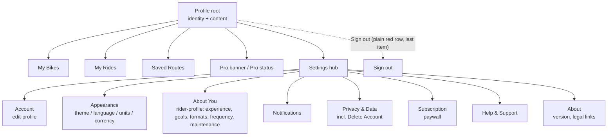
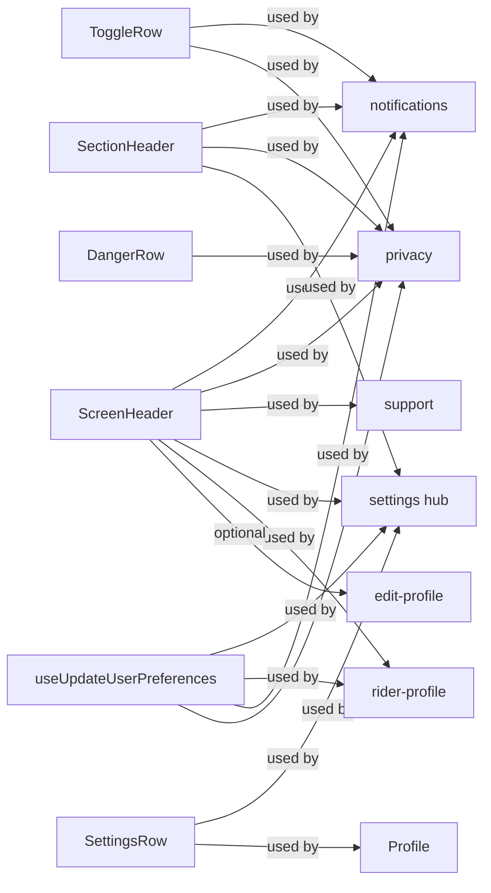

# Profile & Settings IA, de-duplication, and Impeccable polish

## Overview

The `(profile)` tab has grown into a pile of overlapping screens with duplicated logic, misaligned naming, and AI-generated-UI anti-patterns. We fix three things at once:

1. **Information architecture** — separate "who I am" (Profile) from "how the app works for me" (Settings hub) from "what kind of rider I am" (Rider Profile / persona). Today all three are mashed together in one 1397-line screen plus a sibling screen misleadingly called "settings".
2. **Code & UX duplication** — `Delete Account` exists in two places with identical 2-step alerts. `SectionHeader`, `SettingsRow`, `ToggleRow`, and the screen header (back button + title) are reimplemented inline in 4–6 files. Three different screens fire `UpdateUserDocument` with three different mutation shapes.
3. **Visual polish via the Impeccable lens** — apply the anti-AI-slop protocol: reduce card wrapping, strengthen type hierarchy, replace monotonous spacing + uppercase headers with whitespace-driven rhythm, surface current values on the settings hub (iOS-style), and fix copy that is either generic ("Ride history, stats & route maps"), wrong (FAQ claims the app only supports English/Spanish/German — it supports 13 locales), or misleading ("Profile Settings" for what is actually a riding-persona picker).

No new product features. Fewer lines of code, clearer flow, same data.

## Problem Frame

Today's structure:

```
(profile)/
  index.tsx             1397 lines — profile header + bikes + rides tile + saved tile + learn tile
                        + pro banner + settings links + theme + language + units + currency
                        + logout + delete account
  settings.tsx           821 lines — full name + experience level + riding goals
                        + learning formats + riding frequency + maintenance style
                        ("Profile Settings" header, but has nothing to do with app settings)
  edit-profile.tsx       368 lines — public username + display name + bio + city + isPublic
  privacy.tsx            538 lines — analytics toggle + crash reporting + export + delete account
  notifications.tsx      359 lines — 6 notification toggles in 3 groups
  support.tsx            333 lines — FAQ (5 items) + contact email + version
  upgrade.tsx            493 lines — paywall surface
  rides.tsx              551 lines — ride history + stats
  saved.tsx              388 lines — saved routes
```

Symptoms:

- User taps "Settings" on profile → lands on a persona picker that has *no* app settings. Theme/language/units/currency are on the previous screen, not here.
- "Delete Account" lives on `index.tsx` *and* `privacy.tsx` — same 2-step alert, copy-pasted.
- Every "row" is a pressable card with an icon tile on the left, title, optional subtitle, chevron. Six near-identical components implemented six times.
- "My Rides" / "Saved Routes" / "Learn" are three hero tiles in a vertical column with identical geometry (44×44 icon tile, 17px bold title, 13px grey subtitle, chevron). Textbook AI-slop repeating grid.
- Section headers — `SECTIONHEADER` uppercase 13px tracked — appear ~20 times on a single screen, flattening hierarchy.
- Generic boilerplate copy: "Routes you want to ride later", "Articles, quizzes & motorcycle knowledge", "All premium features unlocked".
- `support.tsx` FAQ item #4 hard-codes "English, Spanish, and German" — factually wrong; `SUPPORTED_LOCALES` has 13 entries.

## Requirements Trace

- R1. Profile root is about identity and personal content surfaces (bikes, rides, saved, stats). It is not where the user changes theme/language/units.
- R2. Settings hub exists as a real hub, grouped by category, with each row showing its current value inline (iOS pattern).
- R3. The existing `settings.tsx` is renamed to `rider-profile.tsx` ("About You") and moves under the Settings hub as one of its rows. It keeps its current content but stops pretending to be app settings.
- R4. Each user-mutating action has one canonical location (especially destructive ones). Delete Account only in Privacy.
- R5. Shared row, header, and toggle primitives are extracted into `components/profile/` and used by every screen in `(profile)/`.
- R6. All `UpdateUserDocument` call-sites go through a single `useUpdateUserPreferences` hook that merges prefs safely (no accidental sibling-overwrite of `preferences.notifications` when updating `preferences.privacy`, etc.).
- R7. The Impeccable anti-AI-slop protocol is applied: reduce cards, strengthen type scale, replace uniform gaps with a 4/8/16/32/64 rhythm, left-align body content, remove duplicated info.
- R8. Copy is rewritten: section labels in sentence case for secondary sections, FAQ updated, hub row subtitles show current values instead of feature descriptions.
- R9. No net loss of functionality. No breaking changes to i18n keys that ship translations today — add new keys, deprecate old ones with default values.
- R10. Profile root loses ~800 lines. Net repo change is negative.

## Scope Boundaries

**Non-goals:**
- No changes to `rides.tsx`, `saved.tsx`, `upgrade.tsx` content. Only their entry points from profile root and their shared header primitive.
- No changes to the public profile (`rider/`) sub-routes, `FollowButton`, `ProfileHeader`, `ProfileStats` components.
- No new features (no new preferences, no new settings categories beyond reorg).
- No changes to the i18n files themselves beyond adding keys with `defaultValue`. A follow-up translation pass can localize later.
- No changes to auth flow or RevenueCat integration shape.
- No changes to GraphQL schema. Only existing `UpdateUserDocument` is used.
- No redesign of `_layout.tsx` navigation stack beyond adding one new screen (`rider-profile`) and keeping the rest.

## Context & Research

### Relevant code and patterns

- `apps/mobile/src/app/(tabs)/(profile)/index.tsx` — the monolith to split
- `apps/mobile/src/app/(tabs)/(profile)/settings.tsx` — becomes `rider-profile.tsx` conceptually (content kept, name changed)
- `apps/mobile/src/app/(tabs)/(profile)/{notifications,privacy,support,edit-profile}.tsx` — each has its own inline `ScreenHeader` and `ToggleRow`; extract & share
- `apps/mobile/src/components/profile/` — currently `FollowButton.tsx`, `ProfileHeader.tsx`, `ProfileStats.tsx`. We add a `shared/` sub-folder here (see Implementation Units).
- `apps/mobile/src/stores/auth.store.ts` — holds `locale`, `colorScheme`, `measurementSystem`, `currency`. Keep; the settings hub reads/writes here plus mirrors to server via `UpdateUserDocument`.
- `packages/design-system/src/palette.ts` — all colors must come from here per CLAUDE.md.
- Project rule (from `apps/mobile/CLAUDE.md`): use `borderCurve: 'continuous'`, `presentation: 'formSheet'` for modals, kebab-case filenames, `process.env.EXPO_OS`.

### Institutional learnings

- `docs/brainstorms/2026-04-15-discovery-personality-brainstorm.md` (same author, same week) is the precedent: curation over completeness, editorial voice over data dump. We apply the same principle to Profile: stop listing every setting on the root, curate a small number of high-signal surfaces and push the rest into a well-named hub.
- `.claude/skills/design-loop/SKILL.md` — the anti-AI-slop protocol (17 named tells) is applied in Implementation Unit 8.

### External references

None needed. This is a pattern-and-copy refactor over well-understood Expo Router / TanStack Query code.

## Key Technical Decisions

- **IA split: Profile = identity + content, Settings = configuration.** Theme, language, units, currency move *out* of `profile/index.tsx` into `(profile)/settings.tsx` (the new hub). The current `settings.tsx` (rider persona) becomes `rider-profile.tsx` and is linked from the hub as "About You". Rationale: resolves the single largest point of confusion today — tapping "Settings" on profile does not take you to app settings.
- **Canonical Delete Account = Privacy only.** Rationale: destructive, irreversible, needs a deliberate path. Having it on root profile footer makes it too easy to mis-tap and also duplicates code.
- **Logout stays accessible from Profile root**, but in a quieter treatment (plain red text row, last item, no card wrapper). Rationale: frequent, reversible action.
- **Settings hub rows show current values inline.** Language row shows "English", Theme row shows "System", Units row shows "Metric (km, °C)", Currency row shows "USD $". Rationale: iOS convention, halves cognitive load vs. drilling in to check.
- **Shared primitives under `components/profile/shared/`.** Rationale: these are profile-scoped screen building blocks, not generic design-system primitives. Promoting to `@motovault/design-system` is out of scope.
- **One mutation hook: `useUpdateUserPreferences`.** Takes a patch, merges onto the existing `preferences` object (read from `MeDocument` cache), invalidates `queryKeys.user.me`. Rationale: fixes a real bug today where `notifications.tsx` writes `{ notifications }` as the whole preferences object — if the server replaces rather than merges, other prefs get wiped. Verify during implementation whether this is happening on the API side and whether merge belongs on the client or server (see Open Questions).
- **Card-vs-list treatment by content type:** identity + bikes + pro banner stay as cards (they're hero surfaces). Settings hub, Notifications, Privacy, Support switch to iOS-style grouped lists — one rounded container per section, rows inside are dividers only, no padding-card per row.
- **Typography scale:** introduce three sizes on settings screens — `22/700` (screen title), `16/500` (row label), `14/500` (row value). Retire the uppercase `13/600` tracked SECTIONHEADER on primary screens; keep it only for genuinely secondary groupings (≤2 per screen).

## Open Questions

### Resolved during planning

- **Should theme/language/units/currency stay on profile root as well as the hub?** Resolved: no. Having them in two places is why the screen is 1397 lines. One canonical home = settings hub.
- **Should Pro banner stay on profile root?** Resolved: yes. It's a revenue surface and identity-adjacent (pro status is part of who you are in the app).
- **Should the settings hub be a new screen or reuse `settings.tsx`?** Resolved: reuse the route `/(profile)/settings`. Rename the current file's content (persona) to a new route `/(profile)/rider-profile`. Users pressing "Settings" from profile root now land on a real settings hub.
- **What about the `upgrade.tsx` and `rides.tsx` / `saved.tsx` screens' own headers?** Resolved: migrate them to the shared `ScreenHeader` in a later unit; don't block the core IA work on it.

### Deferred to implementation

- **Does the server-side `UpdateUserDocument` resolver merge or replace `preferences`?** Needs verification in `apps/api/src` during Unit 6. If it replaces, the client-side merge hook is the fix. If it merges deeply, the hook is a defensive no-op and we stay consistent.
- **Exact i18n key names for new copy.** Keep the `profile.*` / `settings.*` / `privacy.*` prefixes. Propose names in PR review.
- **Whether to migrate the screen header of `rides.tsx`, `saved.tsx`, `upgrade.tsx`, `edit-profile.tsx` to the shared primitive in this PR or a follow-up.** Decide during Unit 2 based on diff size.

## High-Level Technical Design

Target IA after refactor:



Shared primitives hierarchy:



> *This illustrates the intended target shape and is directional guidance for review, not implementation specification. File paths in each Implementation Unit are the source of truth for what gets written.*

## Implementation Units

### - [ ] Unit 1: Extract shared `SectionHeader` and `ScreenHeader` primitives

**Goal:** Remove inline duplicates of the section label ("NOTIFICATIONS" / "PRIVACY" tracked uppercase) and the screen top bar (48px back button + centered title + bottom border) that exist in `notifications.tsx`, `privacy.tsx`, `support.tsx`, `settings.tsx`, and `edit-profile.tsx`.

**Requirements:** R5, R7

**Dependencies:** None

**Files:**
- Create: `apps/mobile/src/components/profile/shared/section-header.tsx`
- Create: `apps/mobile/src/components/profile/shared/screen-header.tsx`
- Create: `apps/mobile/src/components/profile/shared/index.ts` (barrel)
- Test: `apps/mobile/src/components/profile/shared/__tests__/screen-header.test.tsx`
- Test: `apps/mobile/src/components/profile/shared/__tests__/section-header.test.tsx`

**Approach:**
- `ScreenHeader` props: `title`, optional `onBack` (defaults to `router.back()`), optional `rightSlot`. Encapsulates safe-area top inset, haptic on back, dark-mode colors from `palette`.
- `SectionHeader` props: `label`, optional `tone: 'default' | 'danger'` (for the Privacy "Danger Zone" red label).
- Expose from `components/profile/shared/index.ts`.

**Patterns to follow:**
- Existing inline implementation in `apps/mobile/src/app/(tabs)/(profile)/notifications.tsx` lines 151–196 is the most complete reference; copy its visual treatment exactly first, then simplify.

**Test scenarios:**
- Happy path: `ScreenHeader` renders title, tapping back triggers provided `onBack` and `Haptics.impactAsync` (mock `expo-haptics`).
- Happy path: `ScreenHeader` with no `onBack` calls `router.back()` when tapped.
- Happy path: `SectionHeader` with `tone='danger'` renders with `palette.danger500` color.
- Edge case: `ScreenHeader` renders without `rightSlot` and centers title (no overlap with back button).
- Edge case: long title truncates with ellipsis, does not push back button off-screen.

**Verification:** Five screens (`notifications`, `privacy`, `support`, new `settings` hub, new `rider-profile`) all use `<ScreenHeader>` without any inline header code. Grep for the inline pattern returns zero hits.

---

### - [ ] Unit 2: Extract shared `SettingsRow`, `ToggleRow`, and `DangerRow`

**Goal:** One implementation of the "row inside a grouped list" for the entire profile surface. Supports variants: icon + label + optional subtitle + optional right value + chevron (the standard nav row), switch on the right (toggle row), destructive styling (danger row).

**Requirements:** R5, R7

**Dependencies:** None

**Files:**
- Create: `apps/mobile/src/components/profile/shared/settings-row.tsx`
- Create: `apps/mobile/src/components/profile/shared/toggle-row.tsx`
- Create: `apps/mobile/src/components/profile/shared/danger-row.tsx`
- Create: `apps/mobile/src/components/profile/shared/list-group.tsx` (the rounded container that hosts rows, handles `isFirst`/`isLast` implicitly via `React.Children.map` so screens stop passing `isLast` prop by hand)
- Modify: `apps/mobile/src/components/profile/shared/index.ts`
- Test: `apps/mobile/src/components/profile/shared/__tests__/settings-row.test.tsx`
- Test: `apps/mobile/src/components/profile/shared/__tests__/toggle-row.test.tsx`

**Approach:**
- `SettingsRow` props: `icon`, `label`, optional `value` (rendered small and muted on the right, before chevron — this is the iOS "current value hint" pattern), optional `onPress`, optional `tone`, optional `badge` (e.g., `"Pro"` for the subscription row).
- `ToggleRow` props: `icon`, `title`, `subtitle`, `value`, `onToggle`.
- `DangerRow` props: `icon`, `title`, `subtitle`, `onPress`, `isPending`.
- `ListGroup` renders a rounded-16 container with per-row `borderBottom` dividers auto-computed; children never need to know their position.
- All three components use the existing `borderCurve: 'continuous'`, `palette.neutral*`, and haptic pattern.

**Patterns to follow:**
- The current `SettingsRow` inside `apps/mobile/src/app/(tabs)/(profile)/index.tsx` lines 100–161 — same visual, gains `value` prop.
- The current `ToggleRow` inside `apps/mobile/src/app/(tabs)/(profile)/notifications.tsx` lines 39–106 — identical to the one in `privacy.tsx`; this refactor dedupes them.

**Test scenarios:**
- Happy path: `SettingsRow` renders label, optional `value` appears when provided.
- Happy path: `SettingsRow` triggers `onPress` and haptic on tap.
- Happy path: `ToggleRow` calls `onToggle(false)` when a `true`-valued switch is tapped.
- Happy path: `DangerRow` shows ActivityIndicator when `isPending`.
- Edge case: `ListGroup` with a single child has no dividers.
- Edge case: `ListGroup` with three children applies divider under rows 1 and 2 only.

**Verification:** `index.tsx`, new `settings.tsx`, `notifications.tsx`, `privacy.tsx` import from `components/profile/shared`. Grep for inline `ToggleRow` function defs returns zero.

---

### - [ ] Unit 3: Create `useUpdateUserPreferences` hook

**Goal:** Single source of truth for writing user preferences. Takes a partial patch, merges onto the current `me.preferences` from React Query cache, mutates via `UpdateUserDocument`, invalidates `queryKeys.user.me`, and fires success haptic.

**Requirements:** R6, R4

**Dependencies:** None

**Files:**
- Create: `apps/mobile/src/hooks/use-update-user-preferences.ts`
- Test: `apps/mobile/src/hooks/__tests__/use-update-user-preferences.test.ts`
- Modify (consumers, in later units): `profile/settings.tsx` (the new hub — uses it for theme/language/units/currency), `profile/rider-profile.tsx`, `profile/notifications.tsx`, `profile/privacy.tsx`.

**Approach:**
- Signature: `useUpdateUserPreferences(): { update: (patch: Partial<UserPreferences>) => void; isPending; isError }`.
- Reads existing `me.preferences` from `queryClient.getQueryData(queryKeys.user.me)`, deep-merges at one level (replace arrays, merge objects like `notifications`/`privacy`).
- Optimistic update: writes merged result to cache immediately, rolls back on error, re-fetches on success to reconcile.
- Accepts root-level user fields that happen to go through the same `UpdateUserDocument` (`fullName`, `measurementSystem`, `currency`) via a second arg or shape-discrimination — decide during implementation.

**Execution note:** Test-first. The merge semantics are exactly the behavior we need to guarantee — write the test, then the hook.

**Patterns to follow:**
- Existing `updatePreferenceMutation` in `apps/mobile/src/app/(tabs)/(profile)/index.tsx` lines 206–212 for the mutation shape.
- Existing `updateMutation` in `apps/mobile/src/app/(tabs)/(profile)/notifications.tsx` lines 133–137 for the failure case this refactor must avoid (overwrites sibling prefs).

**Test scenarios:**
- Happy path: calling `update({ notifications: { newArticles: false } })` when cache contains `{ privacy: { analyticsEnabled: true }, notifications: { newArticles: true, quizReminders: true } }` produces a merged payload preserving `privacy` and updating only `newArticles`.
- Happy path: calling `update({ measurementSystem: 'imperial' })` routes to the root-level input shape, not inside `preferences`.
- Edge case: cache miss (MeDocument not yet fetched) — hook defers and does not send `preferences: {}`.
- Error path: mutation rejects — optimistic cache entry rolls back and `isError` becomes true.
- Integration: two rapid calls (notifications then privacy) both persist; the second does not wipe the first.

**Verification:** The three bugs most likely to appear in the current code — (a) toggling a notification wipes a privacy pref, (b) changing currency also sends `preferences: undefined`, (c) rapid double-tap leaves cache inconsistent with server — are covered by the tests above and pass.

---

### - [ ] Unit 4: Rename `settings.tsx` content to `rider-profile.tsx` ("About You")

**Goal:** The existing `settings.tsx` (experience level, riding goals, learning formats, riding frequency, maintenance style) is conceptually a rider-persona picker, not app settings. Move it to `rider-profile.tsx` with the user-facing title "About You". Free up the `settings.tsx` route for the real settings hub (Unit 5).

**Requirements:** R3, R8

**Dependencies:** Units 1, 2, 3

**Files:**
- Create: `apps/mobile/src/app/(tabs)/(profile)/rider-profile.tsx`
- Delete: `apps/mobile/src/app/(tabs)/(profile)/settings.tsx` (content moves to new file; file will be recreated as hub in Unit 5)
- Modify: `apps/mobile/src/app/(tabs)/(profile)/_layout.tsx` — add `<Stack.Screen name="rider-profile" />`
- Test: `apps/mobile/src/app/(tabs)/(profile)/__tests__/rider-profile.test.tsx`

**Approach:**
- Content is a near copy of current `settings.tsx` with these changes:
  - `ScreenHeader` from Unit 1 replaces inline header; title `t('settings.aboutYouTitle', { defaultValue: 'About You' })`.
  - `useUpdateUserPreferences` from Unit 3 replaces the inline mutation and the `hasChanges`/`handleSave` dance. Rider persona still uses a "Save Changes" button (grouped commit) because the 5 fields are conceptually one thing; the hook's `update()` is called once on save.
  - Brief intro paragraph (one line, 14/500, muted) above the first section: "We use these answers to tailor articles, diagnostics, and reminders." Addresses "why are you asking me this?"
  - Uppercase section labels replaced with sentence-case headings.
- Full name is removed from this screen — it's an account field, not a persona field. It moves to `edit-profile.tsx` in Unit 10 (cleanup).

**Patterns to follow:**
- Current chip grid pattern (Riding Goals, Learning Formats) is kept — it's working well.

**Test scenarios:**
- Happy path: toggling a riding goal and pressing save fires `update({ preferences: { ridingGoals: [...] } })` exactly once.
- Happy path: screen shows current values from `MeDocument` (experience level selected, goals highlighted).
- Edge case: user with no preferences (fresh account) shows sensible defaults, no empty-state bug.
- Integration: after save, navigating back and returning shows persisted state from cache — no refetch flicker.

**Verification:** `(profile)/settings` route no longer contains rider persona fields. `(profile)/rider-profile` is reachable from the Settings hub (Unit 5) and renders correctly.

---

### - [ ] Unit 5: Build the Settings hub at `settings.tsx`

**Goal:** Replace `settings.tsx` with a true settings hub: one screen with ~8 grouped rows that each show their current value and route deeper. This is where theme, language, units, and currency move to (out of `profile/index.tsx`).

**Requirements:** R1, R2, R5, R8

**Dependencies:** Units 1, 2, 3, 4

**Files:**
- Create: `apps/mobile/src/app/(tabs)/(profile)/settings.tsx` (new hub, same route)
- Modify: `apps/mobile/src/app/(tabs)/(profile)/_layout.tsx` — no change required if route name stays the same; confirm.
- Test: `apps/mobile/src/app/(tabs)/(profile)/__tests__/settings-hub.test.tsx`

**Approach:**
- Groups:
  1. **Account** — one row: "Public profile" → `/(profile)/edit-profile`, value = `@username` or "Off".
  2. **Appearance** — Theme (segmented control inline), Language (row → modal), Units (segmented inline), Currency (row → modal). Theme/units stay as inline segmented controls (cheap, no drill). Language/currency drill because 13 and ~10 options respectively.
  3. **About You** (Rider profile) — one row → `/(profile)/rider-profile`, value summarizes current state: "Intermediate · 3 goals" or "Not set".
  4. **Notifications** — one row → `/(profile)/notifications`, value: "4 of 6 on".
  5. **Privacy & Data** — one row → `/(profile)/privacy`, value: "Analytics on" or "Analytics off".
  6. **Subscription** — one row → `presentPaywall()`, value: "Pro" badge or "Free".
  7. **Help & Support** — one row → `/(profile)/support`, no value.
  8. **About** — rows: Version (value), Terms (external link), Privacy Policy (external link).
- All rows use `SettingsRow` with the `value` prop.
- All writes from this screen (theme/units change) go through `useUpdateUserPreferences` for the server mirror; local state is still held in `auth.store.ts` for zero-latency UI.
- Language/currency modals stay in this file for now (they are already well-implemented in current `index.tsx`; just moved).

**Technical design:** *(directional)*

```
<ScreenHeader title="Settings" />
<ScrollView>
  <Intro copy optional — or omit entirely to keep it light>

  <SectionHeader label="Account" />
  <ListGroup>
    <SettingsRow icon={User} label="Public profile" value={@username|Off} onPress={...} />
  </ListGroup>

  <SectionHeader label="Appearance" />
  <ListGroup>
    <SegmentedRow icon={Palette} label="Theme" options={['System','Light','Dark']} />
    <SettingsRow   icon={Globe}   label="Language" value={'English'} onPress={openLangModal} />
    <SegmentedRow icon={Ruler}   label="Units" options={['Metric','Imperial']} />
    <SettingsRow   icon={DollarSign} label="Currency" value={'USD $'} onPress={openCurrencyModal} />
  </ListGroup>

  ...rest of groups...
</ScrollView>
```

> *Above is directional. `SegmentedRow` is a minor internal variant of `SettingsRow` that renders a segmented control in the value slot; decide in implementation whether it's worth being a new component or a prop.*

**Patterns to follow:**
- The theme segmented control + language modal + currency modal code already in `profile/index.tsx` lines 1095–1348 — copy into this file, don't rewrite.

**Test scenarios:**
- Happy path: tapping "Language" opens the modal, selecting a locale updates the row's value and closes the modal.
- Happy path: "About You" row displays "Intermediate · 3 goals" when user has experience level + 3 goals set.
- Happy path: "Notifications" row shows "4 of 6 on" when 4 toggles are enabled.
- Edge case: user with no preferences: "About You" shows "Not set", Notifications shows "All on" (defaults).
- Integration: changing theme via segmented control updates both `auth.store.colorScheme` and fires `useUpdateUserPreferences` once; verified via mock.

**Verification:** `profile/index.tsx` no longer contains Theme/Language/Units/Currency UI. Settings hub renders them all, each with current value inline, each persisted correctly.

---

### - [ ] Unit 6: Slim down `profile/index.tsx` to identity + content

**Goal:** Reduce the profile root to: user card, follower stats (if public), My Bikes, My Rides tile, Saved Routes tile, Learn tile, Pro banner, Sign out row. Remove Theme, Language, Units, Currency, Delete Account. The "Settings" entry becomes a prominent link (or moves into the user card as an action button, which already exists and stays).

**Requirements:** R1, R4, R7, R10

**Dependencies:** Units 1, 2, 3, 5

**Files:**
- Modify: `apps/mobile/src/app/(tabs)/(profile)/index.tsx`
- Test: `apps/mobile/src/app/(tabs)/(profile)/__tests__/profile-index.test.tsx`

**Approach:**
- Delete the entire Theme, Language, Units, Currency, Delete Account sections (roughly lines 1094–1392 of the current file). The functionality lives in the Settings hub and Privacy now.
- Keep: user card (lines 286–421), follower stats (423–496), My Bikes (498–659), My Rides tile (661–711), Saved Routes tile (713–761), Learn tile (763–812), Pro banner (814–908), Sign out.
- Consider collapsing My Rides / Saved Routes / Learn — three identical-geometry tiles in a row — per Impeccable rule #2 (no identical repeating grid). Options evaluated in Unit 8; for this unit, keep them but let Unit 8 decide final treatment.
- The `Settings` / `Notifications` / `Privacy` / `Subscriptions` / `Support` list (lines 910–954) is removed — those live in the hub now. The user card's "Settings" button remains as the entry point.
- Sign out uses `DangerRow` but with `tone='quiet'` (plain red text, no card) — still visible, less shouty.
- Replace inline `SectionHeader` with the shared component.

**Patterns to follow:**
- Preserve the existing `ProBadge`, `ProGateModal`, `useProGate` integration exactly.

**Test scenarios:**
- Happy path: screen renders without Theme/Language/Units/Currency/Delete Account — integration test asserts `queryByText(/Theme/i)` returns null.
- Happy path: Sign out triggers `supabase.auth.signOut`.
- Edge case: user with zero bikes shows the "Add Your First Bike" CTA unchanged.
- Edge case: Pro user sees "Pro Active" banner, non-Pro sees upgrade CTA — existing behavior preserved.

**Verification:** `profile/index.tsx` line count drops from 1397 to ~600. Grep for `Delete Account` inside `(profile)/index.tsx` returns zero.

---

### - [ ] Unit 7: Migrate `notifications.tsx`, `privacy.tsx`, `support.tsx`, `edit-profile.tsx` to shared primitives

**Goal:** Replace inline headers, section labels, toggle rows, and mutation logic in the four remaining profile sub-screens with the primitives from Units 1, 2, 3.

**Requirements:** R5, R6

**Dependencies:** Units 1, 2, 3

**Files:**
- Modify: `apps/mobile/src/app/(tabs)/(profile)/notifications.tsx`
- Modify: `apps/mobile/src/app/(tabs)/(profile)/privacy.tsx`
- Modify: `apps/mobile/src/app/(tabs)/(profile)/support.tsx`
- Modify: `apps/mobile/src/app/(tabs)/(profile)/edit-profile.tsx`

**Approach:**
- Replace inline `ScreenHeader` implementations with the shared one.
- Replace inline `SectionHeader`s with the shared one.
- Replace inline `ToggleRow` in `notifications.tsx` and `privacy.tsx` with the shared one.
- In `privacy.tsx`: delete code keeps its 2-step alert (this is the canonical location per Unit 9). Replace row shells with `DangerRow`.
- In `notifications.tsx` and `privacy.tsx`: replace inline mutation with `useUpdateUserPreferences` to fix the sibling-overwrite bug.
- `support.tsx`: update FAQ item #4 copy from "English, Spanish, and German" to a dynamic list of supported locales, or a generic phrasing. Add two FAQ items for the new IA: "Where is theme / language?" ("Settings → Appearance") and "How do I change my riding preferences?" ("Settings → About You").

**Patterns to follow:**
- Existing screens work correctly; the refactor is mechanical. Do not alter behavior beyond what Unit 3's merge fix implies.

**Test scenarios:**
- Happy path: each migrated screen renders with the shared header and rows; back button works.
- Happy path: toggling a notification then toggling a privacy analytics setting — both persist without overwriting each other (integration test covers Unit 3's fix at the screen level).
- Edge case: `support.tsx` FAQ #4 no longer mentions the old 3-language list.

**Verification:** Grep in `(profile)/` for `paddingTop: insets.top` + `ArrowLeft` (inline header pattern) returns zero matches outside of `components/profile/shared/`.

---

### - [ ] Unit 8: Impeccable polish pass — kill AI-slop tells across profile & settings screens

**Goal:** Apply the anti-AI-slop protocol from `.claude/skills/design-loop/SKILL.md` to the refactored screens. Concrete visual changes, not theoretical.

**Requirements:** R7, R8

**Dependencies:** Units 5, 6, 7 (all screens in shape)

**Files:**
- Modify: `apps/mobile/src/app/(tabs)/(profile)/index.tsx`
- Modify: `apps/mobile/src/app/(tabs)/(profile)/settings.tsx`
- Modify: `apps/mobile/src/app/(tabs)/(profile)/rider-profile.tsx`
- Modify: `apps/mobile/src/app/(tabs)/(profile)/notifications.tsx`
- Modify: `apps/mobile/src/app/(tabs)/(profile)/privacy.tsx`
- Modify: `apps/mobile/src/app/(tabs)/(profile)/support.tsx`
- Modify: `apps/mobile/src/components/profile/shared/*.tsx` (token adjustments only)

**Approach:** Targeted fixes tied to the specific anti-patterns:

1. **Card Wrapping Everything (tell #1):** On identity surfaces (user card, Pro banner) cards stay. On list surfaces (settings hub, notifications, privacy, support FAQ, rider-profile chips) — one `ListGroup` card per section, rows inside are dividers only. Removes ~8 redundant card wrappers from `profile/index.tsx` alone.
2. **Identical Repeating Grids (tell #2):** My Rides / Saved Routes / Learn are three identical tiles today. Collapse into a single `ListGroup` with three rows showing value hints ("12 rides this month" / "7 routes saved" / "New article: ..."). Halves vertical height, kills the AI grid look, adds signal.
3. **Flat Type Hierarchy (tell #4):** Introduce three-step scale on settings screens — screen title `22/700`, row label `16/500`, row value `14/400 muted`. Replace the 20+ uppercase `SECTIONHEADER` occurrences on primary screens with sentence-case `17/600` headings; reserve uppercase tracked labels for at most 2 groups per screen (the "Danger Zone" pattern is the canonical keeper).
4. **Icon Tile Above Heading (tell #5):** The 44×44 icon tiles on My Rides / Saved Routes / Learn are reduced to inline 20×20 icons in row labels once those tiles become list rows (Item 2 above).
5. **Neon Accents on Dark (tell #9):** Audit all accent-color usage on `profile/index.tsx` — today the Pro banner (amber Crown on primary700 background), Saved Routes icon (signature500 purple tint at 25%), My Rides icon (accent500 green tint at 25%) all fire at once. Pick ONE accent per viewport. Proposal: signature (purple) = pro only; keep others neutral. Verify during implementation.
6. **Monotonous Spacing (tell #16):** Replace `gap: 24` between all major sections with a rhythm: `gap: 32` between sections, `gap: 16` between related sub-groups, `gap: 8` within row clusters.
7. **Borders Instead of Space (tell #17):** Settings screens have `borderBottomWidth: 0.5` between every row *and* between every section. Replace inter-section borders with 32px whitespace. Intra-row dividers stay (they're inside a list group).
8. **Duplicate Information Across Sections (tell #12):** Pro status appears today as the user card's `ProBadge`, the Pro banner, *and* the Subscription settings row. Keep `ProBadge` + Subscription row (value = "Pro" or "Free"). Remove the full-width Pro banner for Pro users (it says "All premium features unlocked" with zero signal). Non-Pro users keep the upgrade banner.
9. **Text Colors Too White (tell #11):** Audit dark-mode text colors. `palette.neutral50` is used for primary text today. Confirm against palette definition — if it's pure white, switch to `neutral100` for primary text in dark mode. Verify during implementation.

**Patterns to follow:**
- The design system palette in `packages/design-system/src/palette.ts` is the source of all color values. No raw hex/rgba except for pressed-state alpha overlays (allowed per current code convention).

**Test scenarios:**
- Test expectation: visual regression via snapshot tests of each screen (Jest + react-test-renderer) — `apps/mobile/src/app/(tabs)/(profile)/__tests__/polish-snapshot.test.tsx` — ensuring render output is stable after the change.
- Manual verification: screenshot pass on iOS simulator (iPhone 15 Pro, light + dark) + Android (Pixel 7).

**Verification:** Grep audit passes:
- No more than 2 uppercase section headers per screen.
- No duplicated Pro status UI for Pro users.
- `gap: 24` count reduced by ≥60% across `(profile)/` files.

---

### - [ ] Unit 9: Delete-Account canonicalization + i18n copy pass

**Goal:** Delete Account lives only in `privacy.tsx`. Rewrite the shared alert copy into i18n keys used by one location. Update FAQ and hub-row copy across screens to be specific and correct.

**Requirements:** R4, R8, R9

**Dependencies:** Unit 6 (delete removed from `index.tsx`)

**Files:**
- Modify: `apps/mobile/src/app/(tabs)/(profile)/privacy.tsx` — keep the delete flow, tighten copy.
- Modify: `apps/mobile/src/app/(tabs)/(profile)/support.tsx` — FAQ rewrite (items #4, #6 new, maybe remove a weak one).
- Modify: `apps/mobile/src/app/(tabs)/(profile)/index.tsx` — final copy on the three content tiles (if they remain per Unit 8 decision).
- Modify: i18n default strings as needed (add keys via `defaultValue`; no JSON locale file changes required for this refactor).

**Approach:**
- Copy rewrites to propose (final wording reviewed in PR):
  - Hub row subtitles show current value (Unit 5 already); remove duplicate descriptive subtitles like "Articles, quizzes & motorcycle knowledge".
  - FAQ #4 replaces hard-coded languages with: "MotoVault is translated into 13 languages. Change it in Settings → Appearance → Language."
  - Add FAQ: "How do I change my theme or units?" → "Settings → Appearance."
  - Add FAQ: "Why does the app ask about my riding experience?" → "Settings → About You tells us how to tailor diagnostics, articles, and reminders. You can change it anytime."
  - Remove FAQ #3 ("Can I have multiple motorcycles? Yes!") — this is obvious now that the bikes UI is healthy; replace with something actually useful (e.g., "How do I export my data?" → Privacy → Export).

**Test scenarios:**
- Happy path: deleting account from Privacy → two confirms → `DeleteAccountDocument` → sign-out → redirect to `/(auth)/login`.
- Happy path: Profile root has no Delete Account entry point.
- Edge case: `support.tsx` FAQ no longer references "English, Spanish, and German".

**Verification:** Grep `DeleteAccountDocument` across `apps/mobile/src/app/(tabs)/(profile)/` returns exactly one file: `privacy.tsx`.

---

### - [ ] Unit 10: Route & back-navigation connection audit

**Goal:** Ensure every screen in `(profile)/` has a working back button that lands on the correct parent, deep links resolve, and the header title matches what the user tapped to get there.

**Requirements:** R9

**Dependencies:** Units 1, 4, 5, 6, 7

**Files:**
- Modify: `apps/mobile/src/app/(tabs)/(profile)/_layout.tsx` — add `rider-profile` screen.
- Verify: all other files already touched.

**Approach:**
- Each sub-screen uses `ScreenHeader` with `onBack={() => router.back()}`. From the hub (`settings.tsx`), back → profile root. From `rider-profile.tsx`, back → hub. From `notifications/privacy/support/edit-profile`, back → hub.
- Deep link `/(tabs)/(profile)/rider-profile` resolves to the new screen even if opened cold (routing layout validated).
- Profile root → Settings button → hub → any sub-screen → back → hub → back → profile root. Tested manually + snapshot on router state.

**Test scenarios:**
- Integration: simulate navigation stack push from root to `rider-profile`, press back twice, expect profile root.
- Edge case: cold-open `/settings/notifications` (if deep-linking is exercised) renders with a back button that routes to the hub, not to a crash.

**Verification:** Manual walkthrough iOS + Android. No orphaned screens, no crashes on back.

---

## System-Wide Impact

- **Interaction graph:** `(profile)/*` screens. No impact on `(home)`, `(discover)`, `(garage)`, `(diagnose)`, `(learn)` tabs. Small ripple in `upgrade.tsx` (only if we choose to migrate its header in Unit 1; otherwise zero).
- **Error propagation:** Mutations fail via `useUpdateUserPreferences` hook — single surface for toast / haptic-failure treatment. Delete account error stays handled in `privacy.tsx` with its existing Alert.
- **State lifecycle risks:** The merge bug in `useUpdateUserPreferences` is the main risk. Mitigation: test-first (Unit 3 `Execution note`) and verify server merge behavior in Unit 6 deferred question.
- **API surface parity:** None — same `UpdateUserDocument` mutation everywhere. Same `DeleteAccountDocument`. Same `RequestDataExportDocument`. No server changes.
- **Integration coverage:** Unit 3's rapid-fire integration test (notifications → privacy writes in sequence) covers the single cross-screen behavior change.
- **Unchanged invariants:** Public profile URL structure, follow/follower logic, ride/saved content screens (only their headers may change). Auth redirect on missing session unchanged.

## Risks & Dependencies

| Risk | Mitigation |
|------|------------|
| i18n keys rename and break translations in non-default locales | Add new keys via `defaultValue`; do not rename existing keys used by already-translated JSON. Deprecate in a follow-up. |
| Merge semantics of `UpdateUserDocument` on server side do a full replace, wiping sibling prefs | Unit 3 `useUpdateUserPreferences` always reads current `me.preferences` and sends the merged blob. Client-side merge is defensive regardless of server behavior. Also audit `apps/api/src/users/users.resolver.ts` (or equivalent) during Unit 6 to confirm. |
| Visual regression from polish pass (Unit 8) breaks App Store screenshots | Snapshot tests + manual screenshot pass on both platforms before tagging for release. |
| Users with the old IA in-flight (already on `/settings` when update ships) land on a hub instead of persona picker | Expo Router uses the new file at the same route — no deep-link rename. Hub includes an "About You" row so user is one tap from the content they expected. Acceptable. |
| Removing Delete Account from profile root is a discoverability regression for users who had it memorized there | Very small cohort. Privacy is the correct location per every major iOS/Android app. Add a one-time "Delete Account is now in Privacy" hint in the next app-update note (`whats-new.tsx`) — out of scope for this refactor but noted. |

## Documentation / Operational Notes

- No migration. Purely client-side refactor.
- After merge, update `whats-new.tsx` (out of scope for this plan) with a line about the new Settings hub.
- No analytics event renames; existing `trackScreen('Privacy')` and others keep firing with the same names.

## Sources & References

- Plan directly grounded in code read during planning:
  - `apps/mobile/src/app/(tabs)/(profile)/index.tsx`
  - `apps/mobile/src/app/(tabs)/(profile)/settings.tsx`
  - `apps/mobile/src/app/(tabs)/(profile)/notifications.tsx`
  - `apps/mobile/src/app/(tabs)/(profile)/privacy.tsx`
  - `apps/mobile/src/app/(tabs)/(profile)/support.tsx`
  - `apps/mobile/src/app/(tabs)/(profile)/edit-profile.tsx`
  - `apps/mobile/src/app/(tabs)/(profile)/_layout.tsx`
- Anti-AI-slop checklist: `.claude/skills/design-loop/SKILL.md`
- IA precedent: `docs/brainstorms/2026-04-15-discovery-personality-brainstorm.md`
- Project rules: `CLAUDE.md` (root), `apps/mobile/CLAUDE.md`
