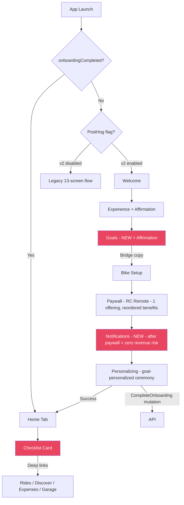

# Onboarding Redesign v2

## Overview

Redesign the mobile onboarding from 13 screens to 7, aligned with MotoVault's pivot from AI diagnostics to ride tracking, expense management, and route discovery. The current flow has a 59.5% drop-off rate with the largest cliff (44%) at the Experience step. This plan applies 9 research-backed patterns to target 70%+ completion, 15%+ D1 retention, and maintained 25% paywall conversion.

(see brainstorm: `docs/brainstorms/2026-05-11-onboarding-redesign-brainstorm.md`)

### Expert Panel Review (2026-05-12)

A 6-agent expert panel reviewed this plan across onboarding UX, monetization, UI design, engineering, product strategy, and behavioral psychology. Average score: **7.3/10** — "Ship it, but with critical changes." All changes below are incorporated into this revision. Key amendments:

1. **Notifications moved after Paywall** — placing it before the paywall interrupted momentum at the highest-stakes screen. Now sits between Paywall and Personalizing (zero revenue risk).
2. **Single offering with dynamic benefit reordering** — at 28 paywall views/month, splitting into multiple offerings produces statistically meaningless data. One offering reorders benefits based on goals instead.
3. **Auto-advance slowed to 700ms** — 300ms was too fast; users couldn't register their selection. Added visible confirmation state before transition.
4. **Affirmation copy added** — missing "peak moment" in the flow. Goals and Experience screens now provide positive feedback after user actions.
5. **Store v3→v4 migration hardened** — explicit reset with version + missing-field check, not just field-append.
6. **PostHog feature flag** replaces env-var flag for real server-side rollback.
7. **Goals accent colors limited to 3** — 5 hues on one screen fractured the warm editorial identity.
8. **Experience drop-off target adjusted** — 15% was unrealistic given install-and-bounce is uncontrollable. New target: <25%.

## Problem Statement

142 installs in 30 days but only 32 complete onboarding (40.5%). The flow was designed for the original AI diagnostics product — it collects bike model, type, photo, riding frequency, maintenance style, learning formats, and annual repair spend before showing any value. Real user data (Slovakia-filtered) shows Rides & Tracking (28.7 events/user) and Expenses (9.1 events/user) are the actual product-market-fit signals, not diagnostics or trip planning.

## Proposed Solution

### New Flow (7 Screens)

```
1. Welcome        — Animated value prop. Single CTA: "Let's get started"
2. Experience      — "How long have you been riding?" 3 conversational options + affirmation
3. Goals (NEW)     — "What do you want from MotoVault?" Multi-select (min 1) + affirmation
4. Bike Setup      — Year + Make + Model on one scrollable screen. Skippable. Bridge copy from goals.
5. Paywall         — RevenueCat remote paywall. Single offering, benefits reordered by goal.
6. Notifications   — Pre-permission primer + native OS dialog. AFTER paywall = zero revenue risk.
7. Personalizing   — CompleteOnboarding mutation + 2.5s animation → Home
```

> **Why Notifications after Paywall:** Every intervening screen between the user's last engagement and the paywall reduces conversion. Moving Notifications after the purchase decision eliminates revenue risk entirely. The user has already committed (or not) — asking for notification permission here is a trust exchange, not an interruption. This is the Strava pattern.

### What's Removed

| Screen | Reason |
|---|---|
| Bike Type | Deferred to Garage — zero dependencies found |
| Bike Photo | Deferred to post-onboarding checklist |
| Smart Maintenance | Value prop merged into paywall benefits (configured in RC dashboard) |
| Insights | Value prop merged into paywall benefits |
| Currency | Auto-detected from device locale via `expo-localization` |

### What's New

| Feature | Description |
|---|---|
| Goals screen | Multi-select: track_rides, manage_expenses, discover_routes, maintain_bike, just_exploring |
| Auto-detection | Currency from `getLocales()[0]?.currencyCode`, units from `measurementSystem` |
| Notification permission | Pre-permission primer screen AFTER paywall + native OS dialog (expo-notifications) |
| Personalized paywall | Single RC offering with benefits dynamically reordered based on primary goal |
| Home checklist | Persistent card ordered by goals, deep-links to features |
| Affirmation copy | Positive feedback after Experience and Goals selections (peak-end rule) |
| Bridge copy | Goals → Bike Setup transition explains WHY bike data matters for their goal |

---

## Technical Approach

### Architecture



### Critical Blockers from SpecFlow Analysis

Before implementation, these must be resolved:

**1. RidingGoal enum mismatch (CRITICAL)**

Current enum in `packages/types/src/constants/enums.ts`:
```
learn_maintenance, improve_riding, track_maintenance, save_money,
find_community, safety, save_on_maintenance, track_bike_health
```

New goals needed:
```
track_rides, manage_expenses, discover_routes, maintain_bike, just_exploring
```

**Resolution:** Add new values to the `RIDING_GOALS` const. Keep old values for backward compatibility (existing users have them stored). Update Zod schema to accept both old and new values. The `CompleteOnboarding` mutation accepts `string[]` on the NestJS side so no API change needed — just the types package.

**2. Locale detection method**

Use `expo-localization`'s `getLocales()` (already proven in codebase), NOT `Intl.NumberFormat` (Hermes compatibility concerns documented in `docs/solutions/architecture/currency-preference-full-stack-implementation.md`).

```typescript
import { getLocales } from 'expo-localization';
const locale = getLocales()[0];
const currency = locale?.currencyCode ?? 'USD';
const isImperial = ['US', 'GB', 'LR', 'MM'].includes(locale?.regionCode ?? '');
```

**3. presentPaywall API contract — single offering, dynamic benefits**

Per expert panel: at 28 paywall views/month, multiple offerings produce statistically meaningless data. Ship with **one offering** (`motovault_pro_default`) that shows ALL features. Personalization happens in the RC dashboard by reordering benefits based on the `placement` string we pass.

```typescript
// Determine placement string from primary goal — RC dashboard
// uses placement to select which benefit ordering template to show
const goalToPlacement: Record<string, string> = {
  track_rides: 'onboarding_rides',
  manage_expenses: 'onboarding_rides',     // interim: rides is closest
  discover_routes: 'onboarding_routes',
  maintain_bike: 'onboarding_rides',       // interim: rides is closest
  just_exploring: 'onboarding_default',
} as const;

presentPaywall({
  placement: goalToPlacement[primaryGoal] ?? 'onboarding_default',
  source: 'onboarding',
  ...
});
```

> **Why not `offeringIdentifier`:** Multiple offerings split an already tiny sample. A single offering with placement-based benefit reordering gives the same personalization effect without fragmenting conversion data. Expand to separate offerings when paywall views exceed 200/month.

**4. Checklist persistence — client-side only (MMKV)**

SpecFlow flagged that server-side persistence needs new GraphQL operations. **Simplify: store checklist state in MMKV locally.** At <200 MAU, server-side sync is premature. The checklist is a UX helper, not critical data.

```typescript
// stores/checklist.store.ts — Zustand + MMKV
interface ChecklistState {
  items: ChecklistItem[];
  dismissed: boolean;
  completedItems: string[];
}
```

**5. Store migration strategy (HARDENED per engineering review)**

Bump onboarding store to version 4. The current migration function (lines 121–138) never actually calls `reset()` — it only appends missing fields. This means old v3 data with incomplete onboarding won't be cleared properly.

**Explicit reset logic required:**
```typescript
// v3 → v4 migration
migrate: (persistedState, version) => {
  const state = persistedState as OnboardingState;
  if (version < 4) {
    // If onboarding was completed, leave everything alone
    if (state.onboardingCompleted) return state;
    // If incomplete AND missing new required fields, full reset
    // This catches users mid-v1-onboarding who would have broken state
    if (!state.ridingGoals?.length || version < 3) {
      return { ...initialState }; // Hard reset to clean v2 flow
    }
    // Otherwise, append missing v4 fields
    return { ...state, lastCompletedScreen: null };
  }
  return state;
},
```

Key: check `version` AND `onboardingCompleted` AND `ridingGoals` presence — not just one condition.

**6. i18n: use `t()` keys for all new copy**

Even though we're only writing English copy initially, use `t()` keys to preserve the 13-locale architecture. Add keys to `en.json` only.

---

## Implementation Plan (Single Phase)

> Per expert panel product review: ship as one cohesive release, not phased. The changes are interdependent — Goals feeds the paywall, the paywall position affects Notifications placement, the checklist depends on Goals. Splitting creates integration risk without learning benefit at this volume. Budget **6-8 weeks** total.

### Step 1: Foundation (Types, Store, Config, Auto-Detection)

**Files to modify:**

`packages/types/src/constants/enums.ts`
- Add new riding goal values: `track_rides`, `manage_expenses`, `discover_routes`, `maintain_bike`, `just_exploring`
- Keep old values for backward compatibility

`packages/types/src/validators/onboarding-input.ts`
- Update Zod schema to accept both old and new riding goal values

`apps/mobile/src/config/onboarding.ts`
- Replace 13-screen config with 7-screen config (Notifications AFTER Paywall):
```typescript
export const ONBOARDING_SCREENS = [
  { route: 'index', key: 'welcome', section: 'A', canSkip: false },
  { route: 'experience', key: 'experience', section: 'A', canSkip: false },
  { route: 'goals', key: 'goals', section: 'B', canSkip: false },
  { route: 'bike-setup', key: 'bikeSetup', section: 'B', canSkip: true },
  { route: 'paywall', key: 'paywall', section: 'C', canSkip: false },
  { route: 'notifications', key: 'notifications', section: 'C', canSkip: false },
  { route: 'personalizing', key: 'personalizing', section: 'C', canSkip: false },
] as const;
```

`apps/mobile/src/stores/onboarding.store.ts`
- Bump to version 4
- Add `goals: RidingGoal[]` field (reuse existing `ridingGoals`)
- Add `lastCompletedScreen: OnboardingRoute | null` for resume-after-kill
- Add migration: v3 → v4 resets store if `onboardingCompleted` is false
- Remove dead fields from interface (keep in store for migration compat but don't expose new setters)

`apps/mobile/src/lib/locale-detection.ts` (NEW)
- Auto-detect currency from `getLocales()[0]?.currencyCode` with USD fallback
- Auto-detect measurement system from `getLocales()[0]?.measurementSystem` with fallback to regionCode check
- Export `detectCurrency()` and `detectMeasurementSystem()` functions
- Called once during onboarding init, results written to onboarding store

`apps/mobile/src/stores/checklist.store.ts` (NEW)
- Zustand + MMKV persistence
- Shape: `{ items: ChecklistItem[], completedItems: string[], dismissed: boolean }`
- Items generated from goals on onboarding completion
- `completeItem(id)`, `dismiss()`, `reset()` actions

`apps/mobile/src/i18n/locales/en.json`
- Add new translation keys for Goals screen, Bike Setup, checklist items, conversational copy

**Run `pnpm generate` after types changes.**

---

### Step 2: Screen Implementation

#### Screen 1: Welcome (modify `apps/mobile/src/app/(onboarding)/index.tsx`)

Keep existing structure (hero image, gradient, Instrument Serif). Changes:
- Update subtitle copy to reflect current product focus (rides, expenses, routes)
- Ensure single CTA ("Let's get started")
- Fire `onboarding_step_viewed` event on mount (new)
- Keep existing animations (FadeIn, FadeInUp stagger)

**Claude Design Agent Prompt — Welcome Screen:**
```
Design a mobile app welcome screen for "MotoVault", a motorcycle companion app.

DESIGN TOKEN REFERENCE:
- bg: #1a1510 (with hero image), surface: #1a1812, border: #2a2520
- accent: #D4884A, text-primary: #FFFFFF, text-secondary: rgba(255,255,255,0.7)
- headline: Instrument Serif 32px, body: Geist 16px, button: Geist 16px semibold
- spacing: 8/12/16/20/24px scale, border-radius: 16px continuous
- min touch target: 44pt height
- safe-area: respect Dynamic Island on iPhone 14 Pro+ devices

CONTEXT:
- Dark editorial theme (background: #1a1510 with motorcycle hero image at 65% opacity)
- Warm brown accent color (#D4884A)
- Typography: Instrument Serif for headlines, Geist for body
- This is the FIRST screen after signup — user needs to feel excited in 3 seconds

REQUIREMENTS:
- Full-bleed motorcycle hero image with dark gradient overlay (bottom-heavy)
- App logo/wordmark "MotoVault" at top (subtle, not dominant)
- Headline: "Your rides. Your bike. Your journey." (Instrument Serif, 32px, white)
- Subtitle: "Track rides, manage expenses, discover routes — all in one place" (Geist, 16px, rgba(255,255,255,0.7))
- Single CTA button at bottom: "Let's get started" (warm brown bg, dark text, full-width, 16px rounded)
- NO secondary actions, NO skip, NO login — just one clear path forward

ANIMATIONS:
- Hero image: subtle slow zoom (scale 1.0 → 1.05 over 8s, looping)
- Logo: FadeIn with 200ms delay
- Headline: FadeInUp from 20px below, 300ms delay, 400ms duration
- Subtitle: FadeInUp from 20px below, 500ms delay, 400ms duration  
- CTA button: FadeInUp from 30px below, 700ms delay, 400ms duration
- Button press: scale 0.98 + opacity 0.9 + haptic feedback (iOS)

FEEL: Premium, calm confidence. Not flashy or startup-y. Think Porsche app meets Strava.
Aspect ratio: iPhone 15 Pro (393x852 safe area).
```

#### Screen 2: Experience (modify `apps/mobile/src/app/(onboarding)/experience.tsx`)

Major copy + UX changes, keep OnboardingCard pattern:
- Change title from "What kind of rider are you?" to "How long have you been riding?"
- Change options to conversational labels:
  - "Just starting out" (Bike icon, success green)
  - "A few years in the saddle" (Gauge icon, warm accent)
  - "Seasoned rider" (Flame icon, error red)
- **Affirmation response after selection** (psychology review — peak-end rule):
  - "Just starting out" → "Welcome to the ride"
  - "A few years in the saddle" → "Nice — you know the road"
  - "Seasoned rider" → "Respect — let's get you set up fast"
  - Shows as a brief text flash (FadeIn 200ms) below the selected card before transition
  > **Note:** Original affirmation for seasoned riders was "we'll skip the basics" — but the next screen still asks for year/make/model, which contradicts the promise. "Let's get you set up fast" sets the right expectation without overpromising.
- Add `onboarding_step_viewed` event on mount
- Auto-advance on selection at **700ms delay** (was 300ms — too fast per UX + psychology review)
  - 700ms gives time for: selection visual (200ms) + affirmation text (300ms) + transition (200ms)
- Store `lastCompletedScreen: 'experience'` on completion
- Navigate to `goals` (not `bike-year`)

**Claude Design Agent Prompt — Experience Screen:**
```
Design a mobile app onboarding screen asking "How long have you been riding?"

DESIGN TOKEN REFERENCE:
- bg: #0f0d0a, surface: #1a1812, border: #2a2520
- accent: #D4884A, success: #34D399, error: #EF4444
- headline: Instrument Serif 28px, body: Geist 15px, caption: Geist 12px
- spacing: 8/12/16/20/24px scale, border-radius: 16px continuous
- min touch target: 44pt height

CONTEXT:
- Dark editorial theme
- Step 2 of 7 in motorcycle app onboarding
- Progress bar at top showing step 2 of 7 (warm brown filled segments)
- This screen has a 44% drop-off rate — it must feel effortless and inviting

REQUIREMENTS:
- Headline: "How long have you been riding?" (Instrument Serif, 28px, white, center-aligned)
- Subtitle: "This helps us personalize your experience" (Geist, 15px, rgba(255,255,255,0.5))
- Three vertical cards, full-width, min-height 72pt (touch target), 16px gap:

  Card 1: "Just starting out"
  - Icon: Bike (line icon, success green #34D399)
  - Subtitle: "New to motorcycles or just got my first bike"
  - Left-aligned icon, text to the right
  
  Card 2: "A few years in the saddle"  
  - Icon: Gauge (line icon, warm brown #D4884A)
  - Subtitle: "I know my way around a bike"
  
  Card 3: "Seasoned rider"
  - Icon: Flame (line icon, red #EF4444)
  - Subtitle: "Thousands of miles under my belt"

- Cards: dark surface bg (#1a1812), 1px border (#2a2520), 16px rounded continuous
- Selected state: border becomes accent color, background lightens, checkmark top-right
- AFFIRMATION: After selection, brief text appears below the selected card:
  - "Just starting out" → "Welcome to the ride"
  - "A few years" → "Nice — you know the road"  
  - "Seasoned rider" → "Respect — let's get you set up fast"
  - Geist 14px, warm brown (#D4884A), FadeIn 200ms
- NO continue button — auto-advance 700ms after selection (time for visual confirmation)

ANIMATIONS:
- Cards: FadeInUp staggered (card 1: 250ms, card 2: 350ms, card 3: 450ms), springify damping 18
- Selection: card scales to 0.98 then back, checkmark ZoomIn 200ms springify
- Affirmation text: FadeIn 200ms, appears 200ms after selection
- Auto-advance: entire screen FadeOut 200ms at 700ms mark
- Haptic: notificationAsync Success on selection (iOS)
- reduceMotion fallback: instant opacity changes, no transform animations

TONE: Conversational, warm. Like a riding buddy asking, not a form to fill.
```

#### Screen 3: Goals — NEW (create `apps/mobile/src/app/(onboarding)/goals.tsx`)

Brand new screen. Multi-select with minimum 1 selection.

- Title: "What do you want from MotoVault?"
- 5 options as vertical cards with icons (limited to **3 accent colors** — warm brown, muted olive, dusty rose — per UX review; 5 hues fractured the editorial identity):
  - "Track my rides" (MapPin icon, warm brown #D4884A)
  - "Manage expenses" (Wallet icon, muted olive #A3B18A)
  - "Discover routes" (Compass icon, warm brown #D4884A)
  - "Maintain my bike" (Wrench icon, muted olive #A3B18A)
  - "Just exploring" (Sparkles icon, dusty rose #C4A088) — positioned last, slightly more casual/playful visual treatment
- Multi-select: tap to toggle, minimum 1 required. Default state: **none selected** (pre-selecting all would eliminate self-persuasion benefit).
- Continue button (OnboardingContinueButton) enabled when 1+ selected
- **Affirmation after Continue tap** (psychology review — peak moment): "Great choices — let's set this up for you" (Geist 14px, warm brown, FadeIn 200ms, shown for 500ms before navigating)
- Store goals in `ridingGoals` field of onboarding store
- **Primary goal logic**: first selected goal by fixed priority ranking (track_rides > manage_expenses > discover_routes > maintain_bike > just_exploring), NOT tap order. This ensures deterministic offering selection regardless of tap sequence.
- Store `lastCompletedScreen: 'goals'`
- Fire `onboarding_step_completed` with `step: 'goals'`, `goals: string[]`
- Navigate to `bike-setup` with **bridge copy**: subtitle on Bike Setup reads "To personalize [primary goal label], tell us about your bike" (e.g., "To personalize your ride tracking, tell us about your bike"). If user picks only "Just exploring", bridge copy becomes "Tell us about your bike — or skip for now"

**Claude Design Agent Prompt — Goals Screen:**
```
Design a mobile app onboarding screen asking "What do you want from MotoVault?"

DESIGN TOKEN REFERENCE:
- bg: #0f0d0a, surface: #1a1812, border: #2a2520
- accent: #D4884A (warm brown), secondary: #A3B18A (muted olive), tertiary: #C4A088 (dusty rose)
- headline: Instrument Serif 28px, body: Geist 15px, caption: Geist 12px
- spacing: 8/12/16/20/24px scale, border-radius: 16px continuous
- min touch target: 44pt height

CONTEXT:
- Dark editorial theme (bg: #0f0d0a)
- Step 3 of 7 in motorcycle app onboarding
- This is a MULTI-SELECT screen (user picks 1 or more options)
- Based on Headspace's multi-intent pattern (+10% conversion)
- LIMITED TO 3 ACCENT COLORS — warm palette only, no cold blues/purples

REQUIREMENTS:
- Headline: "What do you want from MotoVault?" (Instrument Serif, 28px, white)
- Subtitle: "Pick all that apply — we'll tailor your experience" (Geist, 15px, muted)
- 5 option cards, full-width, vertical stack with 12px gap, min-height 64pt:

  1. "Track my rides" — MapPin icon, warm brown #D4884A
     Subtitle: "GPS tracking, stats, ride history"
  2. "Manage expenses" — Wallet icon, muted olive #A3B18A
     Subtitle: "Fuel, repairs, insurance, total cost of ownership"
  3. "Discover routes" — Compass icon, warm brown #D4884A
     Subtitle: "Find epic roads and plan trips"
  4. "Maintain my bike" — Wrench icon, muted olive #A3B18A
     Subtitle: "Service reminders, maintenance logs"
  5. "Just exploring" — Sparkles icon, dusty rose #C4A088
     Subtitle: "Show me everything"

- Each card: dark surface bg, 1px border, 16px rounded continuous
- Unselected: muted icon + text, default border
- Selected: icon color intensifies, border becomes accent warm brown (uniform),
  subtle filled checkbox top-right, background gets 5% tint of accent
- Multiple cards can be selected simultaneously
- Default state: NONE selected (self-persuasion requires active selection)
- Continue button at bottom: "Continue" (warm brown, full-width)
- Button disabled (dimmed) until at least 1 card selected
- AFFIRMATION: After Continue tap, show "Great choices — let's set this up for you"
  (Geist 14px, warm brown, centered, FadeIn 200ms) for 500ms before navigating

ANIMATIONS:
- Cards: FadeInUp staggered (200ms base + index * 80ms), springify damping 18
- Selection toggle: subtle scale pulse (1.0 → 1.02 → 1.0, 150ms)
- Checkbox: ZoomIn 200ms springify on select, ZoomOut on deselect
- Icon: color transition 200ms ease
- Button: FadeInUp 600ms delay
- Haptic: impactAsync Light on each toggle (iOS)
- reduceMotion fallback: instant opacity, no transforms

LAYOUT: Cards have 16px padding, icon on left (24px), text right.
"Just exploring" should feel slightly more casual — lighter font weight or italic subtitle.
```

#### Screen 4: Bike Setup — NEW (create `apps/mobile/src/app/(onboarding)/bike-setup.tsx`)

Consolidates bike-year, bike-make, and bike-model into one scrollable screen. Replaces all three.

- Section 1: Year input (number pad, same validation as current bike-year: 1970–currentYear+1)
- Section 2: Make search (same searchable list + popular grid as current bike-make)
- Section 3: Model search (appears after make is selected, fetches models from NHTSA API for selected make+year)
- Default year: `currentYear - 3` (keep existing default, more realistic than current year)
- Continue enabled when year is valid AND make is selected (model is optional but encouraged)
- Prominent skip: "I'll add my bike later" — prominent secondary button, not hidden text
- If skipped, navigate directly to **paywall** (not notifications — paywall is now screen 5) with `bikeData: null`
- Store `lastCompletedScreen: 'bike-setup'`
- Fire `onboarding_step_completed` with `step: 'bike_setup'`, `has_bike: true/false`, `skipped: true/false`, `has_model: true/false`

**Claude Design Agent Prompt — Bike Setup Screen:**
```
Design a mobile app onboarding screen for adding a motorcycle (year + make + model).

DESIGN TOKEN REFERENCE:
- bg: #0f0d0a, surface: #1a1812, border: #2a2520
- accent: #D4884A, success: #34D399, error: #EF4444
- headline: Instrument Serif 26px, body: Geist 14px, label: Geist 11px uppercase ls:2px
- spacing: 8/12/16/20/24px scale, border-radius: 16px continuous
- min touch target: 44pt height

CONTEXT:
- Dark editorial theme (bg: #0f0d0a)
- Step 4 of 7 in motorcycle app onboarding
- This screen combines what was previously THREE screens into ONE scrollable screen
- This screen is SKIPPABLE — many users don't have their bike info handy
- Year and Make are required (if not skipping). Model is optional but encouraged.
- Model list is fetched from NHTSA API based on selected year + make
- THIS IS THE HARDEST ENGINEERING SCREEN — budget a full week for implementation

REQUIREMENTS:
- Headline: "Tell us about your bike" (Instrument Serif, 26px, white)
- Subtitle: DYNAMIC bridge copy from Goals screen:
  - If user picked "Track my rides" → "To personalize your ride tracking, tell us about your bike"
  - If user picked "Manage expenses" → "To track expenses accurately, tell us about your bike"
  - If user picked "Discover routes" → "To find routes for your bike, tell us about it"
  - If user picked only "Just exploring" → "Tell us about your bike — or skip for now"
  - (Geist, 14px, muted)
- ScrollView wrapping all sections (KeyboardAvoidingView on iOS)

YEAR SECTION:
- Label: "Year" (11px uppercase, letter-spacing 2px, muted)
- Large centered text input, number-pad keyboard
- 32px bold font, 4px letter-spacing
- Default value: 2023 (pre-filled, editable)
- Border changes to warm accent when valid (1970–2027)
- Error text if 4 digits entered but out of range

MAKE SECTION (below year):
- Label: "Make" (11px uppercase, same style)  
- When no make selected: search bar with magnifying glass icon
- Below search: 2-column grid of popular makes (Honda, Yamaha, Kawasaki, 
  Suzuki, BMW, Ducati, Harley-Davidson, KTM) as tappable cards with make name
- Last grid item: "Other" with dashed border
- When make selected: shows as a dismissible chip (tap to change)
- Search results: dropdown list, max 6 visible items

MODEL SECTION (appears ONLY after make is selected, with FadeInUp animation):
- Label: "Model (optional)" (11px uppercase, with "(optional)" in muted italic)
- Search bar same style as make
- Shows filtered model list from NHTSA API for the selected make + year
- When model selected: shows as a dismissible chip
- If API returns no models or loading fails: shows text input fallback ("Type your model")
- Small helper text: "You can add this later" (12px, very muted)

BOTTOM ACTIONS (sticky at bottom, above keyboard):
- Primary: "Continue" button (warm brown, full-width, enabled when year valid + make selected)
- Secondary: "I'll add my bike later" — clearly visible text button below primary
  Style: 15px, warm brown text, no background, underline or subtle opacity

ANIMATIONS:
- Year input: FadeInUp 200ms
- Make section: FadeInUp 400ms delay
- Model section: FadeInUp 300ms (triggered when make is selected, not on mount)
- Popular grid: FadeInUp staggered per item (50ms each)
- Search results: FadeIn 200ms
- Selected chips: FadeInUp 200ms with springify
- Skip button: FadeIn 600ms delay
- Haptic: Light on make/model selection, Medium on continue

LAYOUT: ScrollView + KeyboardAvoidingView. When keyboard opens, active input 
should scroll into view. Model section should feel like a natural extension, 
not cramped. Generous spacing between sections (24px).
```

#### Screen 5: Paywall (modify `apps/mobile/src/app/(onboarding)/paywall.tsx`)

Changes to existing paywall screen:
- **Single offering** (`motovault_pro_default`) — not multiple offerings (expert panel consensus: sample too small to split)
- Pass `placement` string based on primary goal — RC dashboard uses this to select benefit ordering template
- Track goals with paywall event
- **Add annual plan** ($34.99/year alongside $4.99/month) to address price shock — 12 of 28 users cancelled at App Store sheet. Annual plan anchors monthly as expensive and increases LTV.
- **"Just exploring" users**: Still see the paywall but with a softer framing. Consider P1 experiment: skip paywall for this segment entirely, trigger contextual paywall on first Pro feature tap.

```typescript
// Single offering — personalization via placement, not separate offerings
const goals = useOnboardingStore((s) => s.ridingGoals);
const primaryGoal = getPrimaryGoal(goals); // fixed priority ranking, not tap order

const goalToPlacement: Record<string, string> = {
  track_rides: 'onboarding_rides',
  manage_expenses: 'onboarding_rides',
  discover_routes: 'onboarding_routes',
  maintain_bike: 'onboarding_rides',
  just_exploring: 'onboarding_default',
} as const;

presentPaywall({
  placement: goalToPlacement[primaryGoal] ?? 'onboarding_default',
  source: 'onboarding',
});

// Primary goal = highest in fixed priority ranking, not first tapped
function getPrimaryGoal(goals: string[]): string {
  const PRIORITY = ['track_rides', 'manage_expenses', 'discover_routes', 'maintain_bike', 'just_exploring'];
  return PRIORITY.find(g => goals.includes(g)) ?? 'just_exploring';
}
```

**RevenueCat Dashboard Configuration:**
```
Configure ONE offering "motovault_pro_default" with TWO products:
- Monthly: $4.99/month
- Annual: $34.99/year (save 42% — anchor the monthly price)

Create 3 placement templates that reorder the SAME benefits list:

1. Placement "onboarding_rides":
   Lead: Unlimited ride tracking, Advanced stats & heatmaps, GPX export
   Then: Route discovery, Expense analytics, Maintenance reminders
   Headline: "Track every ride"

2. Placement "onboarding_routes":
   Lead: Full route library, GPX downloads, Trip planning tools
   Then: Ride tracking, Expense analytics, Maintenance reminders
   Headline: "Discover epic roads"

3. Placement "onboarding_default":
   Balanced: All features highlighted equally
   Headline: "Unlock MotoVault Pro"

ALL placements show ALL features. Personalization = ordering and emphasis,
not exclusion. Users must see the full value of Pro regardless of goal.

Style: Dark theme, warm brown accent (#D4884A), unbundled benefit list 
with individual icons per benefit (Dollar Shave Club pattern, +11.2%).
Show benefits first, price below the fold. "Continue for Free" clearly visible.
```

> **Why single offering:** At 28 paywall views/month, multiple offerings give ~14 users per variant — statistically meaningless. A single offering with placement-based reordering gives the same personalization without fragmenting data. Expand to separate offerings when views exceed 200/month.
>
> **Why annual plan:** 43% of users who tapped subscribe cancelled at the App Store sheet (price shock). An annual option at $2.92/mo equivalent anchors the monthly price and increases LTV for users who do convert.

#### Screen 6: Notifications — NEW (create `apps/mobile/src/app/(onboarding)/notifications.tsx`)

Pre-permission primer screen placed **after the paywall** (per expert panel — every screen between user engagement and paywall reduces conversion). The user has already made their purchase decision; asking for notifications here is a trust exchange, not an interruption.

- Shows a brief explanation of what notifications are used for (maintenance reminders, ride summaries)
- "Enable notifications" primary CTA → calls `Notifications.requestPermissionsAsync()` → native OS dialog
- "Maybe later" secondary option → skips without requesting permission. **Must be equally prominent** as the primary CTA (not a muted 14px text). High grant rates from pressure → high opt-out rates in Settings, which is worse.
- After native dialog (accepted or denied) OR skip → navigate to personalizing
- Track `onboarding_step_completed` with `step: 'notifications'`, `permission_granted: true/false`, `skipped: true/false`
- Uses existing `requestNotificationPermission()` from `apps/mobile/src/lib/notifications.ts`
- On Android: also calls `setupNotificationChannels()` if permission granted

**Why a primer screen:** iOS only shows the native permission dialog ONCE. A primer with context increases grant rate by 2-3x vs cold request.

**Copy framing (per psychology review + second-pass correction):** Do NOT use "Never miss a service reminder" — loss-aversion framing for something the user has never had doesn't land. Do NOT use "Most MotoVault riders..." — at ~7 active riders/month, "most riders" is a stretch and embarrassing if questioned. Use one of these instead:
1. **Competence frame** (preferred): "Stay on top of your bike's health"
2. **Specific concrete gain**: "Get a weekly summary of your rides and a heads-up before service is due"
3. **Conditional loss aversion** (only if bike data was entered): "Your next service is in X miles — we'll remind you"

Defer social-proof framing until "most riders" is actually true (100+ active users).

**Claude Design Agent Prompt — Notifications Screen:**
```
Design a mobile app onboarding screen asking for notification permission.

DESIGN TOKEN REFERENCE:
- bg: #0f0d0a, surface: #1a1812, border: #2a2520
- accent: #D4884A, success: #34D399
- headline: Instrument Serif 26px, body: Geist 15px
- spacing: 8/12/16/20/24px scale, border-radius: 16px continuous
- min touch target: 44pt height

CONTEXT:
- Dark editorial theme (bg: #0f0d0a)
- Step 6 of 7 — placed AFTER the paywall (purchase decision already made)
- Pre-permission primer — explains WHY before native OS dialog
- iOS shows native dialog ONCE — this screen must earn the "Allow" tap
- "Maybe later" must feel equally valid as "Enable" — no dark patterns

REQUIREMENTS:
- Large illustration area at top (40% of screen):
  - Dark-themed iPhone frame at ~40% scale, tilted 5 degrees
  - Showing a MotoVault push notification card (brown accent, motorcycle icon,
    "Service reminder: chain tension check")
  - Two concentric pulse rings in brown at 15% and 8% opacity
  
- Headline: "Stay on top of your bike's health" (Instrument Serif, 26px, white, center)
- Subtitle: "Get a weekly summary of your rides and a heads-up before 
  service is due" (Geist, 15px, muted, center, max 2 lines)

- Benefit list (3 items, vertical, 16px gap, centered):
  1. Bell icon + "Maintenance reminders before they're overdue"
  2. BarChart icon + "Weekly ride stats and streaks"  
  3. Route icon + "New routes in your area"
  Each: icon (20px, warm brown) + text (14px, secondary white)

- Bottom actions (BOTH equally prominent):
  - Primary: "Enable Notifications" (warm brown bg, full-width, 16px rounded)
  - Secondary: "Maybe later" (outlined button, same width, 15px, warm brown border)
    NOT a muted text link — an actual button with equal visual weight

ANIMATIONS:
- Illustration: FadeIn 300ms + subtle pulse (continuous)
- Headline: FadeInUp 400ms delay
- Benefits: FadeInUp staggered (600ms, 700ms, 800ms)
- Buttons: FadeInUp 900ms delay
- Haptic: Medium on "Enable" tap (iOS)
- reduceMotion fallback: instant opacity, no transforms

FEEL: Reassuring, not pushy. Brief and benefit-focused. No urgency language.
```

#### Screen 7: Personalizing (modify `apps/mobile/src/app/(onboarding)/personalizing.tsx`)

Changes:
- Reduce `MIN_ANIMATION_MS` from 4000 to 2500
- Remove photo upload logic (bike photo deferred to post-onboarding)
- Auto-detect currency and units, include in mutation input
- Send new goal values in `ridingGoals` field
- Send `learningFormats: []` (field still required but we no longer collect it)
- On success: initialize checklist store based on goals, then navigate to Home

```typescript
// Auto-detect and include in mutation
import { detectCurrency, detectMeasurementSystem } from '../../lib/locale-detection';

const detectedCurrency = detectCurrency();
const detectedUnits = detectMeasurementSystem();

const input: CompleteOnboardingInput = {
  experienceLevel: experienceLevel ?? 'beginner',
  ridingGoals: ridingGoals, // New goal values
  learningFormats: [],       // Empty — no longer collected
  maintenanceReminders: true,
  seasonalTips: false,
  recallAlerts: false,
  weeklySummary: false,
  currency: currency ?? detectedCurrency,
  ...(bikeData && {
    bikeMake: bikeData.make?.trim() || undefined,
    bikeYear: bikeData.year,
    // No model, type, photo — deferred
  }),
};
```

**Claude Design Agent Prompt — Personalizing Screen:**
```
Design a mobile loading/transition screen that appears while the app saves 
the user's onboarding data. This is the LAST onboarding screen before the 
main app.

CONTEXT:
- Dark editorial theme (bg: #0f0d0a)
- Runs for 2.5 seconds while a GraphQL mutation completes
- Should feel magical and rewarding — "the app is preparing just for you"

REQUIREMENTS:
- Center: Pulsing ring animation around a Sparkles icon
  - Outer ring: 120px, warm brown border (#D4884A), 3px width
  - Ring pulses: scale 1.0 → 1.3, opacity 0.6 → 0.2, repeating 1200ms
  - Inner circle: 60px, solid warm brown, Sparkles icon 28px white
  
- Title: "Setting up your ride" (Instrument Serif, 24px, white, center)

- 4 checklist items that appear sequentially (one every 500ms):
  1. "Finding routes near you" — Compass icon
  2. "Setting up your garage" — Bike icon  
  3. "Configuring your dashboard" — LayoutDashboard icon
  4. PERSONALIZED to primary goal (closes commitment-consistency loop):
     - track_rides → "Your ride tracker is ready" — MapPin icon
     - manage_expenses → "Your expense dashboard is ready" — Wallet icon
     - discover_routes → "Routes near you are loaded" — Compass icon
     - maintain_bike → "Your maintenance log is ready" — Wrench icon
     - just_exploring → "Ready to ride" — Sparkles icon
  
  Each item: icon (18px, muted) + text (16px, secondary white) + green checkmark
  Items enter with FadeInUp 300ms duration
  Checkmark appears with ZoomIn 200ms after text

- VARIABLE REWARD (psychology review): After item 3, show a brief stat:
  "847 riders near Bratislava" (or nearest city from locale). Makes the user
  feel part of something. If no geo data available, skip this element.
  (Geist 13px, warm brown, FadeIn 200ms between items 3 and 4)

- If mutation fails after 8s: show "Tap to retry" button (subtle, not alarming)
- If retry fails twice: show "Continue anyway" skip button

ANIMATIONS:
- Pulse ring: continuous scale + opacity loop (withRepeat, 1200ms)
- Items: staggered FadeInUp (400ms, 900ms, 1400ms, 2000ms)
- Checkmarks: ZoomIn after each item enters
- On completion: entire screen FadeOut 300ms before navigating to Home

FEEL: Calm, confident progress. Not a spinner — a ceremony.
```

---

### Step 3: Post-Onboarding Checklist

`apps/mobile/src/stores/checklist.store.ts` (NEW)
```typescript
import { create } from 'zustand';
import { createJSONStorage, persist } from 'zustand/middleware';
import { mmkvStorage } from '../lib/mmkv'; // existing MMKV setup

interface ChecklistItem {
  id: string;
  label: string;       // i18n key
  icon: string;        // lucide icon name
  deepLink: string;    // expo-router path
  goalRelation: string; // which goal this relates to
}

interface ChecklistState {
  items: ChecklistItem[];
  completedItems: string[];
  dismissed: boolean;
  initialize: (goals: string[]) => void;
  completeItem: (id: string) => void;
  dismiss: () => void;
  reset: () => void;
}
```

`apps/mobile/src/components/home/onboarding-checklist.tsx` (NEW)

**Claude Design Agent Prompt — Checklist Card:**
```
Design a "Getting Started" checklist card for a motorcycle app's Home tab.

CONTEXT:
- Lives on the Home tab, appears after onboarding completion
- Dark editorial theme matching the rest of the app
- Based on Mural's onboarding checklist pattern (+10% week-1 retention)
- Items are personalized based on what the user selected during onboarding

REQUIREMENTS:
- Card container: dark surface bg (#1a1812), 16px rounded continuous, 1px border (#2a2520)
- Card padding: 20px
- Header row: "Get Started" (Instrument Serif, 20px, white) + "2 of 5" progress text (muted, right-aligned)
- Thin progress bar below header: warm brown filled portion, surface2 unfilled

- Checklist items (vertical list, 12px gap):
  Each item is a tappable row:
  - Left: circular checkbox (24px)
    - Unchecked: 1px border, transparent fill
    - Checked: warm brown fill, white checkmark icon
  - Center: item label (Geist, 15px, white when unchecked, muted + strikethrough when checked)
  - Right: chevron-right icon (12px, very muted) — indicates it's tappable

  Example items (framed as OUTCOMES not tasks — appeals to intrinsic motivation):
  - "See your first ride stats" (MapPin icon) — not "Record a ride"
  - "Find a route near you" (Compass icon) — not "Browse routes"
  - "Track your first expense" (Wallet icon) — not "Add an expense"
  - "Complete your bike profile" (Bike icon)
  - "Explore your dashboard" (LayoutDashboard icon) — replaces "Invite a riding buddy" (user has no social proof app is worth sharing yet)

- Bottom: "Dismiss" text button (13px, muted, right-aligned)

ANIMATIONS:
- Card enters with FadeInUp on first Home visit after onboarding
- Checking an item: checkbox does ZoomIn springify, text cross-fades to strikethrough
- Haptic: notificationAsync Success on check
- When all items completed: card does a celebratory pulse then auto-dismisses after 2s
- Dismiss: card FadeOutDown 300ms

LAYOUT: Card should be the FIRST element on the Home tab, above any existing content.
Max 5 items visible. If more, they scroll within the card (unlikely at 5 items).
```

---

### Step 4: Cleanup & Layout Wiring

`apps/mobile/src/app/(onboarding)/_layout.tsx`
- **Major rewrite required** (engineering review: current layout has 13 screens in 4 sections)
- Remove entries for deleted screens (bike-year, bike-model, bike-type, bike-photo, currency, smart-maintenance, insights)
- Add entries for new screens (goals, bike-setup, notifications)
- **New screen order**: index → experience → goals → bike-setup → paywall → notifications → personalizing
- Gesture settings: disabled on welcome, experience, paywall, notifications, personalizing. **Enabled on goals, bike-setup** (back navigation between these two).
- Check for hardcoded routes to deleted screens in push notifications, deep links, or email templates.

**Files to RETAIN for one app version (~6 weeks), then DELETE:**

> **Rollback/deletion contradiction resolved:** The plan uses a PostHog server-side feature flag for rollback. If we delete v1 screen files, there is no rollback target. Cost of dead code for 6 weeks is small; cost of being unable to revert on day 3 of bad metrics is large.
>
> **Policy:** Keep all v1 screen files in the codebase for this release. They are unreachable when the PostHog flag is `true` (v2 flow). If we revert the flag to `false`, the v1 flow runs using these files. Delete them in the **next** binary release after week-4 metrics confirm v2 is stable.

- `apps/mobile/src/app/(onboarding)/bike-type.tsx` — retained for rollback, unreachable in v2
- `apps/mobile/src/app/(onboarding)/bike-photo.tsx` — retained for rollback, unreachable in v2
- `apps/mobile/src/app/(onboarding)/currency.tsx` — retained for rollback, unreachable in v2
- `apps/mobile/src/app/(onboarding)/smart-maintenance.tsx` — retained for rollback, unreachable in v2
- `apps/mobile/src/app/(onboarding)/insights.tsx` — retained for rollback, unreachable in v2
- `apps/mobile/src/app/(onboarding)/bike-year.tsx` — retained for rollback, unreachable in v2
- `apps/mobile/src/app/(onboarding)/bike-make.tsx` — retained for rollback, unreachable in v2
- `apps/mobile/src/app/(onboarding)/bike-model.tsx` — retained for rollback, unreachable in v2

**Deletion scheduled for:** the binary release *after* week-4 metrics confirm v2 is stable (or after revert + redesign if metrics fail).

**Files to MODIFY:**
- `apps/mobile/src/app/(onboarding)/index.tsx` — update subtitle copy
- `apps/mobile/src/app/(onboarding)/experience.tsx` — conversational copy, navigate to goals
- `apps/mobile/src/app/(onboarding)/paywall.tsx` — goal-based offering selection
- `apps/mobile/src/app/(onboarding)/personalizing.tsx` — shorter animation, auto-detect, checklist init
- `apps/mobile/src/components/onboarding/onboarding-progress.tsx` — update total to 7, update screen order

**Files to CREATE:**
- `apps/mobile/src/app/(onboarding)/goals.tsx`
- `apps/mobile/src/app/(onboarding)/bike-setup.tsx`
- `apps/mobile/src/app/(onboarding)/notifications.tsx`
- `apps/mobile/src/lib/locale-detection.ts`
- `apps/mobile/src/stores/checklist.store.ts`
- `apps/mobile/src/components/home/onboarding-checklist.tsx`

---

### Step 5: Analytics, Testing & Verification

Update all analytics events:
- Add `onboarding_step_viewed` event (fires on screen mount for every onboarding screen)
- Update `onboarding_step_completed` step names to match new flow
- Add `goals` property to `onboarding_completed` event
- Add `checklist_item_completed` event with `item` and `trigger_context` properties
- Add `personalized_offering` property to `paywall_viewed` event

Verify in PostHog:
- New step names appear in event stream
- Goals data flows through correctly
- Offering selection matches goals
- Checklist events fire on item completion

---

## System-Wide Impact

### Interaction Graph
1. Onboarding completion → `CompleteOnboarding` mutation → creates user preferences + motorcycle (if bike data provided) → invalidates `user.me` and `motorcycles.all` queries → Home tab re-fetches
2. Goals selection → stored in `ridingGoals` → sent to API → stored in `users.preferences_json` → future feature: personalize Home tab content
3. Checklist item tap → deep-link navigation → user performs action → event fires → checklist store updates → card re-renders

### Error Propagation
- `CompleteOnboarding` failure: personalizing screen shows retry (2 attempts), then "Continue anyway" which marks onboarding complete locally but server has no data. On next app launch, a background sync should attempt the mutation again.
- RevenueCat failure: paywall shows `not_presented` result → navigates to personalizing (free path). User is not blocked.
- Locale detection failure: falls back to USD / metric. No crash path.

### Feature Flag: Offline-First Policy

PostHog flags are fetched over network. Onboarding is the most likely surface for cold-start network failures (just-installed app, user opening immediately). The flag implementation must handle this:

```typescript
// Feature flag with offline-first behavior
const ONBOARDING_V2_FLAG = 'onboarding_v2_enabled';
const ONBOARDING_V2_MMKV_KEY = 'posthog_flag_onboarding_v2';

function getOnboardingVersion(): 'v1' | 'v2' {
  // 1. Try PostHog (network-fetched, may not be available yet)
  const phValue = posthog.getFeatureFlag(ONBOARDING_V2_FLAG);
  if (phValue !== undefined) {
    // Cache in MMKV for next cold start
    mmkvStorage.set(ONBOARDING_V2_MMKV_KEY, phValue ? 'v2' : 'v1');
    return phValue ? 'v2' : 'v1';
  }
  // 2. Fallback: cached value from last successful fetch
  const cached = mmkvStorage.getString(ONBOARDING_V2_MMKV_KEY);
  if (cached) return cached as 'v1' | 'v2';
  // 3. First-ever launch with no network: default to v2
  return 'v2';
}
```

**Rules:**
- **Default when flag hasn't loaded:** `true` (v2 flow). New installs get the redesign.
- **Cache strategy:** Last-known value stored in MMKV. On cold start, use cached value until PostHog fetch resolves.
- **Mid-session flips:** Flag is read **once** at app launch. A flag change during an active onboarding session does NOT interrupt it. The new value takes effect on the next app launch.
- **Rollback procedure:** Flip the PostHog flag to `false`. All new app launches (after cache refresh) fall back to the v1 flow using the retained screen files.

### State Lifecycle Risks
- **App kill at Goals screen:** Zustand persists goals. On relaunch, `lastCompletedScreen` tells the entry logic to navigate to bike-setup (skipping welcome, experience, goals).
- **App kill at Paywall:** `lastCompletedScreen` is `bike-setup`. User sees paywall again on relaunch. Track `paywall_view_resumed: true` to prevent double-counting in analytics.
- **App kill at Personalizing:** Store has all data but mutation may not have fired. On relaunch, `onboardingCompleted` is false, so user sees personalizing again (mutation retries).
- **Store migration from v3 to v4:** Uses hardened 3-condition reset (version + onboardingCompleted + ridingGoals presence). In-progress v1 sessions are reset. ~47 users affected at current volume.
  - **Recovery story:** Show a one-time "Welcome back — we've simplified things" banner on the Welcome screen when a store reset is detected (set a `wasV1Reset: true` flag during migration). The banner is informational only (no action needed); it disappears after the user taps "Let's get started." This is the lowest-friction option — the user re-does a 7-screen flow instead of the 13-screen one they were stuck on anyway.
- **Back from Paywall to Goals:** If user goes back and changes goals, the paywall placement string updates on next forward navigation. No stale offering state.

---

## Acceptance Criteria

### Functional Requirements
- [ ] Onboarding has exactly 7 screens in order: Welcome, Experience, Goals, Bike Setup, **Paywall, Notifications**, Personalizing
- [ ] Goals screen supports multi-select with minimum 1 selection, default none selected
- [ ] Primary goal determined by fixed priority ranking (track_rides > manage_expenses > discover_routes > maintain_bike > just_exploring), not tap order
- [ ] Experience screen shows affirmation copy after selection ("Welcome to the ride" / "Nice — you know the road" / "Respect — we'll skip the basics")
- [ ] Goals screen shows "Great choices — let's set this up for you" after Continue tap
- [ ] Bike Setup subtitle is dynamic bridge copy based on primary goal
- [ ] Bike Setup combines year + make + model on one scrollable screen and is fully skippable (model is optional)
- [ ] Bike Setup keyboard handling: tapping any input scrolls it into view above the keyboard
- [ ] Bike Setup keyboard handling: keyboard dismisses on tap outside any input
- [ ] Bike Setup keyboard handling: switching between year (number pad) and make (text search) doesn't flicker the keyboard
- [ ] Bike Setup keyboard handling: model section FadeInUp doesn't cause layout thrash when it appears mid-scroll
- [ ] Bike Setup: "I'll add my bike later" skip button is visible without scrolling on a 5.4" device (iPhone SE / Mini class)
- [ ] Notifications screen appears AFTER paywall (not before) and uses competence/concrete-gain framing (no social proof at current scale)
- [ ] "Maybe later" on Notifications is an outlined button with equal visual weight (not a muted text link)
- [ ] If user taps "Maybe later" on notifications, permission is NOT requested and flow continues
- [ ] Currency auto-detected from device locale, no currency screen shown
- [ ] Measurement units auto-detected from device locale
- [ ] Single paywall offering with placement-based benefit reordering by primary goal
- [ ] Paywall includes annual plan ($34.99/year) alongside monthly ($4.99/month) — **NOTE: this is a pricing change, not just UX. Requires explicit product/monetization sign-off before RC dashboard config.**
- [ ] Post-onboarding checklist appears on Home tab, above existing content, ordered by goals
- [ ] Checklist items framed as outcomes ("See your first ride stats") not tasks ("Record a ride")
- [ ] Checklist items deep-link to correct features
- [ ] Personalizing screen final item personalized to primary goal
- [ ] All copy uses conversational tone via `t()` translation keys
- [ ] Back navigation works between Goals ↔ Bike Setup (gesture enabled)
- [ ] Back navigation disabled on Welcome, Experience, Paywall, Notifications, Personalizing
- [ ] Resume after app kill navigates to correct screen (not restart from Welcome)
- [ ] Store v3→v4 migration uses explicit reset (version check + field check + onboardingCompleted check)
- [ ] Feature flag: PostHog server-side flag (`onboarding_v2_enabled`) with offline-first policy (see below)
- [ ] Deleted screens (bike-year, bike-make, bike-model, bike-type, bike-photo, currency, smart-maintenance, insights) removed from codebase
- [ ] No hardcoded routes to deleted screens in push notifications, deep links, or email templates
- [ ] `reduceMotion` accessibility fallbacks on all animated screens
- [ ] `pnpm generate` runs clean after all changes
- [ ] `pnpm precheck` passes (lint + typecheck + test)

### Analytics Requirements
- [ ] `onboarding_step_viewed` fires on mount for each screen
- [ ] `onboarding_step_completed` fires with correct step names: welcome, experience, goals, bike_setup, paywall, notifications, personalizing
- [ ] `notifications` step includes `permission_granted: boolean` and `skipped: boolean` properties
- [ ] `onboarding_completed` includes `goals: string[]` and `primary_goal: string` properties
- [ ] `paywall_viewed` includes `placement: string` and `goals: string[]` properties
- [ ] `checklist_item_completed` fires with `item` property
- [ ] All events include `experiment_variant: 'onboarding_v2'` for cohort comparison
- [ ] `paywall_view_resumed: true` property added if user returns to paywall after app kill (prevent double-counting)

### Non-Functional Requirements
- [ ] Onboarding completes in under 60 seconds (for user who knows their bike)
- [ ] Personalizing animation runs 2.5 seconds (not 4)
- [ ] All animations under 300ms (except personalizing ceremony)
- [ ] No new Biome lint warnings introduced
- [ ] Existing tests pass, new tests added for locale detection and checklist store

---

## Success Metrics

### Primary Outcome (week 12)
| Metric | Current | Target | Stretch | Measurement |
|---|---|---|---|---|
| **Active riders per 100 installs** | **5** | **8** | **10** | PostHog: distinct users with ≥1 ride/expense/route in days 1-30 / installs |

> Onboarding completion is a *means*; active riders is the *end*. If completion lifts but this metric stays flat, we optimized a vanity metric.

### Leading Indicators (week 4)
| Metric | Current | Target | Stretch | Measurement |
|---|---|---|---|---|
| Onboarding completion | 40.5% | 70% | 80% | `onboarding_completed / onboarding_started` |
| Experience step drop-off | 44% | **<25%** | <18% | `step_viewed:experience - step_completed:experience` |
| D1 retention | 8.1% | 15% | 20% | Returning users within 24h / new users |
| Paywall-to-purchase | 25% | 25% (maintain) | 30% | `purchase_completed / paywall_viewed` |
| Checklist 3+ items | N/A | 40% | 60% | `checklist_item_completed` unique users with 3+ items |

> **Experience target adjusted to <25%** (was <15%). Per psychology review: ~15-20% of the 44% drop is install-and-bounce (users who never intended to engage). This is uncontrollable. The fixable portion is ~20-25%, making <25% realistic and <18% a stretch.

### Statistical Honesty
At 142 installs/month, quantitative decision rules require judgment, not statistical rigor. Watch session recordings of the first 20 users. If 15+ complete, it's working. If 8+ drop at Experience, the copy change didn't land.

### Week-4 Decision Rules

These are directional at current volume (~35 installs in a 4-week window), not statistically conclusive. Use session recordings + the numbers together, not the numbers alone.

| Outcome at week 4 | Decision |
|---|---|
| Completion ≥70% AND active-riders/install ≥7 | Promote to default. Begin P1 items (contextual bike-data prompts, 4th offering). |
| Completion ≥70% BUT active-riders/install <6 | We optimized the wrong thing. Pause expansion. Investigate retention, not onboarding. |
| Completion 55–70% AND active-riders/install ≥7 | Partial win. Investigate Experience step drop in detail. Iterate copy. |
| Completion <55% | Major miss. Revert PostHog flag to `false` for new installs. Diagnose with session recordings. |
| Paywall conversion <20% | Revert placement-based reordering to a single default layout. Don't tweak copy — simplify first, redesign later. |
| Garage completion (full bike data) <50% within 14d of onboarding | Promote P1-5 (contextual bike-data prompts) to P0 in the next release. |
| Locale-override rate >10% | Auto-detection isn't working. Add a one-tap locale confirm step in onboarding ("Looks like you're in Canada — kilometers, right?"). |

---

## Dependencies & Risks

| Risk | Likelihood | Impact | Mitigation |
|---|---|---|---|
| **Consolidated Bike Setup is the hardest screen** | High | High | Budget a full week. Extract NHTSA queries into reusable hooks. Test keyboard management on 5.4" devices. |
| **Store v3→v4 migration breaks mid-onboarding users** | Medium | Medium | Hardened explicit reset logic (version + field + completion check). ~47 users affected at current volume. |
| RC placement-based benefit reordering needs dashboard config | Medium | Medium | Single offering simplifies setup vs. 4-5 separate offerings. Budget 2-3 days for RC dashboard work. |
| `expo-localization` returns null currency | Low | Low | USD fallback, user can change in Settings |
| Existing v1 users mid-onboarding lose progress | Low | Low | Store migration resets — only affects users who installed but haven't finished v1 onboarding |
| `RidingGoal` enum change breaks existing users | Medium | High | Keep old values, add new ones. Zod accepts both. |
| Hermes `Intl` edge cases | Low | Medium | Using `expo-localization` instead of `Intl.NumberFormat` (proven in codebase) |
| **Hardcoded routes to deleted screens** | Medium | Medium | Check push notifications, deep links, email templates for references to bike-model, bike-type, etc. |
| **Navigation timing with async RevenueCat init** | Low | Medium | `presentPaywall()` must wait for `initRevenueCat()` — already handled at subscription.ts:152 but verify. |
| **25% paywall conversion regresses toward 5-8% at scale** | High | Low | Expected — optimize for the rate at 1,000 exposures, not to preserve the current small-sample rate. |
| **Annual plan ($34.99/yr) is a pricing decision bundled into a UX redesign** | Low | Medium | Requires explicit sign-off. Must be configured in App Store Connect + Google Play + RC before TestFlight. |
| **V1 screen files retained for rollback add dead code** | Low | Low | ~8 files, unreachable behind PostHog flag. Delete in next release after week-4 metrics confirm. |

---

## Sources & References

### Origin
- **Brainstorm document:** [docs/brainstorms/2026-05-11-onboarding-redesign-brainstorm.md](docs/brainstorms/2026-05-11-onboarding-redesign-brainstorm.md)
  - Key decisions: 6-screen flow, Goals multi-select, auto-detect currency/units, personalized paywall, post-onboarding checklist
  - Research base: 9 A/B test case studies (Headspace, DSC, Houzz, Grammarly, Mural, HubSpot)

### Internal References
- Onboarding config: `apps/mobile/src/config/onboarding.ts`
- Onboarding store: `apps/mobile/src/stores/onboarding.store.ts`
- Paywall logic: `apps/mobile/src/lib/subscription.ts:183-253`
- CompleteOnboarding input: `apps/api/src/modules/users/dto/complete-onboarding.input.ts`
- Currency solution: `docs/solutions/architecture/currency-preference-full-stack-implementation.md`
- Measurement solution: `docs/solutions/architecture/measurement-system-and-ride-feature-design.md`
- RidingGoal enum: `packages/types/src/constants/enums.ts:101-111`
- Onboarding Zod schema: `packages/types/src/validators/onboarding-input.ts`

### External Research
- Headspace multi-intent: +10% conversion
- Houzz multi-screen: +15% conversion
- Dollar Shave Club tone: +5.24% subscriptions
- Dollar Shave Club unbundling: +11.2% conversion
- Grammarly personalized pricing: +10-20% upgrades
- Mural onboarding checklist: +10% week-1 retention
- HubSpot native flows: double-digit enrollment lift
- Duolingo contextual prompts: 2-3x profile completion vs persistent checklists
- Kahneman peak-end rule: users judge experiences by peak + end moments
- Norton et al. (HBS): operational transparency / labor illusion in loading states
- Cialdini commitment-consistency: goal selection → goal-matched paywall coherence
- RevenueCat State of Subscriptions 2025: onboarding paywalls 15-30%, post-session 5-12%

### Expert Panel Review (2026-05-12)
6-agent panel scores: Onboarding 7.5, Conversion 7, UX/UI 7.5, Engineering Medium-High, PM 7, Psychology 7.5. Consensus: 7.3/10. All amendments incorporated into this revision.

---

## Deepened Research Insights (2026-05-12)

**Deepened on:** 2026-05-12
**Agents used:** 8 (data-migration-expert, frontend-races-reviewer, performance-oracle, expo-notifications researcher, i18n learnings, reanimated patterns, OTA deployment, RevenueCat placements)
**Findings:** 3 blockers, 4 critical fixes, 6 implementation improvements

### BLOCKER 1: Store migration guard references wrong store

The proposed migration checks `state.onboardingCompleted`, but that field lives in the **auth store** (`auth-preferences`), not the onboarding store (`onboarding-state`). The migration function only receives the onboarding store's persisted state. `state.onboardingCompleted` will always be `undefined` (falsy), meaning the "leave completed users alone" guard never triggers.

**Fix:** Remove the `onboardingCompleted` check entirely. Completed users already have a reset/initial onboarding store (the personalizing screen calls `reset()` on success). Appending `lastCompletedScreen: null` to an already-reset store is a harmless no-op.

**Corrected migration:**
```typescript
migrate: (persistedState, version) => {
  const state = persistedState as Record<string, unknown>;
  if (version < 4) {
    // If store has no ridingGoals or is pre-v3, hard reset
    const goals = state.ridingGoals as string[] | undefined;
    if (!goals?.length || version < 3) {
      return { ...initialState };
    }
    // Otherwise append new v4 fields
    return { ...state, lastCompletedScreen: null };
  }
  return state as OnboardingState;
},
```

### BLOCKER 2: Rehydration race on `lastCompletedScreen` resume

The onboarding store rehydrates from AsyncStorage asynchronously. If the onboarding layout reads `lastCompletedScreen` before rehydration completes, it will be `null` (the default) instead of the persisted value. The user restarts from Welcome instead of resuming.

**Fix:** Add a hydration gate in the onboarding layout:
```typescript
const hasHydrated = useOnboardingStore.persist.hasHydrated();
// OR use onFinishHydration callback
if (!hasHydrated) return <SplashFallback />;
// Now safe to read lastCompletedScreen
```

### BLOCKER 3: i18n key parity enforced by CI

The project has a test (`apps/mobile/src/__tests__/i18n.test.ts`) that asserts ALL 13 locale files contain identical keys. Adding new keys only to `en.json` will **fail CI and block the PR merge**.

**Fix:** When adding new onboarding translation keys, simultaneously add them to all 12 other locale files (`de.json`, `es.json`, `fr.json`, `hi.json`, `id.json`, `it.json`, `ja.json`, `pl.json`, `pt-BR.json`, `sk.json`, `th.json`, `tr.json`). Values can be the English text initially — key parity is what matters. Run `pnpm test` locally before committing.

### CRITICAL FIX 1: Auto-advance double-tap race

The Experience screen's `handleSelect` fires `setTimeout(router.replace, 700)` on every tap. If a user taps two cards within 700ms, two navigation calls fire. The second write wins in the store, but the visual feedback is wrong.

**Fix:**
```typescript
const navigateTimerRef = useRef<ReturnType<typeof setTimeout> | null>(null);

const handleSelect = (key: string) => {
  if (navigateTimerRef.current) clearTimeout(navigateTimerRef.current);
  setSelected(key);
  setExperienceLevel(key as ExperienceLevel);
  navigateTimerRef.current = setTimeout(() => {
    router.replace('/(onboarding)/goals');
  }, 700);
};
```

Apply the same pattern to any screen with auto-advance timing.

### CRITICAL FIX 2: RevenueCat init race in `presentPaywall`

`presentPaywall()` does NOT await `initRevenueCat()` before calling `Purchases.getOfferings()`. If the user reaches the paywall before RC init completes (fast tap-through on spotty connection), the paywall silently fails and the user never sees it. Revenue leak.

**Fix (1 line):** Add `await initRevenueCat();` at the top of `presentPaywall()`, same pattern as `loginRevenueCat()`.

```typescript
export async function presentPaywall(options = {}) {
  if (isExpoGo()) return 'not_presented';
  await initRevenueCat(); // Ensure configure() has completed
  // ... rest of function
}
```

### CRITICAL FIX 3: Notification permission — handle "already denied"

On iOS, if the user previously denied notifications, `requestPermissionsAsync()` does NOT show the system dialog (iOS only shows it once). The screen must check `canAskAgain` first.

**Fix:**
```typescript
const handleEnable = async () => {
  const { status, canAskAgain } = await Notifications.getPermissionsAsync();
  if (status === 'granted') {
    // Already granted — navigate forward
    trackStep('notifications', { permission_granted: true, skipped: false });
    router.replace('/(onboarding)/personalizing');
    return;
  }
  if (!canAskAgain) {
    // Previously denied — open Settings instead of showing dead button
    Alert.alert(
      'Notifications Disabled',
      'You previously denied notifications. Open Settings to enable them.',
      [
        { text: 'Open Settings', onPress: () => Linking.openSettings() },
        { text: 'Skip', onPress: () => navigateForward(false) },
      ]
    );
    return;
  }
  // First time — show native dialog
  const { status: newStatus } = await Notifications.requestPermissionsAsync();
  navigateForward(newStatus === 'granted');
};
```

### CRITICAL FIX 4: Bundle welcome hero image locally

The welcome screen loads a remote Unsplash image (1200px wide, ~300-500KB). On first launch with slow connection, users see a blank dark screen for 1-3s. This is the first impression.

**Fix:** Pre-process the image (downscale to 750x1334, pre-darken to 65% opacity, export as WebP at quality 75 — under 80KB) and bundle it via `require('./assets/hero-onboarding.webp')`. Eliminates network dependency on the most critical screen.

Also: the 1200x1800 RGBA bitmap uses ~8.2MB GPU texture memory. Pre-processed 750x1334 uses ~3.8MB — 54% reduction.

### Implementation Improvement 1: RevenueCat placements need separate Offerings

Research confirmed: placements resolve to **Offerings**, not paywall designs. A single Offering cannot show different benefit orderings per placement. To achieve personalization, you need:

- 3 Offerings: `motovault_pro_rides`, `motovault_pro_routes`, `motovault_pro_default`
- Each Offering has the same products (monthly/annual) but a different paywall template with reordered benefits
- Placements map to these Offerings in the RC dashboard

This contradicts the expert panel's "single offering" recommendation. **Recommended compromise at current scale:** Ship with 1 Offering (`motovault_pro_default`) and track the `placement` string in analytics. When paywall views exceed 200/month, create the additional Offerings. The personalization data is collected from day 1 even if the visual personalization ships later.

Also critical: `getCurrentOfferingForPlacement()` returns `null` (not default) when no rule matches. The existing code already handles this fallback.

### Implementation Improvement 2: Reanimated timer patterns

From documented learnings (`docs/solutions/integration-issues/ride-hud-reanimated-charts-mileage-patterns.md`):

- **`useDerivedValue` must be pure** — no side effects. If auto-advance logic derives display values from a timer shared value, don't also update other shared values inside the derivation. Use `useAnimatedReaction` for mutations.
- **`useEffect` timers must not depend on fast-changing values** — use a ref for values read inside timer callbacks. Don't put animated/changing values in the dependency array or the interval tears down and restarts on every change.

### Implementation Improvement 3: NHTSA models query caching

The models query in `bike-model.tsx` has no `staleTime` set (defaults to 0). This means back-navigation triggers a refetch even though models for a given make/year are immutable.

**Fix:** Add `staleTime: Number.POSITIVE_INFINITY` to the models query, matching the makes query. The data is already persisted to MMKV via `queryPersister`.

### Implementation Improvement 4: Goals multi-select — batch store writes

If the Goals screen writes to the Zustand store on every toggle, each tap triggers an AsyncStorage serialization+write. Follow the `smart-maintenance.tsx` pattern: use local `useState` for toggle state during interaction, flush to the Zustand store only on "Continue" tap.

### Implementation Improvement 5: Migration telemetry

No way to verify the store migration ran correctly on user devices post-deploy. Add a PostHog event in `onRehydrateStorage`:

```typescript
onRehydrateStorage: () => {
  return (state, error) => {
    if (error) {
      trackEvent('onboarding_store_migration_error', { error: String(error) });
    }
    if (state) {
      trackEvent('onboarding_store_migrated', {
        version: 4,
        had_riding_goals: (state.ridingGoals?.length ?? 0) > 0,
        last_completed_screen: state.lastCompletedScreen ?? 'none',
        was_reset: !state.experienceLevel,
      });
    }
  };
},
```

### Implementation Improvement 6: `ridingGoals` field naming

The plan says "Add `goals: RidingGoal[]` field (reuse existing `ridingGoals`)" which is contradictory. **Keep the field name as `ridingGoals`** — no rename needed. Just populate it with the new enum values. This avoids migration key mapping and the `partialize` rest-spread pattern auto-includes it.

### Performance Findings (No Action Needed)

- **Animations are NOT over-animated** — all durations under 400ms, stagger caps at 400ms, reanimated v4 runs on UI thread
- **`getLocales()` is synchronous** — sub-millisecond JSI call, no main thread blocking
- **PostHog events are batched** — 20-event batch size or 30s flush interval, `capture()` is synchronous enqueue
- **Popular makes search filter** on 1,200 items is O(n) per keystroke with string comparison — under 1ms, negligible

### Existing Code Issues Found

- **Hardcoded `#34D399`** in personalizing.tsx line 257 (`<Check color="#34D399" />`) — violates palette rule. Replace with `ONBOARDING_COLORS.success` or `palette.editorialSuccess`.
- **`NavigationGate` uses `setTimeout(..., 0)`** to defer navigation — works but should store timeout ID and clear in useEffect cleanup for correctness.

### Updated Acceptance Criteria (additions from deepening)

- [ ] Store migration does NOT check `onboardingCompleted` (lives in auth store, not onboarding store)
- [ ] Onboarding layout gates on `useOnboardingStore.persist.hasHydrated()` before reading `lastCompletedScreen`
- [ ] New i18n keys added to ALL 13 locale files (not just en.json) — `pnpm test` passes
- [ ] Auto-advance uses `clearTimeout` ref pattern to prevent double-navigation
- [ ] `presentPaywall()` awaits `initRevenueCat()` before fetching offerings
- [ ] Notification screen checks `canAskAgain` and offers Settings deep-link if previously denied
- [ ] Welcome hero image bundled locally as WebP (no remote Unsplash URL)
- [ ] Goals multi-select uses local `useState` for toggles, flushes to store on Continue
- [ ] Store migration fires `onboarding_store_migrated` PostHog event in `onRehydrateStorage`
- [ ] Field name remains `ridingGoals` (no rename to `goals`)
- [ ] NHTSA models query has `staleTime: Number.POSITIVE_INFINITY`
- [ ] No hardcoded hex colors — use palette tokens from @motovault/design-system
