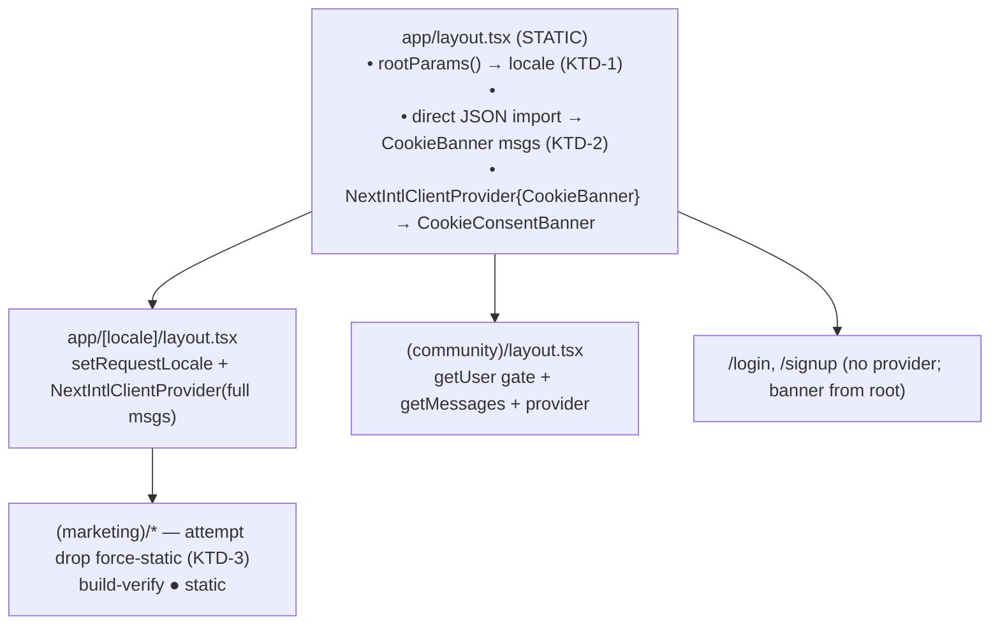
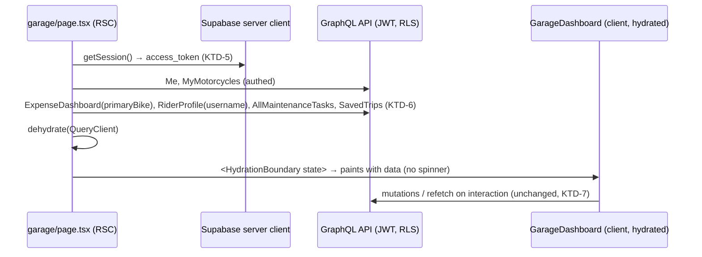

# refactor: Decouple i18n from root layout + SSR the garage dashboard

## Summary

Two performance refactors in `apps/web` (Next.js 16, App Router, next-intl, urql/TanStack Query, Supabase SSR auth), each carried forward as a `TODO(perf, big-refactor)` from the recent Core Web Vitals work:

- **Phase A — i18n decoupling.** Remove the dynamic `getLocale()`/`getMessages()` reads from the root layout so marketing routes no longer need the `export const dynamic = 'force-static'` crutch to render statically. The root layout sits above the `[locale]` segment and cannot call `setRequestLocale`, so its per-request reads currently force every route dynamic.
- **Phase B — garage SSR.** Eliminate the client-render waterfall on `/garage` (spinner → fetch 5 queries → paint) that produces LCP ~4.5s and CLS ~0.14, by prefetching authenticated data on the server and hydrating the existing client dashboard so it paints with content on first render.

The two phases are independent and can land as separate commits/PRs. Phase A is higher-risk (touches i18n on every route, SEO-sensitive `<html lang>`) and is gated on build verification with a documented fallback. Phase B is lower-risk (additive server prefetch + hydration; existing client components untouched in behavior).

---

## Problem Frame

### Phase A
`apps/web/src/app/layout.tsx` (root) calls `await getLocale()` and `await getMessages()` to render `<html lang>` and to provide CookieBanner i18n. Both read request-scoped data; because the root layout is above `[locale]`, it cannot call `setRequestLocale`, so Next.js renders **every** route dynamically. Marketing pages work around this with `force-static` (`apps/web/src/app/[locale]/(marketing)/layout.tsx`), which is a per-segment override, not a fix. Goal: make the root layout static-safe so static/ISR rendering works without the override.

A 2026-03-08 learning (`docs/solutions/integration-issues/nextjs16-ppr-cache-components-next-intl-incompatibility.md`) documents that `setRequestLocale` alone did not defeat next-intl's dynamic behavior under PPR. That caveat was specifically about `cacheComponents`/PPR (currently `cacheComponents: false`) and `localeDetection`. This repo has `localeDetection: false` (`apps/web/src/i18n/routing.ts`), so next-intl does **not** read cookies/Accept-Language during render — the only dynamic triggers are the explicit `getLocale()`/`getMessages()` calls in the root layout. This materially changes the calculus, but the layout move must still be **build-verified**, not assumed.

### Phase B
`apps/web/src/app/(community)/garage/page.tsx` is a `'use client'` dashboard. It renders a centered spinner, fetches `Me`, `MyMotorcycles`, `ExpenseDashboard` (gated on primary bike), `AllMaintenanceTasks`, `SavedTrips`, and `GetRiderProfile` (gated on username) via TanStack Query, then paints. Result: LCP fires only after the client fetch waterfall, and the spinner→content swap plus async-section expansion produce CLS. No authenticated server-side GraphQL path exists today (`apps/web/src/lib/graphql-server.ts` is explicitly unauthenticated), so one must be built.

---

## Requirements

- **R1** Root layout (`app/layout.tsx`) performs no per-request dynamic read; `<html lang>` is still correct per locale for SEO (de/fr/es/… pages must not emit `lang="en"`).
- **R2** The cookie-consent banner still renders with correct translations on **all** routes, including non-localed ones (`/login`, `/signup`) and every locale.
- **R3** Marketing routes still build as static (`●`/`○`) — verified in the build route table — ideally **without** `force-static`; if next-intl still forces dynamic, `force-static` is retained as a documented fallback (no regression).
- **R4** All non-localed authed/community routes (`/garage`, `/pro`, `/explore`, `/trips`, `/route`, `/routes`, `/admin`) and auth routes (`/login`, `/signup`) still render correctly with working i18n where used.
- **R5** `/garage` paints meaningful content on first render (no full-page spinner gate); LCP element is server-rendered. Target LCP < 2.5s, CLS < 0.1 (p75).
- **R6** Authenticated server-side GraphQL fetch forwards the user's Supabase JWT through an RLS-enforced path (never service-role); existing GraphQL documents and generated types are reused unchanged.
- **R7** Garage interactivity preserved: log-expense modal, mark-task-done mutation, pro-gating, query invalidation/refetch all still work after hydration.
- **R8** `pnpm --filter web build` succeeds with expected render modes; `pnpm --filter web test` and Biome pass.

---

## Key Technical Decisions

### KTD-1 — Read locale in the root layout via `rootParams()`, not `getLocale()`
Next.js 16 exposes root params to layouts above the dynamic segment. Use `rootParams()` (verify exact import: `unstable_rootParams` from `next/server` or the stable `rootParams` if available in the installed version) to read `locale` statically in `app/layout.tsx`. Fall back to `routing.defaultLocale` (`'en'`) when undefined (non-localed routes are always English per `localeDetection: false`). This sets `<html lang>` correctly without a request-header read. **Rationale:** preserves SEO-correct `lang` per locale (R1) while removing the dynamic trigger. **Risk:** if `rootParams()` is unavailable/unstable in the pinned Next version, fall back to KTD-1b.

- **KTD-1b (fallback)** — If `rootParams()` cannot statically provide the locale: render `<html lang="en">` statically in the root and set the correct `lang` for non-default locales from the `[locale]` layout using a tiny nonce-free inline script (`document.documentElement.lang = <locale>`) OR accept `lang="en"` default only if SEO review deems it acceptable. Prefer `rootParams()`; this is a last resort and must be flagged in the PR.

### KTD-2 — Load CookieBanner messages in the root via direct JSON import keyed by `rootParams()` locale
Replace `getMessages()` (request-scoped, dynamic) with a static dynamic-import of the locale message file — the same mechanism `apps/web/src/i18n/request.ts` already uses (`import(\`../../messages/${locale}.json\`)`), which is static-render-safe. Extract only the `CookieBanner` namespace and pass it to the existing `NextIntlClientProvider` scoped around `<CookieConsentBanner />`. **Rationale:** keeps the banner working everywhere (R2) with zero per-request reads. The `[locale]` and community/segment layouts continue to provide full messages to their subtrees unchanged.

### KTD-3 — Attempt to drop `force-static` from the marketing layout; gate on build verification
After KTD-1/KTD-2, remove `export const dynamic = 'force-static'` from `app/[locale]/(marketing)/layout.tsx` and run the production build. If marketing routes remain `●` static, the override is gone (clean fix). If any flip to `ƒ` dynamic, **restore `force-static`** and record in the PR that next-intl/Next still forces dynamic for the marketing subtree (consistent with the 2026-03-08 learning). Either outcome satisfies R3 with no regression.

### KTD-4 — Garage SSR via TanStack Query server prefetch + `HydrationBoundary` (not a full server-component rewrite)
Convert `garage/page.tsx` into a thin async **server** component that prefetches the dashboard queries into a server `QueryClient`, `dehydrate`s it, and renders the existing dashboard (extracted to a client component `GarageDashboard`) inside `<HydrationBoundary state={dehydrate(qc)}>`. The dashboard keeps its `useQuery` hooks — now hydrated from server data, so it paints content on first render (R5) and retains mutations/refetch/invalidation (R7). **Rationale:** lowest-risk path; no rewrite of presentational components, no behavioral change to mutations, reuses all existing documents/types (R6). Avoids the larger full-RSC rewrite the TODO contemplated.

### KTD-5 — Build an authenticated server GraphQL fetcher
Add a server-only fetcher (e.g. `gqlServerFetcherAuthed` in `apps/web/src/lib/graphql-server.ts` or a new `graphql-server-authed.ts`) that reads the access token from `getSupabaseServerClient().auth.getSession()` and sets `Authorization: Bearer <token>`. Used only inside the garage server prefetch. **Rationale:** no authed server path exists today; required for R6. Must forward the user JWT (RLS-enforced), never the service-role key. Reuses `graphql-request` like the existing server fetcher. Handle missing/expired session gracefully (the `(community)` layout already redirects unauthenticated users, so a session is expected; still guard).

### KTD-6 — Server-resolve the query waterfall to avoid client sequential gating
Server-side, fetch `Me` and `MyMotorcycles` first, then derive `primaryBike`/`publicUsername` and prefetch `ExpenseDashboard`/`GetRiderProfile` (currently `enabled`-gated on the client). Prefetch `AllMaintenanceTasks` and `SavedTrips` in parallel. Dehydrate all. **Rationale:** eliminates the client sequential waterfall so all sections have data at first paint, fixing both LCP and the async-expansion CLS. `GetRiderProfile` is a public query (already fetched unauthed elsewhere); the rest require the authed fetcher.

### KTD-7 — Reserve layout space for any still-async / streamed content
Where a section may still resolve after first paint, give its container a reserved min-height / skeleton matching loaded dimensions so there is no shift (R5, CLS). `.bike-photo` already reserves `aspect-ratio: 16/9`; apply the same discipline to the expense panel, maintenance, and trips sections in `garage.css`.

---

## High-Level Technical Design

### Phase A — provider/render-mode topology (after refactor)

### Phase B — garage SSR data flow

---

## Implementation Units

### U1. Read locale statically in the root layout via `rootParams()`
- **Goal:** Remove `getLocale()` from `app/layout.tsx`; derive `lang` from root params (KTD-1).
- **Requirements:** R1
- **Dependencies:** none
- **Files:** `apps/web/src/app/layout.tsx`
- **Approach:** Verify the Next 16 root-params API (`unstable_rootParams`/`rootParams` from `next/server`) against the installed version via Context7/docs. Replace `const locale = await getLocale()` with the root-param read; fall back to `routing.defaultLocale` when the param is absent (non-localed routes). Keep `<html lang={locale}>`. If the API is unavailable, implement KTD-1b and flag it.
- **Patterns to follow:** locale fallback pattern in `apps/web/src/i18n/request.ts`.
- **Test scenarios:**
  - Build emits `<html lang="de">` for a `/de` marketing route and `lang="en"` for `/` and `/login` (verify in built HTML under `.next/server/app`).
  - `Covers R1.` Root layout contains no `getLocale()`/header read after change.
  - Test expectation: behavioral verification via build-output inspection (no unit test harness for RSC `<html>` output); assert in PR notes.
- **Verification:** `pnpm --filter web build` succeeds; spot-check built HTML `lang` per locale.

### U2. Replace `getMessages()` in root with a scoped CookieBanner message import
- **Goal:** Provide CookieBanner i18n without a request-scoped read (KTD-2).
- **Requirements:** R2
- **Dependencies:** U1 (reuses the root-param locale)
- **Files:** `apps/web/src/app/layout.tsx`
- **Approach:** Remove `await getMessages()`. Dynamic-import the locale message JSON (`messages/${locale}.json`) like `i18n/request.ts`; extract the `CookieBanner` namespace; pass to the existing `NextIntlClientProvider` wrapping `<CookieConsentBanner />`. Confirm the `CookieBanner` namespace exists for every locale file.
- **Patterns to follow:** `apps/web/src/i18n/request.ts` dynamic import; existing `cookieBannerMessages` shape in `app/layout.tsx`.
- **Test scenarios:**
  - `Covers R2.` Cookie banner renders translated strings on `/` (en), `/de` (de), and `/login` (en default) — verify built HTML / browser render contains localized banner copy, not raw keys.
  - Edge: a locale whose JSON lacks `CookieBanner` falls back without crashing (guard the namespace access).
  - Test expectation: render verification via ce-test-browser + build-output inspection.
- **Verification:** Banner shows correct copy across locales; no `MISSING_MESSAGE` console errors.

### U3. Attempt removing `force-static` from the marketing layout and build-verify
- **Goal:** Drop the workaround if the root is now static-safe (KTD-3).
- **Requirements:** R3
- **Dependencies:** U1, U2
- **Files:** `apps/web/src/app/[locale]/(marketing)/layout.tsx`
- **Approach:** Remove `export const dynamic = 'force-static'`. Run the production build and read the route table. If marketing routes remain `●`, keep removed. If any flip to `ƒ`, restore `force-static` and document that next-intl still forces dynamic (cite the 2026-03-08 learning). Keep `setRequestLocale` in `generateMetadata` regardless.
- **Patterns to follow:** existing `force-static` + `setRequestLocale` usage in the same file.
- **Test scenarios:**
  - `Covers R3.` Build route table shows `/[locale]`, `/[locale]/blog`, `/[locale]/blog/[slug]`, `/[locale]/compare/*`, `/[locale]/features/*`, `/[locale]/guides`, `/[locale]/tools/*` as `●` (or `○`) — not `ƒ`.
  - Fallback path exercised: if dynamic, `force-static` restored and routes are `●` again (no regression).
  - Test expectation: none (config change); verified via build route table.
- **Verification:** `grep` the build log for marketing routes; all static.

### U4. Regression-check all non-localed and auth routes
- **Goal:** Ensure i18n changes don't break routes outside `[locale]` (R4).
- **Requirements:** R4
- **Dependencies:** U1, U2
- **Files:** none (verification unit) — touch only if a fix is needed in `apps/web/src/app/(community)/layout.tsx`, `pro/`, `route/`, `explore/`, `trips/`, `routes/`, `admin/`, `u/[handle]/` layouts, or `login`/`signup` pages.
- **Approach:** Confirm community/pro/route/explore/trips/routes layouts still mount their full-message providers (unchanged) and `/login`, `/signup` still render with the root-provided banner. Build + smoke render each route family.
- **Test scenarios:**
  - `Covers R4.` `/garage` (redirects unauthed → `/login`; authed renders), `/login`, `/admin`, `/explore`, `/trips/...` all render without i18n errors.
  - Test expectation: none new; covered by build + ce-test-browser smoke.
- **Verification:** Build passes; no missing-provider runtime errors in smoke pass.

### U5. Add an authenticated server-side GraphQL fetcher
- **Goal:** Forward the Supabase JWT from a server component to the GraphQL API (KTD-5).
- **Requirements:** R6
- **Dependencies:** none (independent of Phase A)
- **Files:** `apps/web/src/lib/graphql-server.ts` (extend) or new `apps/web/src/lib/graphql-server-authed.ts`; test `apps/web/src/lib/__tests__/graphql-server-authed.test.ts`.
- **Approach:** New `gqlServerFetcherAuthed(document, variables)` that reads `access_token` via `getSupabaseServerClient().auth.getSession()` and issues a `graphql-request` call with `Authorization: Bearer <token>` and a timeout. Throw/return a typed empty result on missing session (caller already gated by community layout). Never use the service-role key.
- **Patterns to follow:** `apps/web/src/lib/graphql-server.ts` (`gqlServerFetcher`), `apps/web/src/lib/graphql-client.ts` (how the browser fetcher reads `session.access_token` and sets the header), `apps/web/src/lib/supabase-server.ts` (`getSupabaseServerClient`).
- **Test scenarios:**
  - Happy path: given a mocked session with an access token, the fetcher sets `Authorization: Bearer <token>` and returns typed data.
  - Error path: no session → does not send a service-role key; surfaces an auth error / empty result without throwing unhandled.
  - Edge: request timeout aborts cleanly.
  - `Covers R6.`
- **Verification:** Unit tests pass; no service-role key referenced in the module.

### U6. Server-prefetch garage data and hydrate the dashboard
- **Goal:** Convert `garage/page.tsx` to an RSC that prefetches + dehydrates; render the existing dashboard via `HydrationBoundary` (KTD-4, KTD-6).
- **Requirements:** R5, R6, R7
- **Dependencies:** U5
- **Files:** `apps/web/src/app/(community)/garage/page.tsx` (becomes RSC server component), new `apps/web/src/app/(community)/garage/garage-dashboard.tsx` (the current `'use client'` component body, extracted), possibly `apps/web/src/lib/graphql-client.ts` query-key constants reused.
- **Approach:** Extract the entire current client component into `GarageDashboard` (`'use client'`), preserving its `useQuery`/`useMutation` hooks and query keys verbatim. New server `page.tsx`: create a `QueryClient`, `prefetchQuery` for `Me`, `MyMotorcycles` (await), derive `primaryBike`/`publicUsername`, then `prefetchQuery` `ExpenseDashboard`, `GetRiderProfile`, `AllMaintenanceTasks`, `SavedTrips` (parallel) using the **same query keys** the client uses so hydration matches. `GetRiderProfile` may use the existing unauthed server fetcher; the rest use `gqlServerFetcherAuthed`. Wrap `<HydrationBoundary state={dehydrate(qc)}><GarageDashboard/></HydrationBoundary>`. Ensure a `QueryClient` is available for hydration (confirm `apps/web/src/providers/query-provider.tsx` supports dehydrated state on the client; add `HydrationBoundary` usage). Keep the client loading branch as a fallback for cache-miss but it should not trigger when hydrated.
- **Patterns to follow:** TanStack Query Next.js App Router SSR hydration (`prefetchQuery` + `dehydrate` + `HydrationBoundary`); existing query keys in `garage/page.tsx` (`['me']`, `['garage','motorcycles']`, `['garage','expenses',id]`, `['garage','maintenance']`, `['garage','trips']`, `['garage','profile',username]`).
- **Test scenarios:**
  - `Covers R5.` With prefetched data, the dashboard renders header + stats + bikes on first paint (no spinner) — verified via ce-test-browser screenshot / DOM assertion.
  - `Covers R7.` Log-expense modal opens, mark-done mutation fires and invalidates `['garage','maintenance']`, pro-gating still blurs locked sections.
  - Edge: user with zero bikes → empty state renders server-side (no spinner flash).
  - Integration: query keys used in `prefetchQuery` exactly match client `useQuery` keys (mismatch would re-fetch and reintroduce a flash) — assert keys are shared constants or identical.
  - Error path: authed fetch failure on the server degrades to the client fetching (no crash).
- **Verification:** `/garage` builds; browser shows content immediately; mutations work; no spinner→content swap.

### U7. Reserve layout space for garage sections to remove CLS
- **Goal:** Prevent shift from any section that resolves/expands after first paint (KTD-7).
- **Requirements:** R5
- **Dependencies:** U6
- **Files:** `apps/web/src/app/(community)/garage/garage.css`
- **Approach:** Give the expense panel, maintenance list, and trips grid containers a reserved `min-height` (or skeleton) matching typical loaded dimensions, mirroring the existing `.bike-photo { aspect-ratio: 16/9 }` discipline. With U6 most data is hydrated, so this guards residual cases.
- **Patterns to follow:** existing `.bike-photo` aspect-ratio reservation in `garage.css`; `ExpenseDashboardPanel` already sets `minHeight: 200px` on its empty state.
- **Test scenarios:**
  - `Covers R5.` No layout shift between first paint and interactive (verify CLS ~0 in a ce-test-browser / Lighthouse pass on a seeded account).
  - Test expectation: none (CSS); verified via CLS measurement.
- **Verification:** CLS visibly eliminated in browser trace.

### U8. Full verification pass
- **Goal:** Confirm R3/R8 across the whole app.
- **Requirements:** R3, R8
- **Dependencies:** U1–U7
- **Files:** none
- **Approach:** `pnpm --filter web build` (inspect route table: marketing `●`, garage renders), `pnpm --filter web test`, Biome on changed files. Confirm no route unexpectedly flipped dynamic and no new CSP/console errors.
- **Test scenarios:**
  - `Covers R8.` Build exits 0; full web test suite green; Biome clean.
- **Verification:** All three commands pass; route table matches expectations.

---

## Scope Boundaries

### In scope
- Root-layout i18n decoupling (locale + CookieBanner) and the `force-static` removal attempt.
- Garage server prefetch + hydration + CLS spacing + the authed server fetcher.

### Deferred to Follow-Up Work
- A dedicated garage server-aggregation GraphQL resolver (per the expense-dashboard learning) to further shrink payload — only if profiling warrants after hydration lands.
- Documenting `proxy.ts` internals via `/ce-compound` (uncaptured today).

### Outside this change's scope
- `localePrefix: 'always'` URL-prefix locale routing (the deepest next-intl fix). It changes public URLs and is SEO-sensitive — a separate, reviewed initiative, not part of this refactor. Referenced only as the fallback escalation if KTD-1/KTD-3 cannot achieve static rendering.
- Enabling `cacheComponents`/PPR (deliberately off per the 2026-03-08 learning).
- Any change to GraphQL schema, resolvers, or generated types.

---

## Risks & Dependencies

- **R-A (high):** `rootParams()` may be `unstable_` or behave unexpectedly in the pinned Next 16 version → mitigated by KTD-1b fallback and a build check on `<html lang>` per locale. Verify the API via Context7 before implementing U1.
- **R-B (medium):** next-intl may still force the marketing subtree dynamic even after the root is clean (per the 2026-03-08 learning, though that was PPR-specific and `localeDetection` is off here) → KTD-3 gates on the build and restores `force-static` with no regression.
- **R-C (medium):** Hydration key mismatch on garage would silently re-fetch client-side and reintroduce the flash → U6 test asserts prefetch keys equal client `useQuery` keys (ideally shared constants).
- **R-D (medium):** Server JWT forwarding must hit the RLS path and the API's `GqlAuthGuard` must accept the forwarded Supabase token and return string error codes (`UNAUTHENTICATED`, not 401) per prior learnings → verify with a seeded authed account in ce-test-browser.
- **R-E (low):** CookieBanner namespace missing in a locale JSON → guard the access (U2 edge scenario).
- **Dependency:** ce-test-browser verification of `/garage` needs an authenticated test account (test@test.com / testClient123 per project notes).

---

## Sources & Research
- `docs/solutions/integration-issues/nextjs16-ppr-cache-components-next-intl-incompatibility.md` — next-intl/PPR dynamic-rendering constraints; `localePrefix: 'always'` as the deep fix; `setRequestLocale` insufficiency under PPR.
- `docs/solutions/integration-issues/expense-dashboard-server-aggregation-charting.md` — server aggregation + per-request RLS Supabase client; never service-role for user data.
- `docs/solutions/security-issues/dead-jwks-path-missing-await.md` + `docs/solutions/integration-issues/monorepo-code-review-multi-category-fixes.md` — JWT verification path + string GraphQL error codes for client refresh.
- Repo research: `i18n/request.ts`, `i18n/routing.ts` (`localeDetection: false`), provider topology across `(community)/pro/route/explore/trips/routes` layouts, `lib/graphql-server.ts` (unauthed), `lib/supabase-server.ts`, `lib/graphql-client.ts`.
- Next.js 16 docs (Context7 `/vercel/next.js`) — CSP/dynamic-rendering, root params, TanStack Query App Router hydration (verify APIs at implementation time).
