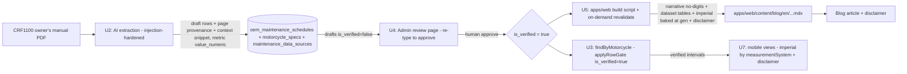
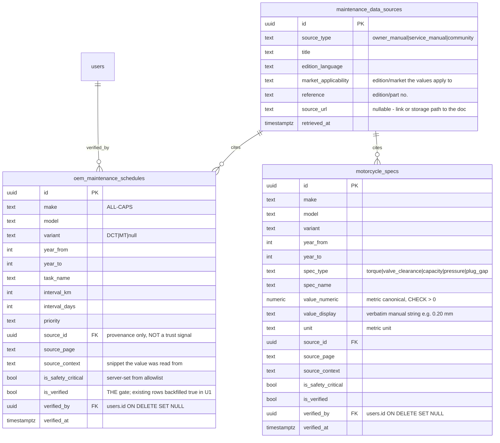
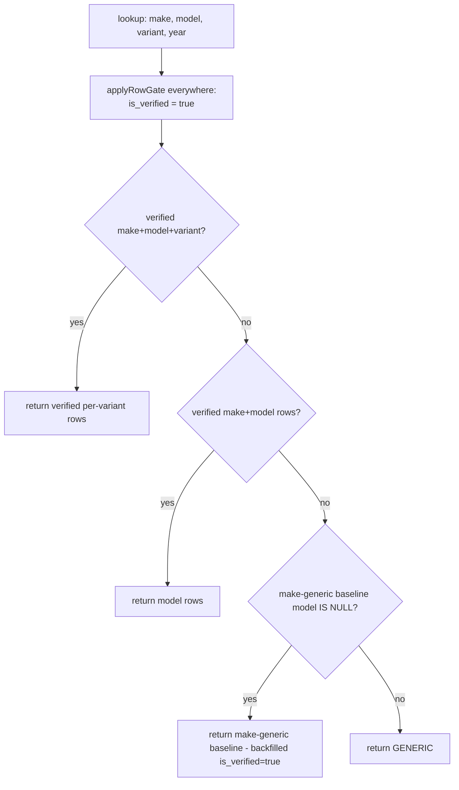

# feat: Africa Twin DCT maintenance data-sourcing pilot

**Date:** 2026-06-19
**Type:** feat
**Depth:** Deep
**Review:**
- doc-review findings applied 2026-06-21 (6-persona pass — P0 verification-gate fix + factual corrections integrated)
- **7-agent audit applied 2026-06-22** (feasibility, data-integrity, security, coherence, scope, product, adversarial — see `docs/reviews/2026-06-22-africa-twin-pilot-plan-audit.md`). Resolved 5 new P0s + ~12 P1s. Two forks resolved here: render half is **disposable scaffolding** (not blocked behind the CMS); minimal **variant capture pulled into scope** so the in-app value is real on ship.
**Origin:** `docs/brainstorms/2026-06-19-motorcycle-data-sourcing-requirements.md`
**Pilot bike:** Honda CRF1100D (Africa Twin DCT)
**Source document:** Honda CRF1100 owner's manual — `ml.remawmom.2020_31mks800_crf1100_africa_twin.pdf` (English edition, ref `31MKS800`, 2020, ~4 MB; user-supplied at `/Users/andrejmacm5/Downloads/`)

---

## Summary

Prove the structured-first maintenance data supply chain end-to-end on a single bike. Source the Africa Twin DCT's maintenance data from the official owner's manual into a **verified, provenance-tagged dataset**, then render the *same verified numbers* into (a) a blog article via the current MDX pipeline and (b) the in-app maintenance reminders — both carrying a release-blocking "informative only, verify against official sources" disclaimer. AI extracts and writes narrative; **AI never types a safety-critical number that reaches a live surface** — those flow from the dataset after human sign-off. Canonical values are stored in the manual's native **metric** units; imperial is computed by a pure conversion function (baked into the article at generation time, derived at render time on mobile) and is **never stored in the dataset DB rows**.

This is the leanest path that exercises every link (acquire → extract → verify → store → render ×2). The **data half** (acquire→extract→verify→store: U1–U4 + mobile consumption U7) is the durable asset and proceeds independently. The **render half** for the web article (U5/U6) is built on the current file-based MDX pipeline and is **explicitly disposable scaffolding** — it will be replaced by a `blog_posts` row when the DB-backed CMS lands (companion doc); the `dataset_models` frontmatter key is the file-based stand-in for that future FK. Polished verification CRUD, multi-locale article translation, and the other brands are out of scope.

---

## Problem Frame

The maintenance-schedule cluster is both the winning SEO content and the backbone of the #2 in-app feature (reminders), yet both run on unsourced, make-level approximations. `oem_maintenance_schedules` cannot even represent a DCT variant, stores no provenance, and `is_verified` is never set. Hand-authored blog posts state hard numbers (intervals, valve clearances) as fact with no citation — an accuracy gap on safety-critical data.

**Scope honesty (audit):** this pilot establishes the verified single-source-of-truth pattern on one owner-verifiable bike. It does **not** remediate the existing accuracy gap: the legacy make-level baseline rows remain live and trusted (see KTD 3), and the ~20 existing hand-authored brand maintenance articles remain uncited. A disclaimer-retrofit onto those legacy articles is folded into U6 so they are not left asserting safety numbers with no caveat while the new pilot article carries one.

---

## Requirements Traceability

Carried from origin (`docs/brainstorms/2026-06-19-motorcycle-data-sourcing-requirements.md`):

- **R1 — Structured-first.** One verified dataset feeds both blog and reminders. → U1, U3, U5, U7
- **R2 — Aggressive sourcing, facts-only.** Owner's + service manuals; store values, never reproduce prose/procedures/diagrams/table structure; legit acquisition; community data labeled. → U2 (provenance), Scope Boundaries
- **R3 — Verification gate.** Every value cited; human sign-off on safety-critical numerics before live/reminders; non-critical confidence-gated. → U1, U3, U4
- **R4 — Hybrid rendering.** Spec tables render from the dataset; LLM writes narrative only; a verified number renders consistently in article + app. → U5, U7
- **R5 — Mandatory disclaimer.** Release-blocking footer on every spec-bearing page (blog + app): informative character, verify against official sources. → U6
- **R6 — Pilot = Africa Twin DCT, owner-verifiable, before scaling.** → whole plan
- **Success (audit-revised):**
  - No safety-critical value reaches a live surface without sign-off. → U3
  - The article's spec tables and the in-app reminders render the **same verified metric value** from the same dataset rows. **Displayed units may differ by surface** unless the unit is converted on both — so U7 makes mobile apply the same imperial derivation gated on the user's `measurementSystem`, and the parity test asserts the **displayed string per unit system**, not just the raw metric. → U5, U7
  - A dataset correction propagates **instantly to mobile reminders** (DB-live) and **eventually to the article** (re-run generator → on-demand revalidation, atomic; bounded staleness — see KTD 6). It is NOT instantaneous on both surfaces; "without re-editing prose" holds. → U5, U7, Risks
  - **Locale scope:** all-locale propagation holds for *mobile reminders* (read DB live, already localized). The *article* is English-only in the pilot; all-locale article propagation is deferred. *(The origin's success criterion states "all locales" for the article too — that is narrowed here and should be reconciled in the origin doc; see audit P2.)*
  - Make-level baseline fallback keeps working (no reminder regression). → U1, U3, U7

---

## Key Technical Decisions

1. **Extend `oem_maintenance_schedules` for the variant + verification dimensions; add two new tables.** Interval-cadence rows stay in the existing table (mobile already consumes them). Add `variant`, verification, and a source FK there. Non-cadence point-values (torque, valve clearance, capacities, pressures) go in **`motorcycle_specs`**. Provenance lives in **`maintenance_data_sources`**. A **`motorcycles.variant`** column is added so a user's bike can carry "DCT".
   **Why `motorcycle_specs` is in scope (audit):** the pilot's blog article (U5) must render a **richer** spec table than mobile — torque, valve clearance, capacities, pressures — none of which the reminder path consumes. That blog-only spec data is the part of R4 that proves "spec tables render from the dataset" beyond the intervals mobile already shows. If U5 rendered only interval rows, `motorcycle_specs` would be premature; it renders specs, so it is required. Be aware the spec rows carry the bulk of the safety-critical verification burden and are mostly **blog-serving** (the shared-source-of-truth win is asymmetric: only the interval rows feed both surfaces).

2. **New tables follow the `model_insights` (`00144`) RLS template — service-role-only, no policies.** Read through resolvers via `SUPABASE_ADMIN`, never user-owned. `oem_maintenance_schedules` keeps its no-RLS reference-data posture. No `motorcycle_id` FK on these tables, so no IDOR `WITH CHECK` concern; the existing user-owned `maintenance_tasks` write path is unchanged *in shape* but **inherits the verification gate** through the shared lookup (KTD 3).

3. **Verification is a gate on the row — `is_verified = true` — applied through ONE shared predicate in EVERY read path.** *(Audit P0-2; supersedes the earlier `source_id IS NULL OR is_verified = true` framing.)*
   - The predicate is **`is_verified = true`** alone. `source_id` becomes **pure provenance**, not a trust signal — the earlier `source_id IS NULL = trusted` shortcut was fragile: backfilling provenance onto legacy rows would have flipped them to `is_verified=false` (the default) and silently dropped every existing reminder, or forced an un-reviewed `is_verified=true`.
   - **The U1 migration backfills all pre-existing baseline rows to `is_verified = true`** (they are today's trusted production data). New extracted rows default `is_verified = false` until human approval. Net: no reminder regression, and "sourced" no longer means "ungated."
   - The predicate is implemented as a **single `applyRowGate(query)` helper** and called in **every** query builder in `oem-schedules.service.ts`: all tiers of `findByMotorcycle` (public/onboarding preview AND `autoPopulateForBike`, the reminder-write path) **and** the `scheduleIdFilter` PK branch (`.in('id', …)`). Two independent gate copies is the exact shape that caused the original P0 — there must be one.

4. **Variant is a 4th waterfall tier; the gate is independent of it.** Lookup precedence: verified `make + model + variant` → verified `make + model` → make-generic (`model IS NULL`) → `GENERIC`. `make` stays ALL-CAPS NHTSA-normalized.
   **Index (audit P1):** the natural-key unique index is a COALESCE-expression index (per `00129`). Extend it to **`(make, COALESCE(model,''), COALESCE(variant,''), COALESCE(year_from,0), COALESCE(year_to,0), task_name)`** — `variant` AND `year_to` as COALESCE expressions, or non-overlapping year ranges / NULL-variant baseline rows collide. The duplicate pre-check GROUP BY must use the **identical** expression set. The `previewCache` key extends to include `variant`, and the cache is **invalidated on approve**.

5. **Hybrid render = generator merges AI narrative with dataset-driven tables; the narrative carries NO numbers at all.** *(Audit P0-3: allowlist, not denylist.)* A narrative-only LLM path (new inline prompt + a Zod schema with **no numeric/interval fields**) produces prose. A **numeric guard rejects ANY standalone digit-cluster** (`/\d/`) appearing in *any* narrative string field (intro, section headings, key-takeaways, body) — not a unit denylist (which provably misses `10W-30`, `4.8 L`, `quarts`, `kPa`, `lb-ft`, en-dash ranges, spelled-out and hyphenated forms — verified against the existing CBR article). The narrative refers to tables generically ("see the schedule below"). A separate generator queries verified rows/specs and emits GFM tables, merged into the article MDX between marked regions; regeneration refreshes only those regions.

6. **Render through the current file-based MDX pipeline, via an `apps/web` build-time generator script — explicitly disposable scaffolding.** *(Audit P0-1, fork resolved: scaffolding-owned, NOT blocked behind the CMS.)*
   - The generator is a Node script under `apps/web/scripts/` that queries Supabase with the service-role key and writes the `.mdx` to `apps/web/content/blog/en/` — **not** `article-generator.service.ts` (which writes DB rows in the separate API process with no web-tree access).
   - **This render half is throwaway.** The companion CMS doc commits to retiring file-based MDX and migrating every post to a `blog_posts` row. This pilot's committed `.mdx` becomes one more file that migration ingests; the generator will be re-pointed at a `blog_posts` row then. The `dataset_models` frontmatter key (KTD format below) is the file-based stand-in for the future `blog_posts` FK. We accept building the render half twice; the **data half (U1–U4, U7) is the durable asset and does not depend on the CMS**.
   - **`dataset_models` format (audit P2):** an array of `make/model[/variant]` strings — `make` ALL-CAPS NHTSA-normalized, `model` matching `oem_maintenance_schedules.model`, optional `variant` matching `motorcycles.variant`. Parser splits on `/` and matches `(make, model, variant)` tuples; a missing variant matches baseline rows only. Example: `["HONDA/CRF1100/DCT"]`.
   - **Atomic revalidation (audit P0-1 / ISR P1):** re-running the generator MUST trigger on-demand revalidation of the article route as a single step, so a dataset correction surfaces without waiting out the 7-day ISR window and without a full deploy. The blog page uses `revalidate = 604800`; without on-demand revalidation, mobile (DB-live) and the web article can show **different safety numbers for up to 7 days** — unacceptable for safety-critical data.
   - **Service-role key handling (audit P1):** add `SUPABASE_SERVICE_ROLE_KEY` to `apps/web/.env.example` as a comment-only entry; the script runs as a standalone Node process (a `package.json` script, run before/outside `next build`), never via `NEXT_PUBLIC_*`, never bundled.

7. **Units are stored in the manual's native metric; imperial is derived, never stored in the dataset.** *(Audit P0-5, reworded.)*
   - Extraction stores a single canonical **metric** value (the value the human verifies against the cited page) as **`value_numeric NUMERIC`** plus `value_display TEXT` (the verbatim manual string, e.g. `0.20 mm`). The English manual prints values in dot-decimal (comma = thousands); the parser normalizes accordingly. The manual may print imperial alongside metric — we still **derive** imperial deterministically rather than transcribing the printed imperial, so the article and app always agree and no second printed number is hand-/AI-typed. See KTD note below — TEXT-only storage was rejected.
   - Imperial (lb-ft, psi, mi, in) is computed by a **pure conversion function**. On the **web article** it is computed at *generation* time and baked into the committed MDX as text (static MDX has no per-request render hook — so on the web path imperial *is* persisted, in the file, exactly as the existing articles already do). On **mobile** it is computed at *render* time. It is **never stored in the dataset DB rows**.
   - **Rounding is a safety concern (audit P0-5):** the derived imperial value isn't separately verified (we round a deterministic conversion of the verified metric), and rounding can change a practical value (`24 Nm → 17.7 → 18 lb-ft` is a ~5% over-torque; valve clearance must keep thousandths-of-an-inch precision). Define rounding precision **per `spec_type`** (torque → 1 decimal lb-ft; clearance → 3 sig figs / thousandths in; pressure → whole psi; capacity → 1 decimal). Add a `convert → round → convert-back` test asserting the round-tripped value stays within a stated tolerance of the stored metric per spec_type, and flag any spec exceeding tolerance for human review of the *displayed imperial*.

8. **Extraction stores numeric values once; `is_safety_critical` is server-set from an allowlist; injection-hardened.**
   - Store `value_numeric NUMERIC NOT NULL` (canonical, dot-decimal, parsed+validated **once** at extraction) — NOT `TEXT`. TEXT-only defeats the Zod range guard after insert (a later SQL/import write of `5000` or `0.020` wouldn't be rejected), defeats numeric dedup (`"10,000"` ≠ `"10000"`), and forces a locale-format reparse at render that can mis-handle a thousands separator and produce an orders-of-magnitude-wrong value. Keep `value_display TEXT` for the verbatim manual string the human verifies against. Add a DB `CHECK (value_numeric > 0)` (and tighter per-spec_type bounds where cheap).
   - **`is_safety_critical` is computed server-side from an allowlist** of task/spec names (valve clearance, brake fluid, clutch fluid, engine oil, tire pressure) defined as an `as const` constant in `packages/types`. **Do NOT copy** the existing `article-generator.service.ts` approach, which derives `is_safety_critical` from LLM-output keyword matching (`apps/api/.../article-generator.service.ts:233`) — that trusts the model and is the opposite of the rule here. Flag this divergence explicitly in U2.
   - **Injection hardening (KTD):** treat PDF content as data behind an explicit boundary marker; constrain numeric outputs to plausible physical ranges via Zod before insert. The verification gate (U4) is the backstop, not the only line. Note Zod range-checks an in-range-but-wrong number cannot catch (e.g. `0.22` vs `0.20`) — that is the human reviewer's job (U4 makes that job harder to rubber-stamp).

---

## High-Level Technical Design

### Supply chain (data flow)

### Data model changes (ERD)

### Verified lookup waterfall (U3) — single gate predicate, every path

---

## Implementation Units

### U1. Data-model migration: variant, provenance, verification, specs

**Goal:** Add the schema needed to store per-model/variant maintenance data with provenance and a verification gate, without regressing existing reminders.
**Requirements:** R1, R3 (schema side), R2 (provenance).
**Dependencies:** none.
**Files:**
- `supabase/migrations/00149_maintenance_data_sourcing_pilot.sql` — **use `00149`** (highest existing is `00148`; the repo has prior duplicate-prefix collisions at `00139`/`00144`, so re-verify the highest at execution time)
- `packages/types/src/constants/enums.ts` (add `variant`, `specType`, `sourceType`, and the **`SAFETY_CRITICAL_ALLOWLIST`** as `as const`)
- `apps/api/src/common/enums/graphql-enums.ts` (mirror as TS enums — values MUST match)
- `packages/types/src/database.types.ts` is regenerated, not hand-edited (run `pnpm generate:types`)

**Approach:**
- `ALTER TABLE oem_maintenance_schedules ADD COLUMN variant TEXT, source_id UUID REFERENCES maintenance_data_sources(id) ON DELETE RESTRICT, source_page TEXT, source_context TEXT, is_safety_critical BOOL NOT NULL DEFAULT false, is_verified BOOL NOT NULL DEFAULT false, verified_by UUID REFERENCES public.users(id) ON DELETE SET NULL, verified_at TIMESTAMPTZ.` (`ADD COLUMN … NOT NULL DEFAULT false` is metadata-only on PG11+, safe at this table's scale.)
- **Backfill (audit P0-2):** `UPDATE oem_maintenance_schedules SET is_verified = true WHERE is_verified = false;` immediately after the ADD — all pre-existing rows are today's trusted production data. This is what prevents the gate (`is_verified = true`) from regressing every existing reminder.
- `ALTER TABLE public.motorcycles ADD COLUMN variant TEXT` (nullable). Capture UI is in scope this pilot (U7) — minimal selector.
- **Pre-check before index recreation:** `SELECT … GROUP BY (make, COALESCE(model,''), COALESCE(variant,''), COALESCE(year_from,0), COALESCE(year_to,0), task_name) HAVING count(*) > 1` — abort the whole migration with the offending keys if any duplicate exists. Then drop & recreate the natural-key unique index with the **identical COALESCE expression set including `variant` and `year_to`**. Keep it in one `BEGIN; … COMMIT;` so a concurrent insert can't slip a dup between the check and the unique-index build. Do **not** use `CREATE INDEX CONCURRENTLY` (can't run in a transaction; non-concurrent is correct for atomicity at this scale).
- `CREATE TABLE maintenance_data_sources` (incl. nullable `source_url`, `market_applicability`) and `motorcycle_specs` per the ERD. `motorcycle_specs.value_numeric NUMERIC NOT NULL CHECK (value_numeric > 0)`, `value_display TEXT`. `source_type`/`spec_type` as `TEXT … CHECK (… IN (…))`. Add `UNIQUE (make, COALESCE(model,''), COALESCE(variant,''), COALESCE(year_from,0), spec_type, spec_name)` on `motorcycle_specs` so re-extraction can `ON CONFLICT DO UPDATE` (idempotency is a constraint, not a convention). New tables: `ENABLE ROW LEVEL SECURITY` with **no policies** (deny-all; service-role reads), mirroring `00144`; add `updated_at` + reuse the shared **`public.update_updated_at()`** trigger fn (00013) rather than a third per-table copy.
- **Extend `content_generation_log.content_type` CHECK in THIS migration** (DROP/ADD), preserving the existing 7 values (`article, quiz, diagnostic_response, diagnostic, ride_summary, trip_assistant, onboarding_insights`) and adding `maintenance_extraction` and `maintenance_narrative`. Touch only the `content_type` CHECK, not `status`. (Must precede U2/U5 or their log inserts throw.)
- Indexes: `motorcycle_specs (make, model, variant)`; extend the schedules lookup index to cover `variant`.

**Patterns to follow:** `00022_*` (table shape), `00126_*` (ALL-CAPS make), `00129_*` (COALESCE natural-key index, `BEGIN/COMMIT`), `00144_model_insights.sql` (service-role-only RLS, provenance/verification columns), `00013` (`public.update_updated_at()`), `00145` (content_type CHECK DROP/ADD), `00007`/`00145` (`SET search_path = ''` + schema-qualified — only if an RPC is later added).

**Test scenarios:**
- Migration applies cleanly on a fresh DB; the duplicate-key pre-check aborts the migration (not the index alone) when a collision is seeded.
- **Existing baseline rows are `is_verified = true` after migration** (backfill regression guard); `oemSchedulesPreview` for a make with only baseline rows returns the same rows as before.
- A row with `variant='DCT'` and a duplicate `(make, model, variant, year_from, year_to, task_name)` is rejected; the same task with `variant='MT'`, or with a different `year_to`, is accepted.
- `motorcycle_specs` duplicate `(make, model, variant, year_from, spec_type, spec_name)` is rejected by the unique constraint; `value_numeric <= 0` is rejected by the CHECK.
- `motorcycle_specs` / `maintenance_data_sources` reject anon/authenticated reads (RLS deny-all); service role reads succeed.
- `verified_by` rejects a non-existent user id (FK); deleting a user that verified rows succeeds and NULLs `verified_by` (ON DELETE SET NULL — GDPR erasure path).
- Inserting `content_generation_log` with an unknown `content_type` still fails. *(The `maintenance_extraction`/`maintenance_narrative` success assertions live in U2/U5, where those types are produced.)*

---

### U2. Manual extraction → draft rows with provenance

**Goal:** Turn the CRF1100 owner's manual into draft `oem_maintenance_schedules` + `motorcycle_specs` rows for the Africa Twin DCT, each tagged with its source page **and the context snippet the value was read from**, in native metric units.
**Requirements:** R2, R3 (draft side), R6.
**Dependencies:** U1.
**Files:**
- `apps/api/src/modules/maintenance-sourcing/` extraction command/service (or a one-off script; a developer-run job, not a user endpoint)
- a reviewable draft artifact (JSON/SQL) for the pilot

**Approach:**
- **Pre-flight (audit P1):** confirm the owner's manual actually contains each targeted `spec_type` before extracting it. Torque/valve-clearance depth is frequently service-manual-only (and service manuals are deferred) — if the owner's manual lacks them, narrow the pilot's spec scope honestly rather than producing empty rows. Record the source's `market_applicability` (the manual's market, e.g. US) so market-specific values aren't applied to the wrong audience.
- Register one `maintenance_data_sources` row (`source_type='owner_manual'`, title, `edition_language='en'`, `market_applicability`, reference `31MKS800`, `source_url` = storage path if uploaded, `retrieved_at`).
- Extract the periodic-maintenance schedule (intervals) → draft `oem_maintenance_schedules` rows: `make='HONDA'`, `model='CRF1100'` (confirm the NHTSA model string at execution), `variant='DCT'`, `source_id`, `source_page`, `source_context`, `is_verified=false`.
- Extract point-values (oil/coolant capacity, tire pressures, torque, valve clearance, DCT fluid) → draft `motorcycle_specs` rows: parse each value **once** into `value_numeric` (English: dot decimal, comma thousands — e.g. `10,000` → `10000`) and keep the verbatim `value_display` (`0.20 mm`), with `unit`, same provenance/critical flags.
- **`is_safety_critical` is set server-side from `SAFETY_CRITICAL_ALLOWLIST`** (U1 const), never by the LLM. Explicitly do NOT replicate `article-generator.service.ts:233`'s LLM-keyword approach.
- **Facts only** (R2): store values + page reference + a short context snippet for review; never copy manual prose, procedures, diagrams, **or the manual's table selection/arrangement** (EU sui-generis database right can attach to reproducing schedule structure, not just verbatim text).
- **Injection hardening:** label PDF content as data behind a boundary marker; constrain numeric outputs to plausible ranges via Zod (e.g. interval_km 500–100000, torque 1–500 Nm) so out-of-range fabrications fail before insert.
- Idempotent insert: `ON CONFLICT (natural key) DO UPDATE`. Log the run to `content_generation_log` (`content_type='maintenance_extraction'`).

**Patterns to follow:** `article-generator.service.ts` (OpenAI client, Zod-validated structured output, `sanitizeTopicInput` injection list, `content_generation_log` insert, budget enforcement) — **but NOT its `is_safety_critical` logic**; `gemini-autodraft-social-worker.md` (explicit `source` + dedup).

**Execution note:** ~4 MB English PDF (`ml.remawmom.2020_31mks800_crf1100_africa_twin.pdf`), no local PDF lib — choose ingestion at execution (LLM-vision vs parsing lib). Capture a page number AND a context snippet for every value.

**Test scenarios:**
- Produces ≥1 interval row and ≥1 spec row, each with non-null `source_id`, `source_page`, and `source_context`.
- DCT-specific items (transmission/DCT fluid) present with `variant='DCT'`.
- Safety-critical fields land with `is_safety_critical=true` (server-set, allowlist) and `is_verified=false`.
- An out-of-physical-range extracted value (e.g. torque 5000 Nm) is rejected by the Zod range guard.
- A metric value parses into `value_numeric` correctly (`0.20 mm` → `0.20`; `10,000 km` → `10000`), keeping the verbatim `value_display`.
- Re-running extraction creates no duplicates (ON CONFLICT, backed by the unique constraint).
- `content_generation_log` records the run with `content_type='maintenance_extraction'`.

---

### U3. Verified waterfall + admin review API

**Goal:** Make the lookup variant-aware and verification-gated (per-row, one shared predicate), and expose the API the admin review page needs.
**Requirements:** R1, R3, Success (no-regression, no-unverified-critical).
**Dependencies:** U1, U2.
**Files:**
- `apps/api/src/modules/oem-schedules/oem-schedules.service.ts` (`applyRowGate` helper; call it in every tier of `findByMotorcycle` AND the `scheduleIdFilter` branch; `variant` tier; `mapRow` for new fields; cache key + invalidation)
- `apps/api/src/modules/oem-schedules/oem-schedules.resolver.ts` (variant arg; admin list + approve; DB role check)
- `apps/api/src/modules/oem-schedules/models/*.model.ts` (separate admin DTO with verification fields + source join + `source_context`; public `OemSchedule` unchanged so draft/verification fields never leak)
- `apps/api/src/modules/oem-schedules/dto/*.input.ts` (approve input; Zod in `@motovault/types`)
- `apps/api/schema.graphql` (regenerated via `pnpm generate:schema`)

**Approach:**
- **Implement `applyRowGate(query)` that appends `is_verified = true`, and call it in every query builder** — Level 1/2/3 of `findByMotorcycle` AND the `scheduleIdFilter` PK branch (`.in('id', scheduleIdFilter)`). This is the P0 fix; one predicate, no second copy. Add the verified `make+model+variant` tier ahead of `make+model`. Keep the explicit code filter even though tables are service-role read (defense-in-depth).
- Add `variant` to the `findByMotorcycle` signature, `mapRow`, and the `previewCache` key; **invalidate the cache entry on approve**. Note `oemSchedulesPreview` is **authenticated** (no `@Public()`; runs under the default-closed global `GqlAuthGuard`) — it is the *onboarding* preview for signed-in users, not an anonymous surface; the gate is needed because any authenticated non-admin must never see drafts. *(Correct the plan's earlier "public preview" wording wherever it appears.)*
- Add an **admin** query (draft per-variant rows + specs joined to `source` title/page + `source_context`) returning a dedicated admin DTO, and an **approve** mutation (sets `is_verified=true`, `verified_by = @CurrentUser().id`, `verified_at`). **Authorize via a DB role check** — query `public.users.role` through `SUPABASE_ADMIN` and throw `ForbiddenException` if not `'admin'` (the JWT `AuthUser.role` is INFORMATIONAL-ONLY per the decorator; the web proxy `adminAuth()` fast-path trusts the cookie-cached JWT and is route-level only — neither is sufficient for a write that publishes safety-critical data; the resolver DB check is the real boundary). The new mutation must NOT carry `@Public()` (the global guard then requires a valid JWT; `resolver-public-mutation-audit.spec.ts` already covers `OemSchedulesResolver`). UUID args typed `String!`.

**Patterns to follow:** existing `findByMotorcycle`/`mapRow`/`previewCache`; the DB role-check pattern at **`apps/api/src/modules/trips/services/trip-templates.service.ts:344`** (`.from('users').select('role')` via `supabaseAdmin`, `ForbiddenException` if `!== 'admin'`); `parallel-agent-graphql-contract-drift.md` (`pnpm generate`, `String!` UUIDs, mutation-name match).

**Test scenarios:**
- Insert a **draft** CRF1100 DCT row; lookup a CRF1100 bike → returns `GENERIC` (no baseline CRF1100 exists) and **not** the draft. Approve it → the same lookup now returns it.
- `importOemSchedule` for a CRF1100 DCT bike with only draft rows inserts **zero** tasks from those drafts.
- A draft schedule id passed via `scheduleIdFilter` inserts no task (PK-branch gate — same helper).
- **No reachable row has `is_verified = false` via any tier or the PK branch** (gate-coverage invariant test).
- Lookup for an unrelated make returns rows identical to pre-change (regression guard).
- Approve mutation flips `is_verified`, stamps `verified_by` (UUID) + `verified_at`, and **invalidates the cache**; a non-admin (valid JWT, role≠admin in DB) is rejected even if the JWT claim says admin; an unauthenticated call is rejected by the global guard.
- A safety-critical draft never appears in the authenticated `oemSchedulesPreview`.
- An MT bike (`variant='MT'` or null) does not receive DCT-only rows.

---

### U4. Admin review page (web)

**Goal:** A surface to review draft Africa Twin rows/specs against their citations and approve them — designed to resist rubber-stamping.
**Requirements:** R3.
**Dependencies:** U3.
**Files:**
- `apps/web/src/app/admin/maintenance-review/page.tsx` (new)
- `apps/web/src/app/admin/admin-nav.tsx` (add nav entry)
- `apps/web/src/graphql/*` (review query + approve mutation docs) + codegen
- `apps/web/src/proxy.ts` matcher already covers `/admin/*` — confirm only

**Approach:**
- List draft interval rows + specs grouped by task/spec, each showing `value_display`, unit, `is_safety_critical`, the **source title + page** (copyable "Page N" + prominent manual title; open link via `source_url` if in Storage), **and the extracted `source_context` snippet** so the reviewer confirms the value is for the *right* spec (intake vs exhaust, hot vs cold, DCT vs MT) — not just that *a* plausible number exists on the page.
- **Anti-rubber-stamp (audit P1):** approving a **safety-critical** row requires the reviewer to **re-type the value** (matched against `value_display`) behind a confirmation that shows the value + cited page + context, not a one-click approve. Forces reading. Acknowledge in the page copy that the pilot is **single-source** (no cross-source mismatch flag — the origin's multi-source safeguard is deferred, not silently dropped).
- **Approval model:** per-row approve is the default; a single **"Approve all non-safety-critical"** bulk action is allowed (the UI calls the single-id mutation once per non-critical row — there is no array param); **safety-critical rows always require the per-row re-type confirm**.
- **Interaction states:** per-row loading (disable + spinner in-flight), per-row inline error with retry, empty state ("No pending drafts — all values verified"). **Refetch-after-success:** invalidate the draft-list query on success so the row disappears on reload; on error the row stays with the inline error.
- Data-fetch stack: **TanStack Query + `graphql-request` (`gqlFetcher`) with generated `TypedDocumentNode`s** (the web app does not depend on urql). Tailwind `neutral-*` card conventions.
- Server-side authorization is the U3 resolver DB role check; the proxy `adminAuth()` gates the route (route-level only — the resolver is the real boundary).

*(Scope note, audit advisory: a developer-run approval script would also prove the gate for one owner verifying ~20 rows. The page is kept because it is the surface the eventual CMS-era admin tooling builds on and the re-type control is easier to enforce in a real UI; the polished queue — inline edit, PDF side-by-side, full audit trail — stays deferred.)*

**Test scenarios:**
- Page renders draft rows with citations + context snippet; non-admin is redirected by the proxy.
- Approving a non-critical row invalidates the list and the row disappears on refetch; a failing mutation leaves the row with an inline error.
- A safety-critical row cannot be approved without re-typing the matching value; a mismatched re-type is rejected client-side.
- The empty state renders when no drafts remain.
- "Approve all non-safety-critical" approves only non-critical rows; safety-critical rows still require the per-row re-type confirm.
- A row missing a citation is visually flagged.

---

### U5. Hybrid article generation (narrative-only LLM + dataset tables)

**Goal:** Generate the Africa Twin maintenance article: AI narrative (no numbers) + spec tables rendered from verified data, merged into an MDX file. Imperial baked at generation; correction propagates via atomic revalidation.
**Requirements:** R4, Success (correction propagates without re-editing prose).
**Dependencies:** U3 (verified data available).
**Files:**
- `apps/api/src/modules/articles/article-generator.service.ts` — **the narrative-only LLM path** (new inline prompt + new local Zod schema with **no** numeric/interval fields; `content_type='maintenance_narrative'`; the no-digit guard applied to every string field). Runs once, on-demand, in the API process; produces prose only.
- `apps/web/scripts/generate-maintenance-article.ts` — **the build-time MDX generator** (separate from the above). Queries verified rows/specs via service-role, emits GFM tables, derives imperial via the pure per-spec_type convert+round function, merges with the stored narrative between marked regions, writes the MDX, and triggers on-demand revalidation of the article route.
- `apps/web/content/blog/en/honda-africa-twin-crf1100-maintenance-schedule.mdx` (generated; committed — disposable scaffolding per KTD 6)
- `apps/web/.env.example` (comment-only `SUPABASE_SERVICE_ROLE_KEY` for the script)
- `apps/web/package.json` (a script entry to run the generator as a standalone Node step)
- frontmatter includes `faq`, `category: 'brand-guide'`, `specData: true`, and `dataset_models: ["HONDA/CRF1100/DCT"]`

**Approach (two distinct generators — do not conflate):**
1. **Narrative path (API):** the Zod schema constrains output to prose sections (intro, DIY-vs-dealer, ownership notes) with **no** numeric/interval fields, and the **no-digit guard** (KTD 5) rejects any `\d` in **any** string field, forcing generic references ("see the schedule below"). Test fixtures include the real CBR-article formats (`10W-30`, `4.8 L`, `kPa`, `lb-ft`, en-dash ranges, spelled-out, hyphenated) to prove the guard catches them.
2. **Build-time generator (web):** builds interval + spec tables from verified DB rows as GFM markdown (metric stored value + imperial computed via the per-spec_type convert+round function from KTD 7), splices them between comment markers so regeneration replaces only tables and preserves the stored narrative, then calls on-demand revalidation.
- The article asserts values that equal the dataset (same source as mobile for the overlapping intervals).

**Patterns to follow:** `article-generator.service.ts` (OpenAI structured output, `content_generation_log`); `apps/web/src/lib/blog.ts` + `[slug]/page.tsx` (`compileMDX`, `remarkGfm`, existing `table/th/td` components — GFM table needs no new component); FAQ frontmatter from existing posts.

**Test scenarios:**
- The generated MDX interval table values equal the verified DB rows (assert against the query result).
- Re-running the generator after a value changes updates the table cell, leaves the narrative unchanged, AND triggers revalidation (mocked/asserted).
- The narrative-only output contains no digit in any string field (guard rejects the CBR-format fixtures).
- Covers R4: a value present in both the article interval table and the mobile preview (U7) is identical at the metric level, and equal as a displayed string under the same unit system.
- Rendered imperial equals `round(convert(metric))` at the per-spec_type precision; `convert→round→convert-back` stays within tolerance; no imperial value is persisted in the DB rows.
- `content_generation_log` records the narrative run with `content_type='maintenance_narrative'`.

---

### U6. Release-blocking disclaimer (web + mobile) + legacy retrofit

**Goal:** Every spec-bearing surface shows the "informative only / verify against official sources" disclaimer — including the existing legacy maintenance articles.
**Requirements:** R5.
**Dependencies:** U5 (web article exists), U7 (mobile views) — disclaimer copy/components built in parallel, verified once both render.
**Files:**
- `apps/web/src/lib/blog.ts` (parse `specData` into the `Article` interface — add `specData?: boolean` to the type + its `gray-matter` mapping)
- `apps/web/src/app/[locale]/(marketing)/blog/[slug]/page.tsx` (disclaimer block)
- `apps/mobile/src/app/(onboarding)/maintenance.tsx` and `apps/mobile/src/app/(tabs)/(garage)/bike/[id].tsx` (disclaimer card)
- `apps/mobile` locale files: add `oem.disclaimer` across **all** locales in one change (i18n gating ratchet)
- the existing `apps/web/content/blog/en/*-maintenance-schedule.mdx` legacy articles (set `specData: true` so they inherit the disclaimer)

**Approach:**
- **Disclaimer scope rule:** gate on the frontmatter boolean **`specData: true`** (set by the U5 generator), not a category string — survives renames and is testable. `blog.ts` must surface `specData` on `Article` (it does not today). Render the block as an amber-tinted, **non-dismissible** callout placed **immediately after the article prose, before the FAQ** (safety-first hierarchy), reusing `border-neutral-800 bg-neutral-900/50 rounded-2xl` with an amber accent; wrap in `<section aria-label="Data disclaimer">`.
- **Legacy retrofit (audit P1):** set `specData: true` on the ~20 existing hand-authored brand maintenance articles so they carry the same disclaimer. They assert the same safety numbers as the pilot article; leaving them uncovered while only the new one carries a disclaimer is the accuracy gap the plan names. (Copy-only change to existing frontmatter; no regeneration needed.)
- Mobile: mirror the canonical disclaimer card in `apps/mobile/src/app/(tabs)/(diagnose)/[id].tsx` (`Animated.View` FadeInUp, `palette.warningBgDark`, `AlertTriangle`, `borderCurve:'continuous'`, `selectable`) with `t('oem.disclaimer')`, rendered in **both** `maintenance.tsx` (onboarding) and `bike/[id].tsx` (garage import).
- **Exact copy** (`oem.disclaimer`): *"This information is informative only. Always verify against your owner's and service manual before performing any maintenance."* (matches the origin's "informative in character / verify against official sources / owner's & service manual").

**Patterns to follow:** diagnose-screen disclaimer card; `t()`-keyed copy across all locales; web Tailwind card conventions.

**Test scenarios:**
- An article with `specData: true` renders the disclaimer before the FAQ; an article without the flag does not.
- The legacy maintenance articles now carry `specData: true` and render the disclaimer.
- Both mobile maintenance surfaces (onboarding + garage) render the disclaimer card.
- `oem.disclaimer` exists in every locale file (i18n gating check passes).

---

### U7. Mobile consumption + minimal variant capture + unit parity

**Goal:** The mobile maintenance views consume the verified Africa Twin DCT intervals, let a user set their bike's variant, and show the same numbers as the article in the user's unit system.
**Requirements:** R1, R4, Success (parity, no regression).
**Dependencies:** U1 (motorcycles.variant), U3.
**Files:**
- `apps/mobile/src/graphql/queries/oem-schedules-preview.graphql` (pass `variant`)
- `apps/mobile/src/app/(onboarding)/maintenance.tsx` (consume variant-aware results; **render intervals in the user's `measurementSystem`**)
- a minimal **variant selector** in the bike setup/edit path (`apps/mobile/src/app/(onboarding)/bike-setup.tsx` or a new `bike-variant` step, and the garage edit-bike path) — write `motorcycles.variant`
- `apps/api/.../oem-schedules.resolver.ts` (read `motorcycles.variant` in `oemSchedulesForBike`/`importOemSchedule`; add it to the column-select; thread through to `findByMotorcycle`)
- `packages/graphql/src/generated/*` regenerated via `pnpm generate`

**Approach:**
- Thread `variant` from the user's bike through the resolver column-select (currently omits `variant`), `findByMotorcycle`'s signature, `mapRow`, the cache key, and the preview query variables. The U3 waterfall returns verified per-variant rows when present, else baseline. Existing render shape (`taskName`, `intervalKm`, `intervalDays`, `priority`) unchanged.
- **Minimal variant capture (audit P1, fork resolved):** add a small DCT/MT (and not-applicable) selector to the bike setup flow and the edit-bike path so a real user's bike can carry `variant` — without it, the verified DCT rows sit in a tier no production bike reaches and the "feeds the #2 feature" justification is hollow. This is the cheap half of the deferred capture flow; the *derivation* of variant from model metadata (auto-suggest) stays deferred.
- **Unit parity (audit P0-4):** `maintenance.tsx:601` currently renders `${intervalKm} km` with no conversion. Render `intervalKm`/`intervalDays` through the user's `measurementSystem` (from `useAuthStore`; see `detectMileageUnit()` in `lib/locale-detection.ts`) using the **same** convert+round function the article uses, so a US rider sees miles on both surfaces. The parity test asserts the **displayed string** matches the article per unit system.
- Run `pnpm generate` after the `.graphql`/resolver change.

**Patterns to follow:** existing `oem-schedules-preview.graphql` + `maintenance.tsx`; `measurementSystem` in `useAuthStore` + `lib/locale-detection.ts`; existing bike-setup steps; codegen contract gate.

**Test scenarios:**
- A CRF1100 DCT bike (`variant='DCT'`) with verified rows shows the per-variant intervals; the displayed km/mi equals the article's interval table **under the same unit system** (parity).
- A user can set their bike's variant in setup/edit and it persists to `motorcycles.variant`.
- A bike with no verified per-variant data shows baseline rows (no regression).
- A US-unit user sees miles in the maintenance view, matching the article's miles.
- Codegen output compiles; no `never` narrowing from null fallbacks.

---

## Scope Boundaries

**In scope:** the Africa Twin DCT pilot only — data model (incl. `motorcycles.variant` column **and a minimal variant selector**), extraction-to-draft with context snippets, per-row verification gate (`is_verified = true`, one shared predicate) + admin review with anti-rubber-stamp re-type, hybrid article via the current MDX pipeline (disposable scaffolding) with atomic revalidation, mobile consumption with unit parity, disclaimer on both surfaces **plus a retrofit onto the existing maintenance articles**.

### Deferred to Follow-Up Work
- Polished verification queue UI (inline edit, source PDF side-by-side viewer, full audit trail) — U4 ships a review+approve page with the re-type control.
- **Variant *derivation*** (auto-suggesting DCT/MT from model metadata) — the manual *selector* is in scope; auto-derivation is not.
- Multi-source cross-check / mismatch flagging — the pilot is **single-source by design**; the origin's "flag mismatches between sources" safeguard is deferred (acknowledged in U4, not silently dropped).
- Multi-locale **article** translation (pilot is `en`). Mobile reminder localization already works (DB-live).
- A real `blog_posts` FK — the pilot uses the `dataset_models` frontmatter key as a file-based stand-in; the committed `.mdx` and the build-time generator are replaced when the CMS lands.
- **Service-manual procurement and torque/valve depth beyond the owner's manual.** *(Note: the origin lists service manuals as in-scope sourcing for deep specs; the pilot sources from the owner's manual only and defers service manuals — U2's pre-flight narrows the spec scope to what the owner's manual actually contains.)*
- Scaling to other brands/models (sequence by GSC traffic: Yamaha MT → Honda CBR → BMW GS).
- Migrating maintenance articles onto the DB-backed blog CMS once it exists (this pilot's article is one of the files that migration ingests).

### Outside this product's identity (from origin)
- Merging blog content into the mobile learning `articles` table.
- Reproducing manual prose, procedures, diagrams, verbatim layout, **or the selection/arrangement of the maintenance schedule table** (database-right caution). Only the extracted **fact values** and their page references/context are stored.

---

## Risks & Mitigations

- **Unverified safety-critical data reaches a live surface (P0).** → Single `applyRowGate` predicate (`is_verified = true`) in `findByMotorcycle` (all tiers, covering preview + import) AND the PK-filter branch; gate-coverage invariant test; existing baseline rows backfilled to `is_verified = true` so the gate doesn't regress them.
- **Reminder regression for existing bikes.** → U1 backfills all pre-existing rows to `is_verified = true`; regression tests in U1/U3/U7.
- **AI-typed safety number leaks into article prose.** → No-digit allowlist guard on every narrative string field (not a unit denylist); CBR-format test fixtures.
- **Imperial rounding mints an unverified/unsafe value.** → Per-spec_type rounding precision; `convert→round→convert-back` tolerance test flags out-of-tolerance specs; imperial never stored in dataset rows.
- **App and website show different safety numbers (parity / 7-day ISR).** → Generator triggers atomic on-demand revalidation; mobile converts to the user's `measurementSystem` with the same function as the article; parity asserts the displayed string. Bounded staleness acknowledged in Success criteria.
- **Confidently-wrong extraction rubber-stamped (single human, single source).** → Review surface shows the `source_context` snippet; safety-critical approval requires re-typing the value; single-source limitation stated; cross-source check deferred explicitly.
- **`value TEXT` defeats range guard / dedup / conversion.** → `value_numeric NUMERIC NOT NULL CHECK (> 0)` parsed once + `value_display` verbatim; unique constraint enables idempotent `ON CONFLICT`.
- **GDPR erasure blocked by `verified_by` FK.** → `ON DELETE SET NULL` (keeps `is_verified`/`verified_at` as the durable audit fact).
- **Owner's manual lacks targeted specs / market-edition mismatch / database-right on table structure.** → U2 pre-flight confirms spec presence; `market_applicability` recorded; facts-only extended to table structure.
- **Legacy articles + baseline rows remain uncited/unverified.** → Acknowledged explicitly (Problem Frame); disclaimer retrofitted onto legacy articles (U6); legacy baseline rows trusted-by-backfill, not remediated (out of pilot scope, flagged).
- **Migration number collision.** → Use `00149`; re-verify highest at execution; duplicate-key pre-check (with `year_to` + `variant` COALESCE) before index recreation.
- **Admin authz bypass via stale/forged JWT.** → Resolver DB role check on `public.users.role`, not the JWT claim; mutation not `@Public()`; covered by `resolver-public-mutation-audit.spec.ts`.
- **Render half is throwaway.** → Explicitly owned as disposable scaffolding (KTD 6); the durable data half (U1–U4, U7) has no CMS dependency.
- **PDF prompt injection.** → Data-boundary marker, Zod numeric-range constraints, server-set `is_safety_critical` from allowlist; human re-type gate as backstop.
- **`SECURITY DEFINER` RPC search_path** (only if a dedup/claim RPC is added) → `SET search_path = ''` + schema-qualify, per `00145`/`00007`.

---

## Dependencies / Prerequisites

- The CRF1100 owner's manual PDF (supplied). Service manual not required for the pilot.
- `pnpm generate` after every resolver/`.graphql`/model change (pre-commit hook enforces on staged `.graphql`).
- `SUPABASE_SERVICE_ROLE_KEY` available to the `apps/web/scripts/` generator at run time (server-only; comment-only in `.env.example`).
- Owner (you) available to verify safety-critical values against the manual (English edition — verification is against the cited English page + context).

---

## Sources & Research

- Origin requirements: `docs/brainstorms/2026-06-19-motorcycle-data-sourcing-requirements.md`.
- **Audit:** `docs/reviews/2026-06-22-africa-twin-pilot-plan-audit.md` (7-agent pass — findings applied in this revision).
- Repo patterns: migrations `00013` (`update_updated_at`), `00022`/`00126`/`00129`/`00144`/`00145`/`00148`; `apps/api/src/modules/oem-schedules/*` (`findByMotorcycle`, `autoPopulateForBike`, `scheduleIdFilter` branch, `previewCache`); `apps/api/src/modules/articles/article-generator.service.ts` (OpenAI; writes the `articles` DB table; `is_safety_critical` at `:233` is the anti-pattern to avoid); `apps/api/src/modules/trips/services/trip-templates.service.ts:344` (DB role-check); `apps/web/src/app/[locale]/(marketing)/blog/[slug]/page.tsx` (`compileMDX`, `revalidate=604800`); `apps/web/src/lib/blog.ts` (frontmatter mapping — needs `specData`); `apps/web/src/proxy.ts` (`adminAuth`); `apps/web` data-fetch stack (TanStack Query + `graphql-request`); `apps/mobile` maintenance views, `useAuthStore.measurementSystem`, `lib/locale-detection.ts`, diagnose-screen disclaimer; `current-user.decorator.ts` (role INFORMATIONAL-ONLY); `resolver-public-mutation-audit.spec.ts`.
- Learnings: `supabase-admin-client-on-public-queries.md`, `parallel-agent-graphql-contract-drift.md`, `gemini-autodraft-social-worker.md`, `expense-rls-idor-motorcycle-ownership.md`, `typeahead-word-similarity-not-found.md`.
- Doc-review (2026-06-21, 6 personas): corrected the verification-gate predicate (P0), the urql/TanStack-Query error, the migration number, the `content_type` CHECK timing, the admin role-check mechanism, the metric/imperial handling, the narrative numeric guard, the disclaimer scope rule, the generator execution home, and admin-page interaction states.
- Audit (2026-06-22, 7 agents): single gate predicate `is_verified=true` + baseline backfill; allowlist no-digit guard; unit parity (mobile→measurementSystem); imperial rounding precision + persistence wording; render-half disposability + atomic revalidation; `value_numeric`; index `COALESCE(variant,year_to)`; specs unique constraint; `verified_by ON DELETE SET NULL`; anti-rubber-stamp re-type + context snippet; minimal variant capture in scope; legacy-article disclaimer retrofit; service-role key handling; `dataset_models` format; "public preview" → authenticated; assorted path/wording corrections. External research: not run — settled internal stack + user-supplied source document.
