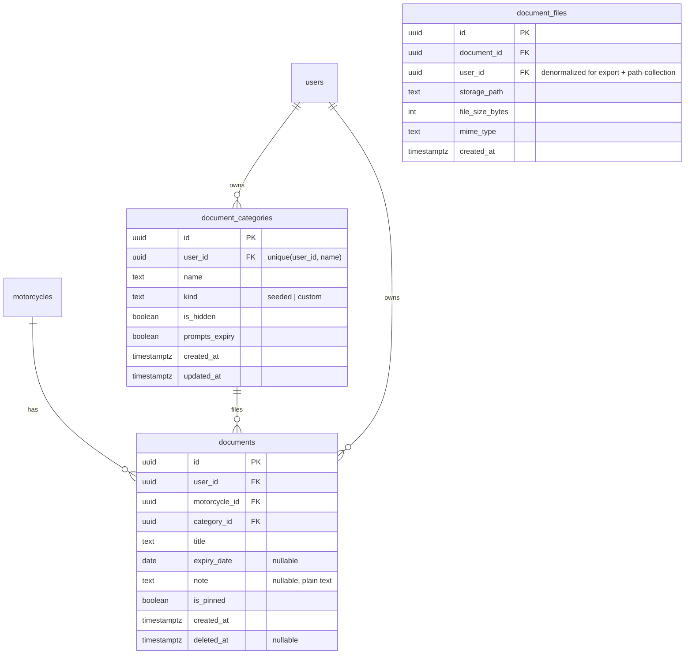
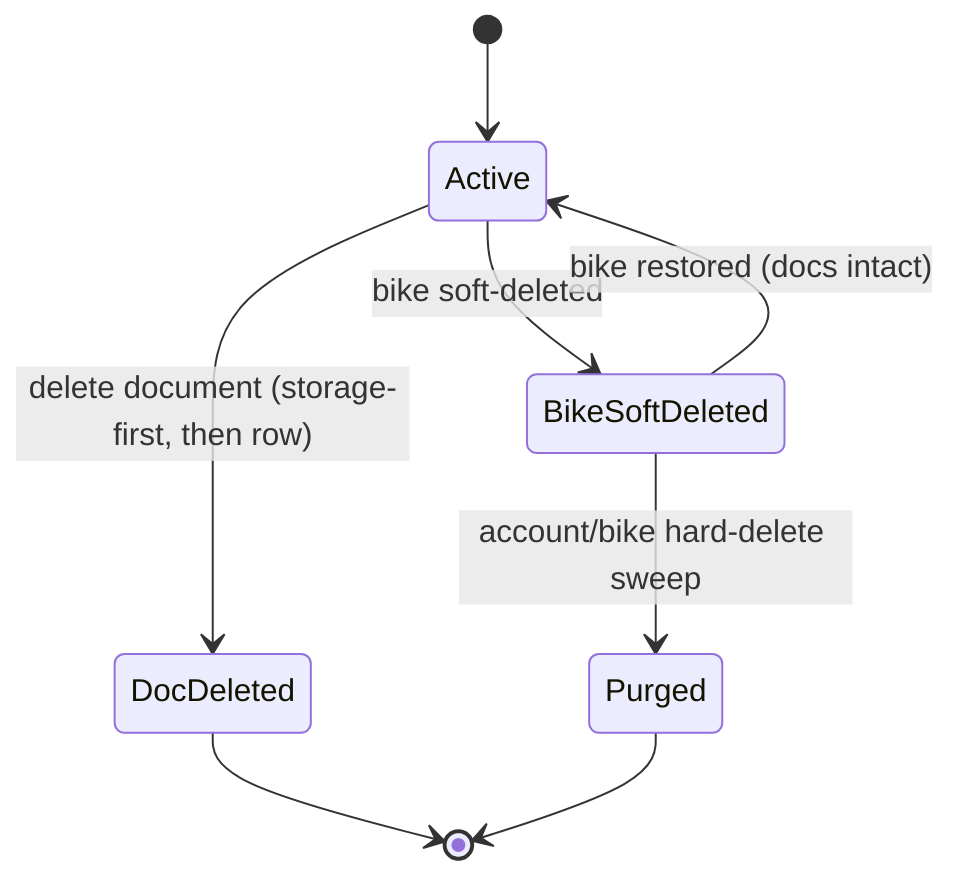
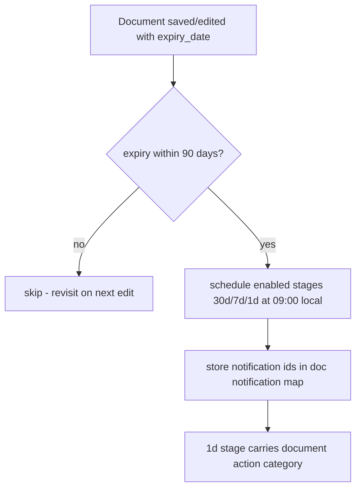

# feat: Bike Document Vault

## Summary

Add a per-bike document vault: riders store photos and PDFs of insurance, registration, title, service records and the like, filed under hybrid seeded+custom categories. Documents carry an optional expiry date that drives renewal reminders and a garage expiry-alert surface, are reachable fast via pinning (online-only in v1), and live in a new **private** Supabase Storage bucket served by short-lived signed URLs. Work is sequenced foundation → API → mobile capture/view → reminders & alerts.

---

## Problem Frame

A rider's bike paperwork is scattered across email attachments, the camera roll, and drawers, and MotoVault has no home for the documents that prove ownership and keep the bike legal. The product already holds bike identity, mileage, maintenance, and expenses; documents are the missing layer. This is a hypothesis, not measured demand (see origin: adoption assumption) — the plan builds the full vault while flagging a cheap pre-launch validation as an operational recommendation.

Unlike the existing photo features (`expense_photos`, `maintenance_task_photos`), these are **PII-grade** artifacts (name, policy number, address, title) that cannot reuse the public-read photo buckets. The plan follows the private-bucket + read-time-signed-URL precedent (health reports, `user-exports`), not the public-URL photo pattern.

---

## Requirements

Plan requirements trace to the origin brainstorm. Origin R-IDs are cited in parentheses.

### Document model & capture
- R1. A document belongs to one bike, holds one or more files plus a title, and carries an optional expiry date and free-text note (origin R1, R3).
- R2. Capture supports images and PDFs; PDFs are stored byte-exact with no lossy re-compression (origin R2, R4).
- R3. A document holds up to 10 files; images capped at 5 MB, PDFs at 20 MB; limits enforced at the bucket (`file_size_limit`, `allowed_mime_types`) and application layers, sourced from shared constants (origin R2, R20).
- R4. The free-text note is stored and rendered as plain text (no markup interpreted) (origin FYI → adopted).

### Organization & categories
- R5. Eight seeded categories ship: Insurance, Registration, Title/Ownership, Inspection, Service Records, Manual, Warranty, Receipts (origin R6).
- R6. Each document is filed under exactly one category; riders can add, rename, and hide categories (seeded or custom) (origin R5, R7).
- R7. Hiding a category never loses its documents — they retain their category and remain reachable via a "show hidden" affordance (origin R8).

### Expiry & reminders
- R8. Renewal reminders key off a document's expiry date, independent of its category, so renaming or hiding a category never affects an existing reminder (origin R9).
- R9. Documents in expiry-bearing categories (Insurance, Registration, Inspection) prompt for an expiry date on add; a document saved without one is flagged "no reminder set" in the list (origin R3).
- R10. A document with an expiry date schedules renewal reminders ahead of it, reusing the maintenance-reminder cadence and budget discipline (origin R10).
- R11. Documents nearing or past expiry surface as alerts in the garage summary and as expiry status in the bike's Documents section (origin R11).

### Surfacing & retrieval
- R12. Each bike's detail screen has a Documents section listing documents grouped by category with counts and expiry status (origin R12).
- R13. A rider can view images and PDFs in-app via a native/sandboxed viewer with JavaScript execution disabled (origin R13).
- R14. A rider can pin documents for one-tap retrieval; retrieval is online-only in v1 (origin R14, R15).

### Privacy, security & lifecycle
- R15. Documents are private, accessible only to the owning rider, enforced by RLS that verifies both row ownership and motorcycle ownership (origin R16).
- R16. Documents are served only via short-lived signed URLs (≤60s display, ≤5min download); signed URLs are never persisted, and the public-URL pattern is never used (origin R19).
- R17. Storage paths are user-rooted (`{userId}/{motorcycleId}/{documentId}/{filename}`) so the folder-prefix Storage RLS protects every object (origin R21).
- R18. A soft-deleted bike's documents are retained and recoverable (filtered by the bike's `deleted_at`); storage purges only at hard delete — the account hard-delete sweep and a future bike hard-delete (origin R17, R22).
- R19. Document delete is storage-first (object then row); a reconciliation sweep (U13) removes objects orphaned by failed writes; no decrypted document bytes are persisted on-device in v1 (origin R18, R23).
- R20. Documents are included in the GDPR data export (origin R22).
- R21. Per-user vault storage is capped and uploads + signed-URL generation are rate-limited via the existing opt-in Redis-backed throttler (origin R24).
- R22. (Deferred — see Scope Boundaries.) The app has no iOS share extension today; share-extension intake is out of v1. If one ships later, it must verify an authenticated session before accepting a file (origin R2, R25).

---

## Key Technical Decisions

- **Private bucket + read-time signed URLs, modeled on health reports, not `expense_photos`.** The `documents` row stores only `storage_path`; the API mints a short-TTL signed URL per read. Mirrors `apps/api/src/modules/health-reports/health-reports.service.ts` and the `user-exports` private bucket (`supabase/migrations/00035_cron_hard_delete_and_exports_bucket.sql`). The public-URL pattern in `expense_photos` is deliberately not reused.
- **Sign via the per-request user client, not the admin client.** `SUPABASE_USER.storage.createSignedUrl(...)` respects Storage RLS, making RLS the real authorization gate (per `docs/solutions/security-issues/supabase-admin-client-on-public-queries.md`). The admin client is reserved for the system cleanup sweep and for delete defense-in-depth (server-side prefix re-check). This is **net-new**: `health-reports.service.ts` signs with the *admin* client, so there is no in-repo precedent for user-client signing against a private bucket. Treat as first-discovery — verify in the U0 spike and keep an admin-client fallback if the RLS-gated SELECT blocks legitimate owners.
- **RLS verifies motorcycle ownership, not just `user_id`.** Both the `documents` table policies and the Storage policies check `motorcycle_id IN (SELECT id FROM motorcycles WHERE user_id = auth.uid() AND deleted_at IS NULL)`, closing the IDOR class that bit expenses (`docs/solutions/security-issues/expense-rls-idor-motorcycle-ownership.md`).
- **"Follow the bike" = filter on parent `deleted_at`, not cascade.** `soft_delete_motorcycle` (`supabase/migrations/00027_soft_delete_rpc.sql`) only stamps the bike row. Document queries exclude documents whose bike is soft-deleted; documents are never stamped or purged on soft-delete, keeping restore lossless. Storage purge happens only in the hard-delete sweep.
- **New native deps → native release, not OTA.** `expo-document-picker` (file/PDF picking) and `react-native-pdf` + `react-native-blob-util` (JS-free sandboxed viewer satisfying R13) are new native modules requiring a dev/prebuild and an app-store release. react-native-pdf's RN 0.85 / Fabric support must be verified on a dev build before committing.
- **Byte-exact upload via the SDK 56 `File` API.** Read bytes with `new File(uri).bytes()` (returns a `Uint8Array`, matching the working `image-upload.ts` path and the Supabase upload signature) and upload with explicit `contentType` — never `readAsStringAsync` (throw-risk) or `fetch().arrayBuffer()` (Hermes 0-byte). PDFs are uploaded raw with no WebP conversion (the existing `image-upload.ts` path always compresses, so a new uploader is required).
- **Reminder scheduling mirrors `scheduleMaintenanceReminder`.** A new `scheduleDocumentExpiryReminder` reuses the 30/7/1 cadence and the ≤90-day window that keeps the app under the iOS 64-notification cap, with a separate notification-map keyspace and its own action category (no "Mark Done"). Source: `apps/mobile/src/lib/notifications.ts`.
- **Contract-first GraphQL.** Define resolver signatures + `.graphql` operations, run `pnpm generate`, and commit generated types before parallel API/mobile work. UUID args map to `String!` not `ID!`; import generated `*Document` types (per `docs/solutions/integration-issues/parallel-agent-graphql-contract-drift.md`).
- **New-field discipline across three layers.** Every new column is validated in the DB CHECK, the Zod schema, and the NestJS DTO; document-type and category-kind are `as const` objects with `z.enum(Object.values(...))`, never TS `enum` (per `docs/solutions/architecture/currency-preference-full-stack-implementation.md`).

---

## High-Level Technical Design

### Data model



A document is a parent row with 1..N `document_files` (R1's multi-file: front/back of a card). Seeded categories are materialized per user on first vault use so rename/hide are per-rider without forking global rows.

### Upload and retrieval data-flow

```mermaid
sequenceDiagram
  participant M as Mobile
  participant S as Supabase Storage (private)
  participant A as NestJS API
  participant D as Postgres (documents)
  M->>M: pick file(s) (expo-document-picker)
  M->>M: read bytes (File.bytes -> Uint8Array); generate docId (uuid v4)
  M->>S: upload to {userId}/{bikeId}/{docId}/file (RLS checks userId AND bike ownership)
  M->>A: CreateDocument(docId, title, categoryId, files[], expiryDate?)
  A->>A: verify bike + path ownership, row id == path docId; enforce limits
  A->>D: insert documents + document_files (user client, RLS)
  A-->>M: Document (no URL yet)
  M->>A: query Documents / open file
  A->>S: createSignedUrl(path, ttl) via user client (RLS)
  A-->>M: short-TTL signedUrl
  M->>M: download to cache, render (react-native-pdf), delete on unmount
```

### Deletion lifecycle



### Expiry-reminder scheduling



---

## Implementation Units

Sequenced in five phases. Each unit is independently landable; later phases depend on earlier foundations. Phase 0 is a go/no-go gate that must pass before Phase C native work begins.

### Phase 0 — Viewer feasibility gate

### U0. react-native-pdf go/no-go spike
- **Goal:** De-risk the viewer dependency before any Phase C native work is committed.
- **Requirements:** R13.
- **Dependencies:** none.
- **Files:** a throwaway dev-build branch; no plan files land from this unit.
- **Approach:** Add `react-native-pdf` + `react-native-blob-util` to a dev build and confirm a multi-page PDF renders under RN 0.85 / Fabric on both iOS and Android from a local `file://` URI. This gate exists because U8, U9, and U12 all depend on the in-app viewer. **The OS-handoff fallback (`expo-sharing`) is NOT an acceptable v1 outcome** — R13 requires a JS-free *in-app* viewer for untrusted PDFs; an external app with JS enabled violates that security intent. If the spike fails, the gate is "find an alternative JS-free in-app renderer or descope in-app viewing," not "ship OS handoff."
- **Test scenarios:** Test expectation: none — this is a spike. Exit criterion is a rendered multi-page PDF on both platforms on a dev build.
- **Verification:** A dev build renders a multi-page PDF in-app on iOS and Android, or the team has an explicit descope decision recorded before Phase C starts.

### Phase A — Data & storage foundation

### U1. Migration: documents schema, private bucket, RLS
- **Goal:** Create `documents`, `document_files`, `document_categories` tables; a private `documents` Storage bucket with MIME/size limits; and RLS on all of them.
- **Requirements:** R1, R3, R5, R6, R7, R15, R16, R17.
- **Dependencies:** none.
- **Files:** `supabase/migrations/00150_document_vault.sql` (latest on disk is `00149`; verify the next free number at write time).
- **Approach:** Mirror the private-bucket shape of `supabase/migrations/00035_cron_hard_delete_and_exports_bucket.sql` (`public=false`, `allowed_mime_types` = `['application/pdf','image/jpeg','image/png','image/webp']`, `file_size_limit`). Mirror folder-prefix Storage policies from `00003_rls_indexes_triggers_storage.sql`, but because the client uploads **before** the `documents` row exists, the Storage **INSERT** policy must itself verify bike ownership on the path: `(storage.foldername(name))[1] = auth.uid()::text AND (storage.foldername(name))[2] IN (SELECT id::text FROM motorcycles WHERE user_id = auth.uid() AND deleted_at IS NULL)`. The userId-only folder check is insufficient — it would let a user stage bytes under a `motorcycleId` they don't own. Table RLS on `documents`: `FOR ALL` with `user_id = auth.uid()` AND, for INSERT/UPDATE `WITH CHECK`, `motorcycle_id IN (SELECT id FROM motorcycles WHERE user_id = auth.uid() AND deleted_at IS NULL)`. `document_categories` RLS: `FOR ALL USING (user_id = auth.uid()) WITH CHECK (user_id = auth.uid())`, plus a `UNIQUE (user_id, name)` constraint (so per-user seeding is race-safe) and `created_at`/`updated_at`. `document_files` carries a denormalized `user_id` (for GDPR export and hard-delete path-collection) and `document_id` FK `ON DELETE CASCADE`. CHECK constraints for title and note length. Indexes on `(motorcycle_id)`, `(user_id)`, `(expiry_date)` for the garage aggregate.
- **Patterns to follow:** `00076_expense_photos.sql` (table+RLS shape), `00035` (private bucket), `00003` (folder-prefix storage RLS), `00082_fk_cascade_fixes.sql` (FK cascade conventions).
- **Test scenarios:**
  - Covers R15. A user can insert a document only for a bike they own; inserting against another user's `motorcycle_id` is rejected by RLS.
  - Covers R15. Selecting a document for a soft-deleted bike returns nothing through the documents query path.
  - Covers R17. A storage object written outside `{auth.uid()}/...` is rejected by the bucket policy.
  - Covers R15. A storage object written under another user's `motorcycleId` path segment is rejected by the bucket INSERT policy at upload time, before any `documents` row exists.
  - Covers R3. Uploading a `text/html` file or a 30 MB PDF is rejected by the bucket's `allowed_mime_types` / `file_size_limit`.
- **Verification:** Migration applies cleanly via `npx supabase db push`; RLS policies present on all three tables and the bucket; ownership-cross tests fail as expected.

### U2. Migration: extend hard-delete sweep + GDPR export coverage
- **Goal:** Ensure document storage objects and rows are purged at account hard-delete and included in GDPR export.
- **Requirements:** R18, R20.
- **Dependencies:** U1.
- **Files:** `supabase/migrations/00151_document_vault_deletion.sql`, `apps/api/src/modules/users/data-export.service.ts`.
- **Approach:** Read the **live** `hard_delete_expired_accounts()` body from `00033_account_deletion.sql` first and `CREATE OR REPLACE` it preserving every existing bucket (`bike-photos`, `diagnostic-photos`, `user-exports`) and adding `'documents'` — do not author the list from memory or drop existing buckets. **Ordering matters:** the FK cascade from `auth.users` deletes `documents`/`document_files` rows, so the sweep must collect the user's `document_files.storage_path` values (now keyed by the denormalized `user_id`) and remove the storage objects **before** `DELETE FROM auth.users`, not after. Add a `documents` (+ `document_files`) export to `compileAndSendExport()` via the `byUserId` helper — this works now that `document_files` carries `user_id` (U1). Signature unchanged, so `CREATE OR REPLACE` is safe (no `DROP FUNCTION`).
- **Patterns to follow:** `00033_account_deletion.sql` (read the live body), `data-export.service.ts` table-export list.
- **Test scenarios:**
  - Covers R18. After a hard-delete sweep, no `storage.objects` rows remain under the `documents` bucket for that user — and the pre-existing buckets (`bike-photos`, `diagnostic-photos`, `user-exports`) are still swept (assert the post-replace bucket set).
  - Covers R18. Storage paths are collected and objects removed before the `auth.users` cascade fires (no orphaned objects left behind by the FK delete).
  - Covers R20. The GDPR export payload contains the user's documents and file metadata.
- **Verification:** Sweep removes document objects for an expired test account with no regression to existing buckets; export JSON includes the documents key.

### U3. Shared types, Zod schemas, and constants
- **Goal:** Add `documents` DB types and the validation/constants layer.
- **Requirements:** R1, R3, R5, R9.
- **Dependencies:** U1 (after `pnpm generate:types`).
- **Files:** `packages/types/src/validators/document.ts`, `packages/types/src/constants/document-limits.ts`, `packages/types/src/index.ts` (export), `packages/types/src/database.types.ts` (regenerated — do not hand-edit).
- **Approach:** After `npx supabase db push`, run `pnpm generate:types`. Add Zod schemas (`CreateDocumentSchema`, `UpdateDocumentSchema`, `AddDocumentCategorySchema`) exporting both schema and inferred type. Define `DOCUMENT_MIME_ALLOWLIST`, `MAX_FILES_PER_DOCUMENT = 10`, `MAX_PDF_BYTES`, `MAX_IMAGE_BYTES`, `MAX_VAULT_BYTES_PER_USER`, `SEEDED_CATEGORIES`, and `EXPIRY_BEARING_CATEGORIES` as `as const`; derive enums via `z.enum(Object.values(...))`.
- **Patterns to follow:** `packages/types/src/validators/expense.ts` (schema+type export), currency-preference learning (three-layer validation, `as const` over `enum`).
- **Test scenarios:**
  - Covers R3. `CreateDocumentSchema` rejects a files array longer than 10 and an unknown MIME type.
  - `CreateDocumentSchema` strips no recognized keys (parity with DB CHECK + DTO).
- **Verification:** `pnpm typecheck` passes; schemas reject the boundary cases above.

### Phase B — API

### U4. Documents NestJS module (CRUD, signed URLs, throttling)
- **Goal:** Expose document create/list/update/delete with read-time signed URLs and rate limiting.
- **Requirements:** R1, R2, R3, R13, R14, R16, R19, R21.
- **Dependencies:** U1, U3.
- **Files:** `apps/api/src/modules/documents/documents.module.ts`, `models/document.model.ts`, `models/document-file.model.ts`, `dto/create-document.input.ts`, `dto/update-document.input.ts`, `documents.service.ts`, `documents.resolver.ts`, `document.loader.ts`, `apps/api/src/app.module.ts` (register).
- **Approach:** Request-scoped resolver (`Scope.REQUEST`) with `ZodValidationPipe` + `ParseUUIDPipe`. The client supplies the `documentId` (it generated the upload path with it); `CreateDocument` enforces that the row id equals the path's `documentId` segment and that `storage_path` matches `${userId}/${motorcycleId}/${documentId}/`, and verifies bike ownership. Service uses the **user client** for CRUD and for `createSignedUrl` (short TTL from a constant). Signing is exposed as an **explicit `getDocumentSignedUrl` query**, not a passive `@ResolveField` — field resolvers are awkward to throttle and would mint a URL per file per list render. `@Throttle` the `createDocument` mutation and the `getDocumentSignedUrl` query (the API throttler is opt-in per resolver — there is no global guard). Signed URLs are never persisted and are redacted from slow-resolver/error logs (confirm HTTPS-only in non-local envs). Quota is enforced on create; because bytes are uploaded before the row, an over-quota `CreateDocument` rejects **and** deletes the already-uploaded objects (compensating control). Delete is storage-first via the admin client (defense-in-depth prefix re-check) then row delete. Always destructure and log Supabase `error`.
- **Patterns to follow:** `apps/api/src/modules/expenses/{expenses.service.ts,expenses.resolver.ts,expense-photos.loader.ts}` (module shape, prefix enforcement, delete defense-in-depth), `apps/api/src/modules/health-reports/health-reports.service.ts` (read-time signed URLs), Redis throttler from the backend-hardening learning.
- **Test scenarios:**
  - Covers R16. `getDocumentSignedUrl` mints a short-TTL URL via the user client; a non-owner's request is denied at the Storage SELECT policy; the URL is never written to the row.
  - Covers R15. Creating a document for a non-owned bike is rejected; a `documentId` that doesn't match the storage path's docId segment is rejected; listing returns only the caller's documents.
  - Covers R19. Delete removes the storage object before the row; if object delete fails, the row remains for retry.
  - Covers R3/R21. Exceeding 10 files or an oversized file is rejected; an over-quota create rejects AND deletes the already-uploaded objects (no quota bypass via direct upload).
  - Covers R21. Burst `createDocument` / `getDocumentSignedUrl` requests beyond the throttle limit are rejected.
  - Integration: creating a document with two files returns a `Document` whose `files` resolve via the loader without N+1.
- **Verification:** `pnpm test` for the module passes; manual GraphQL create→list→sign→delete round-trip works against a private bucket.

### U5. Document categories (seeded + CRUD)
- **Goal:** Seed the eight categories per rider and support add/rename/hide.
- **Requirements:** R5, R6, R7, R8.
- **Dependencies:** U1, U3, U4.
- **Files:** `apps/api/src/modules/documents/categories.service.ts`, `dto/add-document-category.input.ts`, `dto/update-document-category.input.ts`, resolver additions in `documents.resolver.ts`, `models/document-category.model.ts`.
- **Approach:** Materialize `SEEDED_CATEGORIES` for a user on first vault access (idempotent upsert). Mutations to add, rename, and hide; hide sets `is_hidden=true` without touching documents' `category_id`. Reminders are unaffected by category mutations (they key off `documents.expiry_date`).
- **Patterns to follow:** documents module shape from U4; `as const` seeded list from U3.
- **Test scenarios:**
  - Covers R7. Hiding a category leaves its documents' `category_id` intact and they remain queryable.
  - Covers R8. Renaming a category does not alter or cancel any scheduled reminder (reminder keys off expiry date, asserted at the mobile layer in U11).
  - Covers R6. Renaming or hiding a `category_id` owned by a different user is rejected by RLS.
  - Seeding is idempotent — the `UNIQUE (user_id, name)` constraint makes concurrent first-access seeding race-safe; calling the seed path twice yields one set.
- **Verification:** Category CRUD round-trips; hidden categories excluded from the default grouped list but returned under a `includeHidden` flag.

### U6. Motorcycle.documents field + garage expiring-documents query
- **Goal:** Expose documents under a bike and an aggregate of soon-expiring documents across bikes.
- **Requirements:** R11, R12.
- **Dependencies:** U4.
- **Files:** `apps/api/src/modules/motorcycles/motorcycles.resolver.ts` (or documents resolver), `documents.service.ts` (aggregate query), `apps/api/src/modules/documents/document.loader.ts`.
- **Approach:** Add a `@ResolveField('documents')` (or a `documentsByMotorcycle` query) backed by the DataLoader, excluding documents whose bike is soft-deleted. Add an `expiringDocuments` query returning documents with `expiry_date` within a window across the rider's active bikes, ordered by date — backing the garage alert surface.
- **Patterns to follow:** `expenses.resolver.ts` `@ResolveField('photos')`; avoid PostgREST embedded joins (separate batched query) per the widget-sync learning.
- **Test scenarios:**
  - Covers R11. `expiringDocuments` returns only documents within the window for active (non-soft-deleted) bikes, sorted ascending by expiry.
  - Covers R12. A bike's `documents` resolve grouped/orderable by category without N+1.
- **Verification:** Queries return correct sets; loader batches.

### Phase C — Mobile capture & view

### U7. Document upload library (picker + byte-exact upload)
- **Goal:** Pick images/PDFs and upload raw bytes to the private bucket.
- **Requirements:** R2, R17.
- **Dependencies:** U1; adds native deps (requires a new dev build).
- **Files:** `apps/mobile/src/lib/document-upload.ts`, `apps/mobile/package.json` (add `expo-document-picker`), `apps/mobile/app.config.*` (plugin/prebuild if needed).
- **Approach:** `DocumentPicker.getDocumentAsync({ type: ['application/pdf','image/*'], multiple: true, copyToCacheDirectory: true })`. Generate the `documentId` (uuid v4) client-side so the upload path is known before the row exists. Read bytes via `new File(uri).bytes()` (SDK 56 `File` API → `Uint8Array`), upload to `{userId}/{motorcycleId}/{documentId}/{filename}` with explicit `contentType`, no compression. Return `{ documentId, storagePath, fileSizeBytes, mimeType }` for the create mutation. (Share-extension intake is deferred — see R22 / Scope Boundaries.)
- **Patterns to follow:** `apps/mobile/src/lib/image-upload.ts` byte-read approach (use the new `File` API, not `readAsStringAsync`/`fetch`); never reuse the WebP compression path for PDFs.
- **Test scenarios:**
  - Covers R2. A picked PDF uploads byte-identical (size matches source; re-download opens as a valid PDF).
  - Covers R17. Upload targets a path rooted at the current user id.
  - Cancelling the picker leaves no partial state.
- **Verification:** Upload of a multi-page PDF and an image both succeed against the private bucket on a dev build.

### U8. In-app PDF/image viewer
- **Goal:** View a document's file(s) full-screen in-app with JS disabled.
- **Requirements:** R1, R13, R19.
- **Dependencies:** U0 (viewer go/no-go gate must have passed), U4 (signed URLs); adds native deps.
- **Files:** `apps/mobile/src/components/documents/document-viewer.tsx`, `apps/mobile/package.json` (add `react-native-pdf`, `react-native-blob-util`).
- **Approach:** A document has 1..N files, so the viewer is a horizontal swipe gallery with a `1 of N` counter (no chrome for single-file docs). On open, fetch signed URLs for all files (within the TTL window starting at open), download each to a local cache file, render PDFs with `react-native-pdf` (`source.uri` = local `file://`, `trustAllCerts:false`) and images with the existing image component. Re-fetch a URL on demand if its TTL lapses before the user swipes to it. Delete all cached files on unmount; no decrypted bytes persisted beyond the session.
- **Patterns to follow:** framework research (download-to-local-then-render); palette colors; `borderCurve: 'continuous'`.
- **Test scenarios:**
  - Covers R13. A PDF opens full-screen in-app and paginates; no webview/JS surface is used.
  - Covers R1. A two-file document opens as a swipe gallery showing "1 of 2"; a single-file document shows no navigation chrome.
  - Covers R19. All cached files are removed on unmount.
  - A signed URL that has expired triggers a re-fetch rather than a broken view.
- **Verification:** Multi-page PDF and image both render on a dev build on iOS and Android.

### U9. Documents section on the bike detail screen
- **Goal:** Browse, add, edit, delete, and pin documents per bike with full interaction states.
- **Requirements:** R1, R4, R7, R9, R11, R12, R14.
- **Dependencies:** U4, U5, U6, U7, U8.
- **Files:** `apps/mobile/src/components/bike-hub/documents-section.tsx`, `apps/mobile/src/app/(tabs)/(garage)/add-document.tsx`, `apps/mobile/src/app/(tabs)/(garage)/document/[id].tsx`, `apps/mobile/src/app/(tabs)/(garage)/_layout.tsx` (routes), `apps/mobile/src/app/(tabs)/(garage)/bike/[id].tsx` (mount section), `.graphql` operations under `apps/mobile/src/graphql/`, i18n `en` strings.
- **Approach:** Collapsible section mirroring `expenses-section.tsx`, grouped by category with counts and expiry status (badge for near/expired, "no reminder set" flag per R9). A **Pinned subsection sits at the top** of the section (rendered only when ≥1 document is pinned) — this is the roadside fast-retrieval surface. Add/edit/delete via a `fullScreenModal` (not `formSheet`, per the dark-modal preference). The add modal is a **file tray**: "Add files" opens the multi-select picker, picked files appear as dismissible chips with **per-file progress and a per-file retry on failure**; the control disables at the 10-file cap with a count label; the `documents` row is written only after **all** file uploads succeed (no phantom partial document). **Edit is metadata-only in v1** (title, category, expiry, note) — to change a file, delete and re-create (file replacement deferred). Destructive delete shows a system Alert naming the file count. The "show hidden categories" affordance lives only on the manage screen (U10), not inline. All copy via `t()`; colors from `palette`; expiry math via `date-fns`.
- **Patterns to follow:** `apps/mobile/src/components/bike-hub/expenses-section.tsx`, garage route conventions in `_layout.tsx`, TanStack Query + `gqlFetcher` + generated `@motovault/graphql` types.
- **Test scenarios:**
  - Covers R12. Documents render grouped by category with counts; empty state shows a clear add CTA.
  - Covers R9. A document in an expiry-bearing category saved without an expiry shows the "no reminder set" flag.
  - Covers R14. Pinning marks a document and surfaces it for fast retrieval.
  - Upload-in-progress shows a determinate/indeterminate state; a failed upload surfaces an error and does not create a phantom document.
  - Covers R7. A hidden category's documents are reachable via the show-hidden affordance.
- **Verification:** Add → view → edit → pin → delete round-trips on a dev build; states render per design.

### U10. Category management UI
- **Goal:** Add, rename, and hide categories from the mobile app.
- **Requirements:** R6, R7.
- **Dependencies:** U5, U9.
- **Files:** `apps/mobile/src/app/(tabs)/(garage)/manage-document-categories.tsx`, `.graphql` operations, i18n `en` strings.
- **Approach:** A management surface reached from a "Manage" button in the Documents section header — the single surface for rename/hide/unhide (no duplicate inline toggle in the section). Create inline during add (per origin F1) and standalone rename/hide here. Hidden categories appear at the bottom, de-emphasized, with an unhide affordance.
- **Patterns to follow:** garage modal route conventions; `fullScreenModal`.
- **Test scenarios:**
  - Covers R6. Creating a custom category makes it selectable on the add-document form.
  - Covers R7. Hiding a category removes it from the default grouped list but its documents remain reachable.
- **Verification:** Category CRUD reflects immediately in the add form and the grouped list.

### Phase D — Reminders & garage alerts

### U11. Document expiry reminders
- **Goal:** Schedule and manage renewal reminders from document expiry dates.
- **Requirements:** R8, R10.
- **Dependencies:** U9.
- **Files:** `apps/mobile/src/lib/notifications.ts` (new `scheduleDocumentExpiryReminder`, `cancelDocumentNotification`, document action category, map keyspace), `apps/mobile/src/app/_layout.tsx` (response listener branch), scheduling call sites in `add-document.tsx` / `document/[id].tsx`.
- **Approach:** Mirror `scheduleMaintenanceReminder`: 30/7/1 stages at 09:00 local, skip past stages, bail when `daysUntilDue` is `<0` or `>90` (iOS 64-budget guard). Use a separate notification-map keyspace (e.g. `doc:` id prefix) and a `DOCUMENT_EXPIRY` action category (no "Mark Done"; e.g. "View" / "Snooze"). Reschedule on expiry-date edit; cancel on delete. Reminders key off `expiry_date` only, so category rename/hide never affects them (asserts R8).
- **Patterns to follow:** `apps/mobile/src/lib/notifications.ts` (`scheduleMaintenanceReminder`, `STAGE_COPY` dispatch table, notification map), `_layout.tsx` response listener.
- **Test scenarios:**
  - Covers R10. A document with an expiry 20 days out schedules the 7d and 1d stages; one 200 days out schedules nothing (outside the 90-day window).
  - Covers R8. Renaming the document's category leaves its scheduled notification ids unchanged.
  - Editing the expiry date cancels and reschedules; deleting the document cancels its notifications.
- **Verification:** Scheduled notification ids appear in the document map; tapping a reminder routes to the document.

### U12. Garage expiry-alert surface
- **Goal:** Surface soon-expiring documents in the garage summary.
- **Requirements:** R11.
- **Dependencies:** U6.
- **Files:** `apps/mobile/src/app/(tabs)/(garage)/index.tsx`, a garage-alerts component, `.graphql` query for `expiringDocuments`, i18n `en` strings.
- **Approach:** Query `expiringDocuments`, render as its own `ECard` with an `ESectionMasthead` label inserted **between the bike carousel and the "By the Numbers" stats block** (net-new — no garage alert surface exists today). Rendered only when ≥1 document is expiring (no empty-state card). Tapping an alert **deep-links to the document** — the add-renewal shortcut is deferred to keep v1 scope tight.
- **Patterns to follow:** garage index editorial components (`ECard`, `ESectionMasthead`); `date-fns` for windows; `palette`.
- **Test scenarios:**
  - Covers R11. A document expiring in 12 days appears in the garage alert list; one expiring in 200 days does not.
  - Documents on soft-deleted bikes do not appear.
- **Verification:** Alerts render and deep-link correctly on a dev build.

### U13. Orphaned-object reconciliation sweep
- **Goal:** Remove storage objects left behind when an upload succeeds but `CreateDocument` never lands.
- **Requirements:** R19.
- **Dependencies:** U1, U4. Can land any time after the bucket and create path exist.
- **Files:** a new migration adding a `pg_cron` job (mirror the daily-job pattern in `supabase/migrations/00035_cron_hard_delete_and_exports_bucket.sql`), or an API cron handler.
- **Approach:** Because the client uploads bytes before the row exists (see High-Level Technical Design), a failed `CreateDocument` orphans the object. The sweep, running as **service-role**, lists objects under the `documents` bucket with **no matching `document_files` row** and older than a **grace window** (e.g. >1 hour, so it never races an in-flight upload), scoped per user prefix so it can only touch objects under a valid `{userId}/…` path, and **logs every deletion** with a `.catch()` on the fire-and-forget log write. Reconciles both directions per the orphan-cleanup learning (`docs/solutions/ui-bugs/stuck-processing-diagnostics-infinite-spinner.md`).
- **Test scenarios:**
  - Covers R19. An object with no `document_files` row older than the grace window is deleted.
  - Covers R19. An object uploaded within the grace window (mid-flight) is NOT deleted.
  - The sweep never deletes an object that has a matching `document_files` row.
- **Verification:** A deliberately-orphaned object is purged after the grace window; a fresh upload-in-progress survives a sweep run.

---

## Acceptance Examples

Carried from origin; each maps to test scenarios above.

- AE1. Category rename doesn't break reminders. Given an Insurance document with an expiry and a scheduled reminder, when the rider renames "Insurance" to "Cover", the reminder still fires. **Covers R8** (U5, U11 tests).
- AE2. Expiry surfaces as a garage alert. Given a document expiring in 12 days, the garage summary lists it as expiring soon. **Covers R11** (U6, U12 tests).
- AE3. Hiding a category preserves its documents. Given a custom category with two documents, hiding it keeps both reachable. **Covers R7** (U5, U9 tests).
- AE4. Emailed PDF stays a PDF. Given an insurance PDF, after storing it the rider opens the original readable PDF, not a downscaled image. **Covers R2, R13** (U7, U8 tests).

---

## Scope Boundaries

**Deferred for later** (origin)
- Encrypted on-device caching of pinned documents for zero-signal offline retrieval.
- One-tap share/export "hand-over pack".
- Auto-linking documents to expense entries.
- OCR auto-extraction of expiry dates.

**Out of scope** (origin)
- Multi-bike / multi-user (fleet) document sharing.
- More than one category per document.

**Deferred to follow-up work** (plan-local)
- Share-extension intake (origin R25 / plan R22) — the app has no share extension today; ships only if/when that native target is built, with its auth gate.
- File replacement on document edit — v1 edit is metadata-only; changing a file means delete + re-create.
- Add-renewal shortcut from a garage expiry alert — v1 deep-links to the document only.
- Adding the long-missing `maintenance-photos` bucket to the hard-delete sweep — a real pre-existing GDPR gap, but a separate change with its own (public-read) bucket semantics; track as a standalone fix, not bundled into U2.
- A web vault view — if it ever ships, the plain-text note (R4) needs a web rendering constraint re-confirmed.

---

## Risks & Dependencies

- **Native release, not OTA (high).** `expo-document-picker`, `react-native-pdf`, `react-native-blob-util` are new native modules — the feature requires a new dev/prebuild and an app-store release; it cannot reach existing builds via EAS Update. Plan the release accordingly.
- **react-native-pdf on RN 0.85 / Fabric (high — gated by U0).** U8, U9, and U12 all depend on the in-app viewer, so this is verified first in the U0 go/no-go spike before any Phase C native work. The `expo-sharing` OS-handoff fallback is **not** an acceptable v1 outcome — it opens untrusted PDFs in an external app with JS enabled, violating R13's security intent. If U0 fails, the decision is "find another JS-free in-app renderer or descope in-app viewing," recorded before Phase C.
- **iOS 64-notification budget shared with maintenance reminders (medium).** Document expiry reminders compete for the same pending-notification budget; the ≤90-day window mitigates but heavy users with many bikes/documents could still saturate. Monitor; the budget has no captured mitigation pattern beyond the window.
- **Signed-URL revocation (low).** Supabase signed URLs are not self-service revocable; short TTLs (R16) are the mitigation.
- **First Storage feature in the repo (medium).** No institutional learning exists for buckets/signed-URLs/folder-prefix RLS, expo byte-reads, or the GDPR sweep — treat U1, U2, U7 as first-discovery and capture findings via `/ce-compound` after they land.
- **Dependency:** `pnpm generate` (schema → client types) must run and generated types committed before parallel API/mobile work (contract-drift learning).

---

## System-Wide Impact

- **Storage & cost:** a new private bucket holding PII; per-user quota (R21) bounds growth. Storage RLS is separate from table RLS and must be maintained in lockstep.
- **Account deletion / GDPR:** U2 changes a `SECURITY DEFINER` sweep RPC and the export payload — both are compliance-critical paths; verify on a test account.
- **Auth boundary:** all reads RLS-gated via the user client; admin client used only for the system sweep and storage-delete defense-in-depth.
- **Notifications:** shares the device notification budget with maintenance reminders.

---

## Open Questions

**Resolve before / during implementation**
- Exact next migration sequence numbers (`00150`/`00151` assume `00149` is latest — confirm against `supabase/migrations/` at write time).
- Whether seeded categories are materialized per user (assumed) or kept global with per-user override rows — confirm against how onboarding seeds other per-user defaults.

**Deferred to implementation**
- Final signed-URL TTL constants within the R16 ceilings (≤60s display, ≤5min download).
- GDPR export scope for documents: file bytes vs. metadata + storage paths only. Right-to-portability arguably wants the bytes; confirm what the export pipeline can carry.
- iOS notification-budget degrade path: with many bikes × expiry-bearing documents, maintenance + document reminders can approach the 64-pending cap even within the 90-day window. Decide a degrade rule (e.g. prioritize by soonest expiry, or collapse per-category) before it bites heavy users.

**Operational recommendation (carried from origin adoption assumption)**
- Run a cheap pre-launch probe of document-upload intent (e.g. a lightweight prompt measuring upload rate) before or alongside rollout; low upload rate is the falsification signal for the build bet.

---

## Sources & Research

- Origin requirements: `docs/brainstorms/2026-06-22-bike-document-vault-requirements.md`.
- Private bucket + read-time signed URLs: `apps/api/src/modules/health-reports/health-reports.service.ts`, `supabase/migrations/00035_cron_hard_delete_and_exports_bucket.sql`, `apps/api/src/modules/users/data-export.service.ts`.
- Closest entity precedent: `apps/api/src/modules/expenses/{expenses.service.ts,expenses.resolver.ts,expense-photos.loader.ts,models/expense-photo.model.ts}`, `supabase/migrations/00076_expense_photos.sql`.
- Storage RLS / folder-prefix: `supabase/migrations/00003_rls_indexes_triggers_storage.sql`; soft-delete RPC `00027_soft_delete_rpc.sql`; hard-delete sweep `00033_account_deletion.sql`; FK cascade `00082_fk_cascade_fixes.sql`.
- Reminders: `apps/mobile/src/lib/notifications.ts`, `apps/mobile/src/app/_layout.tsx`, `apps/mobile/src/app/(tabs)/(garage)/add-maintenance-task.tsx`, `supabase/migrations/00079_multi_stage_reminders.sql`.
- Mobile surfaces: `apps/mobile/src/components/bike-hub/expenses-section.tsx`, `apps/mobile/src/app/(tabs)/(garage)/{bike/[id].tsx,index.tsx,_layout.tsx}`, `apps/mobile/src/lib/image-upload.ts`.
- Codegen: `packages/graphql/codegen.ts`, `packages/types/src/validators/expense.ts`.
- Learnings: `docs/solutions/security-issues/expense-rls-idor-motorcycle-ownership.md` (IDOR), `docs/solutions/security-issues/supabase-admin-client-on-public-queries.md` (signing client), `docs/solutions/integration-issues/parallel-agent-graphql-contract-drift.md` (contract-first), `docs/solutions/architecture/currency-preference-full-stack-implementation.md` (three-layer validation), `docs/solutions/ui-bugs/stuck-processing-diagnostics-infinite-spinner.md` (orphan cleanup), `docs/solutions/runtime-errors/redis-backed-infra-and-backend-hardening.md` (throttling).
- External (version-cited): expo-document-picker (SDK 56) `getDocumentAsync`; expo-file-system `File` API (`arrayBuffer()`); react-native-pdf (+ react-native-blob-util) for JS-free in-app viewing; Supabase `createSignedUrl` TTL semantics + private-bucket `allowed_mime_types`/`file_size_limit`.
