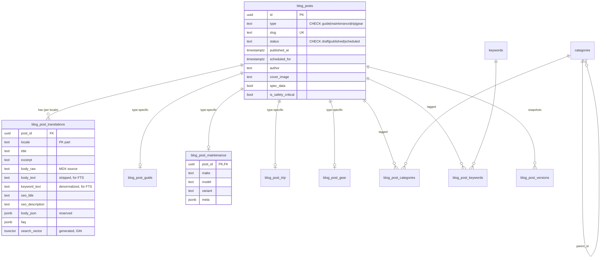
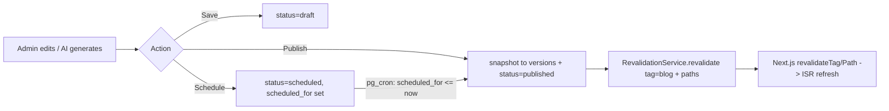

# feat: Extensible Blog CMS on Postgres

**Origin:** `docs/brainstorms/2026-06-24-blog-cms-requirements.md` (carried forward as the source of truth for product behavior and scope).

---

## Summary

Replace the file-based MDX web blog with an extensible, Postgres-backed CMS that is the sole source of truth. Content is modeled with Class-Table Inheritance — a shared `blog_posts` base plus per-type tables (`guide`, `maintenance`, `trip`, `gear`), each with a `meta jsonb` overflow valve. First-class categories (hierarchical) and keywords (flat) drive browsing and search; Postgres full-text search (generated `tsvector` + GIN + `pg_trgm`) powers public reader search. Authoring happens two ways — an admin rich editor (NestJS GraphQL CRUD) and AI generation (the repointed maintenance generator) — both behind a `draft → published → scheduled` workflow with JSONB version snapshots. The 50 existing MDX files are imported and the file pipeline retired. Public web reads go directly against Supabase public-read RLS to preserve static generation.

---

## Problem Frame

The blog is 50 MDX files on disk (`apps/web/content/blog/**`), read synchronously by `apps/web/src/lib/blog.ts`. Every post is the same undifferentiated shape; there is no way to model distinct content types, no taxonomy beyond free-text frontmatter, no reader search, and authoring means committing files. The Africa Twin maintenance generator already strains the model by writing MDX files + triggering ISR as a workaround for the absence of a content store. We need a content platform where adding the next content type is a small, safe, well-trodden change.

---

## Requirements

Traceability back to the origin document's goals and success criteria.

- **R1** — Model multiple content types with type-specific fields sharing a common base, without per-type query/maintenance pain (origin: Goals).
- **R2** — Adding a new content type is a single migration + code registration; base queries and search are untouched (origin: Success criteria).
- **R3** — First-class categories (hierarchical, browsable) and keywords (flat tags) with M2M relationships (origin: Goals).
- **R4** — Public full-text reader search across title/excerpt/body/keywords, filterable by type/category/keyword, with typo tolerance on titles (origin: Resolved decisions — search).
- **R5** — Two authoring paths: admin rich editor + AI-generated drafts, both feeding `draft / published / scheduled` with revision history (origin: Goals).
- **R6** — Preserve all current SEO behavior: canonical/hreflang, Article/FAQPage/Breadcrumb structured data, sitemap, RSS, the `specData` disclaimer (origin: Goals).
- **R7** — Postgres is the sole source of truth; import the 50 MDX files; delete the file pipeline (origin: Outcome).
- **R8** — Web blog pages remain statically generatable (build-time + ISR), not forced dynamic (origin: Dependencies; learning: Next 16 PPR/next-intl).
- **R9** — Body stored as MDX (`raw`) + cached `rendered_html` + reserved `body_json`; rendered via `compileMDX` with `blockJS: true` (origin: Resolved decisions — body format).
- **R10** — i18n via per-entity translations for the 5 existing locales (en, es, de, fr, it); hreflang derived from existing translations (origin: Resolved decisions — locales).
- **R11** — Repoint the AI maintenance generator to write a `blog_posts` row (preserving surgical spec-table replacement) instead of an MDX file (origin: Outcome).

---

## Key Technical Decisions

- **KTD1 — Content model: Class-Table Inheritance + JSONB overflow.** Base `blog_posts` table holds shared structured fields; per-type tables (`blog_post_guide/maintenance/trip/gear`) hold only type-specific columns + a `meta jsonb` valve for zero-migration field additions. Rejected STI (NULL-heavy, no enforcement past ~3 diverging types) and EAV/dynamic schema (the WordPress `postmeta` trap; also a brainstorm non-goal). Validated by research against Payload CMS.
- **KTD2 — Enum-like columns are `TEXT ... CHECK (col IN (...))`, not Postgres `ENUM` types.** Matches the repo's newer convention (00149/00150) — extensible via `DROP/ADD CONSTRAINT`. Applies to `type` and `status`.
- **KTD3 — GraphQL polymorphism via a single `BlogPost` ObjectType + `typeData: JSON`.** The per-type table's columns are surfaced as a JSON field (mirroring the existing `Article.contentJson` + `GraphQLJSON` pattern), validated by per-type Zod schemas in `@motovault/types`. Avoids introducing the repo's first `@InterfaceType`/`createUnionType` (net-new pattern, `resolveType` ceremony). DB-level type safety is preserved by CTI; TS-level safety by the Zod schemas. *(Confirmed call-out, 2026-06-24.)* Interface/union recorded under Alternatives.
- **KTD4 — Split read paths.** Public web reads go **directly** against Supabase using the **anon/user client** with public-read RLS + an explicit `status = 'published'` filter as defense-in-depth (learning: `supabase-admin-client-on-public-queries.md`). This keeps blog pages statically generatable with no API dependency at web build time. Admin CRUD goes through NestJS GraphQL with an `assertAdmin` service check. A public GraphQL read layer for mobile is deferred (schema designed to allow it).
- **KTD5 — Search: Postgres FTS + `pg_trgm`.** Generated stored `search_vector` on `blog_post_translations` weighting `title` A / `excerpt` B / `keyword_text` C / `body_text` D, where `keyword_text` is a denormalized concatenation of assigned-keyword names maintained on write (and by a keyword-change trigger) — this is required because a generated column cannot reference the `blog_post_keywords` join table, and R4 demands keyword matches resolve. The `to_tsvector` config is chosen **per locale** via an immutable `CASE locale` map (en→`english`, es→`spanish`, de→`german`, fr→`french`, it→`italian`, else `simple`), so the column stays generated while stemming each locale correctly. GIN index on `search_vector`; typo tolerance via a `pg_trgm` trigram index on `title`, exposed through a `SECURITY DEFINER` RPC with `SET search_path = 'public'` (learning: `typeahead-word-similarity-not-found.md`). `body_text`/`keyword_text` are MDX/JSX-stripped plain text so tags never pollute the index. Meilisearch upgrade path deferred.
- **KTD6 — Scheduled publishing via pg_cron**, not `@nestjs/schedule` (not installed; repo convention is pg_cron — 00152). A `SECURITY DEFINER` function flips `scheduled → published` when `scheduled_for <= now()`; it (and every publish) triggers revalidation. *(Confirmed call-out.)*
- **KTD7 — Versioning: full JSONB snapshot on publish** into `blog_post_versions` (base + type + translations), admin-only RLS. Snapshot-on-publish, not on every save.
- **KTD8 — Revalidation reuses `RevalidationService`** (`apps/api/src/common/revalidation/`) + a new `blog` entry in `CACHE_TAGS` (`packages/types/src/constants/cache-tags.ts`). ISR + on-demand `revalidateTag`/`revalidatePath`; no PPR/`cacheComponents` (learning: `nextjs16-ppr-cache-components-next-intl-incompatibility.md`).
- **KTD9 — RLS at table-creation time.** `blog_posts`: public-read `USING (status='published')`; admin `ALL USING (is_admin()) WITH CHECK (is_admin())` — the 00003 article template it mirrors omits `WITH CHECK`, so add it explicitly (split INSERT/UPDATE if clearer). Child tables (`blog_post_translations`, per-type tables, join tables): public-read `USING (post_id IN (SELECT id FROM blog_posts WHERE status='published'))` so drafts/scheduled content can't be read directly via the REST API; admin `ALL` with `WITH CHECK`. `blog_post_versions` is deny-all to public (learning: `monorepo-code-review-multi-category-fixes.md`).
- **KTD10 — Locales: 5 (en, es, de, fr, it)**, matching the current blog `ALLOWED_LOCALES`. The 8-locale site routing keeps its en-fallback. Taxonomy-name localization deferred.
- **KTD11 — No `rendered_html` cache; render at request time.** The body renders from `body_raw` via `compileMDX` (`blockJS:true`) wrapped in `unstable_cache(tag:'blog')`. A cached `rendered_html` column was rejected: it goes stale when `body_raw` is edited without re-publishing, and a pg_cron (SQL) publish cannot run the MDX compiler to refresh it. Cache freshness rides the existing `blog` revalidation tag (KTD8). Only `body_text`/`keyword_text` (plain text for FTS) are computed on write. The pg_cron publish function and `publishBlogPost` both write the version snapshot in **SQL** from existing columns — no MDX compile needed — so the scheduled and manual publish paths stay equivalent.
- **KTD12 — Editor: markdown *source* editor, not WYSIWYG.** Bodies are MDX with JSX components and `<!-- SPEC_TABLES_* -->` markers; a WYSIWYG that re-serializes would corrupt `body_raw`. Use a CodeMirror 6 markdown editor (`@uiw/react-codemirror` + markdown extension) with a live rendered preview pane — editing the source directly is lossless round-trip. Resolves the brainstorm's deferred editor question.

---

## High-Level Technical Design

### Data model (ERD)



### Publish / revalidate flow



---

## Output Structure

New/changed surfaces (per-unit `Files` are authoritative):

```text
supabase/migrations/
  00154_blog_cms.sql                     # U1
apps/api/src/modules/blog/
  blog.module.ts                         # U4
  blog.service.ts                        # U4/U5
  blog.resolver.ts                       # U4/U5
  models/blog-post.model.ts              # U4
  models/blog-post-connection.model.ts   # U4
  dto/*.input.ts                         # U4/U5
apps/web/src/graphql/{queries,mutations}/*.graphql   # U6
apps/web/src/lib/blog.ts                 # U7 (rewrite)
apps/web/src/lib/supabase-blog.ts        # U7 (anon reader)
apps/web/scripts/migrate-blog-to-db.ts   # U3
apps/web/src/app/admin/blog/             # U9
packages/types/src/validators/blog-*.ts  # U2
```

---

## Implementation Units

### U1. Database migration — schema, taxonomy, FTS, RLS, scheduled-publish

**Goal:** Create the full CMS schema in one migration.
**Requirements:** R1, R2, R3, R4, R5, R6, R9, R10; KTD1, KTD2, KTD5, KTD6, KTD7, KTD9, KTD11.
**Dependencies:** none.
**Files:** `supabase/migrations/00154_blog_cms.sql` (confirm next number with `ls supabase/migrations | tail` — currently 00153).
**Approach:**
- `blog_posts` base (incl. `author text` — origin shared field, mapped from frontmatter on import) + per-type tables (`blog_post_guide/maintenance/trip/gear`, each `post_id` PK FK `ON DELETE CASCADE` + typed columns + `meta jsonb`).
- `blog_post_translations` (PK `(post_id, locale)`) with `body_raw`, `body_text`, `keyword_text`, `seo_title`, `seo_description`, `body_json`, `faq jsonb`, and a **generated** `search_vector` = `setweight(to_tsvector(<locale-config>, title),'A') || setweight(..excerpt,'B') || setweight(..keyword_text,'C') || setweight(..body_text,'D')`, where `<locale-config>` is an immutable `CASE locale` → `regconfig` map (KTD5). GIN index on `search_vector`; `pg_trgm` GIN index on `title`. `keyword_text` maintained on write + by a trigger on `blog_post_keywords` changes.
- `categories` (self-ref `parent_id`), `keywords`, join tables `blog_post_categories` (`is_primary`), `blog_post_keywords`.
- `blog_post_versions` (`snapshot jsonb`, `version_num`, `created_by`, `created_at`).
- `type`/`status` as `TEXT ... CHECK (... IN ...)`. Reuse `public.update_updated_at()` trigger.
- RLS per KTD9: `blog_posts` public-read `USING (status='published')` + admin `ALL USING(is_admin()) WITH CHECK(is_admin())`; **every child table** (translations, per-type, join tables) public-read gated on the parent being published via `post_id IN (SELECT id FROM blog_posts WHERE status='published')`; `categories`/`keywords` public-read all + admin-write; `blog_post_versions` deny-all to public.
- `search_blog_posts(query text, loc text)` `SECURITY DEFINER SET search_path='public'` RPC: combine `websearch_to_tsquery` rank + `word_similarity(title, query)` for typo tolerance + recency boost; returns ranked `post_id`s for published posts only. Guard input length (early-return when `char_length(query) > 200`) to bound trigram CPU on hostile input. `REVOKE ... FROM PUBLIC` then `GRANT EXECUTE TO anon, authenticated`.
- `publish_due_blog_posts()` `SECURITY DEFINER` function: for each due row, **write a `blog_post_versions` snapshot in SQL** (from existing columns — no MDX compile needed, so it matches `publishBlogPost`), flip `scheduled→published`, set `published_at` + `version_num`. Schedule `cron.schedule('publish-due-blog-posts','* * * * *', ...)`. `REVOKE EXECUTE ... FROM PUBLIC, anon, authenticated;` then `GRANT EXECUTE ... TO service_role;` (mirror 00152 exactly — without the REVOKE, anon could `POST /rpc/publish_due_blog_posts` and force-publish all scheduled posts).
- Header comment citing mirrored migrations (00002/00003 article+tsvector, 00150 table+RLS template, 00152 pg_cron). Wrap in `BEGIN; ... COMMIT;`.
**Patterns to follow:** `supabase/migrations/00002`/`00003` (articles tsvector + public-read/admin RLS), `00150_document_vault.sql` (table+RLS+trigger), `00152_document_orphan_reconciliation.sql` (pg_cron + SECURITY DEFINER grants), `00045_add_article_keywords.sql` (keyword/search infra).
**Test scenarios:**
- RLS: anon `SELECT` returns only `status='published'` rows from `blog_posts`; and **per child table** (translations, each per-type table, each join table) an anon `SELECT` of a row whose parent is `draft`/`scheduled` returns zero rows.
- RLS: non-admin INSERT/UPDATE on `blog_posts` is rejected by `WITH CHECK`; admin INSERT with `status='published'` succeeds.
- `blog_post_versions`: anon and authenticated-non-admin `SELECT` returns nothing.
- FTS: `search_blog_posts('oil change','en')` ranks an exact-title match above a body-only match; a misspelled `'oil chnge'` still returns the post (trigram); a term present **only as an assigned keyword** (not in title/excerpt/body) returns the post (keyword_text weight C).
- FTS language: a Spanish-locale row indexes with Spanish stemming (a query for a stemmed Spanish term matches its inflected form).
- Scheduled publish: a row with `status='scheduled'`, `scheduled_for` in the past is flipped to `published` by `publish_due_blog_posts()`; a future `scheduled_for` is untouched.
- `search_path`: the search RPC succeeds (no SQLSTATE 42883) — regression guard for the `word_similarity` learning.
**Verification:** Migration applies cleanly to a fresh DB and to prod-shaped data; `npx supabase db push` succeeds; the RLS/FTS/cron scenarios above pass against a local Supabase. Also document an "add a 5th type" worked example (a stub `blog_post_event` table only) confirming `search_blog_posts`, the admin list query, and the import script require **zero** changes — the R2 extensibility check.

---

### U2. Regenerate DB types + Zod schemas + constants

**Goal:** Make the new schema type-safe across packages.
**Requirements:** R1, R3, R9; KTD3.
**Dependencies:** U1.
**Files:** `packages/types/src/database.types.ts` (regenerated, do not hand-edit), `packages/types/src/constants/enums.ts` (add `BlogPostType`, `BlogPostStatus` `as const`), `packages/types/src/validators/blog-post.ts`, `packages/types/src/validators/blog-content-types.ts` (per-type `typeData` Zod schemas: guide/maintenance/trip/gear), `packages/types/src/validators/index.ts` (re-export).
**Approach:** Run `pnpm generate:types`. Add `as const` enum objects + `z.enum(Object.values(...))` schemas. Per-type `typeData` schemas mirror each per-type table's columns; export schema **and** inferred type for each. A discriminated union (`z.discriminatedUnion('type', ...)`) over `typeData` enables one parse entry point.
**Patterns to follow:** `packages/types/src/validators/article.ts`, `.../maintenance-narrative.ts` (shared API↔web contract), `constants/enums.ts`.
**Test scenarios:**
- Each per-type Zod schema accepts a valid `typeData` object and rejects one missing a required field / with a wrong-typed field.
- The discriminated union routes `{type:'gear', ...}` to the gear schema and rejects an unknown `type`.
**Verification:** `pnpm typecheck` passes repo-wide; new schemas exported from `@motovault/types`.

---

### U3. One-time MDX → Postgres import script

**Goal:** Populate the CMS from the 50 existing MDX files, idempotently.
**Requirements:** R7, R9, R10.
**Dependencies:** U1, U2.
**Files:** `apps/web/scripts/migrate-blog-to-db.ts`, `apps/web/scripts/__tests__/migrate-blog-to-db.test.ts`.
**Approach:** `gray-matter`-parse every file under `content/blog/{en,es,de,fr,it}/`. Map frontmatter → `blog_posts` (incl. `author`, `cover_image`, `spec_data`) + `blog_post_translations` (incl. `seo_title`/`seo_description` from the SEO frontmatter, `faq`) (+ per-type row; all legacy posts map to `type='guide'` unless a `dataset_models`/`specData` marker indicates `maintenance`). Derive `body_text` (strip MDX/JSX) and `keyword_text` (assigned keyword names). Create/resolve `categories` + `keywords` from frontmatter and wire join rows. Upsert on `(slug)` / `(post_id, locale)` so re-runs are safe. Service-role client (server-only, this is a one-off admin job — documented exception). Print a summary (rows created per locale/type) and a fidelity diff count.
**Patterns to follow:** existing frontmatter mapping in `apps/web/src/lib/blog.ts` (`readArticlesFromDisk`); `apps/web/scripts/generate-maintenance-article.ts` (service-role client setup).
**Test scenarios:**
- Parsing a representative fixture (e.g. `kawasaki-ninja-z-maintenance-schedule.mdx`) yields the expected base/translation/type fields and a non-empty `faq` array.
- `body_text` has no `<Component>`/JSX tags.
- Running twice produces no duplicate rows (idempotent upsert).
- A post present only in `en` imports without creating empty non-en translation rows.
**Verification:** After running against a seeded DB, `SELECT count(*)` = 34 posts with `en` translations + 4 posts × 4 non-en locales = 50 translations total; spot-checked rows match source frontmatter.

---

### U4. NestJS blog module — models + admin read queries + service

**Goal:** Stand up the API module with admin read access and the polymorphic `BlogPost` contract.
**Requirements:** R1, R3, R5; KTD3, KTD4.
**Dependencies:** U1, U2.
**Files:** `apps/api/src/modules/blog/blog.module.ts`, `blog.service.ts`, `blog.resolver.ts`, `models/blog-post.model.ts`, `models/blog-post-connection.model.ts`, `dto/list-blog-posts.input.ts`, `apps/api/src/app.module.ts` (register), `apps/api/src/modules/blog/blog.service.spec.ts`.
**Approach:** `BlogResolver` carries class-level `@UseGuards(GqlAuthGuard)` and **no** method is `@Public()`, so `assertAdmin` is never reached unauthenticated (mirrors `oem-schedules`; the guard validates the JWT, `assertAdmin` does the role check). `BlogPost` `@ObjectType` with shared fields + `typeData: GraphQLJSON` + nested `translations`/`categories`/`keywords`. `BlogPostConnection extends Paginated(BlogPost,'BlogPost',{totalCount:true})`. Admin queries: `adminBlogPosts` (list incl. drafts/scheduled, cursor pagination, filters), `adminBlogPost(id)`. Service uses `SUPABASE_USER` for RLS-scoped reads, `assertAdmin(userId)` before admin reads, joins base+type+translation rows, maps snake→camel via a bound `mapRow`. Keyset cursor on `created_at` (not UUID). Consumers must read `typeData` only through the per-type Zod parser (U2) — raw `typeData.*` access is untyped; document this guardrail (addresses the `typeData` type-safety caveat).
**Patterns to follow:** `apps/api/src/modules/articles/` (model/resolver/service, `ArticleConnection`), `apps/api/src/modules/oem-schedules/` (`assertAdmin`, admin gating), `common/pagination/connection.ts` + `common/models/paginated.factory.ts`.
**Test scenarios:**
- `adminBlogPosts` returns drafts + published for an admin; throws `ForbiddenException` for a non-admin; an **unauthenticated** call is rejected by `GqlAuthGuard` (401), not an unhandled null-userId exception.
- Pagination: `first=2` returns 2 edges + `hasNextPage=true` + a decodable cursor; `after` advances correctly.
- `mapRow` produces camelCase and assembles `typeData` from the correct per-type table for each `type`.
- A maintenance post's `typeData` round-trips through the matching Zod schema.
**Verification:** Module registered in `AppModule`; `pnpm --filter api typecheck` + service spec pass; `apps/api/schema.graphql` regenerates with `BlogPost`/`BlogPostConnection`.

---

### U5. NestJS blog admin mutations — CRUD, publish, schedule, versioning

**Goal:** Full admin authoring lifecycle through GraphQL.
**Requirements:** R5, R7; KTD6, KTD7, KTD8.
**Dependencies:** U4.
**Files:** `apps/api/src/modules/blog/blog.resolver.ts` (extend), `blog.service.ts` (extend), `dto/create-blog-post.input.ts`, `dto/update-blog-post.input.ts`, `dto/publish-blog-post.input.ts`, `blog-revalidation.ts`, `apps/api/src/modules/blog/blog.resolver.spec.ts`.
**Approach:** Mutations `createBlogPost`, `updateBlogPost`, `publishBlogPost`, `scheduleBlogPost`, `unpublishBlogPost`, `deleteBlogPost`, `revertBlogPostVersion` — all `assertAdmin`, Zod-validated inputs (`ZodValidationPipe`). **Any write that changes `body_raw`** (create/update) recomputes `body_text` + `keyword_text` via a single shared helper (no `rendered_html` — KTD11). `publishBlogPost` writes a `blog_post_versions` snapshot (SQL, from existing columns — same shape the pg_cron path produces), sets status/`published_at`, then fire-and-forget `RevalidationService.revalidate({ tags:['blog'], paths:['/blog', '/blog/'+slug] })` (`.catch()` it). `scheduleBlogPost` freezes content + sets `scheduled_for` (content is rendered from `body_raw` at request time, so no pre-render is needed when pg_cron flips it). `cover_image` is `z.string().url()`-validated (or constrained to `/images/blog/*`). Admin writes use `SUPABASE_USER` under admin RLS; `SUPABASE_ADMIN` only where a documented RLS exception is required. Import `RevalidationModule`; add `blog` to `CACHE_TAGS`.
**Patterns to follow:** `oem-schedules.service.ts` (`approveMaintenanceDraft` idempotent admin write), `apps/api/src/common/revalidation/`, `apps/api/src/modules/trips/trip-revalidation.ts`, `packages/types/src/constants/cache-tags.ts`.
**Test scenarios:**
- `createBlogPost` persists base + translation + type rows; non-admin is rejected.
- `publishBlogPost` writes a version snapshot, sets `status='published'` + `published_at`, and calls revalidation once.
- `scheduleBlogPost` sets `status='scheduled'` + `scheduled_for`; does not publish immediately. A scheduled post flipped by `publish_due_blog_posts()` arrives `published` **with a version snapshot** (parity with `publishBlogPost`).
- `updateBlogPost` changing `body_raw` recomputes `body_text`/`keyword_text`; the change is visible on the published page after revalidation (no stale `rendered_html`, since there is none — KTD11).
- `revertBlogPostVersion` restores fields from a prior snapshot and creates a new version (no destructive overwrite).
- Revalidation failure does not fail the mutation (fire-and-forget `.catch`).
- `deleteBlogPost` cascades to child/translation/join rows.
**Verification:** Resolver spec passes; `pnpm generate` produces the mutation documents; manual publish flips a row and hits `/api/revalidate`.

---

### U6. GraphQL operations + codegen (web admin)

**Goal:** Typed client documents for the admin UI.
**Requirements:** R5; KTD3.
**Dependencies:** U4, U5.
**Files:** `apps/web/src/graphql/queries/admin-blog-posts.graphql`, `queries/admin-blog-post.graphql`, `mutations/{create,update,publish,schedule,unpublish,delete,revert}-blog-post.graphql`; regenerated `packages/graphql/src/generated/**` via `pnpm generate`.
**Approach:** One operation per kebab-case file. Run `pnpm generate` as the contract gate between resolver and client (learning: `parallel-agent-graphql-contract-drift.md`). Re-stage generated files per the pre-commit hook.
**Patterns to follow:** `apps/web/src/graphql/queries/maintenance-draft-review.graphql`, `mutations/approve-maintenance-draft.graphql`; `packages/graphql/codegen.ts`.
**Test scenarios:** `Test expectation: none — codegen artifacts; correctness is enforced by typecheck and the consuming-unit tests (U9).`
**Verification:** `pnpm generate` clean; `@motovault/graphql` exports the new `*Document` + result types; `pnpm typecheck` passes.

---

### U7. Web read rewrite — `blog.ts` → Postgres, update consumers, retire file pipeline

**Goal:** Serve the public blog from Postgres and remove the file pipeline.
**Requirements:** R4, R6, R7, R8, R9, R10.
**Dependencies:** U1, U2, U3 (DB populated + verified). The file-deletion step additionally depends on **U10** (generator no longer writes files) — otherwise the generator would recreate a `content/blog/` dir `blog.ts` no longer reads.
**Files:** `apps/web/src/lib/blog.ts` (rewrite), `apps/web/src/lib/supabase-blog.ts` (new anon, cookie-less reader), `apps/web/src/app/[locale]/(marketing)/blog/page.tsx`, `apps/web/src/app/[locale]/(marketing)/blog/[slug]/page.tsx`, `apps/web/src/app/sitemap.ts`, `apps/web/src/app/blog/feed.xml/route.ts`, `apps/web/src/lib/__tests__/blog-faq.test.ts` (update); delete `apps/web/content/blog/**` (gated — see Verification).
**Approach:** Add `supabase-blog.ts` as a cookie-less anon reader — `createClient(NEXT_PUBLIC_SUPABASE_URL, NEXT_PUBLIC_SUPABASE_ANON_KEY, { auth:{ persistSession:false } })` from `@supabase/supabase-js` (no cookie adapter, so reads never opt blog routes into dynamic rendering; KTD4/R8). Replace `readArticlesFromDisk` with queries against it filtering `status='published'` + locale, en-fallback preserved. Keep the `Article` interface shape, but the read functions **become `async`** — the current call sites are synchronous and must each be updated to `await`: `getArticles` in `blog/page.tsx` and `sitemap.ts`; `getArticleBySlug`/`getRelatedArticles`/`getCanonicalArticleUrl`/`getArticleHreflangMap` in `blog/[slug]/page.tsx` (incl. `generateMetadata`); `getArticleSlugs` in `generateStaticParams`; and `feed.xml/route.ts`. Render the body from `body_raw` via `compileMDX` with **`blockJS: true`** (R9), wrapped in `unstable_cache` tagged `blog` (KTD11 — no `rendered_html` column is read; `rendered_html` is **never** passed to `dangerouslySetInnerHTML`). Preserve `getCanonicalArticleUrl`/`getArticleHreflangMap` via a translations-existence query. Hero images stay in `public/images/blog/`.
**Patterns to follow:** `apps/web/src/lib/supabase-server.ts` (client construction, minus cookies), current `blog.ts` field mapping + fallback logic, `apps/web/src/app/api/revalidate/route.ts` (tag/path fan-out).
**Test scenarios:**
- Listing returns published posts for a locale sorted by date; an untranslated locale falls back to en.
- Detail renders body via `compileMDX` with `blockJS:true`; FAQ + `specData` disclaimer + structured data unchanged.
- `getArticleHreflangMap` lists only locales with a real translation; fallback locales canonicalize to en.
- `sitemap.ts` and `feed.xml` enumerate the DB-sourced published posts.
- Covers AE: the imported Kawasaki post renders with identical title/FAQ/tables to its former MDX file (fidelity).
**Verification:** `pnpm --filter web build` statically generates blog routes (no dynamic-render error, learning: PPR/next-intl); blog pages render from DB. **Deletion gate:** before removing `content/blog/**`, run a render-diff over **all 34 EN posts + 16 translations** (old-file render vs DB render) and require zero diffs in title/FAQ/tables/structured-data; deletion is a distinct commit (kept in git history for one-commit restore) landed only after the live site is verified and U10 has shipped. After deletion, no `fs` reads remain in `blog.ts`.

---

### U8. Public reader search + filters UI

**Goal:** Reader-facing full-text search and type/category/keyword filtering.
**Requirements:** R3, R4, R8.
**Dependencies:** U1, U7.
**Files:** `apps/web/src/app/[locale]/(marketing)/blog/page.tsx` (extend with search/filter UI), `apps/web/src/lib/blog.ts` (add `searchBlogPosts`, `listByCategory`, `listByKeyword`), `apps/web/src/components/marketing/blog-search.tsx` (new), `apps/web/src/lib/__tests__/blog-search.test.ts`.
**Approach:** `searchBlogPosts(query, locale, filters)` calls the `search_blog_posts` RPC (FTS + trigram + recency) then hydrates posts; category/keyword filters via join queries. **Search state lives in URL params** (`?q=`, `?type=`, `?category=`, `?keyword=`) updated **on submit** (not debounced-live) so results are shareable/bookmarkable and the unfiltered base listing stays statically generated; only the filtered/search view is a dynamic segment (KTD4/R8). Filters render as a horizontal pill row below the search bar, each with a remove (×); pills wrap on mobile / collapse into a "Filter" drawer. **States:** loading = 3 post-card skeletons; no-results = "No posts found for [query]" + a browse-by-category prompt + "Clear search"; RPC error = "Search is temporarily unavailable — browse by category instead" with the category list still shown. Empty-query state shows browse-by-category/keyword.
**Patterns to follow:** `articles.service.ts` `textSearch` usage (server-side analogue); existing marketing component conventions; design-system palette tokens (no hardcoded colors).
**Test scenarios:**
- A query returns ranked published results; a misspelled query still matches via trigram.
- Filtering by category returns only posts in that category; combining query + category narrows correctly.
- No results renders an empty state, not an error.
- Drafts never appear in reader search results.
**Verification:** Search returns relevant results against seeded data; Lighthouse/static-gen of the base listing unaffected.

---

### U9. Admin blog UI — list, editor (markdown rich editor), nav

**Goal:** Editorial CRUD in `/admin`.
**Requirements:** R5.
**Dependencies:** U6 (documents), U4, U5.
**Files:** `apps/web/src/app/admin/blog/page.tsx` (list), `apps/web/src/app/admin/blog/[id]/page.tsx` (editor), `apps/web/src/app/admin/blog/new/page.tsx`, `apps/web/src/app/admin/admin-nav.tsx` (add "Blog" link), `apps/web/src/components/admin/blog-editor.tsx`, `apps/web/src/components/admin/markdown-editor.tsx`.
**Approach:** `'use client'` pages using TanStack Query + `gqlFetcher` (the live admin pattern). Auth is automatic via `proxy.ts adminAuth` (no per-page guard). **Editor library is decided (KTD12): CodeMirror 6 markdown source editor + live preview pane** — chosen over WYSIWYG because bodies are MDX with JSX + `<!-- SPEC_TABLES_* -->` markers a re-serializer would corrupt.
- **List:** rows show type + locale + a status badge (draft=gray, scheduled=amber + `scheduled_for` date, published=green); per-row publish/schedule/delete (no bulk in v1); delete needs a confirm dialog; the acting row shows an in-flight spinner without blocking other rows; query-key invalidation on success.
- **Editor:** **locale tabs** (en/es/de/fr/it), one active at a time, a completeness dot per tab, and an unsaved-changes prompt before switching; per-locale title/excerpt/SEO/body fields; taxonomy pickers; type-specific `typeData` fields driven by the per-type Zod schema. **Changing post type** clears `typeData` behind a confirm ("Changing type discards [type] fields"); the type field locks once published (no orphaned per-type rows).
- **States:** field-layout loading skeleton (not a spinner); inline Zod field errors on submit; success/failure toasts ("Draft saved" / "Published" / "Failed to save — try again"); action buttons disabled+spinner while in-flight.
- **Scheduling:** `datetime-local` input converts local→UTC before the mutation, with the label showing the UTC equivalent (pg_cron fires in UTC).
- **Version history:** a drawer lists versions by timestamp/author with a snapshot excerpt; "Revert to this version" → `revertBlogPostVersion` behind a confirm; the live version is labeled.
**Patterns to follow:** `apps/web/src/app/admin/maintenance-review/page.tsx` (canonical TanStack Query + `gqlFetcher` + per-row state + invalidation), `apps/web/src/app/admin/admin-nav.tsx`.
**Test scenarios:**
- Creating a post via the editor then publishing makes it appear on the public blog after revalidation.
- Editing body + saving as draft does not publish; the public page is unchanged.
- Scheduling sets a future date and the post stays out of the public listing until due.
- Non-admin is redirected from `/admin/blog` (proxy guard) — smoke/integration.
- Type switch surfaces the correct `typeData` fields and rejects invalid input (Zod).
**Verification:** Admin can complete create→edit→schedule→publish→revert end to end; mutations invalidate the list; nav shows "Blog".

---

### U10. Repoint AI maintenance generator to write a `blog_posts` row

**Goal:** The maintenance generator persists to Postgres, not an MDX file, preserving surgical spec-table replacement.
**Requirements:** R5, R7, R11.
**Dependencies:** U1, U2, U3 (pattern), U5 (revalidation parity).
**Files:** `apps/web/scripts/generate-maintenance-article.ts` (rewrite output path), `apps/web/scripts/__tests__/generate-maintenance-article.test.ts`.
**Approach:** Keep the verified-data reads, no-digit narrative guard, imperial-tolerance gate, and the `SPEC_TABLES_START/END` surgical replacement — but operate on the `blog_post_translations.body_raw` of the existing `maintenance` post (upsert by slug) instead of a file. Set `type='maintenance'`, `status` per flag (draft by default → admin publishes; or published when explicitly flagged), populate the per-type `blog_post_maintenance` row + `meta`. Recompute `body_text`/`keyword_text` via the **same shared helper** `updateBlogPost` uses (no `rendered_html` — KTD11), so there is one stripping/derivation implementation. Reuse the existing revalidation call. The AI draft lands as `draft` for the admin-review gate (consistent with the maintenance review pattern). **Must ship before U7's file-deletion step** so the generator stops writing to `content/blog/` first.
**Patterns to follow:** current `generate-maintenance-article.ts` (table builders, tolerance gate, revalidation), `oem-schedules` review-gate posture; learning `gemini-autodraft-social-worker.md` (generated content as reviewable drafts with dedup).
**Test scenarios:**
- First run for a slug creates the `maintenance` post + translation + type row with spec tables between the markers.
- Re-run after a dataset correction replaces ONLY the table region; narrative + frontmatter columns are preserved.
- A narrative containing a digit is rejected (no-digit guard still enforced at the write boundary).
- Safety-critical imperial drift still aborts the run.
- The generated post is `draft` (not auto-published) unless the publish flag is set.
**Verification:** Running the generator against verified Africa Twin data yields a DB-backed post that renders identically to the former MDX output; re-runs are surgical.

---

## Scope Boundaries

### In scope
All four content types (guide, maintenance, trip, gear); migration of the 50 MDX files; public reader search; admin CRUD + rich editor; AI generator repoint; 5 locales.

### Deferred to follow-up work
- Public **GraphQL read layer** for mobile consumption (schema is designed to allow it; resolvers not built in v1).
- **Meilisearch** (or other external search) — Postgres FTS only for now; upgrade at ~500+ posts.
- **Block-based JSON body editor** (Lexical/Tiptap JSON) — `body_json` column reserved; not populated.
- **Taxonomy-name localization** (category/keyword names are single-locale in v1).
- **Versioning retention/pruning** policy (snapshots accumulate; add a cap later).

### Outside scope (non-goals)
- Unifying with the mobile `articles` table (Learn tab, quizzes, learning-progress) — stays separate.
- Runtime/dynamic content-type builder (types are code-defined).
- Comments, reactions, per-reader personalization.

---

## Risks & Dependencies

- **Static generation regression (R8).** Public reads must avoid cookies/PPR or blog routes go dynamic (learning: PPR/next-intl). *Mitigation:* cookie-less anon client (U7); verify `pnpm --filter web build` statically renders blog routes; re-confirm the March-dated next-intl note against current versions.
- **RLS / admin-client misuse.** Reaching for `SUPABASE_ADMIN` on public reads silently bypasses RLS (learning #1). *Mitigation:* KTD4 client rule + explicit `status` filter; review gate.
- **Search RPC `search_path`.** `pg_trgm`/`word_similarity` fail under `SET search_path=''` (learning #2). *Mitigation:* `SET search_path='public'` in the RPC + a regression test (U1).
- **Import fidelity (R6/R7).** A mismatched frontmatter→column mapping could drop SEO/FAQ data. *Mitigation:* fidelity diff in U3 + render-parity check in U7 before deleting `content/blog/`.
- **GraphQL contract drift.** Resolver/.graphql divergence yields `never`/type errors (learning #3). *Mitigation:* `pnpm generate` as a hard gate (U6).
- **Migration numbering collisions.** History has duplicate prefixes. *Mitigation:* `ls supabase/migrations | tail` immediately before authoring U1; do not count.
- **Stale-cache / divergence.** `rendered_html` caching was removed (KTD11) precisely because it could go stale vs `body_raw` and because pg_cron can't run the MDX compiler; body now renders at request time under the `blog` tag. *Watch:* `body_text`/`keyword_text` are still derived on write — keep that in one shared helper (U5/U10) so the FTS index can't drift from the source.
- **Dual read-path drift.** Web reads direct from Supabase; admin/future-mobile read via GraphQL — the same published-gating + locale-fallback + `typeData`-assembly rules exist twice. *Mitigation:* keep status/locale-fallback constants in `@motovault/types` and add one cross-path parity test on a fixture; document that the two must move in lockstep.
- **Dependency:** Supabase env vars (`NEXT_PUBLIC_SUPABASE_URL`/`ANON_KEY`) present at web build time (already true for other server reads); the cookie-less reader uses the **anon** key only — never a service-role key.

---

## Alternatives Considered

- **GraphQL `@InterfaceType`/`createUnionType` for content types** instead of `BlogPost` + `typeData: JSON` (KTD3). Stronger API-surface typing, but net-new pattern in this codebase, adds `resolveType` ceremony, and per-type client fragments. Deferred; the JSON+Zod approach keeps DB and TS type safety while matching the existing `Article.contentJson` precedent. Revisit if/when mobile consumes the API.
- **`@nestjs/schedule` for scheduled publishing** instead of pg_cron (KTD6). Rejected: not installed; pg_cron is the established repo convention (00152) and keeps scheduling close to the data.
- **Single-Table Inheritance / dynamic EAV** for the content model (KTD1). Rejected per research: STI degrades to NULL-heavy tables past a few diverging types; EAV is the WordPress `postmeta` trap and a brainstorm non-goal.

---

## Sources & Research

- Origin requirements: `docs/brainstorms/2026-06-24-blog-cms-requirements.md`.
- CMS architecture research (2026-06-24): CTI + JSONB validated against Payload CMS; Postgres FTS benchmarked competitive at this scale (Supabase); WordPress `postmeta` EAV cautionary tale; per-entity translation tables; full-snapshot JSONB versioning.
- Body-format verification (Context7, 2026-06-24): `next-mdx-remote` + `@mdx-js/mdx` — loading MDX from a database is the documented, intended pattern; `compileMDX` rendering is unchanged from file-based; `blockJS: true` disables JS eval for trusted DB content.
- Institutional learnings (`docs/solutions/`): `supabase-admin-client-on-public-queries.md` (KTD4), `typeahead-word-similarity-not-found.md` (KTD5 search_path), `parallel-agent-graphql-contract-drift.md` (U6 gate), `currency-preference-full-stack-implementation.md` (full-stack update sequence), `nextjs16-ppr-cache-components-next-intl-incompatibility.md` (R8/KTD8), `gemini-autodraft-social-worker.md` (U10 draft posture), `monorepo-code-review-multi-category-fixes.md` (KTD9 RLS `WITH CHECK`).
- Repo patterns: `apps/api/src/modules/articles/` + `oem-schedules/`, `common/pagination/connection.ts`, `common/revalidation/`, `supabase/migrations/00002`/`00003`/`00045`/`00150`/`00152`, `apps/web/src/app/admin/maintenance-review/page.tsx`, `apps/web/src/lib/blog.ts`, `packages/graphql/codegen.ts`.
