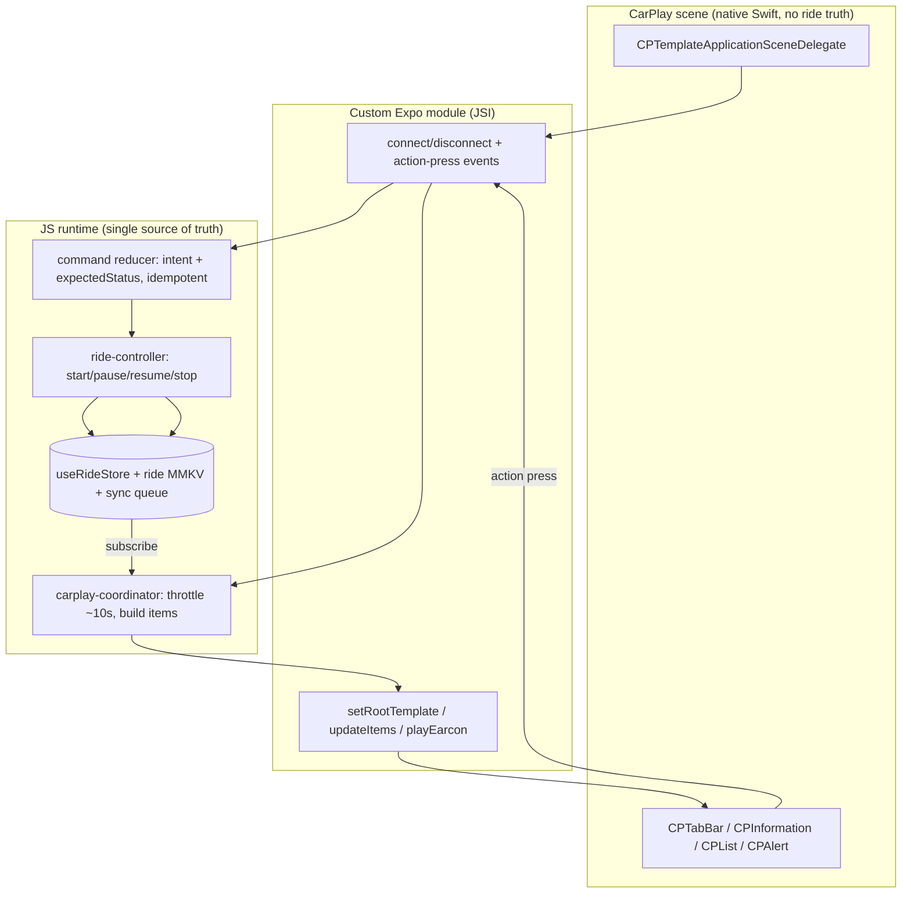
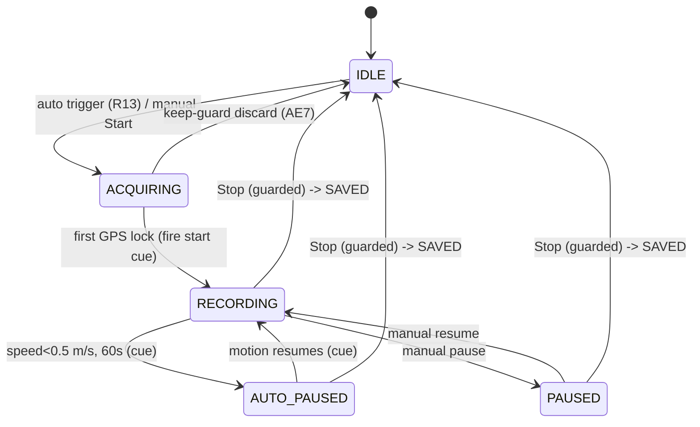

# feat: CarPlay Ride Companion (Driving Task)

## Summary

Add an iOS CarPlay Driving Task surface to the MotoVault Expo app that records a ride alongside the rider's nav app — a glanceable status panel, toggle-operable controls with a stop guard, configurable start (auto/manual/phone-first), a non-visual confirmation cue, and a secondary bike-status view — plus the on-phone companion screens (settings, cue preferences, onboarding, active-ride banner). Built phased so a minimal bike-validatable slice lands first. The Apple Driving Task entitlement is granted (Case-ID 20710293).

---

## Problem Frame

MotoVault records rich rides on the phone (`apps/mobile/src/app/(modals)/ride-hud.tsx`), but during a ride the phone is stowed. On a CarPlay-equipped bike (Honda Africa Twin CRF1100L) the head-unit screen — operated by the handlebar rotary, touch locked above low speed — is the only practical surface, and there's no way to confirm or control recording from it. The opportunity is a glanceable head-unit surface that confirms recording and shows the few facts the bike cluster can't, without taking over the map the rider's nav app owns. See `origin:` for the full requirements (R1–R21, F1–F3, AE1–AE7) and `design:` for the resolved UX.

This plan is shaped by two research findings that revise the design's assumptions (see Key Technical Decisions): the target stack (Expo SDK 56 / RN 0.85) breaks the available CarPlay library, and Apple's template-refresh limit makes the panel a ~10s status board rather than a live dashboard.

---

## Key Technical Decisions

- **KTD1 — Build a custom Expo native module for CarPlay, not `react-native-carplay`.** Expo SDK 56 ships RN 0.85, which removes the legacy bridge interop layer. The maintained fork (`@g4rb4g3/react-native-carplay`) is a legacy `NativeModules`/`NativeEventEmitter` module with a peer range topping at RN 0.79 and no TurboModule spec — very likely non-functional on 0.85. A small Swift module via the Expo Modules API is New-Architecture-clean by design, matches SDK 56's Swift AppDelegate, and only needs four templates + connect/disconnect + command events. Use the library's open-source Swift (`RNCarPlayApp.swift`, template mappers) as reference. Revisit adopting the library only if a TurboModule release with explicit RN 0.85 support appears.

- **KTD2 — CarPlay is a command + projection head; the phone engine is the single write authority.** The CarPlay layer holds zero ride truth. It renders a snapshot from the JS ride store and emits *intents* (`start`/`pause`/`resume`/`stop` with `intentId` + `expectedStatus`); a single JS reducer applies them idempotently and re-broadcasts state to both surfaces. This is what makes "never silently lost" and two-surface consistency (origin R16) deliverable on top of the existing durable engine.

- **KTD3 — Metric refresh is coalesced to a ~10s cadence; state-transition updates are immediate. This revises origin R5 ("within a few seconds").** Apple limits `CPInformationTemplate` data-item refreshes (guidance: no more than once per ~10s) and rejects violators. Numeric metric churn (distance/time/climb) is a glanceable status board updated ~10–15s via in-place `updateInformationTemplateItems` (never re-push); sub-second numbers stay on the phone HUD. **Critical carve-out:** state-indicator transitions (recording↔auto-paused↔paused↔acquiring, stop, GPS-loss) update *immediately* and are exempt from the throttle — a panel that shows RECORDING for 10s after an auto-pause would contradict the cue the rider just heard and break the recording-confidence hero. Verify against the CarPlay guide whether an item-text change on transition counts against the refresh budget; if it does, prefer a distinct state row that is permitted to update on change.

- **KTD4 — Extract a headless `ride-controller`, and relocate the ride clock + background session into it, before wiring CarPlay.** Start orchestration is inlined in `start-ride.tsx` (`handleStartRide`) and end orchestration in `ride-hud.tsx` (`executeEndRide`) — store actions alone don't start/stop a real ride. Two verified consequences make this *more than a move*: (a) `executeEndRide` reads `elapsedRef`/`totalPausedRef` populated by a `setInterval` that lives inside the mounted HUD, so a CarPlay-initiated end (no HUD mounted) would record duration 0 — the elapsed/paused clock must be relocated into the engine/MMKV (derivable from `started_at` + banked pause ms); (b) `executeEndRide` ends with `router.replace` to the summary, which has no foreground stack on a CarPlay stop — the controller must defer summary presentation to next phone-foreground rather than navigate. The controller also exposes a derived `autoPaused` observable (`status === 'recording' && recordingSubState === 'stopped'`) so the coordinator can project AUTO-PAUSED vs manual PAUSED. This is a real refactor, not a behavior-preserving extraction.

- **KTD5 — Native wiring via a custom config plugin in `apps/mobile/plugins/`.** Follow the `fbsdk-core-only.js` / `expo-widgets` precedent (CNG-pure, idempotent, re-applied each prebuild). The plugin adds the entitlement to `ios.entitlements`, injects the `UIApplicationSceneManifest` (`CPTemplateApplicationSceneSessionRoleApplication`), and ships the Swift scene delegate. The KMalkowski reference plugin patches an Obj-C AppDelegate + `RCTBridge`; SDK 56 is Swift + New-Arch (`RCTHost`), so the AppDelegate/scene wiring is written from scratch for Swift. The CarPlay App-ID capability is a manual Apple-portal step beyond the config file.

- **KTD6 — Non-visual cue via a short ducking earcon.** `AVAudioSession` `.playback` + `[.duckOthers, .mixWithOthers]`, configure→activate→play→deactivate (`.notifyOthersOnDeactivation`) each time so the route is fresh and nav voice un-ducks promptly. Fire on GPS-lock (not intent), auto-pause/resume edges, and stop. Apple Watch haptic is an opportunistic fallback only (no-op when the watch app is backgrounded). On-bike validation is required (origin R9).

- **KTD7 — Native-build-only; guard native calls.** CarPlay adds native code, so it ships only via a fresh EAS native build, never OTA (`runtimeVersion: appVersion` — use the appVersion at native-build time, currently `3.11.0`; do not hardcode a stale value). Wrap all CarPlay/native-module calls in try/catch so pre-CarPlay installs degrade gracefully (a `requireOptionalNativeModule`-style availability check; no existing lean-angle guard to mirror — write a fresh try/catch).

- **KTD8 — Reuse engine, formatters, and data; don't fork.** Subscribe to the existing `useRideStore`; format via `ride-formatters.ts` + `useMeasurementSystem()` (units are a global pref in `auth.store`, not per-bike); bike-status reuses `my-motorcycles.graphql`, `maintenance-tasks-by-motorcycle.graphql`, `motorcycle-recalls.graphql`/`recallCount`, `fuel-logs.graphql`, and `health-score.ts`.

- **KTD9 — State is never color-only; copper token rules on phone.** Each state (recording/auto-paused/manual-paused/GPS-acquiring/idle) carries SF Symbol + text label, color tertiary (origin design §1, §7). On the phone companion, copper text below large size uses `signature400` (small `signature500` is a 4.52:1 cliff); copper-filled buttons use dark ink (white-on-copper fails WCAG).

---

## High-Level Technical Design

Command + projection architecture (KTD2):



Ride state machine the panel projects (origin design §1; engine axes `RideStatus` × `RecordingSubState`):



---

## Output Structure

New surfaces (per-unit `Files` remain authoritative):

```
apps/mobile/
  modules/carplay/              # custom Expo module (KTD1)
    ios/                        # Swift: module, CarPlay scene delegate, template mappers
    src/                        # JS API: events, template fns, types
    expo-module.config.json
  plugins/
    with-carplay.js             # entitlement + scene manifest + AppDelegate wiring (KTD5)
  src/
    features/carplay/
      carplay-coordinator.ts    # subscribe + throttle + render (KTD2/KTD3)
      carplay-command-reducer.ts# intent/expectedStatus idempotency (KTD2)
      carplay-templates.ts      # build CPInformation/List/Alert/TabBar item models
      carplay-earcon.ts         # ducking audio cue wrapper (KTD6)
    controllers/ride-controller.ts   # extracted start/stop orchestration (KTD4)
    app/(modals)/carplay/
      index.tsx                 # settings hub
      cues.tsx                  # confirmation-cue preferences
      onboarding.tsx            # 3-card pager
    components/carplay/
      active-ride-banner.tsx
      ride-status-sheet.tsx
      state-indicator.tsx       # shared SF-Symbol/glyph state vocabulary
      start-mode-card.tsx
```

---

## Requirements Trace

- R1–R4, R6–R8 (panel + states + idle + placeholders) → U4, U6. R4's three-state requirement is split: RECORDING/ACQUIRING in U4, AUTO-PAUSED/PAUSED in U6.
- R5 → U4, **revised by KTD3** (~10s metric cadence with immediate state transitions, not "within a few seconds").
- R9 (non-visual confirmation) → U5; on-bike validation in Open Questions
- R10/R11 (coexist with nav, own tile) → U2, U4
- R12/R13 (auto-start + keep-guard) → U7
- R14/R15 (configurable modes + indicator) → U7, U9
- R16 (two-surface consistency / single writer) → U3, U7 (KTD2)
- R17 (stop guard) → U6
- R18 (pause/resume reachability) → U6
- R19/R20 (bike status + motion behavior) → U8
- R21 (settings in phone app) → U9, U10, U13

**Design artifacts (not origin R-IDs), carried from `design:`:** canonical state model → U4, U6; glance hierarchy → U4; accessibility/copper token rules → U9–U12 (KTD9).

---

## Implementation Units

Phased: **Phase A** lands a minimal slice to validate native integration + the cue on the bike before investing in breadth. **Phase B** completes the CarPlay surface. **Phase C** builds the phone companion.

**Phase A exit gate (blocks Phase B/C).** Phase B does not begin until an *on-bike (or backgrounded physical device)* validation passes — not just simulator green: (1) the ride keeps recording and accumulating waypoints with the app backgrounded/phone stowed; (2) the earcon ducks live nav voice over a helmet intercom and is audible (R9); (3) the panel honors the real refresh cadence without an App Review-class violation. If any fails, reconsider scope or the Siri/Live-Activity fallback (Risks) before sinking Phase B/C effort. This answers the origin's explicit thin-slice-vs-full go/no-go.

### U0. Spike: falsify the library + prove the custom-module round-trip

- **Goal:** De-risk KTD1 before committing to a from-scratch module.
- **Requirements:** KTD1
- **Dependencies:** none
- **Files:** throwaway branch / scratch module under `apps/mobile/modules/carplay/` (no production files)
- **Approach:** Time-boxed (≈1 day). (a) Attempt `@g4rb4g3/react-native-carplay` in an RN 0.85 dev build to confirm it actually fails (cheap falsification of KTD1's "very likely non-functional"). (b) Prove a minimal custom Expo module round-trips `setRootTemplate` + `onActionPress` on the CarPlay Simulator. Gate the rest of the native investment (U2+) on (b) succeeding; if the library unexpectedly works, revisit KTD1.
- **Test scenarios:** Test expectation: none — spike; binary exit recorded in the unit's outcome.
- **Verification:** A documented yes/no on both legs; a working minimal template render via the chosen path before U2 proceeds.

### U1. CarPlay config plugin: entitlement + scene manifest + scene delegate wiring

- **Goal:** Make a custom dev/EAS build that boots a CarPlay scene on the Africa Twin / CarPlay Simulator.
- **Requirements:** R10, R11; KTD5, KTD7
- **Dependencies:** none
- **Files:** `apps/mobile/plugins/with-carplay.js` (create), `apps/mobile/app.config.ts` (modify — register plugin, add `com.apple.developer.carplay-driving-task` to `ios.entitlements`, add `UIBackgroundModes: ['location', 'audio']` **from scratch** — there is currently NO `UIBackgroundModes` key; the `expo-location` plugin only grants when-in-use permission, not the background mode), `apps/mobile/modules/carplay/ios/CarPlaySceneDelegate.swift` (create, scaffold)
- **Approach:** Plugin uses `withInfoPlist` (inject `UIApplicationSceneManifest` with both the window scene and `CPTemplateApplicationSceneSessionRoleApplication`), `withEntitlementsPlist` (Driving Task entitlement), and `withDangerousMod`/`withXcodeProject` to add the Swift scene delegate and patch the Swift AppDelegate for the New-Arch host (not the Obj-C reference). Idempotent; survives prebuild.
- **Patterns to follow:** `apps/mobile/plugins/fbsdk-core-only.js` (dangerous-mod iOS patching), the `expo-widgets` target config in `app.config.ts` (custom Swift + app group).
- **Execution note:** Verify against the SDK 56 prebuild UIScene template (Expo issues #46663/#46664 are in flux) before finalizing the AppDelegate patch.
- **Test scenarios:** Test expectation: none — native build config; verified by Verification below.
- **Verification:** `expo prebuild` applies cleanly and is idempotent on re-run; an EAS dev build installs; connecting to the CarPlay Simulator shows the app tile and reaches the scene delegate (logs `didConnect`).

### U2. Custom Expo CarPlay native module (Swift)

- **Goal:** A New-Architecture-clean JS↔native bridge exposing the four templates, connect/disconnect, and action-press events.
- **Requirements:** R1, R2, R3, R10, R11; KTD1
- **Dependencies:** U0 (spike must pass leg b), U1
- **Files:** `apps/mobile/modules/carplay/ios/CarPlayModule.swift` (create), `apps/mobile/modules/carplay/ios/Templates/*.swift` (create — Information/List/Alert/TabBar mappers), `apps/mobile/modules/carplay/expo-module.config.json` (create), `apps/mobile/modules/carplay/src/index.ts` + `types.ts` (create)
- **Approach:** Expo Modules API `Module { Events("onConnect","onDisconnect","onActionPress"); Function setRootTemplate; Function updateInformationItems; Function updateInformationActions; Function pushTemplate; Function popTemplate; Function checkForConnection }`. Templates are plain JS models serialized to native `CP*` objects. Mirror `react-native-carplay`'s Swift template mapping (reference only). In-place `updateInformationItems` reassigns `CPInformationTemplate.items` (never re-push, KTD3).
- **Patterns to follow:** Expo Modules API tutorial; `react-native-carplay` Swift template mappers as reference.
- **Test scenarios:** Test expectation: native module — exercised via U4's coordinator tests with the module mocked; manual verification on the simulator (rendering, action callbacks).
- **Verification:** From JS, `setRootTemplate` renders a `CPInformationTemplate` in the simulator; pressing an action button fires `onActionPress` with the action id; `checkForConnection` re-fires `onConnect` for a late subscriber.

### U3. Headless `ride-controller`: extract orchestration + relocate clock + background session

- **Goal:** One reusable start/pause/resume/stop path that works with no foreground HUD (CarPlay-driven), recording survives backgrounding, and the elapsed/paused clock lives in the engine.
- **Requirements:** R16; KTD4. (Background survival is a hard precondition for U4 — see Risks P0.)
- **Dependencies:** none for the extraction; must land before U4.
- **Files:** `apps/mobile/src/controllers/ride-controller.ts` (create), `apps/mobile/src/utils/ride-location.ts` (modify — invoke `startLocationUpdatesAsync(BACKGROUND_LOCATION_TASK)`, ensure `processLocation` writes work from the background task), `apps/mobile/src/stores/ride.store.ts` (modify — derive elapsed/paused from `started_at` + banked pause ms; expose `autoPaused`), `apps/mobile/src/app/(modals)/start-ride.tsx` + `ride-hud.tsx` (modify — thin callers; remove the in-component clock `setInterval` as source of truth), `apps/mobile/src/controllers/__tests__/ride-controller.test.ts` (create)
- **Approach:** Move `handleStartRide`/`executeEndRide` orchestration into `startRide(opts)`/`endRide(trigger)`/`pauseRide()`/`resumeRide()`. **Relocate the elapsed/paused-time clock** out of `ride-hud.tsx` into the engine (derivable from `rideMMKV.getStartedAt()` + banked pause ms) so a CarPlay-triggered end computes correct duration with no HUD mounted. **Enable a real background location session** (`startLocationUpdatesAsync`, `UIBackgroundModes: location` from U1, Always authorization) so the engine keeps recording while the phone is stowed. **Summary navigation:** `endRide` does not `router.replace`; for a CarPlay-triggered end with no foreground stack, persist a "pending summary" the phone shows on next foreground. Expose `autoPaused` derived observable.
- **Patterns to follow:** existing orchestration in `start-ride.tsx`/`ride-hud.tsx`; the crash-recovery MMKV pattern in `ride-storage.ts`; store-test pattern in `src/stores/__tests__/auth.store.test.ts`; `docs/solutions/.../ios-widget-data-sync-failures.md` (always-valid state).
- **Execution note:** Characterization-first — capture current start/end behavior (incl. duration/paused-time computation) in tests before moving code; this is the highest-regression-risk unit.
- **Test scenarios:**
  - `startRide` writes ride id/startedAt/motorcycleId to MMKV, sets status `recording`, enqueues `startRide`, starts both foreground watcher and background updates.
  - `endRide` triggered with **no mounted HUD** still computes correct `duration_s`/`pausedDurationS` from engine-held clock (not component refs), flushes, enqueues `uploadWaypoints` then `endRide` in order, sets status `ended`, persists pending-summary.
  - Elapsed/paused time is derivable from MMKV across a simulated process restart (background survival).
  - `autoPaused` is true exactly when `status==='recording' && recordingSubState==='stopped'`.
  - `startRide` while already `recording` is idempotent (no duplicate ride id).
  - Covers AE5. A ride started via the controller is observable for a later CarPlay mirror.
- **Verification:** Phone start/end behave identically; a ride continues recording with the app backgrounded (physical-device check); a controller-driven end with no HUD records correct duration; no in-component clock remains the source of truth.

### U4. CarPlay coordinator + live panel (RECORDING / ACQUIRING) + start/stop

- **Goal:** The thin slice — a glanceable panel that mirrors a running ride and can start/stop it from the head unit.
- **Requirements:** R1, R2, R5 (as revised by KTD3), R6, R7, R10, R11
- **Dependencies:** U2, U3
- **Files:** `apps/mobile/src/features/carplay/carplay-coordinator.ts` (create), `apps/mobile/src/features/carplay/carplay-templates.ts` (create), `apps/mobile/src/features/carplay/__tests__/carplay-templates.test.ts` + `carplay-coordinator.test.ts` (create), `apps/mobile/src/app/_layout.tsx` (modify — start coordinator on app init)
- **Approach:** On `onConnect`, read current ride state (projection, not start) and `setRootTemplate(CPInformationTemplate)`. Subscribe to `useRideStore` and a 1s timer; coalesce to a ~10s throttle (KTD3); build items via a pure `buildPanelItems(snapshot)` (title = state + distance per R6; rows = moving time, climb, mode; placeholders/dashes pre-lock per R7); call `updateInformationItems` only on diff. Actions Start/Stop route through the command reducer → `ride-controller`. GPS-lock derived from waypoint-buffer accuracy (no explicit lock flag exists — see Open Questions).
- **Patterns to follow:** ref-not-deps discipline for fast-changing values (`docs/solutions/.../ride-hud-reanimated-charts-mileage-patterns.md`); always render a valid template incl. empty state (`docs/solutions/.../ios-widget-data-sync-failures.md`); `ride-formatters.ts` + `useMeasurementSystem()`.
- **Test scenarios:**
  - `buildPanelItems` returns dashes (never `0.0`) before first GPS lock (Covers R7, AE6).
  - Title fuses state + distance; RECORDING vs ACQUIRING differ by symbol + text, not color only (Covers R4 partial, KTD9).
  - Coordinator throttles *numeric metric* updates to ≥10s under 1Hz store changes and skips unchanged items — but a *state-indicator transition* (e.g., recording→auto-paused) updates immediately, bypassing the throttle (KTD3 carve-out).
  - On connect with a ride already recording, the panel mirrors it (no new ride started) (Covers AE5, R16).
  - Covers AE1. Switching to/from the tile does not call any nav-stopping API (coordinator never registers as navigation).
  - Start action with `expectedStatus = idle` starts a ride; Stop routes to the guarded path (U6).
- **Verification:** On the CarPlay Simulator a recording ride shows live-ish distance/time/climb updating ~every 10s; Start/Stop drive the real engine; phone HUD and panel stay consistent. **On-bike:** validate against the real head unit.

### U5. Non-visual confirmation earcon

- **Goal:** Audible/haptic confirmation the ride is logging without looking (origin R9 keystone).
- **Requirements:** R9
- **Dependencies:** U2, U4
- **Files:** `apps/mobile/modules/carplay/ios/Earcon.swift` (create — or extend CarPlayModule), `apps/mobile/src/features/carplay/carplay-earcon.ts` (create), `apps/mobile/src/features/carplay/__tests__/carplay-earcon.test.ts` (create)
- **Approach:** Native `playEarcon(kind)` using `AVAudioSession` `.playback` + `[.duckOthers, .mixWithOthers]`, configure→activate→play short asymmetric tones (rising=start/resume, descending=pause, long-descending=stop)→deactivate `.notifyOthersOnDeactivation` (KTD6). Coordinator fires on GPS-lock, auto-pause/resume edges, and stop. Default both audio + haptic on (cue preference from U10). Watch haptic opportunistic.
- **Patterns to follow:** AVAudioSession ducking best practice (research sources).
- **Test scenarios:**
  - Coordinator fires the start cue on the ACQUIRING→RECORDING transition, not on intent (Covers R9, AE2).
  - Auto-pause and auto-resume fire distinct cue kinds; no cue on every brief stop (only at the 60s auto-pause edge).
  - Cue suppressed for phone-first adoption (recording already confirmed) (Covers AE5).
  - With both channels off, no cue fires (settings honored) — and the panel still reflects state.
- **Verification:** On-bike — the earcon ducks (not interrupts) turn-by-turn voice over a helmet intercom and is audible; route does not fall back to phone speaker. (Simulator cannot prove audio routing — Open Questions.)

### U6. Full states: auto/manual pause, idle, stop guard, pause/resume

- **Goal:** Complete the panel's state machine and guarded controls.
- **Requirements:** R3, R4, R6, R7, R8, R17, R18
- **Dependencies:** U4
- **Files:** `apps/mobile/src/features/carplay/carplay-coordinator.ts` (modify), `apps/mobile/src/features/carplay/carplay-templates.ts` (modify — alert + idle models), `apps/mobile/src/features/carplay/__tests__/carplay-coordinator.test.ts` (modify)
- **Approach:** Reflect AUTO-PAUSED (frozen moving-time) vs manual PAUSED (distinct symbols); IDLE shows last-ride reference + Start affordance (manual) or status-only (auto). Stop = two-step `CPAlertTemplate` confirm, default focus = Keep Recording (R17); ending always saves (no destructive-discard control). The confirm alert **auto-collapses after ~5s** (timer pops the template — not a default CarPlay behavior) so a distracted rider doesn't leave a modal blocking the panel. Pause/Resume = persistent first action (≤1 step, R18).
- **Test scenarios:**
  - AUTO-PAUSED freezes moving-time and reads a paused symbol+label distinct from RECORDING (Covers AE3).
  - Manual PAUSED and AUTO-PAUSED are distinguishable (different state, per engine axes).
  - Stop opens the confirm alert; confirming ends+saves, dismissing returns to recording; default focus is the safe option (Covers AE4, R17).
  - IDLE-manual shows a Start affordance with placeholder values, never zeros (Covers R8, AE6); IDLE-auto shows no Start button (no duplicate-start).
- **Verification:** Simulator — all five states render correctly; a single accidental Stop press cannot end a ride; pause/resume reachable in ≤2 toggle steps.

### U7. Start modes, auto-start trigger + keep-guard, command race reducer

- **Goal:** Configurable start behavior with a safe auto-start and consistent two-surface control.
- **Requirements:** R12, R13, R14, R15, R16
- **Dependencies:** U3, U4, U6
- **Files:** `apps/mobile/src/features/carplay/carplay-command-reducer.ts` (create), `apps/mobile/src/features/carplay/carplay-auto-start.ts` (create — connected-context trigger + keep-guard; **CarPlay policy stays out of the shared `ride-controller`**, which keeps a clean unconditional `startRide()`), `apps/mobile/src/stores/auth store` (modify — start-mode pref via `partialize`), `apps/mobile/src/features/carplay/__tests__/carplay-command-reducer.test.ts` (create), `apps/mobile/src/features/carplay/__tests__/carplay-auto-start.test.ts` (create)
- **Approach:** Start-mode pref (auto/manual/phone-first) persisted. The auto-start trigger + keep-guard live in the CarPlay layer (`carplay-auto-start.ts`); it decides whether to call the controller's `startRide()`, so the controller stays CarPlay-agnostic (KTD4). Reproduce the **full intent × state precedence matrix** in this unit (not a cross-doc reference) — every `{start,pause,resume,stop}` × `{idle, acquiring, recording, auto-paused, manual-paused}` cell with winner and whether it triggers resync. Mode indicator surfaced on the panel (R15).
- **Technical design (directional):** the resolved matrix (from `design:` §4): STOP beats a concurrent auto-pause; RESUME beats auto-pause; manual pause is sticky vs auto-resume; duplicate start/stop idempotent by `intentId`; head-unit START while `recording` returns the existing ride (no double-start); stale `expectedStatus` → reject + resync. Encode all cells, not just these examples.
- **Test scenarios:**
  - Auto mode: a sub-threshold connected hop is discarded, not logged (Covers AE7, R13).
  - Phone-first: connecting mirrors the active ride and controls act on it; no start cue (Covers AE5, R14, R16).
  - Reducer: head-unit STOP racing an auto-pause → STOP wins; duplicate STOP is a no-op that re-broadcasts; stale intent (expectedStatus mismatch) is rejected and triggers resync.
  - Reducer additional races: RESUME vs concurrent STOP; head-unit START racing the auto-start trigger (no double-start); an intent arriving after disconnect/reconnect with a pre-change `expectedStatus`; two intents sharing an `intentId`.
  - Manual pause suppresses a subsequent auto-resume.
  - Mode indicator reflects the active mode in every state (R15).
- **Verification:** Simulator + unit tests — each mode behaves per spec; no double-start; racing pause/stop never loses a ride.

### U8. Bike-status surface (tab 2)

- **Goal:** Pre-ride/at-stop glance: next service, mileage, recalls, fuel.
- **Requirements:** R19, R20
- **Dependencies:** U2, U4
- **Files:** `apps/mobile/src/features/carplay/carplay-templates.ts` (modify — list + tab-bar models), `apps/mobile/src/features/carplay/carplay-coordinator.ts` (modify — tab root, bike-status load-on-entry), `apps/mobile/src/features/carplay/__tests__/carplay-bike-status.test.ts` (create)
- **Approach:** Root becomes `CPTabBarTemplate` (Ride | Bike). Bike-status is a `CPListTemplate` rebuilt on `templateWillAppear` from existing queries (`my-motorcycles` `recallCount`/`currentMileage`, `maintenance-tasks-by-motorcycle` → `health-score` for next service, `fuel-logs`). While moving, replace rows with a single "Stop to refresh" row (R20). Query `maximumItemCount` at runtime and truncate.
- **Patterns to follow:** existing GraphQL documents + `queryKeys`; `health-score.ts` for next-service selection.
- **Test scenarios:**
  - Builds rows for service/mileage/recalls/fuel from the active (`isPrimary`) bike; 0 recalls shows the safe state, >0 shows the warning (R19).
  - While moving, shows the "stop to refresh" row instead of stale values (Covers R20).
  - Empty/edge: missing mileage/service shows dashes, not zeros.
  - Units follow the global measurement preference (KTD8).
- **Verification:** Simulator — switching to the Bike tab shows current status loaded on entry; does not interrupt a recording ride on the Ride tab.

### U9. Phone companion: CarPlay settings hub

- **Goal:** Start-mode picker + active-bike selector in the app (R21).
- **Requirements:** R14, R15, R21
- **Dependencies:** U7
- **Files:** `apps/mobile/src/app/(modals)/carplay/index.tsx` (create), `apps/mobile/src/components/carplay/start-mode-card.tsx` (create), `apps/mobile/src/app/(tabs)/(profile)/settings.tsx` (modify — entry row), i18n locale files (modify)
- **Approach:** Radio-card start-mode picker (Automatic w/ keep-guard inset + Adjust, Manual, Phone-first), each leading with the consequence; active-bike selector with copper ring on `isPrimary`. When CarPlay is connected, render a **live status strip** below the selector (copper pulse-ring lifted from `start-ride.tsx`, recolored copper + GeistMono `AFRICA TWIN CONNECTED · <STATE>`, derived from the coordinator snapshot; conditional — absent when disconnected). Reuse `settings.tsx` radio-card + `SectionLabel`, `useEditorialTheme`, `FadeInUp`, iOS-gated haptics. Apply copper token rules (KTD9).
- **Patterns to follow:** `settings.tsx` EXPERIENCE_LEVELS radio cards; `bike-switcher.tsx` active treatment.
- **Test scenarios:**
  - Selecting a mode persists it and updates the engine pref (store-level test).
  - Single-bike edge renders locked-active with no radio (origin design §5).
  - Test expectation for visual layout: none — no render-test infra; logic in store/selectors is tested.
- **Verification:** Manual — picker changes mode; active bike reflects `isPrimary`; copper contrast passes (dark ink on copper buttons).

### U10. Phone companion: confirmation-cue preferences

- **Goal:** Configure audio/haptic cue + test it (R9 control surface).
- **Requirements:** R9, R21
- **Dependencies:** U5, U9
- **Files:** `apps/mobile/src/app/(modals)/carplay/cues.tsx` (create), cue-pref persistence in store (modify), i18n locale files (modify)
- **Approach:** Two independent channel toggles (audio/haptic — the legitimate `NativeToggle` use); **toggling a channel on fires an immediate preview** (audio → plays the selected tone; haptic → `Haptics.notificationAsync(Success)`) so the setting is its own preview. Tone-character radios are **dimmed/non-interactive when the audio channel is off**. A "Test this cue" button plays the real start▸pause▸resume sequence with paired haptics; a caution row appears **only when both channels are off**; plus an honest reachability note. Default both on + Mechanical.
- **Patterns to follow:** `native-toggle.tsx`; the unfinished-ride caution banner styling in `start-ride.tsx`.
- **Test scenarios:**
  - Toggling a channel persists it; both-off sets a flag the coordinator honors (no cue).
  - Enabling the audio channel fires the earcon immediately (mocked); enabling haptic fires `notificationAsync(Success)`.
  - Caution row is visible when both channels are off and absent when at least one is on (conditional render, not just styling).
  - Tone-character radios are non-interactive when audio is off; re-enabling audio restores interactivity.
  - Test-cue invokes the earcon module for each kind (mocked).
  - Default state on first load is both-on + Mechanical.
- **Verification:** Manual — toggles preview live; test plays the real sequence; silent-switch note appears when detected.

### U11. Phone companion: onboarding pager

- **Goal:** First-connect education + re-openable explainer.
- **Requirements:** R21 (supports R10/R11 comprehension)
- **Dependencies:** U9
- **Files:** `apps/mobile/src/app/(modals)/carplay/onboarding.tsx` (create), first-connect trigger in `_layout.tsx` or coordinator (modify), i18n locale files (modify)
- **Approach:** 3-card pager (on-the-cluster / rides-alongside-nav / pick-your-start) with Instrument Serif headlines. Card 1's CarPlay-tile mock is a **styled RN view replicating the `CPInformationTemplate` wireframe (not a screenshot), with a looping Reanimated copper pulse-ring** on the RECORDING dot (lift from `start-ride.tsx`, recolor to copper) — the pulse loop is an intentional exception to the no-ambient-motion rule because this is a static educational pager, not a live driving surface. An inline mode mini-picker on card 3 commits the choice. Auto-shown on first CarPlay connect; re-openable from the hub.
- **Patterns to follow:** `start-ride.tsx` editorial header + pulse-ring (recolored copper).
- **Test scenarios:**
  - First-connect shows onboarding once (flag persisted); subsequent connects don't.
  - Card 3 mode selection writes the start-mode pref.
  - No-bike edge routes to add-bike.
- **Verification:** Manual — pager flows; ends in a committed mode; re-open shows current mode as Done.

### U12. Phone companion: active-ride banner + status sheet

- **Goal:** Passive on-phone confirmation + a guarded phone-side stop.
- **Requirements:** R16, R17 (phone mirror)
- **Dependencies:** U3, U7
- **Files:** `apps/mobile/src/components/carplay/active-ride-banner.tsx` (create), `apps/mobile/src/components/carplay/ride-status-sheet.tsx` (create), `apps/mobile/src/components/carplay/state-indicator.tsx` (create), global mount in `_layout.tsx` (modify)
- **Approach:** Banner above the tab bar mirrors state with **five variants** (recording=copper pulse; auto-paused=amber, no pulse; acquiring=info-blue, dashes; armed-auto idle="Ready · auto-start armed", neutral; manual idle="Start from the head unit", neutral, no metrics), tabular-nums metrics, "controls on your head unit". Sheet shows hero state + primary metrics + a single guarded Stop routed through the same `ride-controller` command path (single writer, KTD2). No pause on phone. Shared `state-indicator` carries the canonical glyph vocabulary. **Stop guard = two-tap confirm (no press-and-hold on mobile, per product decision):** tap End → inline "Keep riding / End ride" confirm row → End. The on-bike CarPlay stop guard (R17) remains a two-step `CPAlertTemplate` confirm.
- **Patterns to follow:** `ride-hud.tsx` store-selector subscription; min-ride guard idiom.
- **Test scenarios:**
  - Banner reflects all five states with symbol+label (not color-only, KTD9); armed-auto and manual-idle show their copy and no zero metrics.
  - The guarded Stop requires two taps (End → confirm); "Keep riding" cancels with no state change; End routes through the controller (Covers R16, R17).
  - GPS-lost shows frozen last-known (not zero); disconnect degrades to the normal phone-HUD banner.
- **Verification:** Manual — banner appears during a CarPlay ride; hold-to-stop ends via the same path as the head unit; no racing/divergent state.

### U13. i18n + documentation pass

- **Goal:** All new copy localized; capture the native-integration learning.
- **Requirements:** R21
- **Dependencies:** U9–U12
- **Files:** `apps/mobile/src/i18n/locales/*.json` (modify — all locales), `apps/mobile/src/__tests__/i18n.test.ts` (verify passes), `docs/solutions/` (create a learning post-merge)
- **Approach:** Add `carplay.*` keys to `en.json` AND every other locale file in the same change (the i18n test enforces parity). CarPlay native template titles use `i18n.t(key, { defaultValue })`. Post-merge, run `/ce-compound` to capture the config-plugin + custom-native-module + entitlement + background path (no existing learning covers it).
- **Test scenarios:**
  - `i18n.test.ts` passes — every locale has all `carplay.*` keys.
- **Verification:** `pnpm --filter mobile test` green; no hardcoded-string lint failures.

---

## Acceptance Examples (origin trace)

AE1→U4 · AE2→U5 · AE3→U6 · AE4→U6 · AE5→U3/U7 · AE6→U4/U6 · AE7→U7. Each is enforced by the `Covers AE<N>.` test scenarios above.

---

## Scope Boundaries

### Deferred for later (from origin)
- MotoVault-owned map / route line on the head unit; turn-by-turn over MotoVault routes; Android Auto.

### Outside this product's identity (from origin)
- Replacing the rider's nav app; porting the full phone HUD (lean dial, sparklines) to CarPlay; Android Auto as a publishable target.

### Deferred to follow-up work (plan-local)
- Apple Watch companion app for the haptic fallback (the cue treats Watch as opportunistic only).
- Adopting `react-native-carplay` if a TurboModule / RN 0.85 release appears (revisit KTD1).
- Generalizing the CarPlay surface to non-Africa-Twin head units (single test device for v1).

---

## Risks & Dependencies

- **RN 0.85 native integration is unproven (high).** No CarPlay library supports 0.85; the custom module + Swift scene wiring is net-new and the SDK 56 prebuild UIScene template is in flux. Mitigation: U1/U2 are a spike-shaped foundation; validate on the simulator before Phase B. Fallback: if the custom module stalls, evaluate a Siri/App-Intents + Live Activity surface (no CarPlay scene).
- **The ~10s refresh limit (medium).** Revises R5; over-refreshing risks rejection. Mitigation: coalesced throttle + diff-only updates (U4); verify the exact figure against the current guide.
- **R9 cue reachability (medium).** Audio routing/ducking and haptic-in-tank-bag are only verifiable on the bike. Mitigation: dual-channel default + passive on-tile state backstop; on-bike acceptance gate.
- **Background survival (P0 — unbuilt prerequisite, not a "confirm later").** Verified: the engine uses foreground `watchPositionAsync` only; `startLocationUpdatesAsync` is never called and there is no `UIBackgroundModes` in `app.config.ts`. With the phone stowed (the core use case) iOS suspends the JS runtime and the panel mirrors a frozen ride — the opposite of the hero. Mitigation: U3 stands up a real background location session (plist mode from U1, Always auth, background-task writes) and the Phase A exit gate proves recording survives backgrounding on a physical device. Cold CarPlay connect recovers persisted ride state from MMKV.
- **No OTA (operational).** Ships only via a fresh native EAS build; guard native calls for graceful degradation on older installs (KTD7).
- **Metro monorepo resolver / prebuild fragility (low).** Custom `resolveRequest` in `metro.config.js` is load-bearing; clear Metro cache after native changes.
- **Apple App-ID capability (dependency).** The granted entitlement still needs the CarPlay capability enabled on the provisioning profile (manual portal step) before signing.

---

## Open Questions

### Resolve before/within implementation
- **GPS-lock signal (resolve before U4/U5, not during):** no explicit "locked" boolean exists (HUD derives from waypoint-buffer accuracy, which is filter-dependent — early points are rejected by `gpsFilter`). Decide add-`gpsLocked`-to-store vs derive-in-coordinator before U4/U5 begin — it gates the ACQUIRING→RECORDING transition (R4/R7) and start-cue timing (U5); a wrong derivation fires the start earcon before a real lock (false confidence).
- **Exact R13 trigger + keep-guard values** (connected-context definition; min distance/duration) — placeholder 500 m / 2 min in the design; finalize in U7.
- **Background session is now owned by U3** (was an open question) — see Risks P0.

### Deferred to execution
- Effective `CPInformationTemplate` row count and `CPListTemplate.maximumItemCount` on the Africa Twin TFT (query at runtime).
- The SDK 56 Swift AppDelegate + New-Arch host patch specifics (U1) once the prebuild template settles.
- On-bike audio-route behavior for the earcon (U5).

---

## Sources & Research

- Origin requirements: `docs/brainstorms/2026-06-22-carplay-ride-companion-requirements.md`; design spec: `docs/design/2026-06-25-carplay-ride-companion-ux-design.md`.
- Engine integration: `apps/mobile/src/stores/ride.store.ts`, `apps/mobile/src/utils/ride-location.ts`, `apps/mobile/src/utils/ride-storage.ts`, `apps/mobile/src/utils/ride-sync-queue.ts`; orchestration inlined in `apps/mobile/src/app/(modals)/start-ride.tsx` + `ride-hud.tsx`.
- Native precedent: `apps/mobile/plugins/fbsdk-core-only.js`, the `expo-widgets` target in `apps/mobile/app.config.ts` (custom Swift + app group); `apps/mobile/metro.config.js` resolver.
- Learnings: `docs/solutions/integration-issues/ios-widget-data-sync-failures.md` (always render a valid native state), `ride-hud-reanimated-charts-mileage-patterns.md` (ref-not-deps for fast values), `architecture/measurement-system-and-ride-feature-design.md` (units pref + formatters), `build-errors/eas-ota-runtime-version-mismatch-and-easignore.md` (native-build-only), `metro-workspace-zod-resolution.md`, `integration-issues/i18n-missing-keys-ci-failure.md`.
- External: `@g4rb4g3/react-native-carplay` (legacy bridge, RN≤0.79 — not viable on 0.85); RN 0.85 interop removal; Expo SDK 56 changelog + prebuild UIScene issues #46663/#46664; Apple CarPlay Developer Guide (Driving Task templates, depth limit 2/3, ~10s refresh); `AVAudioSession` `.duckOthers`; Expo Modules API + config-plugin docs; `KMalkowski/expo-config-carplay-plugin` (reference, Obj-C — rewrite for Swift).
