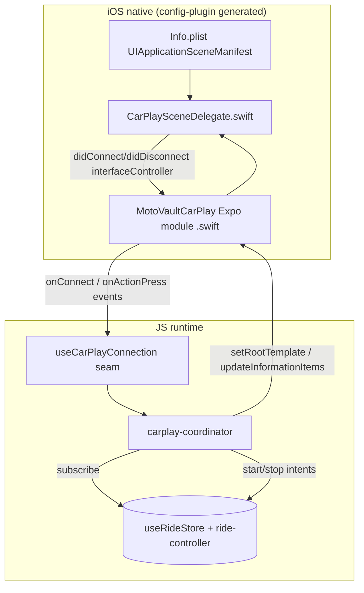

# feat: CarPlay Native Foundation — light up the MotoVault tile

## Summary

Build the native iOS foundation that makes a MotoVault tile appear in CarPlay and render the live-ride panel: the granted Driving Task entitlement + scene manifest via a config plugin, a custom Expo Swift module bridging the CarPlay scene to JS, and a coordinator that renders/updates a `CPInformationTemplate` from the existing ride store and routes start/stop through the ride engine. Scope is the parent plan's native units **U0, U1, U2, U4** plus wiring the existing `useCarPlayConnection()` seam to real events. Validation requires an on-machine `expo prebuild` + dev-client build + the CarPlay Simulator — neither CI nor the agent environment can build the iOS native target.

---

## Problem Frame

The phone-companion screens already ship and are wired to real state, but the CarPlay surface itself doesn't exist in the binary — the CarPlay Simulator shows an empty home with no MotoVault tile. The blocker is entirely native: there is no CarPlay scene, no entitlement in the build, and no JS↔native bridge. The Apple Driving Task entitlement is **granted** (Case-ID 20710293), so the path is unblocked; this plan stands up the minimal native surface to get the tile rendering live ride data. See `parent_plan:` for the full feature; this is its Phase A native slice.

The load-bearing risk (verified in research): Expo SDK 56 ships RN 0.85, which removed the legacy bridge interop layer, so `@g4rb4g3/react-native-carplay` (a legacy `NativeModules` module, peer range ≤0.79) is very likely non-functional. U0 falsifies that cheaply before committing to the custom module.

---

## Key Technical Decisions

- **KTD1 — Spike `@iternio/react-native-auto-play` first; custom Swift module is the fallback.** REVISED. `@iternio/react-native-auto-play` (v0.5.3, updated 2026-06-25) is the Nitro / New-Architecture rewrite of `react-native-carplay` — same maintainer lineage (g4rb4g3), now under Iternio (ABRP, a production CarPlay + Android Auto app). It is RN-0.85-clean (Nitro/JSI), supports both architectures, ships the scene delegates + headless operation + Android Auto, and exposes `InformationTemplate`/`ListTemplate`/`GridTemplate` — exactly the Driving-Task surfaces we need. This supersedes the original "build custom" call (which was right only against the dead legacy `@g4rb4g3` fork that breaks on 0.85). U0 spikes the Iternio library on our stack; the hand-rolled Swift module already in `apps/mobile/modules/carplay/ios/*` is retained as a documented fallback used only if the spike fails. Spike caveats to weigh: pre-1.0 API churn, the `react-native-nitro-modules` dependency, and no official Expo config plugin (we still author config-plugin glue for its scene-delegate class names + `getRootViewForAutoplay`).

- **KTD2 — Config plugin owns all native wiring; never hand-edit prebuilt `ios/`.** A plugin in `apps/mobile/plugins/` adds the entitlement (`ios.entitlements` in `app.config.ts`), injects `UIApplicationSceneManifest` (`CPTemplateApplicationSceneSessionRoleApplication` + the existing window scene), ships the Swift `CarPlaySceneDelegate`, and patches the AppDelegate for the New-Arch host. Precedent: `apps/mobile/plugins/fbsdk-core-only.js` (`withDangerousMod` iOS patching) and the `expo-widgets` target (custom Swift + app group) in `app.config.ts`. Idempotent, re-applied each prebuild.

- **KTD3 — Swift + New-Arch AppDelegate wiring, written fresh.** The public `expo-config-carplay-plugin` reference patches an Obj-C AppDelegate + `RCTBridge`; SDK 56 is Swift + `RCTHost`. The scene-split (phone window scene vs CarPlay template scene) is authored for the Swift New-Arch host. SDK 56's prebuild UIScene template is in flux (Expo #46663/#46664) — verify against the installed template at prebuild time.

- **KTD4 — The CarPlay process holds zero ride truth.** It renders a snapshot pushed from JS and emits action intents; the JS coordinator subscribes to the ride store, builds `CPInformationTemplate` items, and routes start/stop through the existing engine. In-place `updateInformationItems` (never re-push). State-transition updates are immediate; numeric metrics coalesce to ~10s (Apple refresh limit, parent KTD3). Connect = projection (mirror a running ride), not start.

- **KTD5 — Validation is on-machine only.** The agent/CI environment cannot run `expo prebuild`, the CocoaPods install, the Xcode build, or the CarPlay Simulator. Every build/validation step is explicitly flagged as a local task for the developer's Mac (Xcode 26.6, CarPlay Simulator present at the Additional Tools path).

---

## High-Level Technical Design

---

## Requirements Trace

- Parent U0 (library falsification + custom-module spike) → U0
- Parent U1 (entitlement + scene manifest + scene delegate) → U1
- Parent U2 (custom Expo module: connect/disconnect, setRootTemplate, CPInformationTemplate render/update, action-press) → U2
- Parent U4 (coordinator: project live ride, route controls) → U4N
- Origin R1/R2/R3/R6/R10/R11 (panel content, template-only, toggle controls, glance hierarchy, coexist, own tile) → U2, U4N
- Seam wiring (`useCarPlayConnection`) → U4N

---

## Implementation Units

### U0. Spike: validate `@iternio/react-native-auto-play` on our stack (on-machine)

- **Goal:** Decide library-vs-custom before committing native investment (KTD1).
- **Requirements:** KTD1
- **Dependencies:** none
- **Files:** throwaway branch; add `@iternio/react-native-auto-play` + `react-native-nitro-modules`; a minimal config-plugin tweak + a scratch screen/coordinator using the library's `InformationTemplate`.
- **Approach:** On a real dev build (Expo SDK 56 / RN 0.85): (a) install the library + `react-native-nitro-modules`, run `expo prebuild` + `pod install`, and confirm it builds (Nitro autolinks; the library's `HeadUnitSceneDelegate` registers). (b) Wire the Driving-Task entitlement (`com.apple.developer.carplay-driving-task`, not the README's `carplay-maps`) + the `CPTemplateApplicationSceneSessionRoleApplication` pointing at the library's `HeadUnitSceneDelegate`, plus `getRootViewForAutoplay` in the AppDelegate per the library README. (c) Render an `InformationTemplate` (title + a few rows + a Start/Stop action) and confirm it shows in the CarPlay Simulator and fires its action callback. **Decision gate:** if (a)–(c) pass, adopt the library — drop `apps/mobile/modules/carplay/ios/*` (the custom Swift) and rewire the coordinator to the library's `InformationTemplate` API (U2/U4N collapse to glue). If it fails (Driving-Task category unsupported, build breaks, or pre-1.0 blockers), fall back to the retained custom module.
- **Test scenarios:** Test expectation: none — spike; record the (a)/(b)/(c) yes/no + the adopt/fallback decision.
- **Verification (on-machine):** An `InformationTemplate` from `@iternio/react-native-auto-play` rendered in the CarPlay Simulator with a working action; documented adopt-vs-fallback decision before U1/U2 finalize.

### U1. Config plugin: entitlement + scene manifest + scene delegate

- **Goal:** A dev/EAS build that boots a CarPlay scene with the Driving Task entitlement.
- **Requirements:** R10, R11; parent U1; KTD2, KTD3
- **Dependencies:** none (U0 informs but doesn't block)
- **Files:** `apps/mobile/plugins/with-carplay.js` (create); `apps/mobile/app.config.ts` (modify — register plugin, add `com.apple.developer.carplay-driving-task` to `ios.entitlements`, ensure `UIBackgroundModes` includes `audio` for the later cue; the `location` background mode is owned by parent U3 and out of this plan's scope); `apps/mobile/modules/carplay/ios/CarPlaySceneDelegate.swift` (create)
- **Approach:** `withEntitlementsPlist` adds the entitlement. `withInfoPlist` injects `UIApplicationSceneManifest` with `UIApplicationSupportsMultipleScenes: true`, the existing `UIWindowSceneSessionRoleApplication`, and a `CPTemplateApplicationSceneSessionRoleApplication` pointing at `CarPlaySceneDelegate`. `withDangerousMod('ios')` + `withXcodeProject` copy the Swift scene delegate into the target and patch the Swift AppDelegate so the phone window scene and CarPlay scene coexist under the New-Arch host. The scene delegate forwards `templateApplicationScene(_:didConnect:)` / `didDisconnect:` (the `CPInterfaceController`) into the Expo module singleton.
- **Patterns to follow:** `apps/mobile/plugins/fbsdk-core-only.js`; the `expo-widgets` target in `app.config.ts`.
- **Execution note:** Verify against the installed SDK 56 prebuild template (Expo #46663/#46664) before finalizing the AppDelegate patch.
- **Test scenarios:** Test expectation: none — native build config; covered by Verification.
- **Verification (on-machine):** `expo prebuild` applies cleanly and is idempotent on re-run; the dev build installs; connecting the CarPlay Simulator reaches `didConnect` (logged) and shows the MotoVault tile.

### U2. Custom Expo CarPlay module (Swift)

- **Goal:** New-Arch-clean JS↔native bridge for the templates + lifecycle + actions.
- **Requirements:** R1, R2, R3; parent U2; KTD1, KTD4
- **Dependencies:** U0 (leg b), U1
- **Files:** `apps/mobile/modules/carplay/ios/MotoVaultCarPlayModule.swift` (create); `apps/mobile/modules/carplay/ios/CPInformationTemplate+Map.swift` (create — model→native mapper); `apps/mobile/modules/carplay/expo-module.config.json` (create); `apps/mobile/modules/carplay/src/index.ts` + `types.ts` (create — typed JS API + events)
- **Approach:** Expo Modules API `Module { Events("onConnect","onDisconnect","onActionPress"); Function setRootTemplate; Function updateInformationItems; Function updateInformationActions; Function checkForConnection }`. JS passes plain template models (title, `{title,detail}[]` rows, `{id,title}[]` actions); the Swift mapper builds `CPInformationTemplate` and reassigns `.items`/`.actions` in place for updates (no re-push). The module holds the `CPInterfaceController` handed over by the scene delegate (U1); `checkForConnection` re-fires `onConnect` for a late JS subscriber.
- **Patterns to follow:** Expo Modules API module structure; react-native-carplay Swift mappers (reference only).
- **Test scenarios:**
  - JS `index.ts` type surface compiles and exposes the four functions + three events (typecheck).
  - (on-machine) `setRootTemplate` renders a `CPInformationTemplate`; pressing an action fires `onActionPress` with the action id; `updateInformationItems` changes row detail without a push/animation; `checkForConnection` re-emits `onConnect`.
- **Verification:** `index.ts` typechecks and is importable; (on-machine) the simulator round-trip above succeeds.

### U4N. Coordinator + connection seam wired to the real module

- **Goal:** On connect, render the live-ride panel from the ride store and route start/stop through the engine; light up the existing `useCarPlayConnection()` seam.
- **Requirements:** R1, R2, R3, R6, R10, R11; parent U4
- **Dependencies:** U2
- **Files:** `apps/mobile/src/features/carplay/carplay-coordinator.ts` (create); `apps/mobile/src/features/carplay/carplay-templates.ts` (create — pure `buildPanelItems(snapshot)`); `apps/mobile/src/features/carplay/use-carplay.ts` (modify — `useCarPlayConnection` subscribes to the module's connect/disconnect events instead of returning a constant); `apps/mobile/src/app/_layout.tsx` (modify — start the coordinator once on app init); `apps/mobile/src/features/carplay/__tests__/carplay-templates.test.ts` + `carplay-coordinator.test.ts` (create)
- **Approach:** On `onConnect`, read current ride state (projection, not start) and `setRootTemplate`. Subscribe to `useRideStore` + a timer; coalesce numeric metrics to ~10s, push state-indicator transitions immediately (parent KTD3); build rows via pure `buildPanelItems` (title = state + distance; rows = moving time, climb; placeholders/dashes pre-lock); call `updateInformationItems` only on diff. Action ids route Start/Stop through the existing `ride-controller`. `useCarPlayConnection` becomes a real hook over the module's events (graceful: returns disconnected if the native module is absent, e.g., on Android or a pre-CarPlay build — `requireOptionalNativeModule`).
- **Patterns to follow:** ref-not-deps discipline for fast values (`docs/solutions/.../ride-hud-reanimated-charts-mileage-patterns.md`); always render a valid template incl. empty state (`docs/solutions/.../ios-widget-data-sync-failures.md`); `ride-formatters` + `useMeasurementSystem`.
- **Test scenarios:**
  - `buildPanelItems` returns dashes (never `0.0`) before first GPS lock; title fuses state + distance; RECORDING vs ACQUIRING differ by symbol + text, not color only.
  - Coordinator throttles numeric updates to ≥10s but pushes a state transition immediately; skips the bridge call when items are unchanged.
  - On connect with a ride already recording, the panel mirrors it (no new ride started).
  - `useCarPlayConnection` reports connected on `onConnect` and disconnected on `onDisconnect`; returns disconnected when the native module is absent (no throw).
  - Start action with `expectedStatus = idle` starts a ride via the controller; Stop routes to the guarded path.
- **Verification:** Tests green; (on-machine) a recording ride shows live distance/time/climb on the CarPlay Simulator updating ~every 10s, and Start/Stop drive the real engine.

---

## Risks & Dependencies

- **RN 0.85 native integration unproven (high).** The custom module + Swift scene wiring is net-new and the SDK 56 prebuild UIScene template is in flux. Mitigation: U0 spike gates the investment; the JS seam degrades gracefully when the module is absent.
- **Validation is on-machine only (KTD5).** `expo prebuild`, `pod install`, the Xcode build, and the CarPlay Simulator cannot run in CI or the agent env. The PR ships reviewed code; the developer runs the local build to confirm the tile. **CI will pass on JS/lint/typecheck only — a green CI here does NOT prove the native surface works.**
- **Background recording is out of scope here** (parent U3): the panel can render and control, but a real always-on ride needs the background location session from parent U3. This plan delivers the tile + live projection of a foreground/active ride.
- **App-ID capability (dependency).** The granted entitlement must be enabled on the provisioning profile (manual Apple-portal step) before a signed build.
- **No OTA.** New native code ships only via a fresh native build (`runtimeVersion: appVersion`).

---

## Open Questions

### Resolve before/within implementation
- GPS-lock signal still absent in the store (parent open question) — `buildPanelItems` ACQUIRING/RECORDING split depends on it; derive from waypoint-buffer accuracy or add a `gpsLocked` flag.
- Exact `CPInformationTemplate` row budget on the target head unit (query at runtime) — caps how many rows survive.

### Deferred to parent plan
- Background location session (parent U3), full state machine + stop guard (parent U6), start modes + race reducer (parent U7), bike-status tab (parent U8).

---

## Sources & Research

- Parent plan + design + requirements: `docs/plans/2026-06-25-001-feat-carplay-ride-companion-plan.md`, `docs/design/2026-06-25-carplay-ride-companion-ux-design.md`, `docs/brainstorms/2026-06-22-carplay-ride-companion-requirements.md`.
- Native precedent: `apps/mobile/plugins/fbsdk-core-only.js`, `expo-widgets` target in `apps/mobile/app.config.ts`.
- JS seam + screens already built: `apps/mobile/src/features/carplay/use-carplay.ts`, `apps/mobile/src/components/carplay/*`, `apps/mobile/src/app/(modals)/carplay/*`.
- External: **`@iternio/react-native-auto-play`** (v0.5.3, 2026-06-25 — Nitro/new-arch rewrite of react-native-carplay by Iternio/ABRP; CarPlay + Android Auto; `InformationTemplate`/`ListTemplate`/`GridTemplate`; headless; the U0 spike candidate — github.com/Iternio-Planning-AB/react-native-auto-play); `@g4rb4g3/react-native-carplay` (legacy bridge, RN ≤0.79 — not viable on 0.85, superseded by the Iternio rewrite); RN 0.85 interop removal; Expo SDK 56 prebuild UIScene issues #46663/#46664; Apple CarPlay Developer Guide (Driving Task templates, ~10s refresh); Expo Modules API + config-plugin docs; `KMalkowski/expo-config-carplay-plugin` (Obj-C reference — rewrite for Swift).
