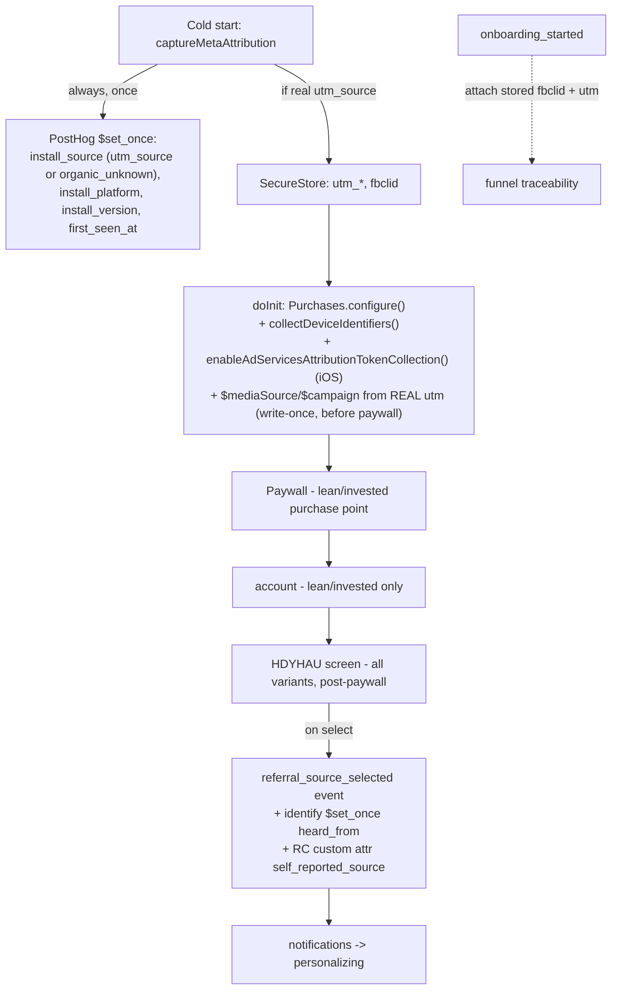

# feat: Tier-1 Attribution Instrumentation

## Summary

Close the install- and paid-conversion-attribution blind spot for the MotoVault mobile app with the **Tier-1 "scrappy-native"** levers from `docs/Attribution-Plan-2026-06-28.md`. Today 100% of RevenueCat subscribers are "No Attribution" and no acquisition channel is captured anywhere. This plan adds: (1) a self-reported "How did you hear about us?" (HDYHAU) onboarding question — the single highest-signal organic-social lever at this volume; (2) first-touch install-source person properties; (3) RevenueCat attribution wiring (`$idfv`/AdServices token + real-UTM `$mediaSource`). Tier-2/3 (web↔mobile stitch, Branch, promo codes, MMP) are out of scope.

All work lands in `apps/mobile`. Must pass `pnpm precheck` (Biome + typecheck + test) and the i18n new-keys ratchet (new `en.json` keys must exist in all 13 locales in the same change).

---

## Problem Frame

- **Install source is invisible.** `Application Installed` lifecycle events already flow to PostHog (the SDK option defaults on), but they carry no channel. Organic App-Store-search installs — the dominant path — leave no machine-readable trail.
- **No self-report.** Onboarding never asks where the user came from, losing the only reliable organic-social signal at the moment of peak recall.
- **RevenueCat attribution unconfigured.** No AdServices token, no device identifiers, no `$mediaSource`. Every subscriber is "No Attribution".
- **Partial existing plumbing (do NOT rebuild).** `meta-attribution.ts` already captures fbclid+UTM into SecureStore and emits a `$set`; `analytics.ts → identifyUser()` already merges stored UTM onto the PostHog person at sign-in; `subscription.ts` already stamps `$posthogUserId` so RC↔PostHog persons are stitched. The gaps are narrower than "no instrumentation."

### Verified current state (from code + SDK docs research)

| Claim | Verified finding |
|---|---|
| `captureAppLifecycleEvents` | **Defaults to `true`**; `Application Installed/Opened/Became Active/Backgrounded` already appear in PostHog. Mobile does **not** use `persistence: 'memory'`, so install events are not suppressed. → No config change needed. |
| `meta-attribution.ts` emits nothing | **False.** It emits `capture('$set', { $set: {utm_*, first_seen_at} })` — but **only when `utm_content` is present**, and via mutable `$set`. |
| `identifyUser()` merges UTM | **True** (`analytics.ts:227-228`). Do not duplicate. |
| RC `$attribution_channel` is a reserved key | **False.** Reserved attribution keys are `$mediaSource`, `$campaign`, `$adGroup`, `$ad`, `$keyword`, `$creative`. `$attribution_channel` would be an unrecognized custom key. |
| RC attributes are "mutable last-write" | **Partly false.** Custom/standard attrs are last-write; **attribution keys (`$mediaSource` etc.) and device identifiers are WRITE-ONCE** — they lock to first value and reject overwrites. |
| Correct `$set_once` API | `posthog.identify(id, { $set_once: {...} })` or `posthog.capture(realEvent, { $set_once: {...} })`. There is **no** `capture('$set', { $set_once })` idiom. |

### Onboarding step order (per variant, verified)

- `control`: `index → experience → goals → bike-setup → maintenance → paywall → notifications → personalizing` (**no `account` step** — auth-first).
- `lean`: `… commitment → paywall → account → notifications → personalizing` (**paywall BEFORE account**).
- `invested`: `… commitment → paywall → account → notifications → personalizing` (**paywall BEFORE account**).

`notifications` and `personalizing` exist in all three variants and sit **after** the paywall. → A new HDYHAU screen inserted **after `paywall`/`account`, before `notifications`** is seen by both free and paid users in all variants and adds no pre-paywall friction.

---

## Requirements

- **R1** — Capture a self-reported acquisition channel (`heard_from`) from a new post-paywall onboarding screen, for all three variants, in every supported locale.
- **R2** — `heard_from` is written as a PostHog person property via `$set_once` (first-touch immutable) **and** fired as a `referral_source_selected` event carrying variant/step context.
- **R3** — `heard_from` is also pushed to RevenueCat as a **custom mutable** attribute (NOT a reserved `$`-key) so RC-side segmentation inherits the source via the existing `$posthogUserId` stitch.
- **R4** — Install source is stamped as first-touch person properties (`install_source`, `install_platform`, `install_version`) on **every** first launch, defaulting to `organic_unknown` when no UTM is present.
- **R5** — Stored fbclid + UTM are attached to the `onboarding_started` event so a tagged/paid install is traceable through the funnel.
- **R6** — RevenueCat collects `$idfv` + the Apple AdServices (ASA) token, and stamps reserved `$mediaSource`/`$campaign` from a **real** deep-link UTM **before the first purchase**, never from a self-reported or `organic_unknown` value.
- **R7** — No new ATT prompt is introduced; no regression to the existing consent gate (`analyticsEnabled`) or dev no-op behavior.
- **R8** — `pnpm precheck` passes, including the i18n new-keys ratchet across all 13 locales.

---

## Key Technical Decisions

- **KTD-1 — Self-report is a custom RC attribute, not `$mediaSource`/`$attribution_channel`.** `$mediaSource` is write-once and semantically reserved for real ad/deep-link source; locking it to a self-reported guess would (a) be wrong and (b) permanently block ASA/UTM from ever populating it. Use a custom key `self_reported_source` (no `$` prefix → mutable). Rationale: research confirmed reserved-key list + write-once semantics. (see origin: `docs/Attribution-Plan-2026-06-28.md`, stress-test correction on immutability)
- **KTD-2 — PostHog person link is the primary HDYHAU→paid join; RC custom attr is secondary.** In `lean`/`invested` the paywall precedes the HDYHAU screen, so a purchase can fire *before* `heard_from` exists — it can never be stamped on that purchase event. The durable join is the existing `$posthogUserId` ↔ PostHog person (`heard_from` set-once on that person). The RC custom attribute is a convenience for RC dashboard segmentation, explicitly best-effort.
- **KTD-3 — `$set_once` for first-touch identity props.** `heard_from`, `install_source`, `install_platform`, `install_version`, `first_seen_at` are first-touch — use `$set_once` so a later launch/link cannot overwrite the original. Use the `identify(id, { $set_once })` form when a user id exists, else `capture(realEvent, { $set_once })` on the anonymous distinct_id (merges on later `identify`).
- **KTD-4 — Emit install attribution on ALL first launches + persist `utm_source` independent of `utm_content`.** Move the PostHog write in `captureMetaAttribution()` out of the `if (utmContent)` branch (still inside the `CAPTURED`-guard), with `install_source = utm_source ?? 'organic_unknown'`. **Revised (review):** also persist `UTM_SOURCE`/`UTM_CAMPAIGN` to SecureStore whenever `utm_source` is present — NOT only when `utm_content` is present — and loosen `getStoredUtmProperties()` so it no longer short-circuits to `null` on missing `utm_content` (return whatever UTM keys exist). Source-only/campaign-only links (common for non-Meta channels) currently store nothing, which would silently break both `install_source` recovery (U3) and the `$mediaSource` guard (U5). This reconciles U3 and U5.
- **KTD-5 — Do NOT set `$mediaSource` for organic.** Only set the reserved `$mediaSource`/`$campaign` when a real deep-link `utm_source` exists. Setting `organic_unknown` would write-once-lock it and prevent the AdServices token from ever attributing an ASA install. Leave unset for organic so ASA can populate it.
- **KTD-6 — `$mediaSource` must be set before the paywall, with explicit sequencing + a paywall-time fallback.** It's write-once and stamped onto the purchase event at purchase time, so set it in the RevenueCat init/anonymous-config path before the paywall. **Revised (review):** `captureMetaAttribution()` (`_layout.tsx:~536`) and `configureRevenueCatAnonymously`/`doInit` (`_layout.tsx:~280`) are currently independent fire-and-forget effects with no ordering guarantee, so `doInit` can read an empty SecureStore and never set `$mediaSource` (unrecoverable, write-once). Resolve by (a) `await captureMetaAttribution()` *before* the RC attribution write, AND (b) also attempt the `$mediaSource` set at `presentPaywall()` time as a fallback (covers the case where a tagged link is the *second* launch and `CAPTURED` already short-circuited the first). The set is naturally idempotent because RC ignores write-once overwrites.
- **KTD-7 — `captureAppLifecycleEvents` left at default.** It is already on and events flow (confirmed: `Application Installed/Opened` present in PostHog); adding the option explicitly is a no-op. The origin doc claimed it was "not enabled" — that claim is superseded by SDK-source verification (default `true`, mobile is not `persistence:'memory'`). Add a one-line code comment so a future reader doesn't "fix" it. No functional change.
- **KTD-8 — New HDYHAU screen is additive and post-paywall.** It shifts `step_index`/`totalScreens` by +1 for post-paywall steps in all variants but does not touch the pre-paywall conversion funnel. Update `docs/onboarding-ab-event-schema.md` if it enumerates per-variant step counts. Documented as a known analytics note (see Risks).
- **KTD-9 — All attribution collection is consent-gated (GDPR / EU market).** **Added (review).** `collectDeviceIdentifiers()` (`$idfv`, `$ip`, Android `$gpsAdId`/`$androidId`) and the install-source `$set_once` emit are personal-data collection and MUST respect the existing consent gate, not fire unconditionally at cold start before the server `me`/consent resolves. (1) Gate the RC device-identifier + AdServices calls on `getStoredAnalyticsConsent()` (mirror the synchronous replay gate at `analytics.ts:61-67`); expose a deferred `configureRcAttribution()` that `setAnalyticsEnabled(true)` invokes so late opt-in still attributes. (2) Gate the `captureMetaAttribution()` emit on `isAnalyticsEnabled()`/stored consent, and do **not** set the `CAPTURED` flag unless the emit actually fired — otherwise an opted-out-then-opted-in user loses first-touch permanently. fbclid/UTM SecureStore writes are on-device only (transmitted on register), but add a `clearAttributionData()` call when consent flips to false.
- **KTD-10 — HDYHAU is skippable; analytics writes are fire-and-forget; back is hidden.** **Added (review, design).** The screen is post-auth/post-paywall and non-reversible: hide the back button (no return to `account`/`paywall`). Provide a "Skip" affordance styled like `notifications.tsx`'s "Maybe Later"; on skip, advance WITHOUT writing `heard_from` and WITHOUT firing `referral_source_selected` (leave the optional field `undefined`). On selection, fire the event + person-prop + RC-attr writes **fire-and-forget** (do not `await` before `goNext()`), consistent with KTD-2's best-effort framing. Drop a free-text "Other" input — log the literal `other` value and auto-advance (origin omits a text field); the 9-option list uses a `ScrollView` mirroring `stay-on-top.tsx`, not the non-scrolling `frequency.tsx` layout.

---

## High-Level Technical Design

Authoritative content; prose above governs on any disagreement.

---

## Implementation Units

### U1. Add `referral_source_selected` event + `heard_from` analytics helpers

**Goal:** Add the event constant and the identify/RC-attribute write path for the self-reported source, without touching UI yet.

**Requirements:** R2, R3, KTD-1, KTD-3.

**Dependencies:** none.

**Files:**
- `apps/mobile/src/lib/analytics.ts` — add `REFERRAL_SOURCE_SELECTED: 'referral_source_selected'` to `AnalyticsEvent`; add a helper to set a first-touch person property via `$set_once` (e.g. `setUserPropertiesOnce(props)` using `posthogClient.capture(<event>, { $set_once })` or extend `identifyUser` semantics). Keep dev/consent no-op behavior.
- `apps/mobile/src/lib/subscription.ts` — add a `SELF_REPORTED_SOURCE` custom attribute key (NOT in `PAYWALL_ATTRIBUTE`, since that maps to paywall vars) and a `setSelfReportedSource(value)` that calls `Purchases.setAttributes({ self_reported_source: value })` guarded by non-empty value + `isExpoGo()` + init. Mirror the network-error downgrade pattern in `setOnboardingAttributes`.

**Approach:** Reuse the existing magic-string-free `AnalyticsEvent` `as const` pattern. The set-once helper must use the verified API (`identify(id,{ $set_once })` or `capture(event,{ $set_once })`), never `capture('$set',{ $set_once })`. RC write is a custom mutable key (KTD-1).

**Patterns to follow:** `AnalyticsEvent` const + `setUserProperties` in `analytics.ts`; `setOnboardingAttributes` / `loginRevenueCat` attribute-write + error handling in `subscription.ts`.

**Test scenarios:**
- `setUserPropertiesOnce` is a no-op when `analyticsEnabled` is false or client is disabled (dev).
- `setSelfReportedSource('')` / null → does not call `Purchases.setAttributes` (no empty write).
- `setSelfReportedSource('tiktok')` → calls `setAttributes({ self_reported_source: 'tiktok' })` exactly once; network error is downgraded to warn, not re-thrown.
- `referral_source_selected` constant is exported and typed in `AnalyticsEventName`.
- Test file: `apps/mobile/src/lib/__tests__/analytics.test.ts`, `apps/mobile/src/lib/__tests__/subscription.test.ts` (mirror existing test locations).

**Verification:** Unit tests green; typecheck passes; no new Biome violations.

---

### U2. HDYHAU onboarding screen + flow wiring + locale keys

**Goal:** Add the new single-select "How did you hear about us?" screen, registered in all three variant flows post-paywall, with options and copy in all 13 locales.

**Requirements:** R1, R8, KTD-8, KTD-10.

**Dependencies:** U1 (event + helpers).

**Files:**
- `apps/mobile/src/config/onboarding.ts` — add `OB_SCREEN.HEARD_ABOUT = 'heard-about'`; insert into `control`, `lean`, `invested` flow arrays **after `paywall`/`account`, before `notifications`**; add `OB_STEP_NAME` entry (`heard_about`); add `OB_ROUTE` typed href.
- `apps/mobile/src/app/(onboarding)/_layout.tsx` — register `<Stack.Screen name="heard-about" />` with matching gesture options.
- `apps/mobile/src/app/(onboarding)/heard-about.tsx` — new screen. Single-select card list inside a `ScrollView` (mirror `stay-on-top.tsx` layout — 9 options won't fit unscrolled; do NOT copy `frequency.tsx`'s non-scrolling centered layout). Options `as const`: `tiktok, instagram, youtube, friend, app_store_search, google_search, ai_chat, dont_remember, other` (no free-text; `other` logs the literal value and auto-advances — KTD-10). **Hide the back button** (post-auth/post-paywall, non-reversible — KTD-10). Add an explicit **Skip** affordance (styled like `notifications.tsx` "Maybe Later") that advances without writing `heard_from` or firing the event. Renders `<OnboardingProgress>`; fires `ONBOARDING_STEP_VIEWED` on mount. Accessibility: `accessibilityRole="header"` on the title, `accessibilityRole="button"` + `accessibilityState={{selected}}` + an `accessibilityHint` ("Double-tap to select and continue") on each card. Rider-frame copy (e.g. "Where did you first hear about MotoVault?"), not generic SaaS phrasing.
- `apps/mobile/src/stores/onboarding.store.ts` — add `heardFrom?: string` field; **persist it (do NOT exclude via `partialize`)**; bump `version` and add the standard `if (version < N) …` migrate guard (mirror the v6 pattern). Add setter.
- `apps/mobile/src/i18n/locales/en.json` — add `onboarding.heardAbout*` title/subtitle, skip-label, + one label key per option.
- `apps/mobile/src/i18n/locales/{es,de,fr,it,pt-BR,ja,hi,th,id,tr,pl,sk}.json` — same keys in all 12 secondary locales (ratchet requirement R8).

**Approach:** Pure-RN `<Pressable>` card list in a `ScrollView` (no native Picker exists in onboarding; `SegmentedControl` is unsuitable for 9 options). On select: store setter → `trackOnboardingEvent(AnalyticsEvent.REFERRAL_SOURCE_SELECTED, OB_SCREEN.HEARD_ABOUT, { referral_source: id })` → set-once person prop (U1 helper) → RC custom attr (U1) → `goNext()` — the three analytics writes are **fire-and-forget; do not `await` before `goNext()`** (KTD-10, KTD-2 best-effort). On **skip**: `goNext()` only — no write, no event. Include `app_store_search` and `dont_remember` to reduce forced-attribution bias; option order is fixed in the `as const` array (randomization considered and rejected — volume too low to need it, bias is directional anyway).

**Patterns to follow:** `apps/mobile/src/app/(onboarding)/stay-on-top.tsx` (ScrollView + option-array shape + haptics + step events — the layout model), `frequency.tsx` (single-select selection/advance mechanics), `notifications.tsx` (skip affordance), `ONBOARDING_COLORS`. All visible copy via `t()` (i18n ESLint no-literal-string guard); raw option `id`s are passed to analytics/RC, never displayed. i18n batch-add pattern from `docs/solutions/integration-issues/i18n-missing-keys-ci-failure.md`.

**Test scenarios:**
- `getStepIndex`/`getTotalScreens` return the new index for `heard-about` in each variant; pre-paywall indices unchanged.
- `getNextRoute(paywall|account)` and `getNextRoute(heard-about)` resolve correctly per variant (control: after `paywall`; lean/invested: after `account`; next is `notifications`).
- Selecting an option persists `heardFrom`, fires `referral_source_selected` with `{ variant, step, step_index, referral_source }`, and advances.
- **Skip** advances to `notifications` and does NOT persist `heardFrom` or fire `referral_source_selected`.
- Selecting `other` logs `referral_source: 'other'` (no free-text) and advances.
- Store migration from previous `version` defaults `heardFrom` to undefined without dropping existing persisted fields; `heardFrom` survives a persist round-trip.
- i18n: every new `en.json` key exists in all 12 secondary locales (the ratchet test).
- Test files: `apps/mobile/src/config/__tests__/onboarding.test.ts` (flow/index assertions); screen interaction covered where existing onboarding screen tests live.

**Verification:** App navigates paywall → (account) → heard-about → notifications in all variants in a dev build; `pnpm --filter mobile test` + i18n ratchet green.

---

### U3. Emit install attribution on every first launch (`meta-attribution.ts`)

**Goal:** Fix `captureMetaAttribution()` so install-source person props are stamped on **all** first launches via `$set_once`, not only when `utm_content` is present.

**Requirements:** R4, R7, KTD-3, KTD-4, KTD-7, KTD-9.

**Dependencies:** none (can land independently; U1 helper optional).

**Files:**
- `apps/mobile/src/lib/meta-attribution.ts` — move the PostHog write out of the `if (utmContent)` branch (still inside the `CAPTURED`-guard). Switch `$set` → `$set_once`. Set `install_source = utmSource ?? 'organic_unknown'`, `install_platform = process.env.EXPO_OS`, `install_version` (`Constants.expoConfig?.version`), `first_seen_at`. **Persist `UTM_SOURCE`/`UTM_CAMPAIGN` whenever `utm_source` is present** (not only with `utm_content` — KTD-4) and loosen `getStoredUtmProperties()` to not short-circuit on missing `utm_content`. **Consent-gate the emit** on `isAnalyticsEnabled()` / `getStoredAnalyticsConsent()`, and **only set the `CAPTURED` flag if the emit actually fired** so an opted-out→opted-in user is not permanently lost (KTD-9).
- `apps/mobile/src/lib/analytics.ts` — add a one-line comment near the PostHog constructor noting `captureAppLifecycleEvents` defaults on and is intentionally not set (KTD-7).

**Approach:** Use `posthogClient.capture(<real event name, e.g. 'install_attribution_captured'>, { $set_once: {...} })` so set-once person props attach to a real event on the anonymous distinct_id and merge on later `identify`. Gate the capture on consent (mirror `trackEvent`'s `analyticsEnabled` check or route through it) — do NOT fire unconsented (R7/KTD-9). Preserve the best-effort try/catch. Respect `disabled` (dev no-op).

**Patterns to follow:** existing `captureMetaAttribution` structure; `trackEvent` consent-gate + `capture` usage in `analytics.ts`; synchronous consent read at `analytics.ts:61-67`.

**Test scenarios:**
- First launch, consent granted, no UTM → emits set-once with `install_source: 'organic_unknown'` + platform/version/first_seen_at; no UTM SecureStore keys written.
- First launch with `utm_source` (no `utm_content`) → `install_source` = that source AND `UTM_SOURCE` persisted to SecureStore (KTD-4 regression guard; previously stored nothing).
- First launch with full UTM incl. `utm_content` → UTM SecureStore writes happen AND set-once fires.
- **Consent NOT granted** → no emit AND `CAPTURED` flag NOT set (so it can fire after opt-in). On later opt-in + relaunch, emit fires once.
- Second launch (`CAPTURED` set) → no emit (idempotent).
- Client disabled (dev) → no throw, no emit.
- Test file: `apps/mobile/src/lib/__tests__/meta-attribution.test.ts`.

**Verification:** Unit tests green; manual: fresh install in a release-like build produces an install attribution write with `organic_unknown` when launched without a deep link.

---

### U4. Attach fbclid + UTM to `onboarding_started`

**Goal:** Make a tagged/paid install traceable through the onboarding funnel by attaching stored fbclid + UTM to the `onboarding_started` event.

**Requirements:** R5.

**Dependencies:** none.

**Files:**
- `apps/mobile/src/lib/onboarding-analytics.ts` and/or the welcome screen `apps/mobile/src/app/(onboarding)/index.tsx` where `ONBOARDING_STARTED` fires via `trackOnboardingFlowEvent` — read `getStoredUtmProperties()` + `getStoredFbclid()` and include them as event properties.

**Approach:** `onboarding_started` fires once at flow start. Since `getStored*` are async, resolve them before/at the fire site (the welcome screen already runs effects) and pass into `trackOnboardingFlowEvent(ONBOARDING_STARTED, { ...utm, fbclid })`. Do not block navigation on the read; best-effort. Do not duplicate the person-property merge (identify already does that) — this only enriches the event.

**Patterns to follow:** `getStoredUtmProperties`/`getStoredFbclid` in `meta-attribution.ts`; `trackOnboardingFlowEvent` in `onboarding-analytics.ts`.

**Test scenarios:**
- With stored UTM + fbclid → `onboarding_started` carries `utm_*` + `fbclid` (+ `variant`).
- With nothing stored → `onboarding_started` fires with `variant` only (no empty keys).
- Test file: `apps/mobile/src/lib/__tests__/onboarding-analytics.test.ts` (or the welcome-screen test).

**Verification:** Event in PostHog shows utm/fbclid when launched from a tagged link.

---

### U5. RevenueCat attribution wiring (`$idfv` + ASA token + real-UTM `$mediaSource`)

**Goal:** Move subscribers out of "No Attribution": collect device identifiers + ASA token, and stamp reserved `$mediaSource`/`$campaign` from a **real** deep-link UTM before any purchase.

**Requirements:** R6, R7, KTD-5, KTD-6, KTD-9.

**Dependencies:** U3 (KTD-4 UTM-persistence change is a **hard dependency** — without it `getStoredUtmProperties()` returns null for source-only links and `$mediaSource` never fires).

**Files:**
- `apps/mobile/src/lib/subscription.ts` — add a `configureRcAttribution()` helper that, **gated on `getStoredAnalyticsConsent()`** (KTD-9), calls `await Purchases.collectDeviceIdentifiers()` and `if (process.env.EXPO_OS === 'ios') await Purchases.enableAdServicesAttributionTokenCollection()` (documented no-op off-iOS), then — reading `getStoredUtmProperties()` — if a **real** `utm_source` exists, `await Purchases.setAttributes({ $mediaSource, ...(utm_campaign && { $campaign }) })`. Never set `$mediaSource` to `organic_unknown`/self-report (KTD-5). Call it from `doInit()` after `configure()` (consent-gated), AND re-invoke it from `setAnalyticsEnabled(true)` in `analytics.ts` so late opt-in still attributes. Also attempt the `$mediaSource` set inside `presentPaywall()` as a fallback (KTD-6 second-launch case). Wrap in try/catch + network-error downgrade.
- `apps/mobile/src/app/_layout.tsx` — sequence the two effects so `await captureMetaAttribution()` resolves before the RC attribution write reads SecureStore (KTD-6), OR have `configureRcAttribution` read the deep-link UTM directly.

**Approach:** Runs at init before `presentPaywall` (write-once-before-purchase, KTD-6), but with the ordering fix and paywall-time fallback so a tagged second-launch install isn't lost. `$mediaSource`/`$campaign` are write-once on RC's side — a single guarded set is correct; repeated attempts are harmless (RC ignores overwrites). **No ATT prompt added.** `collectDeviceIdentifiers` collects `$idfv`/`$ip` (Android: `$gpsAdId`/`$androidId`) which are personal data → consent-gated per KTD-9; `$idfa` only if ATT already granted elsewhere.

**Patterns to follow:** attribute writes in `loginRevenueCat`/`setOnboardingAttributes`; `process.env.EXPO_OS` guard in `doInit`; synchronous consent read at `analytics.ts:61-67`.

**Test scenarios:**
- Consent granted → `configureRcAttribution` calls `collectDeviceIdentifiers` once after `configure`.
- **Consent NOT granted** → `collectDeviceIdentifiers` / `enableAdServices...` / `setAttributes` NOT called (KTD-9). After `setAnalyticsEnabled(true)`, `configureRcAttribution` runs and they fire.
- iOS → `enableAdServicesAttributionTokenCollection` called; Android → not called (or no-ops) — assert platform guard.
- Stored real `utm_source` present (persisted via KTD-4) → `setAttributes({ $mediaSource })` (+ `$campaign` when present).
- No stored UTM / `organic_unknown` → `$mediaSource` NOT set (KTD-5 guard).
- Tagged link on second launch (UTM lands after first `doInit`) → `presentPaywall` fallback sets `$mediaSource` (KTD-6).
- Network error during attribute set → downgraded to warn; init still resolves the cleanup fn.
- Expo Go → entire path skipped.
- Test file: `apps/mobile/src/lib/__tests__/subscription.test.ts`.

**Verification:** Unit tests green; in a release build a consented deep-link install with `utm_source` shows `$mediaSource` on the RC customer; an organic install shows ASA-resolved or empty (not `organic_unknown`); an opted-out install transmits no device identifiers.

---

## Scope Boundaries

### In scope
- T1 (HDYHAU), T2 (install-source fixes), T4 (RC attribution wiring) — code in `apps/mobile`.

### Manual / console-only follow-ups (note in PR, not code)
- Toggle the **RevenueCat → PostHog** integration in the RC dashboard (PostHog EU project key). The `$posthogUserId` stitch already exists in code; this is a dashboard switch.
- Create **App Store Custom Product Pages** + **Google Play custom store listings** per channel (T3 store-side).
- Diagnose why **Apple Search Ads** is "not populating" in RC (enabling the AdServices token in U5 is the likely fix; verify ASA is configured in App Store Connect).
- Build the PostHog **Acquisition dashboard** + `Application Installed → purchase` funnel broken down by `heard_from` / `install_source`.
- **Privacy/GDPR (legal, not code):** update the in-app Privacy screen + privacy policy + App Store privacy nutrition label to disclose RevenueCat device-attribution collection (`$idfv`, `$ip`, Android `$gpsAdId`/`$androidId`) and the AdServices token; name the GDPR lawful basis (consent vs legitimate interest); confirm RevenueCat's DPA covers EU→US transfer (SCCs) for these fields. The code (U5/KTD-9) gates collection on the analytics-consent toggle, but the disclosure is a manual legal task.

### Deferred to Follow-Up Work (Tier 2/3 — premature at current volume)
- Web↔mobile identity & UTM persistence; app-link verification (`assetlinks.json`, `apple-app-site-association`).
- Branch deferred deep linking.
- Per-channel promo codes.
- Full MMP (Tenjin/Singular/Adjust) for paid UA / TikTok SAN.

---

## Risks & Dependencies

- **R-1 — A/B funnel step shift.** Adding `heard-about` post-paywall shifts `step_index`/`totalScreens` +1 for post-paywall steps in all variants. Pre-paywall conversion funnel is unaffected; analysts must note the new total. Mitigation: documented; event schema doc (`docs/onboarding-ab-event-schema.md`) updated if it enumerates steps.
- **R-2 — `$mediaSource` write-once footgun.** A premature/wrong set permanently mis-tags the subscriber. Mitigation: KTD-5 guard (only real `utm_source`, never `organic_unknown`/self-report).
- **R-3 — i18n ratchet.** New `en.json` keys must land in all 13 locales in the same change or pre-push/CI blocks. Mitigation: U2 includes all 12 secondary locales.
- **R-4 — Identity/reset interaction.** `heard_from`/`install_source` must survive onto the identified person. Mitigation: `$set_once` + rely on the hardened `reset()` guard (preserves `InstalledAppBuild`/`DeviceId`; see `docs/solutions/integration-issues/posthog-onboarding-funnel-instrumentation.md`). Fire `referral_source_selected` after `identify()`.
- **R-5 — Self-report bias.** Recall over-credits salient brands, under-credits App Store search. Mitigation: include `app_store_search` + `dont_remember` options; treat as directional (origin measurement model).
- **R-6 — Dev/consent no-op.** All instrumentation must respect `disabled: __DEV__` and the `analyticsEnabled` consent gate (R7). Mitigation: route through existing guarded wrappers; no direct unguarded `posthogClient` writes outside the established pattern.
- **R-7 — Unconsented PII collection (HIGH, from review).** `collectDeviceIdentifiers()` (`$idfv`+`$ip` = personal data under GDPR; EU is a primary market) and the install `$set_once` emit fire at cold start, before the server consent preference resolves — collecting/transmitting before consent would be unlawful. Mitigation: KTD-9 — gate both on the synchronous `getStoredAnalyticsConsent()`, defer via `configureRcAttribution()` re-invoked on opt-in, and don't set `CAPTURED` unless the emit fired.
- **R-8 — UTM/SecureStore ordering race (HIGH, from review).** `captureMetaAttribution()` and `doInit()` are unsequenced cold-start effects, so RC init can read an empty store and never set write-once `$mediaSource`; and `getStoredUtmProperties()` previously returned null without `utm_content`. Mitigation: KTD-4 (persist `utm_source` independently) + KTD-6 (explicit `await` sequencing + `presentPaywall()` fallback for second-launch tagged installs).

---

## Sources & Research

- Origin: `docs/Attribution-Plan-2026-06-28.md` (tiered plan + adversarial stress-test corrections).
- SDK docs (Context7-verified): posthog-react-native v4.47.2 (`captureAppLifecycleEvents` default-on, `$set_once` via `identify`/`capture`, memory-persistence + reset caveats); react-native-purchases v9.15.2 (reserved attribution keys, write-once attribution/device-id attributes, `enableAdServicesAttributionTokenCollection` iOS-only, `collectDeviceIdentifiers` ATT note, attributes-before-purchase timing).
- Learnings: `docs/solutions/integration-issues/posthog-onboarding-funnel-instrumentation.md` (reset guard, fire-after-identify, OAuth new-user helper, dev/consent gating); `docs/solutions/integration-issues/i18n-missing-keys-ci-failure.md` (locale batch-add).
- Repo map: onboarding flow/config, `onboarding.store.ts` flush in `personalizing.tsx`, single-select screen patterns (`frequency.tsx`/`stay-on-top.tsx`), `identifyUser`/`setUserProperties` (`analytics.ts`), RC attribute writers (`subscription.ts`).
