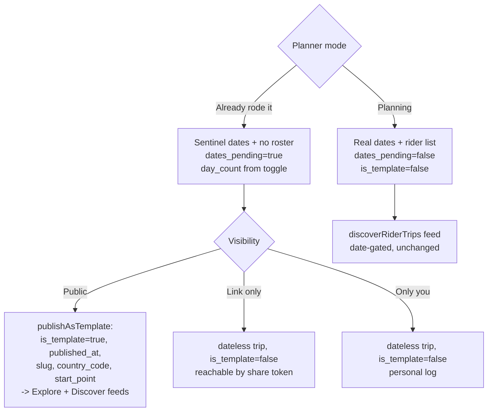

# feat: Trip showcases (dateless past trips)

## Summary

Add an "Already rode it" / "Planning" mode toggle to the mobile trip planner so a rider can publish a **dateless** showcase of a trip they took. A showcase reuses the existing template system: when public it is promoted to a discoverable template (`is_template = true`) and appears in the web Explore and mobile Discover feeds, where others view, clone, and adjust it. Dateless state reuses the established `dates_pending` + sentinel-date convention rather than nullable columns, so no schema migration is required. The three visibility tiers are relabeled by effect with no enum change.

---

## Problem Frame

Most of "a shareable, cloneable, discoverable route" already exists as a **template** (`trips.is_template = true`): shareable via `trip_share_tokens`, cloneable via `cloneTrip`, surfaced in `apps/web/src/app/explore/` and the mobile `(tabs)/(discover)` feed. The brainstorm identified the missing piece as the `NOT NULL` constraint on `trips.start_date` / `end_date` forcing riders to invent meaningless dates.

Research refined this: the codebase already supports dateless trips through `dates_pending BOOLEAN` + sentinel `1970-01-01`, introduced in `supabase/migrations/00111_trips_clone_support.sql`, whose header explicitly rejects nullable columns ("would break pagination cursors, Zod schemas, and the GraphQL model"). The existing `chk_trips_date_range` constraint already permits `dates_pending = true` rows. So the real gap is **wiring and UI**: the creation path hardcodes real dates and `is_template = false`, and the planner has no way for a rider to declare "this already happened." This plan closes that gap without touching the schema.

---

## Key Technical Decisions

- **Dateless = `dates_pending` + sentinel, not nullable columns.** Reuse the convention from `00111_trips_clone_support.sql` (`start_date = end_date = '1970-01-01'`, `dates_pending = true`). This avoids nullability propagating into Zod schemas, the GraphQL `@ObjectType`, pagination cursors, and generated mobile types — the exact breakage that migration's header warns against. **No schema migration is required**; the existing CHECK constraint already permits these rows.
- **`is_template` tracks public-catalog membership.** Only a **public** showcase is promoted to a discoverable template via `publishAsTemplate`, which must set `is_template = true`, `published_at`, `slug`, `country_code`, `day_count`, `start_point`, **and** `visibility = 'public'` + a non-draft `status` (mirror `shareRideAsTrip`'s `{ status: 'published', visibility: 'public' }`). An **unlisted** showcase is a dateless trip reachable by share token; a **private** showcase is a personal dateless log. This matches how templates already work — they are inherently public.
- **Divergences from origin (confirmed with the user before plan-write).** Two origin requirements are deliberately reinterpreted; both were confirmed in the planning synthesis (see origin: `docs/brainstorms/2026-06-28-trip-showcases-requirements.md`). (1) Origin R5 says dates become *nullable*; this plan uses the `dates_pending` + sentinel convention instead (no migration). (2) Origin R2/F1 set `is_template = true` at create; this plan keeps `is_template = false` at create and sets it only on public promotion — showcase identity is carried by `dates_pending = true`, and `is_template` means "in the public catalog." Test assertions reflect the plan's values, not the origin's.
- **Day structure decouples from dates in showcase mode.** The planner's `numDays` currently derives from the date span; in showcase mode it sources from a standalone `dayCount` state, and "add a day" increments that count instead of extending `endDate`. `trips.day_count` already exists and is the day source used by `datesForClonedTemplate` and the template filters.
- **Visibility relabel is i18n-only.** Edit the `trips.visibility*` values in `apps/mobile/src/i18n/locales/*.json`. The `content_visibility` enum and the `private`/`unlisted`/`public` keys stay untouched.
- **Add showcase intent to the Zod schema, not just the NestJS DTO.** `ZodValidationPipe` strips keys absent from the Zod schema, so a DTO-only field is silently dropped before reaching the service (see `docs/solutions/architecture/currency-preference-full-stack-implementation.md`).
- **Contract-first codegen.** Write resolver/`.graphql` changes together, run `pnpm generate`, commit generated output, then build mobile against the committed TypedDocumentNode types. Trip-id args use `String!`, not `ID!` (see `docs/solutions/integration-issues/parallel-agent-graphql-contract-drift.md`).
- **No rider roster on showcases.** Showcase creation skips the auto-enroll of the organiser as a participant that `createTripWithWaypoints` does today.
- **Date UI gates on `hasDates`, not `isTemplate`.** The mobile consumer surface (trip-detail, Discover card) currently shows/hides date elements based on `isTemplate`. Since unlisted/private showcases stay `is_template = false`, that coupling renders them broken. Re-gate on `hasDates = !!startDate && !!endDate && !datesPending` — the correct predicate — so any dateless trip renders cleanly regardless of catalog membership.

---

## High-Level Technical Design

The mode toggle selects a data-state mapping at save time; visibility then decides whether a showcase joins the public catalog.

---

## Requirements

**Trip creation & mode (origin R1-R4, R6)**
- R1. Planner shows a top-level mode toggle: "Already rode it" (showcase) vs "Planning" (future ride). → U3
- R2. Showcase mode hides date and rider/participant fields and creates a dateless trip. → U3, U4
- R3. Planning mode is unchanged: dates required, rider fields present. → U3
- R4. Switching mode mid-edit preserves the route and waypoints already entered. → U3
- R6. Showcase multi-day structure anchors on `day_count`; "add a day" increments the count, not an end date. → U3

**Data model & API (origin R5)**
- R5. A showcase persists with no real dates using `dates_pending = true` + sentinel dates; planned rides keep real dates. → U1

**Visibility (origin R7-R8)**
- R7. Visibility stays the three-tier `content_visibility` enum with no schema change; UI labels by effect: "Only you" / "Anyone with the link" / "Shown in Discover & Explore". → U5
- R8. Labels apply in both modes. → U5

**Discovery & sharing (origin R9-R11)**
- R9. A public showcase appears in web Explore and mobile Discover via the existing `tripTemplates` feed. → U2
- R10. A showcase is shareable by link, and a **public** showcase is cloneable into an editable copy via the existing clone flow with a prominent affordance. (Clone by a viewer who reached an *unlisted* showcase via share token is deferred — it needs backend + mobile-route work; see Deferred to Follow-Up.) → U2, U5, U6
- R11. The `discoverRiderTrips` feed stays date-gated and unchanged; showcases (`dates_pending = true`, `is_template = false` until public) do not appear there. → verification only

---

## Output / No-Migration Note

No file is created under `supabase/migrations/`. The dateless capability is satisfied by existing columns (`dates_pending`, `is_template`, `day_count`) and the existing `chk_trips_date_range` constraint. If a future hardening pass wants an explicit guard, see Deferred to Follow-Up Work.

---

## Implementation Units

### U1. API — accept dateless showcase intent at trip creation

**Goal:** Let `createTripWithWaypoints` create a dateless trip (sentinel dates, `dates_pending = true`, standalone `day_count`, no auto-enrolled organiser participant).

**Requirements:** R5, supports R2.

**Dependencies:** none.

**Files:**
- `packages/types/src/validators/trip.ts` — extend `CreateTripWithWaypointsInputSchema`: add a showcase-intent flag and an optional `dayCount`; make `startDate`/`endDate` optional in the showcase branch (the shared `validateTripDateRange` already early-returns when both dates are absent).
- `apps/api/src/modules/trips/dto/create-trip-with-waypoints.input.ts` — mirror the new fields on the DTO.
- `apps/api/src/modules/trips/services/trip-lifecycle.service.ts` — in `createTripWithWaypoints`: when showcase, insert `start_date='1970-01-01'`, `end_date='1970-01-01'`, `dates_pending: true`, set `day_count` from input, and skip the organiser-participant enroll block. Because the participant insert is skipped, also skip the manual `participant_count + 1` reflection on the returned object (it currently assumes the organiser was enrolled) so a showcase returns `participantCount = 0`; confirm the waypoint-failure rollback still runs. Map PG `23514` → `BadRequestException` consistent with `updateTrip`.
- `apps/api/src/modules/trips/models/trip.model.ts` — surface `datesPending` on the `Trip` model. (Decided: surface it. The mobile edit path needs a canonical showcase-state signal; inferring via `isTemplate` + `safeTripDatesFromApi` misclassifies unlisted/private dateless trips, which stay `is_template = false`.)
- `apps/api/src/modules/trips/services/trip-lifecycle.service.ts` (`mapRowToTrip`, `TRIP_SELECT`) — add `dates_pending` to the select + mapper.

**Approach:** Follow the sentinel pattern already in `updateTrip` (it computes `dates_pending` from sentinel-equality). Keep `is_template` false at create time — promotion happens at publish (U2). Do NOT expose `is_template` as a user-controllable insert field (the Zod schema must not accept it) so promotion can only happen through `publishAsTemplate`. Audit non-UI creation paths (`createTrip`, the `clone_trip_template` RPC, any seed) so they remain consistent; if any RPC signature changes, `DROP FUNCTION IF EXISTS` the old overload first.

**Patterns to follow:** `updateTrip` dates_pending handling (`trip-lifecycle.service.ts`); three-layer field addition from `docs/solutions/architecture/currency-preference-full-stack-implementation.md`.

**Test scenarios:**
- Covers AE1. Showcase create with no dates persists a row with `dates_pending = true` and sentinel dates.
- Showcase create stores the provided `day_count`.
- Showcase create does NOT insert an organiser participant row.
- Showcase create returns `participantCount = 0` (no organiser participant, no manual +1 reflection).
- Planning create (no showcase flag) still requires real dates and rejects sentinel/epoch input — assert this for non-UI paths too (`clone_trip_template` RPC, seeds) so a non-showcase row can never get sentinel dates with `dates_pending = false`.
- A showcase-intent field present on the DTO but absent from the Zod schema is rejected/stripped — guard against the `ZodValidationPipe` silent-strip trap by asserting the field round-trips.
- `dates_pending` maps correctly snake→camel in `mapRowToTrip`.

**Verification:** A GraphQL `createTripWithWaypoints` call with showcase intent and no dates returns a trip; the row has sentinel dates + `dates_pending = true` + no participant.

### U2. API — promote a public showcase to a discoverable template

**Goal:** Ensure a public showcase becomes `is_template = true` with feed metadata, while unlisted/private showcases remain dateless trips.

**Requirements:** R9, R10.

**Dependencies:** U1.

**Files:**
- `apps/api/src/modules/trips/services/trip-templates.service.ts` — **`publishAsTemplate` must, in its UPDATE payload, set `visibility = 'public'` AND a non-draft `status` (`'published'`) in addition to `is_template = true`, `published_at`, `slug`, `country_code`, `day_count`, `start_point`.** Today it sets only the template metadata; a freshly created trip is `status='draft'`, `visibility='private'`, so without this a "public showcase" is internally a private draft that `listTemplates` (admin client, no visibility filter) would still surface — a privacy leak. Mirror `shareRideAsTrip`'s `{ status: 'published', visibility: 'public' }`. Confirm the trips UPDATE RLS `WITH CHECK` permits the organiser flipping draft/private → template/public/published in one update.
- `apps/api/src/modules/trips/services/trip-templates.service.ts` — add `.eq('visibility', 'public')` as defense-in-depth to `listTemplates`, `getTemplateBySlug`, `findSimilarTrips`, and `sitemapPublishedTrips` (they currently filter only `is_template`/`is_flagged`). Required by the adminClient-on-public-queries pattern (`docs/solutions/security-issues/supabase-admin-client-on-public-queries.md`).
- `apps/api/src/modules/trips/trips.resolver.ts` — confirm the `publishAsTemplate` mutation surface is sufficient; no new query expected since `tripTemplates` is not date-filtered.
- `apps/api/schema.graphql` + `packages/graphql/src/generated/` — regenerate after any resolver/model change (`pnpm generate`); commit generated output.

**Approach:** Reuse `publishAsTemplate` as the public-showcase promotion path; it computes `day_count` from waypoint `day_index` and does not touch dates, so sentinel dates survive. `publishAsTemplate` already throws when `is_template` is already true — the mobile publish flow must not call it twice (see U4). The template feeds (`tripTemplates` for Explore + Discover) are not date-gated, so a promoted dateless template appears automatically.

**Patterns to follow:** `shareRideAsTrip` for the `{ is_template: true, status: 'published', visibility: 'public' }` promoted shape; the visibility-filter defense-in-depth from the adminClient learning.

**Test scenarios:**
- Promoting a dateless trip via `publishAsTemplate` sets `is_template = true`, `published_at`, `day_count`, `country_code`, **`visibility = 'public'`, `status = 'published'`**, and does not overwrite sentinel dates.
- A promoted dateless template appears in `tripTemplates` results.
- A trip with `is_template = true` but `visibility != 'public'` does NOT appear in `listTemplates`/`getTemplateBySlug`/`findSimilarTrips` (defense-in-depth filter).
- Calling `publishAsTemplate` on an already-promoted trip fails cleanly (existing guard) — the app must not invoke it twice.
- An unlisted dateless trip is NOT in `tripTemplates` but resolves via its share token.
- `discoverRiderTrips` excludes the dateless showcase (asserts R11 — `is_template = false` and `dates_pending = false` filters both hold).
- Cloning a dateless template (`cloneTrip`) produces an editable copy with lineage (`cloned_from_trip_id`).

**Verification:** A public showcase published from the app is visible in `/explore` and the mobile Discover feed; an unlisted one is not but opens by link.

### U3. Mobile — planner mode toggle and dateless form behavior

**Goal:** Add the "Already rode it" / "Planning" toggle; in showcase mode hide date + rider fields, drive days from a standalone `dayCount`, and keep waypoints across switches.

**Requirements:** R1, R2, R3, R4, R6.

**Dependencies:** none (UI), but pairs with U4 for save wiring.

**Files:**
- `apps/mobile/src/app/(modals)/create-trip.tsx` — add mode state. **Default to "Planning" when `params.mode` is absent** (preserves current behavior, satisfies R3); `params.mode === 'showcase'` opens in "Already rode it". Source `numDays` from a `dayCount` state in showcase mode instead of the date span (lines ~600-603). **`dayCount` initializes to 1 (minimum 1); switching Planning → showcase seeds `dayCount` from the current date-derived `numDays`, switching showcase → Planning resets dates to the default range.** `handleAddDay` (~565-572) increments `dayCount` in showcase mode instead of `setEndDate(prev => prev + 1)`, keeping the existing max of 14 days. Hide the date pickers (~1080-1205) and Max Riders block (~1345-1380) in showcase mode. Render day labels as `"Day N"` (no calendar date) in showcase mode (`formatDayDate` at line ~131 currently appends a calendar date).
- `apps/mobile/src/utils/trip-form-dates.ts` — add a date-independent `"Day N"` label helper; reuse `datesForClonedTemplate` shape for any date synthesis.

**Approach:** All day rendering already consumes `numDays`, so only its source changes between modes. Keep the "Planning" branch byte-for-byte today's behavior. The toggle is a `borderCurve: 'continuous'` segmented control consistent with mobile UI patterns; confirm a two-segment control exists in the design system or build one. Field show/hide on mode switch uses the existing reanimated FadeIn/collapse pattern rather than an abrupt jump; date/rider inputs already entered are held in component state (not cleared) so switching back restores them.

**Patterns to follow:** existing day-section render loop and `waypointsByDay` in `create-trip.tsx`; segmented/toggle components already in the mobile design system.

**Test scenarios:**
- Covers AE3. Build a route in Planning mode, switch to "Already rode it" — waypoints remain; date and rider fields disappear.
- Covers AE4. In showcase mode, "add a day" increases `dayCount` and renders a new day section with no end-date change.
- Covers AE2. In Planning mode, invalid/empty date range still blocks save via `validateTripFormDateRangeForSave`.
- Showcase mode hides Max Riders and date pickers; Planning mode shows both.
- Day labels in showcase mode render as "Day N" with no calendar date.
- Entering showcase mode initializes `dayCount` to at least 1 (form is never zero-day); "add a day" is capped at 14.
- Switching back to Planning restores previously entered date/rider inputs from state.

**Verification:** Toggling modes in the planner shows the correct fields; showcase day count is editable independent of any date.

### U4. Mobile — showcase save and publish wiring

**Goal:** Route showcase saves through the dateless create input, and public showcases through the publish-as-template path; handle edit/clone of dateless trips.

**Requirements:** R2, R9, R10.

**Dependencies:** U1, U2, U3.

**Files:**
- `apps/mobile/src/app/(modals)/create-trip.tsx` — `buildTripInput` (~262-290): in showcase mode omit real dates, send showcase intent + `dayCount`, omit `maxRiders`.
- `apps/mobile/src/hooks/use-create-trip-data.ts` — visibility ownership differs by tier: **public** showcase creates as private/draft then calls `publishAsTemplate`, which flips `visibility`+`status` atomically (do NOT pre-set `visibility='public'` at create, which would expose a draft via the RLS public branch before promotion). **Unlisted** showcase passes `visibility='unlisted'` directly to `createTripWithWaypoints` and mints a share token in the same step (call `rotateTripShareToken`) to avoid an orphan window where an unlisted trip has no token and is unreachable. **Private** showcase passes `visibility='private'` at create, no token. Add the `PublishAsTemplate` operation if not already wired into this hook.
- `apps/mobile/src/graphql/` — add/confirm the `publishAsTemplate` mutation document; run `pnpm generate`.

**Approach:** Detect showcase state on edit via `trip.datesPending === true` (surfaced in U1) and open the planner in "Already rode it" mode. Editing an **already-promoted** showcase (`isTemplate === true`) routes through `updateTrip` and suppresses the publish action — never call `publishAsTemplate` twice (it hard-fails by design). Cloning a dateless template still synthesizes future dates via `datesForClonedTemplate`, so a clone opens in Planning mode, not showcase mode.

**Patterns to follow:** existing create-then-`publishTrip` flow in `use-create-trip-data.ts`; `clone-trip` handling for `datesForClonedTemplate`; `rotateTripShareToken` for the unlisted token mint.

**Test scenarios:**
- Covers AE1. Saving a showcase with no dates succeeds and lands a dateless trip.
- Publishing a public showcase results in a discoverable template (`is_template`, `visibility='public'`, `status='published'`).
- Publishing an unlisted showcase produces a link-shareable, non-discoverable trip with a share token minted in the same flow.
- Opening an existing dateless trip (`datesPending === true`) for edit re-enters showcase mode with waypoints intact.
- Editing an already-promoted showcase updates in place and does not re-invoke `publishAsTemplate`.
- Cloning a dateless template opens the planner in Planning mode with synthesized dates.

**Verification:** End-to-end from the app: create + publish a public showcase, then find it in Discover; create an unlisted one and open it by link.

### U5. Mobile — visibility & sharing copy clarity

**Goal:** Relabel the three visibility tiers by effect, make the share sheet tell the truth per tier, and give the picker the same visual vocabulary as the viewer badge.

**Requirements:** R7, R8, supports R10.

**Dependencies:** none.

**Files:**
- `apps/mobile/src/i18n/locales/en.json` — edit `trips.visibilityPrivate` / `visibilityUnlisted` / `visibilityPublic` to "Only you" / "Anyone with the link" / "Shown in Discover & Explore", and update the `*Desc` strings to be **parallel on one axis** (who can see it + where it shows) and correct in both modes (R8) — e.g. `visibilityPrivateDesc` → "Only visible to you", `visibilityUnlistedDesc` → "Anyone with your share link can view", `visibilityPublicDesc` → "Anyone can find and clone this trip". Add per-tier share-sheet strings (replacing the hardcoded English).
- `apps/mobile/src/i18n/locales/*.json` — relabel keys are EDITS (ratchet-safe). But the new per-tier share-sheet strings are NEW keys: add them to **all 13 locales** (`de,en,es,fr,hi,id,it,ja,pl,pt-BR,sk,th,tr`) or `scripts/check-i18n-new-keys.ts` blocks CI. Do not reuse the `shareSheet` namespace — that is the unrelated ride share sheet.
- `apps/mobile/src/components/trip-share-sheet.tsx` — the sheet hardcodes "Anyone with this link can view and forward the trip" in all three branches regardless of `visibility` (and bypasses `t()`). `visibility` is not a prop today (signature is `{tripId, visible, onClose, tripStatus?}`); add it as an optional prop, branch the header/info copy per tier, route through `t()`. Single render site is `trip-detail.tsx` (organiser block) where `trip.visibility` is available — no other caller breaks.
- `apps/mobile/src/app/(modals)/create-trip.tsx` (`getVisibilityOptions` + picker render) — use the **Lock / EyeOff / Globe** icon set per row (private=Lock, unlisted=EyeOff, public=Globe), matching the actual viewer badge in `trip-detail.tsx`, instead of a plain filled dot. Add these lucide imports to `create-trip.tsx`.

**Approach:** Labels and `*Desc` are i18n edits; the picker already reads these keys. The `private`/`unlisted`/`public` enum values and DB type are untouched. The share-sheet change is per-tier copy selection, not a flow change (token mint behavior is handled in U4).

**Test scenarios:**
- Share sheet for a public trip says it is listed in Discover; for an unlisted trip says link-only; for a private trip does not claim "anyone with the link".
- Picker rows render the Lock/EyeOff/Globe icons matching the viewer badge.
- Selecting each tier still maps to the correct `content_visibility` value.

**Verification:** The visibility picker and share sheet describe each tier accurately and share the viewer badge's icon set.

### U6. Mobile — render dateless showcases correctly in trip detail

**Goal:** Make `trip-detail` render a dateless trip without "Invalid Date" or bogus roster/day stats, and give **public** showcase viewers a clear, prominent clone affordance.

**Requirements:** supports R2, R9, R10.

**Dependencies:** U1 (datesPending surfaced on the model AND in the query).

**Files:**
- `apps/mobile/src/graphql/queries/trip-detail.graphql` — add `datesPending` to the selection (it is in neither the query nor the model today). The `hasDates` predicate below depends on it because the sentinel `1970-01-01` is truthy, so `!!startDate` alone can't detect dateless.
- `apps/mobile/src/app/(modals)/trip-detail.tsx` — date rendering currently gates on `isTemplate`, so a dateless `is_template = false` showcase (unlisted/private) falls through to `formatDateRange(trip.startDate, trip.endDate)` and renders the sentinel "January 1, 1970" (or "Invalid Date" if null). Re-gate all date-bearing UI on `hasDates = !!startDate && !!endDate && !datesPending`, not `isTemplate`. This covers: the `formatDateRange` date row, the organiser/calendar row, `tripDays`, and `formatDayDate`. **`tripDays` must switch its day-count *source* (use `dayCount` when `!hasDates`), not merely hide a date — otherwise the date-span math returns 1 and masks the real `dayCount`.** Render "Day N" labels for dateless multi-day trips.
- `apps/mobile/src/app/(modals)/trip-detail.tsx` (stats bar) — the riders cell (`participantCount + 1 / maxRiders`) is also `!isTemplate`-gated and would render "1/null" for a rosterless dateless showcase. Gate the riders cell and the "1 / day" cell on "is this a roster/dated trip", not `!isTemplate`; prefer distance as the lead stat for dateless content.
- `apps/mobile/src/app/(modals)/trip-detail.tsx` (clone affordance) — today the prominent "Add to My Trips" path is the `isTemplate` branch (server `cloneTrip` RPC), while non-template public trips get a weaker grey "Clone this trip" that routes to `create-trip?cloneFromTripId` (a different mechanism). Give **public** showcases the prominent styling on the existing `cloneFromTripId` route (Copy icon, primary color) so the affordance is clear without changing the clone mechanism.

**Approach:** The fix is decoupling "has dates" from "is a template" — the more correct predicate. For clone, keep the mechanism that actually works for a non-template trip (`cloneFromTripId` planner route) and only upgrade its prominence; do NOT route showcases through `handleCloneTemplate` (its RPC rejects `is_template = false`). Link-only (unlisted) clone is explicitly **out of this unit** — see Deferred to Follow-Up (it needs a mobile token-resolution route plus a token-gated clone RPC).

**Test scenarios:**
- Opening a dateless showcase (`datesPending = true`) shows no date row, no sentinel "1970" date; day sections read "Day N" and `tripDays` reflects the real `dayCount`.
- A dateless rosterless showcase shows neither a "1/null" riders cell nor a meaningless "1 day" hero cell.
- A **public** showcase viewer sees a prominent clone action that opens the planner pre-filled (`cloneFromTripId`).
- A dated planning trip is unchanged (date row + calendar day labels + riders cell still render).

**Verification:** A dateless public showcase opened from Discover renders cleanly (no 1970/Invalid date, no bogus stats) and is cloneable via the prominent action.

### U7. Mobile — Discover card & feed handling for dateless content

**Goal:** Make a dateless showcase read correctly on the Discover card.

**Requirements:** supports R9.

**Dependencies:** none.

**Files:**
- `apps/mobile/src/components/discover/discover-trip-card.tsx` — the Clock stat falls back to `Math.round((estimatedDurationMinutes ?? 60) / 60)` → a fabricated "1h" for dateless content, and always renders (unlike distance/elevation which null-guard). Guard the Clock chip on `dayCount != null || estimatedDurationMinutes != null` and drop it otherwise; never default to 60 minutes. **Wrap the Clock chip's leading divider together with the chip in the guard** (mirror the elevation chip) so no dangling divider remains.
- `apps/mobile/src/components/discover/discover-trip-card.tsx` (footer) — `cloneCount` is labeled via `discover.ridersCount` ("· {{riders}} riders"). Relabel by **editing the value of the existing `discover.ridersCount` key in place** (e.g. "· {{riders}} cloned") — ratchet-safe, no new key, and it is used only on this card. Keep the `{{riders}}` interpolation var.

**Approach:** Mirror the existing null-guard pattern used for distance/elevation. Copy-and-label alignment with the detail screen.

**Test scenarios:**
- A dateless showcase card with no duration/dayCount omits the Clock chip instead of showing "1h".
- The card footer reads "N cloned" (not "N riders") for a showcase's clone count.
- A normal dated/template card is unchanged.

**Verification:** A dateless showcase card in Discover shows only real stats and labels clones correctly.

---

## Scope Boundaries

**Deferred for later** (from origin)
- An experience layer: free-text "how it went / tips", trip photos, and a season/month-ridden descriptor.

**Outside this scope** (from origin)
- Creating a showcase from a recorded ride — all creation is in the planner.
- Any new discovery surface, a dedicated showcase feed, or a "real rider" badge.
- Surfacing showcases in the date-gated `discoverRiderTrips` feed.

**Deferred to Follow-Up Work**
- Optional named CHECK constraint (e.g. `chk_trips_dates_required_when_not_template`) as belt-and-suspenders — not needed since `dates_pending` + the existing constraint already guard this.
- Capture the mobile create-trip mode-toggle / date-vs-day-count form pattern via `/ce-compound` after merge (no prior learning exists for it).
- **Link-only (unlisted) showcase clone.** Cloning a showcase reached via share token needs more than mobile UI: a mobile token-resolution route (the share URL is web-only `motovault.app/t/{token}` today, and mobile trip-detail-by-id is RLS-blocked for non-participant unlisted trips), plus a token-gated clone path — the `clone_trip_template` RPC hard-requires `is_template = true`, so it must gain an overload that accepts unlisted/public non-templates the caller proved token access to (mirror `resolve_trip_by_token`'s visibility predicate; `DROP FUNCTION IF EXISTS` the old signature). Authz risk is low (clone copies only route data, never organiser PII). Out of scope for this plan.
- **Design follow-ups surfaced by the UX audit (worthwhile, not this enhancement):** hidden-validation / permanently-disabled Save button + wire up the unused `CompletenessRing` in the form; extract a shared `MutationError` component and close the silent failure on the update-and-publish path; migrate `StopListItem` and `trip-share-sheet` off cold `palette` tokens to the warm `useEditorialTheme()` set; viewer system-share of the canonical public URL for public trips; Discover unfiltered "no showcases yet" empty state; make the Discover card bookmark a real save toggle (it is a dead control today); drag-to-reorder stops.

---

## System-Wide Impact

- **apps/mobile** — planner UI + mode toggle (U3, U4), visibility/sharing copy (U5), trip-detail dateless rendering + clone affordance (U6), Discover card dateless handling (U7).
- **apps/api** + **packages/types** + **packages/graphql** — create-time showcase intent, publish-as-template wiring, codegen (U1, U2).
- **apps/web** — no code change. Verified dateless-safe: web queries select `dayCount`, never `startDate`/`endDate`; the trip page renders duration from `dayCount` and JSON-LD carries no dates, so a dateless public showcase renders correctly with no fix and no follow-up.
- **supabase/** — no migration.

---

## Risks & Dependencies

- **`isTemplate`-vs-`hasDates` rendering fork (P1, addressed in U6/U7).** The mobile consumer surface couples date display AND the roster/day stat cells to `isTemplate`; because unlisted/private showcases are `is_template = false`, they would render the sentinel "1970" date and a "1/null" riders cell. U6/U7 re-gate on `hasDates`/`datesPending` (depends on U1 surfacing `datesPending` in model + query) — verify no date- or roster-bearing UI still keys off `isTemplate`, and that `tripDays` switches its source to `dayCount` rather than just hiding dates.
- **GraphQL contract drift.** Mobile consumes generated types; build the UI only after `pnpm generate` is committed. Gate with `pnpm generate && pnpm typecheck && pnpm test` and the CI staleness check `git diff --exit-code packages/graphql/src/generated/`. (`docs/solutions/integration-issues/parallel-agent-graphql-contract-drift.md`)
- **Non-UI creation paths.** `clone_trip_template` RPC, seeds, or deprecated resolvers could create trips without the new intent handling — audit them (`docs/solutions/architecture/currency-preference-full-stack-implementation.md`). If any RPC signature changes, drop the old overload first.
- **Private-trip-into-public-catalog leak (P1, addressed in U2).** `publishAsTemplate` not setting `visibility='public'` + `listTemplates` having no visibility filter means a private/draft trip promoted to `is_template = true` would surface in the public feed. U2 makes setting `visibility`+`status` on promotion and adding the visibility filter mandatory — verify both landed.
- **RLS / partial indexes on `is_template`.** The trip-unification work left a split RLS policy and 5 partial indexes `WHERE is_template = true`; this plan adds no migration, so they are unaffected — confirm no write path weakens an RLS `WITH CHECK`, and that the combined draft/private → template/public/published UPDATE passes the trips `WITH CHECK` for the organiser (`docs/solutions/security-issues/expense-rls-idor-motorcycle-ownership.md`).

---

## Open Questions (Deferred to Implementation)

- Promoted-showcase `status`: `'published'` (default, mirrors `shareRideAsTrip`) vs `'completed'` (semantically "already ridden"). Affects which feeds/RLS branches it lands in; default to `'published'` unless a `completed` branch is needed.
- Whether `resolve_trip_by_token` (the unlisted share-token RPC) should add `dates_pending` to its allow-list so the share view can suppress the sentinel `1970-01-01` dates rather than display them.
- Whether to also add a `WITH CHECK` on the trips INSERT policy rejecting `is_template = true` (belt-and-suspenders so promotion can only go through `publishAsTemplate`); app-layer already blocks it by not exposing `is_template` as an insert field.

---

## Sources & Research

- Origin requirements: `docs/brainstorms/2026-06-28-trip-showcases-requirements.md`.
- Dateless convention + rationale: `supabase/migrations/00111_trips_clone_support.sql`; template columns: `supabase/migrations/00117_trip_unification_schema.sql`; base constraints: `supabase/migrations/00072_trips.sql`.
- API: `apps/api/src/modules/trips/services/trip-lifecycle.service.ts`, `apps/api/src/modules/trips/services/trip-templates.service.ts`, `apps/api/src/modules/trips/dto/create-trip-with-waypoints.input.ts`, `apps/api/src/modules/trips/models/trip.model.ts`, `packages/types/src/validators/trip.ts`.
- Mobile: `apps/mobile/src/app/(modals)/create-trip.tsx`, `apps/mobile/src/hooks/use-create-trip-data.ts`, `apps/mobile/src/utils/trip-form-dates.ts`, `apps/mobile/src/i18n/locales/en.json`, `apps/mobile/src/app/(modals)/trip-detail.tsx`, `apps/mobile/src/components/trip-share-sheet.tsx`, `apps/mobile/src/components/discover/discover-trip-card.tsx`, `apps/mobile/src/app/(tabs)/(discover)/index.tsx`.
- Design audit (2026-06-28): UX review of the existing trip planner, sharing/visibility, and Discover/detail surfaces — source of U5 share-sheet/icon work, U6 dateless rendering + clone unification, U7 card fixes, and the deferred design follow-ups.
- Discovery: `apps/web/src/app/explore/`, `tripTemplates` (not date-gated) vs `discoverRiderTrips` (date-gated, unchanged).
- Learnings: `docs/solutions/architecture/trip-unification-three-entities-to-one.md`, `docs/solutions/architecture/currency-preference-full-stack-implementation.md`, `docs/solutions/integration-issues/parallel-agent-graphql-contract-drift.md`, `docs/solutions/security-issues/supabase-admin-client-on-public-queries.md`, `docs/solutions/security-issues/expense-rls-idor-motorcycle-ownership.md`.
