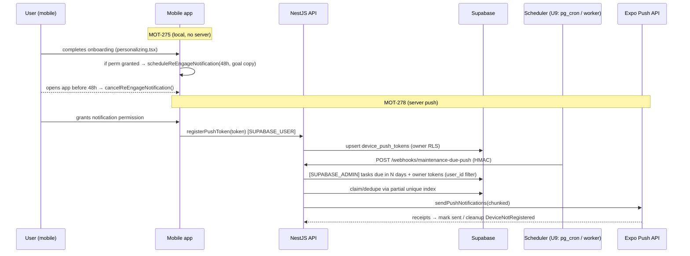

# feat: Day-2 re-engagement notification + server-side maintenance-due push (MOT-275/MOT-278) + test gap closure

## Summary

Three workstreams on a single new branch off `feat/growth-mot-269` (which carries the MOT-272 notification/analytics instrumentation these build on). PR #136 is untouched and merges separately; this PR targets `main`.

1. **Tests** — close two code-review gaps: the `first_expense` checklist 3-way routing and the `requestForegroundLocationPermission` coalescing util.
2. **MOT-275** — a single goal-personalized **local** notification ~48h after onboarding completion, cancelled if the user returns first. Almost entirely a reuse of the existing on-device notification system.
3. **MOT-278** — **server-side** push for maintenance-due reminders. Fully greenfield (no push token, no sender, no scheduler today). Split so the durable pieces (token registration + sender + a manually/HMAC-triggerable send run) land first, with automated scheduling as an explicitly flagged follow-up unit.

---

## Problem Frame

The growth diagnosis (`docs/Growth-Strategy-2026-06-29.md`) found the constraint is activation→retention: ~80% one-and-done, W4 ≈ 0%. MOT-275 and MOT-278 are the retention re-entry hooks. They were deferred only as a *prioritization* gate (wait for the notification grant rate before investing in server push) — the user has chosen to build now. The two tests close the highest-value coverage gaps the MOT-269 code review surfaced (checklist migration is already pinned; these two remain).

**Scope boundary:** local re-engagement (MOT-275) is a complete, shippable feature. Server push (MOT-278) lands its durable substrate now; the cron *automation* is a flagged unit that may defer to a follow-up PR if it outgrows this one (see U9 and Scope Boundaries).

---

## Requirements

- **R1** — A goal-personalized local notification is scheduled ~48h after onboarding completion, only when notification permission is granted, and is cancelled if the user opens the app before it fires. (MOT-275)
- **R2** — The day-2 notification's copy is personalized by the user's primary onboarding goal (`track_rides`, `manage_expenses`, …) with a sensible default, fully i18n'd (`t()`), keys present in every locale (i18n ratchet). (MOT-275)
- **R3** — The day-2 notification tap routes the user to a relevant in-app surface and emits the existing `reminder_scheduled` / `reminder_opened` analytics events with a distinct kind. (MOT-275)
- **R4** — A device's Expo push token is registered on permission grant and persisted per-user, RLS-protected. (MOT-278)
- **R5** — A server-side job finds maintenance tasks due in N days and sends a push via the Expo Push API to the owner's registered tokens, using the service-role client with explicit `user_id` filters, deduped so a user is not double-pushed for the same task/day. (MOT-278)
- **R6** — The send run is triggerable now (HMAC-guarded endpoint, RevenueCat-webhook pattern); automated scheduling is wired or explicitly flagged as a follow-up with the chosen mechanism documented. (MOT-278)
- **R7** — Unit tests cover the `first_expense` 3-way routing and the `requestForegroundLocationPermission` coalescing util. (Tests)
- **R8** — All work follows CLAUDE.md: no magic strings (typed `as const`), no hardcoded colors, date-fns for date math, generated GraphQL types (no `any`), RLS on all new tables, snake_case→camelCase mapped at the service layer. `main` stays green.

---

## Key Technical Decisions

- **KTD-1 — Reuse `apps/mobile/src/lib/notifications.ts` for MOT-275, do not invent a parallel scheme.** It already has the iOS-64 budget guard (`IOS_NOTIFICATION_BUDGET = 60`, shared across features), `Notifications.scheduleNotificationAsync`, cancel APIs, the `AsyncStorage` id-map (`@motovault/notification-map`), permission gate (`hasNotificationPermission`), and the `data.kind` deep-link contract. Add a new `NOTIFICATION_KIND.RE_ENGAGE` and a distinct storage keyspace (`reengage:` prefix or a separate key) rather than reusing the task-id map.
- **KTD-2 — Schedule hook is onboarding completion in `personalizing.tsx`.** `setOnboardingCompleted(true)` is called there (cold-start resume + "Open my garage" CTA). Schedule the day-2 notification there, gated on `hasNotificationPermission()`.
- **KTD-3 — Cancel-on-return at app foreground.** Cancel the re-engagement notification when the app becomes active / on root-layout mount with a live session (the user "returned"). Use the existing notification-map cancel pattern keyed by the new keyspace.
- **KTD-4 — Personalize by `RidingGoal` via a typed dispatch map**, not an if/else chain (per `feedback_programmatic_code`). Map `RidingGoal → { titleKey, bodyKey }` with a default. Note the `ridingGoals` taxonomy is partly deprecated (`onboarding.store.ts` comment) — read the user's stored goals, take the first/primary, fall back to a generic copy when absent or unrecognized.
- **KTD-5 — New `device_push_tokens` table, NOT a `users.push_token` column.** Lower-risk RLS: owner-write (`auth.uid() = user_id`), service-role read for the sender. Avoids touching the `users` column-grant surface (migration 00141). Matches the queue-table precedent.
- **KTD-6 — `registerPushToken` mutation uses `SUPABASE_USER`** (user writes their own token); the **send job uses `SUPABASE_ADMIN`** (cross-user system task) with explicit `user_id` filters as defense-in-depth (per `docs/solutions/security-issues/supabase-admin-client-on-public-queries.md`).
- **KTD-7 — Send trigger = HMAC-guarded `@Public()` controller**, mirroring `apps/api/src/modules/webhooks/revenuecat.controller.ts` (`safeCompare` against a secret, fails closed when unset, Zod-validated body). This makes the run testable/triggerable immediately without depending on a scheduler.
- **KTD-8 — Scheduling mechanism is the one genuinely open fork (see Open Questions / U9).** There is no in-NestJS cron (`@nestjs/schedule` absent), no Supabase edge functions, and `pg_net` is **not** enabled. Two precedented options: (a) enable `pg_net` + `pg_cron` → HTTP POST to the HMAC endpoint; (b) a Cloudflare Worker scheduled handler like `infra/social-worker`. Default recommendation: **(a)** for least new infra, but land U5–U8 first behind the manual trigger and treat U9 as flag-or-follow-up.
- **KTD-9 — Dedupe sends with a partial unique index** on a send-log/queue row (one maintenance-due push per `(user_id, task_id, due_bucket)`), per the gemini-autodraft learning (concurrent cron double-fire guard). Avoid app-level-only checks.
- **KTD-10 — Expo Push send via `expo-server-sdk`** (handles chunking, receipts, "DeviceNotRegistered" cleanup) over a raw `exp.host` fetch. New API dependency.
- **KTD-11 — Apply the migration via Supabase MCP `apply_migration`**, not `supabase db push` — the CLI push is blocked by pre-existing history drift (remote 00158 recorded as a timestamp version). Confirm RLS via advisors after.

---

## High-Level Technical Design

---

## Implementation Units

### U1. Test — `first_expense` checklist 3-way routing
- **Goal:** Pin the activation-critical routing branch in the onboarding checklist.
- **Requirements:** R7
- **Dependencies:** none
- **Files:** `apps/mobile/src/components/home/__tests__/onboarding-checklist.test.ts` (new); reads `apps/mobile/src/components/home/onboarding-checklist.tsx`
- **Approach:** Extract or test the routing decision for `FIRST_EXPENSE`. The branch: `firstBikeId` present → push `GARAGE_ROUTE.EXPENSE_DASHBOARD` with `motorcycleId`; bikesData resolved but empty → push `ADD_BIKE`; bikes still loading (`bikesData === undefined`) → push `TAB_ROUTE.GARAGE`. If the logic is inline in the component, extract a pure `resolveFirstExpenseRoute({ firstBikeId, bikesData })` helper (returns a typed `Href` / route descriptor) and test that — keeps the test free of full component render. Mirror mocking from `src/lib/__tests__/store-review.test.ts` (inline `jest.mock`) and `src/hooks/__tests__/resolve-weather-location.test.ts`.
- **Patterns to follow:** `store-review.test.ts`, `resolve-weather-location.test.ts`; `src/test/mocks.ts` (`makeMmkvMock`, `mockAnalytics`).
- **Test scenarios:**
  - firstBikeId present → returns EXPENSE_DASHBOARD route carrying that motorcycleId.
  - bikesData = `[]` (resolved, empty) → returns ADD_BIKE route.
  - bikesData = `undefined` (loading) → returns GARAGE tab route (fallback, never strands).
  - bikesData present with multiple bikes but no firstBikeId yet → falls back to GARAGE tab (loading-equivalent), not ADD_BIKE.
- **Verification:** New suite passes; `pnpm --filter mobile test -- onboarding-checklist` green.

### U2. Test — `requestForegroundLocationPermission` coalescing
- **Goal:** Pin the concurrent-call coalescing that guards the known double-permission-request crash.
- **Requirements:** R7
- **Dependencies:** none
- **Files:** `apps/mobile/src/utils/__tests__/location-permission.test.ts` (new); reads `apps/mobile/src/utils/location-permission.ts`
- **Approach:** Mock `expo-location`’s `requestForegroundPermissionsAsync` with a deferred promise. Assert two concurrent callers share one native call and the same resolution; after resolution `inFlight` clears so a subsequent call issues a fresh native request. Reset module state between tests (`jest.resetModules()` or re-import) since `inFlight` is module-level.
- **Patterns to follow:** `resolve-weather-location.test.ts` expo-location mock.
- **Test scenarios:**
  - Two concurrent calls → `requestForegroundPermissionsAsync` invoked exactly once; both callers resolve to the same status.
  - After the shared promise resolves, a third call → a second native invocation (inFlight cleared).
  - Native call rejects → both concurrent callers observe the rejection path; inFlight cleared so a retry re-requests (matches the reliability-review hardening).
- **Verification:** `pnpm --filter mobile test -- location-permission` green.

### U3. MOT-275 — schedule + cancel the day-2 re-engagement local notification
- **Goal:** Add the re-engagement notification primitive and wire scheduling at onboarding completion + cancellation on return.
- **Requirements:** R1, R2, R8
- **Dependencies:** none
- **Files:** `apps/mobile/src/lib/notifications.ts` (add `NOTIFICATION_KIND.RE_ENGAGE`, `scheduleReEngageNotification(goal)`, `cancelReEngageNotification()`, re-engage keyspace); `apps/mobile/src/app/(onboarding)/personalizing.tsx` (call schedule on completion, gated on `hasNotificationPermission()`); `apps/mobile/src/app/_layout.tsx` (cancel on foreground/return with a live session); `apps/mobile/src/i18n/locales/en.json` + all other locales (re-engage copy keys)
- **Approach:** New `NOTIFICATION_KIND.RE_ENGAGE`. `scheduleReEngageNotification(goal)`: respect the iOS-64 budget guard; trigger ~48h out; payload `{ kind: RE_ENGAGE }`; persist its id under a distinct key; emit `REMINDER_SCHEDULED` with `{ kind: 're_engage', goal }`. Goal→copy via a typed dispatch map (KTD-4) with a generic default. `cancelReEngageNotification()` clears it. Gate scheduling on permission; no-op silently otherwise.
- **Patterns to follow:** existing `scheduleMaintenanceReminder` / `cancelTaskNotification` / budget guard in `notifications.ts`; `as const` constants; `feedback_programmatic_code` dispatch map; `feedback_date_fns` for the 48h offset.
- **Test scenarios:**
  - Goal present → schedules one notification with the goal-specific copy keys and `kind: re_engage`; `REMINDER_SCHEDULED` fired once.
  - Permission not granted → schedules nothing, no throw.
  - Budget exhausted → no-op (mirrors existing guard).
  - `cancelReEngageNotification()` after scheduling → the persisted id is cancelled and cleared.
  - Unknown/absent goal → default copy keys used.
- **Verification:** Unit test for the schedule/cancel/goal-map logic green; i18n ratchet passes (keys in every locale).

### U4. MOT-275 — tap routing for the re-engagement notification
- **Goal:** Route a re-engagement tap to a relevant surface and emit `reminder_opened`.
- **Requirements:** R3
- **Dependencies:** U3
- **Files:** `apps/mobile/src/hooks/use-notification-deep-link.ts` (or the response handler in `apps/mobile/src/app/_layout.tsx`) — add a `RE_ENGAGE` branch
- **Approach:** On a response whose `data.kind === NOTIFICATION_KIND.RE_ENGAGE`, route to the home/garage surface (optionally the goal-relevant tab) and `trackEvent(REMINDER_OPENED, { kind: 're_engage' })`. Reuse the existing cold+warm-start handling and UUID-validation guards already in the deep-link hook.
- **Patterns to follow:** existing `MAINTENANCE`/`DOCUMENT` branches and `data.kind` discriminator.
- **Test scenarios:**
  - Response with `kind: re_engage` → routes to the expected surface and fires `REMINDER_OPENED` with `kind: re_engage`.
  - Cold-start (app launched from the notification) → same routing.
  - Unknown kind → no route change (existing default).
- **Verification:** Deep-link hook test green; manual sim tap routes correctly.

### U5. MOT-278 — `device_push_tokens` table + migration
- **Goal:** Persist per-user Expo push tokens, RLS-protected.
- **Requirements:** R4, R8
- **Dependencies:** none
- **Files:** `supabase/migrations/00160_device_push_tokens.sql` (new)
- **Approach:** Table `device_push_tokens(id, user_id → users, token text unique, platform text, created_at, updated_at, last_seen_at)`. `ENABLE ROW LEVEL SECURITY`. Owner policies: `SELECT/INSERT/UPDATE/DELETE USING/ WITH CHECK (auth.uid() = user_id)`. Service-role bypasses RLS for the sender read. Unique on `token`; index on `user_id`. Apply via MCP `apply_migration` (KTD-11); verify with security advisors (no `rls_disabled_in_public`).
- **Patterns to follow:** RLS templates in `docs/solutions/security-issues/expense-rls-idor-motorcycle-ownership.md`; queue-table grants in `00088_social_post_queue.sql`.
- **Test scenarios:** `Test expectation: none` for the SQL itself; covered by U6 service tests + advisor check. Verification query: anon INSERT denied, owner INSERT allowed.
- **Verification:** Advisor shows RLS enabled; `device_push_tokens` not in `rls_disabled_in_public`.

### U6. MOT-278 — `registerPushToken` mutation (API)
- **Goal:** GraphQL mutation for a user to register/refresh their device token.
- **Requirements:** R4, R8
- **Dependencies:** U5
- **Files:** `packages/types/src/validators/push-token.ts` (new, `RegisterPushTokenSchema` + inferred type, exported from `index.ts`); `apps/api/src/modules/push-tokens/` (new module: `push-tokens.module.ts`, `.resolver.ts`, `.service.ts`, `dto/register-push-token.input.ts`); register module in `apps/api/src/app.module.ts`; run `pnpm generate`; add the mobile `.graphql` mutation under `apps/mobile/src/graphql/mutations/register-push-token.graphql`
- **Approach:** Resolver `@UseGuards(GqlAuthGuard)`, `@CurrentUser()`, Zod-validated input `{ token, platform }`. Service maps camelCase→snake_case, **upsert on `token`** via `SUPABASE_USER` (user writes own row), setting `user_id = currentUser.id`, `last_seen_at = now()`. Return a small typed payload.
- **Patterns to follow:** `maintenance-tasks.resolver.ts:54-61`, `dto/create-maintenance-task.input.ts`, `ZodValidationPipe`, the dual-client DI in `maintenance-tasks.service.ts`.
- **Test scenarios:**
  - Valid token → row upserted with the caller's `user_id`; second call with same token updates `last_seen_at`, no duplicate.
  - Token owned by another user → RLS prevents reassign (defense-in-depth).
  - Invalid input (empty/oversized token) → Zod rejects.
- **Verification:** `pnpm generate` clean; API spec tests green; mutation typechecks against generated client types.

### U7. MOT-278 — mobile push-token registration on permission grant
- **Goal:** Acquire and register the Expo push token when permission is granted.
- **Requirements:** R4
- **Dependencies:** U6
- **Files:** `apps/mobile/src/lib/notifications.ts` or a new `apps/mobile/src/lib/push-token.ts` (`registerForPushNotifications()`); call sites where permission becomes granted — `apps/mobile/src/app/(onboarding)/notifications.tsx` (post-grant) and the maintenance permission path; uses `RegisterPushTokenDocument`
- **Approach:** After a granted result, call `Notifications.getExpoPushTokenAsync({ projectId })` (EAS project id from config), then the `registerPushToken` mutation via the existing gql fetcher/TanStack mutation. Idempotent; swallow/log errors (never block UX). Re-register on app start if granted (token refresh).
- **Patterns to follow:** existing permission flow in `notifications.tsx`; gql mutation hooks; EAS projectId already in `app.config.ts`.
- **Test scenarios:**
  - Granted → `getExpoPushTokenAsync` called and mutation fired with the token + platform.
  - Not granted → no token fetch, no mutation.
  - Mutation error → caught, does not throw into the UI.
- **Verification:** Unit test for the register helper green; on-device token appears in `device_push_tokens`.

### U8. MOT-278 — Expo Push sender + maintenance-due run + HMAC trigger endpoint
- **Goal:** A runnable send path that finds due tasks and pushes to owners, deduped, triggerable now.
- **Requirements:** R5, R6, R8
- **Dependencies:** U5, U6
- **Files:** `apps/api/src/modules/push-tokens/push-sender.service.ts` (or a `maintenance-push` service) using `expo-server-sdk` (new dep); a send-log table migration `supabase/migrations/00161_maintenance_push_log.sql` with the dedupe partial unique index; `apps/api/src/modules/webhooks/maintenance-due-push.controller.ts` (`@Public()`, HMAC-guarded); env `MAINTENANCE_PUSH_SECRET`; Zod schema for the trigger body
- **Approach:** Endpoint authenticates via `safeCompare` against `MAINTENANCE_PUSH_SECRET` (fails closed when unset). Run: with `SUPABASE_ADMIN`, query `maintenance_tasks WHERE status IN ('pending','in_progress') AND due_date = current_date + N AND deleted_at IS NULL` (explicit per-user filter retained), join owner tokens from `device_push_tokens`, insert a `maintenance_push_log` row guarded by a **partial unique index on `(user_id, task_id, due_date)`** to dedupe (KTD-9), then `expo.sendPushNotificationsAsync` (chunked) and handle receipts — delete tokens that return `DeviceNotRegistered`. Emit a PostHog/server log on N consecutive failures (observability gap from the autodraft learning).
- **Patterns to follow:** `webhooks/revenuecat.controller.ts` (HMAC, fail-closed, Zod body); `claim_next_social_post` dedupe/locking precedent; `SUPABASE_ADMIN` system-task rule.
- **Test scenarios:**
  - Tasks due in N days with a registered owner token → one push per task; log row written.
  - Re-run same day → dedupe index prevents a second push.
  - Owner has no token → skipped, no error.
  - `DeviceNotRegistered` receipt → token row removed.
  - Missing/invalid HMAC → 401, no send (fail closed when secret unset).
- **Verification:** API spec tests green; a manual `curl` with the secret against the endpoint sends to a seeded token.

### U9. MOT-278 — scheduling wiring (FLAGGED: land or defer)
- **Goal:** Automate the send run on a daily schedule.
- **Requirements:** R6
- **Dependencies:** U8
- **Files:** EITHER `supabase/migrations/00162_schedule_maintenance_push.sql` (enable `pg_net`, `cron.schedule(... net.http_post → /webhooks/maintenance-due-push with the HMAC header)`) OR `infra/maintenance-push-worker/` (Cloudflare Worker scheduled handler + `wrangler.toml`, mirroring `infra/social-worker`)
- **Approach:** **Decision fork (KTD-8) — resolve at execution.** Default: pg_cron + `pg_net` POST to the HMAC endpoint (least new infra), since `pg_cron` is already enabled (00035) and the endpoint exists from U8. If enabling `pg_net` or storing the secret in the DB is undesirable, fall back to a Cloudflare Worker like `social-worker`. **If this unit outgrows the PR, ship U5–U8 (token registration + sender + manual HMAC trigger) and defer U9 to a follow-up — say so explicitly in the PR body** rather than half-wiring a scheduler.
- **Patterns to follow:** `00035_cron_hard_delete...sql` (pg_cron), `infra/social-worker` (worker), `docs/solutions/integration-issues/scheduled-social-worker-cron-migration.md` (cron must be co-located with the destination; history-drift recovery).
- **Test scenarios:** `Test expectation: none` (infra wiring) — verify by observing one scheduled run reaching the endpoint and producing a log row in a staging window.
- **Verification:** A scheduled tick invokes the endpoint and writes a `maintenance_push_log` row; or, if deferred, the PR body documents the deferral and the chosen mechanism.

---

## Scope Boundaries

**In scope:** the two tests; the complete local day-2 re-engagement feature; the server-push substrate (token table, mutation, mobile registration, sender + dedupe + HMAC-triggerable run).

### Deferred to Follow-Up Work
- **U9 automated scheduling** may defer to a follow-up PR if it outgrows this one (the manual HMAC trigger keeps MOT-278 functional meanwhile).
- Cross-instance rate limiting / circuit breaking on `exp.host` (Upstash Redis pattern) — only if send volume warrants.
- A user-facing "manage reminders / notification preferences" surface (would use the user client, not this system path).
- Reading the 2026-07-29 grant-rate data to tune targeting — orthogonal, owned by the growth re-check routine.

**Out of scope:** changing the existing maintenance local-reminder behavior; MOT-276/277/279/280/281/282.

---

## Risks & Dependencies

- **Migration history drift** — `supabase db push` is blocked on `main` (remote 00158 = timestamp version). Apply new migrations via MCP `apply_migration` (as 00159 was). Risk: local migration files (00160/00161) won't match remote version strings; acceptable given the drift is pre-existing and a human reconciliation is already tracked.
- **PostHog dev-disable** — new notification events only populate on a release build; don't read them as zero from Metro.
- **iOS-64 notification budget** — the re-engagement notification competes with maintenance/document reminders; honor the shared guard.
- **Expo Push token validity** — handle `DeviceNotRegistered` cleanup, or the token table accumulates dead rows.
- **Secret management** — `MAINTENANCE_PUSH_SECRET` must be set in the API env or the endpoint fails closed (intended). Document it in `.env.example`.
- **`ridingGoals` taxonomy partly deprecated** — default copy must be robust to absent/legacy goal values.

---

## Test / Verification Strategy

- Mobile: Jest (`jest-expo`), mocks via `src/test/mocks.ts`; new suites for U1, U2, U3 (schedule/cancel/goal-map), U4 (tap routing), U7 (register helper).
- API: Vitest spec tests for U6 (mutation) and U8 (sender/run/HMAC).
- DB: Supabase security advisors after U5/U8 migrations (no `rls_disabled_in_public`).
- Pipeline: `pnpm generate` after resolver/.graphql edits; `pnpm precheck` green before PR; i18n ratchet for new locale keys.

---

## Sources & Research

- `apps/mobile/src/lib/notifications.ts`, `apps/mobile/src/app/(onboarding)/personalizing.tsx`, `apps/mobile/src/app/_layout.tsx`, `apps/mobile/src/hooks/use-notification-deep-link.ts`, `apps/mobile/src/lib/analytics.ts`, `apps/mobile/src/test/mocks.ts`.
- `apps/api/src/modules/webhooks/revenuecat.controller.ts`, `apps/api/src/modules/maintenance-tasks/*`, `apps/api/src/modules/supabase/*`.
- `supabase/migrations/00020`, `00035`, `00079`, `00088`, `00141`.
- `docs/solutions/integration-issues/scheduled-social-worker-cron-migration.md`, `gemini-autodraft-social-worker.md`, `posthog-onboarding-funnel-instrumentation.md`; `docs/solutions/security-issues/supabase-admin-client-on-public-queries.md`, `expense-rls-idor-motorcycle-ownership.md`.
- `docs/Growth-Strategy-2026-06-29.md`, `docs/HANDOFF-Growth-MOT-269.md`.
