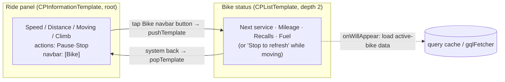

# feat: CarPlay Bike-Status View (U8)

## Summary

Add a second CarPlay surface to the companion: a **Bike status** view reachable from the live Ride panel, showing next service, current mileage, recall count, and latest fuel for the active (`isPrimary`) motorcycle. This delivers the richer telemetry the 4-row Ride panel can't hold (Apple caps `CPInformationTemplate` at 4 rows). Data loads on entry from existing GraphQL; while the ride is moving the view collapses to a single "Stop to refresh" row (R20); units follow the global measurement preference; the whole surface is a safe no-op when the native module is absent and never disturbs a recording ride.

---

## Problem Frame

The Ride panel (`carplay-templates.ts` → `CPInformationTemplate`) is glance-optimized and full: Speed / Distance / Moving / Climb. Riders also want pre-ride and at-stop context the phone already computes — next service, mileage, recalls, fuel — but there's no way to reach it from the head unit. U8 in the origin plan specified this as a second tab. Research revises the delivery mechanism (see KTD1): the adopted library has no tab-bar template, so this ships as a **pushed secondary template**, not a tab.

---

## Key Technical Decisions

- **KTD1 — No CarPlay tab bar in `@iternio/react-native-auto-play` v0.5.4; use template-push navigation instead.** The installed library exposes only Grid/Information/List/Map/Message/Search/SignIn templates — there is **no `CPTabBarTemplate` wrapper** (verified in `node_modules/@iternio/react-native-auto-play/lib/templates/`). The origin plan's "CPTabBar root (Ride | Bike)" is therefore not buildable without forking the native pod. Instead, the Ride `InformationTemplate` stays the root and gains a **"Bike" navigation-bar button** (`headerActions.ios.trailingNavigationBarButtons`) that **pushes** a `CPListTemplate`; the system back button pops it. This stays within the Driving Task template-depth-2 limit (origin: depth 2/3) and reuses `pushTemplate`/`popTemplate` the library already provides.

- **KTD2 — Load-on-entry via the template's `onWillAppear` config callback, not a global render-state listener.** `TemplateConfig` carries `onWillAppear`/`onDidAppear` (in `templates/Template.d.ts`). The Bike list rebuilds its sections in `onWillAppear` so the data is fresh each time it's opened, without a persistent subscription. (The library's `addListenerRenderState` is keyed by module name, not per-template, so it's the wrong tool here.)

- **KTD3 — `maximumItemCount` is not exposed by the library; truncate to a safe constant.** No `getMaximumItemCount`/`maximumItemCount` accessor exists in v0.5.4. The Bike list produces a small fixed set of rows (≈4–6), well under any head unit's cap, and truncates defensively to a `MAX_LIST_ROWS` constant (12) rather than querying at runtime. Recorded as an execution assumption; revisit if a head unit clips rows.

- **KTD4 — Read data from the TanStack Query cache first, fetch on miss.** The coordinator runs outside React (no hooks), so it reads via `queryClient.getQueryData(queryKeys...)` for `my-motorcycles` (usually already cached by the garage tab) and calls `gqlFetcher(Document)` on `onWillAppear` for the per-bike maintenance/fuel data. Reuses `gqlFetcher`, `queryKeys`, and the existing `.graphql` documents — no new API surface (KTD8 from origin: reuse engine/data, don't fork).

- **KTD5 — Root rebuilds must not drop the pushed Bike list.** The coordinator's `renderInformation` calls `setRootTemplate()` on a Ride state transition (title/actions change), which resets the stack root and would pop a visible Bike list. Track a `bikeVisible` flag: while the Bike list is on top, suppress Ride-panel *rebuilds* (row `updateItems` still applies in place; a pending title/action change is deferred and flushed when the list pops). This keeps a recording ride's data live under the Bike view without yanking the rider out of it. **Critical (deepening finding): the guard must cover `forceRender()` too, not just `render()`.** `forceRender()` (`carplay-coordinator.ts:79`) calls `renderInformation()` directly, and the stop-guard arm/cancel/auto-disarm paths each call `forceRender()` with a changed title+actions ("STOP RIDE?" ↔ state word) → an unguarded `setRootTemplate` that would pop the Bike list mid-view. Both `render()` and `forceRender()` must honor `bikeVisible` and defer the rebuild.

- **KTD6 — R20 motion guard.** On `onWillAppear`, if the ride is actively recording and moving (`status === 'recording' && recordingSubState === 'moving'`), render a single "Stop to refresh" row instead of firing queries — no network churn or stale numbers while riding. Stopped / auto-paused / idle render the full status.

---

## High-Level Technical Design

Navigation shape (push, not tabs):



Data assembly (pure, testable):

```
buildBikeStatusSections(input, system) ->
  moving?  -> [ single row: "Stop to refresh" ]
  no bike? -> [ single row: "No bike set" ]
  else     -> rows: Next service (health-score), Mileage, Recalls, Fuel
              each row: { title, detailedText }  (informational, no onPress)
              truncated to MAX_LIST_ROWS
```

---

## Requirements Trace

- **R19** (bike status: next service, mileage, recalls, fuel) → U2, U3
- **R20** (while moving, don't show stale values) → U2 (motion branch), U3 (`onWillAppear` guard), KTD6
- **KTD8 origin** (reuse queries/formatters/units) → U2, U3
- **Degradation** (no-op when module absent) → U1, U3
- **Two-surface non-interference** (Bike view must not disturb a recording ride) → U3, KTD5

---

## Implementation Units

### U1. Extend the adapter with ListTemplate + push/pop navigation

- **Goal:** Give the coordinator a thin, degradation-safe API to render and navigate a `CPListTemplate`, mirroring the existing `renderInformation` seam.
- **Requirements:** R19; KTD1, KTD2, KTD3
- **Dependencies:** none
- **Files:** `apps/mobile/modules/carplay/src/index.ts` (modify), `apps/mobile/modules/carplay/src/__tests__/carplay-adapter.test.ts` (modify)
- **Approach:** Add types `CPListRow { title; detail }` and `CPListSectionModel { rows: CPListRow[] }`. Add:
  - `pushBikeList(model, onWillAppear)` — builds a `ListTemplate` (single default section, rows mapped to `{ type:'text', title, detailedText }`, `onWillAppear` from the config callback), tracks the instance, and calls `.push()`. Rebuild-vs-update parity with `renderInformation`: if a list is already pushed, `updateSections` in place instead of re-pushing.
  - `updateBikeList(model)` — `current.updateSections(...)` on the tracked list, `.catch` → `captureException` (mirror the fire-and-forget hardening already in `renderInformation`).
  - `popBikeList()` — `HybridAutoPlay.popTemplate()` and drop the tracked reference; safe no-op if nothing pushed.
  - All functions early-return when `!lib` (module absent). Truncate rows to `MAX_LIST_ROWS = 12`.
  - **Header actions on the Information root (deepening finding):** `CPInformationTemplateModel` currently has only `title`/`items`/`actions` (`index.ts:37`) and `buildTemplate` (`index.ts:96`) constructs the template without `headerActions`. Add an optional `headerActions` field to the model + pass it through `buildTemplate` as `headerActions.ios.trailingNavigationBarButtons`. **The `lastActionsKey` identity check (`index.ts:71`) must also fold in header-button presence**, or a render that only adds/removes the "Bike" button won't trigger the needed rebuild.
- **Patterns to follow:** the existing `renderInformation`/`toRows` structure in the same file (min-1 guard, `InformationItems[number][]` typing, `.catch(captureException)`); the verified `ListTemplate.updateSections(sections)` + `Template.push()`/`HybridAutoPlay.popTemplate()` signatures; `InformationTemplateConfig.headerActions` + `HeaderActionsIos.trailingNavigationBarButtons` (`templates/{InformationTemplate,Template}.d.ts`).
- **Test scenarios:**
  - `pushBikeList` builds a `ListTemplate` and calls `push()` once; a second call with new rows calls `updateSections`, not a second `push`.
  - `onWillAppear` passed to the config is invoked when the mock fires it (load-on-entry hook wired); assert `onDidDisappear` is likewise forwarded to the native config (pop-detection path — see U3 fallback).
  - Empty rows → falls back to a single placeholder row (never an empty section), mirroring the Information min-1 guard.
  - A rejected `updateSections`/`push` routes to `captureException` (mock rejects; assert). Covers the fire-and-forget contract.
  - Information template with a header action rebuilds when the header button is added/removed (asserts `lastActionsKey` folds in header identity).
  - Module-absent (lib=null): `pushBikeList`/`popBikeList` are no-ops and do not throw.
- **Verification:** From JS the adapter renders a `CPListTemplate` on the simulator, the back button pops it, and `onWillAppear` fires on each open.

### U2. Pure bike-status section assembler

- **Goal:** A React-free, unit-tested builder: (active bike + tasks + fuel + ride motion + units) → list section model.
- **Requirements:** R19, R20; KTD3, KTD6, KTD8
- **Dependencies:** U1 (for the row/section types)
- **Files:** `apps/mobile/src/features/carplay/carplay-bike-status.ts` (create), `apps/mobile/src/features/carplay/__tests__/carplay-bike-status.test.ts` (create)
- **Approach:** `buildBikeStatusSections(input, system)` where `input = { moving: boolean; bike: Motorcycle | null; tasks: TaskInput[]; latestFuel: FuelLog | null }`. Branch order: moving → single `Stop to refresh` row (R20); no bike → single `No bike set` row; else rows:
  - **Next service** — **`computeHealthScore` returns only `{ score, grade, hasData, overdueTasks, urgentTasks }` — no task names (deepening finding).** The assembler must itself select the single most-urgent task: sort by overdue-first, then soonest due date, then priority weight for ties, mirroring `src/hooks/use-home-data.ts` (the existing next-service selection precedent), and use `getRelativeDueDate(dueDate)` for the relative string. Show that task's name + relative due; dashes when there are no tasks.
  - **Mileage** — `bike.currentMileage` formatted via `ride-formatters` distance/`formatDistanceValue` honoring `system` (respect `bike.mileageUnit` vs global pref — follow existing garage handling); dash when null.
  - **Recalls** — `bike.recallCount`: `0` → safe "No open recalls"; `>0` → "N open recall(s)".
  - **Fuel** — latest fuel log date/volume/cost; dash when none.
  - Truncate to `MAX_LIST_ROWS`. Never emit `0`-as-real; use dashes for missing (origin R7/R8 idiom).
- **Patterns to follow:** `deriveSnapshot`/`formatClimb` in `carplay-templates.ts` (pure builder + dash discipline); `src/lib/health-score.ts` for next-service selection; `ride-formatters.ts` + measurement system.
- **Test scenarios:**
  - Happy path: full bike + tasks + fuel → 4 rows (next service, mileage, recalls, fuel) with expected strings.
  - `moving: true` → exactly one "Stop to refresh" row, no service/mileage rows (Covers R20).
  - `bike: null` → single "No bike set" row.
  - `recallCount: 0` → safe row; `recallCount: 3` → warning row (Covers R19).
  - Missing mileage / no tasks / no fuel → dashes, never `0` or `NaN`.
  - Imperial vs metric: mileage + any distance render in the selected unit.
  - More than `MAX_LIST_ROWS` inputs → truncated (guard holds even though normal input is small).
- **Verification:** `pnpm --filter mobile test` green; assembler is pure (no store/native imports).

### U3. Coordinator wiring: Bike nav button, load-on-entry, motion guard, root-rebuild coordination

- **Goal:** Reach the Bike list from the Ride panel, load active-bike data on entry, honor R20, and never drop/disturb the recording Ride panel.
- **Requirements:** R19, R20; KTD1, KTD4, KTD5, KTD6
- **Dependencies:** U1, U2
- **Files:** `apps/mobile/src/features/carplay/carplay-coordinator.ts` (modify), `apps/mobile/src/features/carplay/carplay-templates.ts` (modify — add a `bike` header action to the Information model + `CARPLAY_ACTION.bike`), `apps/mobile/src/features/carplay/__tests__/carplay-coordinator.test.ts` (modify), `apps/mobile/src/lib/query-keys.ts` (reference only)
- **Approach:**
  - Add `CARPLAY_ACTION.bike` and surface it as a **nav-bar (header) button** on the Ride `InformationTemplate` (keeps the ≤3 action slots for ride controls). Thread header actions through `buildPanelItems` → the adapter's `buildTemplate` (`headerActions.ios.trailingNavigationBarButtons`).
  - `onAction('bike')` → build the current bike-status model and `pushBikeList(model, onBikeWillAppear)`; set `bikeVisible = true`.
  - `onBikeWillAppear()` → read ride motion; if moving, `updateBikeList(stopToRefresh)` (KTD6); else resolve the active bike. **The cache holds `MyMotorcyclesQuery`, not a bare array (deepening finding):** unwrap `(queryClient.getQueryData(queryKeys.motorcycles.all) as MyMotorcyclesQuery)?.myMotorcycles ?? []` then `.find(b => b.isPrimary) ?? [0]` — exactly as `use-carplay.ts:51` does. Then fetch tasks + fuel for that bike via `gqlFetcher` (cache-first), assemble via `buildBikeStatusSections`, and `updateBikeList`.
  - **KTD5 coordination:** gate `setRootTemplate` in **both** `render()`'s transition branch **and** `forceRender()` so that while `bikeVisible`, a title/action change sets a `pendingRootRebuild` flag instead of pushing a new root. Row `updateItems` still applies in place. Detect pop via the list's `onDidDisappear` config callback → `bikeVisible = false`, flush any pending rebuild, `render()`.
  - **`onDidDisappear` fallback (deepening finding — native callback unverifiable from types):** the lifecycle callback is forwarded to Swift via Nitro but not confirmable without a device (`Template.d.ts` warns `onPopped` is partial on iOS). If it proves unreliable on-device, fall back to clearing `bikeVisible` on the next Ride-panel `onAction`/connect, or re-assert the root on a short timer. Keep the pop-detection isolated so the fallback is a one-line swap.
  - Reset `bikeVisible`/pending flag + `popBikeList()` in `onDisconnect` and `__resetCarPlayCoordinator`.
- **Patterns to follow:** existing `onAction` dispatch table + `CARPLAY_ACTION` const; `forceRender`/`render` throttle structure; `use-carplay.ts` for `gqlFetcher`+`queryKeys`+active-bike selection; `useAuthStore.getState().measurementSystem` for units outside React.
- **Test scenarios:**
  - `onAction('bike')` calls `pushBikeList` once; the model reflects the active `isPrimary` bike from the cache.
  - `onBikeWillAppear` while `recording`+`moving` renders the "Stop to refresh" row and does **not** call `gqlFetcher` (Covers R20).
  - `onBikeWillAppear` while stopped/idle assembles the full status from cache/fetch.
  - **Non-interference:** with the Bike list visible, a Ride state transition (recording→autoPaused) does **not** call `setRootTemplate` (no pop); the pending rebuild flushes after the list pops (Covers KTD5).
  - **Stop-guard under Bike:** with the Bike list visible, firing `stop` (which routes through `forceRender`) does **not** call `setRootTemplate` (Covers KTD5 forceRender path).
  - A recording ride's row updates still apply while Bike is visible (`updateItems` called, `setRootTemplate` not).
  - `onBikeWillAppear` unwraps `MyMotorcyclesQuery.myMotorcycles` and selects the `isPrimary` bike (asserts the cache shape is handled, not treated as a bare array).
  - Disconnect with Bike visible pops it and clears `bikeVisible`.
  - Module-absent: `onAction('bike')` is a safe no-op.
- **Verification:** Simulator — the Bike button opens the list, back returns to a still-live Ride panel; moving shows "Stop to refresh"; a state change under the list doesn't yank the rider out.

### U4. Head-unit label strings (match the existing hardcoded-English CarPlay pattern)

- **Goal:** Define the new Bike-view strings consistently with the rest of the CarPlay surface.
- **Requirements:** R19 (labels); consistency with shipped CarPlay code
- **Dependencies:** U2, U3
- **Files:** `apps/mobile/src/features/carplay/carplay-bike-status.ts` (the strings live with the assembler); NO locale-file changes.
- **Approach:** **Deepening finding — every existing CarPlay head-unit string is hardcoded English** (`'RECORDING'`, `'STOP RIDE?'`, `'Keep Riding'`, `'Pause'`, `'Climb'`, …) — none go through `i18n.t()`, and the `no-literal-string` guard is jsx-text-only so non-JSX `.ts` label strings are not flagged. The Bike view is entirely head-unit (no phone `<Text>`), so its strings ("Bike", "Next service", "Mileage", "Recalls", "Fuel", "Stop to refresh", "No bike set", recall counts) should be **hardcoded English `as const` constants matching the existing pattern** — not new `i18n.t` keys. This keeps the CarPlay surface internally consistent and adds **zero** locale-parity burden (no `en.json`/13-locale churn, no CI-parity risk). Full localization of *all* CarPlay head-unit strings is tracked as one deferred cleanup, not split across features.
- **Test scenarios:** `Test expectation: none` — label constants only; covered indirectly by the U2 assembler string assertions.
- **Verification:** `pnpm --filter mobile test` green; no new hardcoded-string lint regressions (jsx-text-only guard unaffected).

---

## Scope Boundaries

### In scope
Bike-status list reachable from the Ride panel; active (`isPrimary`) bike only; next service / mileage / recalls / fuel; R20 motion guard; degradation + non-interference.

### Deferred to follow-up work
- Bike **switching** from the head unit (v1 shows only the active bike).
- Tappable rows that drill into task/fuel detail (rows are informational for v1).
- A true `CPTabBarTemplate` (would require extending/forking the native pod — revisit only if the library adds tab support).
- Localizing **all** CarPlay head-unit strings (the whole surface is hardcoded English today) — one deliberate cleanup, not split across features (see U4).

### Outside this product's identity (from origin)
Porting the full phone garage UI to CarPlay; editing bike data from the head unit.

---

## Risks & Dependencies

- **Root-rebuild vs pushed list (KTD5) is the highest-risk interaction** — an unguarded `setRootTemplate` while the list is visible pops the rider out. Mitigation: `bikeVisible` guard + deferred rebuild, with an explicit non-interference test. Validate on the simulator.
- **Data freshness off the query cache (KTD4)** — cache may be empty on a cold CarPlay launch with no phone foreground. Mitigation: cache-first, `gqlFetcher` fallback on `onWillAppear`; dashes while loading (never zeros).
- **`onWillAppear`/`onDidDisappear` reliability on the real head unit** — the pop-detection hook is simulator-verified only; confirm on the Africa Twin (same on-bike gate as the rest of the CarPlay work).
- **No OTA** — native-adjacent only in that it rides the existing CarPlay build; no new native code, so no new build required beyond what already shipped.

---

## Open Questions

### Deferred to execution
- **Shared `QueryClient` access outside React:** confirm a singleton `queryClient` is importable in the coordinator (non-React) for the cache-read in KTD4. If none is exported, drop the cache-read and use `gqlFetcher` directly on `onWillAppear` (it works standalone) — the plan already specifies fetch-on-miss, so this only removes the optimization, not the behavior.
- Exact `mileageUnit`-vs-global-preference reconciliation for the mileage row (follow whatever the garage screen already does).
- Whether the "Bike" affordance reads better as a nav-bar header button (KTD1 default) or a 3rd action button on the Ride panel — decide on-device by glanceability; both are one-line changes.
- The precise `onDidDisappear`-based pop detection vs a back header action — pick whichever the library fires reliably in the simulator.

---

## Sources & Research

- Library API verified against installed types: `node_modules/@iternio/react-native-auto-play/lib/templates/{ListTemplate,Template}.d.ts`, `specs/AutoPlay.nitro.d.ts` — **no TabBar template exists** (KTD1); `ListTemplate.updateSections`, `Template.push`/`onWillAppear`, `HybridAutoPlay.popTemplate` confirmed; no `maximumItemCount` accessor (KTD3).
- Data: `apps/mobile/src/graphql/queries/{my-motorcycles,maintenance-tasks-by-motorcycle,motorcycle-recalls,fuel-logs}.graphql` (all present); `apps/mobile/src/lib/health-score.ts` (`computeHealthScore`, `getRelativeDueDate`).
- Existing CarPlay code: `apps/mobile/src/features/carplay/{carplay-coordinator,carplay-templates,use-carplay}.ts`, `apps/mobile/modules/carplay/src/index.ts`.
- Origin: `docs/plans/2026-06-25-001-feat-carplay-ride-companion-plan.md` (U8, R19/R20, KTD8, depth-2 limit).
