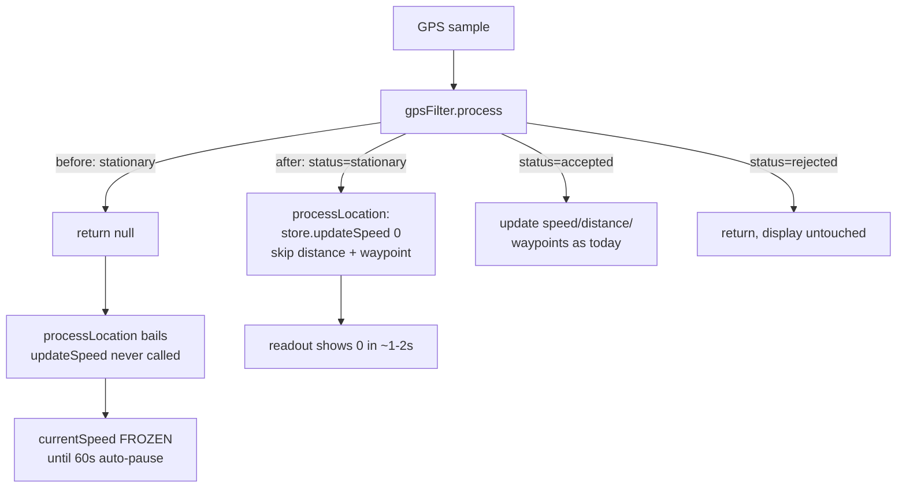
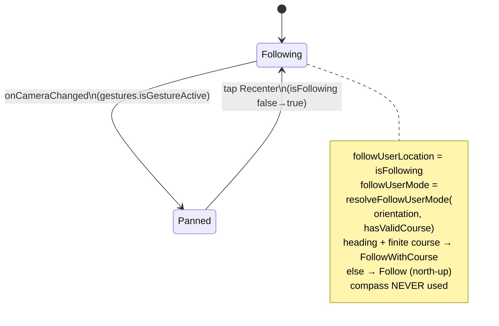

# fix: Ride HUD overhaul — map orientation, recenter, speed-to-zero

## Summary

Three ride-recording HUD defects from **beta feedback** (2026-07-15) fixed in one pass, scoped strictly to the active ride-recording surface (`src/app/(modals)/ride-hud.tsx` and its `src/components/ride/*` children):

- **A — Map orientation choice** (his top request, asked 3×): add a **North up / Heading up** toggle in settings. Heading-up rotates the map so the direction of travel always points up. Re-enables the previously-disabled course-up camera **safely** (course-based, never the compass that crashed `MOTO-VAULT-REACT-NATIVE-16`).
- **B — Recenter button**: panning the map breaks follow with no way to re-arm it; the track drifts off-screen. Add a recenter control that re-arms follow.
- **C — Speed reads 0 on stop** (real bug): the big speed readout freezes on its last value when stopped because the GPS filter rejects stationary samples and never pushes a fresh speed. Make a stopped rider read **0** promptly without weakening the Kalman/drift-rejection that distance depends on.

**Out of scope** (already merged): backdate/log-past-work (#164), unit-label fixes (#164/#165).

---

## Problem Frame

The ride HUD is rendered by `RideHudScreen` (`src/app/(modals)/ride-hud.tsx`), which reads live stats from the `useRideStore` Zustand store and swaps between two presentational layouts (`HudLayoutA`, `HudLayoutB`), both of which embed the shared `HudMap`. GPS samples arrive through a background `TaskManager` task in `src/utils/ride-location.ts`, pass through the singleton `gpsFilter` (`src/utils/ride-gps-filter.ts`), and update the store.

Three independent seams are broken:

1. **`HudMap` is hard-locked north-up.** `MapboxGL.Camera` uses `followUserMode={UserTrackingMode.Follow}` (`"normal"` = north-up). Course-up was intentionally removed after `FollowWithHeading` (`"compass"`) crashed with *"Cannot round NaN value"* on low-end sensors (Sentry `MOTO-VAULT-REACT-NATIVE-16`). There is no user setting for orientation.
2. **Follow never re-arms.** `Camera` uses the declarative `followUserLocation` prop (always on). A user pan stops native following, but nothing flips a React state back, so follow cannot be re-armed and no control exists to trigger it.
3. **Display speed freezes when stopped.** `gpsFilter.process` returns `null` for stationary samples (`segmentDistance < acc * 1.2 && smoothedSpeed < 1.0`, `ride-gps-filter.ts:231`). `processLocation` bails on `null` (`ride-location.ts:294`) **before** calling `store.updateSpeed`, so `currentSpeed` keeps its last non-zero value. It is only zeroed by the auto-pause `updateSpeedZero` effect after `AUTO_PAUSE_DURATION_MS` (60 s). The rider sees a stale speed for up to a minute after stopping.

---

## Requirements

- **R1** — A persisted user preference selects ride-map orientation: `north` (fixed, north-up) or `heading` (course-up, track points up). Default `north` (preserves today's behavior; heading-up is opt-in).
- **R2** — The preference is exposed as a segmented control in the profile settings screen (`preferences-section.tsx`), matching the existing Units/Theme segmented-control pattern.
- **R3** — Heading-up rotates the map by GPS **course** (movement direction), never the device compass/heading sensor. `compassEnabled={false}` stays; the puck keeps `puckBearing="course"`.
- **R4** — The course-up camera must not feed a `NaN` bearing to the native layer: it stays north-up until a finite course sample has been observed, then switches to course-up (defense-in-depth against the `MOTO-VAULT-REACT-NATIVE-16` crash class).
- **R5** — A recenter control re-arms follow after the user pans the map. It is visible in both `HudLayoutA` and `HudLayoutB`, positioned so it does not collide with each layout's chrome.
- **R6** — Panning the map sets follow to off (so the recenter affordance is meaningful); tapping recenter turns it back on and the camera returns to the rider.
- **R7** — When the rider is stopped, the speed readout shows `0` within one or two GPS samples (≈1–2 s), not after 60 s.
- **R8** — The speed fix must not change accumulated distance, the Kalman filter state, waypoint capture, drift rejection, teleport rejection, or max-speed tracking.

---

## Key Technical Decisions

### KTD1 — Heading-up = `UserTrackingMode.FollowWithCourse`, not manual bearing math
The installed `@rnmapbox/maps@^10.3.1` exposes `UserTrackingMode.FollowWithCourse` (`"course"`), which rotates the map by GPS movement course. This is a distinct native path from `FollowWithHeading` (`"compass"`) that caused the crash. Using the built-in course mode is simpler and safer than computing a bearing in JS and pushing it via `followHeading`. Orientation maps to `followUserMode`: `heading → FollowWithCourse`, `north → Follow`. The puck already runs `puckBearing="course"` today without crashing, corroborating that the course source is safe.

### KTD2 — Gate course mode behind an observed finite course (NaN guard)
Even though course mode avoids the compass, a low-end device with no course fix could hand the native follow controller a `NaN` bearing. Guard by deriving `hasValidCourse` in `HudMap` from the latest waypoint's `heading` (the filter already only sets `heading` when `>= 0`, `ride-gps-filter.ts:270`). `followUserMode` resolves to `FollowWithCourse` **only** when orientation is `heading` **and** a finite course has been seen; otherwise `Follow`. Extract this to a pure `resolveFollowUserMode(orientation, hasValidCourse)` helper so it is unit-testable without the native map.

### KTD3 — Follow state via `followUserLocation={isFollowing}` + `onCameraChanged` gesture detection
Bind the declarative `followUserLocation` prop to `HudMap`-local `isFollowing` state. `MapView.onCameraChanged(state)` exposes `state.gestures.isGestureActive`; a gesture-driven change sets `isFollowing = false`. The recenter button sets `isFollowing = true`; the `false → true` transition re-arms native following and recenters. No imperative `setCamera` choreography needed.

### KTD4 — Recenter button lives inside `HudMap`, positioned via a per-layout offset prop
`HudMap` owns the camera, follow state, and orientation, so the recenter button belongs there (DRY across both layouts). Layouts differ in chrome — `HudLayoutA`'s map is a bordered box with a distance pill; `HudLayoutB`'s map is full-bleed behind a bottom sheet — so `HudMap` accepts an optional `recenterBottomOffset` prop. `HudLayoutB` passes a larger offset to clear its bottom sheet. Orientation is read by `HudMap` directly from `useAuthStore` (like it already reads `useColorScheme`), so **no orientation prop plumbing** through the layouts.

### KTD5 — Speed fix: discriminated filter result, stationary → display 0, no distance change
Change `GPSFilter.process` to return a discriminated union instead of `FilteredLocation | null`:
- `{ status: 'accepted', location }` — as today.
- `{ status: 'stationary' }` — the low-speed/drift-rejection branch (`ride-gps-filter.ts:231`) that currently `return null`. The rider is stopped; the caller shows `0` but does **not** accumulate distance/waypoints and does **not** touch `lastAccepted` (Kalman anchor preserved).
- `{ status: 'rejected' }` — poor accuracy (`acc > 50`), teleport, or unrealistic speed. GPS is untrustworthy; **do not** zero the display (the rider may be moving), matching today's silent-skip.

`processLocation` switches on `status`: `accepted` runs the existing update path; `stationary` calls `store.updateSpeed(0)` then returns; `rejected` returns. This is the minimal change that unfreezes the readout while leaving distance, drift rejection, teleport rejection, max-speed, and waypoint capture byte-for-byte on the `accepted` path.

### KTD6 — Preference default is `north` (opt-in heading-up)
Course-up is a newly re-enabled path with crash history. Defaulting the entire install base into it before field validation is risky; defaulting to `north` preserves current behavior and lets riders opt in. Reversible product call — flip the default constant later if field data is clean.

### KTD7 — i18n: inline `defaultValue`, no new `en.json` keys
The i18n ratchet (`scripts/check-i18n-new-keys.ts`) blocks new `en.json` keys missing from any of the 13 locales. The existing Units segmented control uses the inline `t('key', { defaultValue: '...' })` pattern (`preferences-section.tsx:329,371`) which the hardcoded-string ESLint guard accepts and the new-key ratchet ignores (no `en.json` entry added). Follow that pattern for the new orientation labels — zero locale-file churn.

---

## High-Level Technical Design

### Speed pipeline — before vs. after (Requirement R7/R8)

### Map follow / orientation state (Requirements R3–R6)

---

## Implementation Units

### U1. Map-orientation preference model + persistence

**Goal:** Introduce a typed, persisted `mapOrientation` preference.

**Requirements:** R1, R3 (naming), KTD6, KTD7.

**Dependencies:** none.

**Files:**
- `apps/mobile/src/utils/map-orientation.ts` (new) — `as const` model + type.
- `apps/mobile/src/stores/auth.store.ts` — add field, setter, include in `partializeAuthState`.
- `apps/mobile/src/stores/__tests__/auth.store.test.ts` (new) — assert the already-exported pure `partializeAuthState` includes `mapOrientation` (no MMKV/zustand harness needed — it takes a plain state object and returns a plain object).

**Approach:**
- New module exports `MAP_ORIENTATIONS = { NORTH: 'north', HEADING: 'heading' } as const` and `type MapOrientation = (typeof MAP_ORIENTATIONS)[keyof typeof MAP_ORIENTATIONS]` (no magic strings, per repo convention).
- `auth.store.ts`: add `mapOrientation: MapOrientation` (default `MAP_ORIENTATIONS.NORTH`), `setMapOrientation`, and add `mapOrientation` to `partializeAuthState` so it persists to the `auth-preferences` MMKV store. Existing installs without the key fall back to the default via zustand-persist merge.
- Keep the type mobile-local (do not touch `@motovault/types`) — this is ride-UI-only.

**Patterns to follow:** mirror `measurementSystem`/`setMeasurementSystem` and their inclusion in `partializeAuthState` (`auth.store.ts:41,46-54,79`).

**Test scenarios:**
- `partializeAuthState({ ...state, mapOrientation: 'heading' })` output includes `mapOrientation: 'heading'` (guards persistence — a field absent from `partialize` silently never persists).
- `MAP_ORIENTATIONS` has exactly `north` and `heading`; the `MapOrientation` type is their union.

**Verification:** typecheck passes; the store exposes `mapOrientation` + `setMapOrientation`; value survives an app reload.

---

### U2. Settings UI — Ride-map orientation segmented control

**Goal:** Let the user pick North up / Heading up in profile settings.

**Requirements:** R2, KTD7.

**Dependencies:** U1.

**Files:**
- `apps/mobile/src/components/profile/preferences-section.tsx` — add a "Ride map" section.

**Approach:**
- Add a new `Animated.View` section (reuse the `FadeInUp.delay(...)` cadence) with an `ESettingsSectionLabel` and a two-option segmented control identical in structure to the existing Units control (`preferences-section.tsx:328-378`).
- Read `mapOrientation` + `setMapOrientation` from `useAuthStore`. On press: `triggerImpact()` then `setMapOrientation(value)`. No server mutation — this is a local-only device preference (unlike Units/Currency, which call `updatePreferenceMutation`).
- Icons from `lucide-react-native`: `Compass` for North up, `Navigation` (travel arrow) for Heading up.
- Labels via inline `defaultValue` (KTD7): e.g. `t('profile.mapNorthUp', { defaultValue: 'North up' })`, `t('profile.mapHeadingUp', { defaultValue: 'Heading up' })`, section `t('profile.rideMap', { defaultValue: 'Ride map' })`.

**Patterns to follow:** the Units segmented control block (`preferences-section.tsx:327-378`) — same container, `padding: 4`, per-option `Pressable`, `selected ? theme.warm : 'transparent'`.

**Test scenarios:** `Test expectation: none — presentational settings row.` Verify on device (U-wide verification below).

**Verification:** settings screen shows a "Ride map" segmented control; selecting an option persists and is reflected on next open; toggling changes `HudMap` orientation live (cross-checked in U3).

---

### U3. `HudMap` — course-up follow mode with NaN/valid-course guard

**Goal:** Drive map orientation from the preference, safely re-enabling course-up.

**Requirements:** R1, R3, R4; KTD1, KTD2.

**Dependencies:** U1.

**Files:**
- `apps/mobile/src/components/ride/hud-map.tsx` — read orientation, resolve follow mode.
- `apps/mobile/src/components/ride/hud-map-follow.ts` (new) — pure `resolveFollowUserMode` helper.
- `apps/mobile/src/components/ride/__tests__/hud-map-follow.test.ts` (new) — helper unit tests.

**Approach:**
- Extract a pure helper `resolveFollowUserMode(orientation: MapOrientation, hasValidCourse: boolean): UserTrackingMode` returning `FollowWithCourse` only when `orientation === 'heading' && hasValidCourse`, else `Follow`. (Keeping the enum out of the helper is fine — import `UserTrackingMode` there, or return a `'course' | 'normal'` string and map in the component; choose whichever keeps the helper trivially testable.)
- In `HudMap`: read `mapOrientation` via `useAuthStore((s) => s.mapOrientation)`. Derive `hasValidCourse` from the last waypoint's `heading` being a finite number `>= 0` (memoize over `waypoints`). Pass the resolved mode to `MapboxGL.Camera` `followUserMode`.
- **Never** use `FollowWithHeading`. Keep `compassEnabled={false}` on `MapView` and `puckBearing="course"` on `LocationPuck`. Preserve the existing Sentry-referencing comment and extend it to note course-up is course-based + guarded.

**Patterns to follow:** existing `HudMap` `useColorScheme` read + `useMemo` route build (`hud-map.tsx:45-46`).

**Test scenarios (helper):**
- `('north', true)` → `Follow`; `('north', false)` → `Follow`.
- `('heading', true)` → `FollowWithCourse`.
- Covers R4: `('heading', false)` → `Follow` (no course yet → never emit course mode).

**Execution note:** write the helper test-first — the NaN guard (R4) is the crash-prevention invariant and should be pinned before the component wiring.

**Verification:** on device, North up keeps the map fixed; Heading up rotates so travel points up while moving; a cold start with no fix begins north-up and flips to course-up once moving; no *"Cannot round NaN value"* crash on a low-end/simulated-no-course device.

---

### U4. `HudMap` recenter button + follow re-arm

**Goal:** Re-arm follow after a pan; keep the track on screen.

**Requirements:** R5, R6; KTD3, KTD4.

**Dependencies:** U3 (shares the `HudMap` camera/state edit).

**Files:**
- `apps/mobile/src/components/ride/hud-map.tsx` — `isFollowing` state, `onCameraChanged`, recenter button, `recenterBottomOffset` prop.
- `apps/mobile/src/components/ride/hud-layout-a.tsx` — pass an offset appropriate to the bordered map box (or default).
- `apps/mobile/src/components/ride/hud-layout-b.tsx` — pass a larger offset to clear the bottom sheet.

**Approach:**
- `HudMap` gains `isFollowing` state (init `true`) bound to `Camera` `followUserLocation`. Add `MapView.onCameraChanged={(s) => { if (s.gestures?.isGestureActive) setIsFollowing(false) }}`.
- Render a recenter FAB (absolute, bottom-right, respecting `recenterBottomOffset`) shown when `!isFollowing`. On press: `triggerImpact()` (iOS) + `setIsFollowing(true)`; the `false → true` transition re-arms native following and recenters.
- Use `lucide-react-native` `LocateFixed` (or `Crosshair`) as the icon; `palette` tokens only (e.g. `palette.controlBg`, `palette.signature500`), `borderCurve: 'continuous'`, ≥44pt touch target for glove use.
- Add `recenterBottomOffset?: number` to `HudMapProps` (default suited to Layout A). `HudLayoutB` passes an offset that clears its ~bottom-sheet height so the button sits above it.
- `accessibilityRole="button"`, `accessibilityLabel` via inline `defaultValue` (KTD7), e.g. `t('rideHud.recenter', { defaultValue: 'Recenter map' })`.

**Patterns to follow:** existing HUD control `Pressable` styling (`hud-layout-a.tsx:184-200`), the GPS-quality absolute overlay already in `HudMap` (`hud-map.tsx:92-105`).

**Test scenarios:** `Test expectation: none — gesture/native-map interaction not covered by unit tests.` Verify via device + optional Maestro flow.

**Verification:** on device, panning the map hides the puck-follow and reveals the recenter button; tapping it snaps back to the rider and resumes following in both Layout A and Layout B; the button never overlaps the distance pill (A) or the bottom sheet (B).

---

### U5. Speed → 0 on stop (discriminated filter result)

**Goal:** Show `0` promptly when stopped without weakening distance/drift logic.

**Requirements:** R7, R8; KTD5.

**Dependencies:** none (independent of U1–U4).

**Files:**
- `apps/mobile/src/utils/ride-gps-filter.ts` — discriminated `process` return.
- `apps/mobile/src/utils/ride-location.ts` — switch on result status in `processLocation`.
- `apps/mobile/src/utils/__tests__/ride-gps-filter.test.ts` — extend for the new statuses.
- `apps/mobile/src/components/ride/hud-speed.tsx` — read-only verification; no change expected (store fix drives it).

**Approach:**
- Define an exported result type: `type ProcessResult = { status: 'accepted'; location: FilteredLocation } | { status: 'stationary' } | { status: 'rejected' }`.
- In `GPSFilter.process`: the three current `return null` sites split by cause —
  - `acc > 50` (line 199), teleport (line 236-238), unrealistic speed (line 218) → `{ status: 'rejected' }`.
  - low-speed/drift branch (line 231-233) → `{ status: 'stationary' }` (do **not** update `lastAccepted`).
  - success → `{ status: 'accepted', location: filtered }`.
- In `processLocation`: replace `const filtered = gpsFilter.process(...); if (!filtered) return;` with a switch. `rejected` → `return`. `stationary` → `store.updateSpeed(0)` then `return` (no distance, no waypoint, no max-speed). `accepted` → run the existing block using `result.location`.
- Do not alter `decideAutoPause`, the auto-pause effects, elevation, or `updateStopCount` on the `accepted` path. (Note: the current stop-count / `_wasStopped` tracking already sits *after* the drift-rejection return in `process`, so it only ever ran on accepted samples — routing that same branch to `stationary` changes nothing about stop-count behavior.)
- **Scope of the fix:** this targets the *recording-but-stopped* case. `processLocation` already returns early for `status === 'paused'` (`ride-location.ts:265`), so a **manual** pause is unaffected — the readout stays frozen at `opacity: 0.35`, which is the intended paused UX. Do not add a zeroing path there.
- **Poor-accuracy-while-stopped edge:** a stopped rider with GPS accuracy > 50 m yields `rejected` (not `stationary`), so the readout still relies on the 60 s auto-pause fallback in that case. This is deliberate — bad GPS is genuinely ambiguous (the rider may be moving) and must not force a false 0. Documented in Open Questions.
- `hud-speed.tsx`: confirm it reads `store.currentSpeed` and needs no change (it does — `hud-speed.tsx:8`). Leave the manual-pause `opacity: 0.35` as-is.

**Patterns to follow:** the existing dispatch-table / discriminated-union style already used for auto-pause effects in `ride-location.ts:138-151,237-251`.

**Test scenarios (ride-gps-filter.test.ts):**
- Happy path: a moving sample returns `status: 'accepted'` with a `location` whose `speed`, `segmentDistance` match today's values (guards R8 — distance unchanged).
- Stationary: after an accepted point, a low-speed near-zero-displacement sample returns `status: 'stationary'` (previously `null`).
- Rejected — accuracy: `accuracy > 50` returns `status: 'rejected'`.
- Rejected — teleport: an impossible jump returns `status: 'rejected'`.
- R8 invariant: a `stationary` result does **not** advance `lastAccepted` — the next real move computes `segmentDistance` from the last *accepted* point, not the stationary one (distance total is identical to pre-change for an identical sample stream).
- Max-speed unaffected: `stats.maxSpeed` after a stationary sample equals its value before.

**Test scenarios (integration, `ride-location` — extend `ride-location-autopause.test.ts` or add `ride-location-speed.test.ts`):**
- Feed an accepted-then-stationary sequence through `processLocation` (background task path) with a fake store; assert `updateSpeed(0)` fires on the stationary sample and `updateDistance` does **not**.
- Assert a `rejected` sample leaves `currentSpeed` untouched.

**Execution note:** start from a failing `ride-gps-filter` test asserting the stationary sample now reports `stationary` (was `null`) — the discriminated union is the core of the fix and should be pinned test-first.

**Verification:** on device, come to a stop → the big readout drops to `0` within ≈1–2 s (not 60 s); resume → speed tracks normally; a completed ride's total distance and max speed match a pre-change baseline ride over the same route (R8).

---

## Scope Boundaries

**In scope:** the ride-recording HUD (`ride-hud.tsx` + `src/components/ride/*`), the GPS filter/location pipeline for the speed fix, the `auth.store` preference, and the one settings row.

**Out of scope (already merged):** backdate/log-past-work (#164), unit-label mi/km fixes (#164/#165).

### Deferred to Follow-Up Work
- Persisting/reflecting orientation on **CarPlay** map surfaces (this plan is phone-HUD only).
- Changing the orientation **default** to `heading` after field-validating the re-enabled course-up path (KTD6).
- Adding real `en.json` + 13-locale translations for the new strings (KTD7 uses inline `defaultValue`; translations can follow opportunistically).
- A dedicated ride-settings screen (orientation currently lives in general profile preferences per the request).

---

## Open Questions

These are resolved with documented defaults; revisit only if device verification contradicts them.

- **Poor-accuracy-while-stopped (U5):** when a stopped rider has GPS accuracy > 50 m, the sample is `rejected`, so the readout does not drop to 0 until the 60 s auto-pause. *Default:* accept this — a false 0 during genuine movement with bad GPS is worse than a brief stale reading. If device testing shows this is common and annoying, a follow-up could add a bounded "stale for N s → show 0" timeout in `hud-speed`.
- **`followUserLocation` re-arm reliability (U4):** the declarative `false → true` flip is the primary re-arm mechanism. *Default:* use it; fall back to an imperative `cameraRef.current?.setCamera({ centerCoordinate })` only if a device shows the flip doesn't recenter (decide during U4 verification, per R-followUserLocation-rearm).
- **Recenter button visibility (U4):** show only when `!isFollowing`. *Default:* hidden while following (no dead affordance); revisit if riders expect an always-present recenter control.

---

## System-Wide Impact

- **i18n guard:** the new *visible* segmented-control labels (U2) go through `t()` with inline `defaultValue` (KTD7). `accessibilityLabel` props (U4 recenter) are string props, not JSX text, so the `jsx-text-only` ESLint guard does not flag them either way — using `t()` there is a quality choice, not a guard requirement. No `en.json` keys added, so the new-key ratchet stays green.
- **Persistence store:** `mapOrientation` joins the `auth-preferences` MMKV partition (U1). Additive only — existing persisted blobs lack the key and fall back to the `north` default via zustand-persist merge; no migration needed.
- **GPS pipeline consumers:** `gpsFilter.process`'s return type changes from `FilteredLocation | null` to the discriminated union (U5). `processLocation` is the only caller (confirmed via grep); the singleton `gpsFilter` and `FilteredLocation` shape are otherwise unchanged, so no other module is affected.

---

## Risks & Mitigations

- **R-crash — course-up reintroduces `MOTO-VAULT-REACT-NATIVE-16`.** *Mitigation:* use `FollowWithCourse` (course, not compass), keep `compassEnabled={false}`, and gate behind `hasValidCourse` (R4/KTD2) so the native layer never gets a `NaN` bearing. Default stays `north` (KTD6) so only opt-in riders exercise the path. Verify on a no-course/low-end device before merge.
- **R-distance — the speed fix corrupts distance.** *Mitigation:* the `stationary` branch is the exact former `return null` site and still returns before distance/waypoint/`lastAccepted` mutation; R8 test scenarios pin distance and max-speed invariance against a baseline (KTD5).
- **R-recenter-collision — button overlaps layout chrome.** *Mitigation:* per-layout `recenterBottomOffset` (KTD4); verify against Layout A's distance pill and Layout B's bottom sheet.
- **R-i18n-ratchet — new strings break the pre-push/CI i18n gate.** *Mitigation:* inline `defaultValue`, no `en.json` additions (KTD7), matching the existing Units row.
- **R-followUserLocation-rearm — `false→true` doesn't recenter on all platforms.** *Mitigation:* if the declarative flip proves flaky on a device, fall back to an imperative `cameraRef.current?.setCamera({ centerCoordinate })` on recenter (the ref pattern is available per rnmapbox docs); decide during U4 device verification.

---

## Verification Contract

- `pnpm --filter mobile test` green, including new `ride-gps-filter`, `hud-map-follow`, and `ride-location` speed scenarios.
- `pnpm precheck` (Biome + typecheck + test) green; i18n ratchet passes with no new `en.json` keys.
- Device smoke (iOS + a low-end/no-course Android if available):
  - Orientation toggle flips North up ↔ Heading up live; no NaN crash.
  - Pan → recenter re-arms follow in both layouts without chrome collision.
  - Stop → readout hits `0` in ≈1–2 s; distance + max speed match a baseline ride (R8).

## Definition of Done

All of R1–R8 satisfied; U1–U5 landed with their test scenarios; Verification Contract passes; no regression to distance, drift/teleport rejection, auto-pause, or waypoint capture; `MOTO-VAULT-REACT-NATIVE-16` does not recur on the course-up path.

---

## Sources & Research

- `@rnmapbox/maps@^10.3.1` installed enum (`node_modules/.../Camera.d.ts`): `UserTrackingMode.Follow = "normal"`, `FollowWithHeading = "compass"` (crash source — avoid), `FollowWithCourse = "course"` (course-up, used here).
- `MapView.onCameraChanged(state)` exposes `state.gestures.isGestureActive` (`node_modules/.../MapView.d.ts:100-101,273`) — used for pan detection (KTD3).
- rnmapbox docs (Context7 `/rnmapbox/maps`): `Camera` imperative `setCamera` via ref (R-recenter-rearm fallback); `LocationPuck` `puckBearing: 'heading' | 'course'`.
- Sentry `MOTO-VAULT-REACT-NATIVE-16` — the compass→bearing NaN crash the north-up lock was working around.
