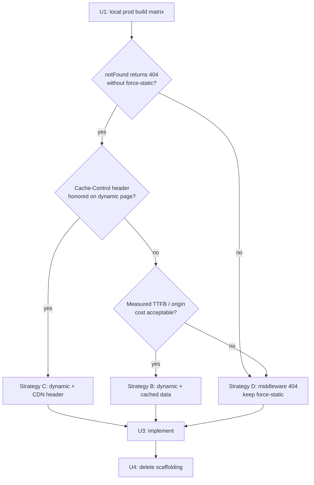

# fix: Resolve web soft-404s by choosing the right rendering strategy

**Target repo:** MotoWise (`apps/web`, Next.js 16)

---

## Summary

Unknown trip/explore/blog/guides URLs serve HTTP **200** with not-found content. Google
indexes those as real, thin pages. PR #193 attempted a fix that works for the named
URLs but introduced two blockers of its own and is currently unmergeable.

This plan does the thing PR #193 skipped: **establish empirically which rendering
strategy can produce a real 404 under this app's actual constraint**, then implement
that one and delete the scaffolding built for the wrong guess.

The constraint is real and already documented in the codebase, so the naive fix
("remove `force-static`") is not available for free.

---

## Problem Frame

### The bug

Verified in production:

```
$ curl -I https://motovault.app/trips/us/mt/beartooth-highway-2
HTTP/2 200
x-nextjs-prerender: 1
x-vercel-cache: HIT
```

`notFound()` runs, `not-found.tsx` renders, and the result is cached as a **successful
static prerender**. A static prerender cannot carry a 404 status. Every revalidation
re-bakes the same 200.

Sentry: MOTOVAULT-WEB-Q (74 events), -P (55), -R (25). GSC: ~1k "Not found (404)"
plus 284 duplicate-canonical, which PR #177 partially addressed.

The same mechanism silently disabled the page's `permanentRedirect()` calls — verified:
`/trips/us/ca/pacific-coast-highway` returned 200 with not-found content in production,
never a 308, for as long as `force-static` has been on that route.

### Why the obvious fix is not available

`apps/web/src/app/layout.tsx` (comment dated 2026-06-15) establishes:

- `getLocale()`/`getMessages()` in the **root** layout read request headers and force
  every route into dynamic rendering.
- The root layout sits at `app/`, **above** `[locale]`, so it cannot call
  `setRequestLocale()`.
- Next 16 `next/root-params` only exposes segments that *precede* the root layout, so
  `[locale]` does not qualify.
- Decoupling requires either multiple root layouts (duplicated `<html>`/providers, full
  reloads between groups) or `localePrefix: 'always'` (an SEO-sensitive URL change).
  Both are separately-reviewed initiatives.

`force-static` on marketing routes is the existing workaround for that constraint. So
removing it is not a one-line fix — it trades the soft-404 bug for loss of static
rendering on the highest-traffic SEO pages.

### What PR #193 currently does, and why it is blocked

It added `generateStaticParams` + `dynamicParams = false` to six routes, so the router
404s unknown params before the page runs. That does produce real 404s (verified on a
preview: bogus slugs 404, real trips 200, renamed slug 308s). Two blockers:

1. **Build fragility.** `dynamicParams = false` requires prerendering the complete set —
   1,278 pages. The preview build failed on a single transient
   `GraphQL Error (Code: 502)` from the Render API. Every deploy now depends on the API
   staying healthy across a long build.
2. **Residual soft-404s.** The param list derives from the `trips` table; the
   explore-region page resolves via `places` + `fetchRoutesByRegion`. **229 of 246**
   emitted country/region params have no `places` row, so the page calls `notFound()` on
   params that *are* prerendered — baking 200s. The bug the PR exists to fix, still
   present on those URLs.

---

## Requirements

| ID | Requirement |
|----|-------------|
| R1 | A URL with no corresponding content returns HTTP **404**, not 200, on every affected route (trip detail, explore country, explore region, localized explore, blog, guides). |
| R2 | A URL with real content returns 200 and renders correctly. |
| R3 | Content published after the last deploy is reachable without requiring a rebuild. |
| R4 | A transient upstream (API/database) failure cannot cause a deploy to ship a site with content missing, and cannot fail the build spuriously. |
| R5 | Existing 308 redirects for renamed slugs keep working (`LEGACY_TRIP_REDIRECTS`). |
| R6 | No regression in the fixes already verified on this branch (see Preserve). |
| R7 | The chosen strategy's page-serving cost is understood and accepted — specifically whether marketing HTML remains CDN-cacheable. |
| R8 | A machine-checkable guard exists so this class of regression fails loudly rather than silently. |

### Preserve (verified working on this branch — must not regress)

- `timeZone: 'UTC'` at 16 date call sites (MOTOVAULT-WEB-J hydration fix)
- Sentry `(VERCEL_ENV ?? NODE_ENV) === 'production'` gating (MOTOVAULT-WEB-Z)
- Two client noise-filter rules + tests (MOTOVAULT-WEB-11/-12)
- Timing-safe `safeCompare` in `apps/web/src/app/api/revalidate/route.ts`
- `LEGACY_TRIP_REDIRECTS` 308 in `apps/web/next.config.ts` (empirically verified)

---

## Key Technical Decisions

### KTD1 — The strategy is chosen by measurement, not by reasoning

Three passes on this problem each asserted something the next disproved: the in-tree
comment claimed `force-static` yields real 404s (production says 200); a dev-mode probe
returned 404 and was mistaken for evidence (dev does no ISR); and the "just remove
`force-static`" proposal missed the documented root-layout constraint. **U1 is a
measurement gate and everything downstream is conditional on it.** Dev mode cannot
reproduce any of this.

### KTD2 — Candidate strategies

| # | Strategy | Real 404 | CDN-cached HTML | New content live | Build cost |
|---|----------|----------|-----------------|------------------|------------|
| A | `force-static` + `dynamicParams=false` (current PR) | yes | yes | needs rebuild | **1,278 prerenders; 502-fragile** |
| B | Dynamic render + cached data fns (`unstable_cache`/`use cache`) | yes | **no** (unless C) | immediate | ~0 |
| C | B + explicit `Cache-Control: s-maxage` on marketing paths | yes | yes, if Next lets the header win | immediate | ~0 |
| D | Keep `force-static`; 404 unknown URLs in middleware | yes | yes | immediate | ~0 |
| E | Fix the root layout (multiple root layouts / `localePrefix`) | yes | yes | immediate | ~0 |

**Preferred order: C, then D, then B, then A.** E is explicitly out of scope per the
root-layout comment — a separately-reviewed initiative.

C is preferred because it satisfies every requirement if the header wins; D is the
fallback that preserves static rendering without depending on that; B is acceptable if
the perf cost measures small; A is last because its two blockers are structural, not
incidental.

### KTD3 — The `places`/`trips` mismatch is a content bug, fix it regardless

229/246 region params have no `places` row. Under any strategy, a region with a
published trip should render its region page. Today `resolveRegion` returns null when
there is no `places` row *and* `fetchRoutesByRegion` returns nothing — so the page and
the sitemap disagree about what exists. Whatever strategy wins, the page must be the
single source of truth for existence, and it must resolve a region that has trips.

### KTD4 — Prefer `unstable_cache` over enabling `cacheComponents`

`use cache` is the Next 16 idiom but requires `cacheComponents: true`, which changes
default rendering semantics repo-wide (`revalidate` → `cacheLife`, dynamic-by-default)
and is a migration in its own right. `unstable_cache` is available today and pairs with
the existing `/api/revalidate` tag invalidation. Revisit `use cache` as a separate
initiative.

---

## Assumptions

Recorded because pipeline mode resolved these to defaults rather than asking:

- **A1** — Losing CDN-cached HTML on marketing routes is *not* acceptable without
  measurement, so C/D rank above B. If U1 shows the perf delta is negligible, B becomes
  acceptable on simplicity grounds.
- **A2** — Vercel honors `next.config.ts` `headers()` `Cache-Control` on dynamically
  rendered app-router pages. **Unverified — U1 must test it.** If Next overrides with
  `private, no-cache`, strategy C is unavailable and D becomes primary.
- **A3** — Fixing the Vercel ignored-build-step is in scope because verification depends
  on previews; the earlier `[ "$VERCEL_ENV" != "production" ]` setting did not take
  effect and previews still built.
- **A4** — The `revalidate = 86400` windows currently on these routes are the intended
  freshness budget and carry forward unchanged.

---

## High-Level Technical Design

Decision flow for U1's measurement gate:



Why the current approach fails, as a sequence:

```mermaid
sequenceDiagram
    participant Crawler
    participant Vercel as Vercel CDN
    participant Next
    Crawler->>Vercel: GET /trips/us/mt/bogus-slug
    Vercel->>Next: cache MISS, generate on demand
    Next->>Next: fetchTrip() -> null
    Next->>Next: notFound()
    Note over Next: force-static: result is a<br/>STATIC PRERENDER, which<br/>cannot carry a 404 status
    Next-->>Vercel: not-found HTML, status 200
    Vercel-->>Crawler: 200 + x-nextjs-prerender: 1
    Note over Vercel: cached; every revalidation<br/>re-bakes the same 200
```

---

## Implementation Units

### U1. Measure the rendering/404/caching matrix (gate — blocks everything else)

**Goal:** Determine empirically which strategy can produce a real 404 under this app's
root-layout constraint, and whether CDN caching survives.

**Requirements:** R1, R7; validates A2

**Dependencies:** none

**Files:**
- `apps/web/src/app/trips/[country]/[region]/[slug]/page.tsx` (temporary local edits, reverted)
- `apps/web/next.config.ts` (temporary `headers()` probe, reverted)
- `docs/plans/2026-08-05-001-fix-web-soft-404-rendering-strategy-plan.md` (record results here)

**Approach:** Run a **local production build** (`pnpm --filter web build && pnpm --filter web start`) — dev mode does not do ISR and will mislead. Requires the API reachable
or a stubbed GraphQL endpoint. For each variant, `curl -I` a bogus slug, a real slug,
and inspect `x-nextjs-prerender`, `x-vercel-cache`/`age`, and `cache-control`:

1. Baseline (current branch): confirm 404 via router, and confirm the build prerenders.
2. `force-static` removed, `revalidate` kept, no `generateStaticParams`: does a bogus
   slug 404? Is the response dynamic (no prerender header)?
3. Variant 2 + `Cache-Control: s-maxage=86400, stale-while-revalidate` via
   `next.config.ts` `headers()`: does the header survive on the response? (**A2**)
4. Variant 2 with a `Suspense` boundary above the data fetch: confirm the docs' claim
   that a 404 after streaming begins degrades to 200 — this tells us how much freedom
   the page body has.

**Execution note:** This unit produces a written result table, not code. Revert all
temporary edits before U2. Record the outcome in this plan so the choice is auditable.

**Verification:** A results table in this plan naming the chosen strategy, with the
observed status codes and headers for each variant.

**Test scenarios:** `Test expectation: none -- measurement unit, no behavioral change shipped.`

#### U1 RESULT — measured 2026-08-05, local production build (`next build && next start`)

Server on `127.0.0.1:3100`. **Measurement-integrity note:** the first two runs were
invalid — an unrelated vite app was bound to `[::1]:3000` and IPv6 resolution reached it
first, so `localhost:3000` returned another product's pages. The tell was
`pacific-coast-highway` returning 200 when `next.config` must 308 it. All results below
are from a port-isolated server verified by page title.

| Variant | `force-static` | `generateStaticParams` | root `loading.tsx` | bogus slug | real slug | rendering |
|---------|----------------|------------------------|--------------------|-----------|-----------|-----------|
| Baseline (current PR) | yes | yes + `dynamicParams=false` | present | 404 (router) | 200 | SSG, 1,278 prerenders |
| V2 | **no** | no | present | **200** | 200 | `ƒ` Dynamic |
| V2' | no | no | **present** | **200** | 200 | `ƒ` Dynamic |
| V4 | no | no | **absent** | **404** | 200 | `ƒ` Dynamic |
| **V5 (chosen)** | **yes** | **no** | **absent** | **404** | **200** | **`○` Static + ISR** |

V5 response headers (both statuses): `x-nextjs-prerender: 1`,
`Cache-Control: s-maxage=86400, stale-while-revalidate=31449600` — the 404 is itself
cached, matching the `response-cache` internals note in Sources.

**Findings:**

1. **The root cause is the root `loading.tsx`, not `force-static`.** V2' vs V4 isolates it:
   the only difference is that file, and it flips bogus slugs between 200 and 404. It
   creates a Suspense boundary above every page, so the shell streams before `notFound()`
   runs — and per the Next `not-found` reference, a streamed response can only be 200.
2. **`force-static` is not the culprit and should stay.** V5 keeps it and still returns a
   real 404. It is what preserves static rendering under the root-layout constraint, and
   it yields CDN-cacheable `s-maxage` headers.
3. **`dynamicParams = false` and `generateStaticParams` are unnecessary.** V5 has neither
   and behaves correctly, with on-demand generation for new content and a fast build
   (no 1,278-page enumeration, so no 502-fails-the-deploy exposure).
4. **A2 is moot.** No manual `Cache-Control` work is needed — Next already emits
   `s-maxage` on the static route.
5. **Dev mode cannot reproduce this** and actively misled two earlier passes: a dev probe
   returned 404 with `loading.tsx` present, which is the opposite of production.

**Chosen strategy: V5.** Not in the plan's original candidate list — it is
"keep `force-static`, delete the streaming boundary", which no earlier pass considered
because `loading.tsx` had been wrongly cleared by the dev probe.

**Consequence for the plan:** strategies A-E are superseded. U3 shrinks to deleting the
`loading.tsx` files that sit above the affected routes; U4 grows, because the entire
`generateStaticParams`/`dynamicParams`/floor-guard/deploy-hook apparatus is now dead
weight. `apps/web/src/app/explore/loading.tsx` also sits above two affected routes and
must go the same way.

#### U1 ADDENDUM — measured 2026-08-05, after the V5 changes landed

Two further questions were measured in the same production build. Both change scope.

**(a) In-page `permanentRedirect()` works again.** Probed on the real trip route under
`force-static`:

```
/trips/us/mt/<bogus-slug-that-hits-permanentRedirect>
  HTTP/1.1 308 Permanent Redirect
  location: /trips/us/mt/beartooth-highway
  x-nextjs-prerender: 1
```

So the streaming boundary — not `force-static` — was what broke the redirects too. The
claim in `bare-slug-redirect.ts` and `next.config.ts` that "only a config-level redirect
can emit a 308" was **false**. U4's "re-evaluate bare-slug-redirect.ts" therefore resolves
to **rewire, not delete**: `findBareSlugRedirect` is called from the trip page again,
restoring ~28 bare-slug 301s. Verified end to end:
`/trips/ch/vs/furka-pass` → `308` → `/trips/ch/vs/furka-pass-6625deaf`, while the
ambiguous case (`/trips/us/mt/beartooth`, a prefix with no dedup hash) correctly stays 404.
`LEGACY_TRIP_REDIRECTS` stays in `next.config.ts` — not because the page *can't* redirect,
but because a config redirect costs no render and no GraphQL round-trip.

**(b) U2's stated hypothesis is disproven.** The plan blamed a country-code casing or
50-row cap mismatch in `fetchRoutesByRegion`. Checked directly:

- DB: `TH-77` has 1 published trip, `JP-20` has 8, `SG-02` has 1 — all with `published_at`.
- The API's `listTemplates` filters `region_code` with `ilikeEquals` (case-insensitive), and
  `sitemapPublishedTrips` uses the *same* `is_template`/`is_flagged`/`visibility` filters.
- Live production API with the exact params the page sends
  (`filter: {country: "th", region: "th-77"}`) returns the trip.

There is no mismatch. The `[soft-404] explore-region` lines came from `resolveRegion`'s
`.catch(() => [])` swallowing the **transient GraphQL 502s** that were failing that same
build. See U2 below for the corrected fix.

---

### U2. Make the page the single source of truth for region existence

**Goal:** A region with a published trip renders its region page; only a region with
genuinely nothing 404s. Removes the 229/246 param/page disagreement.

**Requirements:** R1, R2; KTD3

**Dependencies:** U1 (strategy informs whether params exist at all, but the resolver fix
is required either way)

**Files:**
- `apps/web/src/app/explore/[country]/[region]/page.tsx`
- `apps/web/src/app/[locale]/(marketing)/explore/[country]/[region]/page.tsx`
- `apps/web/src/lib/fetch-places.ts`
- `apps/web/src/lib/__tests__/fetch-places.test.ts` (create if absent)

**Approach:** `resolveRegion` treats "no `places` row AND no routes" as absent. The
`[soft-404] explore-region` build log lines show this firing for regions that *do* have
published trips (`th/th-77`, `jp/jp-20`, `sg/sg-02`, …), so the routes lookup is the
suspect — likely a country-code casing or limit mismatch in `fetchRoutesByRegion`
(called with `code = countrySlug.toUpperCase()` and a 50 cap). Diagnose against the DB
query used by `sitemapPublishedTrips`, which is the list that says these regions exist,
and align them.

**Patterns to follow:** the existing trip-derived resolution comment in the same file
("names come from the `places` taxonomy when a row exists, otherwise from geo-names").

**Test scenarios:**
- A region with a `places` row and trips resolves (happy path).
- A region with **no** `places` row but ≥1 published trip resolves — the 229-case; assert
  it does not `notFound()`.
- A region with neither resolves to null → 404.
- Country-code casing: lowercase URL segment resolves against uppercase `country_code`.
- A region whose trips exceed the 50-row cap still resolves.

**Verification:** Building the affected routes emits **zero** `[soft-404] explore-region`
lines for regions that have published trips.

#### U2 RESULT — hypothesis replaced, real defect fixed

The suspected casing/cap mismatch does not exist (see U1 ADDENDUM (b)). `resolveRegion`
already handled "no `places` row but trips exist" correctly. The actual defect was its
error handling:

```ts
fetchRegionBySlug(...).catch(() => null)          // any failure => "region absent"
fetchTripTemplatesByRegion(...).catch(() => [])   // any failure => "no trips"
```

A blanket catch cannot distinguish "this region does not exist" from "we never got an
answer", so one API blip becomes `notFound()` — and under `force-static` ISR that 404 is
**cached**, hiding a real region for a full revalidate window while emitting a bogus
soft-404 report. This is the same trap `fetchTrip` on the trip-detail route already avoided
via `isDefinitiveGraphQLError`.

**Fix:** added `definitiveOrThrow(promise, absent)` to `apps/web/src/lib/graphql-server.ts`
— resolves to `absent` only on a definitive not-found (HTTP 200 + non-empty `errors[]`),
re-throws everything else so Next renders an uncached, retried error. Applied to both
region resolvers (`explore/[country]/[region]` and its `[locale]` twin) for the two inputs
that decide existence. `fetchRegionsByCountrySlug` keeps a plain `.catch(() => [])` — it
only feeds a sidebar count and must not be able to fail the page. 6 new unit tests.

**Verified:** build emits **0** `[soft-404]` lines. All four previously-suspect regions
render 200 in a production build: `/explore/th/th-77`, `/explore/jp/jp-20`,
`/explore/sg/sg-02`, and `/explore/ca/bc` (the 229-case: no `places` row, real trips).

---

### U3. Implement the strategy U1 selected

**Goal:** Real 404s on all six routes, with the caching posture U1 established.

**Requirements:** R1, R2, R3, R4, R7

**Dependencies:** U1, U2

**Files (strategy-dependent):**
- `apps/web/src/app/trips/[country]/[region]/[slug]/page.tsx`
- `apps/web/src/app/trips/[country]/page.tsx`
- `apps/web/src/app/explore/[country]/page.tsx`
- `apps/web/src/app/explore/[country]/[region]/page.tsx`
- `apps/web/src/app/[locale]/(marketing)/explore/[country]/page.tsx`
- `apps/web/src/app/[locale]/(marketing)/explore/[country]/[region]/page.tsx`
- `apps/web/src/app/[locale]/(marketing)/blog/[slug]/page.tsx`
- `apps/web/src/app/[locale]/(marketing)/guides/[slug]/page.tsx`
- `apps/web/next.config.ts` (strategy C only)
- `apps/web/src/proxy.ts` (strategy D only)
- `apps/web/src/lib/fetch-places.ts` (strategies B/C — wrap data fns in `unstable_cache` with tags)

**Approach:** Per KTD2. For **B/C**, remove `dynamic`/`dynamicParams`, keep the existence
check ahead of any Suspense boundary (per the Next streaming guide), and wrap the
data-fetch functions in `unstable_cache` keyed by params with a `trips`/`places` tag so
`/api/revalidate` still invalidates them. For **C**, add the `Cache-Control` header for
the marketing path prefixes. For **D**, keep `force-static` and add a middleware check
against an edge-cached valid-path set.

**Execution note:** Land one route first (trip detail — the highest-volume issue,
MOTOVAULT-WEB-Q) and verify it end to end in a production build before propagating to
the remaining five. Do not convert all six on an unverified pattern.

**Test scenarios:**
- Bogus slug → 404 (per route family).
- Real slug → 200 with expected content.
- Renamed slug → 308 to canonical (R5).
- Uppercase/percent-encoded slug behaves as before the change.
- A trip published *after* the build is reachable without a rebuild (R3).
- Strategies B/C: a cached data fn is invalidated by the matching `/api/revalidate` tag.

**Verification:** Production build + `curl -I` matrix matches U1's expected column for
every route family, including the previously-untested "param in list but page 404s" case.

---

### U4. Delete the scaffolding built for the wrong strategy

**Goal:** Remove the machinery that existed only to survive `dynamicParams = false`.

**Requirements:** R4; simplification

**Dependencies:** U3 (only once the replacement is verified)

**Files:**
- `apps/web/src/lib/seo/trip-static-params.ts` (delete, if B/C/D)
- `apps/web/src/lib/seo/__tests__/trip-static-params.test.ts` (delete with it)
- `apps/web/src/app/api/revalidate/route.ts` (remove `requestRedeploy`, the deploy-hook call, `DEPLOY_HOOK_TIMEOUT_MS`, and the `staticParamsChanged` flag — all only needed because a new trip could not be served without a rebuild)
- `apps/web/.env.example` (remove `VERCEL_DEPLOY_HOOK_URL`)
- `apps/web/src/lib/trips/bare-slug-redirect.ts` (re-evaluate: if U3 restores in-page redirect capability, rewire `findBareSlugRedirect`; otherwise keep documented-inert or delete)

**Approach:** Delete rather than leave inert. Keep `safeCompare` (R6) — it is an
independent security fix. Also delete the Vercel deploy hook and its env var via the
Vercel API once the code no longer calls it.

**Execution note:** Verify `pnpm --filter web build` and the 404 matrix still pass
*after* deletion — the guard being removed is the floor check, so its removal must not
reintroduce a silent-empty failure mode. Under B/C/D there is no param list to be
empty, which is what makes the deletion safe; state that explicitly in the commit.

**Test scenarios:**
- `/api/revalidate` still authenticates (timing-safe) and still revalidates paths/tags.
- Its response no longer claims `redeployed`, and no caller depends on that field.
- `knip` reports no new unused exports.

**Verification:** Repo lint at main's baseline (16 warnings / 0 errors); no dangling
references; `apps/web` typecheck and tests pass.

---

### U5. Fix Vercel preview builds so verification is repeatable

**Goal:** Previews build (or are deliberately off) in a way that matches intent, because
every verification step depends on a preview or local prod build.

**Requirements:** R7, A3

**Dependencies:** none (can run in parallel with U1)

**Files:** Vercel project settings (no repo file), or `apps/web/vercel.json` if the
ignore rule moves into the repo

**Approach:** The project-level ignored-build-step
(`[ "$VERCEL_ENV" != "production" ]`) was set but previews still built. Determine
whether the setting is being honored at all, and prefer moving the rule into version
control (`vercel.json` `git.deploymentEnabled`, or an `ignoreCommand`) so it is
reviewable rather than living only in dashboard state. Given verification depends on
previews, **re-enabling previews for this branch is the likely correct call** — revisit
the cost question after U1 establishes whether builds still prerender 1,278 pages.

**Test scenarios:** `Test expectation: none -- infrastructure config; verified by observing the next push's deployment state.`

**Verification:** A push to this branch produces the intended outcome (a built preview,
or a cleanly skipped deployment that does not report a failed check).

---

### U6. Add a regression guard for the 404 contract

**Goal:** This class of bug fails loudly next time. It was invisible for ~2 months across
two PRs, and the in-tree comment asserted the opposite of the truth.

**Requirements:** R8

**Dependencies:** U3

**Files:**
- `apps/web/src/app/__tests__/not-found-contract.test.ts` (or an e2e/smoke script — shape depends on U1)
- `scripts/check-404-contract.sh` (optional, mirroring the repo's existing `scripts/check-*.sh` guards)
- `.github/workflows/` (wire the check if it is a script)

**Approach:** A unit test cannot observe an HTTP status from a prerender, which is
precisely why this went unnoticed — so the guard must exercise a real server. Prefer a
post-deploy smoke check that asserts a known-bogus URL per route family returns 404 and
a known-real URL returns 200, runnable against a preview or production URL. Encode the
route families, not individual URLs.

**Test scenarios:**
- Guard fails when pointed at a deployment that serves 200 for a bogus URL (verify by
  pointing it at current production before the fix lands).
- Guard passes against the fixed deployment.
- Guard fails loudly (non-zero exit, clear message) rather than silently skipping when
  the target URL is unreachable.

**Verification:** The guard fails against current production and passes against the fixed
build — proving it actually detects the bug.

---

### U7. Capture the learning

**Goal:** Record the non-obvious root cause so the next agent does not re-derive it.

**Requirements:** R8 (organizational)

**Dependencies:** U3

**Files:** `docs/solutions/nextjs-force-static-swallows-404-and-redirect.md`

**Approach:** `docs/solutions/` has no entry for this. Record: `force-static` bakes both
`notFound()` and `permanentRedirect()` as cached 200s; dev mode cannot reproduce it (no
ISR); the diagnostic signature is `x-nextjs-prerender: 1` + `x-vercel-cache: HIT` on a
not-found body; the root-layout constraint that makes `force-static` load-bearing here;
and which strategy U1 selected, with its measured trade-offs.

**Test scenarios:** `Test expectation: none -- documentation.`

**Verification:** A future reader can determine, without re-running the investigation,
why this route config is what it is.

---

---

## Execution Record — 2026-08-05

Everything below was verified in a local production build
(`pnpm --filter web build` + `PORT=3100 pnpm start`, target identity confirmed by `<title>`).

### What shipped

| Unit | Outcome |
|------|---------|
| U1 | Gate passed. V5 chosen: keep `force-static`, delete the streaming boundaries. |
| U2 | Hypothesis disproven; real defect (`.catch` → cached 404) fixed with `definitiveOrThrow`. |
| U3 | Deleted 4 `loading.tsx` files. `app/pro/loading.tsx` kept — nothing under it changes status. |
| U4 | Deleted the param apparatus, floor guard, deploy hook, env var. **Rewired** bare-slug 301s. |
| U5 | Root cause: `vercel.json` `ignoreCommand` overrides the dashboard rule. Dead rule removed. |
| U6 | Two guards: a CI static tripwire + an end-to-end HTTP script. Both fail pre-fix. |
| U7 | `docs/solutions/runtime-errors/nextjs-streaming-swallows-404s-and-redirects.md` |

### Deletions (U3/U4)

- `app/loading.tsx`, `app/explore/loading.tsx`, `app/route/loading.tsx`, `app/routes/loading.tsx`
  — the last two sit above redirect-only pages, where the boundary broke the redirect and the
  loading UI rendered nothing useful.
- `lib/seo/trip-static-params.ts` + its 10 floor-guard tests.
- The four `generateStaticParams` on the trip-detail and explore routes, and every
  `dynamicParams = false` this branch added (incl. `blog/[slug]`, `guides/[slug]`).
  `bikes/[…]/[pageType]` keeps its pre-existing one — it predates this branch.
- `requestRedeploy`, `DEPLOY_HOOK_TIMEOUT_MS`, `staticParamsChanged` from
  `api/revalidate/route.ts`; `VERCEL_DEPLOY_HOOK_URL` from `.env.example`. `safeCompare` kept.
- `LEGACY_TRIP_SLUG_ALIASES` / `findLegacySlugAlias` — an inert duplicate of
  `LEGACY_TRIP_REDIRECTS` carrying a "KEEP IN SYNC" comment. `next.config.ts` is now the only copy.
- Vercel side: deploy hook `5TciXSh0JQ` ("revalidate-new-trips"), env var
  `VERCEL_DEPLOY_HOOK_URL` (`6ig5ZdJDSNTRtiue`), and the dead project-level
  `commandForIgnoringBuildStep`. All verified removed via the API; rollback notes recorded.

**Safe to delete the floor guard because there is no param list left to be silently empty.**
Under V5 an empty upstream response no longer bakes a site of 404s — pages resolve per
request, so a degraded API produces a retried error, not permanently missing content.

### Blog freshness bug found while removing `dynamicParams` (R3)

`blog/[slug]` carried the comment "Slugs are repo-sourced, so the generated list is always
complete." That is false — articles come from Supabase (`lib/supabase-blog.ts`) and a daily
job publishes new ones. With `dynamicParams = false`, **every article published after a
deploy 404'd until the next unrelated merge.** Removing the flag fixes it. (Guides genuinely
*are* repo-sourced; its flag was harmless but removed for uniformity.)

### Final measured matrix — `scripts/check-404-contract.sh`, 17/17

| Family | bogus | real |
|---|---|---|
| trip detail | 404 | 200 |
| explore country / region | 404 | 200 |
| localized explore country / region | 404 | 200 |
| blog | 404 | 200 |
| guides | 404 | 200 |
| legacy renamed slug | — | **308** |
| bare dedup-hash slug | — | **308** |
| control (`/definitely-not-a-route`) | 404 | — |

Headers on the trip route, identical for the 404 and the 200 —
static + ISR + CDN-cacheable, with the 404 itself cached (correct):

```
x-nextjs-prerender: 1
Cache-Control: s-maxage=86400, stale-while-revalidate=31449600
```

Same script against **production before the fix**: 8 of 16 failed — 7 bogus URLs at 200 and
the 308 that never fired, every one carrying `x-nextjs-prerender`. That is R8 satisfied: the
guard demonstrably detects the bug.

Build: **834 pages in 5.3s**, down from 1,278 prerenders that could be killed by one
transient `GraphQL 502` (R4). Zero `[soft-404]` lines.

### Gates

`pnpm --filter web typecheck` clean · `pnpm --filter web test` 232 passing (was 240: −10
deleted floor-guard tests, −4 deleted `findLegacySlugAlias` tests, +6 `definitiveOrThrow`,
+2 not-found-contract) · `pnpm lint` **16 warnings / 0 errors** (baseline held).

### Both original follow-ups were then closed on request

- **Navigation progress bar — DONE.** `apps/web/src/components/navigation-progress.tsx`, a
  client component mounted in the root layout. No Suspense boundary, so it cannot affect
  response status. Neither Next hook fits a global bar: `useLinkStatus()` reports the pending
  state of the `<Link>` it renders *inside* (one sensor per link), and `onNavigate` fires only
  for `<Link>` clicks. So it intercepts the click that starts a navigation (capture phase) and
  clears on the resulting `usePathname()` change, with a 150ms delay so prefetched navigations
  don't flash and a 10s failsafe so an abandoned navigation can't strand the bar.
  `usePathname()` not `useSearchParams()` — the latter would opt static routes into needing a
  Suspense boundary, reintroducing exactly this bug. Known gap: a bare programmatic
  `router.push()` shows no bar. 9 tests cover the "will this click navigate?" predicate
  (hash anchors, current URL, external, `target=_blank`, `download`, `mailto:`/`tel:`).
- **Supabase keys on preview — DONE.** All four (`SUPABASE_URL`, `SUPABASE_ANON_KEY`,
  `NEXT_PUBLIC_SUPABASE_URL`, `NEXT_PUBLIC_SUPABASE_ANON_KEY`) now target
  `["production","preview"]`. Zero new exposure: the web app holds no service-role key
  (verified), and the `NEXT_PUBLIC_` pair is already in production client bundles. Previews can
  now render blog content, and `check:404`'s `blog:real` row stops failing spuriously.
  Rollback: set each back to `["production"]`.

### Follow-ups still open

- **Wire `check:404` to CI.** It needs a live URL; the Vercel preview URL isn't plumbed into
  the workflow. The CI-level protection today is the static tripwire in `pnpm test`.
- **`sitemapPublishedTrips` fails soft** (`return []` on DB error at HTTP 200). No longer
  load-bearing for the build, but still wrong in `apps/api`.
- **Preview deployments render zero blog content.** Found while verifying this PR on its
  preview: `NEXT_PUBLIC_SUPABASE_URL` / `_ANON_KEY` are scoped to the `production` target
  only, so `blogClient()` returns null on a preview and *every* blog slug 404s. Pre-existing,
  unrelated to this change (production serves the same URL at 200), but it means previews
  cannot be used to review blog rendering, and it makes `check:404`'s `blog:real` row fail
  spuriously there — now documented in the script header. These are publishable anon keys, so
  extending them to the `preview` target is low-risk; left alone here to keep scope tight.

---

## Scope Boundaries

### In scope
- The six affected route families and their 404 behavior
- The `places`/`trips` region-resolution mismatch
- Removing the scaffolding that only existed for `dynamicParams = false`
- Vercel preview-build config, because verification depends on it
- A regression guard and a solutions doc

### Deferred to follow-up work
- **Root-layout decoupling** (multiple root layouts or `localePrefix: 'always'`) — the
  clean fix for the underlying constraint. Explicitly out of scope per the 2026-06-15
  investigation; large and SEO-sensitive.
- **`cacheComponents: true` / `use cache` migration** (KTD4) — repo-wide semantics change.
- **API-side `staticParamsChanged`** — moot if U4 deletes the deploy hook.
- **Bare-slug 308 restoration** via a build-time redirect list — reconsider in U4 once
  U3 establishes whether in-page redirects work again.
- **`sitemapPublishedTrips` fails soft** (`return []` on DB error, HTTP 200) — the
  upstream defect behind the floor guard. Worth fixing in `apps/api` regardless.

### Out of scope
- GSC re-submission / indexing operations
- The 8-locale explore surface's existence (a product question, not this fix)

---

## Risks & Dependencies

| Risk | Impact | Mitigation |
|------|--------|------------|
| U1's local prod build needs the API; a 502 blocks measurement | Gate can't run | Stub the GraphQL endpoint, or point at prod API; measurement needs only a handful of routes, not all 1,278 |
| A2 false (Next overrides `Cache-Control` on dynamic pages) | Strategy C unavailable | D is the designed fallback; U1 tests this explicitly before implementation |
| Dynamic rendering measurably worsens TTFB on SEO pages | Perf/cost regression on the money pages | U1 measures before committing; D preserves static rendering |
| Deleting the floor guard (U4) reintroduces a silent-empty failure | Site content missing | Only delete when no param list exists to be empty; U4's execution note requires re-verifying the matrix post-deletion |
| Partial conversion leaves route families inconsistent | Mixed 404/200 behavior | U3 lands one route, verifies, then propagates |

---

## Verification Contract

Gates before each commit:

- `pnpm --filter web typecheck`
- `pnpm --filter web test`
- `npx biome check <changed files>`
- `pnpm lint` stays at main's baseline: **16 warnings, 0 errors**

Strategy-level verification (not satisfiable by unit tests — see U6):

- Production build (local `next build && next start`, or a Vercel preview)
- `curl -I` matrix per route family: bogus → 404, real → 200, renamed → 308
- Header inspection: `x-nextjs-prerender`, `x-vercel-cache`, `cache-control`
- Zero `[soft-404]` build-log lines for content that genuinely exists

---

## Definition of Done

- [x] U1 result table recorded in this plan; strategy chosen on measured evidence
- [x] R1: every affected route family returns 404 for a URL with no content, verified in a production build
- [x] R2: real content returns 200 and renders
- [x] R3: content published after the last deploy is reachable without a rebuild — no param
      list gates any route; also fixed the DB-sourced blog, which `dynamicParams = false`
      had been 404ing until the next deploy
- [x] R4: no build-time dependency that can ship missing content or fail a deploy spuriously
      (834 pages / 5.3s, no trip or explore enumeration)
- [x] R5: `LEGACY_TRIP_REDIRECTS` 308 verified; bare-slug 308 additionally restored
- [x] R6: all five preserved fixes intact (`timeZone: 'UTC'`, Sentry env gating, the two
      noise-filter rules + tests, `safeCompare`, `LEGACY_TRIP_REDIRECTS`)
- [x] R7: caching posture measured — `x-nextjs-prerender: 1` +
      `s-maxage=86400, stale-while-revalidate=31449600` on both statuses; no manual header needed
- [x] R8: guard fails against pre-fix production (8/16) and passes post-fix (17/17)
- [x] Scaffolding deleted; repo lint at baseline (16 warnings / 0 errors)
- [x] `docs/solutions/` entry written
- [ ] PR #193 description updated to describe what actually shipped
- [ ] `knip` re-checked after merge (advisory job)

---

## Sources & Research

- **Next.js ISR guide** — "Pages not prerendered can be generated on-demand if they
  exist, otherwise a 404 is returned."
- **Next.js `not-found` reference** — returns 404 for non-streamed responses, 200 for
  streamed ones.
- **Next.js streaming guide** — perform existence checks before any Suspense boundary to
  return a real 404.
- **Next.js `generateStaticParams` reference** — `dynamicParams = false` 404s ungenerated
  segments.
- **Next.js internals, `response-cache/index.ts`** — the response cache persists a
  rendered 404 only when a `cacheControl` value exists; with `revalidate` set, the 404 is
  cached for that duration.
- **Next.js `use cache` / `cacheComponents` migration guide** — `cacheLife`/`cacheTag`;
  replaces `unstable_cache`.
- **`apps/web/src/app/layout.tsx`** — the 2026-06-15 root-layout investigation that makes
  `force-static` load-bearing.
- **Production measurements** (2026-08-05) — 200 + `x-nextjs-prerender: 1` +
  `x-vercel-cache: HIT` on bogus trip slugs; 200 on `pacific-coast-highway` proving the
  in-page redirect never fired.
- **Failed preview build logs** (deployment `dpl_HJnp7MhoTSZpsp3Lkt7UK84wrrt3`) — the
  502 prerender failure and the `[soft-404] explore-region` lines.
- **Database counts** — 246 emitted region params, 229 with no `places` row; 561
  publishable trips.
- **PR #177** — prior GSC indexing work; the dual explore-tree gotcha and locale-prefix
  redirects this plan must not regress.
