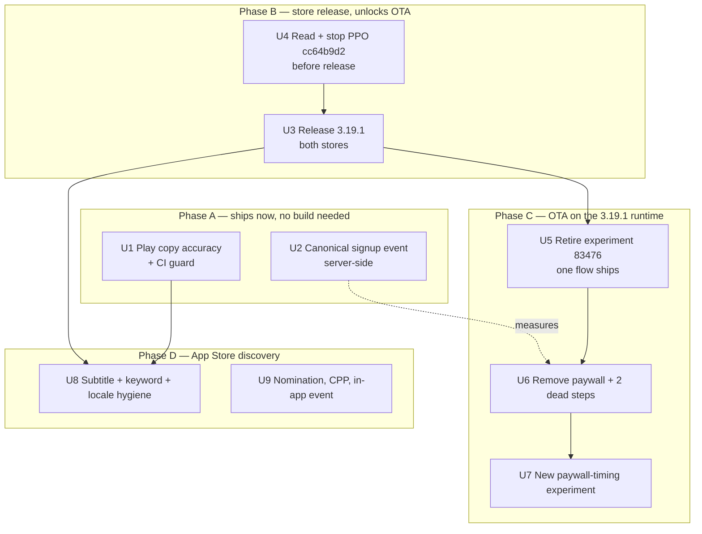
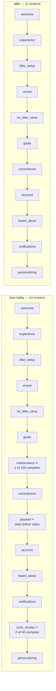

# feat: Fix what the stores promise, cut onboarding friction, and make activation measurable

---

> **VERIFIED AND PARTIALLY CORRECTED, 2026-08-24** — see
> `docs/Plan-Verification-2026-08-24.md`. This plan was never independently reviewed
> (`ce-doc-review` returned no findings), so every load-bearing number was re-derived from
> production Postgres, PostHog, App Store Connect and Google Play while implementing it.
> 19 of ~25 claims verified exactly or within ±1. Three were materially wrong:
>
> 1. **"20 on `pro`"** — actually 19 lifetime, 16 not-deleted, and only **7 `active` + 2
>    `trialing`** currently entitled. Seven users keep `tier = pro` after cancelling.
> 2. **`account_created` OVER-counts**, it does not only undercount — it fired on returning
>    sign-ins too, so the monthly union of the legacy events runs 7% → 22% → 43% → **104%**
>    → 98% of real signups. The remedy is unchanged; the diagnosis was half the story.
> 3. **The 33 NULL-variant users** are on builds 3.8.0/3.9.0/3.3.0 that predate the
>    assignment code — not an assignment failure and not consent-related.
>
> Also retracted: the claim that mobile session replay is available (it is not).
> The affected-Play-locale count was **43 of 46**, not 31.

---

## Product Contract

### Summary

Cut the false free-tier claims from the Play listing, remove the paywall and two dead
steps from onboarding, retire the decided onboarding experiment in favour of one that
measures activation instead of trial starts, close the signup-instrumentation gap so
activation is measurable at all, and ship the banked App Store discovery wins.

### Problem Frame

A metadata-only release on 2026-07-29 multiplied App Store impressions ×2.45, and page
views and installs followed at ×2.47 and ×2.48 with conversion ratios flat. Acquisition
is working. Nothing downstream is.

Production Supabase, 2026-08-24: **577 users lifetime, 320 in the last 90 days, 20 on
`pro`.** 286 users added a bike; **66 have ever logged an expense**; 4 have used receipt
scan. Measured against signup timestamps, **28 users (4.9%) logged an expense more than a
day after signing up** and 22 (3.8%) more than a week after. Rides tell the same story
(34 and 23). Two independent methods — PostHog events and raw Postgres timestamps — agree
that roughly **4–6% of users do anything at all beyond day one**.

Three specific causes are visible in the data, and all three are self-inflicted:

1. **The store promises a product that does not ship.** 24 of 46 Play locales advertise
   "unlimited bikes" as part of the free tier when `MAX_BIKES` is 1; 18 promise 5 free AI
   diagnostic scans when the limit is 1. 31 locales carry at least one false claim.
2. **Onboarding sells before it delivers.** A `paywall` step sits before the `account`
   step in both live variants; 395 of 692 people who start onboarding see it. Two further
   steps are pure friction: `maintenance` is completed by 2 of 150 in the winning arm, and
   `scan_receipt` by **0 of 40**.
3. **The experiment optimises the wrong thing.** PostHog experiment 83476 has run since
   2026-06-15 with no end date and a primary metric of install→trial. Its winning arm is
   already decided on activation, and its primary metric cannot reach significance at
   6–12 purchases.

Underneath all of it, activation is not reliably measurable: `account_created` fires from
a single onboarding screen (154 events) and `user_signed_up` from the auth screens (62)
against **320 real signups**. `docs/solutions/integration-issues/posthog-onboarding-funnel-instrumentation.md`
diagnosed this exact class of failure on 2026-06-09, marked it resolved, and set the
acceptance criterion "`user_signed_up` unique users ≈ new `auth.users` rows for that
month." That criterion is still failing by 5×.

### Requirements

- **R1** — No Play or App Store locale states a free-tier capability that contradicts
  `packages/types/src/constants/limits.ts`.
- **R2** — A regression guard fails CI when store copy asserts a free-tier number that
  disagrees with the constants.
- **R3** — The onboarding flow contains no paywall step. Paid conversion is driven only by
  gated-feature triggers after the user has the app.
- **R4** — Onboarding contains no step whose completion rate is indistinguishable from
  zero. Specifically `maintenance` and `scan_receipt` are removed from the flow.
- **R5** — One onboarding flow ships. The `invested` arm and the 0%-rollout `control` are
  retired, and users holding a retired variant value continue to work without a reset.
- **R6** — Experiment 83476 is stopped with a recorded end date and result, and the
  cutover is annotated in PostHog so later analyses do not compare across a flow change.
- **R7** — A replacement experiment tests paywall timing with a primary metric of
  first-value-logged; trial start is retained as a guardrail, not the objective.
- **R8** — Exactly one canonical signup event exists, emitted from a source that cannot
  drift per auth path, and its monthly unique-user count matches new `public.users` rows
  within a stated tolerance.
- **R9** — The App Store subtitle leads with the category head term in all 7 localized
  listings, with no token duplicated across name, subtitle, and keyword field.
- **R10** — No localized subtitle contains untranslated English, and no indexed locale
  leads on AI diagnostics.
- **R11** — The dormant App Store discovery surfaces are used: a featuring nomination is
  submitted, a Custom Product Page exists for blog/SEO inbound, and the draft in-app event
  is either published or deleted.

### Key Decisions

- **Logging stays free forever.** Maintenance and expense logging are never paywalled or
  count-limited. Governs R1, R3.
  _(session-settled: user-directed — standing constraint, reaffirmed this session.)_
- **Store copy never quotes a price.** Localized listings serve many territories, so a
  hard-coded currency figure is wrong in most of them. Governs R1.
- **Target markets are Europe and the Americas.** Governs R9, R10.
- **AI diagnostics is not the hero.** Feature order is expenses > maintenance > rides >
  trips > AI. Governs R9, R10.
  _Note: the August data has AI (19 users) marginally ahead of maintenance (18). The
  numbers are too small to reorder positioning on; recorded so it is not re-derived as a
  contradiction._

### Success Criteria

- Monthly canonical-signup unique users within **±10%** of new `public.users` rows.
- Onboarding completion rate rises from the current 40.5% (`lean` arm) with the three
  removed screens gone.
- First-value-logged rate rises from the current 11% of users (66 of 577) ever logging an
  expense.
- Zero locales failing the store-copy guard.
- Day-7 activity rate rises from ~4%. This is the metric that matters; it is also the
  slowest to read, so it is a 90-day signal, not a release gate.

**Stated tension, not resolved by this plan:** every unit here can land, every gate in the
Definition of Done can pass, and day-7 activity can still not move. Honest store copy and
three fewer screens remove reasons to leave; neither creates a reason to come back on day
two. That question is deliberately deferred (see Scope Boundaries), which means this plan's
own headline metric is partly outside its control. Judge the units on their gates; judge
the theory on the 90-day signal.

### Scope Boundaries

In scope: store copy accuracy, onboarding flow composition, experiment lifecycle, signup
instrumentation, and the App Store discovery actions.

#### Deferred for later

- The deeper day-1 retention product work beyond removing the paywall — what actually
  brings a rider back on day 2 is a product question this plan does not answer. Watch the
  session replays first — but note this plan was **wrong** that replay was available:
  mobile capture has produced **zero** recordings in 90 days and needs a project-side
  toggle first. Meanwhile the event data already names the target: onboarding abandonment
  by last step reached puts `account` first at 62 sessions/30d, more than 3× the paywall's
  19. See `docs/Plan-Verification-2026-08-24.md`.
- A full positioning rewrite of all 46 Play locales. The ~30-language translation cost is
  not justified until the accuracy fix is measured.
- Merging the `experience` and `goals` steps into one. Both complete at ~95%, so they are
  not friction by completion rate — but they are two screens between the user and their
  bike. Revisit after the three removals are measured.
- Apple Search Ads. No campaign exists, so there are no Apple search volumes and every
  demand judgement in the audit is ordinal. A $5/day campaign would make keyword work
  measurable per-term. Cheapest way to close the biggest remaining blind spot.

#### Deferred to Follow-Up Work

- Retiring the four dormant feature flags created 2026-04-29 (`onboarding-v2`,
  `discover-tab-prominence`, `ride-recording-auto-detect`, `trip-social-features`). Flag
  cruft, not blocking; clean up when one is next touched.
- Consolidating `store-review.ts:25` (`hello@`) and the App Store support URL onto
  `support@motovault.app`. Decided this session; no metadata delta, so it can ride along
  in any release.

#### Outside this product's identity

- Paywalling logging to lift revenue. Non-negotiable.

---

## Planning Contract

### Key Technical Decisions

**KTD1 — Ship 3.19.1 first, then deliver the onboarding change as an OTA.**
`runtimeVersion` policy is `appVersion` and `app.config.ts` is at `3.19.1`, so an OTA
reaches only devices already on 3.19.1. iOS live is 3.18.0 and Play is 3.19.0, so today an
OTA reaches **nobody**. The onboarding restructure is pure JS — a flow array and a trigger
site, no native modules — so once 3.19.1 is live on both stores the restructure ships OTA
with no second review cycle. `docs/solutions/build-errors/eas-ota-runtime-version-mismatch-and-easignore.md`
records this exact trap already being hit once: an OTA was published to a runtime no
production build matched and silently reached zero users. Governs the phase ordering.

**KTD2 — Remove the onboarding paywall rather than reposition it.** The gated-feature
trigger mechanism already exists and is already in use: `presentPaywall()` in
`apps/mobile/src/lib/subscription.ts` accepts a `requiredEntitlementIdentifier` and a
placement, and the `MAX_BIKES` gate already fires it with `placement: feature_gate`
(24 users hit it in 90 days). So "move the paywall after first value" needs no new
mechanism — it needs the onboarding step deleted and the existing gates left to do their
job. Governs R3.

**KTD3 — The canonical signup event is emitted server-side from the `public.users` insert,
not from a screen.** Every client-side variant of this has drifted: `account_created`
fires from one onboarding screen, `user_signed_up` from the auth screens, and the
2026-06-09 fix closed the OAuth path but left web parity deferred. The row insert is the
only place that sees every signup on every platform. `apps/web/src/app/api/metrics/cta/route.ts`
establishes the in-repo pattern for server-side capture — a direct POST to the PostHog
capture endpoint with no `posthog-node` dependency — so this reuses a known-good shape.
Unlike that route, the signup event must carry the real user id as `distinct_id` so it
merges onto the identified person rather than an anonymous bucket. Governs R8.

**KTD4 — Keep `onboarding_variant` as a person property after the experiment ends.**
Retiring the arms must not clear the property: existing users' cohort history is the only
record of which flow they went through, and it is needed to read retention for the arms
retrospectively. New users get the single shipped flow and a variant value denoting it.
Governs R5, R6.

**KTD5 — Guard store copy against the constants, and prefer generating the claim over
pattern-matching it.** The false claims survived a version rewrite that fixed the same bug
class on iOS, because the check lived in a person's head. Two designs, and the second is
stronger:

- *Pattern guard* — read `store/play/metadata/*/full_description.txt` and fail when a
  free-tier numeral contradicts `packages/types/src/constants/limits.ts`. Cheap, but
  **known to have false negatives**: the audit's own scrape marked pl-PL clean when the
  source file was not, purely because the pattern did not match its phrasing. Detecting
  "unlimited bikes, free" reliably across Finnish, Japanese and Korean prose is not a
  solved problem.
- *Generated claim* — treat the free-tier sentence as **structured content generated per
  locale from the constants**, not free prose a translator edits. A number cannot drift
  from its source if the source is the only place it is written.

Prefer the generated form for the free-tier paragraph specifically, and keep the pattern
guard as a backstop for the rest of the description. Either way the guard must not fail the
legitimate case: fr-FR, hu-HU, pl-PL and tr-TR say "unlimited" only in a Pro context and
are correct. Governs R2.

**KTD6 — The new experiment's primary metric is first-value-logged, not trial start.**
The old test's objective is what produced a paywall in step 5 of onboarding. Inverting it
is the point of the exercise. This trades measurable short-term trial starts for a metric
that moves slower — accepted deliberately. Governs R7.

### Assumptions

- Play store-listing text can be updated without a new app release; App Store description
  and keywords are bound to a version submission. The plan sequences on that basis. If
  editing metadata on the in-review 3.19.1 resets its review position, U3 takes priority
  and App Store copy waits for 3.20.0.
- The ~31 affected Play locales need human-quality translated replacement copy. The plan
  treats that as authored content, not a mechanical find-and-replace.

---

## High-Level Technical Design

The phase ordering is load-bearing: the middle phase exists only to unlock OTA delivery
for the phase after it.

The onboarding flow before and after. Screens marked ✂ are removed; the four
`invested`-only screens disappear with the arm.

Directional guidance for review, not implementation specification — the authoritative
step list is `ONBOARDING_FLOWS` in `apps/mobile/src/config/onboarding.ts`.

---

## Implementation Units

### U1. Play listing accuracy fix and CI guard

**Goal** — No Play locale advertises a free tier that does not exist, and CI fails if one
ever does again.

**Requirements** — R1, R2.

**Dependencies** — none. Ships without a build.

**Files**
- `store/play/metadata/*/full_description.txt` — the 31 affected locales
- `store/play/check-metadata.py` — extend, or add a sibling guard
- `packages/types/src/constants/limits.ts` — read-only, source of truth
- test: `store/play/__tests__/test_free_tier_claims.py` (or the repo's Python test
  convention if `check-metadata.py` already has one)

**Approach**
1. Rewrite the free-tier sentence in each affected locale so it matches the seven real
   constants. The affected set: `cs-CZ da-DK de-DE el-GR en-AU en-CA en-GB en-IN en-US
   es-419 es-ES es-US et fi-FI fil hu-HU it-IT ja-JP ko-KR lt lv nl-NL no-NO pt-BR pt-PT
   ro ru-RU sk sl sv-SE uk`.
2. Leave `fr-FR`, `hu-HU`, `pl-PL` and `tr-TR`'s "unlimited" mentions alone where they
   describe Pro — those are correct.
3. `fr-FR` needs a full rewrite rather than a patch: it is a structurally different, stale
   template whose own free-scan number (3) disagrees with every other locale.
4. Add Receipt Scan to the copy — it has shipped on Android since 3.19.0 and no locale
   mentions it.
5. Build the guard per KTD5. It must fail on a free-tier numeral contradicting the
   constants and pass on the same words in a Pro context.

**Patterns to follow** — the accuracy discipline in
`outputs/appstore-release-3.19.1/metadata-3.19.1.json` `_meta.notes`, which documents the
same three claim defects being fixed for iOS. Follow the existing validation shape in
`store/play/check-metadata.py`.

**Test scenarios**
- A locale asserting "unlimited bikes" as free fails the guard.
- A locale asserting "5 free AI diagnostic scans" fails the guard.
- A locale asserting unlimited bikes as a **Pro** benefit passes (the fr-FR/pl-PL shape).
- A locale asserting the correct free numbers (1 bike, 1 AI scan, 3 receipt scans) passes.
- A locale containing a hard-coded currency amount fails — the never-quote-a-price rule.
- All 46 locale files parse and the guard reports per-locale results, not a single boolean.
- Guard output names the offending locale and the contradicted constant.

**Verification** — the guard passes across all 46 locales; a deliberately reverted locale
fails it.

---

### U2. One canonical signup event, emitted server-side

**Goal** — Signup is countable on every platform and every auth path, and the count
matches the database.

**Requirements** — R8.

**Dependencies** — none.

**Files**
- `apps/api/src/**` — the emission site (module choice is an implementation decision;
  see Approach)
- `supabase/migrations/<next>_signup_event_webhook.sql` — if the DB-trigger route is taken
- `apps/mobile/src/app/(onboarding)/account.tsx` — retire or demote the local
  `account_created` emission
- `apps/mobile/src/lib/analytics.ts` — event constant
- tests: `apps/api/src/**/__tests__/signup-event.spec.ts`

**Approach**
1. Emit one canonical event on `public.users` insert. Two routes, both acceptable:
   a Supabase database webhook on insert calling an API endpoint, or the API emitting when
   it first materializes the row. Prefer whichever the repo already uses for
   DB-triggered work — `rpc/cron_trigger_maintenance_due_push` suggests DB-driven
   precedent exists.
2. Follow the server-capture shape in `apps/web/src/app/api/metrics/cta/route.ts`: direct
   POST to the PostHog capture endpoint, no new dependency. **Unlike** that route, set
   `distinct_id` to the real user id and do **not** set
   `$process_person_profile: false` — the event must merge onto the identified person.
3. **Respect consent.** This is the one place the server-side design is worse than the
   client one: the mobile client gates analytics behind a privacy toggle, and an emission
   fired from a row insert does not see it. Emitting an *identified* event for a user who
   declined analytics contradicts the app's own consent affordance and the GDPR posture in
   the privacy policy, whatever the legal basis. Read the user's analytics preference
   (`public.users.preferences`) before emitting and, when consent is absent, either skip
   the event or emit it unidentified with no person profile. Do **not** ship the identified
   path without this check.
4. Never attach email or any other direct identifier. User id, platform, auth method and
   locale only — the properties needed to segment, and nothing that turns the analytics
   store into a second copy of the user table.
5. Decide the fate of the two existing events explicitly. Recommended: keep
   `user_signed_up` as the client-side signal (it carries `auth_method`) and retire
   `account_created`, whose only call site is an onboarding screen and which therefore
   measures screen traversal, not signup.
6. Read `docs/solutions/integration-issues/posthog-onboarding-funnel-instrumentation.md`
   before starting. Its Defect 2 is this bug, its fix landed 2026-06-09, and its
   acceptance criterion is still failing — understand why before adding a third event.

**Execution note** — the acceptance gate here is a **reconciliation against the database**,
not a passing unit test. A green test suite is what the June fix had too. Prove the count
matches before calling this done.

**Test scenarios**
- Email signup emits exactly one canonical event.
- Apple OAuth signup emits exactly one canonical event.
- Google OAuth signup emits exactly one canonical event.
- Web signup emits exactly one canonical event (the parity gap the June fix deferred).
- A returning user signing in emits **no** signup event.
- A user row created by an admin or backfill path does not emit a spurious signup.
- The event is not double-emitted when the insert is retried.
- A PostHog capture failure does not fail or roll back the signup itself.
- `distinct_id` equals the user id so the event lands on the identified person.

**Verification** — for the first **full calendar month after the event ships**, canonical
signup unique users are within ±10% of `public.users` rows whose `created_at` falls in that
same month, counted directly in Postgres. Do not compare a partial deployment month against
a full month of rows, and exclude any admin or backfill-created rows from the denominator —
either mistake fails the gate spuriously and would send an implementer chasing a
non-existent bug.

---

### U3. Release 3.19.1 to both stores

**Goal** — Get both platforms onto the 3.19.1 runtime, which unlocks OTA delivery for
Phase C and finally ships the rating soft-ask to iOS.

**Requirements** — enables R3, R4, R5 delivery (per KTD1).

**Dependencies** — U4 must complete first (the experiment read is destroyed by release).

**Files**
- `outputs/appstore-release-3.19.1/metadata-3.19.1.json` — already prepared
- `store/play/metadata/**` — U1's corrected copy rides along
- no application code

**Approach**
1. iOS 3.19.1 is already `WAITING_FOR_REVIEW` (version id `c5a76389-…`, build 88) with
   `releaseType: MANUAL` — **approval will not publish it; someone must press release.**
2. Play needs its own 3.19.1 release; production is on 3.19.0 (version code 81).
3. Confirm the `ACCESS_BACKGROUND_LOCATION` declaration is still approved in Play Console
   before submitting — it has no API and fails at submission time
   (`docs/Play-Open-Items-2026-08-10.md`).
4. Do not bundle App Store copy changes into this release if editing metadata would reset
   the review position — see Assumptions.

**Execution note** — this is a release operation, not a code change. Verify delivery by
observing the runtime version reaching real devices before Phase C publishes an OTA
against it. Publishing the OTA first is exactly the documented failure mode.

**Test expectation: none** — no code changes; this is a release action.

**Verification** — both stores serve 3.19.1, and `Application Opened` shows a rising
3.19.1 population in PostHog. Phase C does not start until that population is non-trivial.

---

### U4. Read and stop the running PPO screenshot experiment

**Goal** — Capture three months of accrued Product Page Optimization data before the
release orphans it.

**Requirements** — supports R11 (frees the screenshot lever).

**Dependencies** — none, but must complete **before** U3.

**Files** — none. App Store Connect operation.

**Approach**
1. Experiment `cc64b9d2-5365-47fb-be9e-05332168dddc` ("Title Test", 66% traffic, two
   treatments) is attached to version **3.18.0** and has run since 2026-06-29. Version
   3.19.1 has **zero** experiments attached, and experiments do not carry across versions.
2. Results are visible only in the ASC UI — `asc product-pages experiments` exposes config
   and treatments but not results. Read it by hand, record the numbers in this repo, then
   stop it.
3. Treat the result as **directional only**. Its own power math says it could never reach
   significance: detecting +20% relative on the ~0.9% impression→download base needs
   ~47,500 impressions per arm, which is 4.3 years at this experiment's three arms.
4. Do not create a replacement PPO experiment. Screenshot changes ship directly at 100%
   of traffic instead.

**Test expectation: none** — external platform operation.

**Verification** — the treatment-level numbers are recorded in
`outputs/MotoVault/03-testing/` and the experiment state is no longer running.

---

### U5. Retire experiment 83476 — one onboarding flow ships

**Goal** — `lean` becomes the only flow; the losing arm and the empty holdout are gone;
the experiment is closed with its result recorded.

**Requirements** — R5, R6.

**Dependencies** — U3 (OTA reach).

**Files**
- `apps/mobile/src/config/onboarding.ts` — `ONBOARDING_FLOWS`, `OB_VARIANT`, `V4_FLOW`,
  `INVESTED_FLOW`, `TOTAL_SCREENS`
- `apps/mobile/src/lib/onboarding-experiment.ts` — assignment and persistence
- `apps/mobile/src/lib/onboarding-analytics.ts` — variant property emission
- `apps/mobile/src/hooks/use-onboarding-flow.ts`, `use-onboarding-back.ts`
- `apps/mobile/src/stores/onboarding.store.ts`
- the four `invested`-only screens: `(onboarding)/frequency.tsx`, `stay-on-top.tsx`,
  `last-service.tsx`, `building-plan.tsx`
- `docs/onboarding-ab-event-schema.md` — update to reflect the retirement
- tests: `apps/mobile/src/__tests__/onboarding-ab.test.ts`,
  `src/config/__tests__/onboarding.test.ts`

**Approach**
1. Record the result first. Since 2026-06-15: `lean` 222 started → 90 completed
   onboarding (40.5%) / 167 bike-added (75.2%) / 20 logged an expense / 12 purchased;
   `invested` 201 → 59 (29.4%) / 130 (64.7%) / 12 / 6. `lean` wins on onboarding
   completion and bike-add at roughly p≈0.02 on both; the expense and purchase differences
   are directional only.
2. Collapse to one flow. Keep the variant machinery's **read path** intact for users
   holding a persisted `invested` or `control` value — they must not be reset or stranded
   mid-flow (KTD4). Retiring the arms is not the same as deleting the concept.
3. Handle the 33 users carrying a **NULL** variant. Establish whether that is an
   assignment failure or offline defaulting (the schema documents a
   `locally_defaulted: true` marker) and make new assignment total.
4. Stop experiment 83476 in PostHog with an end date, and add a PostHog **annotation** at
   the cutover so later funnel analyses do not silently compare across a flow change.
5. Do **not** clear the `onboarding_variant` person property.

**Patterns to follow** — `docs/onboarding-ab-event-schema.md` is the authoritative event
contract; keep event names stable across the retirement so historical funnels still
resolve.

**Test scenarios**
- A new install is assigned the single shipped flow.
- A user with a persisted `invested` value mid-onboarding completes without a crash or a
  flow reset.
- A user with a persisted `control` value likewise.
- A user with a NULL/absent variant is assigned deterministically rather than dropping to
  an undefined flow.
- The flow's step count, progress index, and Back behaviour stay consistent after the
  removals — the resume target and Back fallback are all derived from the same array.
- Resume-after-force-kill lands on the right step in the collapsed flow.
- `onboarding_variant` remains set on the person after retirement.
- No event name changes: `onboarding_step_viewed/completed/skipped` still emit for the
  surviving steps.

**Verification** — one flow in the config; onboarding completes end-to-end on a device
for each legacy persisted variant value; experiment 83476 shows an end date.

---

### U6. Remove the paywall and the two dead steps

**Goal** — Onboarding stops selling before it delivers, and stops asking for things nobody
gives.

**Requirements** — R3, R4.

**Dependencies** — U5 (single flow first, so there is one array to edit).

**Files**
- `apps/mobile/src/config/onboarding.ts` — remove `PAYWALL`, `MAINTENANCE`,
  `SCAN_RECEIPT` from the flow; `OB_STEP_NAME`; the Back-loop guard around line 348
- `apps/mobile/src/app/(onboarding)/paywall.tsx`, `maintenance.tsx`, `scan-receipt.tsx` —
  remove from the flow; decide separately whether the screens survive as reachable routes
- `apps/mobile/src/app/(onboarding)/_layout.tsx`
- `apps/mobile/src/lib/subscription.ts` — read-only; the gated triggers already exist
- tests: `apps/mobile/src/__tests__/onboarding-v2.test.ts`,
  `src/config/__tests__/onboarding.test.ts`

**Approach**
1. Remove the three steps. Evidence, `lean` arm since 2026-06-15: `maintenance` 150
   viewed / **2 completed** / 146 skipped; `scan_receipt` 40 viewed / **0 completed** /
   40 skipped; `paywall` 165 viewed.
2. No new paywall mechanism is needed (KTD2) — the existing `feature_gate` triggers via
   `presentPaywall()` already carry `limit_key`/`feature`/`placement` and already fire.
3. Retire the Back-loop guard, which goes fully dead after these removals. Verified: the
   `AUTO_ADVANCE_SCREENS` set in `apps/mobile/src/config/onboarding.ts` holds exactly two
   entries — the paywall (it re-presents the native RevenueCat modal on mount, so arriving
   from Back trapped the rider in a paywall↔account loop) and the building-plan loader,
   which is `invested`-only and disappears with U5. So after U5 + U6 the set is empty and
   `getPreviousRoute`'s skip loop has nothing to skip. Remove the set and simplify the
   loop, or leave a comment saying why an empty set is kept — do not leave it referencing
   screens no flow contains.
4. Verified low-risk: every `OB_SCREEN.PAYWALL` / `MAINTENANCE` / `SCAN_RECEIPT` reference
   outside the flow arrays lives **inside that screen's own file**. Nothing else in
   `apps/mobile/src` points at them, so removing them from the flow strands no caller.
5. `account` now follows `commitment` directly. Note that `account` leaks 33% today (139
   viewed → 93 created); this unit does not fix that, but it moves earlier in the flow, so
   watch whether the leak moves with it.
6. Keep `heard_about` — 66 of 85 answer it and self-reported attribution is the only
   working install-attribution signal this product has.

7. **Specify resume behaviour for a mid-flow user when the OTA lands.** A rider paused on
   the paywall, maintenance or scan-receipt step has that screen persisted as their last
   completed step; after the update that screen is in no flow, so `getPreviousRoute` and
   the resume target both resolve against a value they cannot find. Define the mapping
   explicitly — a removed step resolves forward to the nearest surviving step — rather than
   leaving it to whatever the index lookup returns for a missing entry.

**Execution note** — the removed steps' events must keep resolving for historical
analysis. Removing a step from the flow is not the same as deleting its event definition.

**Rollback trigger** — removing the paywall removes the placement responsible for most
paywall views (`onboarding_rides`, 327 users). Trial starts are expected to fall; that is
the accepted trade in KTD6. Set the stop-loss **before** shipping, not after: if trial
starts over three consecutive weeks fall below the pre-change weekly floor by more than an
agreed margin, re-present the paywall post-onboarding at a gated moment rather than
reverting the whole flow. Without a written trigger this becomes an argument later instead
of a decision now.

**Test scenarios**
- The flow contains no paywall, maintenance, or scan-receipt step.
- A rider completing onboarding never sees a paywall.
- Hitting the free-tier bike limit **after** onboarding still presents the paywall via the
  existing gate.
- Back from `account` lands on `commitment`, not a removed step, and does not loop.
- Progress indicator and step indices are contiguous after removal.
- A user mid-onboarding on a pre-OTA build who resumes post-OTA on a now-removed step
  lands somewhere sane rather than a dead route.
- Deep links or notifications targeting a removed onboarding route degrade gracefully.
- `onboarding_completed` still fires with its documented properties.

**Verification** — a device run from install to onboarding-complete shows 11 screens and
no paywall; the bike-limit gate still presents the paywall from the garage.

---

### U7. New experiment: paywall timing, measured on activation

**Goal** — Test where the paywall belongs, with an objective that cannot recreate the
current problem.

**Requirements** — R7.

**Dependencies** — U6 (the control arm is the paywall-free flow).

**Files**
- `apps/mobile/src/lib/onboarding-experiment.ts` or a sibling gate module
- `apps/mobile/src/lib/subscription.ts` — trigger timing
- `docs/onboarding-ab-event-schema.md` — document the new contract
- tests: `apps/mobile/src/__tests__/` per the existing experiment test pattern

**Approach**
1. A PostHog flag for this already exists and was never rolled out — created 2026-04-29
   with the hypothesis "showing paywall after first core action vs during onboarding …
   post-value paywall converts better without hurting activation". Reuse it rather than
   minting another.
2. Primary metric: **first-value-logged**. Guardrail: trial start. Per KTD6 this inverts
   the retired experiment's objective deliberately.
3. Set an **end date at creation.** The retired experiment ran 70 days past a decided
   result because it had none.
4. Size it honestly before starting. At ~5–8 first-value events per week, a two-arm test
   detecting a plausible lift needs months. If the arithmetic says it cannot converge,
   ship the paywall-free flow un-tested and say so in the plan record — do not run an
   experiment that cannot answer its question.

**Test scenarios**
- Arm assignment is deterministic and persisted per install.
- The control arm presents no paywall during onboarding.
- The treatment arm presents the paywall only after the first value-logging action.
- The primary metric event fires exactly once per user's first value-logging action.
- Trial-start guardrail still records under both arms.
- A user who never logs value never sees the treatment paywall.
- Offline assignment falls back deterministically and is marked as locally defaulted.

**Verification** — both arms observable in PostHog with a recorded end date, and the
power calculation is written into the experiment description.

---

### U8. App Store subtitle, keyword dedupe, and locale hygiene

**Goal** — Move the category head term into the field that actually ranks, and stop
wasting indexed characters.

**Requirements** — R9, R10.

**Dependencies** — U3 (metadata binds to a version submission).

**Files**
- `outputs/MotoVault/01-research/keyword-list.md` — the copy-paste source, already
  character-validated
- `outputs/MotoVault/02-metadata/apple-metadata.md`
- no application code

**Approach**
1. The evidence for prioritising the subtitle over the keyword field, measured on our own
   listing across 7 locales: a name term ranks 1 of 16 for `motorcycle garage`, a subtitle
   term 3 of 18 for `motorcycle expense`, and keyword-field terms rank 14 of 14, 19 of 19,
   or are absent entirely — including `motorcycle maintenance`, the category head term.
2. Subtitle → `Expense & Maintenance Tracker`, demoting `service` into the keyword field
   so the GB `motorbike service` rank survives. This **reverses** the July action that put
   `maintenance` into the keyword field: right term, wrong field.
3. Fix the two untranslated subtitles — es-MX and pt-BR both ship the English word "Ride".
4. Fix the unmanaged app-info locales: 15 carry an indexed name/subtitle pair but only 7
   have a keyword field. The worst is `fi`, whose subtitle is English **and** leads on AI.
   `es-ES` and `pl` are routes-first, contradicting the demand order.
5. Spend the unused keyword characters — the 3.19.1 fields are 92–96 of 100.
6. Remove the cross-field duplication: de-DE repeats `Wartung`, fr-FR `entretien`, pt-BR
   `custo` between subtitle and keyword field, which is wasted indexing.
7. Ship the subtitle change **alone** in its release. Bundling it with a screenshot change
   makes the impression read unattributable — and a clean read is exactly what made the
   3.18.0 result usable.

**Test expectation: none** — store metadata, no application code. Character limits are
pre-validated in the source document.

**Verification** — impressions read over a 21-day window after the release, compared
against the pre-release weekly series (854 / 892 / 1,160 for the weeks of Jul 27, Aug 3,
Aug 10).

---

### U9. Use the three dormant discovery surfaces

**Goal** — Stop leaving free App Store distribution unused.

**Requirements** — R11.

**Dependencies** — U3 for the nomination timing (Apple wants a release in flight).

**Files** — none. App Store Connect operations.

**Approach**
1. **Featuring nomination.** `asc nominations list` returns 0 draft, 0 submitted, 0
   archived — the editorial channel has never been used once. Apple asks ~3 weeks' lead.
   The CarPlay Driving Task entitlement (case 20710293) is an unusual hook worth leading
   with.
2. **Custom Product Page.** `custom-pages list` returns 0. A CPP is not an experiment, has
   no significance requirement, and is addressable by URL — the only page-level lever that
   works at this traffic. Wire it into the blog CTAs; an unwired CPP receives nothing. Web
   referrer is one of only two sources that grew while app referrer fell 44%.
3. **In-app event.** `asc app-events list` returns one event, `6772116373`, state `DRAFT`,
   never published. In-app events surface on Today/category/search and need no chart
   velocity. Publish it or delete it.
4. Do **not** change primary category. All 57 Apple categories were enumerated: there is
   no automotive or motorcycle category, charts run on download velocity, and at ~1.24
   first-time installs/day no chart is reachable. A change would forfeit five months of
   category-relevance signal.

**Test expectation: none** — external platform operations.

**Verification** — a submitted nomination, a live CPP reachable from at least one blog
CTA, and the draft in-app event resolved either way.

---

## Verification Contract

| Gate | How |
|---|---|
| Store copy truthful | U1 guard passes across 46 locales; a reverted locale fails it |
| Signup measurable | canonical-signup uniques within ±10% of new `public.users` rows for a full month |
| Onboarding shortened | device run shows 11 screens, no paywall; legacy variant values complete without reset |
| Paid path intact | bike-limit gate still presents the paywall post-onboarding |
| Experiment closed | 83476 has an end date, a recorded result, and a PostHog annotation at the cutover |
| No regression | `pnpm precheck` green (lint + typecheck + tests), i18n ratchet clean |
| Attribution preserved | `heard_about` still answered at a similar rate after the flow change |

## Definition of Done

- Every locale passes the store-copy guard, and the guard runs in CI.
- One onboarding flow, 11 screens, no paywall step.
- Experiment 83476 closed with its result recorded in-repo; replacement experiment either
  running with an end date or explicitly declined on power grounds.
- Canonical signup event reconciled against Postgres, with the number written down.
- 3.19.1 live on both stores; onboarding change delivered by OTA on that runtime.
- Subtitle change shipped alone, with a 21-day read scheduled against the recorded
  pre-release weekly impression series.
- Nomination submitted, CPP live and wired, draft in-app event resolved.

## Deferred Implementation Notes

- Exact replacement wording for the 31 Play locales — authored content, needs a
  translator, not a code decision.
- Whether the removed onboarding screens remain as reachable routes (reachable from
  settings) or are deleted outright. Decide when editing the flow; it depends on whether
  any deep link targets them.
- The emission mechanism for U2 (DB webhook vs API-side) — pick whichever matches existing
  DB-triggered precedent once that code is in front of you.
- Whether U7 is worth running at all. The power arithmetic is part of the unit; a
  "declined, cannot converge" outcome is a valid and honest result.

## Sources & Research

- `docs/ASO-Snapshot-2026-08-24.md` — funnel diff and the two analytics method traps
- `outputs/MotoVault/FINAL-REPORT.md`, `00-MASTER-ACTION-PLAN.md`,
  `AUDIT-BRIEF-2026-08-24.md` — audit deliverables
- `outputs/MotoVault/01-research/keyword-list.md` — the field-weight ladder and validated
  copy
- `docs/solutions/build-errors/eas-ota-runtime-version-mismatch-and-easignore.md` — the
  OTA runtime trap that sets this plan's phase order
- `docs/solutions/integration-issues/posthog-onboarding-funnel-instrumentation.md` — the
  2026-06-09 signup-undercount fix whose acceptance criterion is still failing
- `docs/onboarding-ab-event-schema.md` — authoritative onboarding event contract
- `docs/Play-Open-Items-2026-08-10.md` — background-location declaration caveat. Note its
  "annual price is inverted" section is superseded: $149.99 is the iOS lifetime SKU.
- PostHog project 155556 and production Supabase, queried directly 2026-08-24
