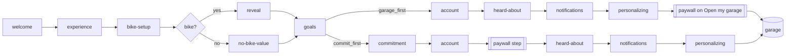

# feat: Onboarding paywall A/B (garage_first vs commit_first) + trial reminder

## Goal Capsule

- Objective: Every new MotoVault install sees a Pro paywall during onboarding again, at a point where it can neither strand a paying rider outside the app nor halve onboarding completion, and riders who start the 7-day trial are reminded before they are billed. Which of two onboarding shapes sells better is measurable in PostHog.
- Means: two PostHog-assigned onboarding variants that differ in paywall position (end of onboarding vs right after account) and in whether the commitment screen precedes account, both with the paywall after the account step (KTD1, KTD2), plus an app-scheduled local trial-ending reminder (KTD5).
- Authority: session-settled decisions (KTD1–KTD3, KTD6) > this plan > existing code conventions (CLAUDE.md).
- Stop conditions: stop and report if the paywall cannot be presented after account without breaking resume/Back (paywall↔account loop), or if a variant change would re-roll or strand existing `shipped`/legacy installs.
- Execution profile: mobile JS/TS only (apps/mobile) plus one doc; no RevenueCat dashboard changes, no OTA publish, no live PostHog flag/experiment creation. Ships to riders with the next store build, not by OTA (see Assumptions).
- Finish: open PR, CI decided, not merged.

---

## Product Contract

### Summary

Restore the onboarding paywall (removed 2026-08-24) as a 50/50 PostHog experiment between `garage_first` (paywall on "Open my garage") and `commit_first` (paywall right after account, preceded by the commitment screen). Ship onboarding friction fixes in both, and add a day-5 trial-ending reminder notification.

### Problem Frame

On 2026-08-24 the paywall was removed from onboarding (docs/Paywall-Timing-Decision-2026-08-24.md). Paywall traffic fell from ~32 to ~9 viewers a week, and riders who never see an onboarding paywall produced 5 purchases in ~6 weeks. The owner has overruled the removal (2026-10-07). The old position, before the account step, roughly halved onboarding completion (iOS 36.7% vs 69.2%) and let a rider pay and then abandon at account, owning a subscription for an app they could not enter. The data cannot yet say which post-account position sells better, so the plan tests two. The proposal "Concept A" (trial timeline) promises a Day-5 reminder; the owner asked that the app actually send it.

Research: session dossiers 04-onboarding-code.md (code audit) and 05-onboarding-data.md (funnel data), summarized under Sources.

### Requirements

- R1. New installs are assigned `garage_first` or `commit_first` by a new PostHog multivariate flag; the value persists per install and is registered as the `onboarding_variant` super/person property.
- R2. Existing installs keep their persisted variant (`shipped`, `lean`, `invested`, `control`) and its flow; nobody is re-rolled or reset mid-onboarding.
- R3. When PostHog cannot be asked (analytics off before consent — all EEA/UK/CH onboarding — or the flag fetch fails/times out), the variant is assigned on-device with a uniform 50/50 split and source `local`, so both arms keep the same market mix. When PostHog answers but the flag is disabled or returns an unknown value (kill switch), the variant is `garage_first` with source `fallback`.
- R4. `garage_first` flow: welcome → experience → bike-setup → reveal / no-bike-value → goals → account → heard-about → notifications → personalizing; the paywall presents when the rider taps "Open my garage", before onboarding is marked complete. It does not present on the cold-start resume path.
- R5. `commit_first` flow: welcome → experience → bike-setup → reveal / no-bike-value → goals → commitment → account → paywall → heard-about → notifications → personalizing.
- R6. In both variants the paywall comes after the account step, uses `presentPaywallIfNeeded` (Pro riders skip it), picks its RevenueCat placement from primary goal / maintenance intent, and always advances on purchase, close, not-presented or error. The close control is visible from the start (RevenueCat paywall config; no app-side delay).
- R7. Back navigation never lands on the paywall step and re-presents it.
- R8. A rider whose RevenueCat Pro entitlement is in a trial period and set to renew gets one local notification 2 days before the trial ends (day 5 of a 7-day trial); it is cancelled or not scheduled when the trial is cancelled, converted or already past that point, or when notification permission is not granted.
- R9. Onboarding fixes in both new variants: no invented rider count on reveal; no prefetch for the removed maintenance screen; progress bar denominator equals the rider's actual path; fixed animation waits trimmed; commitment screen without leftover `invested` branches and with a shorter hold; bike make must be a real make (no 1–2 character junk).
- R10. The ~6% Android onboarding `paywall_result=error` rate is investigated and any cause in our code is fixed; paywalls stay enabled in every market.
- R11. A decision record documents the overrule, the variants, metrics, guardrails, decision rule, exclusions, exact PostHog flag/experiment setup, and launch prerequisites.

### Acceptance Examples

- AE1. Fresh install, flag returns `commit_first`: after creating an account the RevenueCat paywall appears; closing it lands on heard-about. Back from heard-about goes to account, not the paywall.
- AE2. Fresh install, flag fetch times out (or resolves with no flags): the install is drawn on-device 50/50 with source `local`, so either arm is valid. A `garage_first` rider who reaches "Garage ready" and taps "Open my garage" sees the paywall; closing it opens the garage.
- AE3. Existing install with `shipped` persisted mid-onboarding: continues the shipped flow, sees no new paywall step.
- AE4. Rider starts a 7-day annual trial on day 0 with notifications granted: one reminder is scheduled for day 5; cancelling the trial in the store removes it on next app launch/customer-info update.
- AE5. Pro rider (existing subscriber) signing up on a new device: paywall step is skipped silently in both variants.

### Scope Boundaries

- Not changing RevenueCat paywall designs, offerings, placements config or publishing (dashboard work; Concept A redesign is separate).
- Not creating or launching the PostHog flag/experiment; the doc gives exact setup for the owner.
- Not publishing an OTA or building a store binary.
- Not turning on `CUSTOM_VARIABLES_SUPPORTED` (needs an Android device test on react-native-purchases-ui 10.4.2).
- Not adding any gate on logging (expenses, maintenance, rides).
- Considered and not built: a server-side (webhook-driven push) trial reminder. A local notification works with the existing notifications stack, needs no backend or RevenueCat webhook changes, and matches the 7-day trial; revisit if riders often reinstall or switch devices mid-trial.
- Considered and not built: hiding paywalls in markets where Play cannot sell. Owner decision: paywalls everywhere.

#### Deferred to Follow-Up Work

- Email-confirmation-mid-onboarding: investigate in U4; if not a small, safe change, record as follow-up in the PR.
- Bike-setup search-as-you-type redesign beyond make validation and fetch de-duplication.

### Sources

- Session research: 04-onboarding-code.md, 05-onboarding-data.md, 02-data-baseline.md (session scratchpad, not committed; key numbers repeated in the decision doc (U6)).
- docs/Paywall-Timing-Decision-2026-08-24.md, docs/plans/2026-08-24-1622-feat-activation-and-store-truth-plan.md.
- Proposal artifact: https://claude.ai/artifact/Sfcdn7sr3yqMqSgYu9FGcZ

---

## Planning Contract

### Key Technical Decisions

- KTD1. The onboarding flow contains a paywall again. (session-settled: user-directed — chosen over keeping onboarding paywall-free and waiting for the 08-24 stop-loss: removal cut paywall traffic ~32 → ~9/week.)
- KTD2. Two variants, `garage_first` and `commit_first`, both with the paywall after account. (session-settled: user-approved — chosen over the old lean position before account: it halved completion and allowed paid-then-cannot-enter.)
- KTD3. Assignment through PostHog, reusing the pre-retirement flag fetch pattern (2 s timeout race, `$feature_flag_called` exposure with `locally_defaulted`) from `git show cc48f1a9^:apps/mobile/src/lib/onboarding-experiment.ts`. (session-settled: user-directed — chosen over Superwall: existing plumbing, low traffic, native steps.)
- KTD4. New flag key `onboarding_paywall_2026q4`; variant values equal the `OB_VARIANT` strings. Legacy values stay read-only and keep resolving to `SHIPPED_FLOW`. The persisted variant gates which flow a rider sees, so existing installs are unaffected (R2).
- KTD5. Trial reminder is a local notification scheduled from RevenueCat customer info (entitlement `periodType === 'TRIAL'`, `willRenew`, `expirationDate`), reconciled on every customer-info update so cancellation/conversion clears it. Fire time = expiration − 48 h. Uses the existing `lib/notifications.ts` stack (iOS budget, permission check, channel).
- KTD6. Paywalls are shown in every market; the close control is visible immediately; lifetime stays on the paywall. (session-settled: user-directed — chosen over hiding gates in non-buying markets, delayed close, and moving lifetime behind "More plans".) Close and lifetime are RevenueCat dashboard properties, so the app side only guarantees close/error always advance.
- KTD7. `garage_first` presents the paywall inside `personalizing.tsx`'s "Open my garage" handler rather than as a flow step: the bike is already persisted server-side, there is no Back on that screen, and closing leads straight to the garage. `commit_first` uses the existing `(onboarding)/paywall.tsx` step screen.
- KTD8. Re-introduce an auto-advance skip set in `getPreviousRoute` containing `paywall`, as its own comment instructs.

### High-Level Technical Design

Commitment is bike-dependent and is skipped for bike-less riders (existing `BIKE_DEPENDENT_SCREENS`).

### Assumptions

- Enrollment requires a store binary that embeds this code (the next store build after 3.21.0). An OTA to 3.21.0 cannot enroll fresh installs: their first launch runs the embedded bundle, which persists `shipped` before an OTA can apply (expo-updates applies downloads on the next cold start), and R2 forbids re-rolling. The PostHog experiment targets that app version or later.
- PostHog React Native `reloadFeatureFlagsAsync` is still available on the installed posthog-react-native version (verify in U1).

---

## Implementation Units

### U1. Variant assignment through a new PostHog flag

**Goal:** New installs get `garage_first`/`commit_first` from PostHog with a safe fallback; legacy values untouched.

**Requirements:** R1, R2, R3

**Dependencies:** none

**Files:**
- apps/mobile/src/config/onboarding.ts
- apps/mobile/src/lib/onboarding-experiment.ts
- apps/mobile/src/stores/experiment.store.ts (`VariantSource` gains `local`)
- apps/mobile/src/__tests__/onboarding-ab.test.ts

**Approach:**
1. Add `GARAGE_FIRST` and `COMMIT_FIRST` to `OB_VARIANT`; add `ONBOARDING_EXPERIMENT_FLAG_KEY` constant (`onboarding_paywall_2026q4`) and a list of assignable variants.
2. Restore the flag fetch with timeout race, single in-flight promise, exposure capture (pattern from the pre-retirement file, KTD3). When analytics is disabled or the fetch fails, assign locally with a uniform 50/50 split (source `local`, R3); add `local` to `VariantSource`. An unknown or disabled flag value after a successful fetch resolves to `garage_first` with source `fallback`, so kill-switch users stay identifiable.
3. Persisted values short-circuit as today; dev override keeps working for all values.
4. `getOnboardingVariant` default for unassigned reads stays `shipped` (safest for already-running riders).

**Patterns to follow:** pre-retirement `onboarding-experiment.ts` (commit cc48f1a9^); current registerVariantWithAnalytics.

**Test scenarios:**
- Flag returns `commit_first` → variant `commit_first`, source `posthog`, exposure captured with `locally_defaulted: false`.
- Flag fetch exceeds 2 s → local 50/50 assignment (mock random), source `local`, exposure `locally_defaulted: true`.
- Flag returns unknown string → `garage_first`, source `fallback`.
- Persisted `shipped` → returned unchanged, no fetch.
- Analytics disabled → local 50/50 assignment, source `local`, no capture; both values reachable across random draws.
- Concurrent calls share one fetch.

**Verification:** unit tests pass; legacy values still resolve to `SHIPPED_FLOW`.

### U2. Flows and paywall placement for both variants

**Goal:** The two flows exist and the paywall presents at the right moment without loops.

**Requirements:** R4, R5, R6, R7

**Dependencies:** U1

**Files:**
- apps/mobile/src/config/onboarding.ts
- apps/mobile/src/app/(onboarding)/paywall.tsx
- apps/mobile/src/app/(onboarding)/personalizing.tsx
- apps/mobile/src/app/(onboarding)/_layout.tsx (comments only, unless needed)
- apps/mobile/src/config/__tests__/onboarding.test.ts
- apps/mobile/src/__tests__/onboarding-v2.test.ts
- apps/mobile/src/__tests__/onboarding-routes-exist.test.ts

**Approach:**
1. Define `GARAGE_FIRST_FLOW` and `COMMIT_FIRST_FLOW` arrays; map them in `ONBOARDING_FLOWS`.
2. Remove `PAYWALL` from `RETIRED_SCREEN_SUCCESSOR` only if no flow-less variant depends on it; since `shipped` riders could still hold `paywall` as lastCompleted from legacy flows, make retirement per-variant: a screen is "retired" for a variant when it is not in that variant's flow and has a successor mapping. Keep the mapping for legacy/shipped flows.
3. Add `AUTO_ADVANCE_SCREENS = {paywall}` skip to `getPreviousRoute` (KTD8).
4. Update `paywall.tsx` header comments; keep its mechanics (placement, escape hatch, checkpoint before present, advance on every result).
5. Root-gate race: the `completeOnboarding` mutation's `me` refetch lets the root NavigationGate flip to (tabs) before the payoff CTA renders. For `garage_first` (not `isResumed`), set an onboarding-store flag (e.g. `awaitingGarageCta`) before the mutation; NavigationGate treats `serverOnboardingCompleted` as false while it is set; the continue handler clears it after the paywall resolves. Persisted so a kill mid-paywall does not strand the rider (resume path clears it).
6. In `personalizing.tsx` "Open my garage": when variant is `garage_first`, present the onboarding paywall (same options as paywall.tsx: placement by goal/intent, `presentPaywallIfNeeded`, `silentOnError`, source onboarding, surface distinct e.g. `onboarding_garage_ready`), then `reset()` + `setOnboardingCompleted(true)` regardless of result; guard against double taps; never on `isResumed`. Track `onboarding_step_completed`-equivalent paywall_result for analytics parity.
7. Extract the shared "present onboarding paywall" logic from paywall.tsx into a small helper so both call sites use the same placement and personalization. When a session exists, the helper awaits the in-flight `loginRevenueCat` promise (bounded by the escape-hatch timeout) before presenting, so `presentPaywallIfNeeded` evaluates the real customer and Pro riders skip (AE5).

**Patterns to follow:** existing `paywall.tsx` (#188 lockout fixes), `GOAL_TO_PLACEMENT`, `MAINTENANCE_INTENT_PLACEMENT`.

**Test scenarios:**
- Covers AE1. `commit_first`: next after account is paywall; next after paywall is heard-about; previous of heard-about is account.
- `commit_first` bike-less: goals → account (commitment skipped).
- `garage_first`: flow has no commitment and no paywall step; next after notifications is personalizing.
- Covers AE3. `shipped` flow unchanged; persisted `paywall` lastCompleted on `shipped` still resumes to account.
- Routes-exist test covers new flows.
- NavigationGate does not flip to (tabs) while `awaitingGarageCta` is set, and does once it is cleared.
- Helper waits for RevenueCat logIn before presenting; times out to presenting anyway after the bound.
- Helper: maintenance intent → `onboarding_maintenance`; goal `discover_routes` → `onboarding_routes`.
- Covers AE2/AE5 (unit-level): garage_first continue handler calls the paywall helper then completes onboarding for purchased/cancelled/not_presented/error; does not call it when resumed.

**Verification:** tests pass; manual dev run with `EXPO_PUBLIC_OB_VARIANT` for each variant reaches the garage.

### U3. Day-5 trial-ending reminder

**Goal:** Riders in a renewing trial get one reminder 48 h before billing.

**Requirements:** R8

**Dependencies:** none

**Files:**
- apps/mobile/src/lib/trial-reminder.ts (new)
- apps/mobile/src/lib/notifications.ts (kind/channel constants)
- apps/mobile/src/lib/subscription.ts (call reconcile from customer-info handling)
- apps/mobile/src/i18n/locales/*.json (copy; en + all active locales)
- apps/mobile/src/lib/__tests__/trial-reminder.test.ts

**Approach:**
1. Pure function computing the desired reminder (fire date or none) from an entitlement snapshot `{periodType, willRenew, expirationDate}` and now.
2. Reconcile: persist the scheduled id + target in its own storage key (NOT the shared `@motovault/notification-map`, which `reconcileMaintenanceReminders` prunes). Before skipping a reschedule, confirm a notification with `data.kind === trial_reminder` still exists in `getAllScheduledNotificationsAsync()` (sign-out cancels all); otherwise reschedule. Cancel when the desired state is none. Respect permission (no prompt) and the iOS budget helper.
3. Call reconcile from the same place `updateStoreFromCustomerInfo` is fed (listener + initial fetch), without making that function async-impure for its tests (separate call site).
4. Notification copy: neutral, no price (price varies by store/territory): "Your MotoVault Pro trial ends in 2 days. You can manage or cancel it in your store subscription settings." `data.kind = trial_reminder`; tap opens the app (Profile → Subscription if a route exists, else home).
5. Add a notification channel for account/billing on Android if the existing channels do not fit.

**Patterns to follow:** `utils/ride-reminders.ts` (pure content + arm/cancel), `lib/notifications.ts` scheduling primitives, date-fns for date math.

**Test scenarios:**
- Covers AE4. TRIAL + willRenew + expiration in 7 days → reminder at expiration − 48 h.
- TRIAL + willRenew=false → no reminder; existing one cancelled.
- NORMAL period → none.
- Expiration − 48 h already past → none.
- Same expiration on repeated updates with the OS notification present → no reschedule.
- Same expiration but the OS notification missing (e.g. after sign-out/sign-in) → rescheduled.
- Permission not granted → nothing scheduled, no throw.

**Verification:** unit tests pass; manual sandbox trial on a dev build shows the scheduled notification in `getAllScheduledNotificationsAsync`.

### U4. Onboarding friction fixes

**Goal:** Remove known friction and untruths from the onboarding steps both variants share.

**Requirements:** R9

**Dependencies:** U2 (progress depends on flow arrays)

**Files:**
- apps/mobile/src/app/(onboarding)/reveal.tsx
- apps/mobile/src/app/(onboarding)/commitment.tsx
- apps/mobile/src/app/(onboarding)/experience.tsx, goals.tsx, personalizing.tsx (wait constants)
- apps/mobile/src/app/(onboarding)/bike-setup.tsx
- the hook/component computing onboarding progress (useOnboardingStep or equivalent)
- related tests under apps/mobile/src/**/__tests__/

**Approach:**
1. Reveal: hide the community line when `riderCount` is 0 (remove the "1 of 9" fallback); delete the `OemSchedulesPreview` prefetch.
2. Progress: compute both the step index and the total over the same visible-screen list (flow minus screens `isSkippedForBikeState` routes past), so the index and denominator agree.
3. Waits: reduce fixed delays to the minimum the work needs (keep personalizing's minimum only as long as the mutation + a short payoff; keep reduced-motion behavior).
4. Commitment: drop `isInvested` branches; shorten hold duration.
5. Bike-setup: make must be selected from the makes list or be at least 3 characters after trim; models query keyed so a year change does not refetch when cached.
6. Email confirmation: inspect account.tsx flow; if allowing the rider to continue before confirming is a small, safe change, do it; otherwise note as follow-up.

**Test scenarios:**
- Reveal with riderCount 0 renders no community line; with 12 renders the real number.
- Progress for garage_first and commit_first, with and without a bike: total equals visible screen count and the last visible screen has index total − 1; no-bike-value is not counted for bike riders.
- Make validation rejects "H", "ab", "  " and accepts a listed make.
- Commitment renders without invested-only copy.

**Verification:** tests pass; manual run of both variants shows correct progress and no invented count.

### U5. Android onboarding paywall errors

**Goal:** Understand and fix in-code causes of `paywall_result=error` on Android onboarding.

**Requirements:** R10

**Dependencies:** U2

**Files:**
- apps/mobile/src/lib/subscription.ts
- apps/mobile/src/lib/revenuecat-errors.ts
- tests under apps/mobile/src/lib/__tests__/

**Approach:** Break down PostHog `paywall_viewed`/result events (read-only) by `error_stage`, store country and app version for Android onboarding; classify store-environment errors (no Play billing in country, Play services missing) as expected so they do not alert, and fix any code path (e.g., present before offerings resolve) that errors. Paywalls remain enabled everywhere (KTD6). If the cause is entirely store-side, document it and change nothing beyond classification.

**Test scenarios:**
- A billing-unavailable error is classified expected and still advances onboarding.
- (Others depend on findings; add a regression test per code fix.)

**Verification:** findings written into the PR; tests for any fix pass.

### U6. Maestro flow and decision record

**Goal:** E2E flow reflects the new onboarding; the owner has exact setup and decision rules.

**Requirements:** R11

**Dependencies:** U1–U5

**Files:**
- apps/mobile/.maestro/flows/onboarding.yaml (if it asserts screens that moved)
- docs/Onboarding-Paywall-AB-2026-10-07.md (new)
- docs/Paywall-Timing-Decision-2026-08-24.md (add a superseded note at top)

**Approach:** Decision doc: launch needs the next store build (not OTA, see Assumptions); EEA/UK/CH riders are assigned locally and their onboarding events are not captured before consent; overrule, variants with flows (noting the commitment screen is a bundled second difference, so results compare whole flows, not paywall position alone), primary metric (trial or purchase within 7 days per onboarding starter), guardrails (completion; first ride/expense/maintenance within 7 days), ~45 riders/variant/week, decision rule at week 12, exclusions (internal cohort, SK), exact flag key/variants/50-50 rollout/new-installs-only, experiment setup steps, cutover annotation, launch prerequisites (the store build containing this code live in both stores and the experiment targeted to that version or later; RC onboarding placements `onboarding_rides/routes/default/maintenance` checked for immediate close and lifetime present; U5 outcome), trial-reminder behavior.

**Test expectation:** none -- docs and E2E flow config.

**Verification:** doc reviewed; Maestro flow file consistent with flows.

---

## Verification Contract

- `pnpm --filter mobile test` (Jest) covering new/updated tests in U1–U5.
- `pnpm lint` (Biome) and `pnpm typecheck`; `pnpm precheck` before PR.
- Manual dev-client smoke (optional, if simulator available): `EXPO_PUBLIC_OB_VARIANT=garage_first` and `=commit_first` each reach the garage; paywall appears once; Back never re-presents it.

## Definition of Done

- All units implemented; tests added per unit; precheck green.
- No change to RevenueCat config, no PostHog flag created, no OTA published.
- Legacy variants still resolve; no abandoned experimental code left in the diff.
- PR body lists: PostHog setup steps, launch prerequisites, follow-ups (custom variables Android test, email confirmation if deferred, U5 findings).
