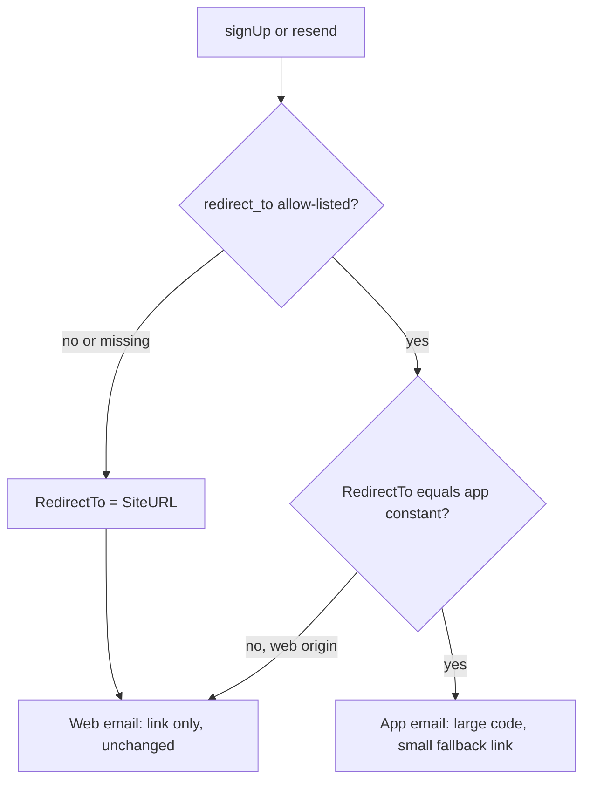
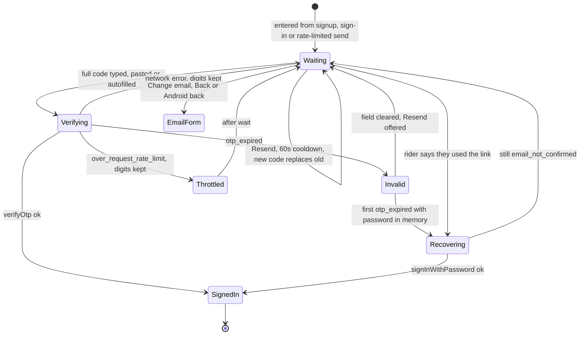

# Email Signup Code Confirmation - Plan

## Goal Capsule

- **Objective:** Every rider who signs up with email on a current version of the mobile app ends up signed in and back in onboarding, without needing a browser or the device the email was opened on.
- **Means:** App signups receive a code-first confirmation email and enter the code in the app. Web signups keep today's link email (Key Decisions; KTD1, KTD2).
- **Authority:** the owner's instructions in conversation, then `CLAUDE.md` and `apps/mobile/CLAUDE.md`, then this plan. R-IDs win on product behavior, KTDs win on mechanism.
- **Stop conditions:**
  - Stop and report if a local Supabase run shows `verifyOtp({ type: 'email' })` does not confirm a pending signup.
  - Stop and report if `{{ if eq .RedirectTo ... }}` does not render the app branch for an app signup.
  - Production template or auth-config changes and any OTA publish need the owner's explicit go-ahead at the moment of the change.
- **Execution profile:** implement on `fix/email-confirmation` (branched off `main`, research committed). Run `ce-code-review` before merge, including re-review of fix commits. The owner merges.

---

## Product Contract

### Summary

The confirmation email for app signups leads with a 6-digit code, and the app gets a "check your email" step where riders type or paste it, with a rate-limited Resend. Riders who try to sign in before confirming land on the same step instead of an error. Riders who tap the link instead still get in. Web signup and its link email do not change. RevenueCat is also told the rider's email.

### Problem Frame

Production keeps email confirmation on (`mailer_autoconfirm: false`), and the confirmation email holds only `{{ .ConfirmationURL }}`. The mobile Supabase client uses the implicit flow (no `flowType` in `apps/mobile/src/lib/supabase.ts`), so a tapped link returns the session in a URL `#fragment`. `apps/web/src/app/auth/callback/route.ts` cannot read that, and sends the rider to the web `/login`. The app is never told, so the rider has to work out on their own to go back and sign in before they reach the garage or the onboarding paywall.

Baseline (production, 30 days to 2026-10-08): 12 email signups, 9 confirmed, 8 completed onboarding, 6 added a bike. Most confirmed riders found their own way back by signing in. The loss is about 4 riders: 3 who never confirmed and 1 who confirmed but never finished onboarding. Riders who did return still paid the detour. None of the three signup surfaces offers resend, code entry or a pending state. The onboarding sign-in screen makes things worse: it tells an unconfirmed rider "no account found, create one" (`apps/mobile/src/app/(onboarding)/sign-in.tsx`, every HTTP 400 is treated as not-found).

### Key Decisions

- **App signups confirm with a code, web signups keep the link.** (session-settled: user-directed — chosen over making the link return to the app via PKCE plus a web handoff page, and over code-only for web too: a code needs no browser, deep link or same-device verifier, and web signup stays untouched.) Governs R1, R2, R3, R9.
- **Email confirmation stays on.** (session-settled: user-approved — chosen over turning confirmation off: Supabase only refuses to auto-link an unverified email identity, which is the pre-account-takeover protection, while confirmation is on.) Governs R1.
- **The app-branch email keeps a small fallback link.** Old app versions have no code field and send the same redirect value, so the link is their only way to confirm. Governs R2.

### Requirements

**Confirmation email**
- R1. An email-confirmation request from the app produces an email whose primary content is the 6-digit code, and states that it is valid for 1 hour.
- R2. The app-branch email also carries a secondary fallback link, with copy telling riders on older versions to update or tap the link and then sign in.
- R3. Confirmation emails requested from the web, from web signup, login resend or the auth modal, render exactly as today.

**Code step in the app**
- R4. After an email signup that returns no session, the rider stays in the app on a code step showing the address the code went to.
- R5. The code field accepts typed, pasted and iOS-autofilled codes, and ignores spaces, dashes and surrounding text in a paste.
- R6. A valid code signs the rider in, and they continue from where they signed up (onboarding advances, or the auth group switches) without another tap.
- R7. Resend sends a fresh code, is available once per 60 seconds, shows the remaining wait, and tells the rider to use the newest email.
- R8. A wrong or expired code shows one message covering both cases, clears the field and keeps Resend available. A network failure keeps the typed digits and is never reported as a wrong code.
- R9. A rider whose email was already confirmed, via the fallback link or another device, can get in from the code step without a new code.
- R10. The rider can go back from the code step to the email form to correct the address. Back never leaves onboarding from the code step, including the Android hardware back.

**Unconfirmed sign-in**
- R11. Signing in with the email and password of an unconfirmed account opens the code step with a freshly sent code, on both sign-in screens. It never shows "no account found".
- R12. Signing up again with an address that is still unconfirmed opens the code step. A send blocked by the 60-second limit opens the code step with the countdown running instead of an error.

**Purchases**
- R13. After a rider signs in, RevenueCat holds their email.

**Measurement**
- R15. Signup completion is counted when the code is verified, and codes sent, verified, failed and recovered are separately measurable, so stranding is visible.

### Success Criteria

- Over the first 4 weeks after release, the share of email signups that complete onboarding beats the baseline of 8 of 12, measured with the same production query (completed onboarding among `provider = email` users created in the window). Together, `email_code_verified` and `email_code_recovered` show how riders got in.
- No rider is ever shown "no account found" for an account that exists but is unconfirmed.

### Scope Boundaries

- Not changed: Google and Apple sign-in, web signup screens and their link email, the web callback route.
- Considered and not built: PKCE on mobile and a web handoff page. With a code there is no link flow left to fix for current builds.
- Considered and not built: universal links for `/auth`. They need a store build and do not fix the root cause on their own.
- Considered and not built: turning confirmation off. It removes the pre-account-takeover protection.
- Considered and not built: fixing link taps on old app versions, which still land on web `/login`. Those riders are confirmed and can sign in, and R11 then gets them in.
- Considered and not built: persisting the code step across an app kill. R11 and R12 recover it with one extra hop. Revisit if PostHog shows code-step abandonment after relaunch.
- Considered and not built: a code step in `AccountPromptSheet`. The component is imported nowhere, so it gets only the shared redirect constant.
- Considered and not built: cleanup of typo'd unconfirmed user rows. They are harmless and already counted server-side by migration 00174.

#### Deferred to Follow-Up Work

- Automatic purchase re-sync on a new sign-in (formerly R14). Deferred because, under RevenueCat's default "transfer to new App User ID" setting, an automatic `syncPurchases` can silently move Pro from another MotoVault account that shares the same App Store or Play account. It also does not help with confirmation. The follow-up should weigh it against the existing Restore button, confirm the dashboard transfer setting, check that iOS shows no Apple ID prompt, and gate it on the persisted `LAST_USER_ID`, never on `decideAuthStateChange(...).shouldIdentify`, which fires on every cold start.
- A `docs/solutions/` learning on Supabase OTP confirmation and production auth-config changes through the Management API (`ce-compound` after ship).

---

## Planning Contract

### Key Technical Decisions

- KTD1. **The template branches on `.RedirectTo`, not on user metadata.** Supabase templates are Go `html/template` with built-in `eq`. `ConfirmationMail` passes `RedirectTo` = the request's allow-listed `redirect_to` (`internal/utilities/request.go` `GetReferrer`). `.RedirectTo` describes the client that asked for *this* email, so an app signup that later resends from the web correctly gets a link. `.Data` is fixed on the user at signup and would send a code-only email to a web page with no code field. Verified in `docs/research/email-confirmation-2026-10-08/research-code-only.md`.
- KTD2. **One redirect constant, and one wrapper that is the only caller of `resend` and `verifyOtp`.** Unknown or missing `redirect_to` falls back to `SiteURL` and silently produces the web email (research-code-only, constraint 1). The constant is the existing allow-listed value `https://motovault.app/auth/callback?redirect=motovault://auth/callback`, matched byte for byte by the template. A structural contract test asserts every mobile `signUp` and `resend` passes it. Precedent: `apps/web/src/app/__tests__/post-auth-contract.test.ts`.
- KTD3. **Ship the template before the app.** Template first gives old apps a code they cannot use, but the same link as today (R2), so they are no worse off. App first would show new-app riders a code field with no code in their inbox. R9 recovery covers the window either way.
- KTD4. **The code step lives in component state, not the persisted onboarding store.** Persisting it needs a v9 store migration (store is at v8) for one saved hop after an iOS memory kill. Instead R11 and R12 route a relaunched rider back to the code step. The password stays in memory only and is never persisted.
- KTD5. **Recovery when the code was consumed elsewhere: sign in with the in-memory password.** On the first `otp_expired`, and on an explicit "I already confirmed via the link" action, call `signInWithPassword` with the password still held by the screen. Success means the email was confirmed elsewhere. `email_not_confirmed` keeps the rider on the code step. With no password in memory, the action routes to sign-in. Resend cannot detect this case: `resend({type:'signup'})` returns HTTP 200 with an empty body for an already-confirmed (or unknown) address (`resend.go`). So the "already confirmed" action stays visible throughout the code step, including during the resend countdown.
- KTD6. **Error classification by `error.code` first, message as fallback.** One pure classifier maps `email_not_confirmed`, `otp_expired`, `over_email_send_rate_limit`, `over_request_rate_limit`, and network failures. It mirrors web's `humanizeAuthError` in `apps/web/src/lib/auth-errors.ts`. In `(onboarding)/sign-in.tsx` it runs before the existing `status === 400` not-found branch.
- KTD7. **Analytics: `USER_SIGNED_UP {auth_method:'email'}` fires once per account, on the first session reached through the code step: a successful `verifyOtp` or a successful KTD5 recovery, whatever screen the step was entered from.** The code step only ever confirms a not-yet-confirmed account, so the entry screen does not decide whether this is a signup. The pre-confirmation fire in `register.tsx` is removed, and `USER_SIGNED_IN` stays for sign-ins that never pass through the code step. New `AnalyticsEvent` constants (`email_code_sent`, `email_code_verified`, `email_code_failed`, `email_code_recovered`) each carry `source` (`signup`, `signin_unconfirmed`, `resend`) or `reason`, and each needs a call site (catalog test). Nothing in the code step may call `resetUser` or `signOut`, so the `prevUserIdRef` real-logout guard in `_layout.tsx` never fires and pre-signup anonymous events stay attached (`docs/solutions/integration-issues/posthog-onboarding-funnel-instrumentation.md`).
- KTD8. **The RevenueCat email goes in the existing `onAuthStateChange` signed-in branch.** That one place covers every route into a session: code verify, recovery, password sign-in and OAuth. `setEmail` runs with the session email through the `withRevenueCat` best-effort pattern in `apps/mobile/src/lib/subscription.ts`. The automatic purchase re-sync is deferred (Scope Boundaries).
- KTD9. **Code input is one visible `TextInput`**, not hidden-input-behind-boxes:
  - `keyboardType="number-pad"`, `textContentType="oneTimeCode"`, `autoComplete="one-time-code"`.
  - `maxLength` comes from `EMAIL_OTP_LENGTH`; digits are stripped on change; it auto-submits at full length.
  - This keeps VoiceOver, Dynamic Type and Android paste working, since Android has no email-code autofill.
- KTD10. **The template lives in the repo.** `supabase/templates/confirmation.html` is wired through `[auth.email.template.confirmation]` in `supabase/config.toml`, so local runs render the same branch logic. Local `otp_length` becomes 6 to match prod. Production is updated through the Management API (`mailer_templates_confirmation_content`) from that file.

### High-Level Technical Design

Which email a request produces (R1–R3, KTD1, KTD2):

Code step states (R4–R12, KTD5, KTD6):

### Assumptions

- Signing up again with an unconfirmed address updates the stored password, so recovery uses the latest password. Verify against local Supabase in U3. If false, recovery after a re-signup routes to sign-in instead.

### Sequencing

U1 first. U2 depends on U1. U3 and U4 depend on U2. U5 and U6 are independent. U7 needs U3 and U6.

Production rollout order (KTD3):
1. Template, via U6's runbook, with owner approval.
2. App release: store build, or OTA to matching runtimes, with owner approval.
3. Verify that events arrive.

---

## Implementation Units

### U1. Auth email constants and confirmation wrapper

**Goal:** One source for the app's confirmation redirect, OTP length and cooldown, and one wrapper that sends, verifies and classifies, used by every app auth-email call.

**Requirements:** R1, R3, R8, R11, R12 (KTD2, KTD6)

**Dependencies:** none

**Files:**
- `apps/mobile/src/config/auth.ts` (new): `AUTH_EMAIL_REDIRECT_TO`, `EMAIL_OTP_LENGTH = 6`, `RESEND_COOLDOWN_MS = 60_000`, and an `as const` `AUTH_ERROR_CODE` map.
- `apps/mobile/src/lib/email-confirmation.ts` (new): send code (resend type `signup` with the constant), verify code (`type: 'email'`), classify error, normalize email (trim and lowercase).
- `apps/mobile/src/app/(onboarding)/account.tsx`, `apps/mobile/src/app/(auth)/register.tsx`, `apps/mobile/src/components/account-prompt-sheet.tsx`: replace the literal redirect with the constant.
- `apps/mobile/src/lib/__tests__/email-confirmation.test.ts` (new)
- `apps/mobile/src/lib/__tests__/auth-email-contract.test.ts` (new)

**Approach:**
1. Classification checks `error.code` first, then message text, then network-shaped errors. The rate-limit message's remaining seconds are parsed when present.
2. The contract test scans `apps/mobile/src` for `auth.signUp(` and `auth.resend(` call sites, and fails when one does not reference `AUTH_EMAIL_REDIRECT_TO`.

**Patterns to follow:**
- `apps/web/src/lib/auth-errors.ts` (`humanizeAuthError`, `RESEND_COOLDOWN_MS`)
- `apps/web/src/app/__tests__/post-auth-contract.test.ts`
- `as const` config in `apps/mobile/src/config/onboarding.ts`
- Supabase mock shape in `apps/mobile/src/lib/__tests__/oauth-errors.test.ts`

**Test scenarios:**
- Send code calls `auth.resend` with `type: 'signup'`, the trimmed, lowercased email and `emailRedirectTo === AUTH_EMAIL_REDIRECT_TO`.
- Verify code calls `auth.verifyOtp` with `type: 'email'` and the normalized email.
- An error with `code: 'email_not_confirmed'` classifies as not-confirmed, even when `status` is 400.
- An error with no code and the message "Email not confirmed" classifies as not-confirmed.
- `otp_expired` classifies as invalid-or-expired.
- `over_email_send_rate_limit` whose message includes "after 42 seconds" classifies as rate-limited with 42 s remaining. Without a number it defaults to 60 s.
- `over_request_rate_limit` classifies as throttled.
- A fetch `TypeError` or `AuthRetryableFetchError` classifies as network.
- An unknown error classifies as generic.
- Contract: every `signUp` or `resend` call site in `apps/mobile/src` passes the constant. Deliberately breaking one makes the test fail.

**Verification:** the three signup files no longer contain the literal URL, and both new test files pass.

### U2. Code step component, cooldown hook, copy and events

**Goal:** A reusable code step that any auth surface can show, with all copy translated and its events defined.

**Requirements:** R4, R5, R7, R8, R9, R10, R15 (KTD5, KTD7, KTD9)

**Dependencies:** U1

**Files:**
- `apps/mobile/src/components/auth/email-code-step.tsx` (new)
- `apps/mobile/src/hooks/use-resend-cooldown.ts` (new)
- `apps/mobile/src/lib/analytics.ts`: the four `email_code_*` events.
- `apps/mobile/src/i18n/locales/*.json`: new `auth.code*` keys in all 13 files. `auth.confirmationSent` is left in place until no screen uses it.
- `apps/mobile/src/components/auth/__tests__/email-code-step.test.tsx` (new)
- `apps/mobile/src/hooks/__tests__/use-resend-cooldown.test.ts` (new)

**Approach:**
1. Props carry the email, the entry source (signup or signin), an optional in-memory password, `onBack`, and color tokens. That lets the onboarding (`ONBOARDING_COLORS`) and `(auth)` (`palette`) themes both use it.
2. The component owns the verify, resend and recover calls through U1's wrapper and emits the U2 events. The session that follows a successful verify is picked up by the existing listeners, not by the component.
3. The cooldown hook stores a sent-at timestamp and derives remaining seconds with date-fns `differenceInSeconds` on a 1 s interval. It starts only after a successful send, or with the server-reported remaining time.
4. Errors map to distinct copy. Wrong-or-expired is one message (R8). `over_request_rate_limit` on verify shows a separate "too many attempts, try again shortly" message, keeps the digits and disables the field for the wait. It is never reported as a wrong code. Errors are announced with `AccessibilityInfo.announceForAccessibility`, and haptics fire on iOS for success and error.
5. The "already confirmed via the link" action is always visible, including during the resend countdown (KTD5).
6. Enter animations use reanimated `FadeInUp` under 300 ms, and rounded elements use `borderCurve: 'continuous'`.

**Patterns to follow:**
- `apps/mobile/src/components/onboarding/onboarding-continue-button.tsx`
- The `authInput` and `authButton()` styles in `account.tsx`
- Web's resend state shape in `apps/web/src/app/login/page.tsx`
- RNTL usage in the bike-hub component tests

**Test scenarios:**
- Pasting "Your code: 482 913" leaves `482913` in the field and calls verify once.
- Typing five digits does not verify, and the sixth triggers exactly one verify, even if the rider keeps typing during it.
- Verify fails with invalid-or-expired and no password in memory: the field clears, the single error message shows, and `email_code_failed {reason:'invalid_or_expired'}` fires.
- Verify succeeds: `email_code_verified {source}` and `USER_SIGNED_UP {auth_method:'email'}` each fire once, for both `signup` and `signin_unconfirmed` sources.
- First invalid-or-expired with a password in memory: `signInWithPassword` is attempted once. On success `email_code_recovered` and `USER_SIGNED_UP` fire. On `email_not_confirmed` the error message shows and no second automatic attempt happens.
- Verify fails with `over_request_rate_limit`: the throttled message shows, the digits stay, the field is disabled, and no wrong-code message or `invalid_or_expired` event appears.
- The "already confirmed via the link" action with no password calls the provided route-to-sign-in callback.
- Verify fails with a network error: the digits stay and no wrong-code message shows.
- Resend succeeds: the button is disabled with a countdown from 60, and `email_code_sent {source:'resend'}` fires. After 60 s of fake time it is enabled again.
- Resend fails with rate-limited 42 s: the countdown shows 42 and no error alert.
- Resend fails with network: Resend stays enabled.
- Resend succeeds while the countdown runs: the "already confirmed via the link" action stays visible and enabled.
- Back calls `onBack` and is not rendered while verifying.
- The cooldown hook with no successful send reports not cooling down.

**Verification:** component and hook tests pass, the i18n tests and `pnpm check:i18n` pass with the new keys in 13 files, and the analytics catalog test passes once U3 and U4 add the call sites.

### U3. Onboarding account step uses the code step

**Goal:** An email signup in onboarding continues to the code step and, once verified, on to the next onboarding screen.

**Requirements:** R4, R6, R9, R10, R12, R15 (KTD4, KTD5, KTD7)

**Dependencies:** U2

**Files:**
- `apps/mobile/src/app/(onboarding)/account.tsx`
- `apps/mobile/src/app/(onboarding)/__tests__/account-email.test.tsx` (new; first test for this screen)

**Approach:**
1. Replace the `checkEmail` alert branch with a local `codeStep` state that holds the normalized email and the password.
2. Map the rate-limited `signUp` error to the code step with the server-reported countdown. The `identities.length === 0` account-exists branch stays as is.
3. In the code step:
   - Back returns to the form with the email prefilled.
   - A `BackHandler` subscription (Android) does the same while the code step is shown.
   - The existing invariant stays: Back is hidden while busy or once a session exists.
4. The initial signup send is reported as `email_code_sent {source:'signup'}`. `USER_SIGNED_UP` fires from the code step (KTD7). The existing session effect advances onboarding unchanged.
5. Verify on local Supabase that re-signup updates the password (Assumptions).

**Patterns to follow:** the existing session effect and busy overlay in `account.tsx`, and `useOnboardingNext`.

**Test scenarios:**
- `signUp` returns a user, no session and one identity: the code step renders with the email, and no alert is shown.
- `signUp` returns `identities: []`: the account-exists alert with Sign in shows, unchanged.
- `signUp` fails with rate-limited 30 s: the code step renders with the countdown at 30, and no error alert.
- From the code step, Back shows the form with the email prefilled and the password field empty.
- From the code step, Android back does the same and does not leave the screen.
- Verify success fires `USER_SIGNED_UP` once with `auth_method: 'email'`. When the auth store gains a session, `goNext` is called once.
- Integration: verify success never calls `resetUser`, `logoutRevenueCat` or `signOut`.

**Verification:** on the simulator, an unconfirmed signup reaches the code step. The code from an admin `generate_link` response advances onboarding to the next screen.

### U4. Register and both sign-in screens

**Goal:** The legacy register screen uses the code step, and unconfirmed sign-ins land on it with a fresh code.

**Requirements:** R4, R6, R10, R11, R15 (KTD6, KTD7)

**Dependencies:** U2

**Files:**
- `apps/mobile/src/app/(auth)/register.tsx`
- `apps/mobile/src/app/(auth)/login.tsx`
- `apps/mobile/src/app/(onboarding)/sign-in.tsx`
- `apps/mobile/src/app/(onboarding)/__tests__/sign-in-unconfirmed.test.tsx` (new)
- `apps/mobile/src/app/(auth)/__tests__/login-unconfirmed.test.tsx` (new)

**Approach:**
1. In `register.tsx`, show the code step on a no-session result, and remove the pre-confirmation `USER_SIGNED_UP`.
2. In both sign-in screens, classify the `signInWithPassword` error with U1. In `(onboarding)/sign-in.tsx` this runs before the `status === 400` not-found branch.
3. Not-confirmed shows the form's busy state, sends a code (`email_code_sent {source:'signin_unconfirmed'}`) and opens the code step with the password in memory. A rate-limited send opens it with the countdown. A network or generic send failure keeps the rider on the sign-in form with a "couldn't send the code" error, and never shows "no account found".
4. A code-step verify or recovery fires `USER_SIGNED_UP` (KTD7). `USER_SIGNED_IN` stays for direct sign-ins.
5. On all three screens, Back and the Android hardware back (`BackHandler`) from the code step return to that screen's own form, with the email prefilled and the password cleared (R10).
6. The root navigation gate switches groups once the session exists.

**Patterns to follow:** the existing sign-in error handling and `obSignInNotFound` copy in `(onboarding)/sign-in.tsx`, and the `Stack.Protected` gate in `_layout.tsx`.

**Test scenarios:**
- Onboarding sign-in with `{status:400, code:'email_not_confirmed'}`: a code is sent, the code step shows, and "no account found" is not shown.
- Onboarding sign-in with `{status:400, code:'invalid_credentials'}`: the not-found state shows, unchanged.
- Login with `email_not_confirmed` and a rate-limited send: the code step shows with the countdown and no error alert.
- Login with a network error on sign-in: the existing generic error alert shows.
- Register with no session: the code step shows and `USER_SIGNED_UP` is not fired until verify succeeds.
- Onboarding sign-in and login with `email_not_confirmed` and a network failure on the code send: the form stays, the "couldn't send the code" error shows, and no code step or "no account found" appears.
- On each of the three screens, Back from the code step shows that screen's form with the email prefilled.

**Verification:** on the simulator, signing in to an unconfirmed account from either screen opens the code step, and a valid code signs in.

### U5. RevenueCat email attribute

**Goal:** RevenueCat knows the rider's email after any sign-in, so support can find the customer.

**Requirements:** R13 (KTD8)

**Dependencies:** none

**Files:**
- `apps/mobile/src/lib/subscription.ts`
- `apps/mobile/src/app/_layout.tsx`
- `apps/mobile/src/lib/__tests__/subscription.test.ts` (add `setEmail` to the `react-native-purchases` mock)

**Approach:**
1. `loginRevenueCat` takes the session email and calls `setEmail` when it is present.
2. `_layout.tsx` passes `session.user.email` at the existing call site.
3. The call stays best-effort through `withRevenueCat`.
4. The RevenueCat SDK only syncs attributes that changed, so calling it on every auth event is acceptable.

**Patterns to follow:** `withRevenueCat` and `reportRevenueCatError` in `subscription.ts`.

**Test scenarios:**
- Login with an email calls `logIn` and then `setEmail(email)` once.
- Login with no email (for example an Apple relay without an email claim) skips `setEmail`.
- `setEmail` throws: the error is reported through `reportRevenueCatError` and login does not throw.

**Verification:** the subscription tests pass. On a device, a fresh sign-in shows `$email` on the RevenueCat customer.

### U6. Confirmation template and local config parity

**Goal:** The branching template is in the repo, renders identically on local Supabase, and has a safe production rollout path.

**Requirements:** R1, R2, R3 (KTD1, KTD3, KTD10)

**Dependencies:** none (U1's constant must match the template's string)

**Files:**
- `supabase/templates/confirmation.html` (new)
- `supabase/config.toml`: `otp_length = 6`, plus a `[auth.email.template.confirmation]` subject and content path.
- `docs/runbooks/supabase-confirmation-template.md` (new)

**Approach:**
1. The app branch shows the code large, the 1-hour validity, a "newest email wins" line, and the small fallback link with update copy. The else branch is today's production body, byte for byte.
2. Production rollout through the Management API:
   1. Snapshot `mailer_templates_confirmation_content` and `mailer_subjects_confirmation`.
   2. PATCH from the repo file.
   3. Read the values back and diff them against the file.
   4. Keep the snapshot as the rollback payload.
   - Token retrieval follows the existing keychain route. The owner approves at step 2.

**Execution note:** this is config and copy. Prove it with a local render of both branches rather than unit tests.

**Test expectation:** none -- template and config. Verification covers both branches.

**Verification:**
- On local Supabase, an app-redirect `signUp` email (Inbucket/Mailpit) shows a 6-digit code and the fallback link.
- A web-redirect `signUp` email matches today's body.
- The production read-back after PATCH equals the file.

### U7. End-to-end code confirmation flow

**Goal:** One automated flow proves the onboarding code path against a real Supabase backend.

**Requirements:** R4, R6 (covers the U3 path end to end)

**Dependencies:** U3, U6

**Files:**
- `apps/mobile/.maestro/flows/onboarding-email-code-signup.yaml` (new)
- `apps/mobile/.maestro/flows/onboarding-email-code-verify.yaml` (new)
- `apps/mobile/scripts/run-onboarding-email-code-e2e.sh` (new)

**Approach:**
1. Maestro flow variables are fixed at launch, so the script drives two flows.
2. Flow 1 signs up through the UI with a unique address and asserts the code step.
3. The script then calls admin `generate_link {type:'signup'}` for that email and reads `email_otp`. This issues a fresh code that replaces the emailed one, which is fine because the test only types this one.
4. Flow 2 runs with the code as a variable, types it and asserts the next onboarding screen.
5. The script deletes the user afterwards.
6. The run needs a standalone or preview build whose `EXPO_PUBLIC_SUPABASE_URL` points at local Supabase, with `SUPABASE_URL` and `SUPABASE_SERVICE_ROLE_KEY` overrides for the local stack.
7. Follow the gotchas in `apps/mobile/.maestro/README.md`: the custom keyboard, the "Save Password?" prompt, and the submit button below the keyboard.

**Patterns to follow:** `apps/mobile/.maestro/flows/onboarding.yaml` and `apps/mobile/scripts/run-onboarding-e2e.sh`.

**Test expectation:** the flow itself is the test.

**Verification:** the flow passes on the iOS simulator against local Supabase.

---

## Verification Contract

| Gate | Command | Applies to |
|---|---|---|
| Mobile unit and component tests | `pnpm --filter @motovault/mobile test` | U1–U5 |
| i18n completeness (13 locales, new keys) | `pnpm check:i18n` and `apps/mobile/src/__tests__/i18n.test.ts` | U2–U4 |
| Analytics catalog (every event has a call site) | `apps/mobile/src/lib/__tests__/analytics-event-catalog.test.ts` | U2–U4 |
| Lint, typecheck and tests, as CI runs them | `pnpm precheck` | all |
| Template render, both branches | local Supabase plus Inbucket/Mailpit | U6 |
| End-to-end code path | `apps/mobile/scripts/run-onboarding-email-code-e2e.sh` | U7 |
| Device checks: iOS "From Mail" autofill, Android paste | manual on device | U2 |

---

## Definition of Done

- Every unit's Verification holds, and `pnpm precheck` is green.
- No screen still shows the "we sent a confirmation link" alert for app signups, and the literal redirect URL appears only in `apps/mobile/src/config/auth.ts`.
- `ce-code-review` has run on the branch, including re-review of fix commits, and the owner has merged.
- The production template is applied with a before-snapshot and a matching read-back, or explicitly left for the owner. The app release (store build or OTA) happens only with the owner's go-ahead, after the template (KTD3).
- After release, `email_code_sent` and `email_code_verified` events are seen arriving in PostHog.
- Code from abandoned attempts is removed from the diff.

---

## Open Questions

- **Deferred to rollout:** which runtimes receive the app change? The OTA policy is `appVersion`. 3.22.0 is in review and the live store build is older, so each runtime needs its own publish or a store build. Decide with the owner at release.

## Sources & Research

- `docs/research/email-confirmation-2026-10-08/research-code-only.md`: verified template branching, the `verifyOtp` `type: 'email'` path, resend rotation, rate limits, and prod values (`mailer_otp_length` 6, `mailer_otp_exp` 3600).
- `docs/research/email-confirmation-2026-10-08/README.md`, `research-supabase.md`, `research-apple.md`, `research-revenuecat.md`: the option comparison, App Review 2.1 risk, and RevenueCat transfer behavior.
- `docs/solutions/integration-issues/posthog-onboarding-funnel-instrumentation.md`: the identity and reset guard, and `user_signed_up` timing.
- `docs/solutions/integration-issues/i18n-missing-keys-ci-failure.md`: all locale files on disk are enforced.
- `docs/solutions/build-errors/eas-ota-runtime-version-mismatch-and-easignore.md`: OTA runtime matching.
- Supabase Auth source (`internal/api/mail.go`, `verify.go`, `resend.go`, `signup.go`, `internal/mailer/templatemailer/`) and docs: [email templates](https://supabase.com/docs/guides/auth/auth-email-templates), [rate limits](https://supabase.com/docs/guides/auth/rate-limits).
