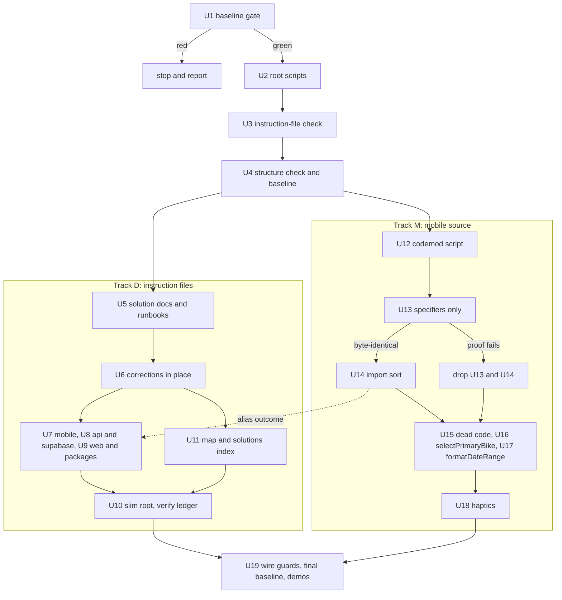

# Mobile Structure, Guards and Instruction Files - Plan

## Goal Capsule

- **Objective:** A coding session on MotoVault starts from instruction files that are true and scoped to where it works, places and finds mobile code by a written rule, verifies one app with one command, and is stopped by a check when it would let the instruction files or the mobile structure drift. Riders see no difference.
- **Means:** One pull request, "PR A", made only of documentation, deletions, guards and mechanical rewrites that each carry their own proof (KTD3, KTD4).
- **Authority:** The owner's stated goals, then the scope decided by the three-panel review the owner delegated the decision to, then `CLAUDE.md` conventions, then this plan. R-IDs win on scope, KTDs win on mechanism.
- **Execution profile:** 19 units, one commit each (U1 makes none, U14 may make none), on branch `refactor/mobile-structure`. A serial spine of four units, then an instruction-file track and a mobile-source track that touch no common file, then one wiring unit.
- **Stop conditions:**
  - Stop and report if the baseline in U1 is not green. Do not repair it here.
  - Remove U13 and U14 from the PR if any alias proof in KTD4 or KTD5 fails. Do not patch the codemod to make a proof pass.
  - Stop and report if a unit needs an edit to `apps/mobile/package.json`, `.claude/settings.local.json` or the `hooks` block of `.claude/settings.json`.
- **Who finishes:** Agents execute the units. The owner reviews, merges and decides the items in Owner Decisions. Nothing in this plan applies a migration, publishes an OTA or closes another pull request.
- **Open blockers:** None.

---

## Product Contract

### Summary

PR A corrects every false statement in the agent instruction files, moves app-specific rules and incident history out of the always-loaded root file, and writes down where mobile code goes.
It removes dead mobile code, rewrites deep relative imports to the `@/` alias, routes three exact-duplicate helpers through one implementation each, and adds checks to the existing precheck and CI path so none of it regresses.
Nothing in it changes what any app does at runtime.

### Problem Frame

The root `CLAUDE.md` is 20,335 bytes and is loaded into every session and every subagent.
46% of it applies to one app only and 30% is incident history.
Two audits found 25 statements in the instruction surface that the code contradicts.
One names a command that does not exist, and the hook that blocks edits to generated files tells the agent to run that same command.
One presents a production migration push as routine step 2 of any model change.
One documents an OTA recipe that the owner's own unmerged #233 says would have taken the app down.

Inside `apps/mobile/src` nothing guards structure.
Deep relative imports grew from 366 in July to 841 now, `app/_layout.tsx` grew from 795 to 1,128 lines, and the `@/` alias configured in `apps/mobile/tsconfig.json` is used zero times.
A feature lives in three different shapes and no file says which one is the rule.
The July audit's findings regrew because the checks that would hold them were advisory.

An OTA ships everything mobile on `main` since the store binary was cut.
The affected screens have little test reach, so a change that is only probably safe is not acceptable here.

### Key Decisions

- **One PR with no runtime behaviour change; data-layer fixes go to a separate PR B.** A revert of either must not revert the other, and one behaviour change would void the proof the mechanical commits rely on. (session-settled: user-approved — chosen over one combined refactor PR: the next OTA carries whatever is on `main` to every rider on 3.25.0.) Governs R1, R2, R3.
- **Freeze existing domain homes; send new domains to `features/`; relocate nothing.** A lookup table gives an agent the same answer as a 126-file move, at zero risk. (session-settled: user-approved — chosen over moving bike-hub and the other `components/<domain>` folders into `features/`: Expo's own guidance says not to restructure an existing app to match a target layout.) Governs R15.
- **The alias codemod is in, at three or more levels only, and is dropped rather than patched if its proof fails.** (session-settled: user-approved — chosen over deferring it and over a depth-2 rewrite: no live branch touches `apps/mobile/src` today, and depth 3 is the line that leaves `lib`, `hooks`, `stores`, `utils` and the bundle entry untouched.) Governs R17.
- **Deduplication is exact-match only.** A site whose copy differs in any observable way is left alone and listed. (session-settled: user-approved — chosen over consolidating `daysUntil`, the galleries and the OAuth handlers here: each of those changes what riders see.) Governs R18.
- **Guards are blocking and use a baseline file.** Existing violations are recorded, new ones fail. (session-settled: user-approved — chosen over advisory checks: knip has been advisory since July and the July findings regrew.) Governs R19, R20, R21, R22.
- **Production procedures are reworded in the conservative direction now, without waiting for the owner.** (session-settled: user-approved — chosen over leaving the `db push` and `.env.production` lines until the owner rules: the current wording is the riskier one.) Governs R5, R6.
- **The inventory of what exists is on demand; only placement rules load automatically.** (session-settled: user-approved — chosen over an architecture tour in the root file: the one controlled study found overviews do not shorten the path to the right file and raise cost about 20%.) Governs R12, R13.

<!-- ce-section: work-relationships -->
### How This Work Fits Together

This plan covers PR A: structure, guards and instruction files, with no runtime behaviour change.
The breakdown below is the current understanding, not a committed roadmap.

- **PR A (this plan).** Enables every later piece: the alias makes moves one-line changes, and the guards hold the line while they wait.
- **PR B: data-layer correctness and consolidation.** Planned separately, stacked on PR A, tests first.
  - Depends on PR A's alias and guards being merged.
  - Covers the four cache-key bugs, `queryOptions` factories for the shared documents, `lib/invalidate.ts` with dead invalidation removal, one date-fns `daysUntil`, the `PhotoGallery` merge and `tDynamic`.
  - Shares `selectPrimaryBike` with PR A: PR A adds the array-level function, PR B builds the query-level selector on it.
- **Follow-up issues, each its own PR, can proceed independently of PR B.**
  - `useOAuthSignIn`. Still to decide: the owner's ruling on OAuth sign-up and sign-in tracking.
  - Ride services out of `utils/`. Depends on PR A. The background GPS task registers at module scope, so it needs a real background ride to verify.
  - `lib/` grouping and bike-hub token promotion. Depend on PR A's alias.
  - `_layout.tsx` split and fat-route splits, one effect group or screen per PR.
  - Typechecked tests.
  - The depth-2 alias rewrite. Depends on PR A having shipped in a build without incident.
- **Open PR #233 (OTA command).** Absorbed by PR A. See R5 and R25.
- **Open PR #289 (dead-file deletion).** Overlaps PR A on six mobile source files. See R16 and R25.

### Requirements

**Behaviour preservation and baseline**

- R1. No commit in this PR changes what the mobile app, the web app or the API does at runtime; a change that cannot be shown to preserve behaviour leaves the PR.
- R2. Work starts from a recorded green baseline of the untouched tree; a red baseline stops the work and is reported, not repaired in this PR.
- R3. The PR description carries the baseline record, each proof, each guard's failure demonstration, the skipped-site lists, the owner decisions, and the note that the next OTA from `main` ships this change.

**Instruction files: truth**

- R4. Every statement the two audits found false, dead or contradicted in the instruction surface is corrected or removed; Appendix B is the list.
- R5. OTA guidance says to publish with `--environment production` or the `Mobile OTA Update` workflow, never with a local env file, and keeps every trap #233 recorded.
- R6. The data-model sequence makes applying a migration to production an owner-approved step and asserts no procedure that the tracked evidence contradicts.
- R7. The modal rule is the three-way rule the layouts follow, and mobile design guidance points at `apps/mobile/DESIGN.md` and `apps/mobile/PRODUCT.md`.

**Instruction files: structure**

- R8. The root `CLAUDE.md` is at most 80 lines and 5,500 bytes and holds only cross-cutting rules and a short routing table.
- R9. A rule that applies to one app or package lives in that app's or package's instruction file, including new files for `supabase/` and `packages/design-system/`.
- R10. Each incident narrative lives in `docs/solutions/` and leaves a one-line rule behind in an instruction file; three narratives that exist only in the root file today get new solution documents.
- R11. The web design brief loads for web work only.
- R12. Each app's instruction file states where new code goes and how to verify that app, including how to run a single test.
- R13. A map of what is where and a generated index of `docs/solutions/` exist, are linked from the root in one line each, and never load automatically.
- R14. No rule is lost: Appendix A maps every rule in today's root file to its new home or to the tool that enforces it, and each safety rule stays in the root as one line as well as in its scoped file.
- R15. `apps/mobile/CLAUDE.md` carries the placement rule: existing domains keep their current homes, a domain with no folder yet goes in `src/features/<domain>/`, and nothing is relocated.

**Mobile code**

- R16. The verified-dead mobile source files, the unused query keys and the stray tracked files are removed; the known knip false positives are kept.
- R17. Imports that climb three or more directory levels use the `@/` alias, produced by a script checked into the repo, in two commits: specifiers only, then import sorting.
- R18. Three duplications are removed where and only where the copies are exactly equivalent: guarded haptics calls go through `apps/mobile/src/utils/haptics.ts`, the primary-bike expression becomes one `selectPrimaryBike`, and each identical `formatDateRange` pair becomes one function.

**Guards**

- R19. A check on the existing precheck and CI path fails when an instruction file cites a path or a `pnpm` script that does not exist, or exceeds its byte or line budget.
- R20. A check on the same path fails on a new deep relative import, a new mobile layering violation, or growth of a route file; violations recorded in the baseline file do not block.
- R21. Unused mobile source files fail the same path, provided the check runs reliably after a normal install.
- R22. Each guard is shown failing once on a deliberate violation before it is trusted.

**Verification commands**

- R23. One command per app runs that app's typecheck, tests and own guards, and each app's instruction file documents it.

**Constraints and related work**

- R24. `apps/mobile/package.json` and `.claude/settings.local.json` are not edited, and the `hooks` block of `.claude/settings.json` stays byte-identical.
- R25. The PR states how it relates to #233 and #289 precisely enough that the owner can close or rebase each without re-deriving it.

### Acceptance Examples

- AE1. **Covers R2.** Given the untouched tree, when `pnpm precheck` or the mobile tests fail, then no unit starts and the failure is reported to the owner as found.
- AE2. **Covers R1, R17.** Given the specifiers-only commit, when the production export for either platform differs from the reference in any byte of the shipped bundle, then both alias commits are removed from the PR and the rest proceeds.
- AE3. **Covers R17.** Given a specifier of three or more levels that resolves outside `apps/mobile/src` or to a non-code asset, when the script runs, then that specifier is left relative and the deep-import guard allows it by rule.
- AE4. **Covers R18.** Given a haptics call that is not inside an iOS guard, when the rewrite runs, then the call is left as it is and listed, because the wrapper would switch it off on Android.
- AE5. **Covers R18.** Given a primary-bike site where the type checker rejects the shared function, when the rewrite is applied, then that site is reverted and listed.
- AE6. **Covers R20.** Given a route file recorded in the baseline at N lines, when a commit takes it to N+1, then the check fails and names the baseline file; when a commit takes it below N, then the check passes and the baseline may be lowered.
- AE7. **Covers R19.** Given an instruction file that cites `pnpm generate:types`, when the check runs, then it fails and names the file and line.
- AE8. **Covers R14.** Given any line of today's root `CLAUDE.md` that states a rule, when a reviewer looks it up in Appendix A, then the appendix names a file that contains the rule after the PR, or the tool that enforces it.

### Success Criteria

| Measure | Before (`origin/main` at 1edc49cd) | After |
|---|---|---|
| Bytes loaded at session start, and into every subagent | 20,335 | at most 5,500 |
| Bytes loaded for a mobile task | 26,022 | at most 13,000 |
| Bytes loaded for an API task | 23,373 | at most 10,500 |
| Bytes loaded for a web task | 21,430 | at most 12,000 |
| Statements contradicted by the code | 25 | 0 |
| Cited `pnpm` scripts that do not exist | 3 citations of `pnpm generate:types` | 0, checked on every push |
| Solution documents reachable from an instruction file | 4 of 31 | all, through the index |
| Deep relative imports to code under `apps/mobile/src` | 841 in 175 files | 0 if the codemod's proof holds, otherwise no more than today |
| Guards on structure inside `apps/mobile/src` | 0 | 3 ratchets and a blocking unused-file check |

### Scope Boundaries

**Deferred to PR B**

- The four cache-key bugs, `queryOptions` factories, `lib/invalidate.ts`, dead invalidation removal, one `daysUntil`, the `PhotoGallery` merge, `tDynamic`.

**Deferred to Follow-Up Work**

- `useOAuthSignIn`, ride services out of `utils/`, `lib/` grouping, bike-hub token promotion, the `_layout.tsx` split, fat-route splits, typechecked tests, the depth-2 alias.
- The direct haptics calls that are not in the exact guarded form today.
- Phantom dependencies in `apps/mobile/package.json`.
- A written rule on manual memoisation under React Compiler.
- The driver wording in `.claude/verification-config.json` and the project `lfg` and `slfg` skills.
- The split use of `EXPO_PUBLIC_API_URL` that #233 recorded; this PR documents it and does not fix it.

**Considered and not built**

- Path-scoped `.claude/rules/` files. Nested instruction files already meet R9 and R11 (KTD1). Evidence that would change the call: a session in which a nested file demonstrably fails to load, or `apps/web/CLAUDE.md` outgrowing its budget.
- A `SessionStart` hook that reports a stale checkout. It is a change to shared hooks, which R24 excludes. See Owner Decisions.
- Adding the structure baseline to `.claude/hooks/protected-files.txt`. A raised baseline already shows up as a reviewed diff.
- Release or OTA skills. A rule line plus a runbook loads without a decision; a skill does not.
- Automated tests for the two new root guard scripts. No root test runner exists; R22's failure demonstrations cover them once. Accepted exposure: a later edit could make a guard pass silently. Evidence that would change the call: a guard found passing on a violation.

**Outside this PR**

- The owner's memory index, which is not in the repo.
- Applying anything to production, and publishing any OTA.
- Repairing a red baseline.

### Owner Decisions

Each row is something only the owner can settle. The default is what this plan does until then.

| # | Decision | Default taken meanwhile |
|---|---|---|
| 1 | Is `npx supabase db push` retired, or repaired with a non-interactive database password? | Step 2 of the data-model sequence becomes an owner-approved step. The runbook records that the Management API is the route the tracked docs show working and that `db push` blocks on a password prompt. |
| 2 | Add a `SessionStart` hook that prints one line when `HEAD` is behind `origin/main`? | Not added. The root file says to run `git fetch` and compare before auditing. |
| 3 | Should OAuth sign-ups from `apps/mobile/src/app/(onboarding)/account.tsx` fire the sign-up event? | Untouched. It gates the `useOAuthSignIn` follow-up. |
| 4 | Mobile locale count: 13 in code, 7 in the August decision. | Instruction files name `SUPPORTED_LOCALES` instead of a number. |
| 5 | Close #233 once PR A merges, and rebase or close #289? | PR A absorbs all of #233 and six of #289's files; nothing is closed by this work. Appendix D has the detail. |
| 6 | About 33 direct haptics calls are not in the exact guarded form, and some of them fire on Android today, against the written rule. | Left as they are and listed in the PR description. |
| 7 | `apps/mobile/src/lib/paywall-validation.ts` is reachable only from its own test. | Kept. |
| 8 | Keep `.claude/settings.local.json` tracked? | Untouched. Only the comment in `.claude/settings.json` that calls it git-ignored is corrected. |
| 9 | Compare `eas env:list production` with the local `.env.production` once, now that EAS is what ships. | Not run; recorded in the OTA runbook as a one-time check. |

### Dependencies / Assumptions

- The worktree is `refactor/mobile-structure` from `origin/main` at 1edc49cd, app version 3.25.0, with no `node_modules` yet.
- No live branch changes a file under `apps/mobile/src`.
- Nothing merges to `main` under `apps/mobile/src` while the codemod is in review. If something does, the script is re-run on the rebased tree and U13's proofs are repeated.

### Sources / Research

- Five audits and three panel reports written this session against `origin/main` at 1edc49cd. They are not in the repo; the facts this plan relies on are restated here and were re-checked in the worktree.
- `gh pr view 233` and `gh pr view 289`, read 2026-10-10.
- Anthropic, How Claude remembers your project: https://code.claude.com/docs/en/memory
- Gloaguen et al., Evaluating AGENTS.md: https://arxiv.org/abs/2602.11988
- Vercel, AGENTS.md outperforms skills in our agent evals: https://vercel.com/blog/agents-md-outperforms-skills-in-our-agent-evals
- Expo, src directory and path alias: https://docs.expo.dev/router/reference/src-directory/

---

## Planning Contract

### Key Technical Decisions

- KTD1. **Scoped loading uses nested `CLAUDE.md` files and on-demand docs only.** A nested file loads when any file in its directory is read and cannot fail silently. A path-scoped rule loads nowhere when its glob matches nothing and everywhere when its front matter fails to parse, and nothing in CI can see either. Every rule the panels wanted in a path-scoped file has a nested or root home: dependency rules in the root and `apps/mobile/CLAUDE.md`, Vercel and 404 rules in `apps/web/CLAUDE.md`, the CI probe rule already written in `.github/workflows/check-404-contract.yml`. Serves R9, R11, R13.
- KTD2. **The web design brief is a section of `apps/web/CLAUDE.md`, capped at 2,000 bytes.** It loads for every web read, UI or not, which costs a non-UI web task about 2 KB. That is the price of a brief that loads without the agent choosing to open it. Serves R11.
- KTD3. **The alias codemod is the first source change after the baseline.** The U1 reference export is then the direct comparator for the specifiers-only commit, and nothing else has to be unwound if the codemod is dropped. (session-settled: user-approved — chosen over running it last: a later position would compare against a tree already changed by deletions and deduplication.) Serves R1, R17.
- KTD4. **What "identical" means for each alias commit.**
  - Specifiers-only commit: the shipped bundle files for iOS and Android are byte-identical to the U1 reference. Source maps are excluded, because they embed the import lines.
  - Import-sort commit: byte identity is not claimed, since a moved import renumbers Metro's module IDs. The claim is three things: the bundled module set is unchanged, every changed file differs only in the order and whitespace of its import declarations, and the files whose import order changed are listed with the residual risk stated.
  - If the sort changes no file, there is no second commit and the first proof covers the whole codemod.
- KTD5. **The bundle comparator is chosen by a determinism control, before any claim.** U1 exports the untouched tree twice. The comparator is the Hermes bytecode if both runs match, otherwise the minified JavaScript from `--no-bytecode`. If neither is repeatable, the bundle proof does not exist and the codemod is dropped.
- KTD6. **The codemod is a ts-morph script that replaces string literals and nothing else.** `ts-morph` is already a root dev dependency.
  - It rewrites a specifier with three or more leading `../` in `import`, `export … from`, dynamic `import()`, `require()`, and the first argument of `jest.mock`, `jest.doMock`, `jest.unmock`, `jest.requireActual` and `jest.requireMock`.
  - It rewrites only when the target is a `.ts` or `.tsx` module under `apps/mobile/src`.
  - It leaves relative the four `features/carplay` imports that reach `apps/mobile/modules/carplay`, and every asset `require` such as the map-preview images.
  - It resolves the old and the new specifier and aborts if they differ.
  - It stays in the repo so a branch can re-run it after rebasing.
- KTD7. **Structure guards are one script and one baseline file.** `scripts/check-mobile-structure.ts` holds a rules table; `scripts/mobile-structure-baseline.json` records today's violations. The update mode only lowers counts and removes entries. Raising a number is a hand edit that shows in review.
  - Deep imports: per-file count of code specifiers with three or more `../`. After the codemod the map is empty, so the rule is hard; if the codemod is dropped, today's counts stand.
  - Layering: `utils` imports none of `lib`, `stores`, `hooks`, `components`, `features`, `app`. `lib`, `hooks`, `stores`, `theme`, `config` import none of `components`, `features`, `app`. Nothing outside `app` imports `app`. Test files are exempt.
  - Routes: a route under `src/app` recorded in the baseline may not exceed its recorded line count. A route not in the baseline may not exceed 300 lines.
- KTD8. **Guards run in three places.** `pnpm precheck`, `scripts/precheck-changed.sh` (the real pre-push hook) and the CI `arch` job run the instruction-file and structure checks. The unused-file check runs in `pnpm precheck` and as a blocking step in the CI `deadcode` job, ahead of the existing advisory step.
- KTD9. **knip's unused-file check is reliable and becomes blocking for mobile.** The audit's four disabled plugins were an artefact of a worktree with no install. With an install, `knip --include files --workspace apps/mobile` ran in under two seconds and exited 1 on unused files (knip 5.88.1, older checkout). It needs two config entries: `src/test/**` as an entry, and platform-suffixed files ignored. U1 repeats the run on `main`.
- KTD10. **Root `package.json` has one writer at a time, and `apps/mobile/package.json` has none.** All new scripts are root scripts. Units U2, U3, U4 and U19 are the only ones that edit root `package.json`, and they are serial. Jest needs no `moduleNameMapper`: `jest-expo` 57.0.3 builds it from `apps/mobile/tsconfig.json` `paths` when Jest runs from `apps/mobile`.
- KTD11. **Byte and line budgets are data in the instruction-file check.**

  | File | Lines | Bytes |
  |---|---|---|
  | `CLAUDE.md` | 80 | 5,500 |
  | `apps/mobile/CLAUDE.md` | 100 | 7,500 |
  | `apps/api/CLAUDE.md` | 60 | 5,000 |
  | `apps/web/CLAUDE.md` | 80 | 6,500 |
  | `supabase/CLAUDE.md` | 40 | 3,000 |
  | `packages/graphql/CLAUDE.md` | 25 | 1,600 |
  | `packages/types/CLAUDE.md` | 20 | 1,000 |
  | `packages/design-system/CLAUDE.md` | 15 | 900 |
  | `docs/MAP.md` | 150 | no cap |

  No line of the root file exceeds 300 bytes.
- KTD12. **Corrections land before the restructure, and the restructure is additive before it is subtractive.** U6 fixes false statements in place so each fix is a small readable diff. U7 to U9 add content to the scoped files while the root still carries it. U10 then removes it from the root. No intermediate commit has a rule in zero places.
- KTD13. **The exact guarded haptics form is defined syntactically.** A call qualifies when it is the only statement under `if (process.env.EXPO_OS === 'ios')` with no `else`, is not awaited, returned or chained, and its arguments are `Haptics.*` member expressions or identifiers. `Haptics.impactAsync()` with no argument is excluded: its default is Medium and the wrapper's is Light. On `main` this matches about 70 of 103 direct calls, and five local `haptic()` helpers whose bodies equal the wrapper. (session-settled: user-approved — chosen over rewriting every direct call: an unguarded call rewritten to the wrapper stops firing on Android.) Serves R18.
- KTD14. **`selectPrimaryBike` takes an array and has an inferred return type.** It replaces only the sub-expression `x.find((b) => b.isPrimary) ?? x[0]` where `x` is an identifier. Each site keeps its own tail such as `?? null` or `?.id`. An inferred return type means the type checker proves each site's type is unchanged. It lives in `apps/mobile/src/utils/`, which every caller's layer may import.
- KTD15. **The two `formatDateRange` pairs become two functions, moved verbatim.** One pair is long-form with a forced `en-US` locale; the other is short-form in the device locale. Their bodies move unchanged, including the locale literal and the `new Date` parsing. One pair is byte-identical; the other differs only in line wrapping.
- KTD16. **Two runbooks carry the procedure detail that the corrected lines point to.** `docs/runbooks/mobile-ota.md` receives all of #233's content. `docs/runbooks/supabase-migrations.md` records only what tracked files already state and marks Owner Decision 1 as open.
- KTD17. **The stray-file claim is dropped and the strays are deleted.** `apps/api/app.json`, `apps/web/app.json` and `apps/web/--output` (a stray PNG) are removed in U15. U6 drops the root sentence that says they were already removed. The `app.json` entry in `turbo.json` build inputs is left alone.

### High-Level Technical Design

Unit order and the two gates. Units in the same box touch no common file and can run in parallel.

### Assumptions

These were not confirmed with the owner or by a run. Each names the unit that tests it.

- Metro resolves `@/` in a production bundle despite the custom `resolveRequest` in `apps/mobile/metro.config.js`. Tested by the probe in U1.
- A production export of one tree is repeatable on this machine. Tested by the control in U1 (KTD5).
- Biome's import sort moves few or no statements after the rewrite, because `@/x` sorts where `../../../x` did relative to nearer imports. Measured in U14.
- A nested `CLAUDE.md` under `supabase/` and `packages/design-system/` loads the same way the five existing nested files do. Checked in a fresh session when one is available, and reported as run or not run.
- Every `docs/solutions/` file has front matter with `title`. The index generator falls back to the first heading when it does not.
- Shortening `apps/mobile/CLAUDE.md` to its budget loses no mobile rule. U7 lists any existing mobile line it shortens.

### Risks

| Risk | Mitigation |
|---|---|
| A safety rule lands only where it never loads | R14: safety rules stay in the root. U10 verifies Appendix A row by row. |
| The import sort changes module evaluation order in a route file | KTD4: the changed files are listed. `apps/mobile/index.ts` and `app/_layout.tsx` are not touched by a depth-3 rewrite. The entry order is pinned by an existing test. |
| A `jest.mock` string stops matching after the rewrite | The Jest pass list must equal the baseline test for test, not just in totals. |
| A ratchet blocks an urgent hotfix | The failure message names the baseline file and the edit that unblocks it. The edit is one reviewed line. |
| The instruction-file check produces false positives on prose | A skip list in the script, each entry with its reason. U3 must pass with the list short enough to read. |
| A deep `require()` or `import()` inside a `try` lands on `main` before a re-run. Expo keeps such a specifier string in the production bundle, so the byte proof would fail for a reason unrelated to behaviour | None exists at 1edc49cd. The stop condition still applies: the codemod is dropped, not patched. |
| #289 is merged first and deletes the same files | U15 rebases cleanly: a deleted file deleted again is no conflict in content. Appendix D lists the overlap. |

---

## Implementation Units

`$PROOF` below is a scratch directory outside the repo. Nothing in it is committed.

### Unit Index

| Unit | Title | Primary files | Depends on |
|---|---|---|---|
| U1 | Baseline gate | none | — |
| U2 | Root verify and dead-file scripts | `package.json`, `knip.json` | U1 |
| U3 | Instruction-file check | `scripts/check-agent-docs.ts`, `package.json` | U2 |
| U4 | Structure check and baseline | `scripts/check-mobile-structure.ts`, `scripts/mobile-structure-baseline.json`, `package.json` | U3 |
| U5 | Solution docs and runbooks | `docs/solutions/**`, `docs/runbooks/**` | U4 |
| U6 | Corrections in place | `CLAUDE.md`, nested `CLAUDE.md`, `.claude/**`, `apps/api/package.json` | U5 |
| U7 | Mobile instruction file | `apps/mobile/CLAUDE.md` | U6, U14 outcome |
| U8 | API and Supabase instruction files | `apps/api/CLAUDE.md`, `supabase/CLAUDE.md` | U6 |
| U9 | Web and package instruction files | `apps/web/CLAUDE.md`, `packages/*/CLAUDE.md` | U6 |
| U10 | Slim the root file | `CLAUDE.md` | U7, U8, U9, U11 |
| U11 | Map and solutions index | `docs/MAP.md`, `docs/solutions/README.md`, `scripts/gen-solutions-index.ts` | U6 |
| U12 | Alias codemod script | `scripts/codemod-mobile-alias.ts` | U4 |
| U13 | Alias rewrite, specifiers only | `apps/mobile/src/**` | U12 |
| U14 | Import sort after the rewrite | `apps/mobile/src/**` | U13 |
| U15 | Dead code and stray files | `apps/mobile/src/**`, `apps/api/app.json`, `apps/web/app.json` | U14 |
| U16 | `selectPrimaryBike` | `apps/mobile/src/utils/primary-bike.ts`, 9 call sites | U14 |
| U17 | `formatDateRange` pairs | `apps/mobile/src/utils/trip-date-range.ts`, 4 call sites | U14 |
| U18 | Haptics through the wrapper | about 40 files under `apps/mobile/src` | U15, U16, U17 |
| U19 | Wire the guards | `package.json`, `scripts/precheck-changed.sh`, `.github/workflows/ci.yml` | U10, U18 |

**Parallel groups**

- Serial spine: U1, U2, U3, U4.
- Track D (U5 to U11) and Track M (U12 to U18) run side by side. They share no file.
- Inside Track D: U7, U8, U9 and U11 are parallel. U7 waits for the alias outcome. U10 follows all four.
- Units that run in parallel each work in their own worktree and are committed to the branch in U-number order, so every V5, V6 and V13 measures a tree that holds one unit's change.
- Inside Track M: U15, U16 and U17 are parallel.
- U19 is last and alone.

### U1. Baseline gate

- **Goal:** Record a green baseline and the reference bundles, and settle the three open assumptions about the alias before any commit.
- **Requirements:** R2, R17. Covers AE1.
- **Dependencies:** None.
- **Files:** None. The unit ends with a clean `git status`.
- **Approach:**
  1. Install and run V1, V2, V3 on the untouched tree. Record the outputs in `$PROOF`.
  2. Record the mobile Jest pass list (V5, label `base`) and the test-file type-error set (V7, label `base`).
  3. Confirm `apps/mobile` holds no `.env*` file except `.env.example`. Write `$PROOF/export.env` with fixed dummy values for every key in `apps/mobile/.env.example`.
  4. Export both platforms twice (V6, labels `ref` and `ref2`). Apply KTD5 to pick the comparator.
  5. Jest probe: add a throwaway test that imports through `@/` and calls `jest.mock('@/…')`, run it, delete it.
  6. Metro probe: change one deep import in one leaf route to `@/`, export iOS, compare with `ref`, revert.
  7. Run `pnpm knip` and `pnpm exec knip --include files --workspace apps/mobile`; record both.
- **Test scenarios:** Test expectation: none — this unit changes no file.
- **Verification:** `$PROOF` holds the precheck output, `pass-base.txt`, `tsc-tests-base.txt`, `ref.sha`, `ref2.sha`, `modules-ref.txt` and the probe results. V13 is clean.
- **Behaviour proof:** Nothing is committed.
- **Outcomes that change later units:**
  - Baseline red: stop (AE1).
  - The unused-file run on `main` does not exit 1 on the six dead files, or reports a file other than those six and the two known false positives: U2 still adds `check:deadcode`, U19 does not wire it, and the PR description says so.
  - Export does not run, no comparator is repeatable, or either probe fails: U13 and U14 are dropped, U7 says the alias is not yet usable, and U4's deep-import counts stand.

### U2. Root verify and dead-file scripts

- **Goal:** Give each app one verify command, and add the unused-file command without wiring it.
- **Requirements:** R21, R23.
- **Dependencies:** U1.
- **Files:** `package.json`, `knip.json`.
- **Approach:**
  1. Add root scripts `verify:mobile`, `verify:api`, `verify:web`. Each runs `turbo typecheck test` filtered to `@motovault/<app>`, then that app's existing guards: `check:router` and `check:mobile-colors` for mobile, `check:api-bans` for the API.
  2. Add root script `check:deadcode` as `knip --include files --workspace apps/mobile`.
  3. In `knip.json`: add `src/test/**/*.{ts,tsx}` to the mobile `entry`, ignore `src/**/*.{android,ios}.{ts,tsx}`, and drop the `vitest.e2e.config.ts` entry for a file that does not exist.
- **Patterns to follow:** The existing `check:*` entries and the multi-task `turbo` call in the root `generate` script.
- **Test scenarios:**
  - `pnpm verify:mobile`, `pnpm verify:api` and `pnpm verify:web` each exit 0 on the baseline tree.
  - `pnpm check:deadcode` exits 1 and lists exactly the six dead files in Appendix D and no false positive. This is its failure demonstration for R22.
- **Verification:** V12 passes. V11 fails with the expected list. Wall-clock time of `pnpm precheck` and of `pnpm verify:mobile` is recorded for the PR description.
- **Behaviour proof:** Only `package.json` scripts and `knip.json` change. No source file and no dependency changes; `pnpm-lock.yaml` is untouched.

### U3. Instruction-file check

- **Goal:** A script that fails when an instruction file cites something that does not exist or exceeds its budget.
- **Requirements:** R19, R22. Covers AE7.
- **Dependencies:** U2.
- **Files:** `scripts/check-agent-docs.ts` (new), `package.json`.
- **Approach:**
  1. Scan every tracked `CLAUDE.md`, `.claude/hooks/protected-files.txt`, `.claude/verification-config.json`, `.claude/skills/**/*.md` and `docs/MAP.md` when present.
  2. Path check: each backticked token that looks like a repo path must exist, resolved against the citing file's directory and then the repo root. A glob must match at least one tracked file. Placeholders in angle brackets, URLs and package names are skipped.
  3. Script check: each `pnpm <script>` and `pnpm --filter <pkg> <script>` must name a script in the right `package.json`. pnpm built-ins are skipped.
  4. Budget check per KTD11.
  5. A `--report` flag prints findings and exits 0. Add root script `check:agent-docs` without the flag.
- **Patterns to follow:** `scripts/check-arch-boundaries.ts` for layout, `as const` tables and exit codes.
- **Test scenarios:**
  - Covers AE7. On the tree as it stands, the script reports `pnpm generate:types` in `CLAUDE.md`, `.claude/hooks/protected-files.txt` and `.claude/skills/feature-plan/SKILL.md`.
  - On the tree as it stands, it reports the root file over budget.
  - It does not report `pnpm install`, `pnpm exec …`, `<feature>` placeholders or `@motovault/*` package names.
  - A cited path that exists relative to the citing file but not the repo root passes.
- **Verification:** The report on the untouched tree is saved to `$PROOF` as the proof that the check detects the known defects. V8 passes.
- **Behaviour proof:** A new script and one script entry. Not wired into any hook yet, so no existing command changes.
- **Note:** The check cannot see that `apps/api` `test:e2e` points at a missing config, because the script entry exists. U6 removes the entry.

### U4. Structure check and baseline

- **Goal:** The three structure rules of KTD7 as a script, with today's violations recorded.
- **Requirements:** R20, R22. Covers AE3, AE6.
- **Dependencies:** U3.
- **Files:** `scripts/check-mobile-structure.ts` (new), `scripts/mobile-structure-baseline.json` (new), `package.json`.
- **Approach:**
  1. Implement the rules table of KTD7 over `apps/mobile/src`, resolving both relative and `@/` specifiers.
  2. Generate the baseline from the current tree.
  3. Implement the lower-only update mode.
  4. Each failure message names the rule, the file, the baseline path and what to do.
  5. Add root script `check:mobile-structure`.
- **Patterns to follow:** `scripts/check-arch-boundaries.ts` for specifier extraction with ts-morph.
- **Test scenarios:**
  - On the baseline tree the script exits 0.
  - Covers AE3. The four `features/carplay` imports into `apps/mobile/modules/carplay` and the asset `require` calls are not counted as deep imports.
  - The baseline's layering edges include the ones the audit measured: `utils` importing `lib` and `stores` from six files, `hooks/sign-out.ts` importing a bike-hub component module, and `hooks/use-ride-idle-responses.ts` importing `features/ride`.
  - The baseline records every route over 300 lines; `app/(modals)/trip-detail.tsx` is recorded at 1,892.
  - Update mode never raises a count when run on a tree with a new violation.
- **Verification:** V10 passes. The baseline is sorted and Biome-formatted. V8 passes.
- **Behaviour proof:** A new script, a new data file and one script entry. Not wired yet.

### U5. Solution docs and runbooks

- **Goal:** Create the detail homes before anything is removed from the root file.
- **Requirements:** R5, R6, R10.
- **Dependencies:** U4.
- **Files:**
  - `docs/solutions/build-errors/renovate-dependabot-duplicate-bots.md` (new)
  - `docs/solutions/integration-issues/vercel-production-only-deployments.md` (new)
  - `docs/solutions/build-errors/turbopack-stale-build-cache-drops-css.md` (new)
  - `docs/runbooks/mobile-ota.md` (new)
  - `docs/runbooks/supabase-migrations.md` (new)
  - `docs/solutions/architecture/soft-delete-rejected-by-select-rls-policy.md` (only if a detail from root line 63 is missing from it)
- **Approach:**
  1. Move the narrative of root lines 100, 102 to 105 and 107 into the three solution docs, verbatim, with the front matter shape the existing solution docs use. The Renovate doc also takes the history in lines 109 and 110.
  2. Write the OTA runbook from the diff of #233: the publish command, the bundle check, the split use of `EXPO_PUBLIC_API_URL`, the scope of an OTA, the native-mismatch trap, Metro bundling from source, the EAS project ID and owner, and Owner Decision 9.
  3. Write the migrations runbook from tracked files only: `docs/Activation-Store-Truth-Runbook-2026-08-24.md`, `docs/HANDOFF-Growth-MOT-269.md`, the header of `supabase/migrations/00187_revenuecat_entitlement_source_of_truth.sql`, and `features/bike-detail-shell-overview/local-stack.md`. State that `pnpm db:types` and `pnpm generate` read the linked production project. State that Owner Decision 1 is open.
  4. Compare root line 63 with the existing soft-delete solution doc and add any sentence the doc lacks.
- **Test scenarios:** Test expectation: none — documentation only.
- **Verification:** V9 in report mode shows no missing path in the new files. Every sentence of root lines 100, 102 to 105 and 107 is found in a solution doc.
- **Behaviour proof:** Only new Markdown files under `docs/`.

### U6. Corrections in place

- **Goal:** Make every instruction file true before any content moves.
- **Requirements:** R4, R5, R6, R7, R24.
- **Dependencies:** U5.
- **Files:** `CLAUDE.md`, `apps/mobile/CLAUDE.md`, `apps/api/CLAUDE.md`, `apps/web/CLAUDE.md`, `.claude/hooks/protected-files.txt`, `.claude/settings.json`, `.claude/verification-config.json`, `.claude/skills/feature-plan/SKILL.md`, `apps/api/package.json`.
- **Approach:** Apply every row of Appendix B. In `.claude/settings.json` change the `$comment` string only.
- **Test scenarios:** Test expectation: none — documentation and one dead script entry.
- **Verification:**
  - V9 in report mode shows no path or script finding. Budget findings for the root file remain until U10.
  - Each corrected claim is checked against the file Appendix B names as evidence.
  - `jq -S .hooks .claude/settings.json` gives the same output as the same command on `origin/main`'s copy.
  - `pnpm verify:api` passes after the `test:e2e` entry is removed.
- **Behaviour proof:** No source file changes. The removed `apps/api` script could not run: its config file does not exist.

### U7. Mobile instruction file

- **Goal:** `apps/mobile/CLAUDE.md` holds the mobile rules that are in the root today, the placement rule and the verify commands.
- **Requirements:** R5, R7, R9, R12, R15, R23.
- **Dependencies:** U6, and the outcome of U13 and U14.
- **Files:** `apps/mobile/CLAUDE.md`.
- **Approach:**
  1. Add "Where things go" from Appendix C.
  2. Add the verify block: `pnpm verify:mobile`, the single-test form, the typecheck command, and a pointer to `apps/mobile/.maestro/README.md`.
  3. Receive the root rules Appendix A routes to MOB.
  4. State the import rule to match the alias outcome: `@/` for an import that leaves the file's top-level `src/` directory when the codemod is in, or "do not use `@/` yet" when it was dropped.
  5. Add the design pointer per R7.
  6. Use the `@motovault/mobile` filter form throughout.
- **Test scenarios:** Test expectation: none — documentation only.
- **Verification:** V9 in report mode shows no finding for this file, including its budget. Every Appendix A row routed to MOB is present. Any pre-existing mobile line that was shortened is listed for the PR description.
- **Behaviour proof:** One Markdown file.

### U8. API and Supabase instruction files

- **Goal:** API and database rules load when work happens in `apps/api` or `supabase/`.
- **Requirements:** R6, R9, R12, R23.
- **Dependencies:** U6.
- **Files:** `apps/api/CLAUDE.md`, `supabase/CLAUDE.md` (new).
- **Approach:**
  1. `apps/api/CLAUDE.md` receives the Appendix A rows routed to API, a "Where things go" block for modules, and the verify block with `pnpm verify:api` and the single-test form.
  2. `supabase/CLAUDE.md` holds: every change is a migration; the next number is above the highest version live on production; a migration that is live is frozen; RLS on every new table; the soft-delete RPC rule in full; role checks read `public.users.role`; applying to production is owner-approved; pointers to `supabase/checks/`, the migrations runbook and the soft-delete solution doc.
- **Test scenarios:** Test expectation: none — documentation only.
- **Verification:** V9 in report mode shows no finding for either file. Every Appendix A row routed to API or SUPA is present.
- **Behaviour proof:** Markdown only.

### U9. Web and package instruction files

- **Goal:** Web rules, the web design brief and the package rules load where they apply.
- **Requirements:** R9, R11, R12, R23.
- **Dependencies:** U6.
- **Files:** `apps/web/CLAUDE.md`, `packages/design-system/CLAUDE.md` (new), `packages/graphql/CLAUDE.md`, `packages/types/CLAUDE.md`.
- **Approach:**
  1. `apps/web/CLAUDE.md` receives the Appendix A rows routed to WEB, each as a one-line rule with its solution-doc path.
  2. Add "Where things go" for web: localised pages under `src/app/[locale]`, root-only sections and the two places that must agree on them (`next.config.ts` and `src/proxy.ts`), server and browser GraphQL clients.
  3. Add the verify block with `pnpm verify:web`, the single-test form and the Playwright command.
  4. Add the design brief section per KTD2, corrected: web is dark only today, and the motion and `borderCurve` bullets are mobile rules that do not belong in it.
  5. `packages/design-system/CLAUDE.md`: `palette` is the one colour source, which tokens are mobile and which are web, and which brief governs which.
  6. `packages/graphql/CLAUDE.md` receives the GraphQL type-safety rows. `packages/types/CLAUDE.md` changes only if a routed row is missing from it.
- **Test scenarios:** Test expectation: none — documentation only.
- **Verification:** V9 in report mode shows no finding for these files. Every Appendix A row routed to WEB, GQL, DS or TYPES is present. Every claim in the design brief is checked against `apps/web/src/app/layout.tsx`, `apps/web/src/providers/theme-provider.tsx` and `packages/design-system/src/mv-tokens.css`.
- **Behaviour proof:** Markdown only.

### U10. Slim the root file

- **Goal:** The root file reaches its budget with every rule accounted for.
- **Requirements:** R8, R13, R14. Covers AE8.
- **Dependencies:** U7, U8, U9, U11.
- **Files:** `CLAUDE.md`.
- **Approach:** Rewrite the root file to these sections, in this order:
  1. Title and two-line description.
  2. Where things live: one row per workspace with its entry directory and the file that holds its rules.
  3. Commands, including `typecheck`, `verify:*`, `db:*` and the `check:*` scripts, with `pnpm generate` mentioned once.
  4. Type system.
  5. Data-model sequence with the wording of R6.
  6. Conventions, deduplicated.
  7. Hard rules, one line each.
  8. Guards that will fail a push.
  9. When stuck: the solutions index, the map, and the stale-checkout note.
- **Test scenarios:**
  - Covers AE8. For each row of Appendix A, the named file contains the rule.
  - The seven safety rules appear in the root: service-role never for user-scoped writes, never expose the service-role key, RLS on every new table, soft delete only through the RPC, OTA only with `--environment production`, never commit `.env`, role checks never from `raw_user_meta_data`.
- **Verification:** `wc -l CLAUDE.md` is at most 80 and `wc -c CLAUDE.md` at most 5,500. V9 passes without the report flag. The Appendix A walk is recorded for the PR description.
- **Behaviour proof:** One Markdown file.

### U11. Map and solutions index

- **Goal:** The on-demand overview and a solutions index that cannot go stale.
- **Requirements:** R13, R19.
- **Dependencies:** U6.
- **Files:** `docs/MAP.md` (new), `scripts/gen-solutions-index.ts` (new), `docs/solutions/README.md` (new, generated), `scripts/check-agent-docs.ts`.
- **Approach:**
  1. `docs/MAP.md`: one section each for `apps/mobile`, `apps/api`, `apps/web`, `supabase/`, `scripts/` and `packages/`. Each row is a path and one line of purpose, built from the tree. No file counts and no line counts.
  2. The generator reads each solution doc's front matter and writes one row per doc: path, title, module, symptom.
  3. The generator has a check mode that fails when the committed index differs. The instruction-file check calls it.
- **Test scenarios:**
  - The generated index has one row for each of the 34 solution docs.
  - Adding a solution doc without regenerating makes `pnpm check:agent-docs` fail and name the index.
  - A path in `docs/MAP.md` that does not exist makes `pnpm check:agent-docs` fail.
- **Verification:** V9 in report mode shows no finding except the root file's budget, which U10 clears. `docs/MAP.md` is at most 150 lines.
- **Behaviour proof:** Markdown and scripts outside every app.

### U12. Alias codemod script

- **Goal:** The script of KTD6, committed before it is used so its run is reproducible.
- **Requirements:** R17. Covers AE3.
- **Dependencies:** U4.
- **Files:** `scripts/codemod-mobile-alias.ts` (new).
- **Approach:** Implement KTD6 with three modes: report counts, check (exit 1 if a run would change a file), and write.
- **Technical design:** Directional only. For each specifier: resolve it against the file's directory; skip if outside `apps/mobile/src` or not a TypeScript module; compute `@/` plus the path from `src`; resolve that through the `paths` mapping; abort the run on any mismatch; replace the literal's text and keep its quotes.
- **Test scenarios:**
  - Report mode on the baseline tree shows about 840 import and export specifiers and about 130 Jest string specifiers in 175 files, and zero files under `lib`, `hooks`, `stores`, `utils`, `config` or `theme` outside tests.
  - Covers AE3. The four carplay escapes and the asset `require` calls are reported as skipped.
  - Check mode exits 1 on the baseline tree.
- **Verification:** V8 passes. The report is saved to `$PROOF`.
- **Behaviour proof:** A new script that nothing invokes.

### U13. Alias rewrite, specifiers only

- **Goal:** Every deep code specifier uses `@/`, with statement order untouched.
- **Requirements:** R1, R17. Covers AE2.
- **Dependencies:** U12, and U1's probes having passed.
- **Files:** About 175 files under `apps/mobile/src`. No other file.
- **Approach:** Run the script in write mode. Do not run Biome. Do not hand-edit.
- **Execution note:** This commit is green on types, tests and the bundle, and is expected to fail `pnpm lint` on import order until U14. Do not push between U13 and U14.
- **Test scenarios:**
  - Covers AE2. The shipped bundle files for both platforms are byte-identical to `ref`.
  - The Jest pass list equals `pass-base.txt`.
  - The test-file type-error set equals `tsc-tests-base.txt`.
- **Verification:**
  - Reproducible: on a checkout of the parent commit, the script in write mode produces a tree with no diff against this commit under `apps/mobile/src`.
  - Shape: `git diff --numstat` shows equal insertions and deletions for every file.
  - Idempotent: the script's check mode exits 0.
  - V3, V4, V5 (label `u13`, diff against `base` is empty), V7 (label `u13`, diff empty), V6 (label `u13`, `u13.sha` equals `ref.sha` for the comparator chosen in U1).
- **Behaviour proof:** KTD4, first item. If any check fails, apply the second stop condition.

### U14. Import sort after the rewrite

- **Goal:** Restore Biome's import order and formatting.
- **Requirements:** R1, R17.
- **Dependencies:** U13.
- **Files:** The subset of U13's files that Biome changes.
- **Approach:** Run `pnpm exec biome check --write apps/mobile/src`. If it changes no file, this unit produces no commit.
- **Test scenarios:**
  - A throwaway comparison kept in `$PROOF` reports, for every file changed since U13: non-import statements identical, the same set of import declarations, and whether their order changed or only whitespace did.
  - The bundled module set equals `modules-ref.txt`.
  - The Jest pass list equals `pass-base.txt`.
- **Verification:** V8, V4, V5 (label `u14`), V6 (label `u14`, module set compared, hash compared and reported either way). The list of files whose import order changed goes into the PR description with the residual-risk statement of KTD4.
- **Behaviour proof:** KTD4, second and third items.

### U15. Dead code and stray files

- **Goal:** Remove what nothing uses.
- **Requirements:** R16, R21, R25.
- **Dependencies:** U14, or U1 if the codemod was dropped.
- **Files:** The deletions and edits listed in Appendix D.
- **Approach:**
  1. Before each deletion, search `apps/mobile` for the file's base name, including `app.config.ts`, `plugins/` and `.maestro/`.
  2. Delete the six dead files, and `hooks/use-update-user-preferences.ts` with its test.
  3. Remove the 15 unused keys from `lib/query-keys.ts` after confirming nothing iterates over `queryKeys`. Remove the unused `EPriority` export.
  4. Delete the three stray tracked files.
- **Test scenarios:**
  - `pnpm check:deadcode` exits 0.
  - The Jest pass list equals the previous list minus the tests of the one deleted test file.
  - The bundled module set equals the previous module set.
- **Verification:** V4, V5 (label `u15`), V6 (label `u15`, module set compared), V8, V11.
- **Behaviour proof:** The deleted files have no importer, so they were never bundled. The removed keys and export have zero references. The bundle is not byte-identical, because `lib/query-keys.ts` and `components/ui/editorial.tsx` change; the claim is an unchanged module set plus green types and tests.

### U16. `selectPrimaryBike`

- **Goal:** One implementation of "primary bike, else the first".
- **Requirements:** R18. Covers AE5.
- **Dependencies:** U14, or U1 if the codemod was dropped.
- **Files:** `apps/mobile/src/utils/primary-bike.ts` (new), `apps/mobile/src/utils/__tests__/primary-bike.test.ts` (new), and the nine sites: `lib/widget-sync.ts`, `features/carplay/use-carplay.ts`, `features/carplay/carplay-coordinator.ts`, `features/ride/ride-controller.ts`, `app/(modals)/whats-new.tsx`, `app/(tabs)/(learn)/index.tsx`, `components/diagnostic-flow/step-bike-selection.tsx`, `components/discover/bike-banner.tsx`, `hooks/use-primary-bike-fuel-data.ts`, all under `apps/mobile/src`.
- **Approach:** Per KTD14. Import through `@/` where the import would otherwise be three levels deep.
- **Test scenarios:**
  - A list with one primary bike returns that bike.
  - A list with no primary bike returns the first.
  - An empty list returns `undefined`.
  - A list with two primary bikes returns the first of them.
  - Covers AE5. A site the type checker rejects is reverted and listed.
- **Verification:** V3, V4, V5 (label `u16`: the previous list plus the new tests), V8. V10 is run and any route that grew by its new import line is noted for U19. The existing carplay-coordinator, ride-controller and widget-sync tests pass unchanged.
- **Behaviour proof:** Each site's replaced sub-expression is textually the function's body with the array substituted. The inferred return type makes V4 the proof that no site's type changed.

### U17. `formatDateRange` pairs

- **Goal:** Each identical pair becomes one function.
- **Requirements:** R18.
- **Dependencies:** U14, or U1 if the codemod was dropped.
- **Files:** `apps/mobile/src/utils/trip-date-range.ts` (new), `apps/mobile/src/utils/__tests__/trip-date-range.test.ts` (new), `apps/mobile/src/app/(modals)/trip-detail.tsx`, `apps/mobile/src/app/t/[token]/index.tsx`, `apps/mobile/src/app/(tabs)/(profile)/trips.tsx`, `apps/mobile/src/components/discover/planner/draft-trip-strip.tsx`.
- **Approach:** Per KTD15. Two exported functions with names that say long and short. Each call site keeps its call unchanged apart from the function name.
- **Test scenarios:**
  - Long form: two mid-day ISO timestamps in different months give `Month D, YYYY – Month D, YYYY` in English regardless of device locale.
  - Short form: equal start and end give a single date.
  - Short form: different start and end give two dates joined by an en dash.
- **Verification:** V3, V4, V5 (label `u17`), V8. `git diff` for the unit shows four function bodies removed and two added whose statements match the removed ones.
- **Behaviour proof:** The bodies move verbatim. A function declaration and an imported function are called identically.

### U18. Haptics through the wrapper

- **Goal:** Every call in the exact guarded form uses `apps/mobile/src/utils/haptics.ts`.
- **Requirements:** R18. Covers AE4.
- **Dependencies:** U15, U16, U17.
- **Files:** About 40 files under `apps/mobile/src`, found by the rule.
- **Approach:**
  1. Apply KTD13 with ast-grep rules: `impactAsync(x)` to `triggerImpact(x)`, `notificationAsync(x)` to `triggerNotification(x)`, `selectionAsync()` to `triggerSelection()`.
  2. Replace the five local `haptic()` helpers whose bodies equal the wrapper, and their calls.
  3. Remove an `expo-haptics` import only when Biome reports it unused.
  4. `pnpm check:i18n` lints the whole of every changed mobile file. A file whose rewrite makes V3 fail on a string this unit did not add is reverted and listed. `components/ride/hud-controls.tsx` is the known case: it holds a hard-coded `HOLD TO END`.
  5. List every direct call that was not rewritten, with the reason.
- **Test scenarios:**
  - Covers AE4. A call with no iOS guard is unchanged.
  - A guarded block that holds a second statement is unchanged.
  - A guarded call with an `else` branch is unchanged.
  - The Jest pass list equals the previous list.
- **Verification:** V3, V4, V5 (label `u18`), V8, V6 (label `u18`, module set compared). V10 is run and any route that grew by its new import line is noted for U19. The rules and the skipped-site list go into the PR description.
- **Behaviour proof:** The wrapper's body is the guarded statement. The only difference is that the argument is evaluated before the platform check, and KTD13 admits only arguments with no side effect.

### U19. Wire the guards

- **Goal:** The checks run on every push and in CI, with baselines at their final values.
- **Requirements:** R19, R20, R21, R22, R23.
- **Dependencies:** U10, U18.
- **Files:** `package.json`, `scripts/precheck-changed.sh`, `.github/workflows/ci.yml`, `scripts/mobile-structure-baseline.json`.
- **Approach:**
  1. Run the structure check's update mode for deep imports and layering. With the codemod in, the deep-import map becomes empty.
  2. Regenerate the route line counts from this tree, the first one that is final. U16 and U18 add an import line to some baselined routes. List every route whose count rose since U4, with the line that caused it, for the PR description.
  3. Wire per KTD8. Append `check:mobile-structure` and `check:deadcode` to `verify:mobile`.
  4. Demonstrate each guard failing on a throwaway violation, then remove the violation.
- **Test scenarios:**
  - Covers AE7. A `CLAUDE.md` line citing a missing script fails `pnpm check:agent-docs`.
  - A new import with three `../` in a mobile file fails `pnpm check:mobile-structure`.
  - A new `utils` file importing a store fails it.
  - Covers AE6. One added line in `app/(modals)/trip-detail.tsx` fails it; a new 301-line route fails it.
  - A new unimported file under `apps/mobile/src` fails `pnpm check:deadcode`.
- **Verification:** V2, V3, V9, V10, V11, V12, V13. `sh scripts/precheck-changed.sh` passes. The six failure outputs are saved for the PR description.
- **Behaviour proof:** Scripts, CI configuration and a data file. No app source changes.

---

## Verification Contract

`$PROOF` is a scratch directory outside the repo. `<label>` names the commit under test.

| ID | Command | Passes when |
|---|---|---|
| V1 | `pnpm install --frozen-lockfile` | exits 0 and `pnpm-lock.yaml` is unchanged |
| V2 | `pnpm precheck` | exits 0 |
| V3 | `pnpm check:i18n` | exits 0 |
| V4 | `pnpm --filter @motovault/mobile typecheck` | exits 0 |
| V5 | `pnpm --filter @motovault/mobile exec jest --json --outputFile="$PROOF/jest-<label>.json"`, then `jq -r '.testResults[] \| (.name \| sub(".*/apps/mobile/"; "")) as $f \| .assertionResults[] \| select(.status == "passed") \| "\($f) :: \(.fullName)"' "$PROOF/jest-<label>.json" \| sort > "$PROOF/pass-<label>.txt"` | Jest exits 0 and `diff` against the previous pass list shows only the delta the unit declares |
| V6 | In `apps/mobile`, with `$PROOF/export.env` exported: `npx expo export --platform ios --output-dir "$PROOF/<label>/ios" --source-maps --clear`, and the same for `android`. Then `(cd "$PROOF/<label>" && find . -type f \( -name '*.hbc' -o -name '*.js' \) \| sort \| xargs shasum -a 256) > "$PROOF/<label>.sha"` and `find "$PROOF/<label>" -name '*.map' \| xargs jq -r '.sources[]' \| sort -u > "$PROOF/modules-<label>.txt"` | the unit's stated comparison holds: equal hashes, or equal module sets |
| V7 | `pnpm --filter @motovault/mobile exec tsc --noEmit -p tsconfig.tests.tmp.json`, where that uncommitted file extends `./tsconfig.json` and sets `exclude` to an empty list. Reduce the output to file plus error code, sorted and counted. Delete the file afterwards. | the reduced output equals the baseline's |
| V8 | `pnpm lint` | exits 0 |
| V9 | `pnpm check:agent-docs` (before U19: `pnpm exec tsx scripts/check-agent-docs.ts`, with `--report` where a unit says so) | exits 0, or the report shows only the findings the unit expects |
| V10 | `pnpm check:mobile-structure` | exits 0 |
| V11 | `pnpm check:deadcode` | exits 0 from U15 on |
| V12 | `pnpm verify:mobile`, `pnpm verify:api`, `pnpm verify:web` | each exits 0 |
| V13 | `git status --porcelain` | empty apart from the unit's intended changes |

- If V6 with repeated `--platform` values is preferred, the two-invocation form above is the reference.
- A simulator smoke run (cold launch, open start-ride, open a garage sheet) is done only if a dev client matching 3.25.0 exists. It is reported as run or not run and is not a gate.
- A fresh-session check that `supabase/CLAUDE.md` and `packages/design-system/CLAUDE.md` load on a file read there is reported as run or not run.

---

## Definition of Done

**Global**

- Every unit's verification passed, or the unit was dropped under a stop condition and the PR description says so.
- `pnpm precheck` and `sh scripts/precheck-changed.sh` pass on the PR head.
- `git diff origin/main -- apps/mobile/package.json .claude/settings.local.json` is empty, and the `hooks` block of `.claude/settings.json` is unchanged.
- The PR title and description claim no behaviour change, and the description carries everything R3 lists: the baseline record, the alias proofs, the list of files whose import order changed, six guard failure outputs, the skipped haptics and primary-bike sites, the Appendix A walk, the timings from U2, the relation to #233 and #289 from Appendix D, and the Owner Decisions table.
- Every Success Criteria row is measured on the PR head and reported.
- No throwaway probe, temporary config or abandoned-attempt code remains in the diff, and `$PROOF` is outside the repo.
- Nothing was applied to production, no OTA was published, and no other pull request was closed.

**Per unit**

- One commit, containing only the files its unit lists. U1 makes none.
- Its behaviour proof is recorded where the unit says.
- U13 and U14 are both present or both absent, except that U14 makes no commit when the sort changes no file (KTD4).

---

## Appendix

### Appendix A. Rule ledger for today's root `CLAUDE.md`

Line numbers are those of `CLAUDE.md` at 1edc49cd. Homes: ROOT is the slimmed root file; MOB, API, WEB, SUPA, GQL, TYPES and DS are the `CLAUDE.md` of `apps/mobile`, `apps/api`, `apps/web`, `supabase`, `packages/graphql`, `packages/types` and `packages/design-system`. SOL is a file under `docs/solutions/`, RUN a file under `docs/runbooks/`. "Enforced" names the tool that makes the prose a reminder.

| Lines | Rule or content | New home | Note |
|---|---|---|---|
| 3 | Product description | ROOT | Corrected to the rider app: rides, expenses, maintenance, garage |
| 6 | Turborepo and pnpm workspaces | ROOT, Where things live | |
| 7 | `apps/mobile` is the Expo app | ROOT row, MOB title | Exact versions are read from `apps/mobile/package.json` |
| 8 | `apps/api` is NestJS code-first GraphQL | ROOT row, API | AI provider corrected |
| 9 | `apps/web` is Next.js | ROOT row, WEB | Adds the rider surface |
| 10–13 | The four packages | ROOT rows | Adds `packages/analytics` |
| 14 | `supabase/` holds migrations, seeds, RLS | ROOT row, SUPA | |
| 17–19, 22 | `dev`, `build`, `lint`, `test` | ROOT, Commands | |
| 20–21 | `precheck`, `precheck:push` | ROOT, Commands | Corrected to what the scripts run |
| 23 | `pnpm generate` | ROOT, Commands | The single mention; notes it reads production |
| 24 | `pnpm db:migration <name>` | ROOT, Commands | With `db:start`, `db:stop`, `db:reset`, `db:types` |
| 27–30 | Three type sources and where each is used | ROOT, Type system | |
| 33, 36–38 | Data-model sequence steps 1, 4, 5, 6 | ROOT | |
| 34 | Step 2, apply the migration | ROOT, SUPA, RUN `supabase-migrations.md` | Wording of R6 |
| 35 | Step 3, regenerate DB types | ROOT | `pnpm db:types` |
| 41–42 | snake_case in the DB, camelCase in TypeScript and GraphQL | ROOT, Conventions | |
| 43 | Map at the service layer; never expose snake_case | API | Already at API line 27 |
| 44–45 | GraphQL operation and file naming | ROOT, Conventions | |
| 46 | Expo routes are kebab-case | MOB | Already at MOB line 44 |
| 49, 122 | Types flow from `packages/` to `apps/` only | ROOT, Conventions | Enforced: `pnpm check:arch` |
| 123 | No relative paths across package boundaries | ROOT, Conventions | Enforced: `pnpm check:arch` |
| 50 | Shared validation is Zod in `@motovault/types` | ROOT, Conventions | |
| 51 | `.graphql` files live in each app's `src/graphql/` | ROOT, Conventions; GQL | |
| 52, 99, 118 | Run `pnpm generate` after resolver or `.graphql` changes | ROOT, Commands | Enforced: `.githooks/pre-commit` |
| 99 | Every `.graphql` document validates against the schema | GQL | Enforced: `.githooks/pre-commit` |
| 53 | Every DB change is a migration | ROOT, Hard rules; SUPA | |
| 54, 127 | Biome only | ROOT, Conventions | States the one exception, the mobile i18n ESLint config |
| 55 | Port assignments | ROOT, Commands | Duplicate of line 17 |
| 56 | Export both the Zod schema and the inferred type | TYPES | Already at TYPES line 13 |
| 57, 130 | `as const` objects, never `enum` | ROOT, Conventions; TYPES | |
| 60 | `SUPABASE_USER` for user-scoped CRUD and public-read tables | API | |
| 61 | `SUPABASE_ADMIN` uses; `users` column grants | API | Rule sentence; names migrations 00141 and 00178 |
| 62 | Never service-role for user-scoped writes | ROOT, Hard rules; API | |
| 63 | Soft delete through a `SECURITY DEFINER` RPC on the user client | ROOT, Hard rules (first sentence); SUPA and API (full rule) | Narrative: SOL `architecture/soft-delete-rejected-by-select-rls-policy.md` |
| 64 | Never expose the service-role key | ROOT, Hard rules; API | |
| 65 | `users` writes go through the user client | API | |
| 68 | Supabase Auth for all auth | MOB, API | |
| 69 | Tokens in expo-secure-store, never AsyncStorage | MOB | Already at MOB lines 23 and 52 |
| 70–71 | Local JWT validation with jose; `@CurrentUser()` | API | Already at API lines 15 and 22 |
| 72 | `signInWithIdToken`, not `signInWithOAuth` | MOB | |
| 75 | Reanimated v4, never the RN Animated API | MOB | |
| 76 | Haptics on iOS | MOB | Reworded: through `src/utils/haptics.ts` |
| 77 | `borderCurve: 'continuous'` | MOB | Already at MOB line 41 |
| 78 | Modal presentation | MOB | Three-way rule of R7 |
| 79–81 | Enter animations, stagger, under 300 ms | MOB | |
| 82 | Inline styles, not `StyleSheet.create` | MOB | |
| 85–88 | NHTSA vPIC API | API | One line pointing at `src/modules/motorcycles/nhtsa.service.ts`, which holds both endpoint URLs |
| 91–93 | OTA environment and command | MOB; ROOT, Hard rules; RUN `mobile-ota.md` | Wording of R5 |
| 94 | Runtime version policy | MOB | "The runtime version is `version` in `app.config.ts`"; the number is dropped |
| 95 | EAS project ID and owner | RUN `mobile-ota.md` | Also in `apps/mobile/app.config.ts` |
| 98 | Git hooks; `--no-verify` only when intentional | ROOT, Guards | Pre-push corrected to `precheck:push` |
| 100 | Renovate only; rule order; no lock-file maintenance; alerts on, security updates off | ROOT (one line with the SOL path) | Narrative and full rule: SOL `build-errors/renovate-dependabot-duplicate-bots.md` |
| 101 | `apps/web/vercel.json` is authoritative | WEB | |
| 102–105 | Both production-only layers are required | WEB | Narrative: SOL `integration-issues/vercel-production-only-deployments.md` |
| 106 | 404 contract; probe the `*.vercel.app` URL from CI | WEB | Narrative: SOL `runtime-errors/nextjs-streaming-swallows-404s-and-redirects.md`. Enforced: `not-found-contract.test.ts`, `check-404-contract.yml` |
| 107 | Leave the Turbopack build cache off | WEB | Narrative: SOL `build-errors/turbopack-stale-build-cache-drops-css.md`. Enforced: `apps/web/scripts/check-route-css.mjs` |
| 108 | Mapbox token split | WEB | Already at WEB line 25; the pointer back to the root is removed |
| 109 | `expo` and `react-native` only in `apps/mobile`; run Expo CLI from there | ROOT, Hard rules; MOB | History: the Renovate SOL. The "all removed" sentence is dropped in U6; U15 deletes the strays |
| 110 | `expo.install.exclude` for `@sentry/react-native` | MOB | History: the Renovate SOL |
| 113, 131 | Generated GraphQL types only, never `any` | ROOT, Conventions; GQL | |
| 114–117 | How to import and derive generated types | GQL | |
| 119, 132 | Colours come from `palette` | DS, MOB, WEB | Enforced on mobile: `pnpm check:mobile-colors` |
| 124–125 | Do not edit generated files | ROOT, Guards; TYPES; GQL | Enforced: the `PreToolUse` hook and `.claude/hooks/protected-files.txt` |
| 126 | Never commit `.env` files | ROOT, Hard rules | |
| 128 | RLS on every new table | ROOT, Hard rules; SUPA | |
| 129 | Role checks use `public.users.role` | ROOT, Hard rules; SUPA; API | |
| 137 | Users | WEB, design brief | Product framing corrected |
| 140–141 | Brand personality | WEB, design brief | |
| 144–146 | Visual tone, references, anti-references | WEB, design brief | |
| 147 | Theme | WEB, design brief; MOB pointer | Web is dark only today; mobile supports light and dark per `apps/mobile/DESIGN.md` |
| 148–149 | Typography and colour system | WEB, design brief | True for web only; mobile type is in `apps/mobile/DESIGN.md` |
| 150 | Motion | MOB | Already covered by lines 75 and 79 to 81 |
| 151 | Surfaces | WEB, design brief; MOB | `borderCurve` is a mobile rule; the card colour is the web token |
| 154–158 | Five design principles | WEB, design brief | Mobile is governed by `apps/mobile/DESIGN.md` and `apps/mobile/PRODUCT.md` |

### Appendix B. Corrections

Each row is applied in U6 unless the last column names another unit. Line numbers are at 1edc49cd.

| # | File and line | Today | Correction | Evidence |
|---|---|---|---|---|
| 1 | `CLAUDE.md` 3 | "AI-powered motorcycle learning & diagnostics platform" | Rider app: rides, expenses, maintenance, garage | `apps/mobile/src/app/(tabs)/_layout.tsx` hides learn and diagnose; `apps/mobile/PRODUCT.md` |
| 2 | `CLAUDE.md` 8; `apps/api/CLAUDE.md` 23 | API uses Claude or Anthropic | OpenAI SDK and Vercel AI SDK | `apps/api/package.json` |
| 3 | `CLAUDE.md` 5–14 | Package list | Add `packages/analytics`; web also serves signed-in riders | `packages/analytics` |
| 4 | `CLAUDE.md` 20 | `precheck` is lint, typecheck, test and matches CI | Five `check:*` scripts, then lint, typecheck, test; CI also runs `check:i18n`, the audit and knip | root `package.json`, `.github/workflows/ci.yml` |
| 5 | `CLAUDE.md` 21 | `precheck:push` ends at tests | It also runs `pnpm check:i18n` | `scripts/precheck-changed.sh` |
| 6 | `CLAUDE.md` 98 | Pre-push runs `pnpm precheck` | It runs `pnpm precheck:push` | `.githooks/pre-push` |
| 7 | `CLAUDE.md` 35; `.claude/hooks/protected-files.txt` 1; `.claude/skills/feature-plan/SKILL.md` 25 | `pnpm generate:types` | `pnpm db:types` | root `package.json` has no `generate:types` |
| 8 | `CLAUDE.md` 34 | "Push migration to production: `npx supabase db push`" | Owner-approved step, pointer to the migrations runbook, note that step 3 reads production | `docs/Activation-Store-Truth-Runbook-2026-08-24.md`, `packages/types/package.json` |
| 9 | `CLAUDE.md` 78; `apps/mobile/CLAUDE.md` 43 | formSheet "for modals" | `formSheet` for short forms with an explicit background; `fullScreenModal` for immersive, camera, map or long-content screens; `card` for a detail pushed inside a stack | the `presentation:` declarations under `apps/mobile/src/app` |
| 10 | `CLAUDE.md` 91–94 | The `.env.production` recipe and a quoted version | R5 wording; the version is read from `apps/mobile/app.config.ts` | `.github/workflows/mobile-ota.yml`, #233 |
| 11 | `CLAUDE.md` 109 | Stray `app.json` files "all removed" | Sentence dropped here; the strays are deleted in U15 | `git ls-files` |
| 12 | `CLAUDE.md` 54, 127 | No ESLint, no exception | One deliberate exception: `apps/mobile/eslint.config.mjs` | `apps/mobile/CLAUDE.md` 11 |
| 13 | `CLAUDE.md` 134–158 | Design context stated for all UI | Marked web-only; "Light + dark on web" corrected to dark only; mobile points at `apps/mobile/DESIGN.md` | `apps/web/src/providers/theme-provider.tsx`, `apps/mobile/DESIGN.md` |
| 14 | `CLAUDE.md` Commands | No `typecheck`, `db:*`, `check:*`, `verify:*` | Added | root `package.json` |
| 15 | `apps/mobile/CLAUDE.md` 17 | NativeTabs with four tabs: learn, diagnose, garage, profile | JS `Tabs`; home, discover, garage, profile visible; learn and diagnose hidden | `apps/mobile/src/app/(tabs)/_layout.tsx` |
| 16 | `apps/mobile/CLAUDE.md` 51 | Permissions in `app.json` | `app.config.ts`; there is no mobile `app.json` | `git ls-files apps/mobile` |
| 17 | `apps/mobile/CLAUDE.md` 42 | Use `headerSearchBarOptions` | Bullet deleted; zero uses in `src` | grep |
| 18 | `apps/mobile/CLAUDE.md` 21 | Zustand "for app preferences" | Zustand stores live in `src/stores` | 15 stores |
| 19 | `apps/mobile/CLAUDE.md` 10 | "13 locales" | Names `SUPPORTED_LOCALES` in `packages/types/src/constants/enums.ts` | Owner Decision 4 |
| 20 | `apps/api/CLAUDE.md` 7; `.claude/verification-config.json` 46; `apps/api/package.json` | `test:e2e` | Line, config entry and script entry removed | `apps/api/vitest.e2e.config.ts` does not exist |
| 21 | `apps/api/CLAUDE.md` 21 and 36 | The global-guard rule twice | One statement | — |
| 22 | `apps/web/CLAUDE.md` 11 | urql | `graphql-request` and TanStack Query | `apps/web/package.json` |
| 23 | `apps/web/CLAUDE.md` 12, 17 | Admin check in middleware | `src/proxy.ts` | `apps/web/src/proxy.ts`; no `middleware.ts` |
| 24 | `apps/web/CLAUDE.md` 25 | Points at the root for Mapbox | Pointer removed; the rule stays here | — |
| 25 | `.claude/settings.json` `$comment` | `settings.local.json` is git-ignored | It is tracked | `git ls-files .claude` |
| 26 | Nested files | `--filter mobile`, `--filter api`, `--filter web` | `--filter @motovault/<app>` | — |

### Appendix C. Mobile placement rule

The text U7 writes into `apps/mobile/CLAUDE.md`, shortened to fit the budget where needed.

**Where a domain lives**

| Domain | Home |
|---|---|
| ride, carplay, receipt-scan, create-trip | `src/features/<domain>/` |
| bike-hub | `src/components/bike-hub/` for UI and hooks, `src/lib/bike-hub/` for pure logic |
| any other existing domain | `src/components/<domain>/` |
| a domain with no folder yet | `src/features/<domain>/` |

Do not move an existing domain.

**Where a kind of file goes**

| Kind | Goes in | Rule |
|---|---|---|
| Route | `src/app/**` | Params, `Stack.Screen` options and one screen component. No hook definitions. The structure check caps a new route at 300 lines |
| Screen body | The domain home, as `<name>-screen.tsx` | |
| Hook | The domain home if one domain uses it, `src/hooks/` if two or more do | One hook per `use-*` file |
| Query | Keys always from `src/lib/query-keys.ts`. A document fetched from two or more files gets a factory in `src/lib/query-options.ts` | Every variable that changes the payload is in the key |
| Store | `src/stores/<name>.store.ts` | |
| Service: stateful, I/O, not React | The domain home, or `src/lib/` if no single domain owns it | |
| Pure helper | `src/utils/` if two or more domains use it, the domain home otherwise | `utils` imports nothing from `lib`, `stores`, `hooks`, `components`, `features` or `app` |
| Shared UI primitive | `src/components/ui/` | Imports no domain folder |
| Tokens | `src/theme/` | |
| Test | `__tests__/` beside the code; cross-cutting contracts in `src/__tests__/` | Never under `src/app` |

Allowed direction: `app` to `features` and `components`, to `hooks`, to `lib` and `stores`, to `utils`, `theme` and `config`. Nothing imports `app`. No barrel files.

### Appendix D. Dead code, strays, and the relation to #233 and #289

**Deleted in U15, all under `apps/mobile/src` unless a full path is given**

| Path | In #289 |
|---|---|
| `components/account-prompt-sheet.tsx` | yes |
| `components/garage/health-report-card.tsx` | yes |
| `components/diagnosis/affiliate-product-card.tsx` | yes |
| `components/share/share-ride.ts` | yes |
| `stores/trip-planner.store.ts` | yes |
| `config/bike-images.ts` | no |
| `hooks/use-update-user-preferences.ts` and `hooks/__tests__/use-update-user-preferences.test.tsx` | the hook, yes |
| `apps/api/app.json`, `apps/web/app.json`, `apps/web/--output` | no |

**Removed from `lib/query-keys.ts`:** `onboarding.insights`, `shareLinks.byMotorcycle`, `healthReports.all`, the whole `routes` namespace (`all`, `discover`, `editorPicks`, `detail`, `saved`, `gpxQuota`), `fuelStops.nearRoute`, `trips.gpxQuota`, `tripTemplates.all`, `isTripSaved.check`, `tripReviews.all`, `subscription.offerings`.

**Removed from `components/ui/editorial.tsx`:** the unused `EPriority` export.

**Kept:** `test/mocks.ts` and `components/ui/themed-segmented-control.android.tsx`, which are knip false positives; `lib/paywall-validation.ts`, per Owner Decision 7.

**#233.** PR A absorbs it completely. Its one file is the OTA section of the root `CLAUDE.md`, which this plan corrects (R5) and then moves to `apps/mobile/CLAUDE.md` and `docs/runbooks/mobile-ota.md`. #233 is in conflict with `main` today. After PR A merges it has nothing left to add.

**#289.** PR A overlaps it and does not depend on it.

- #289 lists 96 deletions and is in conflict with `main`. Most of its mobile deletions already landed on `main` by other routes. Six of its mobile source files still exist on `main`, and PR A deletes all six.
- Left to #289: 39 images under `apps/web/public`, two mobile images, two API files, four analytics events in `apps/mobile/src/lib/analytics.ts`, three stray root files, and the move of ten onboarding documents to an archive folder.
- PR A does not touch `apps/mobile/src/lib/analytics.ts` event definitions, any image, or those root files, so a rebased #289 has no content conflict with it.
- #289 needs its list rebuilt on `main` before it merges: it was last updated on 2026-10-06, and `main` has moved since.

## Changes after review (2026-10-10)

Two code reviews of the branch and the owner's answers to the open decisions changed what was built. The text above is left as it was planned; where it disagrees with this section, this section is what the branch does.

| Planned above | What the branch does | Why |
|---|---|---|
| Owner Decision 7 and the Appendix's "Kept" list: `apps/mobile/src/lib/paywall-validation.ts` is kept. | Deleted, with its test (eb42ac1e). | Decided after the first review: nothing but its own test reaches it. |
| "PR A does not touch `apps/mobile/src/lib/analytics.ts` event definitions." | `AnalyticsEvent.SHARE_CARD_GENERATED` and `SHARE_CARD_FAILED` are deleted (eb42ac1e). | Decided after the first review: no runtime code reads them. |
| Owner Decision 1: `npx supabase db push` was an open question; the instruction files only became "owner-approved step". | Retired as the route to production (69f5d128). `docs/runbooks/supabase-migrations.md` is the route; solution documents and the agent prompt that present it as a step to run carry a dated note. | The owner decided. |
| Owner Decision 2 and the scope list: no `SessionStart` hook. | Added: `.claude/hooks/warn-behind-main.sh`, on `startup` and `resume` only, 10 s timeout (e59d7294, 6ca2b57e). It makes no network call. | Decided after the first review. The matcher and timeout came from the second review: with neither, it re-ran after every `/clear` and compaction with a 600 s default. |
| AE6: a commit that takes a baselined route below its recorded size passes, and the baseline "may be lowered". | The check fails until the baseline is lowered (`pnpm check:mobile-structure --update`, committed with the change). The same holds for deep-import and layering entries and for entries naming a file that is gone (265a1176). | First review: with a loose baseline a cleaned-up file could grow back to its old allowance unnoticed. |
| KTD for `check:agent-docs`: a `pnpm` call must name a script in the package.json it runs against. | The first word that is not a flag must be a script in any package.json, a binary in a `node_modules/.bin`, or a pnpm command. `cd`, `-C` and `--filter` are not resolved (14d55535). | Second review: following pnpm's and the shell's grammar kept rejecting true commands (three fix commits in a row, then four more cases). The cost is stated in the script: a script that exists only in another workspace passes. |
| The solutions index is generated from the tracked documents. | Generated and checked from the git index only, never the working tree (3d063189). | Second review: an unstaged delete or retitle made the local check and CI disagree. |
