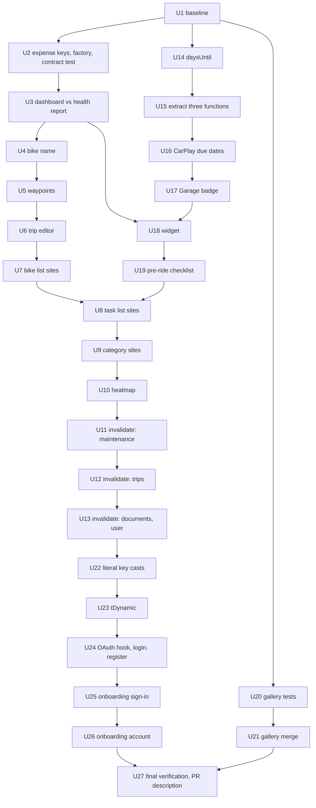

# Mobile Data Layer Fixes and Consolidation - Plan

## Goal Capsule

- **Objective:** A rider sees the right data on the screens that today can show another screen's data, an old copy, or a day count that is off by one: the expense dashboard and health report, the bike name on ride screens, the trip editor, and every "due in N days" figure. Sign-ups through Apple and Google are counted on every sign-in surface.
- **Means:** One pull request, "PR B", stacked on PR A (#306). Tests come first. Each behaviour change is one commit with the test that failed before it. Consolidation that changes no behaviour sits in separate commits.
- **Authority:** The settled scope handed to this plan (B1 to B7), then the code as read on `fix/mobile-data-layer` at b63e0e9c, then `CLAUDE.md` and `apps/mobile/CLAUDE.md`, then this plan. Where the code contradicts the settled scope, Key Decisions says so and the plan follows the code.
- **Execution profile:** Branch `fix/mobile-data-layer`, cut from `refactor/mobile-structure`. Mobile JavaScript only. No device QA happens before the PR opens.
- **Stop conditions:**
  - Stop and report if the baseline is not green. Do not repair it here.
  - Stop and report if any fix needs a change to a `.graphql` document, the GraphQL schema, `apps/api` or `apps/web`.
  - Drop a behaviour change whose bug cannot be shown by a failing test. R8 is the named case.
  - Drop the gallery merge if a difference between the two files turns out to change behaviour.
- **Who finishes:** Agents execute the units. The owner reviews, merges, publishes the OTA and does the checks in the post-OTA list. Nothing in this plan publishes an OTA or applies a migration.
- **Open blockers:** None.

---

## Product Contract

### Summary

PR B fixes four cache-key bugs and the hand-rolled "days until due" math, and makes Apple and Google sign-in behave and report the same on all four sign-in surfaces.
Around those fixes it gives each shared query one definition, each repeated invalidation block one helper, the two photo galleries one implementation, and dynamic translation keys one typed entry point.
Unlike PR A, this PR changes what riders see, on purpose.

### Problem Frame

The same query is declared screen by screen, so two screens can write different data under one key.
The expense dashboard asks for all years and the health report for the current year, both under the bare `expenses.byMotorcycle(id)` key; whichever loads first is shown by the other for up to five minutes.
The home-screen widget reads that same bare key as if it held the dashboard aggregate, which it never does.
`useBikeName` reads `['motorcycles','list']`, a key only the start-ride modal writes, so ride detail opened from the ride list shows no bike name.
The trip editor seeds its form once from a cache entry nothing refreshes, so re-opening the editor after a save shows the trip as it was before the save, and saving again writes the old values back.

Date math is the second cluster.
`due_date` is a Postgres `DATE` and arrives as `YYYY-MM-DD`.
Six hand-rolled computations parse it with `new Date()`, which reads it as UTC midnight, and then round in three different ways.
West of Greenwich the Garage tab badge and CarPlay count a task due today as one day overdue.
The home-screen widget and the pre-ride checklist compare against the current instant, so their number changes during the day, and the checklist calls a task due today "overdue" from the early morning on.
The bike hub, documents and document reminders already use `differenceInCalendarDays` with `parseISO` and are right.

The third cluster is sign-in.
Four screens each carry their own Apple and Google handlers.
Three of them report `user_signed_up` or `user_signed_in` for OAuth; the onboarding account screen, where most new riders create their account, reports nothing, and a code comment there claims `lib/oauth.ts` does it, which it does not.

Mobile JavaScript ships by OTA to every rider on the current store build, these screens have little test coverage, and nobody tests on a device before the PR opens.

### Key Decisions

- **Tests first; one behaviour per commit; consolidation in its own commits.** (session-settled: user-directed — chosen over fixing while consolidating: a reviewer must be able to tell a behaviour change from a move, and revert one without the other.) Governs R2, R3, R4.
- **The trip editor never reads its seed from the cache; its key stays outside the `['trips']` prefix.** The settled scope described the fix as invalidating the editor key on update. Reading the code shows that is not enough: the form copies the first data it receives and ignores later data, and an invalidated query still returns its old data first. Moving the key under the prefix would also make every trip invalidation refetch the editor's trip while the editor is open, including after a delete. Governs R8.
- **`useBikeName` subscribes to the bike list instead of reading the cache once.** A one-time read of the right key still returns nothing when the list arrives after the screen opens. Governs R6.
- **Imperative cache-or-fetch sites keep their own fetch.** Routing CarPlay, the ride controller and the widget sync through the query cache would add retries and the global error alert to background code. Governs R13.
- **`computeHealthScore` has no runtime caller.** Only its test reaches it. Its two computations are converted so no hand-rolled copy remains, but they change nothing a rider sees; the live function in that file is `getRelativeDueDate`, which CarPlay uses. Governs R17.
- **A cast on a translation key that exists in `en.json` is deleted, not wrapped.** About two thirds of the casts are on literal keys that already type-check. Wrapping them in `tDynamic` would throw away the key check they can have. Governs R21, R22.
- **OAuth sign-ins fire the same analytics events as email ones on every surface, Apple errors go through `presentOAuthError`, and the haptic goes through the iOS-guarded wrapper.** (session-settled: user-directed — chosen over leaving the onboarding account screen silent: sign-up-by-method numbers are wrong without it.) Governs R23, R24, R25, R26.
- **New versus returning is decided by the existing `isNewlyCreatedUser` on the sign-in response.** Three surfaces already rely on it. No new heuristic is added. Governs R24, R27.
- **No persisted-cache migration.** None of the changed keys is in the persisted set except the bike list, and its orphaned `['motorcycles','list']` entry has no reader. Governs R10.

<!-- ce-section: work-relationships -->
### How This Work Fits Together

This plan covers PR B: data-layer correctness and consolidation in `apps/mobile`.
The breakdown below is the current understanding, not a committed roadmap.

- **PR A (#306, `refactor/mobile-structure`).** PR B depends on it: the placement rule, the `@/` alias and the guards PR B must keep green come from there. PR B shares `selectPrimaryBike` and the haptics wrapper with it.
- **PR B (this plan).** Can be reverted without reverting PR A.
- **Follow-ups, each its own PR, can proceed independently of PR B.**
  - Maintenance reminder scheduling parses the due date as UTC (`apps/mobile/src/lib/notifications.ts`, `scheduleMaintenanceReminder`). Found while planning; it moves OS-scheduled notifications, so it gets its own PR. Shares `daysUntil` with PR B.
  - Ride services out of `utils/`, `lib/` grouping, bike-hub token promotion, splitting `_layout.tsx` and the fat routes, type-checked tests, the depth-2 alias.
  - Date formatters beyond `daysUntil`, and haptics on the remaining direct call sites.
  - Still to decide: whether `computeHealthScore` is deleted as dead code.

### Requirements

**Method**

- R1. Work starts from a recorded green baseline of the untouched branch; a red baseline stops the work.
- R2. A commit that changes what a rider sees or what analytics receives changes one behaviour, and contains a test that was run and seen failing before the fix.
- R3. A consolidation commit changes no behaviour, and no commit is both kinds.
- R4. The PR description labels every commit as behaviour or consolidation, records each failing run, states what stays unverified without a device, and lists what the owner checks by hand after the OTA.

**Cache keys**

- R5. Expenses for a bike are cached per requested year, so the dashboard and the health report each show their own data; the widget reads the dashboard aggregate from the key that holds it.
- R6. The bike name on ride detail and ride summary comes from the bike list every other screen caches, and appears when that list loads after the screen opened.
- R7. Ride route points are cached per requested point count.
- R8. The trip editor opens with the trip as the server has it at that moment; this fix is dropped if a test cannot show the stale read first.
- R9. A contract test fails when two different variable sets can share one key, and when a shared document is fetched outside its factory.
- R10. No cache-version bump or migration is added; entries stored under the old keys are never read again.

**Query factories**

- R11. Each document fetched from two or more files has one `queryOptions()` factory in `apps/mobile/src/lib/query-options.ts`, and every `useQuery` or `useInfiniteQuery` site of that document uses it.
- R12. Converting a site keeps its `staleTime`, `gcTime`, `enabled`, `select`, placeholder, initial data, retry and `meta`; the one intended change is that the heatmap screen gets the five-minute `staleTime` its twin already has.
- R13. Imperative sites that read the cache and fall back to a direct fetch are left as they are.

**Invalidation**

- R14. Maintenance, trip, document and user invalidation each go through one helper in `apps/mobile/src/lib/invalidate.ts` that invalidates what its call sites invalidate today, less the dead lines; a test per helper pins the exact keys.
- R15. The 14 invalidation lines whose keys no query reads are removed, together with the four key builders they use.

**Dates**

- R16. One `daysUntil` returns whole calendar days between a due date and today in the rider's time zone, and every "days until" computation in the app uses it.
- R17. The six hand-rolled computations in four files use it, and tests pin the new results in a fixed UTC+2 zone and a fixed UTC−5 zone at 00:30 and 23:30 local.
- R18. Every place where the new number flips a decision (badge counted, row called overdue, warning shown) is listed in the PR description with the old and new outcome.

**Photo gallery**

- R19. The expense and task photo galleries are one component configured by their real differences; a render test covering both configurations is committed before the merge.
- R20. Both galleries behave as before: photo limit, upload path, mutations, refreshed lists and copy.

**Translation keys**

- R21. No `t()` call on a literal key carries a cast.
- R22. Keys built at run time go through one `tDynamic` helper that holds the only cast; no key, locale file or displayed string changes, and `pnpm check:i18n` stays green.

**OAuth sign-in**

- R23. One hook provides the Apple and Google handlers on login, register, onboarding sign-in and onboarding account.
- R24. A successful OAuth sign-in on any of the four fires `user_signed_up` for a new account or `user_signed_in` for a returning one, with the provider as `auth_method`.
- R25. A failed Apple sign-in is presented by `presentOAuthError`, as Google failures are.
- R26. The tap haptic goes through the iOS-guarded wrapper on all four surfaces.
- R27. One resolved sign-in fires exactly one event; a cancelled or failed one fires none.

**Constraints**

- R28. No `.graphql` document, schema, `apps/api` or `apps/web` file changes.
- R29. PR A's guards stay green: a route never grows, the structure baseline is only lowered, and `apps/mobile/package.json` is not edited.
- R30. When a unit makes a sentence in `apps/mobile/CLAUDE.md` or `docs/MAP.md` false or adds a shared home, the same unit updates that file.

### Acceptance Examples

- AE1. **Covers R5.** Given a bike with expenses in 2025 and 2026, when the rider opens the health report and then the expense dashboard within five minutes, then the dashboard's category drill-down lists the 2025 expenses too.
- AE2. **Covers R6.** Given a cold start straight into a ride's detail screen, when the bike list finishes loading, then the bike name appears without leaving the screen.
- AE3. **Covers R8.** Given a trip the rider edited and saved, when they open the editor again in the same session, then the form shows the saved values.
- AE4. **Covers R17.** Given a rider in UTC−5 and a task due today, when they look at the Garage tab at 23:30, then the task is not counted as overdue.
- AE5. **Covers R17.** Given a rider in UTC+2 and a task due today, when the pre-ride checklist opens at 23:30, then the task reads as due in 0 days, not overdue.
- AE6. **Covers R24, R27.** Given a new rider on the onboarding account screen, when Google sign-in succeeds, then `user_signed_up` fires once with `auth_method: google`.
- AE7. **Covers R27.** Given a rider who dismisses the Apple sheet, when the handler returns, then no sign-in event fires.
- AE8. **Covers R12.** Given the Garage list and the bike hub both mounted, when the bike list fails to load for the first time, then no system alert appears, as today.
- AE9. **Covers R8.** Given no test can make the stale trip read fail, when R8's unit is reached, then the unit is dropped and the PR description says so.

### Success Criteria

- Every behaviour commit has a recorded failing run and a passing run of the same test.
- `pnpm verify:mobile` and `pnpm check:i18n` pass on the PR head.
- No `useQuery` or `useInfiniteQuery` site outside `apps/mobile/src/lib/query-options.ts` names a shared document.
- A reviewer can read the day-count table and the OAuth table in this plan and find each cell asserted by a test.

### Scope Boundaries

- Not in this PR: everything under "Follow-ups" in How This Work Fits Together.
- Not in this PR: the receipt-scan invalidation pair, the stale task list after deleting a bike, the hard-coded English alert titles in the trip hooks, the widget's hard-coded English strings.
- Not in this PR: a dedicated "due today" string for the pre-ride checklist. It shows "due in 0d"; a new key needs 13 locale files.
- Not in this PR: a guard against a double tap on the Apple button, and recomputing the tab badge at midnight while the app stays open.
- Not in this PR: deleting `computeHealthScore`.

### Dependencies / Assumptions

- PR A (#306) merges first, or PR B is reviewed as a stack on it.
- `due_date` stays a `DATE` column delivered as `YYYY-MM-DD` (`supabase/migrations/00020_create_maintenance_tasks_table.sql`).
- The server-side sign-up event is `signup_completed` (`apps/api/src/modules/analytics/signup-events.service.ts`), a different name from the client's `user_signed_up`, so R24 cannot double-count against it.

### Sources / Research

- The duplication audit, re-measured on `main` at 1edc49cd, and the architecture and risk panel reports. They live in a session scratchpad outside the repo; their findings are restated in this plan where it relies on them.
- `docs/plans/2026-10-10-1356-refactor-mobile-structure-and-agent-instructions-plan.md`: PR A, which names this work as the next piece.
- `apps/mobile/CLAUDE.md`: the placement rule this PR places new files by.
- `apps/mobile/src/lib/query-client.ts`: `resolveFailureHandling` decides the global alert over every observer of a key, which is why `meta` per site matters in R12.
- `apps/mobile/src/lib/query-persist.ts`, `apps/mobile/src/lib/persisted-query-provider.tsx`: what is persisted (roots `nhtsa`, `articles`, `motorcycles`, `user`, `maintenance-tasks` all-user only, `rides` list and overview only), seven-day maximum age, buster is the user id.
- `apps/mobile/src/lib/bike-hub/__tests__/date-only-timezone.test.ts`: the existing way to test in another time zone, by starting a child Jest with `TZ` set.
- `apps/mobile/src/lib/oauth.ts`: `isNewlyCreatedUser` and the comment recording why a single timestamp check mis-tagged sign-ups.

---

## Planning Contract

Product Contract preservation: unchanged.

Paths in this section and below are relative to `apps/mobile/src/` unless they start with `apps/`, `scripts/`, `docs/` or `supabase/`.

### Key Technical Decisions

- KTD1. **Every behaviour unit is one commit that holds the test and the fix; the failing run is recorded, not committed.** The executor writes the test, runs it on the tree without the fix, saves the output, then applies the fix. A separate failing-test commit would leave a red commit on the branch. Serves R2.
- KTD2. **The shared-query contract is a source scan with a shrinking known-offender list.** `__tests__/shared-query-contract.test.ts` holds the list of shared documents and asserts that each one appears in a `gqlFetcher(` call only in `lib/query-options.ts`, in a short allowlist of imperative sites (KTD7), or in `KNOWN_UNCONVERTED`. Each conversion unit deletes its files from `KNOWN_UNCONVERTED`; deleting an entry without converting the file is the failing run. The list is empty after U10. A second block calls every factory that takes variables with two different variable sets and asserts the hashed keys differ, and that the variables passed to the fetcher are the ones in the key. `lib/__tests__/analytics-event-catalog.test.ts` is the precedent for scanning source in a test. Serves R9, R11.
- KTD3. **Expense keys.** `queryKeys.expenses.byYear(id, year)` is `[...byMotorcycle(id), year]` and `queryKeys.expenses.dashboard(id)` is `[...byMotorcycle(id), 'dashboard']`. Both produce the arrays the newer call sites already build inline, so nothing moves in the cache for them. `byMotorcycle(id)` stays as the prefix every invalidator, `removeQueries`, `findExpenseInCache` and the hub refresh list already use; after U3 no fetch is stored under it. The all-years value is a named constant. Serves R5.
- KTD4. **Waypoint keys carry the point count.** `queryKeys.rides.waypoints(id, maxPoints)` and one `rideWaypointsOptions(rideId, maxPoints)`. The two counts become named constants in `utils/ride-constants.ts`. Opening the flyover now costs one extra request, which is the request the code always meant to make. `rides.all` still matches both keys by prefix. Serves R7.
- KTD5. **The trip editor query gets `gcTime: 0`; `trips.edit` keeps its key.** The form in `app/(modals)/create-trip.tsx` hydrates once, from the first data it sees. With `gcTime: 0` the entry is removed when the editor closes, so the next open has no data until the fetch returns. This also covers a trip changed elsewhere, such as an accepted suggestion. The key builder's comment records why it sits outside `['trips']`. Rejected: moving the key under the prefix (still seeds from stale data, and refetches a deleted trip while the editor is closing); `removeQueries` in the two update mutations only (misses changes made outside the editor). Serves R8.
- KTD6. **`useBikeName` is a `useQuery` with a `select`, using `motorcyclesOptions()` and `QUERY_META.OWN_ERROR_UI`.** It adds an observer of the bike list on two screens. The list is in the persisted set and Home and Garage fetch it, so this is nearly always a cache hit. The opt-out keeps a failed first load from raising the system alert for a missing label. `queryKeys.motorcycles.lists` is deleted; start-ride reads `motorcycles.all`. Serves R6.
- KTD7. **Imperative sites are an allowlist in the contract test, and their code is not touched.** They are `features/carplay/carplay-coordinator.ts`, `features/ride/ride-controller.ts` and `lib/widget-sync.ts`, apart from the one key fix in U3. `features/receipt-scan/use-receipt-scan-save.ts` uses `fetchQuery` and is converted, keeping its `staleTime: 30_000`. Serves R13.
- KTD8. **Factories carry key and fetcher only, plus an option every site shares.** `rideWaypointsOptions` carries `staleTime: Infinity` because both sites set it. `rideHeatmapOptions` carries the five-minute `staleTime`. `expenseDashboardQueryOptions` moves from `hooks/use-expense-dashboard.ts` to `lib/query-options.ts` with its `staleTime`, because `lib/widget-sync.ts` needs its key and `lib` should not import `hooks`. Everything else stays at the call site as a spread, per Appendix A. Serves R12.
- KTD9. **Invalidation helpers are plain functions taking the `QueryClient`.** `invalidateMaintenanceTasks(qc, motorcycleId?)`, `invalidateTrips(qc, tripId?)`, `invalidateDocuments(qc, motorcycleId)`, `invalidateUser(qc, { withBikes })`. `invalidateTrips` invalidates `trips.all` and, when a trip id is given, `trips.detail(id)`, and returns the detail promise so the two update mutations can keep awaiting it before closing the editor. `trips.my` is dropped from call sites as prefix-covered by `trips.all`. `invalidateAfterTaskCompletion` stays in `lib/task-completion-cache.ts` and calls the maintenance helper. Rejected: a `meta.invalidates` field read by the `MutationCache` (the app resolves error UI per observer and persists its cache; explicit calls match the two helpers that exist). Serves R14.
- KTD10. **Dead invalidations are proved dead by deleting their key builders.** `trips.discoverRiderStrip`, `groupRides.all`, `maintenanceTasks.history` and `maintenanceTasks.spending` are removed from `lib/query-keys.ts`; the type checker then lists exactly the lines to remove. A remaining reference that is not an invalidation is a reader, and that key is put back. Serves R15.
- KTD11. **`daysUntil(date, today = new Date())` lives in `utils/days-until.ts` and is `differenceInCalendarDays(parseISO(date), today)`.** `parseISO` reads `YYYY-MM-DD` as local midnight and a full timestamp as its instant, so the existing tests that pass full timestamps keep passing. It returns `NaN` for an unparseable string, as the bike hub's inline copy does today; each caller keeps its own null and `NaN` handling. `lib/document-expiry.ts`, `lib/bike-hub/task-due.ts` and `lib/bike-hub/documents.ts` call it instead of their inline copies. Serves R16.
- KTD12. **The three inline computations become pure functions before their math changes.** Garage badge count, widget next-service and pre-ride bike status each move out of their component or sync function with the old math intact, in a consolidation commit with tests at inputs where old and new agree. The behaviour commits that follow change one function each. Serves R3, R17.
- KTD13. **Time-zone tests start a child Jest with `TZ` set, as `lib/bike-hub/__tests__/date-only-timezone.test.ts` does.** A worker cannot change its own zone. The zones are `Africa/Johannesburg` (UTC+2) and `America/Bogota` (UTC−5), which have no daylight saving, and each child asserts `getTimezoneOffset()` first. The new file mirrors the existing harness and leaves the existing test untouched. Serves R17.
- KTD14. **The gallery merge keeps both exported components as thin wrappers.** `components/photo-gallery.tsx` holds the shared body and takes a config: photo limit, upload function, add and delete mutations, what to invalidate, and its labels. `ExpensePhotoGallery` and `TaskPhotoGallery` stay in their files, build the config and call `t()` with literal keys. Call sites, the two `jest.mock` calls that name `task-photo-gallery`, and key extraction are untouched. Serves R19, R20.
- KTD15. **`tDynamic(t, key, options?)` lives in `i18n/t-dynamic.ts` and holds the one cast.** A literal key whose cast cannot be deleted because the type checker rejects it is a missing key: it is listed in the PR description and left as it is, not moved to `tDynamic`. Serves R21, R22.
- KTD16. **`useOAuthSignIn()` lives in `hooks/use-oauth-sign-in.ts` and returns `{ onApple, onGoogle }`.** Each handler: `triggerImpact`, the provider's sign-in, one `trackEvent` chosen by `isNewUser` with an `AUTH_METHOD` constant, and `presentOAuthError` on any throw. It takes no options; no surface needs a callback, because navigation follows the auth listener. Serves R23 to R27.
- KTD17. **The OAuth hook lands on the two screens where nothing changes first.** Login and register already have the target behaviour apart from the Apple error path, which `presentOAuthError` reproduces case by case (Appendix C). Onboarding sign-in and onboarding account follow in their own commits, each with one visible change. Serves R2, R3.

### High-Level Technical Design

Dependencies between units. A box is one commit; U1 and U27 make none.

### Sequencing

- **Default: serial, in U-number order.** This is the order the commits appear on the branch.
- **Lane 1, data (U2 to U13), is strictly serial.** Every unit edits `lib/query-keys.ts` or `lib/query-options.ts`.
- **Lane 2, dates (U14 to U19), may run beside lane 1** in its own worktree, with two cross-lane rules: U18 waits for U3 (both edit `lib/widget-sync.ts`), and U8 waits for U19 (both edit `components/ride/pre-flight-checklist.tsx`).
- **Lane 3, gallery (U20, U21), shares no file with any other unit** and may run at any time after U1.
- **Lane 4 (U22 to U26) runs after lane 1.** U22 and U23 edit `app/(modals)/whats-new.tsx` and `app/(onboarding)/personalizing.tsx`, which U7 and U13 also edit; U24 to U26 edit the screens U22 edits.
- **`scripts/mobile-structure-baseline.json` is edited by most units.** A unit that shrinks a baselined route lowers the baseline in its own commit. When lanes are merged, a conflict in that file is resolved by re-running the update mode, never by hand.
- **Never run two Jest processes at once.** A Jest worker crashed with SIGSEGV under load while this plan was written. If it recurs, rerun with fewer workers before treating a failure as real.

### Assumptions

- No screen relies on the dashboard and the health report sharing one cache entry. Read: neither reads the other's shape on purpose.
- The static-key casts in U22 can be deleted without a type error. Every sampled key exists in `i18n/locales/en.json`; this was not compiled.
- `expo-haptics` on Android produced a vibration for the two unguarded calls, so U25 and U26 remove a haptic there. Not checked on a device.
- `check:deadcode` counts a file reached only from its test as used, because `knip.json` lists test files as entries for the mobile workspace.
- `pnpm check:i18n` lints the whole of every changed file for hard-coded text in JSX. A file a unit touches may fail on text that unit did not add; PR A hit this once.

### Risks

Ranked by what breaks for riders if the unit is wrong.

| Rank | Units | If wrong | Why it could be wrong | Held by |
|---|---|---|---|---|
| 1 | U24, U25, U26 OAuth | Riders cannot sign in or up with Apple or Google; or sign-up counts double | Auth, on the onboarding path; native sheets cannot be driven in a simulator | Hook test matrix (Appendix C), four screen tests, last in the branch so it can be dropped whole |
| 2 | U7 bike list sites | A system alert appears on screens that render their own error, or disappears where it was the only error UI | 23 sites; the alert is decided over all observers of the key | Appendix A1 per-site table, `query-error-routing`, `global-error-alert`, `hub-data-and-errors`, `legacy-load-errors`, `home-error-alert` tests unchanged |
| 3 | U6 trip editor | Editor opens empty or spins; offline it no longer shows the cached trip | `gcTime: 0` removes the offline seed | Hook test; saving offline was never possible; owner check after OTA |
| 4 | U16 to U19 dates | A wrong day count on the tab badge, widget, CarPlay or checklist | Six computations, two zones, day boundaries | Appendix B asserted cell by cell in child-zone tests |
| 5 | U3 expenses | Dashboard or health report shows no expenses | Key and type changes on the most-used feature | Options test, contract test, `expense-detail.yaml` and `add-expense.yaml` if a dev client exists |
| 6 | U11, U12, U13 invalidation | A list stays stale after a write | A helper misses a key a call site had | One test per helper pinning exact keys; Appendix D |
| 7 | U8, U9, U10 other factories | Same as rank 2, smaller | Fewer sites | Appendix A2 to A4, existing hub tests |
| 8 | U4, U5 | Bike name still missing; flyover refetches | Small | Hook test; options test |
| 9 | U21 gallery | Photo add or delete fails on one of the two | Hand refactor | U20 render tests for both configurations |
| 10 | U22, U23 | None at run time | Type-level only | Type check; `i18n.test.ts` |

**Cut order if time or evidence runs short.** First U20 and U21. Then U22 and U23. Then U24 to U26, which move to their own PR. Then U11 to U13. Then U7 to U10; U2 to U6 stand without them. The cache-key fixes and the date fixes are cut last.

**Recommendation.** U24 to U26 are better as their own PR. They share no code with the data layer, they are the only units that touch auth, their analytics change needs a dated annotation, and a revert of the data-layer work should not revert them. They are planned here as the last commits so the split is a branch cut, not a rewrite.

---

## Implementation Units

`$PROOF` is a scratch directory outside the repo. Nothing in it is committed. "Red run" means KTD1: the unit's new test, run before the fix, exits non-zero and its output is saved as `$PROOF/<unit>-red.txt`.

### Unit Index

| Unit | Title | Kind | Primary files | Depends on |
|---|---|---|---|---|
| U1 | Baseline gate | none | none | — |
| U2 | Expense keys, expense factory, contract test | consolidation | `lib/query-keys.ts`, `lib/query-options.ts`, `__tests__/shared-query-contract.test.ts` | U1 |
| U3 | Dashboard and health report stop sharing a key | behaviour | `app/(tabs)/(garage)/expense-dashboard.tsx`, `health-report.tsx`, `lib/widget-sync.ts` | U2 |
| U4 | Bike name from the shared bike list | behaviour | `hooks/use-bike-name.ts`, `app/(modals)/start-ride.tsx` | U3 |
| U5 | Waypoints keyed by point count | behaviour | `app/(modals)/ride-detail.tsx`, `ride-flyover.tsx` | U4 |
| U6 | Trip editor seeds from the server | behaviour | `hooks/use-create-trip-data.ts` | U5 |
| U7 | Bike list sites use the factory | consolidation | 23 files | U6 |
| U8 | Task list sites use the factory | consolidation | 9 files | U7, U19 |
| U9 | Document category sites use the factory | consolidation | 5 files | U8 |
| U10 | Heatmap query has one definition | behaviour | `hooks/use-ride-heatmap-data.ts`, `app/(tabs)/(profile)/heatmap.tsx` | U9 |
| U11 | Maintenance invalidation helper | consolidation | `lib/invalidate.ts`, 8 files | U10 |
| U12 | Trip invalidation helper | consolidation | `lib/invalidate.ts`, 4 files | U11 |
| U13 | Document and user invalidation helpers | consolidation | `lib/invalidate.ts`, 7 files, docs | U12 |
| U14 | `daysUntil` and its three existing callers | consolidation | `utils/days-until.ts` | U1 |
| U15 | Extract badge, widget and checklist functions | consolidation | 3 new files, 3 hosts | U14 |
| U16 | CarPlay due dates use calendar days | behaviour | `lib/health-score.ts` | U15 |
| U17 | Garage badge uses calendar days | behaviour | `components/garage/garage-badge-count.ts` | U16 |
| U18 | Widget uses calendar days | behaviour | `lib/widget-next-service.ts` | U17, U3 |
| U19 | Pre-ride checklist uses calendar days | behaviour | `components/ride/pre-flight-bike-status.ts` | U18 |
| U20 | Gallery render tests | tests only | `components/__tests__/photo-galleries.test.tsx` | U1 |
| U21 | One photo gallery | consolidation | `components/photo-gallery.tsx` | U20 |
| U22 | Delete casts on literal keys | consolidation | about 6 files | U13 |
| U23 | `tDynamic` for run-time keys | consolidation | `i18n/t-dynamic.ts`, about 10 files | U22 |
| U24 | OAuth hook on login and register | consolidation | `hooks/use-oauth-sign-in.ts`, 2 screens | U23 |
| U25 | Onboarding sign-in uses the hook | behaviour | `app/(onboarding)/sign-in.tsx` | U24 |
| U26 | Onboarding account uses the hook | behaviour | `app/(onboarding)/account.tsx` | U25 |
| U27 | Final verification and PR description | none | none | U21, U26 |

### U1. Baseline gate

- **Goal:** A recorded green starting point.
- **Requirements:** R1.
- **Dependencies:** None.
- **Files:** None.
- **Approach:**
  1. Run V1, V7, V5 and V12 on the untouched branch and save the outputs in `$PROOF`.
  2. Save the mobile Jest pass list (V8, label `base`).
  3. Re-run the counts this plan relies on and note any drift: `useQuery` sites per shared document (Appendix A), invalidation lines per cluster (Appendix D), casts on `t()` calls.
- **Test scenarios:** Test expectation: none -- this unit changes no file.
- **Verification:** `$PROOF` holds the outputs and `pass-base.txt`. V10 is clean. A red baseline stops the work.

### U2. Expense keys, expense factory, contract test

- **Goal:** Expenses have one typed query definition that requires a year, and a test guards every shared document from here on.
- **Requirements:** R9, R11, R12. Prepares R5.
- **Dependencies:** U1.
- **Files:** `lib/query-keys.ts`, `lib/query-options.ts`, `hooks/use-expense-dashboard.ts`, `components/home/use-checklist-signals.ts`, `components/bike-hub/overview/use-overview-data.ts`, `components/bike-hub/expenses-section.tsx`, `app/(tabs)/(garage)/expense-detail.tsx`, `features/receipt-scan/use-receipt-scan-save.ts`, `__tests__/shared-query-contract.test.ts` (new), `lib/__tests__/query-options.test.ts`, `scripts/mobile-structure-baseline.json`.
- **Approach:**
  1. Add the key builders and the all-years constant per KTD3.
  2. Add `expensesOptions(motorcycleId, year)` and move `expenseDashboardQueryOptions` per KTD8; update its two importers.
  3. Convert the five sites that already key by year, keeping the options in Appendix A3.
  4. Add the contract test per KTD2 with `KNOWN_UNCONVERTED` holding every file that still fetches a shared document itself.
- **Patterns to follow:** `meOptions` and `maintenanceBadgeOptions` in `lib/query-options.ts`; the source scan in `lib/__tests__/analytics-event-catalog.test.ts`.
- **Test scenarios:**
  - `expensesOptions('a', 0)` and `expensesOptions('a', 2026)` hash to different keys.
  - `expensesOptions('a', 2026)` hashes to the same key as the inline array `[...byMotorcycle('a'), 2026]`.
  - The fetcher of `expensesOptions('a', 2026)` is called with `motorcycleId: 'a'` and `year: 2026`.
  - `expenseDashboardQueryOptions('a')` hashes to the same key as before the move.
  - The scan fails when a file outside the three lists calls `gqlFetcher` with a shared document; shown once by adding a throwaway call, then removed.
- **Verification:** V2 on the two test files, V3, V4, V5, V6, V7. `components/bike-hub/__tests__/expenses-section-error.test.tsx`, `hub-data-and-errors.test.tsx` and `features/receipt-scan/__tests__/receipt-save-creates-expense.test.ts` pass unchanged.
- **Behaviour proof:** Every converted site keeps the same key array, variables and options.

### U3. Dashboard and health report stop sharing a key

- **Goal:** Each screen reads its own expenses; the widget reads the dashboard aggregate.
- **Requirements:** R5, R10. Covers AE1.
- **Dependencies:** U2.
- **Files:** `app/(tabs)/(garage)/expense-dashboard.tsx`, `app/(tabs)/(garage)/health-report.tsx`, `lib/widget-sync.ts`, `lib/__tests__/expenses-year-isolation.test.ts` (new), `__tests__/shared-query-contract.test.ts`, `scripts/mobile-structure-baseline.json`.
- **Approach:**
  1. Remove the two routes from `KNOWN_UNCONVERTED`. Red run.
  2. Dashboard: `expensesOptions(id, ALL_YEARS)` with its `enabled` and five-minute `staleTime`. Health report: `expensesOptions(id, currentYear)` with its `enabled`.
  3. Replace the structural casts on the result in both routes with the generated type the factory now supplies.
  4. `lib/widget-sync.ts`: read `expenseDashboardQueryOptions(id).queryKey` instead of the bare key.
- **Execution note:** Start with the failing contract entry and the isolation test.
- **Test scenarios:**
  - Covers AE1. With one `QueryClient`, fetching the health report's options and then the dashboard's options calls the fetcher twice, with the current year and with all years, and each read returns its own payload.
  - Invalidating `expenses.byMotorcycle(id)` marks both entries and the dashboard aggregate stale.
  - The contract scan passes with the two routes off the list.
- **Verification:** Red run saved. V2, V3, V4, V5, V6, V7.
- **What a rider sees:** The dashboard's category drill-down no longer shows only this year after the health report was open, and the health report no longer counts all years.

### U4. Bike name from the shared bike list

- **Goal:** Ride detail and ride summary show the bike name.
- **Requirements:** R6, R10. Covers AE2.
- **Dependencies:** U3.
- **Files:** `lib/query-options.ts`, `lib/query-keys.ts`, `hooks/use-bike-name.ts`, `hooks/__tests__/use-bike-name.test.tsx` (new), `app/(modals)/start-ride.tsx`, `__tests__/shared-query-contract.test.ts`.
- **Approach:** Per KTD6. Add `motorcyclesOptions()`. Start-ride keeps its line count: only the key changes source. The hook's inline structural type is replaced by the generated one.
- **Patterns to follow:** `hooks/__tests__/use-recall-acknowledgement.test.tsx` for a hook test with a real `QueryClient`.
- **Test scenarios:**
  - The bike list is cached under `motorcycles.all` and nothing under `['motorcycles','list']`: the hook returns the nickname. Red today.
  - Covers AE2. The cache is empty at mount and the fetch resolves later: the hook returns `null`, then the name. Red today.
  - A bike without a nickname returns make and model.
  - An unknown id and a `null` id return `null`.
  - The fetch fails on first load: no global alert is requested for this observer.
- **Verification:** Red run saved. V2, V3, V4, V5, V6, V7. `features/ride/__tests__/ride-controller.test.ts` passes unchanged.
- **What a rider sees:** The bike name on a ride opened from the ride list.

### U5. Waypoints keyed by point count

- **Goal:** Ride detail and flyover each get the resolution they ask for.
- **Requirements:** R7.
- **Dependencies:** U4.
- **Files:** `lib/query-keys.ts`, `lib/query-options.ts`, `utils/ride-constants.ts`, `app/(modals)/ride-detail.tsx`, `app/(modals)/ride-flyover.tsx`, `lib/__tests__/query-options.test.ts`, `__tests__/shared-query-contract.test.ts`, `scripts/mobile-structure-baseline.json`.
- **Approach:** Per KTD4. Remove the two routes from `KNOWN_UNCONVERTED` first. Ride detail keeps `enabled: canLoadWaypoints` and its alert opt-out; flyover keeps `enabled: !!rideId`. The `Missing rideId` throw goes, since both sites are disabled without an id.
- **Test scenarios:**
  - `rideWaypointsOptions('r', 300)` and `rideWaypointsOptions('r', 400)` hash to different keys.
  - The fetcher receives the ride id and the point count from the key.
  - Both keys start with `rides.all`.
- **Verification:** Red run saved. V2, V3, V4, V5, V6, V7.
- **What a rider sees:** The flyover follows 400 points instead of 300. Hard to notice; listed as unverified without a device.

### U6. Trip editor seeds from the server

- **Goal:** Re-opening the editor shows the trip as saved.
- **Requirements:** R8. Covers AE3, AE9.
- **Dependencies:** U5.
- **Files:** `hooks/use-create-trip-data.ts`, `hooks/__tests__/use-create-trip-data.test.tsx` (new), `lib/query-keys.ts` (comment only).
- **Approach:** Per KTD5. Write the test first. If it does not fail on the unfixed hook, drop this unit and record that in the PR description.
- **Execution note:** The stale read must be seen failing before any change to the hook.
- **Test scenarios:**
  - Covers AE3. Mount the hook with a trip id; the fetcher returns version 1. Run the update mutation. Unmount. The fetcher now returns version 2. Mount again: the first defined `tripQuery.data` is version 2, and the trip document was fetched twice. Red today: version 1 comes back at once.
  - Clone mode, with a source trip id and no trip id, fetches fresh on each mount as well.
  - With no source trip id the query stays disabled.
- **Verification:** Red run saved, or the unit is dropped. V2, V3, V4, V5, V7.
- **What a rider sees:** Their saved edit, instead of the trip from before it. Offline, the editor waits for the network instead of showing a cached copy.

### U7. Bike list sites use the factory

- **Goal:** One definition of the bike list query.
- **Requirements:** R11, R12. Covers AE8.
- **Dependencies:** U6.
- **Files:** The 23 `useQuery` sites in Appendix A1 that U4 did not convert, `__tests__/shared-query-contract.test.ts`, `scripts/mobile-structure-baseline.json`.
- **Approach:** Each site becomes a spread of `motorcyclesOptions()` plus exactly the options Appendix A1 lists for it. No option is added, removed or renamed. A site whose type check fails after the change is reverted and listed.
- **Test scenarios:**
  - The contract scan passes with all 23 files off `KNOWN_UNCONVERTED`.
  - Covers AE8. The existing alert-routing tests pass unchanged.
- **Verification:** V3, V4, V5, V6, V7. `lib/__tests__/query-error-routing.test.ts`, `components/bike-hub/__tests__/global-error-alert.test.tsx`, `hub-data-and-errors.test.tsx`, `legacy-load-errors.test.tsx`, `components/home/__tests__/home-error-alert.test.tsx`, `lib/__tests__/checklist-signals.test.ts`, `features/carplay/__tests__/carplay-coordinator.test.ts` pass unchanged.
- **Behaviour proof:** The diff per site removes `queryKey` and `queryFn` and adds the spread; every other property line is unchanged. The reviewer checks the diff against Appendix A1.

### U8. Task list sites use the factory

- **Goal:** One definition of the per-bike task query.
- **Requirements:** R11, R12.
- **Dependencies:** U7, U19.
- **Files:** `lib/query-options.ts`, the 9 sites in Appendix A2, `__tests__/shared-query-contract.test.ts`, `scripts/mobile-structure-baseline.json`.
- **Approach:** Add `maintenanceTasksOptions(motorcycleId)`. Convert per Appendix A2. The three sites that seed `initialData` from the same key keep those two properties verbatim.
- **Test scenarios:**
  - Two bike ids hash to different keys; the fetcher receives the id from the key.
  - The contract scan passes with the 9 files off the list.
- **Verification:** V2, V3, V4, V5, V6, V7. `__tests__/screens/bike-tasks.test.tsx`, `components/bike-hub/__tests__/service-section.test.tsx`, `notes-screen.test.tsx` pass unchanged.
- **Behaviour proof:** As U7, against Appendix A2.

### U9. Document category sites use the factory

- **Goal:** One definition of the category query.
- **Requirements:** R11, R12.
- **Dependencies:** U8.
- **Files:** `lib/query-options.ts`, the 5 sites in Appendix A4, `__tests__/shared-query-contract.test.ts`, `scripts/mobile-structure-baseline.json`.
- **Approach:** Add `documentCategoriesOptions(includeHidden)`. `manage-document-categories.tsx` keeps a local constant for the key its optimistic update writes, now taken from the factory.
- **Test scenarios:**
  - `true` and `false` hash to different keys, and both start with `documents.categoriesAll`.
  - The fetcher receives `includeHidden` from the key.
- **Verification:** V2, V3, V4, V5, V6, V7. `components/bike-hub/__tests__/overview-segment.test.tsx` passes unchanged.
- **Behaviour proof:** As U7, against Appendix A4.

### U10. Heatmap query has one definition

- **Goal:** The heatmap screen stops refetching up to 20 pages on re-entry after two minutes.
- **Requirements:** R11, R12.
- **Dependencies:** U9.
- **Files:** `lib/query-options.ts`, `hooks/use-ride-heatmap-data.ts`, `app/(tabs)/(profile)/heatmap.tsx`, `lib/__tests__/query-options.test.ts`, `__tests__/shared-query-contract.test.ts`, `scripts/mobile-structure-baseline.json`.
- **Approach:** Add `rideHeatmapOptions()` as infinite-query options carrying the page size, page-parameter logic and the five-minute `staleTime`. The hook keeps `enabled`; the screen passes none. The page size and page cap become one pair of constants. The eager-paging effects stay where they are.
- **Test scenarios:**
  - `rideHeatmapOptions()` has a five-minute `staleTime`. Red for the screen today: its inline query has none.
  - The next-page parameter is the end cursor when there is a next page and `null` when there is not.
  - `KNOWN_UNCONVERTED` is empty and the constant is deleted from the test.
- **Verification:** Red run saved. V2, V3, V4, V5, V6, V7.
- **What a rider sees:** Re-opening the heatmap within five minutes does not reload it.

### U11. Maintenance invalidation helper

- **Goal:** One function refreshes what a maintenance write changes.
- **Requirements:** R14, R15.
- **Dependencies:** U10.
- **Files:** `lib/invalidate.ts` (new), `lib/__tests__/invalidate.test.ts` (new), `lib/task-completion-cache.ts`, `lib/query-keys.ts`, `app/_layout.tsx`, `app/(tabs)/(garage)/bike-tasks.tsx`, `edit-maintenance-task.tsx`, `add-maintenance-task.tsx`, `components/bike-hub/notes/use-notes.ts`, `components/bike-hub/segments/service-segment.tsx`, `features/receipt-scan/use-receipt-scan-save.ts`, `scripts/mobile-structure-baseline.json`.
- **Approach:** Per KTD9 and KTD10, for the rows of Appendix D1. Sites that invalidate only `byMotorcycle` (task photo gallery, odometer sheet, OEM import) are left alone: they do not invalidate `allUser` today.
- **Test scenarios:**
  - With a bike id, the helper invalidates exactly `maintenanceTasks.byMotorcycle(id)` and `maintenanceTasks.allUser`.
  - Without a bike id, exactly `maintenanceTasks.allUser`.
  - `invalidateAfterTaskCompletion` invalidates the same keys as before this unit, with and without a cost.
- **Verification:** V2, V3, V4, V5, V6, V7. `lib/__tests__/task-completion-cache.test.ts` and `features/receipt-scan/__tests__/receipt-save-creates-expense.test.ts` pass unchanged.
- **Behaviour proof:** Appendix D1 lists each site's keys before and after. The two removed lines used key builders that no query reads.

### U12. Trip invalidation helper

- **Goal:** One function refreshes trips after a trip write.
- **Requirements:** R14, R15.
- **Dependencies:** U11.
- **Files:** `lib/invalidate.ts`, `lib/__tests__/invalidate.test.ts`, `lib/query-keys.ts`, `hooks/use-create-trip-data.ts`, `hooks/use-trip-detail-data.ts`, `components/trip-share-sheet.tsx`, `app/(tabs)/(profile)/trips.tsx`, `scripts/mobile-structure-baseline.json`.
- **Approach:** Per KTD9 and KTD10, for the ten blocks of Appendix D2. The two delete paths keep their `removeQueries` on the detail key. The two update paths keep awaiting the detail refetch before closing.
- **Test scenarios:**
  - Without a trip id, the helper invalidates exactly `trips.all`.
  - With a trip id, exactly `trips.all` and `trips.detail(id)`, and the returned promise settles when the detail refetch does.
  - A query under `trips.my`, `trips.myDrafts` and `trips.list('home')` is marked stale by the helper.
  - A query under `trips.edit(id)` is not.
- **Verification:** V2, V3, V4, V5, V6, V7. U6's hook test passes unchanged.
- **Behaviour proof:** Appendix D2. Ten lines used a key no query reads; the `trips.my` lines are covered by the `trips.all` prefix.

### U13. Document and user invalidation helpers

- **Goal:** The last two clusters, the last dead lines, and the instruction files made true.
- **Requirements:** R14, R15, R30.
- **Dependencies:** U12.
- **Files:** `lib/invalidate.ts`, `lib/__tests__/invalidate.test.ts`, `lib/query-keys.ts`, `app/(tabs)/(garage)/add-document.tsx`, `app/(tabs)/(garage)/document/[id].tsx`, `components/bike-hub/documents-section.tsx`, `app/(onboarding)/personalizing.tsx`, `hooks/use-profile-data.ts`, `app/(modals)/create-group-ride.tsx`, `app/(modals)/group-ride-detail.tsx`, `apps/mobile/CLAUDE.md`, `docs/MAP.md`, `scripts/mobile-structure-baseline.json`.
- **Approach:**
  1. Per KTD9 for Appendix D3 and D4.
  2. Remove `groupRides.all` and its two invalidations per KTD10.
  3. `apps/mobile/CLAUDE.md`: add a "Mutation" row to the placement table saying a repeated invalidation goes through `src/lib/invalidate.ts`. Keep the file inside its byte budget.
  4. `docs/MAP.md`: name `invalidate.ts` in the `lib/` row.
- **Test scenarios:**
  - `invalidateDocuments(qc, id)` invalidates exactly `documents.byMotorcycle(id)` and `documents.expiring`.
  - `invalidateUser(qc, { withBikes: true })` invalidates exactly `user.me` and `motorcycles.all`; with `false`, exactly `user.me`.
- **Verification:** V2, V3, V4, V5, V6, V7, V9. `__tests__/screens/personalizing-whats-new.test.tsx` passes unchanged.
- **Behaviour proof:** Appendix D3 and D4.

### U14. `daysUntil` and its three existing callers

- **Goal:** One function for calendar days until a date.
- **Requirements:** R16.
- **Dependencies:** U1.
- **Files:** `utils/days-until.ts` (new), `utils/__tests__/days-until.test.ts` (new), `__tests__/days-until-timezone.test.ts` (new), `lib/document-expiry.ts`, `lib/bike-hub/task-due.ts`, `lib/bike-hub/documents.ts`, `docs/MAP.md`.
- **Approach:** Per KTD11 and KTD13. The three callers replace their inline expression and keep their own null and `NaN` handling. `docs/MAP.md` adds dates to the `utils/` row.
- **Test scenarios:**
  - Appendix B, "new" column, for the helper itself: in each zone, at 00:30 and 23:30 local, a date of today gives 0, tomorrow 1, yesterday −1.
  - A full ISO timestamp at local noon three days ahead gives 3.
  - An unparseable string gives `NaN`.
  - Each child zone asserts its UTC offset before any case.
- **Verification:** V2 on the two new files and on `lib/bike-hub/__tests__/date-only-timezone.test.ts`, `task-due.test.ts`; V3, V4, V7, V9.
- **Behaviour proof:** The three replaced expressions are the helper's body.

### U15. Extract badge, widget and checklist functions

- **Goal:** Three testable pure functions holding today's math.
- **Requirements:** R3. Prepares R17.
- **Dependencies:** U14.
- **Files:** `components/garage/garage-badge-count.ts` (new), `lib/widget-next-service.ts` (new), `components/ride/pre-flight-bike-status.ts` (new), one test file beside each (new), `app/(tabs)/_layout.tsx`, `lib/widget-sync.ts`, `components/ride/pre-flight-checklist.tsx`, `scripts/mobile-structure-baseline.json`.
- **Approach:** Each function takes the task list and a `today` or `now` argument and returns data, not text: a count; the next task with its day count and overdue flag; a status kind with the task title and day count. The host keeps its translation and rendering. The bodies move verbatim.
- **Test scenarios:** All at local noon with due dates given as full timestamps at local noon, where the old and new math agree.
  - Badge: an overdue task counts; a critical task due in 3 days counts; a medium task due in 3 days does not; a task with no date does not.
  - Widget: the earliest dated pending task is picked; 5 days ahead reads 5; 2 days behind reads overdue by 2; a task with only a mileage target has no day count.
  - Checklist: no bike, no tasks, an overdue task, a task due in 5 days (warning), a task due in 10 days (ok), all clear.
- **Verification:** V2, V3, V4, V5, V6, V7.
- **Behaviour proof:** The diff shows each body moved, with `new Date()` replaced by the argument.

### U16. CarPlay due dates use calendar days

- **Goal:** `getRelativeDueDate` is right west of Greenwich, and `lib/health-score.ts` holds no hand-rolled day math.
- **Requirements:** R17, R18.
- **Dependencies:** U15.
- **Files:** `lib/health-score.ts`, `lib/__tests__/health-score.test.ts`, `__tests__/days-until-timezone.test.ts`.
- **Approach:** The three day computations call `daysUntil`; days overdue is its negation. The completed-on-time grace check compares instants and is left alone.
- **Test scenarios:**
  - Appendix B, row "CarPlay", every cell, in both zones. The UTC−5 cells are red today.
  - `computeHealthScore`: Appendix B, row "health score", every cell.
  - The existing `health-score.test.ts`, `features/carplay/__tests__/carplay-bike-status.test.ts` and `carplay-templates.test.ts` pass unchanged.
- **Verification:** Red run saved. V2, V3, V4, V7.
- **What a rider sees:** In the Americas, CarPlay stops calling a task due today "1d overdue" and stops raising the overdue row for it.

### U17. Garage badge uses calendar days

- **Goal:** The tab badge counts the same tasks in every time zone.
- **Requirements:** R17, R18. Covers AE4.
- **Dependencies:** U16.
- **Files:** `components/garage/garage-badge-count.ts`, its test, `__tests__/days-until-timezone.test.ts`.
- **Test scenarios:**
  - Covers AE4. Appendix B, row "Garage badge", every cell. The UTC−5 cells are red today.
  - U15's cases pass unchanged.
- **Verification:** Red run saved. V2, V3, V4, V7.
- **What a rider sees:** In the Americas the badge drops by the medium and low tasks due today and by critical or high tasks due in exactly four days.

### U18. Widget uses calendar days

- **Goal:** The home-screen widget's day count does not change with the hour.
- **Requirements:** R17, R18.
- **Dependencies:** U17, U3.
- **Files:** `lib/widget-next-service.ts`, its test, `__tests__/days-until-timezone.test.ts`.
- **Test scenarios:**
  - Appendix B, row "widget", every cell. Six of the twelve cells are red today.
  - A task overdue by one day never reads "In 0 days".
  - U15's cases pass unchanged.
- **Verification:** Red run saved. V2, V3, V4, V7.
- **What a rider sees:** "In 0 days" on the due date all day, in every zone.

### U19. Pre-ride checklist uses calendar days

- **Goal:** A task due today is not called overdue.
- **Requirements:** R17, R18. Covers AE5.
- **Dependencies:** U18.
- **Files:** `components/ride/pre-flight-bike-status.ts`, its test, `__tests__/days-until-timezone.test.ts`.
- **Approach:** Overdue means `daysUntil` below zero; upcoming means zero or more. The seven-day warning threshold compares calendar days.
- **Test scenarios:**
  - Covers AE5. Appendix B, row "checklist", every cell. Six of the twelve cells are red today.
  - A task due in exactly 7 calendar days is a warning at 00:30 and at 23:30; in 8 days it is ok.
  - U15's cases pass unchanged.
- **Verification:** Red run saved. V2, V3, V4, V7.
- **What a rider sees:** "due in 0d" on the due date instead of "overdue".

### U20. Gallery render tests

- **Goal:** Both galleries are pinned before they are merged.
- **Requirements:** R19.
- **Dependencies:** U1.
- **Files:** `components/__tests__/photo-galleries.test.tsx` (new).
- **Approach:** Render each gallery with mocked upload, picker, `gqlFetcher` and `QueryClient`. Assert on the differences the diff of the two files shows, nothing else.
- **Test scenarios:** Each scenario runs for the expense gallery and the task gallery.
  - With fewer photos than the limit the add button shows; at the limit (3 for expenses, 5 for tasks) it does not.
  - Picking a photo calls that gallery's upload function with the user id and the owner id, then its add mutation with the owner id under its own field name.
  - After an add, the expense gallery invalidates `expenses.byMotorcycle(id)` and `expensePhotos.byExpense(id)`; the task gallery invalidates `maintenanceTasks.byMotorcycle(id)`.
  - Confirming a delete calls that gallery's delete mutation with the photo id.
  - A failed upload shows that gallery's own failure title.
  - The action sheet title and the delete confirmation use that gallery's own keys.
- **Verification:** V2, V3, V4, V7. The tests pass against the two unmerged files.

### U21. One photo gallery

- **Goal:** One implementation, two configurations.
- **Requirements:** R19, R20.
- **Dependencies:** U20.
- **Files:** `components/photo-gallery.tsx` (new), `components/expense-photo-gallery.tsx`, `components/task-photo-gallery.tsx`.
- **Approach:** Per KTD14. The two local `haptic()` helpers go; the shared body uses `utils/haptics.ts`, whose guard is the same. If a difference beyond those in U20 appears while merging, stop and drop this unit.
- **Test scenarios:** U20's file passes unchanged.
- **Verification:** V2, V3, V4, V5, V7. `components/bike-hub/__tests__/service-section.test.tsx` and `__tests__/screens/bike-tasks.test.tsx` pass unchanged.
- **Behaviour proof:** U20's tests are unchanged and green before and after.

### U22. Delete casts on literal keys

- **Goal:** Literal translation keys are type-checked.
- **Requirements:** R21.
- **Dependencies:** U13.
- **Files:** `app/(onboarding)/personalizing.tsx`, `account.tsx`, `sign-in.tsx`, `bike-setup.tsx`, `components/onboarding/bike-setup/make-grid.tsx`.
- **Approach:** Remove `as never` from every `t()` call whose key is a string literal, and from the options object beside it. Per KTD15, a call the type checker then rejects is restored and listed.
- **Test scenarios:** Test expectation: none -- type-level only; the type check is the test.
- **Verification:** V3, V4, V5, V6, V7. `__tests__/i18n.test.ts` and the four auth screen tests pass unchanged. Route line counts do not change.

### U23. `tDynamic` for run-time keys

- **Goal:** One cast for keys built at run time.
- **Requirements:** R22, R30.
- **Dependencies:** U22.
- **Files:** `i18n/t-dynamic.ts` (new), `i18n/__tests__/t-dynamic.test.ts` (new), `app/(onboarding)/experience.tsx`, `personalizing.tsx`, `reveal.tsx`, `no-bike-value.tsx`, `app/(modals)/whats-new.tsx`, `components/home/onboarding-checklist.tsx`, `components/diagnostic-flow/step-problem-description.tsx`, `step-photo-details.tsx`, `step-bike-selection.tsx`, `step-review-submit.tsx`, `apps/mobile/CLAUDE.md`.
- **Approach:** Per KTD15. Replace the remaining `as never` and the seven `as any` on `t()` calls. `apps/mobile/CLAUDE.md` gains one clause in the i18n section naming the helper.
- **Test scenarios:**
  - With the real i18n instance, `tDynamic(t, 'common.error')` equals `t('common.error')`.
  - Interpolation options pass through.
  - An unknown key returns what `t` returns for it.
- **Verification:** V2, V3, V4, V5, V6, V7, V9. A search for `as never` and `as any` on lines that call `t(` returns only `i18n/t-dynamic.ts`, plus any site listed under KTD15.

### U24. OAuth hook on login and register

- **Goal:** One implementation of the handlers, adopted where behaviour does not change.
- **Requirements:** R23, R25, R26, R27.
- **Dependencies:** U23.
- **Files:** `hooks/use-oauth-sign-in.ts` (new), `hooks/__tests__/use-oauth-sign-in.test.ts` (new), `app/(auth)/login.tsx`, `app/(auth)/register.tsx`.
- **Approach:** Per KTD16 and KTD17.
- **Patterns to follow:** `lib/oauth-error-alert.ts`; the mocks of `lib/oauth` in `__tests__/screens/login-unconfirmed.test.tsx`.
- **Test scenarios:** Appendix C, every row, for each provider.
  - New account: one `user_signed_up` with the provider as `auth_method`, no `user_signed_in`.
  - Returning account: one `user_signed_in`, no `user_signed_up`.
  - Covers AE7. Sign-in throws a cancellation: no event; `presentOAuthError` receives the error.
  - Sign-in throws an unexpected error: no event; `presentOAuthError` receives the error.
  - Google throws the in-progress error: no event; `presentOAuthError` receives it and shows nothing.
  - The haptic goes through `triggerImpact`, before the sign-in call.
  - With the real `presentOAuthError`: an Apple cancellation shows the error alert and reports nothing; an unexpected Apple error shows the alert and reports once. This is what the two screens did inline.
- **Verification:** V2, V3, V4, V5, V7. `__tests__/screens/login-unconfirmed.test.tsx`, `register-code-step.test.tsx`, `lib/__tests__/oauth-error-alert.test.ts`, `oauth-errors.test.ts`, `auth-email-contract.test.ts` pass unchanged.
- **Behaviour proof:** Appendix C shows login and register unchanged in every row.

### U25. Onboarding sign-in uses the hook

- **Goal:** Same handlers on the third surface.
- **Requirements:** R23, R26.
- **Dependencies:** U24.
- **Files:** `app/(onboarding)/sign-in.tsx`, `__tests__/screens/sign-in-oauth.test.tsx` (new).
- **Test scenarios:**
  - With `EXPO_OS` set to `android`, tapping Google does not call `expo-haptics`. Red today.
  - With `EXPO_OS` set to `ios`, it does.
  - Tapping Google on a returning account fires `user_signed_in` once, as today.
- **Verification:** Red run saved. V2, V3, V4, V5, V7. `__tests__/screens/sign-in-unconfirmed.test.tsx` passes unchanged.
- **What a rider sees:** On Android, no vibration when tapping the Google button on this screen.

### U26. Onboarding account uses the hook

- **Goal:** OAuth sign-ups from onboarding are counted.
- **Requirements:** R23, R24, R26, R27. Covers AE6.
- **Dependencies:** U25.
- **Files:** `app/(onboarding)/account.tsx`, `__tests__/screens/account-oauth.test.tsx` (new), `scripts/mobile-structure-baseline.json`.
- **Approach:** Replace the two handlers with the hook. Correct the comment that says `oauth.ts` fires the sign-up event.
- **Test scenarios:**
  - Covers AE6. Tapping Google when the sign-in reports a new account fires `user_signed_up` once with `auth_method: google`. Red today: nothing fires.
  - Tapping Apple when the sign-in reports a returning account fires `user_signed_in` once with `auth_method: apple`. Red today.
  - A cancelled sign-in fires nothing.
  - The email path still fires its own `user_signed_up` exactly as `__tests__/screens/account-email.test.tsx` asserts, and that file passes unchanged.
  - With `EXPO_OS` set to `android`, tapping Google does not call `expo-haptics`.
- **Verification:** Red run saved. V2, V3, V4, V5, V6, V7. `lib/__tests__/analytics-event-catalog.test.ts` passes unchanged.
- **What the owner sees:** `user_signed_up` and `user_signed_in` with `auth_method` apple or google start arriving from the onboarding account screen on the OTA date.

### U27. Final verification and PR description

- **Goal:** The PR head is proved and the description carries what R4 lists.
- **Requirements:** R4, R29.
- **Dependencies:** U21, U26.
- **Files:** None.
- **Approach:**
  1. Run V12, V5, V8 (label `head`) and compare the pass list with `base`: only added tests differ.
  2. Confirm `git diff refactor/mobile-structure -- apps/mobile/package.json apps/api apps/web '*.graphql'` is empty.
  3. If a dev client matching the app version exists, run the Maestro flows in the Verification Contract and report each as run or not run.
  4. Write the PR description from the template in Appendix E.
- **Test scenarios:** Test expectation: none -- this unit changes no file.
- **Verification:** V10 clean. The description names every unit as behaviour or consolidation and every dropped unit with its reason.

---

## Verification Contract

| ID | Command | Passes when |
|---|---|---|
| V1 | `pnpm install --frozen-lockfile` | exits 0, `pnpm-lock.yaml` unchanged |
| V2 | `pnpm --filter @motovault/mobile exec jest <path>` for each test file the unit names | exits 0 |
| V3 | `pnpm --filter @motovault/mobile typecheck` | exits 0 |
| V4 | `pnpm lint` | exits 0 |
| V5 | `pnpm check:i18n` | exits 0 |
| V6 | `pnpm check:mobile-structure`; when it reports a baselined route below its count, `pnpm check:mobile-structure --update` and commit the baseline with the unit | exits 0; no baseline entry was raised |
| V7 | `pnpm verify:mobile` | exits 0 |
| V8 | `pnpm --filter @motovault/mobile exec jest --json --outputFile="$PROOF/jest-<label>.json"`, reduced to a sorted list of passed test names | the diff against `base` shows only tests this PR adds |
| V9 | `pnpm check:agent-docs` | exits 0 |
| V10 | `git status --porcelain` | empty apart from the unit's files |
| V11 | The unit's new test on the tree before the fix | exits non-zero; output saved as `$PROOF/<unit>-red.txt` |
| V12 | `pnpm precheck` | exits 0 on the PR head |

- V7 runs the whole mobile Jest suite. Run it once per unit, after V2 to V6, and never beside another Jest process.
- V11 applies to units of kind "behaviour".
- A file that fails V5 on hard-coded text the unit did not add: revert that file's change, list the site in the PR description, and continue.

**Simulator, not a gate.** If a dev client matching the app version and a local API exist, these existing flows under `apps/mobile/.maestro/flows/` exercise changed code: `add-expense.yaml`, `expense-detail.yaml`, `delete-expense.yaml`, `expense-service-record.yaml` (expense keys, gallery render), `complete-maintenance-task.yaml`, `edit-maintenance-task.yaml`, `log-past-work.yaml` (maintenance invalidation), `bike-hub-overview.yaml`, `add-bike.yaml` (bike list factory), `log-ride.yaml` (start-ride on the shared key, bike name on ride summary), `onboarding.yaml` (the account screen after the hook swap, email path only), `smoke.yaml`. No flow covers the trip editor, the heatmap, the flyover, the widget, CarPlay, or Apple and Google sign-in.

### What stays unverified without a device

- Apple and Google sign-in end to end, on iOS and Android: the native sheets, the session, and the event reaching PostHog.
- The home-screen widget's rendered text, and the widget after a sync.
- CarPlay's bike status and heads-up rows.
- The Garage tab badge as drawn, and the haptic on Android.
- The trip editor re-opened after a save, and opened offline.
- The flyover with 400 points.
- A cold start after the OTA with a persisted cache written by the previous bundle.
- Photo pick, camera and upload in the merged gallery.
- "due in 0d" as copy on the pre-ride checklist, in each locale.

---

## Definition of Done

**Global**

- Every unit's verification passed, or the unit was dropped under a stop condition or the cut order and the PR description says so.
- V12 and V5 pass on the PR head.
- No `.graphql`, schema, `apps/api`, `apps/web` or `apps/mobile/package.json` change is in the diff.
- No entry in `scripts/mobile-structure-baseline.json` is higher than on `refactor/mobile-structure`.
- `KNOWN_UNCONVERTED` no longer exists in the contract test.
- The PR description follows Appendix E.
- No throwaway probe or abandoned-attempt code remains in the diff, and `$PROOF` is outside the repo.
- Nothing was published by OTA and no migration was applied.

**Per unit**

- One commit, holding only the files the unit lists. U1 and U27 make none.
- A behaviour unit has its red run saved and names what a rider or the owner sees.
- A consolidation unit has its behaviour proof recorded and changes no assertion in an existing test.

---

## Appendix

### Appendix A. Per-site query options

Each row is what the site passes today besides key and fetcher. Conversion keeps exactly this. "none" means the site passes nothing else.

**A1. Bike list (`MyMotorcyclesDocument`), key `motorcycles.all`**

| Site | Options kept | Unit |
|---|---|---|
| `app/(modals)/start-ride.tsx` | none; key changes from `motorcycles.lists()` | U4 |
| `hooks/use-bike-name.ts` | new observer: `select`, `QUERY_META.OWN_ERROR_UI` | U4 |
| `app/(modals)/scan-receipt.tsx`, `app/(modals)/whats-new.tsx`, `app/(tabs)/(diagnose)/[id].tsx`, `app/(tabs)/(diagnose)/index.tsx`, `app/(tabs)/(garage)/edit-bike.tsx`, `app/(tabs)/(garage)/health-report.tsx`, `app/(tabs)/(learn)/index.tsx`, `app/(tabs)/(profile)/rides.tsx`, `components/bike-hub/shell/use-hub-bike.ts`, `components/diagnostic-flow/step-bike-selection.tsx`, `components/diagnostic-flow/step-review-submit.tsx`, `features/carplay/use-carplay.ts`, `features/receipt-scan/review-card.tsx`, `hooks/use-profile-data.ts` | none | U7 |
| `app/(tabs)/(garage)/bike-tasks.tsx` | `meta: QUERY_META.DECORATION` | U7 |
| `app/(tabs)/(garage)/expense-dashboard.tsx` | `staleTime` 5 min | U7 |
| `app/(tabs)/(garage)/index.tsx` | `meta: QUERY_META.OWN_ERROR_UI` | U7 |
| `components/bike-hub/shell/use-bike-hub-data.ts` | `meta: QUERY_META.OWN_ERROR_UI` | U7 |
| `components/discover/bike-banner.tsx` | `staleTime` 5 min | U7 |
| `components/home/use-checklist-signals.ts` | `staleTime: BIKES_STALE_MS`, `enabled: active`, `meta: QUERY_META.DECORATION` | U7 |
| `components/home/use-home-data.ts` | `meta: { showErrorAlert: false }` | U7 |
| `hooks/use-analytics-super-properties.ts` | `enabled: signedIn`, `meta: { showErrorAlert: false }` | U7 |
| `hooks/use-primary-bike-fuel-data.ts` | `select` returning the primary bike's id | U7 |
| `features/ride/ride-controller.ts`, `features/carplay/carplay-coordinator.ts` (two places) | imperative; not converted (KTD7) | — |

Resolution of differences: three `staleTime` values on one key are per-observer and legal, so each stays. The two spellings of the alert opt-out are the same value and stay as written.

**A2. Tasks per bike (`MaintenanceTasksByMotorcycleDocument`), key `maintenanceTasks.byMotorcycle(id)`**

| Site | Options kept |
|---|---|
| `app/(tabs)/(garage)/bike-tasks.tsx` | none |
| `app/(tabs)/(garage)/complete-task.tsx` | `initialData` and `initialDataUpdatedAt` read from the same key |
| `app/(tabs)/(garage)/edit-maintenance-task.tsx` | `initialData` and `initialDataUpdatedAt` read from the same key |
| `app/(tabs)/(garage)/expense-detail.tsx` | `enabled: !!maintenanceTaskId && !!motorcycleId`, `initialData`, `initialDataUpdatedAt` |
| `app/(tabs)/(garage)/health-report.tsx` | `enabled: !!bikeId`; id passed as `bikeId ?? ''` |
| `components/bike-hub/expenses-section.tsx` | `meta: QUERY_META.OWN_ERROR_UI` |
| `components/bike-hub/notes/use-notes.ts` | `enabled: !!motorcycleId`, `meta: OWN_ERROR_UI` |
| `components/bike-hub/shell/use-bike-hub-data.ts` | `meta: QUERY_META.OWN_ERROR_UI` |
| `components/ride/pre-flight-checklist.tsx` | `enabled: !!motorcycleId`; id passed as `motorcycleId ?? ''` |
| `features/carplay/carplay-coordinator.ts` (two places) | imperative; not converted |

**A3. Expenses per bike and year (`ExpensesByMotorcycleDocument`), key `expenses.byYear(id, year)`**

| Site | Year | Options kept | Unit |
|---|---|---|---|
| `components/bike-hub/overview/use-overview-data.ts` | current, and current − 1 | `meta: OWN_ERROR_UI` on both | U2 |
| `components/bike-hub/expenses-section.tsx` | selected year | `meta: QUERY_META.OWN_ERROR_UI` | U2 |
| `app/(tabs)/(garage)/expense-detail.tsx` | all | `enabled: !!motorcycleId && !!expenseId`, `placeholderData` from `findExpenseInCache` | U2 |
| `features/receipt-scan/use-receipt-scan-save.ts` | all | `fetchQuery` with `staleTime: 30_000` | U2 |
| `app/(tabs)/(garage)/expense-dashboard.tsx` | all | `enabled: !!motorcycleId`, `staleTime` 5 min; key gains the year | U3 |
| `app/(tabs)/(garage)/health-report.tsx` | current | `enabled: !!bikeId`; key gains the year | U3 |

Readers and writers of the bare prefix `expenses.byMotorcycle(id)`, all unchanged: invalidation in `add-expense.tsx`, `add-ride-expense.tsx`, `expense-dashboard.tsx` (pull to refresh), `use-receipt-scan-save.ts`, `expense-photo-gallery.tsx`, `lib/task-completion-cache.ts`; `removeQueries` in `hooks/use-delete-expense.ts`; the refresh list in `components/bike-hub/shell/use-bike-hub-data.ts`; `getQueriesData` in `lib/find-expense-in-cache.ts`. No optimistic update writes an expense key.

**A4. Document categories (`DocumentCategoriesDocument`), key `documents.categories(includeHidden)`**

| Site | `includeHidden` | Options kept |
|---|---|---|
| `app/(tabs)/(garage)/add-document.tsx` | false | none |
| `app/(tabs)/(garage)/document/[id].tsx` | false | none |
| `app/(tabs)/(garage)/manage-document-categories.tsx` | true | none; its optimistic update writes the same key |
| `components/bike-hub/documents-section.tsx` | true | `meta: QUERY_META.OWN_ERROR_UI` |
| `components/bike-hub/overview/use-overview-data.ts` | true | `meta: OWN_ERROR_UI` |

**A5. Others**

| Document | Sites | Difference | Resolution |
|---|---|---|---|
| `MyRidesForHeatmapDocument` | `hooks/use-ride-heatmap-data.ts`, `app/(tabs)/(profile)/heatmap.tsx` | the hook sets `staleTime` 5 min and `enabled`; the screen sets neither | the factory carries the `staleTime`; this is the one intended change (U10) |
| `GetRideWaypointsDocument` | `app/(modals)/ride-detail.tsx`, `app/(modals)/ride-flyover.tsx` | 300 against 400 points; detail has `enabled: canLoadWaypoints` and the alert opt-out, flyover `enabled: !!rideId` | key carries the count; each keeps its `enabled` and `meta` (U5) |
| `ExpenseDashboardDocument` | `hooks/use-expense-dashboard.ts`, `components/home/use-checklist-signals.ts`, `lib/widget-sync.ts` (imperative) | none | factory moves to `lib/query-options.ts` (U2); the widget reads its key (U3) |

**Persisted cache after the OTA.** The persister stores only successful queries whose root is `nhtsa`, `articles`, `motorcycles`, `user`, `maintenance-tasks` (all-user only) or `rides` (list and overview only), for seven days, keyed to the user id. Expenses, trips, waypoints and the heatmap are never persisted, and an OTA reload starts with an empty in-memory cache, so their old keys cannot survive. `['motorcycles']` is unchanged. A rider who opened start-ride in the last week has a `['motorcycles','list']` entry on disk; after U4 nothing reads it, and it leaves when it is collected or the user changes. No buster change is needed.

### Appendix B. Day counts, old and new

`due_date` is date-only. "Today" is the rider's local date. Cells show what the code computes for a task due today, tomorrow, and yesterday (overdue by one day). "New" is the same in every zone and at every hour: today 0, tomorrow 1, yesterday −1.

| Site | Zone | Local time | Old: due today | Old: due tomorrow | Old: due yesterday |
|---|---|---|---|---|---|
| Garage badge, CarPlay (`getRelativeDueDate`), health score urgency | UTC+2 | 00:30 and 23:30 | 0 | 1 | −1 |
| same | UTC−5 | 00:30 and 23:30 | −1 | 0 | −2 |
| Health score days overdue | UTC+2 | 00:30 and 23:30 | −1 | −2 | 0 |
| same | UTC−5 | 00:30 and 23:30 | 0 | −1 | 1 |
| Widget | UTC+2 | 00:30 | 1 | 2 | 0, shown "In 0 days" |
| Widget | UTC+2 | 23:30 | 0 | 1 | −1 |
| Widget | UTC−5 | 00:30 | 0 | 1 | −1 |
| Widget | UTC−5 | 23:30 | −1, "1d overdue" | 0, "In 0 days" | −2, "2d overdue" |
| Checklist | UTC+2 | 00:30 | due in 1d | due in 2d | overdue |
| Checklist | UTC+2 | 23:30 | overdue | due in 1d | overdue |
| Checklist | UTC−5 | 00:30 | overdue | due in 1d | overdue |
| Checklist | UTC−5 | 23:30 | overdue | overdue | overdue |

"Health score days overdue" is the count of days late; new is today 0, tomorrow −1, yesterday 1.

New results as shown: widget "In 0 days", "In 1 days", "1d overdue". Checklist "due in 0d", "due in 1d", overdue. CarPlay "due today", "due tomorrow", "1d overdue".

**Decisions that flip (R18)**

| Site | Who | Before | After |
|---|---|---|---|
| Garage badge | Americas | a task due today counts as overdue whatever its priority | counts only if critical or high |
| Garage badge | Americas | a critical or high task due in 4 days counts | does not count until 3 days |
| CarPlay bike status and heads-up | Americas | a task due today is "1d overdue" and takes the overdue row | "due today", in the due-soon row |
| CarPlay due-soon window | Americas | a task due one day beyond the window is included | the window as written |
| Widget | UTC+2 early morning | a task one day overdue shows "In 0 days", not flagged overdue | "1d overdue", flagged |
| Widget | Americas late evening | a task due today shows "1d overdue" | "In 0 days" |
| Checklist | every zone | a task due today reads "overdue" for most or all of the day | "due in 0d", still a warning |
| Checklist | Americas evening | a task due tomorrow reads "overdue" | "due in 1d" |
| Checklist warning threshold | UTC+2 early morning | a task due in 7 days reads 8 and is "ok" | 7, a warning |
| Health score | nobody | `computeHealthScore` has no caller outside its test | no visible change |

Europe sees no change on the Garage badge or CarPlay: the old math is right for zones at or ahead of UTC.

### Appendix C. OAuth, per surface

Apple is offered on iOS only; Google on both. "report" means the error goes to Sentry.

| Surface | Outcome | Haptic today | Haptic new | Event today | Event new | Error handling today | Error handling new |
|---|---|---|---|---|---|---|---|
| Login, Register | success | iOS only | iOS only | sign-up or sign-in by `isNewUser` | same | — | — |
| Login, Register | cancel | iOS only | iOS only | none | none | Apple: alert, no report. Google: `presentOAuthError` (alert, no report) | `presentOAuthError` for both: alert, no report |
| Login, Register | error | iOS only | iOS only | none | none | Apple: report, alert. Google: `presentOAuthError` (report, alert) | `presentOAuthError` for both: report, alert |
| Onboarding sign-in | success | iOS and Android | iOS only | sign-up or sign-in by `isNewUser` | same | — | — |
| Onboarding sign-in | cancel, error | iOS and Android | iOS only | none | none | as Login | as Login |
| Onboarding account | success | iOS and Android | iOS only | **none** | sign-up or sign-in by `isNewUser` | — | — |
| Onboarding account | cancel, error | iOS and Android | iOS only | none | none | as Login | as Login |

Google only, every surface, unchanged: a second tap while the sheet is open is silent; a device without Play services gets the specific message.

**New or returning.** `signInWithApple` and `signInWithGoogle` return `isNewUser` from `isNewlyCreatedUser`: true when the first sign-in is within 30 seconds of account creation, or the account was created less than five minutes ago. The email path does not need the distinction: register and the code step fire sign-up, login fires sign-in. The heuristic has one known false positive, which exists today on three surfaces: an account that signs out and back in with OAuth inside five minutes of creation counts as a second sign-up.

**Double firing.** No de-duplication of these events exists in `lib/analytics.ts`, and none is added. One event per resolved sign-in promise is guaranteed by the handler's shape. The cold-start identify call is a different PostHog call and fires no sign-in event. The server's `signup_completed` has a different name.

### Appendix D. Invalidation call sites

**D1. Maintenance: `byMotorcycle(id)` and `allUser`**

| Site | Today | After |
|---|---|---|
| `app/_layout.tsx` (notification action) | `allUser`; `byMotorcycle` when an id is present | helper with the optional id |
| `app/(tabs)/(garage)/bike-tasks.tsx`, `edit-maintenance-task.tsx`, `add-maintenance-task.tsx`, `components/bike-hub/segments/service-segment.tsx` | both | helper |
| `components/bike-hub/notes/use-notes.ts` | local `invalidateTasks` doing both | helper; local function removed |
| `lib/task-completion-cache.ts` | both, plus expenses when a cost was entered | helper, plus the expense line |
| `features/receipt-scan/use-receipt-scan-save.ts` | both, plus `history(id)` and `spending(id)` | helper; the two dead lines removed |

**D2. Trips**

| Site | Today | After |
|---|---|---|
| `hooks/use-create-trip-data.ts` save, publish | `all`, `discoverRiderStrip`, `my` | helper |
| same, update, update-and-publish | `all`, `discoverRiderStrip`, `my`, awaited `detail(id)` | awaited helper with the id |
| same, delete | `all`, `discoverRiderStrip`, `my`; removes `detail(id)` | helper; removal kept |
| `hooks/use-trip-detail-data.ts` `invalidateTrip` | `detail(id)`, `all`, `discoverRiderStrip` | helper with the id |
| same, clone | `all`, `discoverRiderStrip` | helper |
| `components/trip-share-sheet.tsx` rotate | `detail(id)`, `all`, `discoverRiderStrip`, `my` | helper with the id |
| same, make private | `detail(id)`, `all`, `discoverRiderStrip` | helper with the id |
| `app/(tabs)/(profile)/trips.tsx` delete | `my`, `all`, `discoverRiderStrip`; removes `detail(id)` | helper; removal kept |

Where the sites disagree: some name `my`, some do not. Every site names `all`, which covers `my` by prefix, so the outcome was already the same.

**D3. Documents: `byMotorcycle(id)` and `expiring`.** `app/(tabs)/(garage)/add-document.tsx`, `app/(tabs)/(garage)/document/[id].tsx`, `components/bike-hub/documents-section.tsx`. Identical today.

**D4. User: `user.me`, with or without `motorcycles.all`**

| Site | Today | After |
|---|---|---|
| `app/(onboarding)/personalizing.tsx`, complete onboarding | both | `withBikes: true` |
| same, measurement system update | both | `withBikes: true` |
| `hooks/use-profile-data.ts` `useUpdatePreference` | `user.me`; bikes only when the unit system changed | `withBikes` set from that condition |

The settled scope counted four blocks here. One, in a hook that no longer exists on this branch, is gone. Sites that invalidate `user.me` alone are left as they are.

**D5. Dead lines removed: 14.** `trips.discoverRiderStrip` 10, `groupRides.all` 2, `maintenanceTasks.history` 1, `maintenanceTasks.spending` 1. No query on mobile uses any of the four keys; the only group-ride query is the detail.

### Appendix E. PR description template

1. **What this is.** Stacked on #306. Changes behaviour on purpose. The next OTA from `main` ships it to every rider on the current store build.
2. **Commits.** One line each: unit, kind (behaviour or consolidation), and for behaviour units what changes for a rider.
3. **Red runs.** For each behaviour unit, the failing assertion before the fix.
4. **Dropped or cut.** Each unit not delivered, with the reason.
5. **Tables.** Appendix B's flip table and Appendix C, as delivered.
6. **Skipped sites.** Sites reverted under V5, KTD15 or a failed type check.
7. **Unverified without a device.** The list from the Verification Contract, with each Maestro flow marked run or not run.
8. **Check by hand after the OTA.**
   - Sign up with Google and with Apple from the onboarding account screen on a fresh install; confirm one `user_signed_up` with the right `auth_method` in PostHog. Sign in again; confirm one `user_signed_in`.
   - Add a PostHog annotation on the OTA date: client `user_signed_up` and `user_signed_in` for OAuth rise from that day because the onboarding account screen starts reporting.
   - Open the health report, then the expense dashboard, on a bike with expenses in two years; open a category and confirm older expenses are listed.
   - Open a ride from the ride list after a cold start; confirm the bike name shows.
   - Edit a trip, save, open the editor again; confirm the saved values.
   - Set the phone to a US time zone; with a task due today, confirm the Garage badge, the home-screen widget, CarPlay and the pre-ride checklist agree with the bike hub.
   - On the pre-ride checklist, read "due in 0d" and decide whether it needs its own string.
   - Add and delete a photo on an expense and on a maintenance task.
   - Open the flyover from a long ride.
9. **Found, not fixed.** Maintenance reminder scheduling parses the due date as UTC, so reminders are computed a day early in the Americas. `computeHealthScore` has no caller. The receipt-scan invalidation pair, the stale task list after deleting a bike, and the English alert titles in the trip hooks are unchanged.
